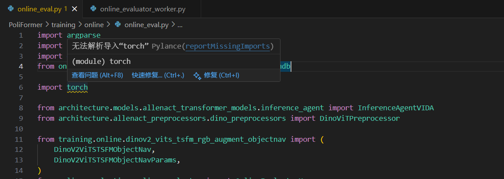

### 项目结构

```text
PoliFormer/
├── README.md                         # 项目介绍、数据/训练/评测与环境变量
├── TRAINING_README.md                # 训练/评测命令与自定义模型规范
├── pyproject.toml                    # black/isort/构建后端配置
├── requirements.txt                  # 精简依赖（torch、lightning、xformers、open-clip）
├── spoc_constants.py                 # 项目根路径常量
├── docker/
│   ├── Dockerfile
│   ├── README.md
│   ├── create_image.sh
│   └── create_session.sh
├── architecture/                     # 模型与预处理
│   ├── agent.py                      # 在线评测 Agent 封装
│   ├── allenact_preprocessors/
│   │   └── dino_preprocessors.py     # DINO 特征预处理
│   └── models/
│       └── allenact_transformer_models/
│           ├── allenact_dino_transformer.py  # DINO + Transformer 模型
│           └── inference_agent.py            # 推理专用 Agent
├── environment/                      # 环境传感器与机器人封装
│   ├── navigation_sensors.py
│   ├── vision_sensors.py
│   ├── manipulation_sensors.py
│   ├── stretch_state.py
│   ├── stretch_controller.py
│   └── spoc_objects.py
├── tasks/                            # 任务定义与采样器
│   ├── abstract_task.py
│   ├── abstract_task_sampler.py
│   ├── multi_task_eval_sampler.py
│   ├── object_nav_task.py
│   └── task_specs.py
├── training/
│   └── online/                       # 在线训练与评测
│       ├── base.py
│       ├── allenact_trainer.py
│       ├── chores_dataset.py
│       ├── dataset_mixtures.py
│       ├── dinov2_vits_tsfm_rgb_augment_objectnav.py  # 训练入口脚本
│       ├── online_eval.py                             # 评测入口脚本
│       ├── reward/
│       │   └── reward_shaper.py
│       └── third_party_models/
│           └── llama/
│               └── model.py
├── online_evaluation/                # 在线评测框架
│   ├── online_evaluator.py
│   ├── online_evaluator_worker.py
│   ├── online_evaluation_types_and_utils.py
│   ├── max_episode_configs.py
│   └── local_logging_utils.py
├── utils/                            # 辅助工具集合
│   ├── bbox_utils.py
│   ├── data_utils.py
│   ├── detic_utils.py
│   ├── distance_calculation_utils.py
│   ├── local_logging.py
│   ├── nn_utils.py
│   ├── objaverse_annotation.py
│   ├── sel_utils.py
│   ├── sensor_constant_utils.py
│   ├── string_utils.py
│   ├── task_datagen_utils.py
│   ├── task_sampler_utils.py
│   ├── task_spec_to_instruction.py
│   ├── task_type_mapping_utils.py
│   ├── transformation_util.py
│   ├── type_utils.py
│   ├── visualization_utils.py
│   ├── wandb_logging.py
│   ├── wandb_utils.py
│   ├── synset_to_best_lemma.json
│   ├── constants/
│   │   ├── objaverse_data_dirs.py
│   │   ├── object_constants.py
│   │   ├── stretch_initialization_utils.py
│   │   └── template_verbs.py
│   └── data_generation_utils/
│       ├── exception_utils.py
│       ├── loc_grid_conversion.py
│       ├── mp4_utils.py
│       └── navigation_utils.py
├── scripts/                          # 数据/权重下载脚本
│   ├── download_training_data.py
│   ├── download_objaverse_houses.py
│   └── download_trained_ckpt.py
├── models/
│   └── flan-t5-small/                # HF 权重与 tokenizer
│       ├── config.json
│       ├── tokenizer.json
│       └── pytorch_model.bin ...
├── data/                             # 训练/评测数据（体量大，不逐文件展开）
│   ├── fifteen/
│   ├── objaverse_assets/
│   └── objaverse_houses/
├── checkpoints/                      # 预训练权重
│   ├── text_nav/model.ckpt
│   ├── box_nav/model.ckpt
│   └── text_box_nav/model.ckpt
├── result/                           # 训练/评测输出
│   ├── training/ ...
│   └── OnlineEval-training_run_id=.../
├── wordnet2022/                      # WordNet 词库
│   ├── data.noun
│   ├── index.noun
│   └── ...
├── src/
│   └── clip/                         # OpenAI CLIP 第三方仓库（完整）
├── allenact/                         # AllenAct 框架副本（完整）
├── Detic/                            # 目标检测仓库（完整）
└── dinov2/                           # 视觉表征仓库（完整）
```

#### 1. training/online/online_eval.py

##### 训练流程

​		入口脚本 [online_eval.py](vscode-file://vscode-app/d:/Microsoft VS Code/resources/app/out/vs/code/electron-browser/workbench/workbench.html) 解析命令行参数 → 构建 [OnlineEvaluatorManager](vscode-file://vscode-app/d:/Microsoft VS Code/resources/app/out/vs/code/electron-browser/workbench/workbench.html)（评估调度器）→ 给它一个 Agent 类 `InferenceAgentVIDA` 和构造参数 → 调度器按任务样本把工作分发到一个或多个“评估 Worker 进程”（[online_evaluator_worker.py](vscode-file://vscode-app/d:/Microsoft VS Code/resources/app/out/vs/code/electron-browser/workbench/workbench.html)）→ 每个 Worker 在 AI2-THOR 仿真器中跑若干条 Episode：取观测→Agent 出动作→环境步进→收集帧与指标 → 回传主进程 → 主进程按任务/类别聚合并用本地 W&B（`LocalWandb`）记录指标与视频表格，最终输出到 `--output_basedir`。

在本地“wandb”日志中会记录什么


##### Wandb中的内容

LocalWandb 会把 evaluator 生成的所有表格与度量用“键值对 + PrettyTable”的形式写入 [wandb//logs.txt](vscode-file://vscode-app/d:/Microsoft VS Code/resources/app/out/vs/code/electron-browser/workbench/workbench.html)，包括：

- 数据分布统计表：`DataStat/{task_type}/{key}`（比如 synsets、room_types、reference_synsets 等计数表）
- 每任务聚合表：`AggregatedResults/{task_type}`
- 按对象类型聚合表：`PerObjectType/{task_type}`
- 跨任务总表：`FullAggregatedResults`
- 视频表：`VideoTable/{task_type}`（行内包含本地 `mp4` 路径、俯视图 `png` 路径及若干辅助字段）

注意：LocalWandb 的 [Video(...)](vscode-file://vscode-app/d:/Microsoft VS Code/resources/app/out/vs/code/electron-browser/workbench/workbench.html)、[Image(...)](vscode-file://vscode-app/d:/Microsoft VS Code/resources/app/out/vs/code/electron-browser/workbench/workbench.html) 返回的是“文件路径字符串”，不会上传到远端服务，都会写进 `logs.txt`。


online_eval用 AI2-THOR/ProcTHOR 的仿真器进行在线评估；任务样本来自 VIDA/SPOC 数据集，环境由 `PoliFormer/environment/stretch_controller.py` 驱动，使用云渲染渲染观测帧。


##### Episode的含义

- Episode 包含哪些要素
  - 房屋场景与起点
    - 从房屋集里选定一个 house（ProcTHOR/Objaverse），并设置初始位姿；参考 [OnlineEvaluatorWorker.get_house/get_agent_starting_*](vscode-file://vscode-app/d:/Microsoft VS Code/resources/app/out/vs/code/electron-browser/workbench/workbench.html) 与 [MultiTaskSampler(...)](vscode-file://vscode-app/d:/Microsoft VS Code/resources/app/out/vs/code/electron-browser/workbench/workbench.html)。
  - 任务定义
    - 任务类型与目标文本，如 ObjectNav/Pickup 等，带有目标类别、目标对象 id 列表、专家最短长度等；见 [task.task_info](vscode-file://vscode-app/d:/Microsoft VS Code/resources/app/out/vs/code/electron-browser/workbench/workbench.html) 中的 [task_type/natural_language_spec/synsets/…/eval_info.expert_length](vscode-file://vscode-app/d:/Microsoft VS Code/resources/app/out/vs/code/electron-browser/workbench/workbench.html)。
  - 传感器
    - 至少包含导航/操作相机帧，可选目标检测 bbox、可见像素、当前房间 id 等；由 [get_extra_sensors()](vscode-file://vscode-app/d:/Microsoft VS Code/resources/app/out/vs/code/electron-browser/workbench/workbench.html) 与 `--input_sensors` 控制。
  - 最大步数
    - 来自 [MAX_EPISODE_LEN_PER_TASK[task_type\]](vscode-file://vscode-app/d:/Microsoft VS Code/resources/app/out/vs/code/electron-browser/workbench/workbench.html)，或命令行 `--max_eps_len` 强制覆盖

- Episode 的生命周期

  1. 取样本 → 构建 Task
     - [OnlineEvaluatorManager](vscode-file://vscode-app/d:/Microsoft VS Code/resources/app/out/vs/code/electron-browser/workbench/workbench.html) 把样本放入 [tasks_queue](vscode-file://vscode-app/d:/Microsoft VS Code/resources/app/out/vs/code/electron-browser/workbench/workbench.html)；
     - [OnlineEvaluatorWorker.distribute_evaluate](vscode-file://vscode-app/d:/Microsoft VS Code/resources/app/out/vs/code/electron-browser/workbench/workbench.html) 从队列取出一个样本，用 [MultiTaskSampler](vscode-file://vscode-app/d:/Microsoft VS Code/resources/app/out/vs/code/electron-browser/workbench/workbench.html) 在 AI2-THOR 中实例化出对应的任务与控制器。
  2. 循环交互（一步就是一次“Step”）
     - 取观测：[task.get_observations()](vscode-file://vscode-app/d:/Microsoft VS Code/resources/app/out/vs/code/electron-browser/workbench/workbench.html)，筛选 `--input_sensors` 指定的键；
     - 决策：`agent.get_action(observations, goal)` 输出动作及分布；
     - 执行：[task.step_with_action_str(action)](vscode-file://vscode-app/d:/Microsoft VS Code/resources/app/out/vs/code/electron-browser/workbench/workbench.html) 在仿真器里推进一步；
     - 记录：叠加 bbox/文字等，生成一帧可视化视频；见 [evaluate_on_task(...)](vscode-file://vscode-app/d:/Microsoft VS Code/resources/app/out/vs/code/electron-browser/workbench/workbench.html)。
  3. 终止条件
     - [task.is_done()](vscode-file://vscode-app/d:/Microsoft VS Code/resources/app/out/vs/code/electron-browser/workbench/workbench.html) 为真（通常是到达目标并执行结束动作）；或达到最大步数 [task.max_steps](vscode-file://vscode-app/d:/Microsoft VS Code/resources/app/out/vs/code/electron-browser/workbench/workbench.html)；
     - 若传了 `--skip_done`，遇到 `done/end` 会改成 `sub_done` 以避免过早结束。
  4. 成功判定与指标
     - 成功与否：[task.is_successful()](vscode-file://vscode-app/d:/Microsoft VS Code/resources/app/out/vs/code/electron-browser/workbench/workbench.html)（依任务类型内部判定；Pickup/FETCH 还会看 [TargetObjectWasPickedUp](vscode-file://vscode-app/d:/Microsoft VS Code/resources/app/out/vs/code/electron-browser/workbench/workbench.html) 传感器）；
     - 指标：[eps_len](vscode-file://vscode-app/d:/Microsoft VS Code/resources/app/out/vs/code/electron-browser/workbench/workbench.html)（步数）、[success](vscode-file://vscode-app/d:/Microsoft VS Code/resources/app/out/vs/code/electron-browser/workbench/workbench.html)、`sel`（效率：相对专家路径）、`percentage_collision`、房间访问、可见像素等；见 [calculate_metrics(...)](vscode-file://vscode-app/d:/Microsoft VS Code/resources/app/out/vs/code/electron-browser/workbench/workbench.html)。
     - 可能附带按对象的细粒度指标 `extra/{object}/...`，用于后续“PerObjectType”表。

  5. 产物与上报

     - 若样本被标注为需要视频（节省开销只挑部分样本），把帧写成 mp4、top-down 俯视图写成 png；

     - 将 `(metrics, 视频/图信息)` 放入 [results_queue](vscode-file://vscode-app/d:/Microsoft VS Code/resources/app/out/vs/code/electron-browser/workbench/workbench.html)，主进程做聚合与本地 W&B 记录；见 [log_results](vscode-file://vscode-app/d:/Microsoft VS Code/resources/app/out/vs/code/electron-browser/workbench/workbench.html) 与 [log_aggregated_results](vscode-file://vscode-app/d:/Microsoft VS Code/resources/app/out/vs/code/electron-browser/workbench/workbench.html)。


   

### 训练模型

```bash
python training/online/dinov2_vits_tsfm_rgb_augment_objectnav.py train \
	--num_train_processes NUM_OF_TRAIN_PROCESSES \
	--output_dir PATH_TO_RESULT \
	--dataset_dir PATH_TO_DATASET
```


### 使用预训练模型进行评估 


`1.下载与训练的ckpt模型：`

```bash
python scripts/download_trained_ckpt.py --save_dir checkpoints
```

`2.使用文本导航模型运行评估:`

```bash
# 模板
python training/online/online_eval.py \
	--output_basedir PATH_TO_RESULT \
	--num_workers NUM_WORKERS \
	--ckpt_path ckpt/text_nav/model.ckpt \ 
	--training_tag text-nav \
	--house_set objaverse \
	--gpu_devices 0 1 2 3 4 5 6 7
```

```bash
python training/online/online_eval.py \
	--output_basedir result/text_nav \
    --num_workers 2 \
    --ckpt_path checkpoints/text_nav/model.ckpt \
    --training_tag text-nav \
    --house_set objaverse \
    --gpu_devices 0
```

`3.使用纯 box-nav 模型运行评估： `

```bash
python training/online/online_eval.py \
	--output_basedir result/box_nav \
	--num_workers 2 \
	--ckpt_path checkpoints/box_nav/model.ckpt \
	--training_tag text-nav \
	--house_set objaverse \
	--gpu_devices 0 \
	--input_sensors raw_navigation_camera nav_task_relevant_object_bbox nav_accurate_object_bbox \
	--ignore_text_goal
```

`4. 使用文本框导航模型运行评估：`

```bash
python training/online/online_eval.py \
	--output_basedir result/text_box_nav \
	--num_workers 2 \
	--ckpt_path checkpoints/text_box_nav/model.ckpt \
	--training_tag text-nav \
	--house_set objaverse \
	--gpu_devices 0 \
	--input_sensors raw_navigation_camera nav_task_relevant_object_bbox nav_accurate_object_bbox
```


### 附录

#### 1. 环境安装

```markdown
# requirements.txt  start
flake8==3.9.2
mypy==1.2.0
black==23.3.0
pytest==7.1.1
pytest-xdist
flaky
invoke==2.0.0
attrs
prior
stringcase
nltk @ git+https://github.com/nltk/nltk@582e6e35f0e6c984b44ec49dcb8846d9c011d0a8
phonemizer==3.1.1
networkx==2.8.7
numpy-quaternion==2022.4.1
tensorboardx==2.3
setproctitle==1.3.1
moviepy==2.1.1 
filelock==3.19.1
phonemizer # 3.1.1
invoke  # 2.0.0
prior   # 1.0.3
attrs>=21.4.0 # 25.4.0
wheel>=0.36.2 # 0.45.1
numpy==1.26.4  # 1.26.4
matplotlib>=3.3.1
opencv-python==4.10.0.82
scipy==1.11.1
canonicaljson==1.6.5
plotly==5.18.0
shapely==1.8.5
h5py==3.10.0
pyquaternion==0.9.9
omegaconf==2.2.3
boto3==1.40.50
petname==2.1
wget==3.1
pandas==2.1.3
python-sat==1.8.dev24
python-fcl==0.7.0.8
wandb==0.17.6
scikit-video==1.1.10
nbformat==5.10.4
pre-commit==4.2.0
black==23.3.0
scikit-image==0.22.0
torchmetrics==1.7.3
av==13.1.0
shortuuid==1.0.3
transformers==4.39.3
ipdb==0.13.11
prettytable==3.13.0
fire==0.7.1
decorator==4.4.2
timeout-decorator==0.4.1
objathor==0.0.5
xformers==0.0.23.post1
torchvision==0.16.2
lightning
open-clip-torch
-e git+https://github.com/openai/CLIP.git@a1d071733d7111c9c014f024669f959182114e33#egg=clip
swing

# requirements.txt  end

# 这两个会报错
-e "git+https://github.com/allenai/allenact.git@d055fc9d4533f086e0340fe0a838ed42c28d932e#egg=allenact&subdirectory=allenact"
-e "git+https://github.com/allenai/allenact.git@d055fc9d4533f086e0340fe0a838ed42c28d932e#egg=allenact_plugins[all]&subdirectory=allenact_plugins"

# 上边这两个可以通过如下命令执行
1. git clone https://github.com/allenai/allenact.git
2. cd allenact
3. git checkout d055fc9d4533f086e0340fe0a838ed42c28d932e
4. pip install --use-pep517 -e .  # 在allenact/allenact下执行这个命令
5. cd /allenact/allenact_plugins
6. pip install --use-pep517 -e . 

pip install --extra-index-url https://ai2thor-pypi.allenai.org ai2thor==0+966bd7758586e05d18f6181f459c0e90ba318bec
pip install --extra-index-url https://miropsota.github.io/torch_packages_builder detectron2==0.6+864913fpt2.1.2cu121
git clone https://github.com/facebookresearch/Detic.git --recurse-submodules && cd Detic && $pip install -r requirements.txt && mkdir models && wget --no-check-certificate https://dl.fbaipublicfiles.com/detic/Detic_LCOCOI21k_CLIP_SwinB_896b32_4x_ft4x_max-size.pth -O models/Detic_LCOCOI21k_CLIP_SwinB_896b32_4x_ft4x_max-size.pth

pip install --extra-index-url https://ai2thor-pypi.allenai.org ai2thor==0+966bd7758586e05d18f6181f459c0e90ba318bec
pip install --extra-index-url https://miropsota.github.io/torch_packages_builder detectron2==0.6+864913fpt2.1.2cu121
cd DETIC_PATH && git clone https://github.com/facebookresearch/Detic.git --recurse-submodules && cd Detic && $pip install -r requirements.txt && mkdir models && wget --no-check-certificate https://dl.fbaipublicfiles.com/detic/Detic_LCOCOI21k_CLIP_SwinB_896b32_4x_ft4x_max-size.pth -O models/Detic_LCOCOI21k_CLIP_SwinB_896b32_4x_ft4x_max-size.pth
```

#### 2. 下载数据集

```bash
python -m scripts.download_training_data --save_dir data --types fifteen
python -m objathor.dataset.download_annotations --version 2023_07_28 --path /path/to/objaverse_assets
python -m objathor.dataset.download_assets --version 2023_07_28 --path /path/to/objaverse_assets
python -m scripts.download_objaverse_houses --save_dir /path/to/objaverse_houses --subset val
python -m scripts.download_objaverse_houses --save_dir /path/to/objaverse_houses --subset train
```

#### 3. 设置环境变量

```bash
export PYTHONPATH=/home/jitl/PoliFormer
export OBJAVERSE_HOUSES_DIR=/home/jitl/PoliFormer/data/objaverse_houses/houses_2023_07_28
export OBJAVERSE_DATA_DIR=/home/jitl/PoliFormer/data/objaverse_assets/2023_07_28
export DETIC_REPO_PATH=/home/jitl/PoliFormer/Detic
export ALLENACT_DEBUG=True
export ALLENACT_DEBUG_VST_TIMEOUT=2000
export WANDB_DIR=/home/jitl/PoliFormer/wandb_dir
export TORCH_HUB_OFFLINE=1
```


### 运行中的警告信息

#### 1 

```python
WARNING:py.warnings:/home/jitl/anaconda3/envs/poliformer_copy/lib/python3.10/site-packages/torchvision/transforms/functional.py:1603: UserWarning: The default value of the antialias parameter of all the resizing transforms (Resize(), RandomResizedCrop(), etc.) will change from None to True in v0.17, in order to be consistent across the PIL and Tensor backends. To suppress this warning, directly pass antialias=True (recommended, future default), antialias=None (current default, which means False for Tensors and True for PIL), or antialias=False (only works on Tensors - PIL will still use antialiasing). This also applies if you are using the inference transforms from the models weights: update the call to weights.transforms(antialias=True).
  warnings.warn(
```

这是一个“即将变更默认行为”的提醒，

- 含义：
  - 在 torchvision v0.17 起，所有缩放相关变换（Resize、RandomResizedCrop 等）的 antialias 参数默认值会从 None 改为 True。
  - 当前版本里，antialias=None 表示：
    - 对 Tensor 后端等同于 False（不抗锯齿）
    - 对 PIL 后端等同于 True（抗锯齿）
  - 为了统一，未来会默认 True（无论是 PIL 还是 Tensor）。

- 影响：
  - 仅影响图像缩放的插值细节，可能让结果更平滑，数值上略有差异。训练/评估复现时要注意这一点。
- 处理方法：
  - 在你自己的变换中显式指定 antialias，消除警告并固定行为：
    - 推荐：antialias=True
      - transforms.Resize((224, 224), antialias=True)
      - transforms.RandomResizedCrop(224, antialias=True)
  - 若使用预训练权重自带的 transforms，调用时也加：
    - weights.transforms(antialias=True)

#### 2. 无法解析导入某个包

`Ctrl + Shift + P` 打开VSCode命令面板，输入“Python: Select Interpreter”，选择解释器为当前的环境