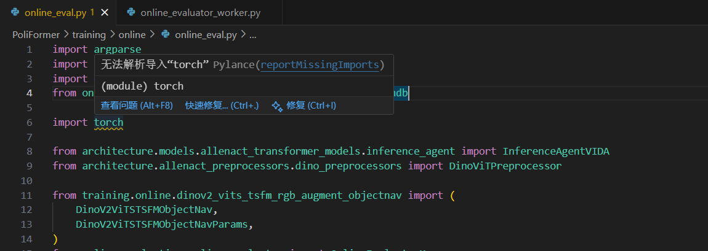
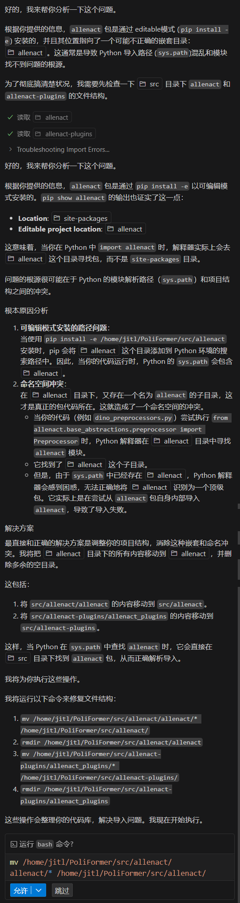

# PoliFormer

> PoliFormer 是一个基于 Transformer 的强化学习项目，专注于机器人导航任务，特别是对象导航（Object Navigation）。该项目使用 AllenAct 框架、DINO 视觉编码器和 LLaMA 风格的 Transformer 来训练强大的导航代理。

### 项目结构树

```text
PoliFormer/
├── architecture/ # 【模型架构核心】存放构成 PoliFormer “大脑”的神经网络模型代码。
│   ├── agent.py # 提供一个智能体（Agent）的蓝图（抽象基类），确保所有具体的智能体都有统一的接口。
│   ├── allenact_preprocessors/ # 将原始的环境观测数据（如图像）转换成模型可以处理的特征向量。
│   │   └── dino_preprocessors.py # 将摄像头捕捉的原始图像通过 DINOv2 模型转换成机器能够理解的视觉特征向量，是模型“看懂”世界的第一步。
│   └── models/ # 存放构成策略核心的 PyTorch 神经网络模块。
│       └── allenact_transformer_models/ # 存放基于 Transformer 架构的模型。
│           └── inference_agent.py # 【评估时的大脑】在评估时加载训练好的模型，根据当前的视觉和文本输入，做出下一步该执行什么动作的决策。
│
├── ckpt/ # 【模型权重】保存训练好的模型权重，方便后续进行评估或继续训练。
│   ├── box_nav/ # 存放用于“盒子导航”任务的模型。
│   │   └── model.ckpt # 一个具体的模型权重文件，可以直接加载使用。
│   ├── text_box_nav/ # 存放用于“带文本指令的盒子导航”任务的模型。
│   │   └── model.ckpt # 模型权重文件
│   └── text_nav/ # 存放用于“带文本指令的物体导航”任务的模型。
│   │   └── model.ckpt # 模型权重文件
│
├── data/ # 【数据集】存放模型训练和评估所需要的所有数据。
│   ├── fifteen/ # 作为一个数据集的版本标识，区分不同批次或预处理方式的数据。
│   │   └── ObjectNavType/ # 存放所有与“物体导航”任务相关的数据。
│   │       ├── train/ # 存放用于模型训练的任务实例。
│   │       │   └── 000001.jsonl.gz # 以流式友好的格式存储了成千上万个训练任务，每个任务描述了场景、目标和初始条件。
│   │       ├── val/ # 存放用于在训练中途验证模型性能的任务实例。
│   │       └── minival/ # 存放一个极小规模的验证集，用于快速运行测试以确保代码的正确性。
│   ├── nltk_data/ # 为自然语言处理工具 NLTK 提供必要的词典和模型数据。
│   ├── objaverse_assets/ # 存放 Objaverse 数据集中的 3D 物体模型文件。
│   └── objaverse_houses/ # 存放 Objaverse 数据集中生成的房屋场景布局文件。
│
├── docker/ # 【环境容器化】提供一键构建和启动项目所需运行环境的能力。
│   ├── Dockerfile # 提供一份构建说明书，让 Docker 可以自动创建一个包含所有依赖的隔离环境。
│   ├── create_image.sh # 运行此脚本可以方便地构建 Docker 镜像。
│   └── create_session.sh # 运行此脚本可以快速启动一个配置好的 Docker 容器，并进入其中开始工作。
│
├── environment/ # 【环境交互接口】作为代码与 AI2-THOR 模拟器之间的桥梁，实现对虚拟机器人和环境的控制。
│   ├── stretch_controller.py # 封装了底层的模拟器指令，提供了更直观的机器人动作接口（如 `move_ahead`）。
│   ├── navigation_sensors.py # 为机器人增加导航相关的“感知”能力，比如判断自己当前在哪个房间。
│   ├── manipulation_sensors.py # 为机器人增加与物体交互相关的“感知”能力，比如判断目标物体是否已被抓取。
│   ├── vision_sensors.py # 为机器人增加高级视觉“感知”能力，比如从图像中检测并定位目标物体。
│   └── spoc_objects.py # 存储 SPOC 任务中涉及的物体信息。
│
├── google/ # 存放从 Google 下载的预训练语言模型。
│   └── flan-t5-small/ # 存放 Flan-T5-small 语言模型文件，PoliFormer 用它来“理解”用户的自然语言指令。
│
├── online_evaluation/ # 【在线评估框架】组织和执行对训练好的模型的性能测试。
│   ├── online_evaluator.py # 作为评估流程的“总指挥”，负责启动、管理和汇总所有并行的评估任务。
│   └── online_evaluator_worker.py # 作为评估流程的“工人”，在独立的进程中实际运行每一个评估任务，并记录结果。
│
├── result/ # 【评估输出】存放所有评估任务产生的视频、日志和性能数据。
│   └── 1108/ # 存放某一次特定评估运行的所有产出物。
│       └── ... # 包含视频录像、动作序列、性能指标等，用于后续的分析和展示。
│
├── scripts/ # 【辅助工具】提供各种方便开发的辅助脚本。
│   ├── download_objaverse_houses.py # 自动从网络下载 Objaverse 房屋数据。
│   ├── download_trained_ckpt.py # 自动从网络下载官方发布的预训练模型。
│   └── auto_format.sh # 一键对整个项目进行代码格式化，保持代码风格统一。
│
├── src/ # 【第三方源码】存放项目依赖的第三方库的源代码，以便进行定制化修改或锁定特定版本。
│   ├── allenact/ # 存放 AllenAct 框架的源代码。
│   ├── clip/ # 存放 CLIP 模型的源代码。
│   ├── Detic/ # 存放 Detic 物体检测模型的源代码。
│   └── dinov2/ # 存放 DINOv2 视觉模型的源代码。
│
├── tasks/ # 【任务定义】精确描述智能体需要完成的目标、成功标准和环境交互规则。
│   ├── __init__.py # 注册所有可用的任务类型，让系统知道有哪些任务可以执行。
│   ├── abstract_task.py # 提供一个任务的模板（抽象基类），确保所有具体的任务都有统一的结构和接口。
│   ├── object_nav_task.py # 具体实现了“物体导航”任务的成功条件、奖励计算和性能指标。
│   └── abstract_task_sampler.py # 从数据文件中挑选一个任务，并在模拟器中设置好场景，为智能体准备一个“待命”的任务环境。
│
├── training/ # 【训练框架】组织和执行模型的训练流程。
│   ├── online/ # 存放与在线训练和评估相关的配置。
│   │   ├── online_eval.py # **启动在线评估的入口**。运行此文件可以开始对一个已训练好的模型进行性能测试。
│   │   ├── dataset_mixtures.py # 提供了混合不同来源或类型的任务数据进行训练或评估的功能。
│   │   └── DinoV2ViTSTSFMObjectNav.py # **定义一个完整的训练实验**。它像一张配方，将模型、任务、优化器等所有部分组合在一起，构成一个可以被 AllenAct 框架运行的训练单元。
│   └── ...
│
├── utils/ # 【通用工具】存放项目中被多个模块共享的工具函数。
│   ├── bbox_utils.py # 提供处理物体边界框的计算功能。
│   ├── convert_bpe_dictionary_to_json.py # 将动作名称转换为模型内部使用的编码格式。
│   ├── local_logging.py # 在本地模拟 Weights & Biases 的功能，方便离线调试和记录实验。
│   ├── visualization_utils.py # 提供将数据显示为图像或视频的功能，例如生成俯瞰地图。
│   └── ...
│
└── wandb/ # 【日志缓存】作为 Weights & Biases 的本地缓存区，临时存放实验数据，待网络连接后同步到云端。
├── LICENSE # 规定了项目代码的使用和分发条款。
├── mypy.ini # 配置 MyPy 工具，在编码阶段就检查代码中的类型错误，提高代码质量。
├── pyproject.toml # 管理项目的元数据、构建系统和开发工具（如代码格式化器）的配置。
├── pytest.ini # 配置 Pytest 测试框架，指定测试的执行方式和范围。
├── README.md # 提供项目的整体介绍、安装步骤和基本用法，是新用户的第一站。
├── requirements.txt # 列出项目运行所需的所有 Python 依赖包，用于一键安装环境。
├── spoc_constants.py # 存放 SPOC (Semantic Pick-and-Place Object Challenge) 基准测试中用到的所有固定值，如物体名称、场景参数等。
├── TRAINING_README.md # 提供专门针对模型训练的详细指南，解释如何准备数据、设置参数和启动训练任务。
```

### 数据集结构树

```text
/home/jitl/PoliFormer/data
├── fifteen/
│   └── ObjectNavType/
│       ├── .lock
│       ├── constants.yaml
│       ├── house_id_to_sub_house_id_train.json
│       ├── house_id_to_sub_house_id_val.json
│       ├── train/
│       │   ├── 000001/
│       │   │   ├── hdf5_sensors.hdf5
│       │   │   ├── raw_manipulation_camera__0.mp4
│       │   │   ├── raw_manipulation_camera__1.mp4
│       │   │   ├── … (manipulation camera 分段视频，编号0–9)
│       │   │   ├── raw_navigation_camera__0.mp4
│       │   │   ├── raw_navigation_camera__1.mp4
│       │   │   ├── … (navigation camera 分段视频，编号0–9)
│       │   │   └── success.txt
│       │   ├── 000002/
│       │   ├── 000004/
│       │   ├── … (大量六位数字ID目录，每个结构与 000001 类似)
│       └── val/
│           ├── 000018/
│           ├── 000027/
│           ├── 000028/
│           ├── … (验证集同样由大量六位数字ID目录组成)
├── nltk_data/
│   └── corpora/
│       ├── wordnet/        (展开后的 WordNet 语义词典目录)
│       ├── wordnet.zip     (压缩包原文件，可能保留用于重复构建或校验)
│       ├── wordnet2022/    (新版或扩展版 WordNet 2022 版本解压目录)
│       ├── wordnet2022.zip (2022版压缩包)
├── objaverse_assets/
│   └── 2023_07_28/
│       ├── annotations.json.gz
│       ├── annotations.lock
│       ├── assets/         (实际 3D 资源文件：如 .glb/.obj/贴图 等，未深入列出)
│       └── objects.lock
└── objaverse_houses/
    └── houses_2023_07_28/
        ├── hdf5_sensors.hdf5
        ├── raw_manipulation_camera__0.mp4
        ├── … (与 train/000001 示例结构一致的多段操作/导航视频)
        ├── raw_navigation_camera__0.mp4
        └── success.txt
```


### 在线评估（online_eval.py）

##### 评估流程

​		入口脚本 [online_eval.py](vscode-file://vscode-app/d:/Microsoft VS Code/resources/app/out/vs/code/electron-browser/workbench/workbench.html) 解析命令行参数 → 构建 [OnlineEvaluatorManager](vscode-file://vscode-app/d:/Microsoft VS Code/resources/app/out/vs/code/electron-browser/workbench/workbench.html)（评估调度器）→ 给它一个 Agent 类 `InferenceAgentVIDA` 和构造参数 → 调度器按任务样本把工作分发到一个或多个“评估 Worker 进程”（[online_evaluator_worker.py](vscode-file://vscode-app/d:/Microsoft VS Code/resources/app/out/vs/code/electron-browser/workbench/workbench.html)）→ 每个 Worker 在 AI2-THOR 仿真器中跑若干条 Episode：取观测→Agent 出动作→环境步进→收集帧与指标 → 回传主进程 → 主进程按任务/类别聚合并用本地 W&B（`LocalWandb`）记录指标与视频表格，最终输出到 `--output_basedir`。

在本地“wandb”日志中会记录什么


——————

#### 三种模型权重文件解释

这三个模型 (`box_nav`, `text_box_nav`, `text_nav`) 代表了三种不同难度和能力的导航任务

##### 1.`box_nav`(盒子导航模型)

- 这个模型的作用是**在没有自然语言指令的情况下，导航到一个预定义的目标区域（通常是一个“盒子”或一个点）**。

- 输入与输出：
  - **输入**: 主要是**视觉信息**（来自摄像头的图像）。它**不接收**文本指令。目标的位置通常是固定的或通过坐标在任务开始时就已设定好。
  - **输出**: 一系列的导航动作（如前进、左转、右转）。
- 在项目中的意义:
  - **建立导航基线 (Baseline)**: 这是最纯粹的导航任务，用于测试模型的基础移动和探索能力。它的性能代表了模型在没有语言理解和物体识别干扰下的导航上限。
  - **调试与预训练**: 作为一个更简单的任务，它可以用来快速调试导航策略或作为更复杂任务的预训练阶段。如果模型连这个任务都做不好，那么更复杂的任务肯定也无法完成。

简单来说，box_nav 模型只负责“移动”，它被告知要去一个地方，然后它就去，但它不知道那个地方在语言上叫什么。

##### 2. `text_nav` (文本指令物体导航模型)

- 这个模型的作用是**根据自然语言指令，在复杂的家庭环境中寻找并导航到一个特定的物体**。这是 PoliFormer 项目要解决的核心任务，也常被称为“Object Goal Navigation” (ObjectNav)。
- 输入与输出:
  - **输入**: **视觉信息** + **自然语言指令**（例如，"find a television" 或 "去找到一个苹果"）。
  - **输出**: 一系列的导航动作。
- 在项目中的意义:
  - **最终目标模型**: 这是项目的“完全体”模型，展示了 PoliFormer 的全部能力——融合视觉感知、语言理解和自主导航。
  - **评估核心能力**: 这个模型的性能直接反映了项目在解决通用、语义化家庭机器人任务上的成功程度。它需要模型不仅能移动，还要能“看懂”世界（识别物体）并“听懂”指令（理解文本）。

简单来说，text_nav 模型既要负责“移动”，又要负责“理解”，它需要根据“找到苹果”这条指令，在环境中识别出哪个是苹果，并规划路径走过去。


##### 3. `text_box_nav` (文本指令盒子导航模型)

- 这个模型的作用是**根据自然语言指令，导航到一个目标区域（盒子）**。
- 输入与输出:
  - **输入**: **视觉信息** + **自然语言指令**（例如，"go to the box" 或 "去那个盒子的位置"）。
  - **输出**: 一系列的导航动作。
- 在项目中的意义:
  - **解耦语言理解与物体识别**: 这个任务非常巧妙。与 `text_nav` 相比，它同样需要理解语言指令，但它把复杂的“识别任意物体”的任务简化为了“识别一个简单的盒子”。
  - **消融实验**: 通过比较 `text_box_nav` 和 `text_nav` 的性能，研究人员可以分析出由“物体识别的难度”带来的性能损失。
  - **中间步骤**: 在课程学习中，这可以作为从 `box_nav` 到 `text_nav` 的一个中间训练阶段。先让模型学会在没有指令的情况下找盒子 (`box_nav`)，然后学会听指令找盒子 (`text_box_nav`)，最后再挑战听指令找任意物体 (`text_nav`)。

简单来说，text_box_nav 模型也要负责“移动”和“理解”，但它的“理解”任务被简化了。它只需要听懂指令去“一个地方”，而不需要关心那个地方的物体长什么样。

| 模型名称       | 导航能力 | 语言理解能力 | 物体识别能力   | 任务示例           |
| -------------- | -------- | ------------ | -------------- | ------------------ |
| `box_nav`      | ✅        | ❌            | ❌              | 去坐标 (x,y)       |
| `text_box_nav` | ✅        | ✅            | ❌ (简化为盒子) | “去那个盒子的位置” |
| `text_nav`     | ✅        | ✅            | ✅              | “找到一个苹果”     |


#### online_eval.py


##### Wandb中的内容

LocalWandb 会把 evaluator 生成的所有表格与度量用“键值对 + PrettyTable”的形式写入 [wandb//logs.txt](vscode-file://vscode-app/d:/Microsoft VS Code/resources/app/out/vs/code/electron-browser/workbench/workbench.html)，包括：

- 数据分布统计表：`DataStat/{task_type}/{key}`（比如 synsets、room_types、reference_synsets 等计数表）
- 每任务聚合表：`AggregatedResults/{task_type}`
- 按对象类型聚合表：`PerObjectType/{task_type}`
- 跨任务总表：`FullAggregatedResults`
- 视频表：`VideoTable/{task_type}`（行内包含本地 `mp4` 路径、俯视图 `png` 路径及若干辅助字段）

注意：LocalWandb 的 [Video(...)](vscode-file://vscode-app/d:/Microsoft VS Code/resources/app/out/vs/code/electron-browser/workbench/workbench.html)、[Image(...)](vscode-file://vscode-app/d:/Microsoft VS Code/resources/app/out/vs/code/electron-browser/workbench/workbench.html) 返回的是“文件路径字符串”，不会上传到远端服务，都会写进 `logs.txt`。


online_eval用 AI2-THOR/ProcTHOR 的仿真器进行在线评估；任务样本来自 VIDA/SPOC 数据集，环境由 `PoliFormer/environment/stretch_controller.py` 驱动，使用云渲染渲染观测帧。


##### Episode的含义

- Episode 包含哪些要素
  - 房屋场景与起点
    - 从房屋集里选定一个 house（ProcTHOR/Objaverse），并设置初始位姿；参考 [OnlineEvaluatorWorker.get_house/get_agent_starting_*](vscode-file://vscode-app/d:/Microsoft VS Code/resources/app/out/vs/code/electron-browser/workbench/workbench.html) 与 [MultiTaskSampler(...)](vscode-file://vscode-app/d:/Microsoft VS Code/resources/app/out/vs/code/electron-browser/workbench/workbench.html)。
  - 任务定义
    - 任务类型与目标文本，如 ObjectNav/Pickup 等，带有目标类别、目标对象 id 列表、专家最短长度等；见 [task.task_info](vscode-file://vscode-app/d:/Microsoft VS Code/resources/app/out/vs/code/electron-browser/workbench/workbench.html) 中的 [task_type/natural_language_spec/synsets/…/eval_info.expert_length](vscode-file://vscode-app/d:/Microsoft VS Code/resources/app/out/vs/code/electron-browser/workbench/workbench.html)。
  - 传感器
    - 至少包含导航/操作相机帧，可选目标检测 bbox、可见像素、当前房间 id 等；由 [get_extra_sensors()](vscode-file://vscode-app/d:/Microsoft VS Code/resources/app/out/vs/code/electron-browser/workbench/workbench.html) 与 `--input_sensors` 控制。
  - 最大步数
    - 来自 [MAX_EPISODE_LEN_PER_TASK[task_type\]](vscode-file://vscode-app/d:/Microsoft VS Code/resources/app/out/vs/code/electron-browser/workbench/workbench.html)，或命令行 `--max_eps_len` 强制覆盖

- Episode 的生命周期

  1. 取样本 → 构建 Task
     - [OnlineEvaluatorManager](vscode-file://vscode-app/d:/Microsoft VS Code/resources/app/out/vs/code/electron-browser/workbench/workbench.html) 把样本放入 [tasks_queue](vscode-file://vscode-app/d:/Microsoft VS Code/resources/app/out/vs/code/electron-browser/workbench/workbench.html)；
     - [OnlineEvaluatorWorker.distribute_evaluate](vscode-file://vscode-app/d:/Microsoft VS Code/resources/app/out/vs/code/electron-browser/workbench/workbench.html) 从队列取出一个样本，用 [MultiTaskSampler](vscode-file://vscode-app/d:/Microsoft VS Code/resources/app/out/vs/code/electron-browser/workbench/workbench.html) 在 AI2-THOR 中实例化出对应的任务与控制器。
  2. 循环交互（一步就是一次“Step”）
     - 取观测：[task.get_observations()](vscode-file://vscode-app/d:/Microsoft VS Code/resources/app/out/vs/code/electron-browser/workbench/workbench.html)，筛选 `--input_sensors` 指定的键；
     - 决策：`agent.get_action(observations, goal)` 输出动作及分布；
     - 执行：[task.step_with_action_str(action)](vscode-file://vscode-app/d:/Microsoft VS Code/resources/app/out/vs/code/electron-browser/workbench/workbench.html) 在仿真器里推进一步；
     - 记录：叠加 bbox/文字等，生成一帧可视化视频；见 [evaluate_on_task(...)](vscode-file://vscode-app/d:/Microsoft VS Code/resources/app/out/vs/code/electron-browser/workbench/workbench.html)。
  3. 终止条件
     - [task.is_done()](vscode-file://vscode-app/d:/Microsoft VS Code/resources/app/out/vs/code/electron-browser/workbench/workbench.html) 为真（通常是到达目标并执行结束动作）；或达到最大步数 [task.max_steps](vscode-file://vscode-app/d:/Microsoft VS Code/resources/app/out/vs/code/electron-browser/workbench/workbench.html)；
     - 若传了 `--skip_done`，遇到 `done/end` 会改成 `sub_done` 以避免过早结束。
  4. 成功判定与指标
     - 成功与否：[task.is_successful()](vscode-file://vscode-app/d:/Microsoft VS Code/resources/app/out/vs/code/electron-browser/workbench/workbench.html)（依任务类型内部判定；Pickup/FETCH 还会看 [TargetObjectWasPickedUp](vscode-file://vscode-app/d:/Microsoft VS Code/resources/app/out/vs/code/electron-browser/workbench/workbench.html) 传感器）；
     - 指标：[eps_len](vscode-file://vscode-app/d:/Microsoft VS Code/resources/app/out/vs/code/electron-browser/workbench/workbench.html)（步数）、[success](vscode-file://vscode-app/d:/Microsoft VS Code/resources/app/out/vs/code/electron-browser/workbench/workbench.html)、`sel`（效率：相对专家路径）、`percentage_collision`、房间访问、可见像素等；见 [calculate_metrics(...)](vscode-file://vscode-app/d:/Microsoft VS Code/resources/app/out/vs/code/electron-browser/workbench/workbench.html)。
     - 可能附带按对象的细粒度指标 `extra/{object}/...`，用于后续“PerObjectType”表。

  5. 产物与上报

     - 若样本被标注为需要视频（节省开销只挑部分样本），把帧写成 mp4、top-down 俯视图写成 png；
- 将 `(metrics, 视频/图信息)` 放入 [results_queue](vscode-file://vscode-app/d:/Microsoft VS Code/resources/app/out/vs/code/electron-browser/workbench/workbench.html)，主进程做聚合与本地 W&B 记录；见 [log_results](vscode-file://vscode-app/d:/Microsoft VS Code/resources/app/out/vs/code/electron-browser/workbench/workbench.html) 与 [log_aggregated_results](vscode-file://vscode-app/d:/Microsoft VS Code/resources/app/out/vs/code/electron-browser/workbench/workbench.html)。


##### `architecture/models/allenact_transformer_models/inference_agent.py` 详解：

- 在整个 PoliFormer 项目中，这个文件扮演着**“评估时的大脑”**或**“决策执行官”**的角色。

PoliFormer 项目遵循典型的机器学习/强化学习工作流，分为训练（Training）和评估/推理（Inference/Evaluation）两个阶段。

- **训练阶段**：模型在大量的模拟环境中进行探索和学习，通过反复试错来优化其内部的“决策网络”（即 Actor-Critic 模型）。这个过程通常由 `allenact` 框架的训练管道管理，重点是梯度更新和策略优化。
- **评估阶段**：训练好的模型被加载进来，在一个“真实”的、未见过的任务中检验其性能。这个阶段不再进行学习或权重更新，只做纯粹的**前向传播（Forward Pass）**来生成决策。

`inference_agent.py` 专门服务于**评估**阶段。它定义了如何将一个已训练好的、静态的模型（存储在 `.ckpt` 文件中）包装成一个能够与模拟环境实时交互的、有状态的代理（Agent）。

其中的核心类`InferenceAgentVIDA` ：


### 2. 核心类 `InferenceAgentVIDA` 详解

这个类是整个文件的核心，继承自 AllenAct 框架的 `InferenceAgent`。我们来分解它的关键职责：

2.1. 实例化与初始化 (build_agent 类方法)

这是代理的“工厂方法”，也是评估流程的入口。当 `online_eval.py` 启动评估时，它会调用这个方法来创建代理实例。

- **加载模型**：它做的第一件事就是从指定的检查点路径 (`ckpt_path`) 加载模型的 `state_dict`。这相当于给代理的“大脑”装载上训练好的知识。
- 配置参数：它接收一系列评估专用的配置，例如：
  - [device](vscode-file://vscode-app/d:/Microsoft VS Code/resources/app/out/vs/code/electron-browser/workbench/workbench.html): 在哪个 GPU 上运行。
  - `greedy_sampling`: 是否总是选择概率最高的“贪心”动作。`True` 表示确定性评估，`False` 表示随机性评估，更能反映模型策略的探索能力。
  - `test_augmentation`: 是否在评估时也对输入的图像进行数据增强。这可以用来测试模型的鲁棒性。
- **设置预处理器**：它初始化了图像预处理器 `augmentations`，这个处理器负责将环境返回的原始图像（NumPy 数组）转换成模型需要的张量格式（Tensor）。

#### 2.2. 观测数据的处理与转换 ([get_action](vscode-file://vscode-app/d:/Microsoft VS Code/resources/app/out/vs/code/electron-browser/workbench/workbench.html) 和 `act` 方法)

这是代理的核心工作循环，体现了它如何“感知”世界并做出“决策”。

1. **接收原始观测 (get_action)**:

   - [online_evaluator_worker.py](vscode-file://vscode-app/d:/Microsoft VS Code/resources/app/out/vs/code/electron-browser/workbench/workbench.html) 在每个时间步调用 [agent.get_action()](vscode-file://vscode-app/d:/Microsoft VS Code/resources/app/out/vs/code/electron-browser/workbench/workbench.html)。
   - 它接收一个frame字典，包含了环境提供的所有原始信息，例如：
     - `raw_navigation_camera`: 导航相机看到的原始图像。
     - `manipulation_rgb_raw`: 机械臂相机看到的图像。
     - `natural_language_spec`: 用户的自然语言指令，如 "find a book"。
     - `an_object_is_in_hand`: 手中是否持有物体。
     - `nav_accurate_object_bbox`: 物体检测框。
     - `relative_arm_location_metadata`: 机械臂的相对位置和姿态。
   - 这个方法像一个数据整理员，将这些零散的信息打包成一个统一的 [observations](vscode-file://vscode-app/d:/Microsoft VS Code/resources/app/out/vs/code/electron-browser/workbench/workbench.html) 字典，并对部分数据进行初步处理（如将角度转为弧度）。

2. **预处理与模型输入 (act)**:

   - `batch_observations`: 将单个观测数据打包成一个批次（batch_size=1），以符合模型输入的要求。
   - `sensor_preprocessor_graph`: 这是 AllenAct 的一个强大功能。它是一个计算图，负责将原始观测数据（如图像）通过一系列预处理器（如 DINOv2 编码器）转换成模型真正需要的特征向量（Embeddings）。例如，`rgb_dino_vit` 就是通过这个图计算出来的。
   - **构建模型输入**: 将所有处理好的特征（图像特征、文本特征、状态特征等）组合成一个 [agent_input](vscode-file://vscode-app/d:/Microsoft VS Code/resources/app/out/vs/code/electron-browser/workbench/workbench.html)，准备送入 Actor-Critic 模型。

3. **生成动作 (act)**:

   - [self.actor_critic(**agent_input)](vscode-file://vscode-app/d:/Microsoft VS Code/resources/app/out/vs/code/electron-browser/workbench/workbench.html): 这是最关键的一步，调用底层的 Transformer 模型进行一次前向计算。

   - `actor_critic_output`: 模型返回一个包含动作分布（`distributions`）的对象。这个分布告诉我们，在当前状态下，执行每个可能动作的概率是多少。

   - 采样决策:

     - 如果是 `greedy_sampling`，就选择概率最高的动作 (`distributions.mode()`)。
- 否则，从概率分布中随机采样一个动作 (`distributions.sample()`)。
  
   - **动作转换**: 模型输出的是一个动作索引（一个数字），[get_action_list()](vscode-file://vscode-app/d:/Microsoft VS Code/resources/app/out/vs/code/electron-browser/workbench/workbench.html) 方法负责将这个索引映射回一个人类可读的动作字符串（如 `m-l`、[pickup](vscode-file://vscode-app/d:/Microsoft VS Code/resources/app/out/vs/code/electron-browser/workbench/workbench.html)）。这个映射关系来自于 `action_dict.json` 文件。

   - **返回结果**: 最终，`act` 方法返回两个值：选择的动作字符串和该动作的概率，供外部（[online_evaluator_worker.py](vscode-file://vscode-app/d:/Microsoft VS Code/resources/app/out/vs/code/electron-browser/workbench/workbench.html)）使用。

#### 2.3. 状态管理 ([reset](vscode-file://vscode-app/d:/Microsoft VS Code/resources/app/out/vs/code/electron-browser/workbench/workbench.html) 和 `memory`)

- **reset()**: 在每个新的评估任务（比如换了一个房子或目标）开始时被调用。它会清空代理的内部记忆（[self.memory](vscode-file://vscode-app/d:/Microsoft VS Code/resources/app/out/vs/code/electron-browser/workbench/workbench.html)）和步数计数器，确保每个任务都是从一个干净的状态开始。
- **self.memory**: 这是 Transformer 模型的内部状态，对于处理长序列任务至关重要。代理需要记住之前的观测和动作，才能做出连贯的决策。`memory` 在每一步都会被更新，并传递到下一步。
- **rollout_storage**: 这是 AllenAct 用于管理序列数据的内部机制，它存储了历史的观测、动作、奖励等信息，`inference_agent` 利用它来为模型准备正确的上下文输入。

### 3. 全局视角下的数据流

1. **online_eval.py** 启动评估，创建 **OnlineEvaluatorManager**。
2. `OnlineEvaluatorManager` 创建多个 **OnlineEvaluatorWorker** 进程，每个进程负责一个或多个评估任务。
3. 在每个 [worker](vscode-file://vscode-app/d:/Microsoft VS Code/resources/app/out/vs/code/electron-browser/workbench/workbench.html) 内部，[start_worker](vscode-file://vscode-app/d:/Microsoft VS Code/resources/app/out/vs/code/electron-browser/workbench/workbench.html) 函数调用 `InferenceAgentVIDA.build_agent()` 创建一个代理实例，加载训练好的模型。
4. [worker](vscode-file://vscode-app/d:/Microsoft VS Code/resources/app/out/vs/code/electron-browser/workbench/workbench.html) 的 [evaluate_on_task](vscode-file://vscode-app/d:/Microsoft VS Code/resources/app/out/vs/code/electron-browser/workbench/workbench.html) 方法开始一个任务循环：
   a. 从模拟环境（[task](vscode-file://vscode-app/d:/Microsoft VS Code/resources/app/out/vs/code/electron-browser/workbench/workbench.html)）获取原始观测数据。
   b. 调用 [agent.get_action(observations, goal_spec)](vscode-file://vscode-app/d:/Microsoft VS Code/resources/app/out/vs/code/electron-browser/workbench/workbench.html)。
   c. **InferenceAgentVIDA** 内部完成数据预处理、模型推理、动作采样，并返回一个动作字符串。
   d. [worker](vscode-file://vscode-app/d:/Microsoft VS Code/resources/app/out/vs/code/electron-browser/workbench/workbench.html) 将这个动作字符串发送给环境执行 ([task.step_with_action_str(action)](vscode-file://vscode-app/d:/Microsoft VS Code/resources/app/out/vs/code/electron-browser/workbench/workbench.html))。
   e. [worker](vscode-file://vscode-app/d:/Microsoft VS Code/resources/app/out/vs/code/electron-browser/workbench/workbench.html) 记录这个动作（用于我们之前实现的 JSON 保存功能）、视频帧等。
   f. 循环回到 a，直到任务结束。

### 总结

`inference_agent.py` 是连接**静态的、已训练的PoliFormer模型**与**动态的、交互式的模拟环境**之间的关键桥梁。它不关心模型是如何训练的，只专注于如何高效、正确地**使用**这个模型来完成任务。

可以把它想象成一个自动驾驶汽车的控制软件：

- **模型 (.ckpt)**：是训练好的驾驶策略神经网络。
- **InferenceAgentVIDA**：是车载计算机上运行的控制程序。
- **get_action**：负责从摄像头、GPS、雷达等传感器收集数据。
- **act**：负责将传感器数据处理后输入神经网络，然后根据网络输出的“转向/油门/刹车”指令，生成最终的控制命令。
- **online_evaluator_worker**：是测试工程师，他把车开到测试场地上，记录下全程表现。


### 模型的输入

模型的输入不是数据，而是以下几类数据：

- 任务描述（Text Goal）：一个自然语言字符串，例如“locate a vase”（找到花瓶）。这来自数据集中的样本（如[val.jsonl.gz](vscode-file://vscode-app/d:/Microsoft VS Code/resources/app/out/vs/code/electron-browser/workbench/workbench.html)中的一行），描述了代理需要完成的任务。
- 环境状态（Observations）：代理在模拟3D环境中观察到的实时数据，包括：
  - 导航相机图像（navigation camera）：俯视或前视的RGB图像，用于导航。
  - 操纵相机图像（manipulation camera）：近距离的RGB图像，用于精细操作（如拾取对象）。
  - 其他传感器数据：如对象边界框（bounding boxes）、当前房间ID、对象可见像素数等（如果启用检测器，如Detic）。
- 房屋布局和对象位置：从房屋数据（如`objaverse`房屋的JSON定义）加载，包括房间结构、对象ID、初始代理位置等
- 代理状态：如当前位置、朝向、是否持有对象等。

这些输入通过传感器（如`raw_navigation_camera`和`raw_manipulation_camera`）实时获取，代理使用视觉编码器（DinoV2）和文本编码器（T5/LLAMA）来处理它们。

**关键澄清**：没有“输入视频”。视频是**输出**，用于可视化执行过程。输入是任务文本 + 实时环境观察。

### online_evl的执行流程

PoliFormer的评估流程是一个**闭环RL循环**，代理在模拟环境中自主决策和行动。以下是详细步骤（基于[online_evaluator_worker.py](vscode-file://vscode-app/d:/Microsoft VS Code/resources/app/out/vs/code/electron-browser/workbench/workbench.html)中的[evaluate_on_task](vscode-file://vscode-app/d:/Microsoft VS Code/resources/app/out/vs/code/electron-browser/workbench/workbench.html)方法）：

1. **初始化任务和代理**：
   - 从`队列`中获取一个任务样本（包括房屋ID、任务描述、初始位置）。  # 什么队列，在哪里
   - 重置代理状态（[agent.reset()](vscode-file://vscode-app/d:/Microsoft VS Code/resources/app/out/vs/code/electron-browser/workbench/workbench.html)）。
   - 设置最大步数（episode length），默认基于任务类型（如ObjectNavType为128步）。
2. **观察环境**：
   - 调用[task.get_observations()](vscode-file://vscode-app/d:/Microsoft VS Code/resources/app/out/vs/code/electron-browser/workbench/workbench.html)获取当前观察（相机图像 + 传感器数据）。
   - 过滤输入传感器（例如，只使用导航和操纵相机）。
3. **代理决策**：
   - 代理（InferenceAgentVIDA，使用DinoLLAMA TxNav ActorCritic模型）基于观察和任务描述（goal）预测下一个动作。
   - 动作包括导航（移动、旋转）和操纵（拾取、放下）。例如，对于“locate a vase”，代理会先导航到花瓶所在房间，然后靠近它。
   - 动作是离散的，如“MoveAhead”、“RotateLeft”、“PickupObject”等。
4. **执行动作并更新环境**：
   - 执行动作（[task.step_with_action_str(action)](vscode-file://vscode-app/d:/Microsoft VS Code/resources/app/out/vs/code/electron-browser/workbench/workbench.html)），更新模拟环境。
   - 检查是否成功（[task.is_successful()](vscode-file://vscode-app/d:/Microsoft VS Code/resources/app/out/vs/code/electron-browser/workbench/workbench.html)）：例如，花瓶是否在视野中或被拾取。
   - 如果任务完成或超时，停止循环。
5. **记录过程**：
   - 保存每帧图像（用于生成视频）。
   - 记录动作序列（[all_actions](vscode-file://vscode-app/d:/Microsoft VS Code/resources/app/out/vs/code/electron-browser/workbench/workbench.html)）、观察历史等。
   - 计算指标：成功率、步数、碰撞率、房间访问百分比等。
6. **生成输出**：
   - 如果启用视频（`needs_video=True`），从帧序列合成MP4视频（[save_frames_to_mp4](vscode-file://vscode-app/d:/Microsoft VS Code/resources/app/out/vs/code/electron-browser/workbench/workbench.html)）。
   - 生成俯视图PNG（top-down view）。
   - 计算最终指标，并发送回主进程聚合。

**整个流程是模拟的**：代理在一个虚拟的3D房屋中“生活”，像机器人一样探索和行动。输出视频是这个过程的录像，用于人类查看和评估。


 

### 训练模型

```bash
python training/online/dinov2_vits_tsfm_rgb_augment_objectnav.py train \
	--num_train_processes NUM_OF_TRAIN_PROCESSES \
	--output_dir PATH_TO_RESULT \
	--dataset_dir PATH_TO_DATASET
```


### 使用预训练模型进行评估 

#### 预备工作

下载与训练的ckpt模型：

```bash
python scripts/download_trained_ckpt.py --save_dir checkpoints
```

#### 模型评估

`1.使用文本导航模型运行评估:`

```bash
# 模板
python training/online/online_eval.py \
	--output_basedir PATH_TO_RESULT \
	--num_workers NUM_WORKERS \
	--ckpt_path ckpt/text_nav/model.ckpt \ 
	--training_tag text-nav \
	--house_set objaverse \
	--gpu_devices 0 1 2 3 4 5 6 7
```

```bash
python training/online/online_eval.py \
	--output_basedir results/1111 \
    --num_workers 1 \
    --ckpt_path ckpt/text_nav/model.ckpt \
    --training_tag text-nav \
    --house_set objaverse \
    --gpu_devices 0
```

`2.使用纯 box-nav 模型运行评估： `

```bash
python training/online/online_eval.py \
	--output_basedir results/box_nav \
	--num_workers 2 \
	--ckpt_path ckpt/box_nav/model.ckpt \
	--training_tag text-nav \
	--house_set objaverse \
	--gpu_devices 0 \
	--input_sensors raw_navigation_camera nav_task_relevant_object_bbox nav_accurate_object_bbox \
	--ignore_text_goal
```

`3. 使用文本框导航模型运行评估：`

```bash
python training/online/online_eval.py \
	--output_basedir results/text_box_nav \
	--num_workers 2 \
	--ckpt_path ckpt/text_box_nav/model.ckpt \
	--training_tag text-nav \
	--house_set objaverse \
	--gpu_devices 0 \
	--input_sensors raw_navigation_camera nav_task_relevant_object_bbox nav_accurate_object_bbox
```

```
python training/online/online_eval.py \
	--output_basedir resultstext_box_nav \
	--num_workers 1 \
	--ckpt_path ckpt/text_box_nav/model.ckpt \
	--training_tag text-nav \
	--house_set objaverse \
	--gpu_devices 0 \
	--input_sensors raw_navigation_camera nav_task_relevant_object_bbox nav_accurate_object_bbox
```


#### 调试代码

```bash
python -m pdb training/online/online_eval.py \
  --output_basedir result/box_nav \
  --num_workers 1 \
  --ckpt_path checkpoints/box_nav/model.ckpt \
  --training_tag text-nav \
  --house_set objaverse \
  --gpu_devices 0 \
  --input_sensors raw_navigation_camera nav_task_relevant_object_bbox nav_accurate_object_bbox \
  --ignore_text_goal
```

pdb 常用命令

- n：执行下一行
- s：步入函数
- c：继续到下一个断点
- l：查看当前源码
- b 路径:行号 或 b 函数名：加断点；例如
  - b online_evaluation/online_evaluator_worker.py:146 # evaluate_on_task 开头
  - b online_evaluation/online_evaluator_worker.py:210 # step 前
- p 变量名 / pp 变量名：打印变量
- q：退出


#### 评估流程

​	为了处理**一个单独的评估任务**（比如1000个中的第1个），程序到底加载了哪些东西，以及这些东西是如何协同工作的。

​	我将以一个具体的例子，即处理**第一个评估数据**，来为你完整地追踪整个加载和准备流程。

为了处理一个任务，程序需要加载**两大类核心资产**：

1. **任务规格 (Task Specification)**：一个 JSON 对象，定义了任务的**目标**。它就像一张“任务卡”，告诉 Agent“你要做什么”。这包括：
   - **目标物体**：比如“找到一个苹果 (apple)”。
   - **起始位置**：Agent 在房子里的初始坐标和朝向。
   - **所在房屋**：这个任务发生在哪一个具体的房子里。
   - **专家路径长度**：最优解需要多少步（用于计算 `SEL` 指标）。
2. **环境资产 (Environment Assets)**：任务卡中指定的“房子”本身，以及房子里所有物体的 3D 模型和纹理。这包括：
   - **房屋场景文件 (House JSON)**：一个大的 JSON 文件，描述了整个房子的结构，包括房间、墙壁、门、窗户，以及所有家具和物体的初始位置、旋转、大小等。
   - **3D 模型文件 (Object GLB/Asset)**：房子里每一个物体（比如桌子、椅子、苹果）的 3D 模型文件（通常是 `.glb` 格式）。这些文件由你设置的 `OBJAVERSE_DATA_DIR` 环境变量指向。


你说的一个 JSON 对象，定义了任务的目标，在项目的哪个位置，怎么指定目标物体，起始位置，所在房屋等等，专家路径长度是自己指定的吗？我事先应该不知道这个专家路径长度吧？

1. **分析启动参数**：在 [online_eval.py](vscode-file://vscode-app/d:/Microsoft VS Code/resources/app/out/vs/code/electron-browser/workbench/workbench.html) 中，`parse_args()` 函数会解析你的命令。你没有指定 `--dataset_type` 和 `--eval_subset`，所以程序会使用它们的**默认值**：
   - `--dataset_type`: 默认为 `"object_nav_v0.3"`
   - `--eval_subset`: 默认为 `"minival"`
2. **定位数据集文件**：`OnlineEvaluatorManager` 在初始化时，会根据这些参数构建数据集文件的路径。它会在 [data](vscode-file://vscode-app/d:/Microsoft VS Code/resources/app/out/vs/code/electron-browser/workbench/workbench.html) 目录下寻找一个名为 `object_nav_v0.3.json.gz` 的文件。
   - **具体文件**：`/home/jitl/PoliFormer/data/object_nav_v0.3.json.gz`
   - 这个压缩的 JSON 文件里包含了成千上万个“任务规格”（Task Specifications），每一个都是一个独立的评估任务

我在那里去查看有哪些dataset_type，eval_subset是什么意思
请你具体解释一下object_nav_v0.3.json.gz这个文件的内容，我每次运行都要执行完这里边的所有任务吗？每次程序都要自己解压这个文件吗？而且事实上我的data目录下并没有这个文件


第 1 步：确定要评估的数据集文件


### 附录

#### 1. 环境安装

```markdown
# requirements.txt  start
flake8==3.9.2
mypy==1.2.0
black==23.3.0
pytest==7.1.1
pytest-xdist
flaky
invoke==2.0.0
attrs
prior
stringcase
nltk @ git+https://github.com/nltk/nltk@582e6e35f0e6c984b44ec49dcb8846d9c011d0a8
phonemizer==3.1.1
networkx==2.8.7
numpy-quaternion==2022.4.1
tensorboardx==2.3
setproctitle==1.3.1
moviepy==2.1.1 
filelock==3.19.1
phonemizer # 3.1.1
invoke  # 2.0.0
prior   # 1.0.3
attrs>=21.4.0 # 25.4.0
wheel>=0.36.2 # 0.45.1
numpy==1.26.4  # 1.26.4
matplotlib>=3.3.1
opencv-python==4.10.0.82
scipy==1.11.1
canonicaljson==1.6.5
plotly==5.18.0
shapely==1.8.5
h5py==3.10.0
pyquaternion==0.9.9
omegaconf==2.2.3
boto3==1.40.50
petname==2.1
wget==3.1
pandas==2.1.3
python-sat==1.8.dev24
python-fcl==0.7.0.8
wandb==0.17.6
scikit-video==1.1.10
nbformat==5.10.4
pre-commit==4.2.0
black==23.3.0
scikit-image==0.22.0
torchmetrics==1.7.3
av==13.1.0
shortuuid==1.0.3
transformers==4.39.3
ipdb==0.13.11
prettytable==3.13.0
fire==0.7.1
decorator==4.4.2
timeout-decorator==0.4.1
objathor==0.0.5
xformers==0.0.23.post1
torchvision==0.16.2
lightning
open-clip-torch
-e git+https://github.com/openai/CLIP.git@a1d071733d7111c9c014f024669f959182114e33#egg=clip
swing

# requirements.txt  end

# 这两个会报错
-e "git+https://github.com/allenai/allenact.git@d055fc9d4533f086e0340fe0a838ed42c28d932e#egg=allenact&subdirectory=allenact"
-e "git+https://github.com/allenai/allenact.git@d055fc9d4533f086e0340fe0a838ed42c28d932e#egg=allenact_plugins[all]&subdirectory=allenact_plugins"

# 上边这两个可以通过如下命令执行
1. git clone https://github.com/allenai/allenact.git
2. cd allenact
3. git checkout d055fc9d4533f086e0340fe0a838ed42c28d932e
4. pip install --use-pep517 -e .  # 在allenact/allenact下执行这个命令
5. cd /allenact/allenact_plugins
6. pip install --use-pep517 -e . 

pip install --extra-index-url https://ai2thor-pypi.allenai.org ai2thor==0+966bd7758586e05d18f6181f459c0e90ba318bec
pip install --extra-index-url https://miropsota.github.io/torch_packages_builder detectron2==0.6+864913fpt2.1.2cu121
git clone https://github.com/facebookresearch/Detic.git --recurse-submodules && cd Detic && $pip install -r requirements.txt && mkdir models && wget --no-check-certificate https://dl.fbaipublicfiles.com/detic/Detic_LCOCOI21k_CLIP_SwinB_896b32_4x_ft4x_max-size.pth -O models/Detic_LCOCOI21k_CLIP_SwinB_896b32_4x_ft4x_max-size.pth

pip install --extra-index-url https://ai2thor-pypi.allenai.org ai2thor==0+966bd7758586e05d18f6181f459c0e90ba318bec
pip install --extra-index-url https://miropsota.github.io/torch_packages_builder detectron2==0.6+864913fpt2.1.2cu121
cd DETIC_PATH && git clone https://github.com/facebookresearch/Detic.git --recurse-submodules && cd Detic && $pip install -r requirements.txt && mkdir models && wget --no-check-certificate https://dl.fbaipublicfiles.com/detic/Detic_LCOCOI21k_CLIP_SwinB_896b32_4x_ft4x_max-size.pth -O models/Detic_LCOCOI21k_CLIP_SwinB_896b32_4x_ft4x_max-size.pth
```

#### 2. 下载数据集

```bash
python -m scripts.download_training_data --save_dir data --types fifteen
python -m objathor.dataset.download_annotations --version 2023_07_28 --path /path/to/objaverse_assets
python -m objathor.dataset.download_assets --version 2023_07_28 --path /path/to/objaverse_assets
python -m scripts.download_objaverse_houses --save_dir /path/to/objaverse_houses --subset val
python -m scripts.download_objaverse_houses --save_dir /path/to/objaverse_houses --subset train
```

#### 3. 设置环境变量

```bash
export PYTHONPATH=/home/jitl/PoliFormer
export OBJAVERSE_HOUSES_DIR=/home/jitl/PoliFormer/data/objaverse_houses/houses_2023_07_28
export OBJAVERSE_DATA_DIR=/home/jitl/PoliFormer/data/objaverse_assets/2023_07_28
export DETIC_REPO_PATH=/home/jitl/PoliFormer/Detic
export ALLENACT_DEBUG=True
export ALLENACT_DEBUG_VST_TIMEOUT=2000
export WANDB_DIR=/home/jitl/PoliFormer/wandb_dir
export TORCH_HUB_OFFLINE=1
```


### 运行中的警告信息

#### 1 

```python
WARNING:py.warnings:/home/jitl/anaconda3/envs/poliformer_copy/lib/python3.10/site-packages/torchvision/transforms/functional.py:1603: UserWarning: The default value of the antialias parameter of all the resizing transforms (Resize(), RandomResizedCrop(), etc.) will change from None to True in v0.17, in order to be consistent across the PIL and Tensor backends. To suppress this warning, directly pass antialias=True (recommended, future default), antialias=None (current default, which means False for Tensors and True for PIL), or antialias=False (only works on Tensors - PIL will still use antialiasing). This also applies if you are using the inference transforms from the models weights: update the call to weights.transforms(antialias=True).
  warnings.warn(
```

这是一个“即将变更默认行为”的提醒，

- 含义：
  - 在 torchvision v0.17 起，所有缩放相关变换（Resize、RandomResizedCrop 等）的 antialias 参数默认值会从 None 改为 True。
  - 当前版本里，antialias=None 表示：
    - 对 Tensor 后端等同于 False（不抗锯齿）
    - 对 PIL 后端等同于 True（抗锯齿）
  - 为了统一，未来会默认 True（无论是 PIL 还是 Tensor）。

- 影响：
  - 仅影响图像缩放的插值细节，可能让结果更平滑，数值上略有差异。训练/评估复现时要注意这一点。
- 处理方法：
  - 在你自己的变换中显式指定 antialias，消除警告并固定行为：
    - 推荐：antialias=True
      - transforms.Resize((224, 224), antialias=True)
      - transforms.RandomResizedCrop(224, antialias=True)
  - 若使用预训练权重自带的 transforms，调用时也加：
    - weights.transforms(antialias=True)

#### 2. 无法解析导入某个包

`Ctrl + Shift + P` 打开VSCode命令面板，输入“Python: Select Interpreter”，选择解释器为当前的环境


#### 3.allenact包导入问题

后边不知道是怎么解决的




### 动作指令

`1. utils/type_utils.py：`

```python
class THORActions:
    """
    定义在 AI2-THOR 环境中所有可执行动作的简写形式。
    这使得代码更简洁，同时通过一个中心位置管理所有动作。
    """
    # 基本导航动作
    move_ahead = "m"  	# 向前移动
    move_back = "b"   	# 向后移动
    rotate_right = "r"  # 向右旋转
    rotate_left = "l"   # 向左旋转
    rotate_right_small = "rs"  # 小幅度右转
    rotate_left_small = "ls"   # 小幅度左转
    done = "end"  		# 结束任务

    # 机械臂动作
    move_arm_up = "yp"  # 机械臂向上
    move_arm_up_small = "yps"  # 机械臂小幅度向上
    move_arm_down = "ym"  # 机械臂向下
    move_arm_down_small = "yms"  # 机械臂小幅度向下
    move_arm_out = "zp"  # 机械臂伸出
    move_arm_out_small = "zps"  # 机械臂小幅度伸出
    move_arm_in = "zm"  # 机械臂缩回
    move_arm_in_small = "zms"  # 机械臂小幅度缩回

    # 手爪动作
    wrist_open = "wp"  	# 张开手爪
    wrist_close = "wm"  # 闭合手爪
    pickup = "p"  	# 拾取物体
    dropoff = "d"  	# 放下物体

    # 将动作按类型分组，方便使用
    ARM_ACTIONS = [  # 机械臂动作
        move_arm_in,
        move_arm_out,
        move_arm_up,
        move_arm_down,
        move_arm_in_small,
        move_arm_out_small,
        move_arm_up_small,
        move_arm_down_small,
    ]
    MOVE_ACTIONS = [  # 移动动作
        move_ahead,
        move_back,
    ]
    ROTATE_ACTIONS = [  # 旋转动作
        rotate_right,
        rotate_left,
        rotate_right_small,
        rotate_left_small,
    ]
    sub_done = "sub_done"  # 子任务完成

    @classmethod
    def get_action_name(cls, short_string):
        """
        一个类方法，根据动作的简写字符串返回其完整的变量名。
        例如，输入 "m"，返回 "move_ahead"。
        """
        for name, value in cls.__dict__.items():
            if value == short_string:
                return name
        return None
```


### Q

好像这是在仿真上运行的结果，经过Poliformer输出的动作指令序列是在哪里生成的，有传送到了哪里，我可以保存这个动作指令吗，动作指令的格式是怎样的，包括哪些内容，请你分析整个项目代码，找到这个部分，帮我进行详细的分析。


现在，针对评估过程的数据集输入，我还比较疑惑，输入是什么，我通过python training/online/online_eval.py \
	--output_basedir result/text_nav \
    --num_workers 2 \
    --ckpt_path ckpt/text_nav/model.ckpt \
    --training_tag text-nav \
    --house_set objaverse \
    --gpu_devices 0
命令执行的时候，会读取我数据集里的哪些东西，我事先已经设置了环境变量：export OBJAVERSE_HOUSES_DIR=/home/jitl/PoliFormer/data/objaverse_houses/houses_2023_07_28
export OBJAVERSE_DATA_DIR=/home/jitl/PoliFormer/data/objaverse_assets/2023_07_28
export DETIC_REPO_PATH=/home/jitl/PoliFormer/Detic

我看到输出的结果，似乎他是进行批量处理的，我现在不懂这个，我给你举个例子，比如他一共处理1000个数据，但是处理每个数据，都需要很多的配套信息，你需要告诉我，比如说，处理第一个数据，他需要加载哪些东西，这些东西你不要只是给你认为的，而是直接给出我项目里的东西，


请你针对我的数据集进行说明，说明一下哪些文件是什么，有什么作用，都是需要真实的，你不要自己想想，一切从项目代码出发进行分析，比如/fifteen/ObjectNavType，fifteen是什么，ObjectNavType是什么，下边有train和val子文件夹和一些文件，train是训练集，train里边又有000001，000002,这些是什么，000001下又有什么，分别又是什么


在我的输出中，我看到所有文件的名字都是类似于：
task=ObjectNavType,house=14854,sub_house_id=184_search-for-a-spray-bottle.mp4

我想知道house是那里的，sub_house_id又是什么，任务search-for-a-spray-bottle又是在那里产生的，一共有哪些任务

在视频中，显示了各个动作的概率，请问是在哪里输出的这些动作指令


angent是什么，是在哪里生成的agent


我还是想知道，经过online_eval评估的整个流程，我原来的理解是，输入一个视频，给定一个任务，比如说摘到一个苹果，然后就去找这个苹果，然后输出整个找苹果的过程的视频保存下来。但是现在好像不是这样的，我现在还是没明白数据的输入是什么？


- 模型推理与动作字符串由 inference_agent.py 负责：

  - get_action(...) -> act(...)

  - act(...) 调用 actor_critic 网络得到分布（ActorCriticOutput），

  - 采样：`action = actor_critic_output.distributions.sample()`

  - 或取贪心：`action_greedy = actor_critic_output.distributions.mode()`

  - flatten 索引：`self.last_action_flat = su.flatten(self.actor_critic.action_space, action)`

  - 将索引映射成字符串：通过 [get_action_list()](vscode-file://vscode-app/d:/Microsoft VS Code/resources/app/out/vs/code/electron-browser/workbench/workbench.html) 返回的 action_list（默认为 [ALL_STRETCH_ACTIONS](vscode-file://vscode-app/d:/Microsoft VS Code/resources/app/out/vs/code/electron-browser/workbench/workbench.html) 或者由环境变量 ACTION_DICT 指定的文件），再用 [su.action_list(...)](vscode-file://vscode-app/d:/Microsoft VS Code/resources/app/out/vs/code/electron-browser/workbench/workbench.html) 取第 0 个索引，得到 [action_str](vscode-file://vscode-app/d:/Microsoft VS Code/resources/app/out/vs/code/electron-browser/workbench/workbench.html)。

  - 函数实际返回：

    ```
    return action_str, actor_critic_output.distributions.probs[0][0]
    ```

    - 即第一项是动作字符串，第二项是该分布给出的概率（当前实现返回一个 prob 标量）。


推理过程的部分在那里：


在这个评估脚本里，“推理”并不在 [online_eval.py](vscode-file://vscode-app/d:/Microsoft VS Code/resources/app/out/vs/code/electron-browser/workbench/workbench.html) 里直接写循环，而是通过管理器和工作进程调用代理去做的。核心链路如下

- 入口触发点在online_eval.py:

  - main最后调用:
    - [evaluator.evaluate(InferenceAgentVIDA, agent_input)](vscode-file://vscode-app/d:/Microsoft VS Code/resources/app/out/vs/code/electron-browser/workbench/workbench.html)

- 评估管理器在online_evaluator.py:

  - OnlineEvaluatorManager.evaluate(...)会：
    - 为每个 worker 调用 [start_worker(...)](vscode-file://vscode-app/d:/Microsoft VS Code/resources/app/out/vs/code/electron-browser/workbench/workbench.html) 启动评估
    - 把样本任务放进队列，汇总结果与日志

- 工作者逻辑在：online_evaluator_worker.py:

  - start_worker(worker, agent_class, agent_input, device, ...)
    - 构建代理: [agent = agent_class.build_agent(**agent_input, device=device)](vscode-file://vscode-app/d:/Microsoft VS Code/resources/app/out/vs/code/electron-browser/workbench/workbench.html)
    - 设为 eval 模式，调用 [worker.distribute_evaluate(agent, ...)](vscode-file://vscode-app/d:/Microsoft VS Code/resources/app/out/vs/code/electron-browser/workbench/workbench.html)
  - 真正的“逐步推理循环”在OnlineEvaluatorWorker.evaluate_on_task(...)：
    - while 循环中，每步做：
      - 从环境取观测: [observations = task.get_observations()](vscode-file://vscode-app/d:/Microsoft VS Code/resources/app/out/vs/code/electron-browser/workbench/workbench.html)
      - 交给代理推理出动作: [action, probs = agent.get_action(observations, goal)](vscode-file://vscode-app/d:/Microsoft VS Code/resources/app/out/vs/code/electron-browser/workbench/workbench.html)
      - 与环境交互一步: [task.step_with_action_str(action)](vscode-file://vscode-app/d:/Microsoft VS Code/resources/app/out/vs/code/electron-browser/workbench/workbench.html)
      - 判断是否结束: [task.is_done()](vscode-file://vscode-app/d:/Microsoft VS Code/resources/app/out/vs/code/electron-browser/workbench/workbench.html)

- 代理的推理细节在inference_agent.py的InferenceAgentVIDA:

  - 构建：[build_agent(...)](vscode-file://vscode-app/d:/Microsoft VS Code/resources/app/out/vs/code/electron-browser/workbench/workbench.html) 载入 ckpt、设定归一化、开启/关闭贪心

  - 外部调用入口：

    ```
    get_action(frame, goal_spec)
    ```

    - 组装观测字典后调用 [self.act(...)](vscode-file://vscode-app/d:/Microsoft VS Code/resources/app/out/vs/code/electron-browser/workbench/workbench.html)

  - 关键推理在act(...)：

    - 预处理观测（图像编码、去图结构等）
    - 首步初始化 rollout storage；之后把上一步动作等写入 storage
    - 前向调用策略网络：[actor_critic(**agent_input)](vscode-file://vscode-app/d:/Microsoft VS Code/resources/app/out/vs/code/electron-browser/workbench/workbench.html)
    - 采样或取 mode 得到动作分布与 action：
      - 贪心：[distributions.mode()](vscode-file://vscode-app/d:/Microsoft VS Code/resources/app/out/vs/code/electron-browser/workbench/workbench.html)；否则：[distributions.sample()](vscode-file://vscode-app/d:/Microsoft VS Code/resources/app/out/vs/code/electron-browser/workbench/workbench.html)
    - 映射成动作字符串，返回 `(action_str, probs)`

快速定位“推理发生点”的代码行

- 工作者调用代理：
  - online_evaluator_worker.py:
    - 行附近（搜索 “get_action(”）：`action, probs = agent.get_action(observations, goal)`
- 代理内部推理：
  - inference_agent.py:
    - [InferenceAgentVIDA.get_action(...)](vscode-file://vscode-app/d:/Microsoft VS Code/resources/app/out/vs/code/electron-browser/workbench/workbench.html)
    - InferenceAgentVIDA.act(...)内部的
      - [actor_critic(**agent_input)](vscode-file://vscode-app/d:/Microsoft VS Code/resources/app/out/vs/code/electron-browser/workbench/workbench.html) 前向
      - [distributions.sample()](vscode-file://vscode-app/d:/Microsoft VS Code/resources/app/out/vs/code/electron-browser/workbench/workbench.html) 或 [distributions.mode()](vscode-file://vscode-app/d:/Microsoft VS Code/resources/app/out/vs/code/electron-browser/workbench/workbench.html) 取动作

一句话总结：

- 外层评估循环在 Worker 的 [evaluate_on_task](vscode-file://vscode-app/d:/Microsoft VS Code/resources/app/out/vs/code/electron-browser/workbench/workbench.html)；实际模型前向与动作决策在 [InferenceAgentVIDA.act](vscode-file://vscode-app/d:/Microsoft VS Code/resources/app/out/vs/code/electron-browser/workbench/workbench.html) 中的 [actor_critic(**agent_input)](vscode-file://vscode-app/d:/Microsoft VS Code/resources/app/out/vs/code/electron-browser/workbench/workbench.html) 与分布采样/取 mode 的两行。


现在，你已经对整个poliformer项目有了一个比较全面的理解了，请你根据我的项目目录结构，生成一个带有详细说明的目录树状图，尽量说明每个文件的作用是什么，比如说，/data/fifteen/ObjectNavType，data是数据集，里边有个fifteen，这是什么，里边又有ObjectNavType，这是什么，里边又有train,这是训练集，train里有000001，这又代表什么，等等，尽量进入到最里层，说明文件的作用


AI2-THOR 模拟环境到底是个什么东西，有什么作用，在整个过程中参与了哪个阶段，具体的流程是什么


### 修改的内容

/home/jitl/PoliFormer/online_evaluation/online_evaluator_worker.py

```python
                # --------------------------为了保存动作指令 新增的代码部分 ----------------------————————
                # 保存动作序列为 JSON 文件
                actions_file_path = os.path.join(self.outdir, eps_name.replace(".mp4", "_actions.json"))
                with open(actions_file_path, "w") as f:
                    json.dump({"actions": sample_result["all_actions"]}, f, indent=4)
                print(f"Saving actions to {actions_file_path}")
                # --------------------------为了保存动作指令 新增的代码部分 ----------------------—————————
```

### ObjectNavType 任务表格含义说明文档

> /home/jitl/PoliFormer/results/1108/OnlineEval-training_run_id=text-nav-eval_dataset=object_nav_v0.3-eval_subset=minival-shuffle=False-greedy_sampling=False-test_augmentation=False/11_08_2025_13_06_36_510021/wandb/u29lLz7p/logs.txt

本文档包含 **6 类核心表格**，均围绕「ObjectNavType（物体导航任务）」展开，分别从「物体类别统计」「任务综合性能」「单个任务详情」「按物体类型拆分性能」「中间聚合结果」5 个维度记录数据，各表格间通过「物体 synset 名称」「任务类型」等字段关联，形成完整的实验分析体系。


1. DataStat/ObjectNavType/synsets（物体类别样本数量统计）


### task_type参数说明

task_type 参数决定了你要评估的具体任务是什么，可以在 `/home/jitl/PoliFormer/tasks/__init__.py`中查看所有已经注册到的单个任务，或者在`/home/jitl/PoliFormer/training/online/dataset_mixtures.py`查看预定义的混合任务类型。

这个文件通过一个名为 `REGISTERED_TASKS` 的字典，将任务名称（即你可以提供给 `--task_type` 的字符串）映射到实现该任务的具体 Python 类。

1. 单个任务类型 `__init__.py`

这个文件是所有单个任务类型的注册中心，它的作用是自动发现并注册所有定义在 tasks 目录下的、继承自 AbstractSPOCTask 的具体任务类。

当运行`online_eval.py`时，[REGISTERED_TASKS](vscode-file://vscode-app/d:/Microsoft VS Code/resources/app/out/vs/code/electron-browser/workbench/workbench.html) 这个字典会包含所有可用的任务类型，[tasks](vscode-file://vscode-app/d:/Microsoft VS Code/resources/app/out/vs/code/electron-browser/workbench/workbench.html) 目录下的每个任务实现文件（例如 `object_nav_task.py`）都会向这里注册一个任务类型。也就是说，[init.py](vscode-file://vscode-app/d:/Microsoft VS Code/resources/app/out/vs/code/electron-browser/workbench/workbench.html) 文件会自动扫描该目录下所有的任务类，并将它们注册到一个名为 [REGISTERED_TASKS](vscode-file://vscode-app/d:/Microsoft VS Code/resources/app/out/vs/code/electron-browser/workbench/workbench.html) 的全局字典中。

最常见的单个任务类型就是 `ObjectNavType`，[object_nav_task.py](vscode-file://vscode-app/d:/Microsoft VS Code/resources/app/out/vs/code/electron-browser/workbench/workbench.html) 文件中定义了 `ObjectNavType` 任务类的所有逻辑（如何判断成功、如何计算奖励等）。

2. 混合任务类型 `dataset_mixtures.py`

这个文件定义了**由多个单个任务组合而成的“任务包”**，它并不会定义单个任务，而是而是引用和组合它们。当想要一次性评估模型在多种不同任务上的综合表现时，就可以使用这里定义的混合名称。其中定义了：

- **CHORES**: 这是一个任务混合，包含了：
  - `ObjectNavType` (物体导航)
  - `PickupType` (拾取物体)
  - `FetchType` (取物，即导航到物体并拾取)
  - `RoomVisit` (房间访问)
- **CHORESNAV**: 这是一个专注于导航的任务混合，包含了多种不同形式的导航任务，例如：
  - `ObjectNavType` (基础物体导航)
  - `ObjectNavRoom` (在指定房间内导航到物体)
  - `ObjectNavRelAttribute` (根据相对属性导航，如“找到离沙发最近的椅子”)
  - `ObjectNavAffordance` (根据功能导航，如“找到可以坐的东西”)
  - `ObjectNavLocalRef` (使用局部参照物导航)
  - `ObjectNavDescription` (根据详细描述导航)
  - `RoomNav` (导航到指定房间)

**总结：**

可以通过以下两种方式为 `--task_type` 参数赋值：

1. 指定单个任务：
   - `--task_type ObjectNavType`
   - `--task_type PickupType`
   - `--task_type FetchType`
   - ... (以及在 [tasks](vscode-file://vscode-app/d:/Microsoft VS Code/resources/app/out/vs/code/electron-browser/workbench/workbench.html) 目录下实现的其他任何具体任务类型，这些任务类型都定义在 [tasks](vscode-file://vscode-app/d:/Microsoft VS Code/resources/app/out/vs/code/electron-browser/workbench/workbench.html) 目录下的各个 Python 文件中)
2. ****指定混合任务包**** (通常用于在 `minival` 子集上进行综合评估):
   - `--task_type CHORES`
   - `--task_type CHORESNAV`
3. 提供不同方式的参数时，背后的逻辑：
   - 如果提供 ObjectNavType（单个任务）：
     - `online_eval.py` 脚本会检查 `ObjectNavType` 是否在 [REGISTERED_TASKS](vscode-file://vscode-app/d:/Microsoft VS Code/resources/app/out/vs/code/electron-browser/workbench/workbench.html) 字典里。
     - 它发现这是一个合法的、已注册的单个任务。
     - 于是，评估器就只加载并运行 `ObjectNavType` 这一个任务类型。
   - 如果你提供 CHORES（混合任务）：
     - `online_eval.py` 脚本检查发现 [CHORES](vscode-file://vscode-app/d:/Microsoft VS Code/resources/app/out/vs/code/electron-browser/workbench/workbench.html) 不在 [REGISTERED_TASKS](vscode-file://vscode-app/d:/Microsoft VS Code/resources/app/out/vs/code/electron-browser/workbench/workbench.html) 字典里。
     - 于是，它会调用 [get_mixture_by_name("CHORES")](vscode-file://vscode-app/d:/Microsoft VS Code/resources/app/out/vs/code/electron-browser/workbench/workbench.html) 函数，这个函数从 [dataset_mixtures.py](vscode-file://vscode-app/d:/Microsoft VS Code/resources/app/out/vs/code/electron-browser/workbench/workbench.html) 中返回一个列表：`["ObjectNavType", "PickupType", "FetchType", "RoomVisit"]`。
     - 评估器接收到这个任务列表，然后会依次加载并运行列表中的所有任务类型。

  

### 其他

使用：

```python
python training/online/online_eval.py   --output_basedir resultstext_box_nav   --num_workers 1   --ckpt_path ckpt/text_box_nav/model.ckpt   --training_tag text-nav   --house_set objaverse   --gpu_devices 0   --input_sensors raw_navigation_camera nav_task_relevant_object_bbox nav_accurate_object_bbox
```

命令后得到的输出，其目录的树状图解释：

```text
/home/jitl/PoliFormer/results/resultstext_box_nav/
│
├── OnlineEval-training_run_id=None-eval_dataset=object_nav_v0.3-eval_subset=minival-shuffle=False-greedy_sampling=False-test_augmentation=False/
│   │   # 这是一个评估实验的根目录。
│   │   # "training_run_id=None" 表示这次评估没有关联一个特定的训练运行ID。
│   │   # "eval_dataset=object_nav_v0.3" 指明了评估使用的数据集版本。
│   │   # "eval_subset=minival" 表示在 'minival' 这个小子集上进行。
│   │   # 其他参数如 "shuffle=False"（不打乱顺序），"greedy_sampling=False"（使用随机采样而非贪心策略），"test_augmentation=False"（测试时不使用数据增强）。
│   │
│   ├── 11_12_2025_07_33_54_171377/
│   │   │   # 一次具体评估运行的目录，以 "月_日_年_时_分_秒_微秒" 格式命名。
│   │   │
│   │   └── wandb/
│   │       │   # Weights & Biases (W&B) 日志目录，用于本地存储运行指标和元数据。
│   │       │
│   │       └── x3C9dZul/
│   │           │   # W&B 为本次运行生成的唯一ID目录。
│   │           │
│   │           └── logs.txt
│   │               # 记录了该次评估运行的详细控制台输出和日志信息。
│   │
│   └── 11_12_2025_07_37_12_816618/
│       │   # 另一次评估运行的目录。
│       │
│       └── wandb/
│           └── AbVOGcRa/
│               └── logs.txt
│
└── OnlineEval-training_run_id=text-nav-eval_dataset=object_nav_v0.3-eval_subset=minival-shuffle=False-greedy_sampling=False-test_augmentation=False/
    │   # 这是另一次评估实验的根目录。
    │   # "training_run_id=text-nav" 表示这次评估关联了名为 "text-nav" 的训练运行。
    │
    ├── 11_12_2025_07_40_51_804169/
    │   │   # 一次具体的评估运行目录。
    │   │
    │   ├── wandb/
    │   │   # W&B 日志目录。
    │   │
    │   ├── task=ObjectNavType,house=420,sub_house_id=0_find-a-mug_actions.json
    │   │   # 针对 "find a mug" 任务在 house 420 中生成的动作序列文件。
    │   │   # 这是一个JSON文件，记录了智能体在该任务中执行的每一个动作。
    │   │
    │   ├── task=ObjectNavType,house=420,sub_house_id=0_find-a-mug.mp4
    │   │   # 同一任务的视频录像文件，记录了智能体的第一人称视角画面。
    │   │
    │   └── task=ObjectNavType,house=420,sub_house_id=0_find-a-mug.mp4_topdown.png
    │       # 同一任务的俯视图（Top-Down View）轨迹图。
    │       # 这张图片展示了智能体在场景中的移动路径。
    │
    ├── 11_12_2025_07_46_30_277345/
    │   │   # 另一次评估运行的目录。
    │   │
    │   ├── wandb/
    │   ├── task=ObjectNavType,house=420,sub_house_id=0_find-a-mug_actions.json
    │   ├── task=ObjectNavType,house=420,sub_house_id=0_find-a-mug.mp4
    │   ├── task=ObjectNavType,house=420,sub_house_id=0_find-a-mug.mp4_topdown.png
    │   ├── task=ObjectNavType,house=714,sub_house_id=2_navigate-to-a-mug_actions.json
    │   ├── task=ObjectNavType,house=714,sub_house_id=2_navigate-to-a-mug.mp4
    │   ├── task=ObjectNavType,house=714,sub_house_id=2_navigate-to-a-mug.mp4_topdown.png
    │   ├── task=ObjectNavType,house=1095,sub_house_id=1_search-for-a-basketball_actions.json
    │   ├── task=ObjectNavType,house=1095,sub_house_id=1_search-for-a-basketball.mp4
    │   └── task=ObjectNavType,house=1095,sub_house_id=1_search-for-a-basketball.mp4_topdown.png
    │
    ├── 11_12_2025_07_48_11_031700/
    │   │   # 另一次评估运行的目录。注意：这次运行没有生成 _actions.json 文件，说明保存动作的逻辑在该次运行时未被触发。
    │   │
    │   ├── wandb/
    │   ├── task=ObjectNavType,house=420,sub_house_id=0_find-a-mug.mp4
    │   ├── task=ObjectNavType,house=420,sub_house_id=0_find-a-mug.mp4_topdown.png
    │   ├── task=ObjectNavType,house=714,sub_house_id=2_navigate-to-a-mug.mp4
    │   ├── task=ObjectNavType,house=714,sub_house_id=2_navigate-to-a-mug.mp4_topdown.png
    │   ├── task=ObjectNavType,house=1095,sub_house_id=1_search-for-a-basketball.mp4
    │   └── task=ObjectNavType,house=1095,sub_house_id=1_search-for-a-basketball.mp4_topdown.png
    │
    └── 11_12_2025_07_51_25_090783/
        │   # 最新的一次评估运行目录。
        │
        └── wandb/+
```

