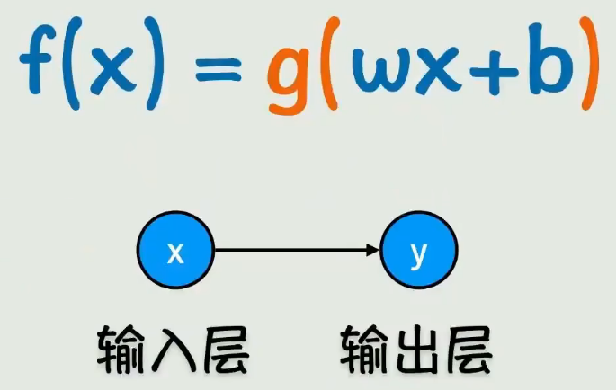
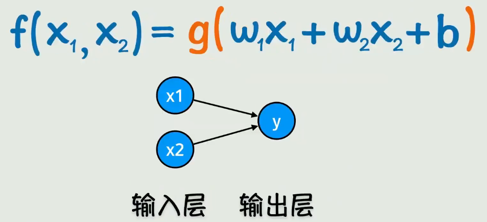
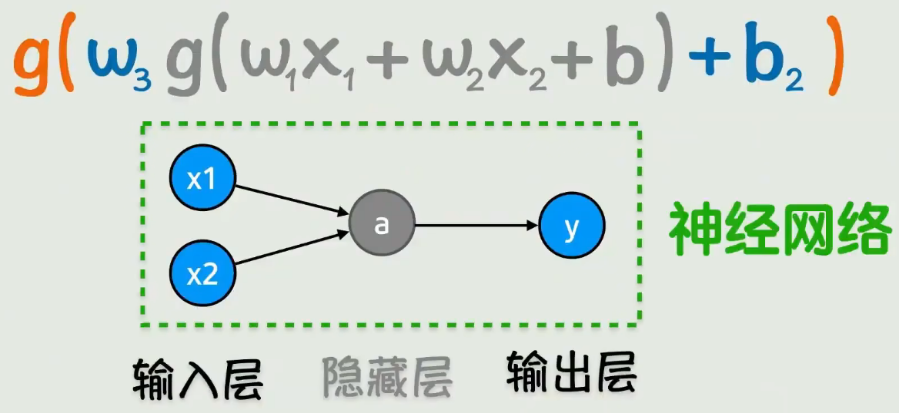
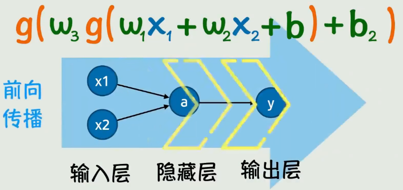
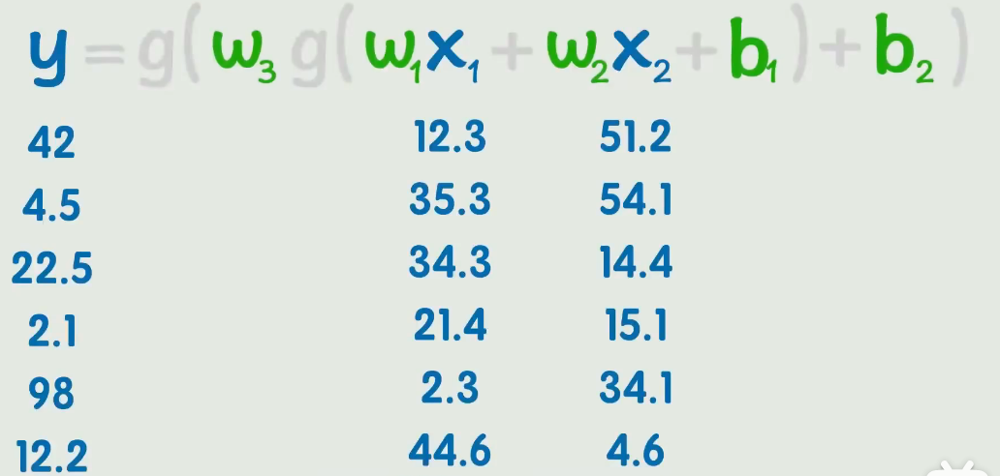
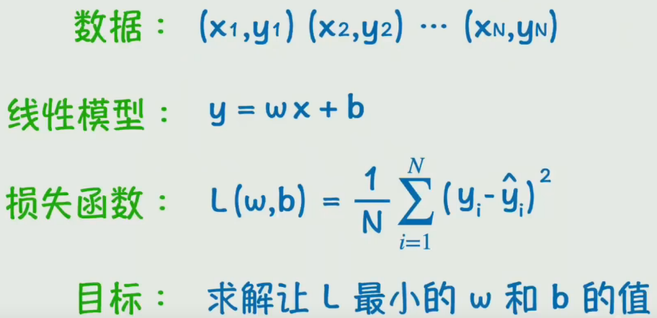
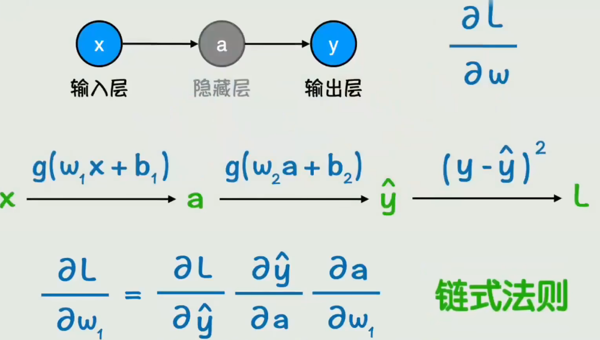
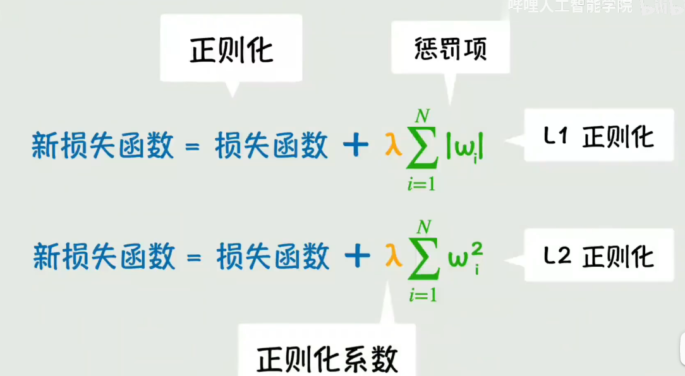
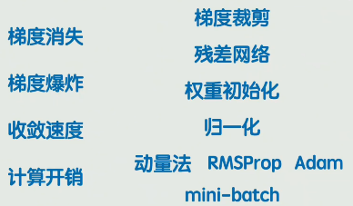
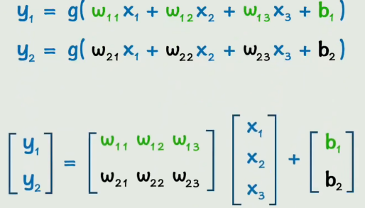

激活函数的来源：把原来死气沉沉的线性函数给激活了，变成了非线性函数，可以更好的拟合数据。（原来的线性函数是直的，很多时候不能很好地拟合数据，需要给他弄弯，就是把线性函数变成非线性函数）

<strong>单个输入，只有一个x的情况</strong>

<strong>多个输入，即多个x的情况</strong>

可能有的时候，只套一层激活函数，还是不够好，也就是这个曲线弯曲得还不够灵活，需要再套一层激活函数，那就把第一次激活后的函数值作为整体当成x，再输入到一个激活函数中，再次激活：

<strong>两层激活函数的情况</strong>

理论上，可以通过套多层激活函数的方式，逼近任意的连续函数

中间每添加一个激活函数，就多添加一层：

x1,x2是a的输入，a是y的输入，y是最终的输出

这个过程就像是，一个信号从左到右传播了过去，这就是`前向传播`的过程：

最终的目标就是根据这些个一直的x和对应的y的值，来猜出这里的w和b的值：

损失函数：

因为这个求导的过程是从右向左依次求导，根据右边的参数逐步更新左边的参数，这个过程就是反向向传播的过程，根据反向传播计算出损失函数关于每个参数的梯度，然后每个参数都向着梯度的反方向变化一点点，这就构成了神经网络的一次训练。

关于正则化的解释，P03:

这些控制参数的参数都叫超参数，L1正则化是因为L1范数，L2正则化是因为L2范数，后边新添加的一部分，就是为了拟制参数的野蛮增长，防止模型的过拟合

还有一种方法，避免模型过多的依赖于某个或者某些少量参数，在模型的训练过程中，会随机地丢弃掉某些参数，那么那些表现强的极个别参数就会被可能丢弃掉，这样就强迫模型学习到其他参数，这个过程就叫dropout

训练神经网络过程中可能遇到的问题：

梯度消失

梯度爆炸

训练速度

计算开销

