【PCS-GAN】

# A New Adversarial Perspective for LiDAR-Based 3D Object Detection

## Abstract

​		**自主车辆**（AVs）在驾驶场景中依赖 **LiDAR 传感器**进行环境感知和决策 。然而，在复杂环境中确保**自主车辆**的安全性和可靠性仍然是一个紧迫的挑战 。为了解决这个问题，我们引入了一个真实世界数据集（**ROLID**），该数据集包含水雾和烟雾这两种**随机物体**的 **LiDAR 扫描点云** 。在本文中，我们通过提出一个利用水雾和烟雾来模拟环境干扰的攻击框架，引入了一个新颖的**对抗视角** 。具体而言，我们提出了一种使用名为 **PCS-GAN** 的**运动与内容分解生成对抗网络**的**点云序列生成**方法，用于模拟**随机物体**的分布 。此外，利用通过**距离图像**（**Range Image**）实现的模拟 **LiDAR 扫描特性**，我们研究了在目标车辆的不同位置引入**随机物体扰动**的影响 。广泛的实验表明，基于**随机物体**的**对抗扰动**能有效欺骗车辆检测，并降低 **3D 目标检测模型**的识别率 。

## 1 Introduction

​		由于 **LiDAR** 能够捕获精确的深度信息，它已成为现代**自动驾驶系统**实现场景感知的重要支撑 。随着深度学习的发展，基于学习的 **LiDAR 点云**方法近期变得流行 。然而，先前的研究表明，**深度神经网络模型**容易受到**对抗攻击**的影响，导致模型产生错误的输出 。如果攻击者对深度网络模型实施恶意攻击，将对**自动驾驶系统**的安全性构成巨大威胁。

​		目前，**3D 对抗攻击**主要集中在数字领域，往往忽略了现实场景中**对抗攻击**的潜力 。在数字领域，**对抗攻击方法**包括**扰动点**、添加独立点或**对抗聚类**，以及**删除点** 。此外，利用**梯度**实施**对抗攻击**也是一种主要方法，但生成的**对抗样本**容易产生**离群值** 。基于**优化**的方法可以生成具有更好几何特性的**对抗样本**，但此类方法执行速度较慢 。在**频域**中，基于高频和低频信息可以提高**对抗样本**的隐蔽性和可迁移性 。然而，通过这些方法生成的**对抗样本**在现实世界中无法操作 。

​		应对现实场景中**对抗攻击**的方法可以分为两类 。第一种是**传感器级攻击**。攻击者使用恶意的激光脉冲模拟 **LiDAR** 回波脉冲，并将攻击信号注入 **LiDAR** 信号中 。第二种类型是**模型级 LiDAR 攻击**，这也是主要的**对抗攻击方法** 。例如，在车辆顶部添加**对抗物体**会使其对 **LiDAR 检测器**不可见，从而欺骗检测系统 。这些**对抗物体**是在数字领域使用**对抗攻击方法**优化生成的，然后通过 **3D 打印**在现实世界中生产出该**对抗样本** 。放置在真实道路上的此类**对抗样本**可以误导配备 **LiDAR** 的**自动驾驶汽车** 。这些**对抗攻击方法**试图生成最优的**对抗物体**，它们通常具有固定的外观且不易变形，例如几何体、交通锥等。

​		在本文中，不同于现有的针对现实场景的 **3D 对抗攻击**，我们关注的是**随机物体**对 **LiDAR** 的**对抗性质** 。我们探索了两种**随机物体**的**对抗能力**：水雾和烟雾 。为此，我们从一个新的视角引入了一个基于**随机物体**干扰的**对抗攻击框架** 。首先，由于**随机物体**具有复杂的物理意义，难以进行定量和定性描述 。因此，我们设计了一种用于**点云序列生成**的**运动与内容分离生成对抗网络**方法 。该方法用于生成**随机物体**的**点云序列**，这些序列模拟了 **LiDAR 扫描**期间**随机物体**的分布 。其次，为了验证**随机物体**的攻击能力，我们使用不同的方法将模拟的**随机物体**叠加在公共**自动驾驶数据集**中车辆目标的各种位置上，以生成**对抗数据** 。这些生成的**对抗数据**随后被用于攻击**最先进的 3D 目标检测方法**。

​		总的来说，本文的贡献可以总结如下：

- 我们是首个深入研究现实场景下 **LiDAR 感知**中**随机物体**的**对抗性质**的团队 。通过采用水雾和烟雾这两种**随机物体**，我们展示了对真实场景中 **3D 物体感知**的**对抗攻击** 。
- 我们率先提出了一种用于**点云序列生成**的**生成对抗网络**框架（**PCS-GAN**）。该框架用于生成模拟 **LiDAR 扫描**数据特性的**随机物体** 。
- 我们构建了一个包含水雾和烟雾数据的**随机物体** **LiDAR 点云数据集**（**ROLiD**）。该数据集将公开发布供研究使用 。
- 我们的方法有效地攻击了 **KITTI** 和 **nuScenes** 上的**最先进 3D 检测器**，大多数模型的**攻击成功率**大于 80% 。

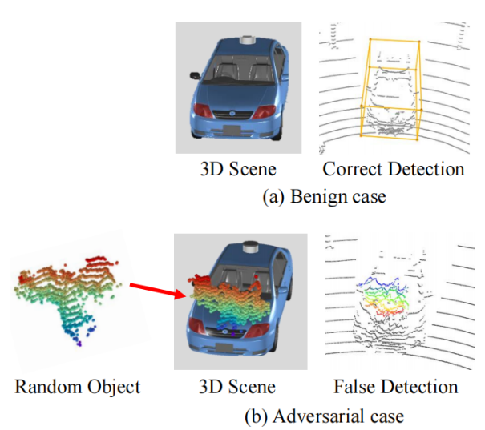

`图 1：我们利用随机物体来伪装目标车辆并欺骗 LiDAR 检测器。 在良性案例中，3D 目标检测器能够正确检测到车辆 。在对抗案例中，当随机物体叠加在车辆上时，检测器无法识别该车辆 。`

## 2 Related Work

​		`数字领域的对抗攻击。`**3D 点云对抗攻击方法**最初是从图像对抗攻击方法扩展而来的 。攻击者寻求生成具有高**攻击成功率**和更好**不可感知性**的**对抗样本** 。Xiang 等人对针对 **3D 点云**的**对抗攻击**进行了开创性研究，将 **C&W 攻击**扩展到了该领域 。Wen 等人认为，用于约束**扰动**大小的**正则化项**无法确保**不可感知性** 。为了解决这一局限性，他们提出了一种从几何角度评估点云相似性的**局部曲率一致性**度量，并开发了一种**几何感知**攻击方法 。此外，以最小成本生成高质量**对抗样本**仍然是一个关键的研究焦点 。例如，Zheng 等人在 **3D 点云**上引入了一种**局部区域对抗攻击方法** 。近年来，为了提高**对抗样本**的**可迁移性**和**不可感知性**，研究人员越来越多地关注**图谱域**（Graph Spectral Domain）中的攻击 。Hu 等人提出了一种新的点云攻击范式，即**图谱域攻击**（**GSDA**），该方法通过扰动**图谱域**中对应于不同几何结构的变换系数来生成**对抗样本** 。

​		`现实场景中的对抗攻击。`在现实世界设置中实施**对抗攻击**显著更加复杂，并对**自动驾驶系统**提出了重大的安全挑战 。Tu 等人提出了一种**对抗攻击方法**，用于生成不同几何形状的**对抗物体**，将它们放置在车顶可以欺骗 **LiDAR 检测器**，导致车辆变得“不可见” 。Cao 等人通过将**对抗攻击**表述为一个**优化问题**，探索了多传感器**自动驾驶系统**的安全漏洞 。为此，作者引入了 **MSF-ADV** 来生成物理可实现的、**3D 打印**的**对抗物体**，从而误导**自动驾驶系统** 。该攻击算法在现实世界中使用工业级**自动驾驶系统**进行了评估，并实现了超过 90% 的成功率 。考虑到 3D 物体的几何特性和物理变换的不变性，Miao 等人在**正则化项**中引入了**高斯曲率**，以在物理世界中生成自然且鲁棒的 **3D 对抗样本** 。Zhu 等人提出了一种**对抗攻击方法**，用于寻找现实世界中的特定攻击位置 。在这些攻击位置放置任何具有反射表面的物体（如商用无人机）都可以误导 **LiDAR 感知系统** 。该方法也是首个研究**对抗位置**对 **LiDAR 感知模型**影响的工作 。

​		总之，与现有的现实场景**对抗攻击方法**相比，我们的工作面向水雾和烟雾等**随机物体**的**对抗攻击** 。`我们通过算法生成随机物体并模拟它们的分布 。我们不使用优化方法来寻找最优对抗物体 。`此类（传统的）**对抗物体**具有固定的几何外观，且不易变形 。同时，我们探索了在目标物体的不同位置添加**随机物体扰动**时的攻击性能 。在添加**扰动**的过程中，我们考虑了目标物体的**遮挡问题**，并模拟了真实 **LiDAR 扫描**的物理特性 。

## 3 Method

### 3.1 Problem Formulation

​	在本文中，我们的目标是利用**随机物体**作为**伪装**，在现实场景中对 **3D 点云**实施**对抗攻击** 。我们将基于**随机物体扰动**的攻击问题表述为两个部分，如图 2 所示 。

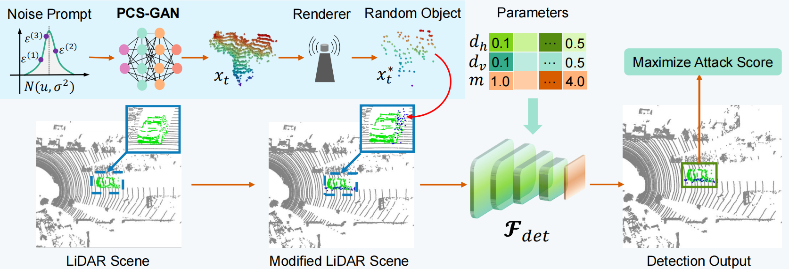

`图 2：基于随机物体扰动的对抗攻击框架。` 我们提出了 PCS-GAN 来生成随机物体序列 ($\tilde{P}_{T}=[\tilde{x}^{(1)},\tilde{x}^{(2)},\cdot\cdot\cdot,\tilde{x}^{(K)}]$)，并使用距离图像表示的近似渲染器来模拟 LiDAR 扫描 。我们通过设置不同的融合模式 ($m$) 和融合密度 ($d_{h},d_{v}$)，将随机物体附着在目标车辆上，以最大化目标车辆在 LiDAR 检测器 ($\mathcal{F}_{det}$) 上的攻击得分。

第一部分是`随机物体的生成` 。我们利用真实的随机物体 $y^{train}$ 来训练**深度模型** $\mathcal{F}$，以获取当噪声 $r^{train}$ 被触发时的最优参数 $\theta^{*}$ ，公式如下:
$$
\mathcal{F}_{\theta^{*}} = \arg \min_{\theta} \left( \mathcal{L}^{full} \left( \mathcal{F}_{\theta}(r^{train}), y^{train} \right) \right) \tag{1}
$$
第二部分是`对抗样本的生成与优化` 。我们使用在网络 $\mathcal{F}$ 的最优参数下由噪声 $r^{val}$ 生成的最优随机物体，并将其与目标车辆融合为对抗点云。随后，通过优化不同的融合模式 $m$ 和融合密度 $d$，使目标车辆 $s^{val}$ 在 LiDAR 检测器 $\mathcal{F}_{det}$ 上的攻击得分达到最大化，公式如下：
$$
\mathcal{F}_{\theta^{*}}^{\eta^{*}} = \max_{\eta} \left( \mathcal{F}_{det} \left( \mathcal{F}_{\theta^{*}}^{\eta}(r^{val}), s^{val} \right) \right) \tag{2}
$$
其中参数 $\eta = [m, d]$。

### 3.2 Dataset of random objects

​		在本文中，我们提出了一个用于研究现实世界中**数据模拟**和**对抗攻击**的**随机物体** **LiDAR 点云数据集**（$ROLiD$）。

​		`数据采集。`我们使用 $32$ 线 **LiDAR** 来采集数据，包括如图 $3$ 所示的水雾数据和烟雾数据 。采集环境是一个开放式厂房，补充材料解释了采集设备和详细的**数据获取方法** 。

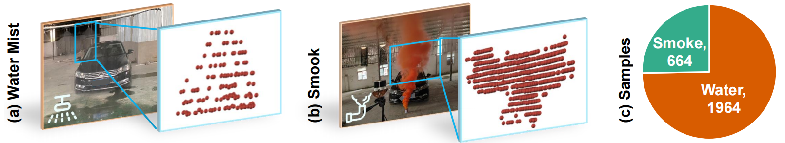

`图 3：随机物体 LiDAR 数据集（ROLiD）。 (a) 和 (b) 分别是数据采集方案和局部点云可视化 。 (c) 代表用于 PCS-GAN 网络的数据 。`

​		`水雾数据。`我们在车辆的前部、尾部、左侧和右侧四个方向喷洒水雾，并使用 **LiDAR** 直接对着车辆扫描**点云**，如图 $3(a)$ 所示 。在采集车辆每个方向的**水雾点云**时，**LiDAR** 固定在距离车辆 $10$ 米处，并使用了四种强度的水压，即 $0.45Mpa$、$0.50Mpa$、$0.55Mpa$ 和 $0.60Mpa$ 。在每种水压下，我们分别将水雾位置与汽车之间的距离设置为 $2$ 米、$4$ 米、$6$ 米和 $8$ 米 。在每种压力下的每个距离处，**水雾点云**的采集时间约为 $3$ 分钟 。**水雾数据**的总帧数超过了 $128k$ 帧 。

​		`烟雾数据。`我们在车辆的前侧、后侧、左侧和右侧四个方向附近释放烟雾。随后使用 **LiDAR** 从这些位置直接扫描**点云**，如图 $3(b)$ 所示。烟雾的排放持续时间约为 $2$-$3$ 分钟。

​		`数据特性。`我们量化了水雾数据对车辆的影响，以证明**随机物体**的**对抗性质** 。在采集水雾数据的相同条件下，我们使用 **LiDAR** 采集未喷洒水雾时的目标车辆**点云** 。为了量化水雾对车辆的影响，我们统计了水雾**遮挡**前后的车辆**点云**数量，并计算了**遮挡率** 。不同压力和不同距离下的定量结果可见补充材料 。

### 3.3 Sequence generation of random objects

​		水雾和烟雾等**随机物体**根据周围环境具有不同的分布模式。为了更好地模拟 **LiDAR 扫描**过程中**随机物体**的分布，我们提出了一种利用带有**运动与内容分解策略**的**生成对抗网络**（$PCS$-$GAN$）的新型**点云序列生成**方法。

​		分离**内容**和**运动**是**视频生成**的一种有效方法（$Tulyakov$ 等人 $2018$）。类似地，对于**点云序列生成**问题，序列间的**运动信息**可以从**点云**自身的内容中分离出来。因此，我们可以将**点云**的**潜在空间** $Z$ 分解为**内容空间** $Z_C$ 和**运动空间** $Z_M$ 。对于**随机物体**，**运动空间** $Z_M$ 用于建模**点云序列**之间的变化特性，而**内容空间** $Z_C$ 则用于建模**点云**的不变特性。

​		所提出的 $PCS$-$GAN$ 由四个组件组成，即 $PST$-$Net$、**生成器** $G$、**单帧判别器** $D$ 和**序列判别器** $D_S$，如图 $4$ 所示。

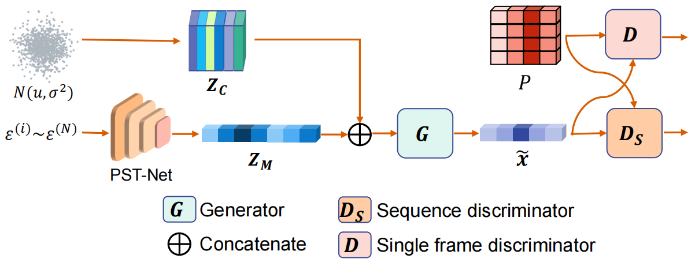

`图 4：用于点云序列生成的生成对抗网络框架 PCS-GAN 。`$P$ 是真实点云，$\tilde{x}$ 是生成点云（假点云），$Z_C$ 是内容特征，$Z_M$ 是运动特征

​		我们基于**点时空卷积**实现了一个**特征提取网络** $PST$-$Net$，用于提取**点云序列**的时间和空间特征。该网络（$PST$-$Net$）的输入是服从**高斯分布**的**点云序列** $\epsilon = (\epsilon^{(1)}, \epsilon^{(2)}, \dots, \epsilon^{(N)})$，输出是该**点云序列**的信息表示 $Z_M$ 。

​		**生成器** $G$ 的目标是生成与真实**点云**具有相似统计分布的**点云**。考虑到**随机物体**的动态变化特性，为了更好地学习物体的复杂形状，我们使用了**基于变形的生成器** 。**点云序列**的**运动信息** $Z_M$ 和**内容信息** $Z_C$ 被拼接为该**生成器**的输入，其输出是一个具有 $K$ 帧的**点云序列**。

​		**判别器** $D$ 和 $D_S$ 用于判断由**生成器** $G$ 生成的**点云**是否为真实点云 。其中，**判别器** $D$ 用于判断由**生成器** $G$ 生成的**点云序列**中的单帧**点云**是否为真实点云。我们采用 **PointNet**（$Qi$ 等人 $2017$）作为**单帧点云判别器** $D$ 。对于生成的**点云**，该判别器（$D$）的输入是从由**生成器** $G$ 生成的**点云序列**中随机采样的一帧 。$D_S$ 是**点云序列**的时间判别，它被用于判断由生成器$G$ 生成的**点云序列**是否为真实点云 。我们从由**生成器** $G$ 生成的**点云序列**中采样三帧连续的**点云**作为输入，以预测该**点云序列**的**时间一致性**置信度。类似地，对于真实的**点云序列**，三帧连续的**点云**也会被用作 $D_S$ 的输入。

​		为了生成一个**点云序列**，从**高斯分布**中采样一个长度为 $N$ 的**随机向量** $\epsilon = (\epsilon^{(1)}, \epsilon^{(2)}, \dots, \epsilon^{(N)})$。在通过 **PST-Net** 网络提取**运动信息**后，序列长度将减少为 $K$，记录为 $Z_M = (Z_M^1, Z_M^2, \dots, Z_M^K)$。因此，从**高斯分布**中采样一个长度为 $K$ 的**随机向量**，并与 $Z_M$ **拼接**后作为**生成器** $G$ 的输入。由**生成器** $G$ 生成的序列被标记为 $\tilde{P}_T = [\tilde{x}^{(1)}, \tilde{x}^{(2)}, \dots, \tilde{x}^{(K)}]$，我们从中随机采样一帧**点云**作为 $\tilde{P} = [\tilde{x}^{(i)}]$，连续三帧的**点云序列**被标记为 $\tilde{P}_T = [\tilde{x}^{(i-1)}, \tilde{x}^{(i)}, \tilde{x}^{(i+1)}]$。类似地，从真实**点云**中随机采样的一帧被记录为 $P = [x^{(i)}]$，连续三帧的**点云序列**被记录为 $P_T = [x^{(i-1)}, x^{(i)}, x^{(i+1)}]$。

我们将 PST-Net 网络记为 $P_M$。因此，根据 GAN 和视频生成框架 MoCoGAN，$PCS$-$GAN$ 的学习问题表达如下：
$$
\max_{G,P_{M}}\min_{D,D_{S}}\mathcal{F}_{P}(D,D_{S},G,P_{M}) \tag{3}
$$
$\mathcal{F}_{p}$ 的目标函数如下：
$$
\mathbb{E}_{P}[-\log D(P)]+\mathbb{E}_{\tilde{P}}[-\log(1-D(\tilde{P}))] + \mathbb{E}_{P}[-\log D_{S}(P_{T})]+\mathbb{E}_{\tilde{P}}[-\log(1-D_{S}(\tilde{P}_{T}))] \tag{4}
$$
在训练过程中，**序列判别器** $D_S$ 采用了 **TPU-GAN** 的**时间判别器损失**。**判别器** $D$ 使用改进的 **WGAN 损失**。为了进一步减少生成的**点云**与真实**点云**之间的局部差异，我们使用**拼接损失**来增强**生成器** $G$。在训练 $PCS$-$GAN$ 时，我们首先固定**生成器** $G$ 和 **PST-Net** 并更新**判别器** $D$ 和 $D_S$。随后，固定**判别器** $D$ 和 $D_S$，并更新**生成器** $G$ 和 **PST-Net**。交替更新各个部分直到训练结束。

​	生成的**随机物体**的**真实性评估**。使用 **Hausdorff 距离**和 **Chamfer 距离**评估生成数据与真实数据之间的相似性。较小的距离值表示更高的相似性，如表 1 所示。在我们的实验中，$PCS-GAN$ 训练了 2000 个 **epoch**，**批大小**为 4，且**点云序列**的初始采样长度 $N$ 被设置为 16。

`表 1：生成的随机物体的真实性评估。`

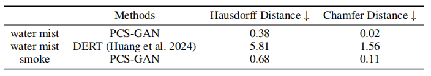

### 3.4 Adversarial point cloud sequence generation

​		我们将生成的**随机物体序列**与**场景点云**融合，以形成一个新的**点云序列**。我们以水雾为例来描述**融合过程**。首先，将水雾的**坐标系**与**场景点云**的**坐标系**对齐。其次，在**场景点云**的**坐标系**下，将水雾附着在目标车辆的车身上以完成**融合**。然而，这会破坏 **LiDAR 点云**固有的**拓扑属性**，并同时引入**遮挡问题**。因此，我们使用一种基于**距离图像**的 **LiDAR 仿真**方法来确定从 **LiDAR** 视角看哪些点是可见的。

​		`LiDAR 仿真。`**LiDAR 仿真**的目的是解决由于**随机物体**与场景中点云物体的**融合**而导致的**遮挡问题**，并生成具有真实 **LiDAR 扫描特性**的**融合点云**。我们使用**距离图像**表示来实现 **LiDAR 仿真**，这提供了如图 5 所示的**物理精确渲染**。具体而言，当我们把点云**投影**到**距离图像**上时，如果多个点同时**投影**到同一个像素，则仅保留距离 **LiDAR** 最近的点。这模拟了激光束路径中出现多个点的情况，即后方的点会被前方的点**遮挡**。随后，我们对**距离图像**进行**反投影**，以再次获得点云。因此，通过替换**距离图像**上的深度值，在**投影**过程中模拟了 **LiDAR 扫描**的特性。我们在这项工作中使用这种仿真方法来近似 **LiDAR 渲染器**。此外，在 **KITTI** 数据集上，**距离图像**存在水平线缺失的问题。修复方法的细节可以在补充材料中找到。

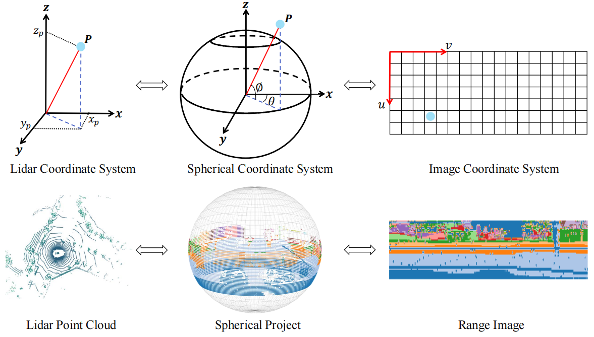

`图 5：通过球面投影获取点云的距离图像。第一行描述了转换过程中涉及的三个坐标系，而第二行概述了在此转换期间数据格式的变化。`

​		`在点云中混合水雾与汽车`。在坐标系对齐后，我们选择水雾点云中的点 $A$，并将其移动到场景点云中汽车上的点 $B$。然后，根据汽车的方向调整水雾以贴合车身。水雾点云的质心 $O$ 与正上方点 $A$ 之间的距离是点云高度 $\Delta z$ 的一半。水雾点云的高度 $\Delta z$ 计算如下：
$$
\Delta z = \frac{1}{2} \left( \max_{(x,y,z) \in P_{mist}} z - \min_{(x,y,z) \in P_{mist}} z \right)\tag{5}
$$
其中 $P_{mist}$ 是水雾点云。我们首先确定目标车辆四个车体的顶部中心，这些位置由**标注框**上矩形四条边的中点代替。然后将面向 **LiDAR** 的车体顶部中心作为点 $B$。然而，在现实场景中，车辆并不总是正对着 **LiDAR**。因此，我们设置了四种**融合模式**，如下所示：

- **车头/车尾侧 (head/tail side)**：当汽车的前部或后部面对 **LiDAR** 时，水雾与汽车前部或后部的顶部中心点 $B$ 融合。
- **车身侧 (body side)**：当车身的一侧面对 **LiDAR** 时，水雾与该侧车身的顶部中心点 $B$ 融合。

当多个车身（最多两个）面对 **LiDAR** 时：

- **双侧 (two sides)**：同时在两个车身的顶部中点融合水雾。
- **角点 (corner point)**：两个车身交线上的顶部点 $B$ 与水雾融合。

​		`在距离图像中混合水雾与汽车。`我们将融合后的**点云**投影到**距离图像**中。由于水雾中的点可能不会出现在激光路径上，我们需要在水平和垂直方向上设置误差限制，以确定该点对于 **LiDAR** 是否可见。因此，我们使用这两个约束，即**密度参数** $d$，来控制融合**点云**中**随机物体**的密度。在实验中，水平方向的**密度参数**表示为 $d_h$，垂直方向的**密度参数**表示为 $d_v$。

## 4 Experiment

### 4.1 Experimental Setup

​		`数据集。`我们使用两个公共**自动驾驶数据集**评估了**对抗攻击**的性能：**KITTI** (Geiger, Lenz, and Urtasun 2012) 和 **nuScenes** (Caesar et al. 2020)。由于这两个数据集不提供**测试集**的标签，我们使用**训练集**和**验证集**进行**对抗攻击**性能评估。对于每个数据集，我们选择了 $3000$ 帧**点云**进行攻击。我们将**水雾扰动**应用于每一帧以创建一个**对抗点云序列**，同样地，添加了**烟雾扰动**以生成另一个**对抗序列**。在实验中，水雾和烟雾序列的长度均被设置为 $3$。

​		`攻击模型。`我们从每个数据集中选择高性能的 **3D 点云目标检测模型**进行攻击评估。针对 **KITTI** 进行攻击的模型包括 **TED** (Wu et al. 2023)、**Focals Conv-F** (Chen et al. 2022)、**Part-A2-Anchor** (Shi et al. 2021)、**Part-A2-Free** (Shi et al. 2021)、**PV-RCNN** (Shi et al. 2020) 和 **PointPillar** (Lang et al. 2019)。在这些模型中，**Focals Conv-F** 是一个将图像和点云同时作为输入的**多模态模型**。针对 **nuScenes** 进行攻击的模型包括 **VoxelNeXt** (Chen et al. 2023)、**TransFusion-L** (Bai et al. 2022)、**CenterPoint**（体素大小 $= 0.1$）(Yin, Zhou, and Krahenbuhl 2021)、**CenterPoint**（体素大小 $= 0.075$）(Yin, Zhou, and Krahenbuhl 2021)、**CenterPoint-PointPillar** (Yin, Zhou, and Krahenbuhl 2021) 以及 **PointPillar-MultiHead**。

​		`评估指标。`为了评估涉及**随机物体**的**对抗攻击**的有效性，我们采用**攻击成功率**作为主要指标。一次**成功的攻击**被定义为：最初由**目标检测模型**检测到的车辆，在施加**扰动**后不再被检测到。为了使检测被视为成功，车辆的**置信度**必须超过 $0.5$，且**预测边界框**与**地面真值标签**之间的**交并比**（$IoU$）必须大于 $0.7$。在实验中，$IoU$ 阈值被设置为 $0.7$。

### 4.2 Results on KITTI and nuScenes Dataset

​		我们在 **KITTI** 和 **nuScenes** 数据集上评估了不同的 **3D 目标检测模型**，结果如表 2 所示。**KITTI** 和 **nuScenes** 的**密度参数**取值范围分别为 $d_v \in [0, 0.004], d_h \in [0, 0.5]$ 以及 $d_v \in [0, 0.5], d_h \in [0, 0.5]$。在实验中，**融合模式**被设置为“**双侧**”（two sides）。对于**水雾扰动**，我们在 **KITTI** 上设置 $d_v = 0.004, d_h = 0.5$，在 **nuScenes** 上设置 $d_v = 0.08, d_h = 0.08$。对于**烟雾扰动**，我们在 **KITTI** 上设置 $d_v = 0.002, d_h = 0.25$，在 **nuScenes** 上设置 $d_v = 0.05, d_h = 0.05$。我们使用了 3000 帧原始**点云**和 3 帧水雾或烟雾序列来生成 9000 个**混合帧**，并随后将其用于评估模型。从表 2 可以看出，所提出的方法在不同**密度参数**下，对当前最先进的模型均实现了极高的**攻击成功率**。例如，在 **KITTI** 数据集上，当**水雾密度**较高时，**攻击成功率**在 $86.34\%$ 到 $95.32\%$ 之间。即便在**烟雾密度**较低的情况下，**nuScenes** 上的**攻击成功率**仍能达到 $93.27\%$。此外，**Focals Conv-F** 在水雾和烟雾下的**攻击成功率**分别为 $95.32\%$ 和 $81.47\%$，这证明了所提出的攻击方法对**多模态模型**同样有效。另外，图 6 展示了当**融合模式**为“双侧”时，**TED** 在水雾扰动下于 **KITTI** 数据集上的攻击表现。

`表 2：在不同数据集及随机物体扰动下，3D 目标检测模型的攻击性能。`

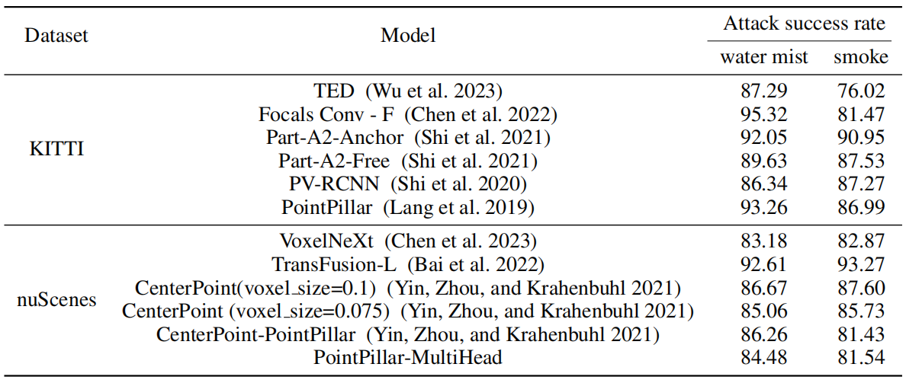

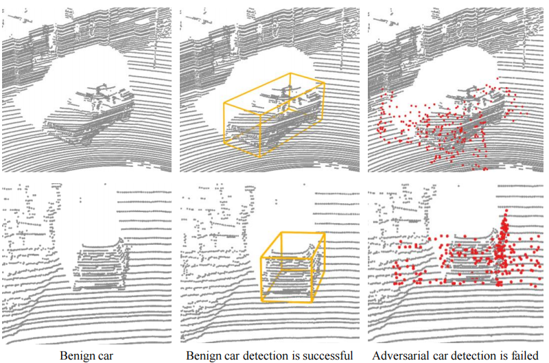

`图 6：在融合模式为双侧（two sides）时，TED 在 KITTI 数据集上受水雾扰动的表现。对抗样本中的扰动点以红色标记。`

### 4.3 Water mist spray angle simulation

​		我们模拟了不同**水雾喷射角度**对**攻击性能**的影响，结果如表 3 所示。我们以**水雾点云**的**质心**为原点，分别向左和向右旋转了 $0^{\circ}$、$5^{\circ}$、$10^{\circ}$、$20^{\circ}$ 和 $40^{\circ}$。将旋转后的 3 帧**水雾序列**与 300 帧原始点云融合为**对抗点云序列**，并用于**模型评估**。在实验中，当**融合模式**为“**车身侧**”（body side）时，我们在 **KITTI** 上设置 $d_v = 0.004, d_h = 0.5$，在 **nuScenes** 上设置 $d_v = 0.5, d_h = 0.5$。实验结果表明，当**旋转角度**在 $10^{\circ}$ 以内时，水雾的**攻击能力**可以得到保持；否则，水雾的**攻击能力**会随着**旋转角度**的增加而下降。

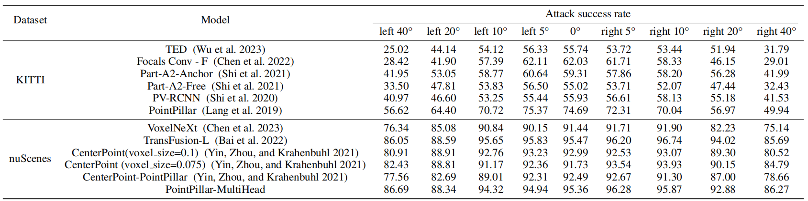

`表 3：不同水雾喷射角度对攻击性能的影响。`

### 4.4 Effect of water mist augmentation

​		我们评估了**水雾数据增强**对**目标检测性能**的影响，如表 4 所示。$PV-RCNN(*)$ 是指在**干净点云**上进行训练和测试的模型，而 $PV-RCNN(\#)$ 则表示同时使用**干净点云**和**水雾点云**进行训练，但在**干净点云**上进行测试。结果表明，当模型使用**水雾增强数据**进行训练时，检测性能有轻微提升，这证明此类**数据增强**有效地增强了模型的**鲁棒性**和**检测精度**。

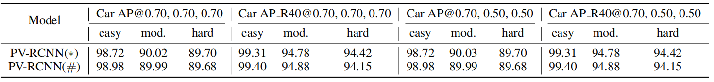

`表 4：使用水雾增强点云的目标检测性能。`

### 4.5 Ablation Study

​		`融合模式` 我们验证了不同融合模式的攻击性能，如表 5 所示。我们选择了 1000 帧原始点云和 3 帧水雾序列在 KITTI 上进行融合。具体而言，我们设置了密度参数 $d_v = 0.004$ 和 $d_h = 0.5$，并在 TED 上评估了融合后的点云。显而易见，“双侧”（two sides）模式具有卓越的攻击性能。

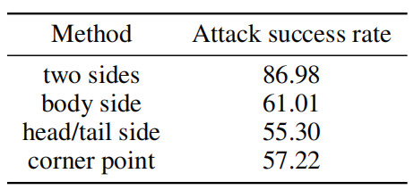

`表 5：不同融合模式下 TED 的攻击性能。`

​		`密度参数`  我们研究了密度参数对攻击性能的影响。当融合模式为“双侧”时，我们使用 1000 帧原始点云和 3 帧水雾序列在 KITTI 上生成融合点云，用于评估 TED。通过固定 $d_h = 0.5$ 来验证 $d_v$ 的影响，以及固定 $d_v = 0.04$ 来验证 $d_h$ 的影响，结果如表 6 所示。结果表明，随着密度的增加，攻击性能也随之提升。

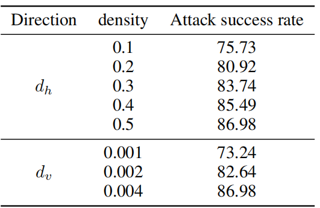

`图 6：在融合模式为“双侧”时，TED 在 KITTI 数据集上受水雾扰动的表现。对抗样本中的扰动点以红色标记。`

## 5 Conclusion

​		本文介绍了一种利用**随机物体**在现实场景中对目标进行**扰动**的**对抗攻击框架**，该框架能有效地攻击当前最先进的 **3D 目标检测模型**。我们使用了水雾和烟雾这两种**随机物体扰动**，并验证了它们在 LiDAR 感知上的**攻击能力**。我们提出了一个名为 **PCS-GAN** 的**运动与内容分解生成对抗网络**，用于**点云序列生成**。为了生成**对抗点云序列**，我们将 **PCS-GAN** 生成的**随机物体序列**与真实**点云数据**融合。

在此过程中，我们利用**距离图像**来模拟 **LiDAR 扫描特性**，并有效解决了**遮挡问题**。**对抗点云**的**攻击性能**在多个**自动驾驶数据集**上得到了验证。实验结果表明，**随机物体**具有强大的**对抗攻击性能**。

# 术语

`Graph Spectral Domain` 图谱域，通过图傅里叶变换将点云转换到频率域，在频率空间中分析和处理点云的几何结构。

​		*通俗理解*：不再看每一个点的坐标，而是看点云整体的“波形”。就像音频处理里调节高低音一样，在图谱域可以精准修改物体的细节或轮廓特征。

# END