# Adaptive local adversarial attacks on 3D point clouds

## Abstract

​		现代人工智能系统严重依赖深度学习技术。然而，深度神经网络很容易受到**对抗性物体**的干扰。**对抗样本**有利于提高 3D 神经网络模型的**鲁棒性**，并增强人工智能系统的稳定性。目前，大多数 3D 对抗性攻击方法通过扰动整个**点云**来生成对抗样本，这导致了高昂的扰动成本以及在物理世界中较低的可操作性。在本文中，我们提出了一种针对 3D 点云的**自适应局部对抗性攻击方法**（`AL-Adv`），用以生成对抗性点云。首先，我们分析 3D 网络模型的脆弱性，并提取输入点云的**显著区域**，即脆弱区域。其次，我们提出了一种针对显著区域的**自适应梯度攻击算法**。该攻击算法在点云的三维坐标的不同方向上自适应地分配不同的扰动。实验结果表明，我们提出的 AL-Adv 方法比全局攻击方法实现了更高的攻击成功率。具体而言，AL-Adv 生成的对抗样本表现出良好的**不可感知性**和较小的生成成本。

关键词：Point Clouds ; Adversarial attack; Salient regions;  Adversarial Examples

## 1 Introduction

​		近年来，随着深度学习技术的发展，2D 和 3D 物体检测与识别取得了巨大进步。随着 3D 数据的普及，点云被更广泛地应用于各个领域，例如**自动驾驶**。3D 点云的识别与跟踪是对人工智能系统应用的重要支持。然而，3D 深度神经网络总是容易受到恶意攻击。此前的研究发现，3D 深度网络模型对对抗样本很脆弱，导致模型产生错误的识别结果。对于输入的 3D 点云，对抗样本是通过**对抗性扰动**生成的，这会导致 3D 深度网络模型预测出错误的结果。如果 3D 网络模型受到对抗样本的攻击，人工智能系统的 3D 识别和跟踪功能将无法正常工作，这对系统的现实世界应用构成了巨大的风险。对抗样本对 3D 深度神经网络模型的影响如图 1 所示。在 3D 点云中，对抗性攻击主要分为两类：数字域和物理世界。

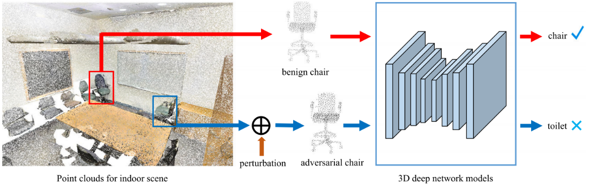

`图 1. 对抗样本给 3D 深度网络模型带来了安全风险 。在室内场景中，3D 深度网络模型检测并识别物体 。良性物体被正确地检测和识别 。例如，一个良性的“椅子”被正确识别 。向良性物体添加扰动会生成无法被 3D 网络模型正确识别的对抗性物体 。例如，对抗性的“椅子”被识别为“马桶” 。`

​		**在数字域中**，对抗样本主要通过添加点或点簇、移除点以及扰动点来生成。生成的对抗样本要求尽可能接近原始点云，同时保持良好的 3D 属性，如平滑性和公平性。同时，对抗样本应该对 3D 网络模型具有较高的攻击成功率。

​		**在物理世界中**，需要在真实场景中构建 3D 对抗样本。例如，数字生成的对抗样本通过 **3D 打印**呈现于现实世界中，并用于攻击基于 3D 网络模型的人工智能系统。此类在物理世界中重建的对抗样本往往对人工智能系统构成更大的威胁。因此，本文主要研究如何生成 3D 点云的对抗样本，这对 3D 网络模型的鲁棒性至关重要。3D 网络模型稳定的识别和跟踪技术有助于提高人工智能系统的鲁棒性。

​		通常，对于 3D 网络模型，训练和测试样本往往是良性的，这也导致模型在识别对抗样本时总是出错。因此，研究人员通常将**对抗样本添加到训练集中**，模型在训练时会学习它们。这种方法可以有效地解决对抗样本对 3D 网络模型的威胁。此外，有研究结合了良性点云和对抗性点云，并使用**元学习**框架来训练 3D 网络模型。结果表明，对抗样本有助于提高 3D 网络模型的识别精度。我们主要关注如何生成高质量的 3D 点云对抗样本，这有利于提高模型的鲁棒性。总之，生成的对抗样本的不可感知性越好，人眼就越难察觉。

​		在本文中，我们在生成对抗样本时关注 3D 点云的局部区域，而不是整个点云。与攻击整个点云相比，通过攻击点云局部区域生成的对抗样本在物理世界中具有更好的可操作性。因此，本文提出了一种`自适应局部对抗性攻击方法（AL-Adv）`来生成高质量的对抗性点云。首先，我们要利用**博弈论**来分析 3D 网络模型。具体而言，使用 `Shapley 值`来分析 3D 网络模型的脆弱性并提取显著区域。每个区域使用 Shapley 值来表示其对网络模型识别结果的重要性。如果某个区域的显著性越强，则 3D 网络模型在该区域就越脆弱。其次，我们为显著区域设计了一种`自适应梯度攻击算法`。该攻击算法根据点云的梯度，自适应地将不同的扰动分配给 3D 坐标的各个方向。为了验证生成的对抗样本的有效性，我们将提出的 AL-Adv 与几种流行的对抗性攻击方法进行了比较。实验结果表明，提出的 AL-Adv 比其他全局对抗性攻击方法具有更高的攻击成功率。

​		本工作的主要贡献如下：

- 现有的对抗性攻击方法主要关注全局点云，而我们要提出的 AL-Adv 方法**更关注点云的局部区域**。
- 为了获得更高质量的 3D 对抗性点云，我们为局部区域设计了一种新颖的自适应梯度攻击算法。
- 与现有的全局对抗性攻击方法相比，提出的 AL-Adv 方法在**局部区域**实现了更高的攻击成功率。

## 2 Related Work 

​		目前，物体检测和识别方法主要分为两类：2D 识别和 3D 识别。本文主要关注 **3D 点云**中的对抗性攻击。因此，本节将介绍数字域和物理世界中针对 3D 点云的对抗性攻击的相关工作。

### 2.1 Digital adversarial attack

​		在图像中，通过对输入图像施加**对抗性扰动**获得的样本会导致深度网络模型产生错误的预测，此类样本被称为**对抗样本**。针对图像，已经出现了许多生成对抗样本的方法。在生成对抗样本时，目标是在实现高**攻击成功率**的同时，使其对人眼**不可感知**。在此过程中通常使用**距离约束**来限制对抗样本的生成。在 3D 点云中，许多对抗性攻击方法是从图像领域扩展而来的。生成 3D 点云对抗样本最常见的方法是对输入点云进行扰动、移除和添加点。例如，Xiang 等人扰动了整个点云，使点云中的点偏离原始位置，以欺骗 **3D 网络模型**。此外，**点簇**或具有形状的物体（平面、球体等）被添加到输入点云中以生成对抗性点云。Zheng 等人提出了一种新的对抗性攻击方法，通过从输入点云中**移除点**来生成对抗样本。首先，该方法通过**梯度**生成输入点云的**显著图**，该图表示每个点对模型预测结果的贡献。因此，针对高度显著的点设计了相应的点移除算法，以有效地生成对抗样本。随着移除点数量的增加，3D 网络模型的识别结果下降。为了确保 3D 网络模型的正常工作，点移除操作等同于将点移动到点云的**质心**。为了增强对抗样本的**迁移性**并使其更难防御，Hamdi 等人提出了一种**数据驱动**的对抗性攻击方法。该方法设计了一种新的**损失函数**来扰动输入点云。

​		使用优化方法生成对抗样本是设计对抗性攻击**目标函数**的另一种重要方式。Kim 等人提出了一种统一的对抗性点云生成公式，以最小的操纵点获得更好的不可感知对抗性点云。该方法统一了扰动点和添加点这两种对抗性点云生成方法，并在生成对抗样本时使用了**距离约束和点数约束**。为了避免对抗样本中出现明显的**离群点**并保持 3D 物体的基本属性，Wen 等人设计了一种新颖的**几何感知**目标函数来生成对抗性点云。然后基于该几何感知目标函数，通过正则化**对抗性损失**实现了一种基于优化的对抗性攻击方法。生成的对抗性点云对 3D 网络模型危害更大且更难防御。然而，Huang 等人认为 3D 点云是高度结构化的数据，很难使用简单的约束来限制扰动。因此，该方法将原始点云转换到一个新的坐标系中，并将点的移动限制在**切平面**内。此外，该方法利用新坐标系中的梯度寻找最佳攻击方向，并构建了点云的显著图。

### 2.2 Physical adversarial attack

​		目前，对于 3D 点云，数字对抗性攻击是主要的研究方向，关于物理世界中对抗性攻击的工作较少。现有的物理世界对抗性攻击主要分为三类。**第一类是通过数字模拟生成具有高攻击成功率的高质量对抗样本**，然后利用 **3D 打印**技术在现实世界中重建对抗性物体。例如，Wen 等人首先使用对抗性攻击方法生成对抗性点云，并将对抗性点云转换为网格。然后使用 3D 打印在现实世界中制作重建的对抗性网格。最后，打印出的真实物体被重新扫描成点云，用于测试 3D 网络模型的性能。**第二类是在真实场景扫描的点云数据上实施对抗性攻击**。例如，Tu 等人提出了一种对抗性攻击方法来生成不同几何形状的对抗性物体。将这些对抗性物体放置在汽车的点云上方可以欺骗**激光雷达 (LiDAR)**，导致 3D 物体识别网络无法检测到汽车。**第三类是在物理世界中实现对抗性攻击**，导致激光雷达失效。Zhu 等人提出了一种在现实世界中寻找攻击位置的对抗性攻击框架。在这些攻击位置放置任何具有反射表面的物体（例如商用无人机），都会使目标物体对激光雷达不可见。这种攻击方法对现实世界中的**自动驾驶**系统构成了巨大的威胁。

## 3. Method

### 3.1. Vulnerability analysis of 3D network models

#### 3.1.1. Shapley value

​		与**点云**的全局结构相比，我们主要关注点云的**局部区域**对**网络模型**输出的影响。我们讨论 **Shapley 值**如何应用于 **3D 网络模型**的**脆弱性分析**。Shapley 值是**博弈论**中用于解决**合作收益**分配问题的一种合理方法。假设有多个参与者参与博弈，且不同的参与者获得不同的回报。在整个博弈过程中，多个参与者合作以获得最大回报，其中一些参与者对最终回报贡献巨大，而另一些参与者贡献较小。Shapley 值被用于向每个参与者合理分配回报，以确保公平性。

#### 3.1.2. Shapley value for 3D network models

​		在本文中，Shapley 值被用于分析 3D 网络模型的**脆弱性**。具体而言，我们将 3D 网络模型视为博弈，将输入点云划分为 $m$ 个区域，即 $m$ 个参与者，并将 3D 网络模型的输出作为回报。我们使用 Shapley 值将回报公平地分配给这 $m$ 个区域。如果某个区域在网络模型的输出中起着更重要的作用，它将获得更大的回报。相反，如果某个区域对网络模型的输出贡献较小，那么它获得的回报也较少。

​		对于输入点云 $x$，我们将其划分为 $m$ 个区域，表示为 $x=(a_{1},a_{2},\cdot\cdot\cdot,a_{k},\cdot\cdot\cdot,a_{m})$，其中 $a_{i}$ 代表第 $i$ 个区域。具体而言，我们使用**最远点采样**提取 $m$ 个点作为 $m$ 个区域的中心点。然后，计算点云 $x$ 的每个点与每个中心点之间的距离，最接近某个中心点的点构成一个区域，因此可以获得 $m$ 个区域。然后，对于输入点云 $x$，所有参与者的集合表示为 $M=\{1,2,...,m\}$。给定一个经过训练的 3D 网络模型，其输出表示为 $g(\cdot)$。假设 $S\subseteq M$ 是这些参与者的一部分集合，参与者集合 $S$ 在参与博弈时获得的回报表示为 $g(S)$。具体而言，受相关研究启发，当我们计算区域回报 $g(S)$ 时，我们将不在 $S$ 中的区域的所有点移动到点云的中心。移动到点云中心的点可以被认为对模型识别结果没有影响。因此，输入点云第 $i$ 个区域的 Shapley 值表示为 $\phi(i)$：
$$
\phi(i)=\sum_{S\subseteq M\backslash\{i\}}\frac{|S|!(m-|S|-1)!}{m!}(g(S\cup\{i\})-g(S))\tag{1}
$$
​		详细地说，$\phi(i)$ 代表输入点云第 $i$ 个区域对 3D 网络模型识别结果的重要性。$\phi(i)$ 的值越高，第 $i$ 个区域对网络模型的识别结果就越重要。因此，利用 Shapley 值通过赋值给每个区域一个**显著值**，该值指示了该区域对网络模型输出的重要性。也就是说，一个区域的显著值越高，该区域对模型识别结果的影响就越大。对于 3D 网络模型，具有较高显著值的区域更脆弱。提取点云显著区域的详细过程如算法 1 所示。利用 Shapley 值分析 3D 点云深度网络模型的脆弱性并提取点云的显著区域，如图 2 所示。

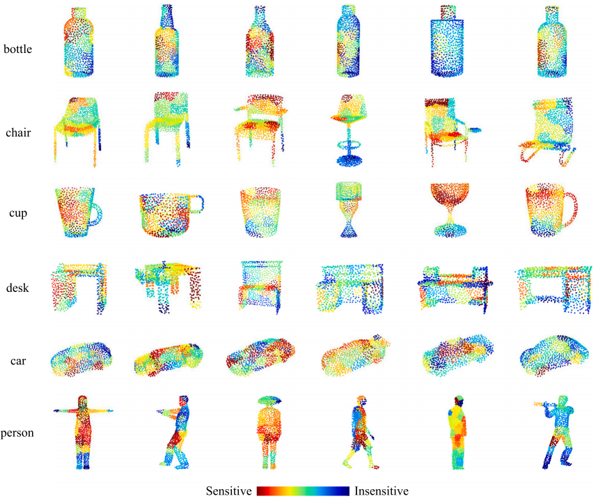

`图 2. 点云的显著区域。在 ModelNet40 上对 PointNet 进行了脆弱性分析。`

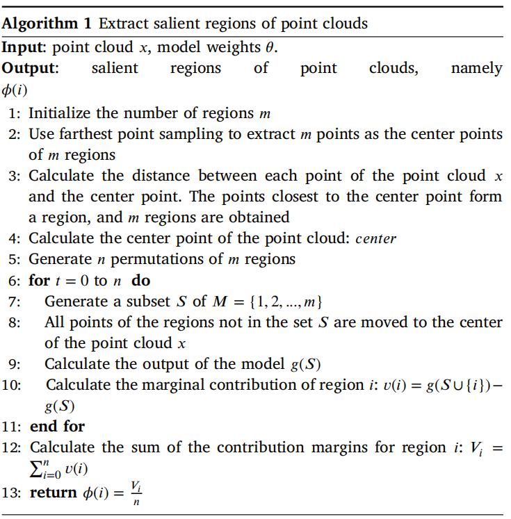

### 3.2. Generating adversarial point clouds

​	`无目标对抗性攻击` 在本文中，我们关注针对 3D 网络模型的无目标攻击。对于包含 $n$ 个点的点云 $x\in R^{(n\times3)}$，其真实标签为 $y$。3D 网络模型 $f$ 可以正确识别 $x$，即 $f(x)=y$。我们的目标是找到一个点云 $x^{\prime}$，使 3D 网络模型 $f$ 的识别结果错误，即 $f(x^{\prime})\ne y$。此外，在生成 $x^{\prime}$ 的过程中，应确保 $x$ 和 $x^{\prime}$ 尽可能相似。这样的 $x^{\prime}$ 被称为对抗样本，可以表示如下：
$$
\min~D(x,x^{\prime}) \quad \text{s.t.} \quad f(x^{\prime})\ne y\tag{2}
$$
其中 $D$ 代表 $x$ 和 $x^{\prime}$ 之间的扰动度量，例如距离度量。通过最小化 $D$，生成的对抗性点云被强制更接近原始点云。度量 $D$ 的值越小，表明对抗性点云 $x^{\prime}$ 越接近原始点云 $x$，且越难区分。

​		`局部区域上的对抗性攻击` 我们使用 Shapley 值对 3D 网络模型进行了脆弱性分析，并提取了脆弱区域。我们的目标是仅攻击一定数量的脆弱区域来生成对抗样本，而不是攻击整个点云。基于显著区域的点云攻击方案如图 3 所示。大多数对抗性攻击方法扰动整个点云。然而，我们更关注点云的局部区域。因此，我们将原始点云划分为 $m$ 个区域，表示为 $x=(a_{1},a_{2},\cdot\cdot\cdot,a_{k},\cdot\cdot\cdot,a_{m})$，其中 $a_{i}$ 代表第 $i$ 个区域。假设区域 $a_{i}$ 的扰动为 $e_{i}$，对抗性点云 $x^{\prime}$ 可以表示如下：
$$
x^{\prime}=\{a_{i}^{\prime}=a_{i}+e_{i}|a_{i}\in x\} \tag{3}
$$
可以看出 $x$ 和 $x^{\prime}$ 具有相同的结构，即对抗性点云 $x^{\prime}=(a_{1}^{\prime},a_{2}^{\prime},\cdot\cdot\cdot,a_{k}^{\prime},\cdot\cdot\cdot,a_{m}^{\prime})$，其中 $a_{i}^{\prime}$ 是通过扰动区域 $a_{i}$ 获得的。因此，根据公式 (2)，3D 点云的区域攻击可以公式化如下：
$$
\min~C_{Region}=l(x^{\prime})+\lambda_{1}*D(x,x^{\prime})+\lambda_{2}*P(x,x^{\prime})\tag{4}
$$
其中 $l(x^{\prime})$ 是惩罚项，$D(x,x^{\prime})$ 是原始点云 $x$ 和对抗性点云 $x^{\prime}$ 之间的距离约束。$\lambda_{1}$ 和 $\lambda_{2}$ 是常数。在实际求解过程中，使用二分查找法自动寻找 $\lambda_{1}$ 的最优参数值。$P(x,x^{\prime})$ 代表对抗性点云相较于原始点云被修改的点的数量。最后，通过求解方程 (4) 生成对抗样本。

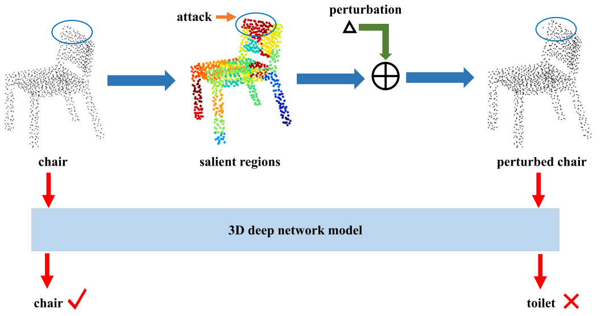

`图 3. 基于显著区域的点云攻击方案。扰动被添加到良性点云“椅子”的显著区域，以生成对抗性点云“受扰动的椅子”。良性点云“椅子”被正确识别，而对抗性点云“受扰动的椅子”被识别为“马桶”。`

​		`感知度`   在生成对抗样本时，必须使用相关约束以确保对抗样本尽可能接近原始样本。使用距离约束是提高生成的对抗样本不可感知性的有效方法。本文使用 3D 数据中常见的 Chamfer 距离和 Hausdorff 距离来约束对抗性点云的生成。这两个距离约束也是衡量对抗性点云质量的重要指标。Chamfer 距离用于衡量两个点集之间的差异。计算如下：
$$
D_{Chamfer}(x,x^{\prime})=\max\{\frac{1}{n}\sum_{b\in x}\min_{a\in x^{\prime}}||b-a||_{2},\frac{1}{n^{\prime}}\sum_{a\in x^{\prime}}\min_{b\in x}||a-b||_{2}\}\tag5
$$
其中 $n$ 代表原始点云 $x$ 的点数，$n^{\prime}$ 代表对抗性点云 $x^{\prime}$ 的点数。Hausdorff 距离是生成 3D 对抗性点云的常用约束项，它有效地减少了生成的对抗样本的离群点。通过这种距离约束，可以在一定程度上使生成的对抗样本更难以被察觉，使其更难区分。Hausdorff 距离计算如下：
$$
D_{Hausdorff}(x,x^{\prime})=\max\{\max_{b\in x}\min_{a\in x^{\prime}}||b-a||_{2},\max_{a\in x^{\prime}}\min_{b\in x}||a-b||_{2}\}\tag6
$$
在本文中，使用 Chamfer 距离和 Hausdorff 距离约束的局部对抗性攻击方法可以表示如下：
$$
D(x,x^{\prime})=D_{Chamfer}(x,x^{\prime})+D_{Hausdorff}(x,x^{\prime})\tag7
$$
​		`惩罚项`  给定一个 3D 网络模型 $f$，输入标签为 $y$ 的 3D 点云 $x$，正确的预测结果为 $f(x)=y$。在攻击输入点云的脆弱区域生成对抗性点云 $x^{\prime}$ 后，我们的目标是使模型产生错误的输出，即 $f(x^{\prime})\ne y$。因此，我们使用如下惩罚项使模型无法正确识别对抗性点云：
$$
l(x^{\prime})=\max\{f_{y}(x^{\prime})-\max_{y^{\prime}\ne y}f_{y^{\prime}}(x^{\prime}),0\}\tag8
$$
其中 $y$ 是原始点云 $x$ 的类别标签。$f_{y}(x^{\prime})$ 表示 3D 网络模型将输入 $x^{\prime}$ 识别为类别 $y$。如果网络模型将对抗性点云分类为原始点云的真实类别，则 $l(x^{\prime})>0$，这需要进行惩罚。否则，$l(x^{\prime})=0$，惩罚项将不起作用。

### 3.3 Adaptive gradient attack algorithm

​		为了生成危害性更大的对抗样本，本文设计了一种针对脆弱区域的**自适应梯度攻击算法**。基于 3D 网络模型的脆弱性分析，在生成对抗性点云时，只需要扰动点云中最脆弱的区域。因此，需要对点云所有区域的**显著值**进行排序。将点云不同区域的显著值按降序排列。假设排序后的点云为 $x=(p_{1},p_{2},\cdot\cdot\cdot,p_{k},\cdot\cdot\cdot,p_{m})$，其中 $\phi(p_{1})>\phi(p_{2})>\cdot\cdot\cdot>\phi(p_{k})>\cdot\cdot\cdot>\phi(p_{m})$。那么对抗性攻击方法只需要扰动前 $k$ 个区域 $(p_{1},p_{2},...,p_{k})$ 即可产生对抗样本。

​		D 点云的空间位置包含三个方向：$X$、$Y$ 和 $Z$。所提出的自适应梯度攻击算法在扰动脆弱区域时，会自动为每个方向分配扰动大小。首先，自适应梯度攻击算法计算每次迭代的对抗性点云的梯度 $grad=\nabla_{x}C_{Region}(x,x^{\prime})$。然后，不同坐标轴方向上扰动大小比例的计算方法如下：
$$
e_{X}=\frac{|grad_{X}|}{|grad_{X}|+|grad_{Y}|+|grad_{Z}|}\tag9
$$

$$
e_{Y}=\frac{|grad_{Y}|}{|grad_{X}|+|grad_{Y}|+|grad_{Z}|}\tag{10}
$$

$$
e_{Z}=\frac{|grad_{Z}|}{|grad_{X}|+|grad_{Y}|+|grad_{Z}|}\tag{11}
$$

上式中的 $grad_{X}$、$grad_{Y}$ 和 $grad_{Z}$ 分别代表对抗性点云在 $X$、$Y$ 和 $Z$ 三个轴上的梯度大小。我们将三维坐标轴的扰动大小比例表示为 $Ration=[e_{X},e_{Y},e_{Z}]$。在获得三维空间中每个坐标轴的扰动大小比例后，在每次迭代优化过程中，扰动会自动分配到不同的坐标轴。更新一次对抗性点云的过程表示如下：
$$
x^{\prime}=x+Ration \cdot \epsilon \cdot sign(grad) \cdot Region_{idx}\tag{12}
$$
其中参数 $\epsilon$ 是扰动大小。$Region_{idx}$ 代表需要被扰动的脆弱区域。$sign$ 是符号函数，具体计算方法如下：
$$
sign(k)=\{\begin{matrix}1&k>0\\ 0&k=0\\ -1&k<0\end{matrix}\tag{13}
$$

### 3.4. Adaptive local adversarial attack method

​		在本文中，**自适应局部对抗性攻击方法** (AL-Adv) 生成了危害性更大的对抗样本。所提出的 AL-Adv 的具体实现过程如**算法 2** 所述。整体实现过程可分为两个方面。首先，利用 **Shapley 值**对 3D 网络模型进行脆弱性分析，并从输入点云中提取**显著区域**。其次，确定输入点云的前 $k$ 个脆弱区域，并对这些脆弱区域应用自适应梯度攻击算法。最后，通过迭代优化过程找到最优的对抗性点云。

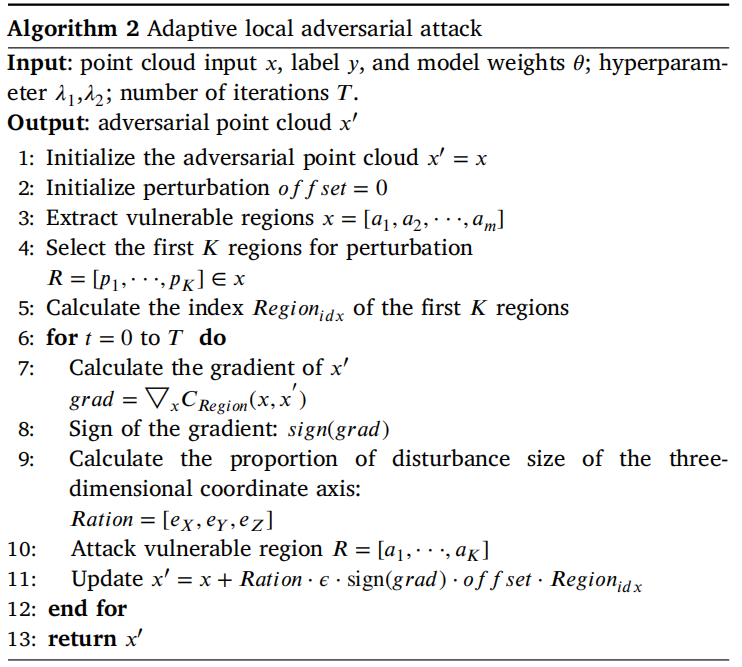

## 4 Experiments

### 4.1. Experimental setup

​		`数据集` 我们使用 **ModelNet40** 和 **ScanObjectNN** 来评估不同的 3D 点云对抗性攻击方法。ModelNet40 数据集在 **3D 网络模型**分类中非常流行，是主要的评估数据集之一。该数据集包含 40 个类别的 12,311 个 CAD 模型。在具体的实验中，使用的数据是通过从这些 CAD 模型中均匀采样获得的点云。本文遵循相关设定，训练数据包含 9843 个点云，测试数据包含 2468 个点云。ScanObjectNN 是在现实世界中扫描的点云数据集，它有五个变体。在实验中，我们使用带有背景的变体 "OBJ_BG" 进行训练和攻击。

​		`实施细节` 在本文中，实验仅在 3D 点云分类模型上进行。我们主要采用 **PointNet** 作为被攻击的 3D 网络模型。遵循先前的设置，PointNet 的输入点云为 1024 个点。在实验中，我们从 ModelNet40 测试集中每个类别选择 25 个样本进行实验。"OBJ_BG" 的测试集用于评估 ScanObjectNN 中的算法攻击性能。在模型**脆弱性分析**期间，我们将输入点云划分为 32 个区域，并计算每个区域的**显著值**。在生成对抗性点云的过程中，我们使用 **Adam** 来优化**扰动**，优化器的学习率设置为 0.01，动量设置为 0.9，扰动大小 $\epsilon$ 设置为 0.6。参数 $\lambda_{1}$ 在优化过程中使用**二分查找**法自动调整，$\lambda_{2}$ 设置为 0.15。

​		`评估指标` 3D 对抗性攻击方法的评估指标主要包括**攻击成功率**、**Chamfer 距离**、**Hausdorff 距离**以及生成对抗样本时被操纵的点数。本文采用这四个指标来衡量不同的对抗性攻击方法。其中，攻击成功率越高越好，表明生成的对抗样本对网络模型构成更大的威胁。对于其他三个指标，越小越好。Chamfer 距离和 Hausdorff 距离衡量对抗样本与原始样本的相似程度。被操纵的点数代表生成对抗样本的成本。

### 4.2. 实验结果

​		我们在 PointNet 上进行了对比实验。对比方法包括近年来优秀的 3D 点云对抗性攻击方法，分别由 Xiang 等人、Liu 等人、Wicker 等人、Zheng 等人、Kim 等人提出。根据 Kim 等人的设置，Xiang 等人提出的方法被修改为无目标攻击。Liu 等人提出的方法也被复现，分别表示为 **Adversarial sink** 和 **Adversarial stick**。Wicker 等人通过移除点生成对抗样本，这被修改为扰动，并实现了两种攻击方法，即**随机选择** (Random selection) 和**关键选择** (Critical selection)。Kim 等人使用了 Zheng 等人的**关键点选择**策略，但将移除点操作修改为扰动操作，并根据点移除规则实现了三种对抗性攻击方法，即**显著图/关键频率** (saliency map/critical frequency)、**显著图/低分** (saliency map/low-score) 和**显著图/高分** (saliency map/high-score)。在实验中，所有方法均在无目标攻击任务上实施。

​		表 1 和表 2 展示了当受害网络为 PointNet 时，不同对抗性攻击方法在 ModelNet40 和 ScanObjectNN 上的性能。从表 1 可以看出，提出的 **AL-Adv** 方法实现了最高的攻击成功率，表明 AL-Adv 生成了危害性更大的对抗样本。同时，AL-Adv 方法操作的点数也相对较少，表明生成对抗样本的成本较低。在距离度量方面，Chamfer 距离和 Hausdorff 距离都相对较小，表明 AL-Adv 方法生成的对抗样本具有良好的**不可感知性**。

`表 1. 当受害网络为 PointNet 时，不同对抗性攻击方法在 ModelNet40 上的性能。注：“攻击成功率”越高越好；“Chamfer 距离”越低越好；“Hausdorff 距离”越低越好。“# Points”代表受扰动点的数量，被认为越低越好。`

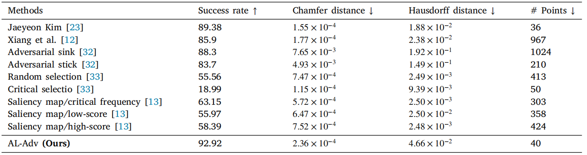

​		从表 1 的实验结果可以看出，提出的 AL-Adv 实现了 92.92% 的最高攻击成功率，且仅操作了 40 个点。虽然 Kim 等人提出的方法仅通过操作 36 个点生成对抗样本，但该方法的攻击成功率为 89.38%。此外，"Adversarial sink" 操作了 1024 个点，获得了 88.3% 的攻击成功率。虽然“关键选择”方法仅使用 50 个点生成对抗样本，但攻击成功率仅为 18.99%，这表明对抗样本的质量较低。

`表 2. 当受害网络为 PointNet 时，不同对抗性攻击方法在 ScanObjectNN 上的性能。注：“攻击成功率”越高越好；“Chamfer 距离”越低越好；“Hausdorff 距离”越低越好。“# Points”代表受扰动点的数量，被认为越低越好。`

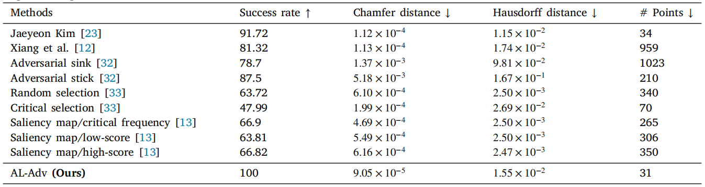

​		从表 2 可以看出，提出的 AL-Adv 操作最少的点获得了最高的攻击成功率，同时具有最小的 Chamfer 距离。此外，在 Hausdorff 距离指标方面，AL-Adv 也非常有竞争力。在实验中，提出的对抗性攻击方法 (AL-Adv) 针对点云的**局部区域**，通过攻击显著区域生成对抗性点云。所有其他比较方法均为全局对抗性攻击方法。总之，提出的局部攻击方法 (AL-Adv) 比全局攻击方法实现了更高的攻击成功率，且 AL-Adv 总体上实现了卓越的性能。

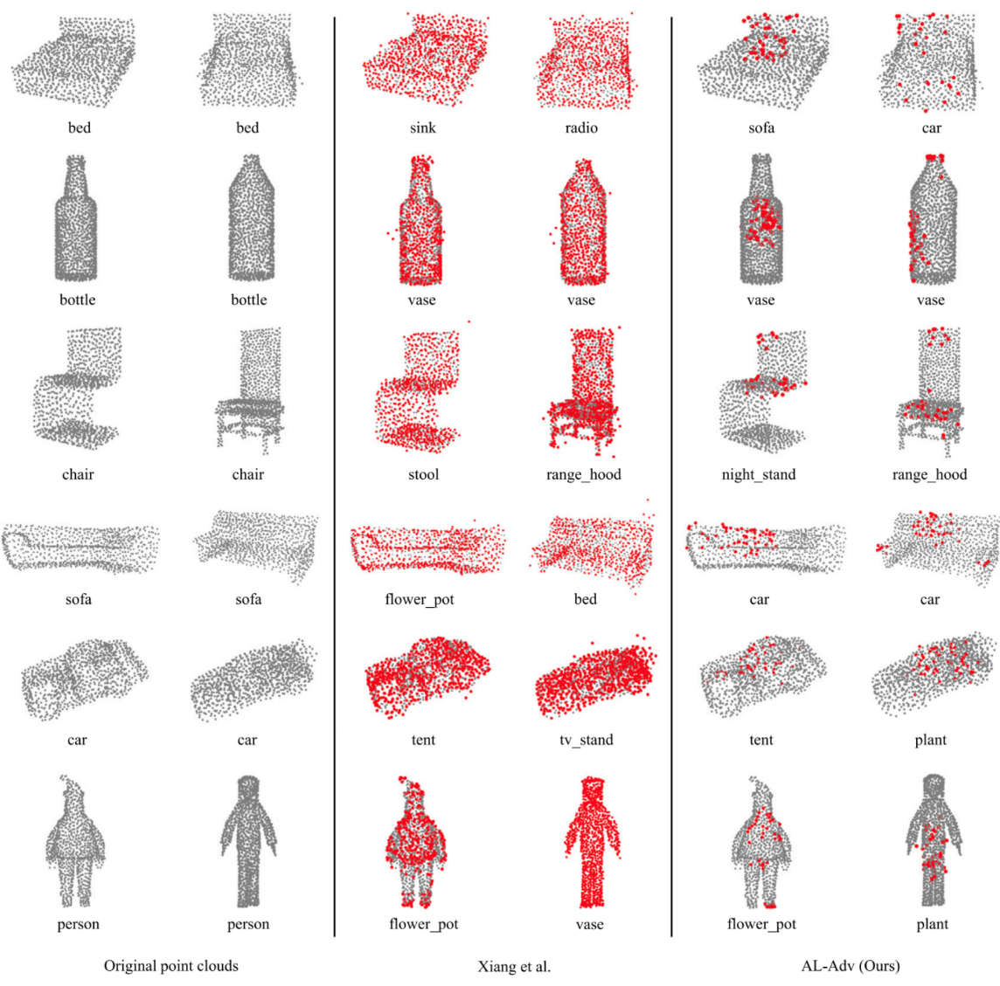

`图 4. ModelNet40 上不同对抗性攻击方法生成的对抗性点云。第一列和第二列是原始点云。第三列和第四列是由 Xiang 等人提出的攻击方法生成的对抗性点云。第五列和第六列是由提出的 AL-Adv 生成的对抗性点云。第三列和第五列中的对抗性点云来自第一列中的点云。第四列和第六列中的对抗性点云来自第二列中的点云。红点代表生成对抗样本时的受扰动点。灰点是未受扰动点。（关于本图例中颜色的解释，读者可参考本文的网络版本。）`

​		图 4 展示了在 ModelNet40 上，提出的 AL-Adv 方法与 Xiang 等人提出的方法生成的对抗样本的对比。与原始点云相比，Xiang 等人生成的对抗样本需要操纵大量点，并且容易产生明显的**离群点**，易于被检测。然而，提出的 AL-Adv 在生成对抗样本时操作较少的点，且生成的对抗样本具有更好的不可感知性。为了突出对抗性点云的差异，我们将受扰动的点标记为红色，并增加了红点的大小。

​		在性能评估方面，攻击成功率是一个重要指标。攻击成功率越高，生成的对抗样本对网络模型造成的威胁就越大。因此，提出的 AL-Adv 生成的对抗样本往往对网络模型更具危害性。此外，生成对抗样本的成本和不可感知性也是重要指标。总之，提出的 AL-Adv 以低成本生成了具有良好视觉感知性的对抗样本，且对抗样本更具危害性。

​		`多模型上的攻击性能` 为了验证提出的 AL-Adv 方法的有效性，我们在其他 3D 网络模型上进行了实验。被攻击的网络模型包括 **PointNet**、**DGCNN** 和 **CurveNet**。表 3 展示了不同网络模型在 ModelNet40 上的攻击性能。表 4 展示了不同网络模型在 ScanObjectNN 上的攻击性能。从表 4 可以看出，提出的 AL-Adv 显示出良好的攻击性能。具体而言，当受害模型为 DGCNN 时，攻击成功率达到 100%，且 Chamfer 距离和 Hausdorff 距离相对较小，这表明生成的对抗性点云具有良好的不可感知性。

`表 3. 不同网络模型在 ModelNet40 上的攻击性能。`

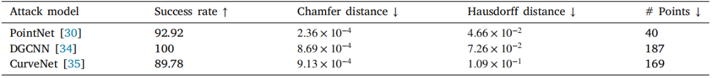

`表 4. 不同网络模型在 ScanObjectNN 上的攻击性能。`

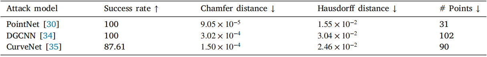

### 4.3. 消融实验

​		`区域数量 K 的选择` 如表 5 和图 5 所示，我们探索了显著区域数量 $K$ 对攻击性能的影响。具体而言，我们在设置不同区域数量 $K$ 时，在 ModelNet40 上攻击 PointNet 模型。我们观察到，随着 $K$ 的增加，Chamfer 距离变大，而 Hausdorff 距离减小。

`表 5. 当受害网络为 PointNet 时，具有不同数量显著区域 $K$ 的 AL-Adv 方法在 ModelNet40 上的性能。`

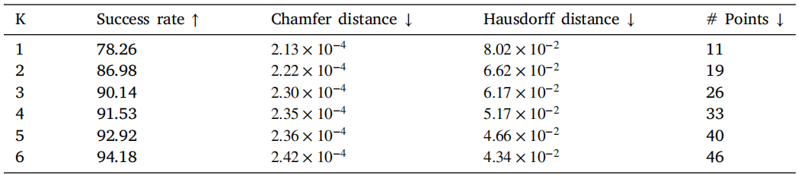

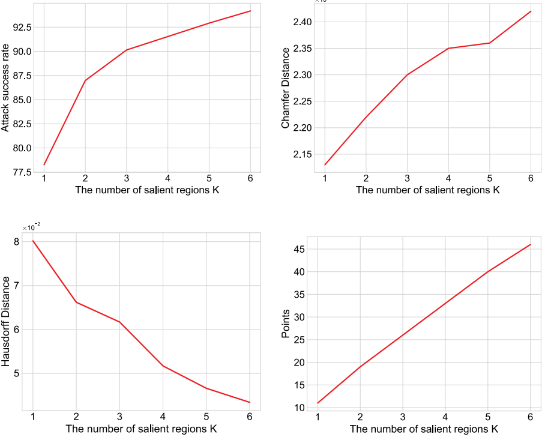

`图 5. 当受害网络为 PointNet 时，具有不同数量显著区域 $K$ 的 AL-Adv 方法在 ModelNet40 上的性能。`

​		`参数` $\lambda_{2}$ `的敏感性` 如表 6 和图 6 所示，我们探索了参数 $\lambda_{2}$ 对攻击性能的影响。具体而言，我们在设置不同 $\lambda_{2}$ 值时，在 ModelNet40 上攻击 PointNet 模型。从表 6 和图 6 中，我们观察到参数 $\lambda_{2}$ 对算法的攻击性能影响不大，不同的 $\lambda_{2}$ 主要影响 Chamfer 距离和 Hausdorff 距离。此外，随着 $\lambda_{2}$ 的增加，Chamfer 距离和 Hausdorff 距离均会增加。

`表 6. 当受害网络为 PointNet 时，具有不同 $\lambda_{2}$ 的 AL-Adv 方法在 ModelNet40 上的性能。`

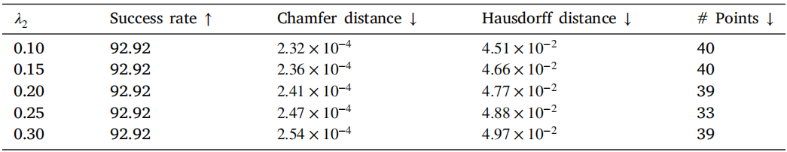

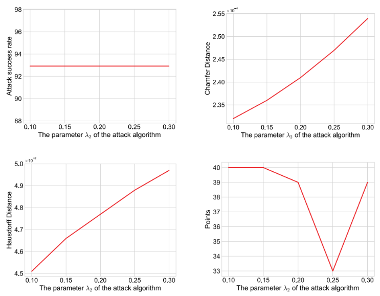

`图 6. 当受害网络为 PointNet 时，具有不同 $\lambda_{2}$ 的 AL-Adv 方法在 ModelNet40 上的性能。`

​		`区域数量 K 的不同选择策略` 如表 7 和图 7 所示，我们探索了不同区域选择策略对攻击性能的影响。当我们在 ModelNet40 上攻击                   mPointNet 时，我们设置了两种区域选择策略：**显著区域**和**随机区域**。我们观察到，显著区域选择策略具有更高的攻击成功率和更小的距离度量。

`表 7. 当受害网络为 PointNet 时，在区域数量 $K$ 的不同选择策略下，AL-Adv 方法在 ModelNet40 上的性能`

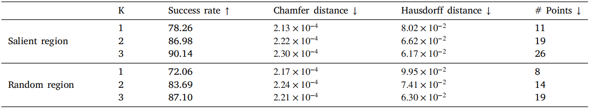

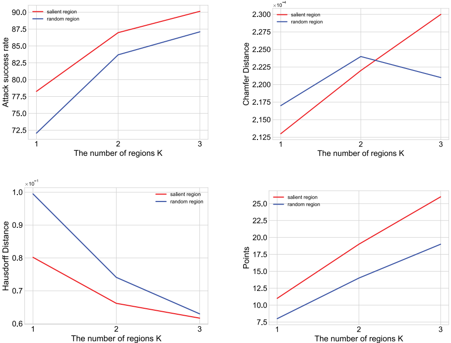

`图 7. 当受害网络为 PointNet 时，在区域数量 K 的不同选择策略下，AL-Adv 方法在 ModelNet40 上的性能。`

## 5. Discussion

​		`人工智能系统的风险` 随着深度学习技术的发展，许多行业已经开始开发和应用人工智能系统。因此，现实生活中使用的 AI 系统的安全问题值得关注。作为 AI 系统的重要支撑，3D 识别与跟踪对产品安全有着重要影响。由于其良好的数据特性，**点云**被广泛应用于 3D 物体识别和跟踪。对于 AI 系统的发展，点云数据的应用也是一个重要方向。此外，深度网络模型容易受到**对抗样本**的恶意攻击，导致模型无法正确识别物体。因此，本文关注 3D 点云上 AI 系统的安全性，并提出了一种危害性更大的**对抗性点云**生成方法 **AL-Adv**。

​		`局部区域攻击的优势` 目前大多数对抗性点云生成方法都攻击整个点云，导致生成成本高昂。因此，我们更多地关注点云的**局部区域**。分析 **3D 网络模型**的**脆弱性**更有利于实施对抗性攻击。理论上，我们只需要攻击网络模型的脆弱部分即可实现对抗性攻击。因此，提出的 AL-Adv 方法仅攻击 3D 网络模型输入点云中最脆弱的区域。结果表明，AL-Adv 以低成本生成了对抗性点云，且生成的对抗性点云危害性更大。

​		`自适应梯度攻击的优势` 大多数现有的基于梯度的对抗性攻击方法在扰动点云时是在梯度方向上实现攻击，这使得点的不同维度具有相同大小的扰动。然而，这是不合理的，一个点的不同维度应该有不同的扰动大小。因此，本文设计了一种**自适应梯度攻击算法**，使得不同维度中的每个点根据**梯度**自动设置扰动大小。实验表明，自适应梯度攻击算法比全局攻击方法实现了更高的攻击成功率。

## 6 Conclusion

​		在本文中，我们提出了一种自适应局部对抗性攻击方法（AL-Adv）来生成 3D 对抗样本。首先，我们制定了针对点云局部区域的攻击方案。然后，我们利用 Shapley 值来分析 3D 网络模型的脆弱性，并提取输入点云的显著区域。最后，我们设计了一种自适应梯度攻击算法来攻击这些显著区域。自适应梯度攻击算法在不同的坐标轴方向上自适应地分配不同的扰动大小。实验结果表明，提出的 AL-Adv 方法比全局攻击方法获得了更高的攻击成功率，这表明我们的方法生成的对抗样本对 3D 网络模型具有更大的危害性。然而，我们的方法生成的对抗样本的**迁移性**不足，这也是基于梯度的优化方法的一个缺点。我们将考虑基于频率的方法，以进一步研究对抗样本的迁移性。

## 术语

`Shapley Value`  Shapley值，源自博弈论的一种方法，用于公平地分配合作博弈中每个参与者的贡献。在本文中用于衡量点云各区域对模型预测的重要性。

​		*类比*：就像一个项目组完成了任务拿到奖金，Shapley 值就是一种算法，根据每个人实际出的力，精确计算出每个人该分多少钱。

​		本文用法：把它想象成一个“功劳计算器”。识别出一把椅子，椅背的那些点贡献了80%的功劳（Shapley值高），椅脚的点只贡献了20%。攻击者就会盯着椅背打。

`Meta-learning`  元学习，机器学习的一个子领域，旨在设计能够通过少量经验快速学习新任务或适应新环境的模型和算法。

​		*通俗例子*：你学会了骑自行车（元技能），以后学骑摩托车、骑电动车（新任务）就会非常快，因为你掌握了平衡的底层逻辑。

`Chamfer Distance`  Chamfer距离，衡量两个点云之间相似度的度量标准。它计算一个点云中每个点到另一个点云中最近点的平均距离。

`Hausdorff Distance`  Hausdorff距离，衡量两个点集之间最大不匹配程度的度量。它关注的是“最坏情况”，即一个集合中距离另一个集合“最远”的那个点产生的距离。

