# An End-to-End Robust Point Cloud Semantic Segmentation Network with Single-Step Conditional Diffusion Models（CDSegNet）

### Abstract

​		现有的采用**噪声-条件架构**（**NCF**）的条件**去噪扩散概率模型**（**DDPMs**）在**三维场景理解**任务中仍然面临挑战，因为场景中复杂的几何细节增加了从**语义标签**拟合**数据分布梯度**（即**分数**）的难度 。这也导致 **DDPMs** 的训练和推理时间比**非DDPMs** 模型更长 。从另一个角度出发，我们深入探究了一种由**条件网络**主导的模型范式 。在本文中，我们提出了一种基于 **DDPMs** 的**条件-噪声架构**（**CNF**）的**端到端**鲁棒**语义分割网络**，命名为 **CDSegNet** 。具体而言，**CDSegNet** 将**噪声网络**（**NN**）建模为一个可学习的**噪声特征生成器** 。这使得**条件网络**（**CN**）能够在多级**特征扰动**下理解**三维场景语义**，从而增强了在未见场景中的**泛化能力** 。同时，得益于 **DDPMs** 的**噪声系统**，**CDSegNet** 在实验中对**数据噪声**和**稀疏性**表现出了很强的**鲁棒性** 。此外，得益于 **CNF**，**CDSegNet** 能够像**非DDPMs** 模型一样在**单步推理**中生成**语义标签**，这是因为避免了在 **CDSegNet** 的主导网络中直接拟合来自**语义标签**的**分数** 。在公共的室内和室外**基准测试**上，**CDSegNet** 显著优于现有方法，达到了最先进的性能。

### 1. Introduction

​		**点云**，作为一种基础的**三维表示**，为**三维任务**提供了最关键的数据结构支持 。得益于**三维设备**的快速发展和**数据合成技术**的持续创新，获取**大规模场景点云**已变得触手可及 。因此，对**三维场景**进行准确的**语义理解**，并将其应用于**自动驾驶**、**机器人技术**和**虚拟现实**等广泛的**三维下游任务**中，已受到越来越多的关注 。

​		受**深度学习**发展的鼓舞，近年来大量**可学习的点云语义分割**方法取得了显著成果 。然而，这些方法往往忽视了一个事实，即来自三维设备的**原始点云**通常是**受到扰动**且**稀疏**的 ，这使得它们对**数据噪声**和**稀疏性**非常敏感 。这限制了最佳的**分割精度**，特别是在识别**物体边界**和**小物体**时 。

​		沿着另一条研究路线，凭借其强大的**噪声鲁棒去噪架构**，起源并兴盛于**图像生成**领域的 **DDPMs** ，已在各种**三维任务**中得到了探索 。它们通常将**三维任务**视为一个**条件生成问题**，并建立在**噪声-条件架构**（**NCF**，见图 1(a)）之上 。通常，**条件网络**（**CN**）提取**条件特征**以用于生成引导 。同时，**噪声网络**（**NN**）从任务目标中预测**分数** ，从而主导任务的结果 。

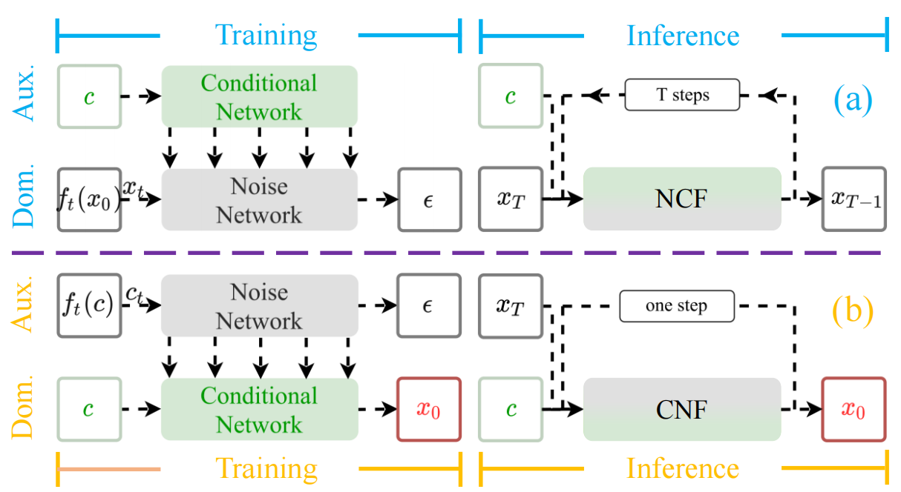

`图 1. NCF 与 CNF 之间的训练和推理差异。由 噪声网络 (NN) 主导的 NCF 依赖于 噪声拟合质量，需要大量的 训练 和 推理迭代。相比之下，CNF 通过专注于 条件网络 (CN)，缓解了 噪声拟合 的必要性，巧妙地避免了这一问题，同时保留了 DDPM 的 鲁棒性。`

​		不幸的是，当应用于**实时三维场景理解**任务（如自动驾驶）时，这种架构带来了挑战。这是因为，为了更好地拟合来自**任务目标**的**分数**，与**非 DDPMs** 相比，**DDPMs** 通常需要更多的**训练**和**推理步骤** 。尽管一些方法可以加速 **DDPM 采样过程** ，但它们仍然需要几十个步骤，并伴随着一个**次优化过程**。此外，**三维场景**的**复杂分布**使得 **DDPMs** 难以以**端到端**的方式获得令人满意的结果。（见图 2）

​		为了解决上述问题，在本文中，我们重新思考了现有的条件 **DDPMs** 的 **端到端框架**，初步揭示了 **DDPM** 在 **点云语义分割** 中的优势和局限性的一些关键见解 。

​		受这些核心见解的启发，我们设计了一种 **DDPMs** 的 **条件-噪声架构**（**CNF**，见图 1(b)），有效地保留了优势并规避了局限性 。与 **NCF** 不同，**CNF** 分别将 **噪声网络** (**NN**) 和 **条件网络** (**CN**) 视为 **三维任务** 中的 **辅助网络** 和 **主导网络** 。通过这种方式，**CNF** 中的 **NN** 仍然可以继承 **DDPMs** 的 **噪声构建系统**，从而保留了来自 **DDPMs** 的 **噪声** 和 **稀疏性鲁棒性** 。同时，这也使得 **CNF** 中的 **NN** 能够放宽拟合来自 **任务目标** 的 **分数** 的要求 。因此，**CNF** 允许模型在 **训练** 中遵循 **DDPM** 模式，但在 **推理** 中则不遵循，从而克服了 **DDPMs** 对大量 **迭代** 的需求 。

​		此外，我们提出了一种基于 **CNF** 的**端到端**鲁棒**点云语义分割网络**，称为 **CDSegNet** 。具体而言，**CDSegNet** 将 **NN** 视为一个轻量级的**噪声特征生成器** 。来自 **NN** 的**噪声信息**通过**特征融合模块**（**FFM**）被有效过滤，从而合理地扰动 **CN** 中的**语义特征** 。这激发了 **CDSegNet** 在**未知场景**中的**泛化能力** 。同时，在 **CNF** 下，**CDSegNet** 可以在**训练**期间遵循 **DDPMs** 的**加噪模式**，从而保持对来自**建模分布**的噪声的**鲁棒性** ，以及对**稀疏场景**和**数据不足**的**鲁棒性** 。此外，得益于 **CN** 在 **CNF** 中的主导地位，**CDSegNet** 在**推理**过程中可以被视为一个**非 DDPM** 模型 。这使得 **CDSegNet** 能够在**单步推理**中生成**语义标签** 。

​		据我们所知，我们是首次尝试将 **DDPMs** 以**端到端**的方式引入**点云语义分割** 。我们降低了**门槛**，并鼓励更多的研究人员进一步探索 **DDPMs** 在**三维任务**中的应用。我们的主要贡献可以总结如下：

- 我们系统地分析并确定了采用**噪声-条件架构**的 **DDPMs** 在**点云语义分割**中的优势和局限性，为**三维任务**中的 **DDPMs** 提供了新的知识 。

- 我们设计了一种 **DDPMs** 的**条件-噪声架构**，在保留优势的同时规避了短板 。

- 我们提出了一种基于 **CNF** 的**端到端**鲁棒**点云分割网络** **CDSegNet**，它展现出很强的**鲁棒性**，并且仅需要**单步推理** 。

- 在**大规模室内**和**室外基准测试**上的综合实验表明，**CDSegNet** 实现了显著的性能和强大的**鲁棒性** 。

### 2. Related Works

​		**可学习的点云语义分割**。得益于**深度学习**强大的**数据驱动能力**，直接从点云中提取**特征**以理解**三维场景语义**已成为可能 。受上述内容的启发，近年来涌现了大量方法，在**点云语义分割**方面取得了显著的成功 。早期的方法通常利用 **RNNs**（循环神经网络）来建立**点云切片**之间的交互，试图通过在点云内部构建**有序关系**来提高**特征提取**的有效性 。然而，巨大的**计算成本**极大地限制了**输入规模** 。为了解决这个问题，一些研究人员专注于**大规模场景分割** 。尽管取得了显著进展，但这些方法仍然受到较小**感受野**的制约，限制了**分割结果**的进一步改善 。最近，一些建立在 **Transformers** 之上的方法被提出 。这些方法继承了建模**长程依赖**的能力，克服了**特征感受野**的局限性，从而取得了**最先进的结果** 。

​		尽管现有专注于**分割精度**的方法已经取得了令人印象深刻的结果，但它们忽略了一个事实，即**原始点云**通常表现出受到扰动且**稀疏**的特性 。这导致它们对**数据噪声**和**稀疏性**非常敏感 。在本文中，为了解决上述问题，我们引入了具有**条件-噪声架构**的 **DDPMs** 。这展示了对数据噪声和**稀疏性**的强大**鲁棒性**，同时避免了大量的**训练**和**推理步骤** 。

​		**用于三维任务的 DDPMs**。在**图像生成**领域取得成功后，**DDPMs** 已在各种**三维任务**中进行了一些探索 。这通常将**三维任务**转化为一个**条件生成问题** 。[38] 首次将 **DDPMs** 引入**点云生成**，为后续的探索提供了灵感 。然后，一些工作尝试将 **DDPMs** 扩展到**点云补全** [39, 72] 。随后，[44] 对用于**点云上采样**的 **DDPMs** 进行了初步调查 。此外，几项工作利用**预训练**（**两阶段训练**）方法将 **DDPMs** 整合到**点云语义分割**中 [35, 71] 。

​		尽管一些探索展示了 **DDPMs** 在**三维任务**中的潜力，但在场景**语义理解**任务中的**两阶段训练**要求表明，**DDPMs** 在复杂**三维场景**中拟合**分数**仍然面临挑战 。同时，数十甚至数千个**推理步骤**限制了其在具有**实时要求**的**三维任务**中的实际应用 。在本文中，我们提出了一种基于我们 **DDPMs** 的 **CNF** 的**端到端**鲁棒点云语义分割网络 。得益于 **CNF**，我们的方法规避了在**主导分割网络**中直接拟合来自**语义标签**的**分数**，仅需要**单步推理** 。

### 3. Conditional DDPMs for PCSS

​		在本节中，我们首先介绍条件 **DDPMs**。接下来，我们明确了利用条件 **DDPMs** 进行**点云语义分割**（**PCSS**）背后的原因，并讨论了与此方法相关的限制因素。

#### 3.1 Baclgroound

​		给定目标数据 $x_{0} \sim P_{data}$、引导条件 $c \sim P_{c}$ 和潜在变量 $z \sim P_{noise}$，条件 **DDPMs** 遵循一个**自回归过程**：一个预定义的**扩散过程** $q$，逐渐破坏数据内容直到 $x_{0}$ 退化为 $z$；以及一个可训练的**条件生成过程** $p_{\theta}$，在条件 $c$ 的引导下缓慢生成特定结果，直到 $z$ 恢复为 $x_{0}$。我们可以将该框架应用于多种**三维任务**。在**点云语义分割**（**PCSS**）中，$x_{0}$ 代表目标**语义标签**，而 $c$ 指代被分割的**点云**。

​		考虑到实验中观察到的更好性能 ，我们将**噪声**视为**拟合目标**。那么，特定条件下的**训练目标**为 ：
$$
L(\theta)=\mathbb{E}_{\epsilon\sim \mathcal{N}(0,I)}||\epsilon-\epsilon_{\theta}(x_{t},C)||^{2} \tag1
$$
其中 $C=\{c,t\}$ 代表**条件**，而 $t \sim \mathcal{U}(T)$ （$T=1000$）1。因此，**无条件生成**（$c=\emptyset$）可以被视为条件 **DDPMs** 的一种特例，即仅以用于控制噪声水平的时间标签 $t$ 为条件 。也就是说，我们的分析可以推广到任何类型的 **DDPMs** 。

​		同时，在**随机微分方程**（**SDEs**）下，条件 **DDPMs** 中的**目标噪声**可以通过一个常数因子 $\alpha = -\frac{1}{\sqrt{1-\overline{\alpha}_{t}}}$ 1 与**分数**（**数据分布的梯度**）相互转换：
$$
\alpha\epsilon_{\theta}(x_{t},C)=s_{\theta}(x_{t},C)\approx\nabla_{x_{t}}\log P_{t}(x_{t})\tag2
$$

#### 3.2 What Supports the Use of DDPMs in PCSS?

​		现实世界场景中的**点云**通常是**嘈杂**且**稀疏**的 。现有的方法忽视了这一事实，使得它们对**数据噪声**和**稀疏性**非常敏感 。在本文中，我们引入 **DDPMs** 来解决这一问题 。

​		**噪声鲁棒性**。得益于**噪声系统**，**DDPMs** 天生就对来自**建模分布**的噪声表现出**鲁棒性** 。我们进一步揭示了该系统中**鲁棒性**的关键来源：**噪声样本**和**噪声拟合**。根据公式 1，**DDPMs** 能够获取来自**建模分布**的多级**噪声样本** $x_t$，并使用**标准噪声** $\epsilon$ 作为**拟合目标**。这使得模型能够在**建模分布扰动**下理解**任务信息**，从而增强了对相关**分布噪声**的**适应性**。第 5.3 节进一步讨论并支持了这一结论。

​		**稀疏性鲁棒性**。**DDPMs** 在**欠采样数据**（**稀疏场景**和较少数据）上表现出更好的性能。事实上，这种**加噪方式**在形式上可以被视为一种**数据增强** [7, 57, 62]：
$$
L(\theta)=\mathbb{E}_{\epsilon\sim\mathcal{N}(0,I)}||\epsilon-\epsilon_{\theta}(f_{t}(x_{0}),C)||^{2}\tag3
$$
其中 $f_{t}(x_{0})=\sqrt{1-\overline{\alpha}_{t}}\epsilon+\sqrt{\overline{\alpha}_{t}}x_{0}$ [18] 。**线性函数** $f_{t}(\cdot)$ 将 $x_{0}$ 映射到一个更模糊的**潜在分布**。

​		这种**数据增强**可以显著缓解模型**过拟合**（见表 7 和图 9），从而增强了针对**室外稀疏场景**（第 5.1 节、第 5.2 节和第 5.5 节）和较少数据（第 5.4 节）的**泛化能力**。

#### 3.3. What Limits the Use of DDPMs in PCSS?

​		遗憾的是，**DDPMs** 很难应用于对**实时性要求**很高的任务，这是因为它们需要大量的**训练**和**推理迭代**（见图 2）。

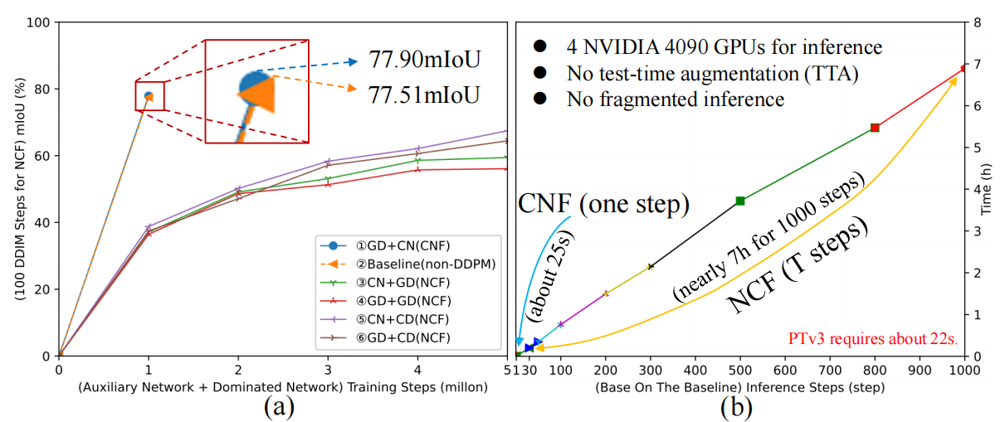

`图 2. 我们在 (a) 中尝试了在 ScanNet 上基于基线（第 5.1 节）构建的条件 DDPMs 的几种组合。GD+CD (NCF) 表示 NN 和 CN 分别被建模为高斯 [18] 和分类 [2] 扩散（详情见补充材料）。为了更好地拟合噪声，这些由 NN 主导的组合（③, ④, ⑤, ⑥）比 CNF 需要更多的迭代才能收敛，但由于复杂的场景分布，表现出较差的性能。(b) 展示了在相同基线下 CNF 和 NCF 的推理时间成本。CNF 以更少的迭代次数实现了更好的性能。`

​		如公式 1 所述，**DDPMs** 的性能本质上取决于**噪声拟合质量**（证明见补充材料）。为了更好地逼近**噪声目标**，与**非 DDPMs** 相比，**DDPMs** 需要更多的**训练**和**推理迭代**，这是因为在单步中拟合差异巨大的分布会产生显著误差 [36, 51, 52]。

​		我们提供了一个证明，在 **DDPMs** 和**非 DDPMs** 的统一设置下，**DDPMs** 需要更多的步骤 $T$ 才能**收敛**。对于**语义分割任务**，给定一个具有足够**拟合能力**的网络 $f_\theta$ 和一个语义样本对 $(c, x_0)$，**DDPMs** 和**非 DDPMs** 的**训练目标**可以一致地表述为（假设使用 **MSE**）：
$$
L_{\theta}=\frac{1}{T}\sum_{t=1}^{T}||y_{t-1}-f_{\theta}(x_{t},c)||^{2}\tag4
$$
其中，目标 $y_{t-1}$ 表示在 **DDPMs** 中以**时间标签** $t$ 为条件的**目标噪声**。同时，输入 $x_{t}=\mu_{t}+\sigma_{t}\epsilon$ [18]，并且我们省略了作为输入一部分的**时间标签** $t$。

​		**推理过程**通常遵循：
$$
y'_{t-1} = f_\theta(x_t, c), \quad t \in [1, T]\tag5
$$
其中 $y'_{t-1}$ 表示 **DDPMs** 中预测的**噪声**。

​	根据公式 4 和公式 5，**DDPMs** 的充分**收敛**至少需要**步长** $T>1$ 来适应所有的 $y_{t-1}$（**训练**）和 $y'_{t-1}$（**推理**），这是由于单步中存在显著误差。然而，**非 DDPMs** 仅需要**步长** $T=1$（输入 $x_t=\emptyset$）：
$$
L_{\theta} = ||y_0 - f_\theta(\emptyset, c)||^2, \quad y'_0 = f_\theta(\emptyset, c)\tag6
$$
其中目标 $y_0=x_0$，而 $y'_0$ 表示预测的 $x_0$。

### 4.Methodology

#### 4.1. Conditional-Noise Framework

​		为了保留**优势来源**（第 3.2 节）并规避**限制因素**（第 3.3 节），我们设计了一种 **DDPMs** 的**条件-噪声架构**（CNF，见图 1(b)）。与**噪声-条件架构**（NCF）不同，CNF 将**条件网络**（CN, $f_{\psi}$）视为**主导任务骨干**，并将**噪声网络**（NN, $\epsilon_{\theta}$）用作**辅助特征增强分支**。

​		具体而言，为了扰动 CN 中的特征，我们将**噪声**添加到**条件** $c$ 上，而不是像在 **NN** 中那样添加到目标 $x_0$ 上：
$$
 L(\theta) = \mathbb{E}_{\boldsymbol{\epsilon} \sim \mathcal{N}(0,I)} || \boldsymbol{\epsilon} - \epsilon_\theta(\boldsymbol{c}_t, t) ||^2 \tag7
$$
接下来，一个**特征融合模块**（**FFM**）被用来过滤来自 **NN** 的**噪声信息**，确保**特征扰动**处于合理的方式。此外，**CN** 通过 **FFM** 在**多级特征扰动**下学习**任务相关信息**：
$$
 L(\psi) = l_{task}(\boldsymbol{x}_0, f_\psi(f_t(\boldsymbol{c}), \boldsymbol{c}))\tag8
$$
其中 $f_t(c)=\text{FFM}(c_{t}^{noise})$ 表示一个**非线性函数**。$\text{FFM}(\cdot)$ 代表**特征融合模块**。$c_{t}^{noise}$ 表示来自 $\epsilon_\theta$、以 $c_t$ 为输入的**噪声特征**。$l_{task}(\cdot)$ 指示任务相关损失函数。

​		这种简单且有效的**模型范式**：

- **遵循噪声构建系统**。公式 7 表明 **DDPMs** 的**噪声系统**仍然保留在 **NN**（噪声网络）中，与公式 1 一致，从而维持了**噪声鲁棒性**。
- **与特征增强保持一致**。公式 8 显示 **CN**（条件网络）遵循**特征增强模式**，与公式 3 一致，从而增强了针对**稀疏场景**和较少数据的**稀疏鲁棒性**。
- **放宽噪声拟合要求**。公式 7 和公式 8 意味着模型性能依赖于 **CN** 而非 **NN**，从而**放宽**了**噪声拟合要求**，避免了 **DDPMs** 所需的过多训练和推理迭代。

此外，**CNF** 中的 **NN**（噪声网络）使我们能够超越建模**高斯扩散** [18] 的局限。这意味着 **CNF** 可以使用 **DDPMs** 的任何**分布** [3]（见图 2）。

#### 4.2 Network Architecture

​		在本节中，我们介绍与 **CNF**（条件-噪声架构）相一致的 **CDSegNet** 的整体架构。它由三个主要组件构成：**辅助噪声网络**（**NN**）、**特征融合模块**（**FFM**）以及**主导条件网络**（**CN**），如图 3 清晰所示（参数和优化细节见**补充材料**）。

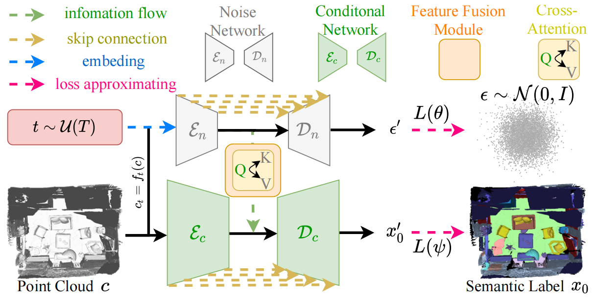

`图 3. CDSegNet 的整体框架。辅助噪声网络（NN）被视为一种噪声特征生成器，它对以时间标签为条件的扩散过程进行建模，并在不同的噪声水平下扰动输入特征。同时，特征融合模块（FFM）控制噪声信息的流向，通过合理地过滤扰动来实现语义特征增强。此外，主导条件网络（CN）以一种纯粹的方式预测分割结果。`

​		**辅助噪声网络**。**NN**（噪声网络）构建了 **DDPMs** 的**噪声系统**，对**条件点云**进行**扰动**。如第 4.1 节所述，由于**噪声拟合要求**并不显著，**NN** 应当设计得更加**轻量化**。它遵循 **Transformer-U-Net 架构** [58, 70]，在**编码器**和**解码器**中堆叠了两级标准的 **Transformer 模块**。同时，与 [58, 59] 类似，我们利用有效的**网格池化**来实现**上采样**和**下采样**。此外，不显著的**噪声拟合**也意味着，仅在 **NN** 中引入**时间标签** $t$ 就足以建模**扩散过程**，而无需考虑额外的条件。

​		**特征融合模块**。**FFM**（特征融合模块）在**瓶颈阶段**引导**信息流**从 **NN** 流向 **CN**。事实上，**FFM** 能够**自适应地过滤噪声信息**，使得来自 **NN** 的**特征增强**以一种**合理的方式**进行，因为**过度的扰动**可能会损害 **CN** 的性能。

​		具体而言，**FFM**（特征融合模块）首先通过 **MLPs**（多层感知机）执行**特征投影**：$F_{cn} \in \mathbb{R}^{N_{cn} \times C_{cn}} \rightarrow (Q) \in \mathbb{R}^{N_{cn} \times C}$，以及 $F_{nn} \in \mathbb{R}^{N_{nn} \times C_{nn}} \rightarrow (K, V) \in \mathbb{R}^{N_{nn} \times C}$。随后，**FFM** 通过一个**交叉注意力模块** [55] 过滤**噪声信息**：
$$
\begin{aligned}
O &= \text{mlp}(WV) + F_{cn}, \\
F &= \text{ffn}(O) + O,
\end{aligned}\tag9
$$
其中 $W \in \mathbb{R}^{N_{cn} \times N_{nn}} = \text{softmax}(\frac{QK^T}{\sqrt{C}})$。

​		我们采用从 $F_{nn}$ 经由 **FFM** 流向 $F_{cn}$ 的**单向流动**，这是因为在**性能**与**计算成本**之间能取得更好的**权衡**，并且 **NN** 中的**扩散建模**已经足够充分。

​		**主导条件网络**。**CN**（条件网络）遵循 **NN**（噪声网络）的架构，其**编码器**和**解码器**均包含四个阶段，专注于**分割结果**。同时，除了来自 **NN** 的**特征扰动**外，我们仅使用**条件点云**作为输入，确保 **CN** 能够纯粹地专注于**场景语义理解**。

#### 4.3. Training and Inference

​		`训练。` 遵循 [58, 59]，我们约束 **CN**（条件网络）中的**语义分割结果**：
$$
L(\psi) = \text{CE}(\boldsymbol{x}_0, \boldsymbol{x}'_0) + \lambda \text{Lovasz}(\boldsymbol{x}_0, \boldsymbol{x}'_0)\tag{10}
$$
其中 $\text{CE}(\cdot)$ 代表**交叉熵损失**，而 $\text{Lovasz}(\cdot)$ 遵循 [4]。$\lambda = 1$ 表示一个**加权因子**。

​		此外，我们可以从**多任务视角**（**NN** 中的**噪声拟合**和 **CN** 中的**语义标签拟合**）来优化 **CNF**。这应用了**几何损失策略**（**GLS**）[8]，采用**几何平均权重**，以缓解 **NN** 和 **CN** 之间的**收敛速度差异**，从而以一种合理的方式调节来自 **NN** 的**扰动**：
$$
L_{total} = \prod_{i=1}^{n} \sqrt[n]{L_i} = \sqrt{L(\theta)} \cdot \sqrt{L(\psi)}\tag{11}
$$
其中 $n=2$ 表示**任务数量**。

**推理**。得益于 **CNF**（条件-噪声架构），**CDSegNet** 在推理阶段可以被视作一个**非 DDPM**，仅需**单步**操作：
$$
\boldsymbol{x}'_0 = \mathcal{D}_c(\mathcal{E}_c(\boldsymbol{c}), \mathcal{FFM}(\mathcal{E}_n(\boldsymbol{c}_T, T)))\tag{12}
$$
其中 $c_T \sim \mathcal{N}(0, I)$，而 $\boldsymbol{x}'_0$ 表示预测的**语义标签**。

### 5. Experiments

#### 5.1. Experiment Setup

​		`数据集.`  使用了两个**室内基准**（ScanNet [11], ScanNet200 [47]）和一个**室外基准**（nuScenes [5]）进行评估。对于 ScanNet 和 ScanNet200，我们将训练/验证/测试集划分为 1201/312/100 个场景，与 [58, 59] 类似。同时，nuScenes 遵循官方协议，将训练/验证/测试集划分为 700/150/150 个场景。ScanNet、ScanNet200 和 nuScenes 中的点云分别被**体素化**为 **0.02m**、**0.02m** 和 **0.05m**。

​		`基线.`  为了展示我们方法的有效性，我们设置了一个**基线**。这消除了 **CDSegNet** 的 **NN**（噪声网络）中的**扩散建模**，将 **NN** 转换为一个**轻量级的 CN**，并使用 **MSE** 来**逼近输入**。

#### 5.2. Comparison of Segmentation Results

​		`室内数据集.`  我们首先在**室内数据集**上进行评估。表 1 显示 **CDSegNet** 在 **ScanNet** 和 **ScanNet200** 上取得了显著的性能表现。同时，**CDSegNet** 在 **ScanNet** 的**所有指标**上均**超越**了所有其他方法。这是因为，得益于强大的**噪声鲁棒性**，**CDSegNet** 能够在**扰动**较多的**物体边界**上取得更好的结果。图 4 展示了 **ScanNet** 上的可视化结果，进一步支持了这一观点。此外，**CDSegNet** 在识别更**复杂**和**受扰动场景**中的**小物体**方面也展示了显著的成果。如图 5 所示，**CDSegNet** 可以更清晰地识别小物体，例如**枕头**（绿色实框）和**白板**（橙色实框）。

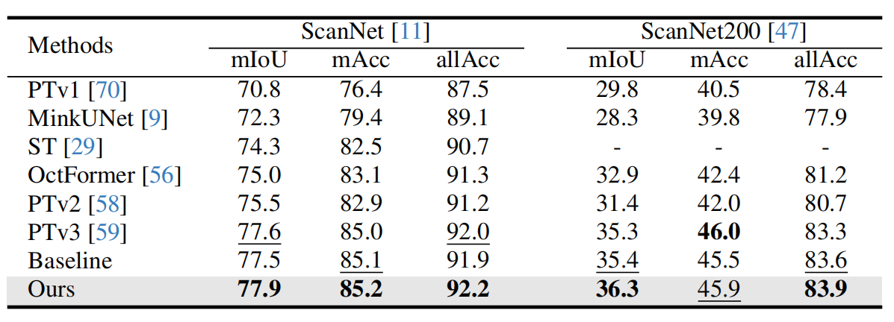

`表 1. ScanNet 和 ScanNet200 上的结果。我们的方法在几乎所有指标上都超越了其他方法。`

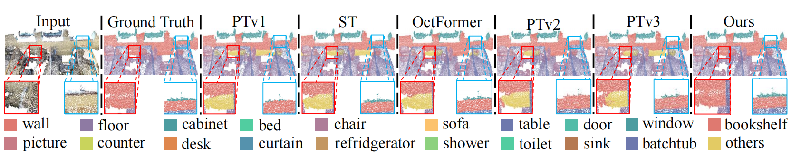

`图 4. ScanNet 上的可视化结果。我们的方法在物体边界处实现了更好的语义分割结果，例如墙与墙之间的边界（红色实框）以及墙与窗户之间的边界（蓝色实框）。`

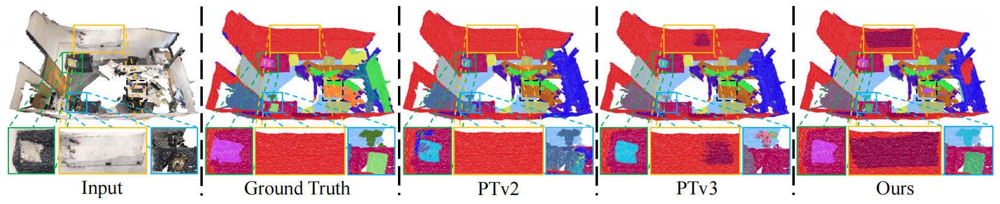

`图 5. ScanNet200 上的可视化结果。我们的方法在小物体识别方面实现了更清晰的分割结果，并且分割出了 Ground Truth（真值）中未标记的类别，例如键盘（黑色虚框）和白板（橙色实框）。`

​		事实上，如图 5 所示，**Ground Truth**（真值）有时包含**错误的标注**（例如，沙发的某些点被标记为枕头类别），甚至可能**遗漏标注**（例如，白板和键盘）。这可能是大多数模型在 **ScanNet200** 上表现不佳的原因之一。同时，**mIoU** 上的显著结果表明，与其他方法相比，我们的 **CDSegNet** 能够在**受扰动环境**中实现更好的性能。

​		`室外数据集.`  我们还在室外基准上进行了验证。与室内场景相比，室外点云中点与点之间的**空间距离**更大。这导致了更显著的**数据稀疏性**。表 2 显示 **CDSegNet** 展现了优异的结果，在 **mIoU** 上显著**超越**了现有方法。如第 4.1 节所述，**CNF** 与**特征增强策略**相一致，提高了在**稀疏场景**上的**泛化能力**。图 6 进一步展示了 **CDSegNet** 在大型室外稀疏场景中**小物体识别**方面的优越性，例如**植被**（红色实框和蓝色实框）。

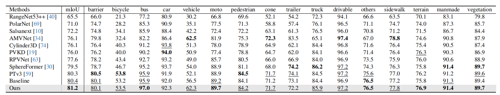

`表 2. nuScenes 上的结果。我们的方法在 mIoU 指标上显著优于其他方法。`

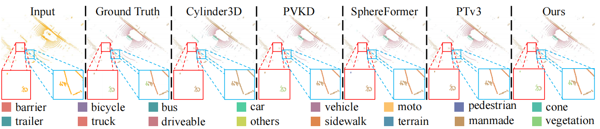

`图 6. nuScenes 上的可视化结果。我们的方法在小物体识别方面产生了显著的结果，例如植被（红色实框和蓝色实框）。`

#### 5.3. Validation for Noise Robustness

​		我们进一步验证了 **CDSegNet** 的**噪声鲁棒性**。这（实验）将**高斯扰动** $n_G \sim \mathcal{N}(n_G; 0, \tau I)$ 添加到模型的**归一化输入**中 [17, 44]，即 $c' = c + n_G$。

​		**图 7** 展示了 **CDSegNet** 在 **ScanNet** 和 **ScanNet200** 上强大的噪声鲁棒性。同时，我们可以观察到 **Ours**（我们的方法）和 **Ours-x0** 都强于**基线**（Baseline），验证了第 3.2 节中的结论。然而，**Ours-x0** 的表现显著**弱于** **Ours**。尽管 **Ours-x0** 在训练期间保留了**噪声样本** $x_t$，但其**拟合目标**是 $x_0$（原始数据），而不是 $\epsilon$（噪声）。这导致模型缺乏对场景的进一步**噪声适应能力**。我们认为 **DDPMs** 噪声系统中的**噪声拟合**主要贡献了噪声鲁棒性（我们希望在未来验证这一结论）。

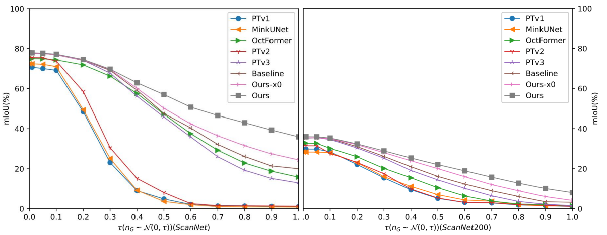

`图 7. ScanNet 和 ScanNet200 上的噪声鲁棒性结果。Ours-x0 意味着在 CDSegNet 的 NN（噪声网络）中，拟合目标是 $x_0$（原始数据）。我们的方法始终优于所有其他方法。`

​		此外，我们探究了针对**其他分布噪声**的**鲁棒性**。表 3 显示，尽管 **CDSegNet** 在面对来自其他分布的噪声时仍保持了强大的性能，但与**高斯噪声**相比，性能略有下降。结合公式 2，文献 [44] 从**数据分布梯度**的角度提供了一个直观的解释，即预测的噪声引导 $x_t \xrightarrow{\epsilon} x_{t-1}, \epsilon \sim p_{noise}(\epsilon|x_t, C)$。在本文中，我们提供了一个与**源头**（即优势来源）相一致的更简单的解释。

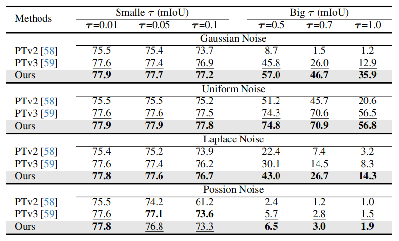

`表 3. ScanNet 上多种分布噪声鲁棒性的结果。我们的方法在高斯噪声和拉普拉斯噪声（近似于建模的分布）上表现良好，但在泊松噪声（与建模分布相差较远）上表现略差。`

​		根据第 3.2 节，由于 **DDPMs** 在训练期间能够看到**多级噪声样本**并拟合来自**建模分布**的**噪声目标**，这使得它们能够在**推理**期间适应**相关的分布噪声**。也就是说，与**非 DDPMs** 相比，**DDPMs** 对来自**建模分布**的噪声确实具有更强的**鲁棒性**。此外，**噪声分布**越**接近**建模分布，**噪声鲁棒性**就越好（如**拉普拉斯分布**）；否则，性能就会**下降**（如**泊松分布**）。

#### 5.4. Validation for Sparsity Robustness

​		我们还在**欠采样**的 **ScanNet** 上进行了**稀疏鲁棒性实验**。这首先分别从**训练集**和**验证集**中随机采样 **5%**, **10%**, **12.5%**, **25%** 和 **50%** 的数据。随后，模型在**欠采样**的训练集和验证集上进行**训练**和**拟合**，同时在**完整**的验证集上执行**推理**。

​		**图 8** 展示了结果。**CDSegNet** 在**欠采样数据**上展示了**显著的优势**。如第 3.2 节所述，**CNF**（条件-噪声架构）对齐了一种**可学习的特征增强**，将特征映射到更**复杂**的分布，从而增强了模型在**较少数据**上的**抗过拟合能力**。

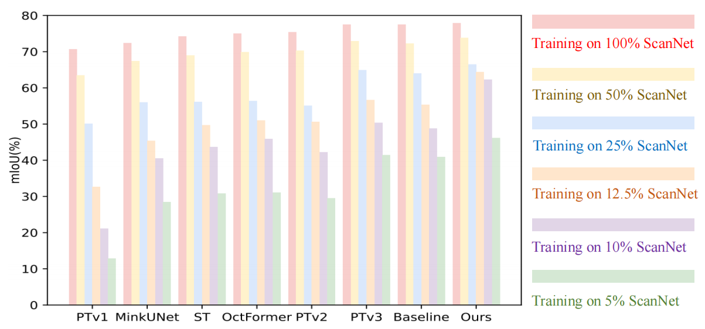

`图 8. 欠采样 ScanNet 上的稀疏鲁棒性结果。我们的方法在所有情况下都展示了最佳结果。`

#### 5.5 Generalization for CNF

​		如第 4.1 节所述，**CNF** 是一个将 **DDPMs** 引入 **3D 任务**的新型网络框架。因此，我们进一步进行了 **CNF** 的**泛化实验**。

​		**其他骨干网络**。我们首先进行了将 **CNF** 引入 **MinkUNet** 和 **PTv3** 的实验。我们仅将 **CDSegNet** 的 **FFM**（特征融合模块）和 **NN**（噪声网络）添加到 **MinkUNet**（使用 MinkUNet 来实现 NN）和 **PTv3** 中。在表 4 中，通过引入 **CNF**，**MinkUNet** 和 **PTv3** 在**多个基准**测试中展现了更好的结果，这归功于通过**合理扰动**实现的**特征增强**。此外，得益于**轻量级 NN**，**CNF** 在 **MinkUNet** 和 **PTv3** 中引入的额外**推理时间**和**内存消耗**是**可以忽略不计**的。此外，我们观察到 **PTv3** 在 **nuScenes** 上的速度竟然比 **CDSegNet** 慢，这是因为 **PTv3** 在**跳跃连接**中使用了耗时的**点级逐元素相加**，而 **CDSegNet** 使用的是**通道拼接**。

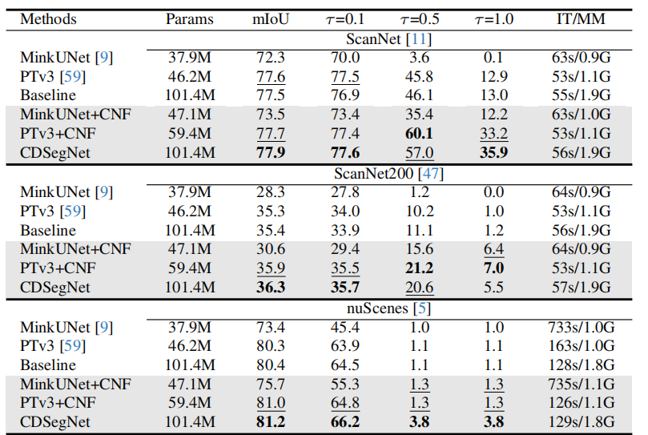

`表 4. 骨干网络在多个基准测试上的结果。‘IT’ 和 ‘MM’ 分别代表推理时间（Inference Time）和平均内存（Mean Memory）。我们在 NVIDIA 3090 GPU 上运行，批大小（batch size）为 1，且不使用测试时增强（TTA）和分片推理。`

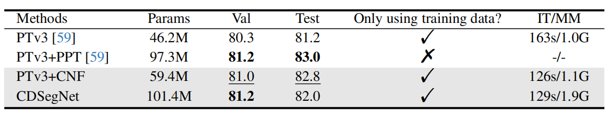

`表 5. nuScenes 测试集上的结果。我们的方法在 nuScenes 测试集上展示了优异的泛化能力。`

​		**测试集结果**。我们进一步在 **nuScenes 测试集**上进行了评估。**PTv3+PPT** 采用了一种**多数据集联合训练策略**（为了**公平比较**，我们避免刻意优化结果，因为我们无法得知实际使用了多少数据集和**训练技巧**）。在图 5 中，尽管 **PTv3+CNF** 的**参数量**几乎只有后者的一半，且仅在（nuScenes 官方的）**训练集**上进行训练，其表现仅**略差**于 **PTv3+PPT**。

​		**其他 3D 任务**。我们还将 **CNF** 引入到其他 3D 任务中，即**分类**。**PointNet** [42] 和 **PointNet++** [43] 被选为**骨干网络**。我们使用一个**额外的 PointNet++ 分支**来对**扩散过程**进行建模。**表 6** 显示，通过引入 **CNF**，它们在**分类**方面表现出了**显著的改进**，**缓解**了对**噪声**的敏感性。

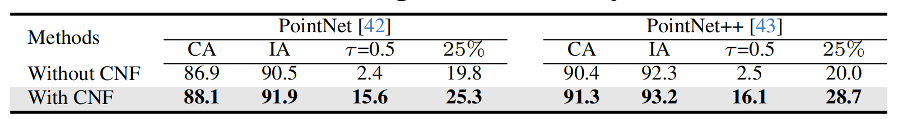

`表 6. ModelNet40 [60] 上的分类结果。‘CA’ 表示类别准确率（Class Accuracy），而 ‘IA’ 代表实例准确率（Instance Accuracy）。引入 CNF 提高了分类结果。`

#### 5.6 Ablation Study

​		**扩散建模**。我们首先对 **CDSegNet** 中的**扩散建模**进行了**消融实验**。表 7 展示了在 **ScanNet** 上的结果。**Ours-CN** 令人惊讶地在所有情况下都经历了**显著的性能下降**。我们认为，**过多的参数**导致模型在 **ScanNet** 上**过拟合**，从而导致**泛化能力**差。事实上，减少参数数量会将 **Ours-CN** 转化为 **PTv3**。这表明，**合理的扰动**可以显著增强 **CN**（条件网络）的**抗过拟合能力**。图 9(a) 进一步支持了这一结论。

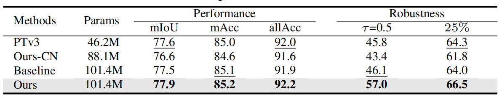

`表 7. CDSegNet 中扩散建模在 ScanNet 上的消融实验。基线（Baseline）意味着移除 NN（噪声网络）中的扩散建模。同时，Our-CN 代表移除 CDSegNet 中的整个 NN，仅保留 CN（条件网络）。这些结果证明了扩散建模对 CDSegNet 的重要性。`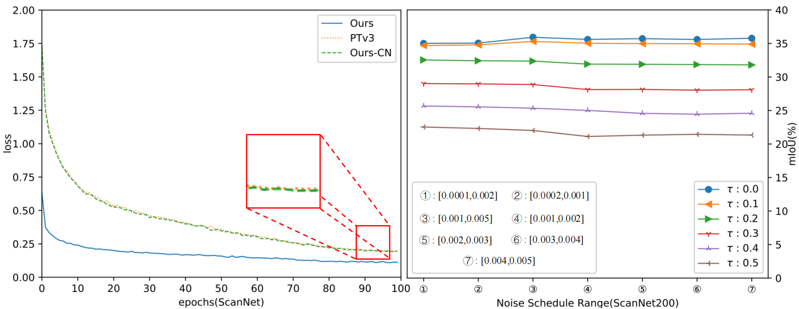

`图 9.(a) 展示了 Ours（我们的方法）、PTv3 和 Ours-CN 在 ScanNet 上的训练损失曲线。Ours-CN（相比之下拥有更多参数）的损失曲线与 PTv3 几乎完全相同，但在推理阶段结果较差，表明出现了过拟合。然而，Ours 展示了更低的损失曲线和更好的性能，这是因为来自 NN（噪声网络）的合理扰动缓解了模型过拟合，增强了泛化能力。(b) 中，线性调度噪声范围 ③ 展示了最佳的权衡。`

​		**噪声调度范围**。噪声调度范围对 **CDSegNet** 至关重要，它控制着**扰动程度**。通常情况下，噪声调度范围与**鲁棒性**呈**正相关**，而与**性能**呈**负相关**。这在**分割性能**和**噪声鲁棒性**之间产生了一种**权衡**。

​		在 **图 9(b)** 中，**③** 在 **ScanNet200** 上实现了最佳的**权衡**。同时，**余弦噪声调度范围 [0, 1000]** 和 **线性调度噪声范围 ⑤** 分别对应了 **ScanNet** 和 **nuScenes** 的最佳结果。这启发我们：对于更**复杂**（**ScanNet200**）或更**稀疏**（**nuScenes**）的场景，应选择**较小**的调度范围。相反，（对于 ScanNet 这类相对简单密集的场景）应选择**较大**的范围。

​		**多任务优化**。得益于**双分支架构** [22, 44]，CDSegNet 拥有两个**拟合目标**：**噪声拟合**和**语义标签拟合**，分别来自 **NN**（噪声网络）和 **CN**（条件网络）。然而，正如第 3.3 节所述，由于**拟合目标更多**，噪声拟合通常**收敛得更慢**。这可能会导致来自 NN 的**不合理噪声信息**损害 CN 理解**场景语义**的能力。因此，除了 **FFM**（特征融合模块）之外，我们还应用了一种有效的**损失平衡策略**，以进一步缓解不合理的噪声扰动（更多优化细节见补充材料）。

​		我们考虑了几种损失平衡策略：1) **等权重** (EW)；2) **随机损失加权** (RLW) [32]；3) **不确定性权重** (UW) [27]；4) **几何损失策略** (GLS) [8]。**表 8** 显示 **GLS** 取得了最佳结果。此外，我们观察到在使用 GLS 进行平衡后，**CN**（条件网络）和 **NN**（噪声网络）的损失值变得更加接近，且波动更小。这进一步启发我们从**多任务**的角度来优化**多分支框架**模型。同时，为了获得更好的性能，多个任务之间的损失值应当更加**紧凑**和**稳定**。

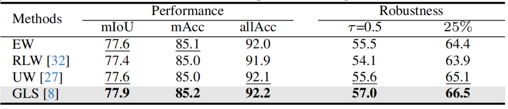

`表 8. ScanNet 上多任务优化的消融实验。GLS（几何损失策略）为 CDSegNet 展示了更好的性能和鲁棒性。`

### 6.Conclusion	

​		在本文中，我们**系统地揭示**了 **DDPMs**（去噪扩散概率模型）在**点云语义分割**中的一些**关键见解**。同时，为了在**保留优势**的同时**克服局限性**，我们设计了一种 **DDPMs 的条件-噪声框架**（Conditional-Noise Framework）。基于此，我们进一步提出了一种**端到端**的**鲁棒点云分割网络**——**CDSegNet**。**CDSegNet** 展示了对**数据噪声**和**稀疏性**的强大**鲁棒性**，同时仅需要**单步推理**。此外，我们为源自 **DDPMs** 的噪声鲁棒性提供了一个**更易懂的解释**。总的来说，我们**降低**了应用 **DDPMs** 的**门槛**，希望能鼓励 **DDPMs** 在 **3D 任务**中的更广泛扩展。