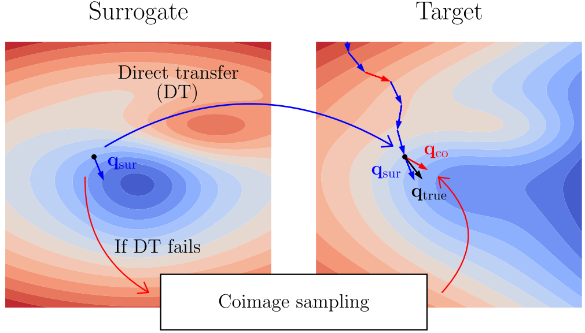
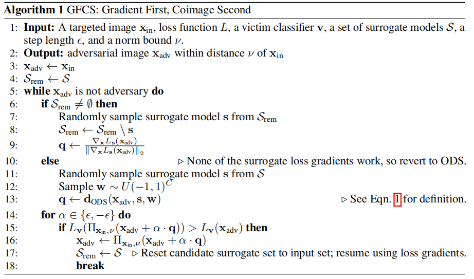
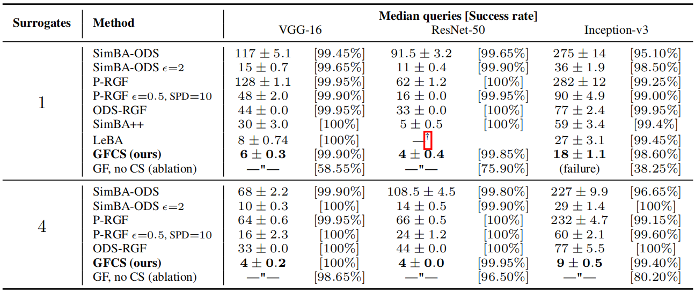
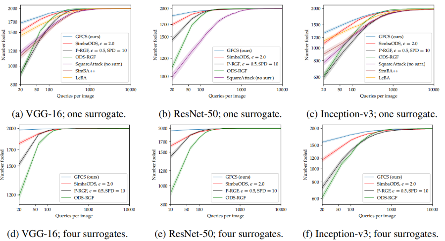
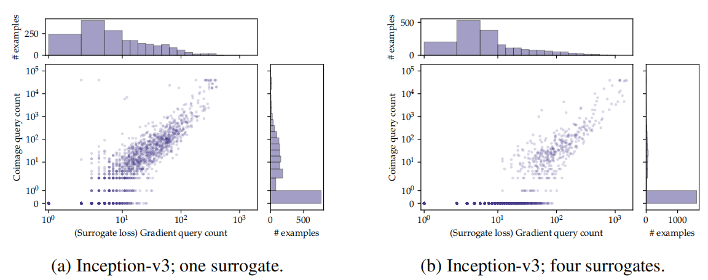
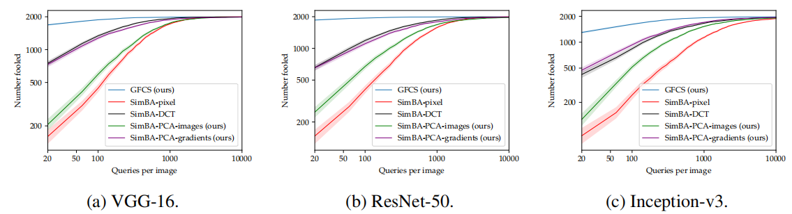
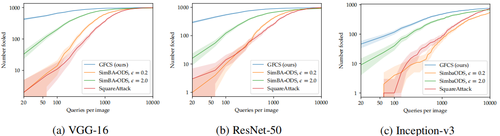
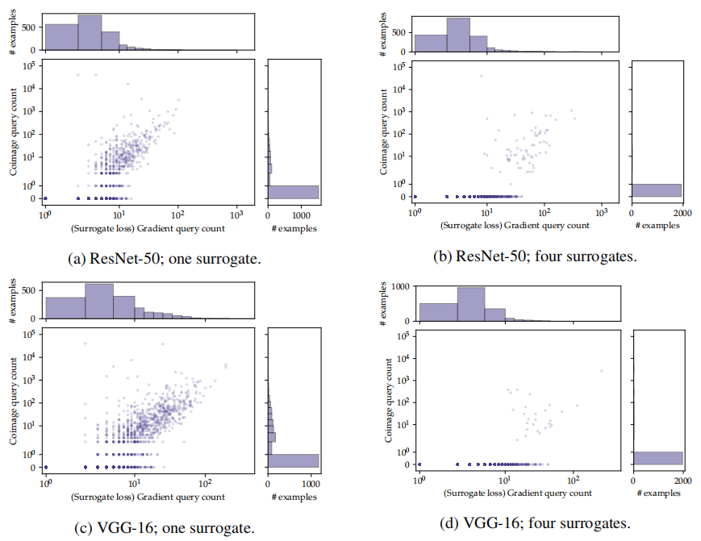

## Attacking Deep Networks With Surrogate-Based Adversarial Black- Box Methods Is Easy

## Abstract

​		近期关于黑盒**对抗攻击**的一系列工作，通过将**代理模型**的迁移整合到基于查询的搜索中，重新复兴了迁移法的使用。然而，我们发现此类现有方法的表现并未达到其应有的潜力，且往往过于复杂。在此，我们提供了一种简短且简单的算法，该算法通过利用代理网络的`类别分数梯度`进行搜索，从而实现了最前沿的结果，且无需其他先验知识或启发式方法。该算法的指导性假设是：`所研究的网络在本质上学习的是相似的函数`，因此从一个网络到另一个网络的**迁移攻击**应当是相当“容易”的。这一假设得到了极低查询次数和失败率的证实：例如，以 ResNet-152 作为替代模型，对 VGG-16 ImageNet 网络进行**无目标攻击**，在成功率为 99.9% 的情况下，中位查询次数仅为 6。代码可在 <https://github.com/fiveai/GFCS> 获取。

## 1 Introduction

​		介绍对抗样本的论文（Szegedy et al., 2014）也启动了对其在模型间转移的研究。这直接催生了关于分类系统的“白盒”和“黑盒”攻击的两条并行研究路线。`1. 白盒攻击`（例如Goodfellow et al. (2015); Moosavi-Dezfooli et al. (2016); Carlini & Wagner (2017)）假设完全了解受害模型的架构和参数，并通常利用网络输出对输入图像的分析梯度。这些方法主要关注于证明对抗样本的存在，并优化诸如其范数或计算它们所花费的时间等标准。另一方面，`2. 最早的黑盒攻击`（例如Papernot et al. (2017); Liu et al. (2017)）假设攻击者无法访问被攻击的模型，除非用户能够输入图像并接收输出分类。它们试图通过从已知的代理模型中转移对抗样本来对目标模型进行攻击。这个代理模型可以是一个在类似问题上单独训练的模型，也可以是通过一系列在线查询训练以模仿目标模型的模型；`3. 转移攻击`通常只需执行一次简单的代理梯度方向的步伐。这些方法主要关注于对抗样本的可发现性和可预测性。该研究方向的关键假设是，不同的机器学习架构在训练相似问题时，应该在相同的输入上表现出相似的对抗脆弱性。正如之后的研究所更好地理解和解释的那样（Olah et al., 2017; Jetley et al., 2018; Ilyas et al., 2019b），这等同于这些网络在彼此之间学习到相似的特征响应，即学习到相似的解决方案。尽管这些攻击确实展示了非平凡的成功率，从而部分验证了该假设，但该领域普遍承认它们的可靠性是有限的，因此寻求更高成功率的替代方案。

​		为此，相关研究引入了对**威胁模型**的修改：他们假设受害模型不仅提供**顶层类别预测**，还提供候选类别的分数 。这种放宽限制的做法消除了对**替代模型**的需求，使得能够利用基于查询的方法直接数值估计受害模型的梯度 。这些方法及其许多衍生方法被称为`4. “基于分数的攻击”` 。上述开创性工作指出的它们共同面临的问题是，`梯度的直接数值估计与输入空间的维度成线性关系` 。根据输入图像的分辨率，这可能从成本高昂到完全不可行 。因此，基于分数的攻击中的核心问题是在不损害梯度估计质量的前提下限制查询次数：仅在这一项研究中，提议就包括**坐标下降**、**基变换**、**粗细粒度优化**以及梯度的**先验知识** 。随后的系列工作通过尝试不同的优化方法和先验知识来探索改进基本方法的途径 。显著且或许令人惊讶的是，最成功的尝试之一是 `SimBA（简单黑盒攻击）`。其名称源于它是一种极其基础的**坐标下降**形式，尽管方法设计刻意简单，却取得了具有竞争力的结果：它沿着**正交基**方向，以固定步长贪婪地顺序分配正负符号。

​		虽然`5. 基于查询的评分黑盒攻击`被提出作为**迁移方法**的替代方案，但这两者并非互不兼容。它们实际上是互补的：基于查询的策略可以受益于先验上更具前景的搜索方向，而基于迁移的策略则可以受益于灵活的**优化器**，使其能够动态修正近似误差并考虑替代假设。这一点最初由相关研究提出。在本文中，我们认为这一研究分支的核心直觉是正确的。然而，我们还认为，在结合迁移和基于查询的方法时，至关重要的一点是必须认识到，即使是利用了**替代模型**梯度迁移的方法，通常也高估了其失败率。迁移通常是成功的：`它只需要在一个合理的优化框架内，偶尔提供适当选择的替代假设来源即可`。正是这一核心洞察力使我们能够提出一种简单而强大的新算法，**在最小化识别特定网络上 $l_2$ 范数限制的对抗扰动所需查询次数的实验设置下**，该算法达到了针对最现代竞争方法的先进结果。我们将我们的方法称为“`GFCS`：梯度优先，余像次之（Gradient First, Coimage Second）”，因为其搜索方向要么代表对抗损失本身的替代梯度，要么在失败时，从替代**雅可比矩阵**的行空间（称为“**余像**”）中随机选择。前一种情况代表标准的迁移攻击；后一种情况涉及搜索局部线性化替代模型表现出任何响应的特征空间，其本身是梯度迁移的一种广义形式。该优化方法只是标准**投影梯度上升**（PGA）背景下的一种相关算法变体。该方法效率的关键在于识别低维的有效局部搜索空间：在常见的 ImageNet Inception-v3 实现中，将搜索限制在余像内可将维度从 $299 \times 299 \times 3$（输入分辨率）降低到 1000（输出类别数）。当然，损失梯度是一维的。

​		从安全角度来看，假设既能获得类别评分又能访问**替代模型**的**威胁模型**是否具有现实意义是一个存在争议的问题，对此我们持中立态度 。我们对这一问题的兴趣在于分析层面，并主要提出两个观点 。第一，如果这一威胁模型被认为具有研究价值（正如现有技术所展示的那样），那么就应该了解目前所提出的这个问题是多么“简单”：即使只有一个替代模型，也能将查询次数减少到寥寥几次 。第二，`GFCS` 在完全依**赖网络间梯度迁移的情况下表现如此出色，这一事实证明了这些网络在重要意义上是非常相似的 。**

`图 1：GFCS（梯度优先，余像次之）中从替代模型到目标模型的信息迁移 。`如右侧所示，在目标模型的损失景观中进行了一系列优化步骤 。每个候选方向 $q$ 由替代模型通过以下两种方式之一提供：要么通过替代模型自身梯度 $q_{sur}$ 的直接迁移，要么是通过第 2.2 节中描述的余像采样过程生成的 $q_{co}$ 。$q_{true}$ 是目标模型真实但无法获取的梯度 。如第 3.2 节所示，该方法主要依赖于直接迁移的 $q_{sur}$，并利用 $q_{co}$ 来避免失败 

## 2 Method

### 2.1  Preliminaries

​		**对抗攻击**问题存在略微不同的变体 。通常情况下，给定一个分类器函数 $f(x) : \mathcal{X} \rightarrow \mathcal{Y}$，目标是提供一个**对抗样本** $x_{adv} \in \mathcal{X}$，该样本在某种定义下与给定的 $x_{in}$ “接近”，但能使 $f(x_{adv})$ 与 $f(x_{in})$ 以某种显著的方式不同 。在图像分类中，我们通常面临的情况是 $\mathcal{X} \subseteq \mathcal{R}^D$ 且 $\mathcal{Y} \subseteq \mathcal{R}^C$，其中 $f$ 是一个将 $D$ 维输入图像映射到 $C$ 维类别评分（**logit**）向量的网络 。**非定向攻击**的目标是 $\text{argmax}_c f_c(x_{adv}) \neq \text{argmax}_c f_c(x_{in})$，即 $x_{adv}$ 的最高预测类别不同于 $x_{in}$ 的类别 。而**定向攻击**的目标则是 $\text{argmax}_c f_c(x_{adv}) = t$，意味着网络预测了一个特定目标类 $t$，而非原始预测类 $\text{argmax}_c f_c(x_{in})$ 。

​		随着该子领域的研究扩展，考虑的扰动类型已包括非刚性变形、语义上无关紧要的失真以及在估计的自然图像**流形**内的移动，相应的对抗扰动幅度定义也被采用，包括全变分和人工评估 。本文中所有对比方法所使用的最常见衡量标准是 $\|x_{in} - x_{adv}\|_p$，其中 $p \in \{2, \infty\}$：在这里，我们使用 $p = 2$ 。

​		在某些实验设置中，攻击者的目标是在满足对抗目标的同时最小化扰动幅度 。在另一些设置中，目标是在预设的扰动幅度范围内，最小化找到任何对抗样本所需的网络评估次数 。在黑盒攻击中，后一种设置非常普遍，其中“评估”被定义为对**受害者模型**的查询：这同样也是我们的关注焦点。

### 2.2 Alogrithm

​		提出的方法的整体内容以伪代码形式在算法 1 中给出 。如第 2.1 节所述，该方法需要一个**受害者分类器** $v$、一张输入图像 $x_{in}$ 以及一个范数边界 $\nu$ 。`投影算子` $\Pi_{x_{in},\nu}$ 将其输入限制在以 $x_{in}$ 为中心的 $\nu$ 球体内：它在算法中的加入代表了标准的**投影梯度上升**（PGA）实现 。此外，该方法还需要一个**损失函数** $L$、`一个由一个或多个替代模型组成的集合` $\mathcal{S}$，以及一个步长 $\epsilon$，代表在每个迭代点沿其候选方向尝试的扰动的固定长度 。损失函数 $L$ 可以是迭代点的任何函数，只要能作为对抗目标的合适代理即可，如第 2.1 节所述：这里唯一的要求是它是可微的 。在我们的实现中，我们选择了流行且有效的**边界损失**（Margin Loss） $L_f(x) = f_{c_t}(x) - f_{c_s}(x)$，其中 $c_s = \text{argmax}_c v_c(x)$ 且 $c_t = \text{argmax}_{c \neq c_s} v_c(x)$，即最高与次高（或者在**定向攻击**情况下，为目标类）类别评分之间的差值 。请注意，类别 ID $c_t$ 和 $c_s$ 是根据 $v$ 的排名定义的，但在参数化损失的网络 $f$ 上进行评估，根据算法的具体行数，该网络要么是 $s$，要么是 $v$ 。替代方法自然假设替代模型将提供关于受害者的有用信息，但除了作为将 $\mathcal{X} \rightarrow \mathcal{Y}$ 映射的一次可微函数外，对替代模型 $s \in \mathcal{S}$ 没有“硬性”要求 。网络 $f$ 和输入 $x$ 的 **ODS 方向**（输出多样化采样方向） $d_{ODS}$ 的定义为 ：
$$
d_{ODS}(x, f, w) = \frac{\nabla_x(w^\top f(x))}{\|\nabla_x(w^\top f(x))\|_2} = \frac{w^\top(\nabla_x f(x))}{\|\nabla_x(w^\top f(x))\|_2} \tag{1}
$$
​		其中 $w$ 从 $[-1, 1]^C$ 上的均匀分布中采样 。根据定义，它是`所有类别评分的随机加权之和的归一化梯度` 。等价地，由于线性关系，它是所有类别评分梯度（即**雅可比矩阵**的行）的随机加权和，这些梯度本身构成了 $f$ 线性近似的**余像**（Coimage）的一组基：即 $f$ 表现出任何非零响应的子空间 。

​		如第 1 节所述，该方法的逻辑非常简单 。在任何给定的迭代点，该方法尝试以类似于 **SimBA** 的方式进行操作，即`沿着候选方向以固定步长测试对抗损失的变化，并在必要时将其投影回可行集内` 。该方法的操作流程完全使用来自输入集中**替代模型**的归一化损失梯度（以随机顺序抽取且不放回），除非并直到在当前迭代点穷尽所有梯度仍未成功为止 。正如我们将在第 3.2 节中证明的那样，这种中间失败状态很少发生 。然而，如果达到了这种状态，该方法会转而随机采样一个替代模型（有放回）并从该模型中采样一个 **ODS 方向**，每次都尝试进行一次 SimBA 更新，直到实现损失的改善为止 。一旦此类成功更新发生，该方法会将候选替代模型集重置为输入集，并恢复到仅使用归一化损失梯度的模式 。当找到**对抗样本**或超过指定的查询次数上限时，该方法终止 。

## 3 Experiments

### 3.1 Untargeted attacks

​		`实验设置`：我们通过设计一个涵盖各相关原始工作中关键实验方面的实验框架，将 `GFCS` 与 [5, 25, 27, 30] 的方法进行对比。我们使用每种方法针对每个**受害者网络**，对随机选择的 2000 张被正确分类的 **ILSVRC2012** 验证集图像进行 $l_2$ 范数约束的**非定向攻击**。每个样本的最大查询次数设定为 10000 次（超过此限制则宣布失败），且通过**投影梯度上升**（PGA）强制执行的 $l_2$ 边界被设定为常用的 $\sqrt{0.001D}$，其中 $D$ 是受害者网络原生输入分辨率下的图像维度。受害者网络采用常用的 **VGG-16**、**ResNet-50** 和 **Inception-v3**。针对两种**替代模型**集的选择分别重复实验：一种是仅包含 **ResNet-152**（如 [5, 30] 中所示），另一种是包含 {**VGG-19**、**ResNet-34**、**DenseNet-121**、**MobileNet-v2**} 的集合（如 [25] 中所示）。由于 **LeBA**[30] 不支持非单元素替代集，因此在后一种设置中将其排除。所有使用的网络均为通过 **PyTorch**/**torchvision** 获取的预训练模型。竞争方法的参数值均按照其指定值设定，除非下文出于将要讨论的原因另有说明。**LeBA** 在包含 1000 张图像的留出集上以“训练”模式运行，然后在与其他所有方法相同的 2000 张图像集上以“测试”模式进行评估。**P-RGF**[5] 始终使用自适应系数模式。**P-RGF** 和 **ODS-RGF**[25] 基于我们自己对参考 **P-RGF** 代码的 **PyTorch** 移植版本，该代码将随本论文一同发布：目前尚不存在 **ODS-RGF** 的其他公开实现。为了进行对比，我们还纳入了无需替代模型的 **Square Attack**[1] 进行了比较。

​		`结果`：表 1 报告了攻击成功率和中值查询次数，图 2 绘制了每个样本的累积成功次数与最大查询次数的关系图（经归一化处理后的 **CDF**） 。与以往的工作不同，我们不报告平均值，因为平均值不适合概括这些方法产生的**长尾分布** 。不确定性在表 1 中以标准误差表示，在图 2 中以 95% 置信区间表示，两者均通过**自助采样法**获得 。

`表 1：使用替代模型的先进非定向黑盒攻击方法的中值查询次数 。标记为` $\dagger$ `的缺失条目表示 LeBA 代码在完成 ResNet-50 的全套图像处理前崩溃。` 

`图 2：展示在对 VGG-16、ResNet-50 和 Inception-v3 网络进行非定向黑盒攻击时，不同查询次数下成功攻击样本数量的 CDF（累积分布函数）。`

从表 1 中可以明显看出两点 。首先，所有研究的方法在针对所有受害者网络时都具有极高的成功率：观察到的最低成功率为 95.10%，即以 ResNet-152 为唯一替代模型的 Inception-v3 上的 SimBA-ODS 。其次，`GFCS` 在实现与其他所有方法相似的高成功率的同时，产生的**中值查询次数**极低 。这一事实在图 2a、2b 和 2c 的单替代模型结果中可以更详细地看到，其中 `GFCS` 明显在低查询区域占据主导地位，而在多替代模型的图 2d、2e 和 2f 中表现得更为显著 。尽管 `GFCS` 非常简单，但情况依然如此：例如，将算法 1 与 LeBA 在单独步骤中训练其替代模型的方法进行比较 。请注意，我们选择 SimBA-ODS 作为**余像采样器**部分原因是出于简洁性：如结果所示，当它单独使用时预料会出现极少数失败案例，而我们实际上继承了这些失败 。如果以增加一点实现复杂度为代价，例如替换为 ODS-RGF，可能会进一步改善失败率，同时仍然代表 `GFCS` 的一种形式 。还有一个值得注意的额外现象：表 1 还展示了`现有方法的性能对其自身参数值选择的依赖性` 。令人惊讶的是，ODS-RGF 相较于早期 P-RGF 的大部分经验增益归功于各方法中默认参数的不同选择：当 P-RGF 简单地使用 ODS-RGF 的默认参数时，它在 ResNet-50 上的中值查询次数实际上大大优于后者，代价是单替代模型失败率仅增加了 0.05% 。SimBA-ODS 从其步长参数一个数量级的增加中获益匪浅 。这本身进一步证明了我们的核心论点，即在这种背景下，**迁移攻击**通常执行得过于保守 。当然，过于激进也是不可取的：参见表中代表仅使用损失梯度的**消融实验**行，即“只有 GF 而没有 CS” 。

### 3.2 Analysis of Algorithm behaviour

​		为了深入探讨第 3.1 节的结果 ，我们将每个受攻击的样本绘制为一个二维点，其 $x$ 坐标是算法中**替代损失梯度**模块所消耗的查询次数，$y$ 坐标是**余像**模块对应的查询次数 。这便得到了图 3 的散点图，并辅以与对侧轴相对应的**边缘直方图** 。该图展示了使用 Inception-v3 作为**受害者网络**得到的结果；关于 VGG-16 和 ResNet-50 的类似图表请参见附录 A.3 。请注意，主散点图的轴是**双对数坐标**，而边缘直方图的轴是**线性-对数坐标** 。一些现象显而易见：首先，有很大一部分样本（由图表底部密集的水平点列表示）在极少的查询次数内（1 到 10 次量级）便攻击成功，这完全或几乎完全归功于替代模型梯度迁移，而很少或根本没有使用 **ODS** 。由于这些低查询集群极其密集，应查阅相应的边缘分布（最好在放大下查看）以便对其进行量化 。其次，当使用四个替代模型集而非单独的 ResNet-152 时，处于该状态之外的样本数量显著下降，这可以通过对比图表的左侧和右侧看出 。显而易见，依赖于梯度和基于余像的方向生成器之间相互作用的样本被缩减为一个不容忽视（即若不处理足以影响失败率）但相对较小的群体 。总体而言，在从底部密集低查询集群向外延伸的点中，即依赖于这两种子方法的样本中，替代损失梯度查询和 ODS 查询之间存在一个数量级的差异 。也就是说，当需要 ODS 模块时，其推进优化器所需的查询次数通常远多于梯度即可满足要求的常见情况 。

`图 3：拟议方法 GFCS（梯度优先，余像次之）总查询次数的分解 。x 轴代表该方法中梯度部分实现成功攻击所需的查询次数，y​ 轴代表余像部分所需的查询次数 。散点图上方和右侧的直方图代表了边缘经验分布` 

### 3.3 On the importance of input-specific priors

​		我们已经证明，**替代卷积神经网络**足以对针对同一问题训练的其他卷积神经网络发起极其有效的**评分黑盒攻击** 。我们现在提出一个经验性论据，即此类替代网络在实现这一性能水平方面可能是必要的 。也就是说，由替代网络编码的特定位置信息（其中梯度先验是输入图像空间点的函数）提高了攻击效能，其效果超过了那些使用位置无关先验并在联机状态下推断特定位置属性的方法 。我们认为这一点并非显而易见 。**通用对抗扰动**现象证明了对抗脆弱性在某种程度上具有位置不可知性 ，而 `GFCS` 所基于的原始 **SimBA** 方法本身也证明了在线确定预定义基向量符号的卓越效能 。**SimBA** 论文本身也提出，未来的工作应“进一步研究不同正交基集合的选择，这通过增加找到大幅变化方向的概率，对该方法的效率至关重要” 。从先验角度来看，目前尚不清楚相比于具有基向量先验排序的精心选择的对抗子空间，替代网络能带来多少额外收益 。

​		为了在我们的 **SimBA** 优化框架内对此进行研究，我们提出了一种名为“`SimBA-PCA`”的变体，其定义取决于生成 SimBA **基矩阵**的方法 。遵循相关研究 中使用的方法，我们将样本输入集上的**对抗样本**收集为一个矩阵的列，然后计算该矩阵的 **SVD**（奇异值分解） 。也就是说，当被约束遵循 SimBA 的迭代对抗构建优化程序时，我们生成了一组有序向量，这组向量预期代表了在给定集合上重现对抗样本的 $l_2$ 最优基 。然后，我们将此方法与使用随机顺序的规范**像素基**、**DCT 基**以及 `GFCS` 进行对比 。作为一个有趣的补充，我们还纳入了直接对原始图像使用该程序的结果，即使用输入数据的**主成分**作为搜索方向 。所有这些方法都置于同一个范数约束的 **PGA**（投影梯度上升）框架内。

​		图 4 展示了该实验的结果 。正如预测的那样，基于梯度的基向量（“`SimBA-PCA-gradients`”）明显优于规范**像素基**（“`SimBA pixel`”）以及图像**主成分**（“`SimBA-PCA-images`”），后者的事实表明**对抗方向**中所编码的信息确实超出了与数据变化模式的简单对应关系 。不过值得注意的是，数据主方向确实优于幼稚的像素基，这并不意外地揭示了数据变化模式与网络学习到的特征之间存在非平凡的相关性 。然而，尽管形成了“自然对抗基”，对抗**奇异向量**矩阵通常并没能超越 **DCT 基**：它们的结果非常接近，甚至 DCT 基有时略胜一筹 。也就是说，经过适当频率计数调整的 DCT 基似乎已经代表了通过单一固定**标准正交基**进行 SimBA 式迭代所能达到的极限，而 `SimBA-PCA` 程序充其量只是找回了与之等效的基 。相比之下，`GFCS` 比所有对比方法都高效得多，这证明了当先验可以根据迭代点进行条件化（即利用**局部梯度**信息）时所能获得的性能提升 。这是看待**替代模型**为何如此强大的一种方式 。尽管这些替代模型最初并非为了模拟其受害者而设计，而本应代表它们的架构替代方案，但情况依然如此 。

​		`图 4：在局部评估替代梯度的 GFCS 与构建位置无关梯度先验的各种 SimBA 变体之间的对比 。请参阅第 3.3 节 。`

### 3.4 Targeted attack

​		我们还在**有目标攻击**场景下测试了我们的方法 。除了另有说明外，设置与第 3.1 节相同 。在这些实验中，我们没有使用**边界损失**，而是使用了目标类别 **Softmax** 分数的**对数损失**，这是定向攻击常用的选择：$L_f(x) = \log p_t$，其中 $p_t = \frac{e^{f_t(x)}}{\sum_c e^{f_c(x)}}$ 。也就是说，攻击者的目标是普遍提高目标类别的置信度，而牺牲所有其他类别，而不是仅仅抑制特定的原始类别 。我们为每个设置进行了多次运行，每张图像的目标类别是从除**地面真值**（Ground Truth）以外的所有 ImageNet 类别中随机（均匀地）选择的 。在先前的相关研究 中，均未提供定向攻击的结果或代码 。虽然有研究 报告了 **P-RGF** 及其自身的 **ODS-RGF** 的定向攻击数据，但并没有可用的支持性实现 。如前所述，我们在第 3.4 节中的 P-RGF 和 ODS-RGF 结果是使用公共 P-RGF 仓库的移植版本生成的，而该仓库仅支持**非定向攻击**（这一限制也延续到了我们对其进行的 ODS-RGF 修改中）。因此，我们采用了提供的 **SimBA-ODS** 实现，将其与 `GFCS` 进行单独对比，在此场景下它作为备选方法 。结果如图 5 所示 。可以看出，即使在这种更为困难的攻击场景下（在这种场景下，`GFCS` 较激进的迁移策略本预料会受到影响），我们的方法依然保持了巨大的优势 。

`图 5：展示在使用四个替代模型对 1000 张 ImageNet 图像进行定向黑盒攻击时，不同查询次数下成功攻击样本数量的 CDF。`

​		虽然相关研究提出的定向攻击方法既强大且在概念上具有关联性，但其给出的公式在架构上与 $l_\infty$ 范数绑定，因此不适用于我们的 $l_2$ 边界对比 。此外，该方法在给定训练好的替代模型后，还要求在留出验证集上训练其对抗**编码器-解码器**网络；正如原作者在其工作中承认的那样，在定向攻击的情况下，必须针对每个目标类别分别进行训练 。相比之下，我们的方法可以直接使用替代模型，且在任何目标类别上均无此类问题 。

## 4 Related work

​		相关研究和在**基于评分的黑盒**语境下首先实现了他们所谓的“弥合迁移攻击与查询攻击之间的鸿沟” 。他们指出，早期的方案“往往面临攻击成功率低（迁移法）或查询效率差（查询法）的问题，因为在信息有限的高维空间中估算梯度并非易事” 。相关研究通过在每次迭代中为 Bandits 优化器提供**替代梯度**估计来实现这一点，并通过在测试时使用 **Dropout** 和 **Drop-layer** 来增加提议搜索方向的多样性 。相关研究提出了一种**随机无梯度**（RGF）优化的变体，该方法使用替代梯度作为偏置先验（**P-RGF**），并具有动态估计的偏置参数，尽管该参数的最优值本身取决于未知的目标梯度 。相关研究提出的**输出多样化采样**（ODS）方法通过对多个替代模型的随机加权 **Logit** 和进行梯度采样，从而为 **SimBA**、RGF 以及某些**边界攻击**（Boundary Attack）变体生成搜索方向，证明了其相较于所有基础方法的改进 。相关研究还提出了 SimBA 的替代增强版本（**SimBA++**），该版本根据替代梯度分量对应的幅值指定的分布来采样待扰动的候选像素，并定期尝试直接迁移使用平滑和动量估计的替代梯度 。当该方法与“高阶梯度近似”（一种通过匹配受害者模型的一阶和零阶行为来动态更新替代模型的方法）相结合时，被称为“**可学习黑盒攻击**”（LeBA）

​		除了上述内容外，我们还回顾了**黑盒攻击**的相关工作，特别是那些利用了（可能是学习到的）**先验信息**和/或替代**优化器**的**基于评分的方法** 。当这些方法涉及相关概念时，我们还纳入了 Brendel et al. (2018) 提出的**边界攻击**（Boundary Attack）方法的变体，此类方法通过牺牲更高的查询次数来换取无需评分信息的需求 ：

​		`频率/尺度先验`：正如 Chen et al. (2017) 和 Bhagoji et al. (2018) 所指出的，为了具备实用性，任何依赖于梯度估计的黑盒方法都必须采用某种手段来有效降低估计空间的**内在维度**。Guo et al. (2019a; 2020) 为此目的利用了低频 **DCT** 维度。Brunner et al. (2019) 的**边界攻击**变体同样使用了 **Perlin 噪声**，而 Yang et al. (2020) 中梯度的**高斯平滑**在概念上也与之相关。与低频先验密切相关的还有**空间下采样**的使用，无论这种采样是应用于图像还是其梯度，也无论它是通过池化、插值还是步长来实现的：Tu et al. (2019)、Ilyas et al. (2019a)、Li et al. (2019) 以及 Wang et al. (2021) 均涉及了这一技术的不同版本。在 Moon et al. (2019) 和 Al-Dujaili & O’Reilly (2020) 中出现了**由粗到精方法**，即在较粗尺度下的结果要么直接解决了问题，要么为更细尺度下的优化器提供了初始化。

​		`数据分布建模`：Li et al. (2019) 假设有能力在输入点附近对**对抗分布**进行参数化建模 。Dolatabadi et al. (2020) 将此参数化模型替换为在干净数据上训练的**归一化流**模型 。Tu et al. (2019) 使用**自动编码器**表示数据，并在其潜空间中进行攻击 。Huang & Zhang (2020) 同样进行了潜空间攻击，但是在一个经过训练、专门用于在源网络上输出对抗样本的编码器-解码器网络中进行的 。Ru et al. (2019) 试图学习潜空间维度本身 。

​		`注意力`：Wang et al. (2021) 使用代理网络上的 **CAM** (Zhou et al., 2016) 输出作为待攻击像素的地图 。在 Brunner et al. (2019) 中，类似的地图源自对抗图像和原始图像之间的差异，并用于对采样的扰动进行逐元素加权 。

​		`梯度/特征先验`：上文已讨论了 Guo et al. (2019b)、Cheng et al. (2019)、Tashiro et al. (2020) 以及 Yang et al. (2020) 中梯度先验的使用 ，而基于迁移的方法 Papernot et al. (2017) 和 Liu et al. (2017) 当然从根本上基于此 。除此之外，Brunner et al. (2019) 的方法使用**替代模型**的梯度来偏置**边界攻击**中使用的正交扰动，并指出：“即使对于直接迁移攻击来说太弱的替代模型也可以在我们的框架中使用” 。Yan et al. (2021) 也是边界攻击的一个变体，试图使用定制的预训练**策略网络**学习模拟受害者网络的梯度 。Huang & Zhang (2020) 从其替代模型中学习了可迁移**对抗特征**的潜空间 。Andriushchenko et al. (2020) 提供了一个定制的特征库，本质上是迁移经验领域的知识（即被确定可能欺骗 CNN 的特征），无论是在初始化（垂直条纹）还是特征选择（$l_{\infty}$ 情况下的同质正方形，$l_{2}$ 情况下的成对相反符号的“衰减峰”） 。Sahu et al. (2020) 试图通过在**高斯马尔可夫随机场**框架内学习损失函数梯度分量之间的相关性来执行“黑盒 FGSM” 。Ilyas et al. (2019a) 的“梯度先验”本质上等同于动量和下采样，并不代表我们在此讨论的那种“灵活梯度迁移” 。

​		`优化算法`：再次强调，基于评分的黑盒攻击的标准优化框架是在猜测的方向上通过数值导数估计梯度，并进行梯度上升 ，该框架可能使用先验增强和/或**坐标上升**等简化手段 。我们认为上述 **SimBA** 变体（包括我们提出的方法）在本质上都属于这一类型 。该方法的变体或替代方案包括：**多臂老虎机**（Ilyas et al. (2019a) ；Guo et al. (2019b) ）、**自然进化策略**（NES）（Li et al. (2019) ；Huang & Zhang (2020) ；Dolatabadi et al. (2020) ）、**进化算法**（Liu et al. (2020) ；Wang et al. (2021) ）、**贝叶斯优化**（Ru et al. (2019) ；Shukla et al. (2019) ）以及通过 REINFORCE 算法训练**策略网络**（Yan et al. (2021) ） 。 Al-Dujaili & O’Reilly (2020) 使用了一种自定义的“翻转/还原（flip/revert）”方法，该方法基于检查成组的符号变化对像素扰动的整体影响 。在假设**次模性**（submodularity）的前提下，Moon et al. (2019) 使用基于**最大堆**的“局部搜索算法”，在定义相反符号扰动像素分区的元素插入和删除之间进行贪婪交替 。Shi et al. (2019) 包含了一组旨在降低基于**替代模型**迁移攻击范数的**启发式算法**：原则上，其中许多算法也适用于通过其他方式获取的攻击向量 。

## 5 Conclusion

​		我们已经证明，使用**替代模型**的**评分攻击**实际上是简单的 。所谓“简单”，是指使用一种在描述和实现上都非常简洁的算法 `GFCS`，只需对**受害者模型**进行极少数次的查询，即可实现极高的成功率 。此外，该算法基于一种相当直接的迁移类型：它首先且主要依赖于从替代模型到目标模型的**损失梯度**方向迁移，在失败时则退而迁移对替代模型具有局部显著性的其他特征组合 。这意味着所有被研究的替代网络和目标网络实际上都是彼此相似的，这种相似性不仅是该算法的假设前提，更是其完全依赖的基础 。未来研究的一个有趣方向是确定是否存在某些值得注意的情况，使得良好特征迁移的假设不再成立，从而导致攻击不再适用：这将等同于识别出那些能够真正学习到彼此迥异响应的网络类别 。

---

## A Appendix

### A.1  Coimages and dimension reduction

​		**局部线性假设**在深度网络研究中无处不在，尤其是在针对它们的对抗攻击研究中。解释一个网络线性近似的**余像**（coimage）维度上限的一种简单方法是利用**秩-零化度定理**（rank-nullity theorem）。该定理指出，对于将有限维向量空间 $V$ 映射到向量空间 $W$ 的线性变换 $T$，有 $rank(T) + nullity(T) = dim(V)$，其中 $rank(T) := dim(image(T))$ 且 $nullity(T) := dim(kernel(T))$。

也就是说，对输出产生任何影响的输入子空间维度（$rank(T)$）不大于输出空间的维度（因为 $dim(image(T)) \leq dim(W)$），而对输出没有影响的输入子空间维度（$nullity(T)$）至少等于输入和输出维度之差（因为 $nullity(T) = dim(V) - rank(T) \geq dim(V) - dim(W)$）。为了更具体地说明，在标准的 ImageNet Inception-v3 网络案例中，$V = \mathbb{R}^{299 \times 299 \times 3}$ 且 $W = \mathbb{R}^{1000}$，因此在线性近似下，$rank(T) = dim(coimage(T)) \leq 1000$，且 $nullity(T) \geq 267203$。在假设替代模型局部敏感的特征将大部分迁移到目标网络的前提下，对输入空间进行**朴素搜索**显然是极其浪费的。

​		这就是限制了 【Ma et al. (2020)】 预印本性能的关键问题，该方法在类似 **SimBA** 的优化语境中偏向于使用替代梯度迁移，与我们的方法有某些相似之处。核心区别在于：当替代损失梯度失效时，他们试图使用标准的 **RGF** 梯度估计来推进优化，从而陷入了在高维输入空间中估计梯度的固有问题——这一问题早在 【Chen et al. (2017)】 中就已被指出。两种方法之间结果质量的巨大差异正是源于这一事实。

### A.2  Implementation Details

​		正如在 **算法 1** 中明确写出并在 **第 2.2 节** 中讨论的那样，`SimBA` 式的搜索是在将更新候选点映射到**可行域**（feasible set）的标准 **PGA 投影**中进行的。这样做是为了避免文献中常见的一种评估问题，即 `SimBA` 因违反了某种**范数边界**（norm bound）而被“事后”（ex post facto）惩罚，而该方法最初设计时并未考虑到这种边界。因此，我们的方法在设计上便规避了这一问题。但我们进一步指出，我们对其他方法进行的评估均未涉及此类做法：如果要施加某种边界限制，理应对方法进行直截了当的修改以适应它，而不是在事后判定其失败。

​		另一方面，我们对竞争方法实现的研究表明，其中一些方法因使用了与目标模型**输入域**不同且未进行适当域间插值的**替代模型**，从而不必要地削弱了自身的性能。这种情况通常出现在使用输入域为 $\mathbb{R}^{224 \times 224 \times 3}$ 的常见网络攻击受过训练以接受 $\mathbb{R}^{299 \times 299 \times 3}$ 输入的 **Inception-v3** 时：虽然**自适应池化层**防止了程序崩溃，但并未解决**特征尺度不匹配**的问题。因此，我们方法中的每个替代模型都应被视为在其初始层包含一个**可微双线性插值模块**，从而在**反向传播**时产生适当映射到目标域的梯度。本着公平比较的精神，我们也为竞争对手的方法实现了这一选项。此外，在撰写本文时，公开的 **LeBA** 实现包含了非标准的输入图像预处理：我们将其替换为标准做法，同样是为了便于与其他方法进行公平比较。

​		最后请注意，当 $L_f(x)$ 为**边界损失**（margin loss）时，其归一化梯度只是 $d_{ODS}(x,f, w)$ 的一个特例，其中 $w_{ct} \leftarrow 1$，$w_{cs} \leftarrow -1$，且 $w_{c \notin \{cs,ct\}} \leftarrow 0$。在我们的实验设置中，所有方法都在从 **ILSVRC2012** 验证集中随机选取的图像集上运行，且这些图像保证都能被每个目标网络正确分类。因此，在**非定向攻击**的情况下，$c_s$ 与**地面真值**（ground-truth）标签之间不存在任何差异。

`图 6：拟议方法 GFCS（梯度优先，余像次之）总查询次数的分解。x 轴代表该方法中梯度部分实现成功攻击所需的查询次数，而 y 轴代表余像部分所需的次数。散点图上方和右侧的直方图代表边缘经验分布。这些图对应于图 2 中描绘的结果。`

### A.3  Additional Results for Section 3.2

---

##### 1 沿着正交基方向分配固定长度步骤的贪婪顺序赋值符号：

 这句话描述的是 **SimBA** 算法中的一种策略，具体来说是**如何沿着正交基方向进行搜索**来优化攻击。

- **正交基方向**：这是指在高维空间中相互垂直的方向。在此处，"正交"意味着不同方向之间没有重叠信息，通常用于简化优化过程。对于每个正交方向，都有一个独立的分量来控制在该方向上的变化。
- **固定长度步骤**：这意味着每次在一个方向上优化时，都会以相同的步长进行调整，步长是预定的常数，而不是动态变化的。
- **贪婪顺序赋值符号**：贪婪方法意味着每次选择最有利的操作，即在每一步优化中都选择最有可能增加目标函数或减少损失的方向。这里的“赋值符号”可能指的是在每一步中决定更新的方向（正或负），即确定每个正交基方向上改变的符号（正向改变或反向改变）。

具体来说，这种方法的操作流程大致是：

- 在每次优化过程中，选择一个**正交方向**（例如，图像的某一部分的变化方向）。
- 在这个方向上做一个**固定步长的变化**。
- 选择每个方向的**符号**（即，是否沿正方向或反方向改变），然后基于这种选择在目标模型上观察效果（例如，检查是否能使模型产生错误分类）。

**SimBA**的创新之处在于它简化了坐标下降法，选择每个方向的步骤长度是固定的，且是通过贪婪策略逐步优化的。这种方法在复杂度上保持了相对较低的计算量，同时仍能取得良好的攻击效果。

`高维输入空间：`

高维输入空间是指输入数据的维度（特征数量）极大的向量空间，在本文对抗攻击场景中，特指图像像素维度展开后形成的高维向量空间。

维度计算逻辑：图像的维度 = 高度 × 宽度 × 通道数，例如 ImageNet 数据集的 VGG-16 输入图像（224×224×3），展开后是 224×224×3=150528 维；Inception-v3 的输入（299×299×3）更是高达 268203 维。

高维的核心问题：维度越高，搜索空间的体积呈指数级增长，纯查询方法需要大量采样才能估计梯度或找到有效方向，这就是 “维度灾难”。

与文献的关联：本文中纯查询方法（如 ZOO）直接在这种高维空间搜索，导致查询次数庞大；GFCS 的核心创新之一就是将搜索空间从输入高维空间，降至代理模型余像空间（维度 = 类别数，如 1000 维），从而突破效率瓶颈。

`通过代理模型求解对抗损失梯度（通俗拆解 + 文献场景适配）`

核心结论：利用可访问参数 / 梯度的代理模型，计算 “样本修改方向”，该方向能让样本更易欺骗目标模型，为后续迁移或搜索提供依据。

关键拆解（文献场景：图像对抗攻击）

1. 代理模型的角色：代理模型是与目标模型（如 VGG-16）任务相似、架构可任选的模型（如 ResNet-152），攻击者可完全访问其参数和梯度（白盒状态），替代目标模型完成 “方向计算”。
2. 对抗损失的定义：损失函数量化 “样本离成为对抗样本的距离”，文献中核心采用两种：
   - 无目标攻击：边际损失（次高类分数 - 最高类分数），目标是让该值最大化（使目标模型预测类别改变）；
   - 有目标攻击：对数损失（目标类的 softmax 概率对数），目标是让该值最大化（使目标模型预测目标类别）。
3. 梯度求解的意义：对当前样本求对抗损失的梯度（∇xL (x)），梯度方向即 “修改样本能最快提升对抗损失的方向”—— 沿该方向微调样本，就能逐步将普通样本转化为对抗样本。
4. 与迁移攻击的关联：基于 “模型相似性假设”，代理模型的梯度方向可直接迁移给目标模型，避免对目标模型的盲目查询。

`在线查询目标模型的定义与查询信息`

核心结论：在线查询是攻击者实时与目标模型交互，获取关键输出信息以验证或修正攻击方向，查询内容由黑盒威胁模型决定（本文为分数基威胁模型）。

1. “在线查询” 的本质：区别于代理模型的离线梯度计算，攻击者需向目标模型（黑盒，不可访问参数 / 梯度）发送当前样本，实时获取反馈 —— 如同 “试错”，每发送一次样本就是一次 “查询”。
2. 文献中查询的核心信息：
   - 核心信息：**类分数（logits）** —— 目标模型对输入样本的所有类别输出分数（如 ImageNet 1000 类的分数向量），是分数基黑盒攻击的核心反馈；
   - 辅助信息：预测类别（由类分数 argmax 得到）—— 用于判断样本是否已成为对抗样本（无目标：预测≠原始类别；有目标：预测 = 目标类别）。
3. 查询的核心用途：
   - 纯查询方法：用类分数数值估计目标模型梯度，指导样本修改；
   - 混合方法（如 GFCS、LeBA）：用类分数计算目标模型的对抗损失，验证代理模型梯度方向是否有效（如 GFCS 中，查询后若损失提升则接受更新，否则换方向）。