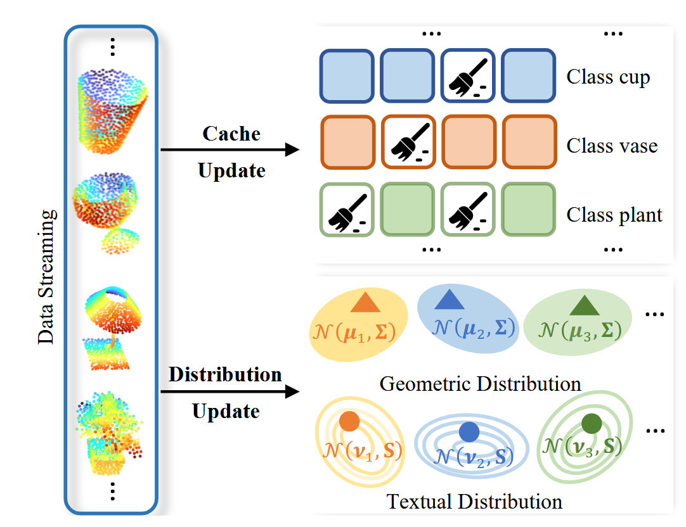
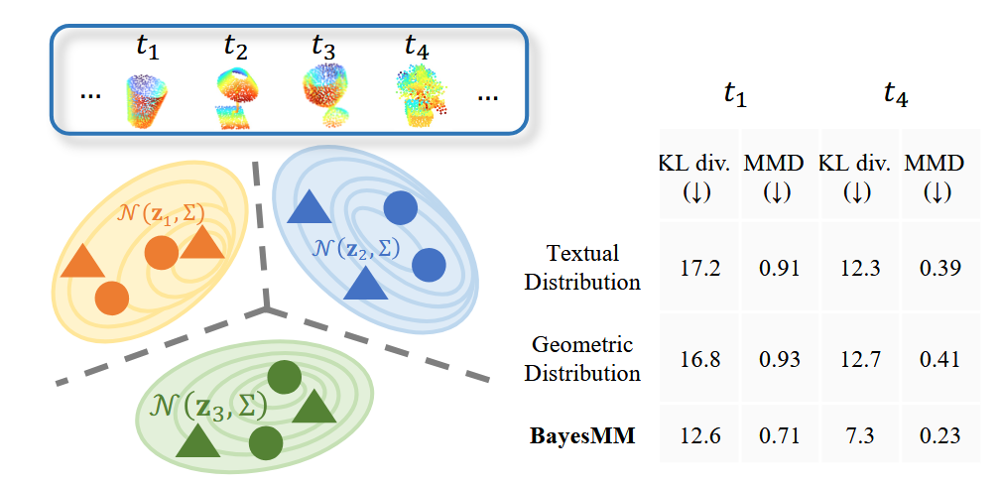
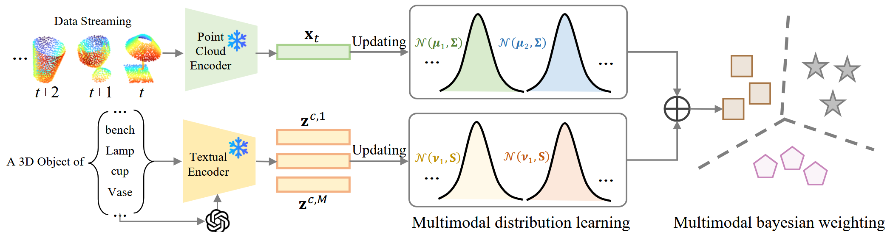

# Adapting Point Cloud Analysis via Multimodal Bayesian Distribution Learning

### Abstract

​		大型多模态3D视觉-语言模型在多种3D任务中展现出强大的泛化能力，但在**领域偏移** (domain shifts) 下，其性能仍会显著下降。这推动了近期对**测试时自适应** (test-time adaptation, TTA) 的研究，该技术使模型能够利用测试时数据进行在线自适应。在现有的 TTA 方法中，基于缓存的机制被广泛采用，以利用先前观察到的样本来进行在线预测的优化。然而，它们仅存储有限的历史信息，导致随着测试流的演进而逐渐丢失信息。此外，它们的预测逻辑值 (logits) 是启发式融合的，使得自适应过程不稳定。为了解决这些局限性，我们提出了 BayesMM，这是一个用于测试时点云分析的**多模态贝叶斯分布学习** (Multimodal Bayesian Distribution Learning) 框架。BayesMM 将每个类别的文本先验和流式视觉特征建模为高斯分布：文本参数源自语义提示，而视觉参数则随着到达的样本在线更新。这两种模态通过**贝叶斯模型平均** (Bayesian model averaging) 进行融合，该方法根据后验证据自动调整它们的贡献，从而产生一个统一的预测，该预测无需训练即可持续适应不断演变的测试时数据。在多个点云基准测试上的广泛实验表明，BayesMM 在**分布偏移** (distributional shifts) 下保持了鲁棒性，平均改进超过 4%。

### 1 Introudction			

​		诸如**激光雷达** (LiDAR) 和 **RGB-D 相机** (RGB-D cameras) 等 3D 传感器 [6, 9] 因其可靠的**几何感知** (geometric perception) [17, 28] 而成为机器人技术和自动驾驶的基础，推动了**场景重建** (scene reconstruction)、目标识别和空间理解的进步。在此基础上，近期涌现了通过在大规模点-图-文三元组上利用**对比预训练** (contrastive pre-training) 的大型多模态 3D 模型 [23, 38, 39]。它们在共享的**嵌入空间** (embedding space) 中对齐几何和文本表示，从而实现**开放词汇** (open-vocabulary) 点云识别和强大的**零样本泛化** (zero-shot generalization) [16, 48, 51, 53]，以此证明了多模态学习在可扩展和可泛化 3D 感知方面的潜力 [4, 29, 33, 35]。

​		尽管大型多模态 3D 模型取得了显著进展，但当面临训练和测试分布之间的**领域偏移** (domain shifts) 时，其性能往往会下降。因此，近期的研究探索了**测试时自适应** (test-time adaptation, TTA) [2, 3, 7, 14, 24, 26, 43, 52]，使模型能够在无需重新训练的情况下，利用无标签的测试数据动态地优化预测。在这些方法中，基于缓存的方法通过维持一个包含高置信度测试样本的紧凑内存以进行在线模型调整，展现出了特殊的潜力。然而，它们有限的缓存容量会导致渐进的信息丢失，无法捕捉长期的分布统计信息，如图 1 顶部所示。随着测试流的演进，连续的样本替换进一步放大了这个问题，导致自适应不稳定，甚至出现**灾难性遗忘** (catastrophic forgetting)。此外，基于缓存的预测和零样本预测的逻辑值 (logits) 之间的启发式融合依赖于凭经验调整的超参数 [14, 24, 46]，使得跨领域的自适应过程变得不稳定。这些局限性阻碍了基于缓存的方法在现实场景中的实用性。

`图 1. 基于缓存的自适应 (cache-based adaptation) 与我们基于分布的建模 (distribution-based modeling) 之间的比较。(a) 基于缓存的方法依赖于离散的内存更新，在固定大小的缓存中存储少量的近期样本。(b) 我们的 BayesMM 跨模态对类别级分布 (class-wise distributions) 进行建模，而不是针对单个样本。`

​		为了解决上述局限性，我们提出了 BayesMM，这是一种用于自适应点云识别的免训练动态贝叶斯分布学习框架。如图 1 底部所示，BayesMM 在统一的概率公式下联合建模文本和几何模态。具体而言，它假设每个类别的特征在两种模态中均服从高斯分布。文本分布首先源自语义嵌入，提供类别的先验，以捕捉不同提示变体之间的语义多样性；而几何分布则随着测试流逐步细化，以反映视觉变化。贝叶斯公式允许模型**自动调整模态权重**，从而产生一个统一的预测分布，确保自适应过程的稳定和一致。

​		为了量化 BayesMM 实现的多模态一致性，我们测量了沿着自适应轨迹学习到的多模态分布与其真实参考值之间的 **Kullback-Leibler (KL) 散度** (Kullback–Leibler divergence) [12] 和**最大均值差异** (Maximum Mean Discrepancy, MMD) [27]。如图 2 右侧所示，完整的贝叶斯融合比其单模态消融版本获得了显著更低的 KL 和 MMD 值，表明文本和几何表示之间存在更连贯的对齐。随着自适应的进行，这两个指标都在稳步下降，表明 BayesMM 持续细化联合特征空间，而不是过拟合于短期样本。具体而言，在初始和后期阶段 ($t_1$–$t_4$) 之间，平均 KL 散度从 17.2 降至 12.6，MMD 从 0.91 降至 0.71，这表明我们的贝叶斯融合有效地稳定了特征动态，并随着时间的推移增强了跨模态分布的一致性。

`图 2. 跨自适应步骤 (adaptation steps) 的分布一致性 (distribution consistency) 比较。在测试时自适应期间的不同时间步测量了 Kullback-Leibler (KL) 散度和最大均值差异 (MMD)。` 

主要贡献总结如下：

- 我们提出了 BayesMM，这是一个用于测试时自适应点云识别的免训练动态贝叶斯分布学习框架。
- 我们构建了一个统一的概率模型，通过动态参数更新和贝叶斯融合联合建模几何和文本模态，以实现跨模态对齐。
- 我们在多个基准测试上进行了广泛的实验，证明 BayesMM 在各种 3D 场景中均实现了鲁棒且一致的测试时自适应性能。

###   2 related work

​		`结合大型多模态 3D 模型的测试时自适应`。TTA [10, 14, 52] 旨在通过在推理期间使用测试数据自适应模型表示来解决**分布偏移** (distribution shifts)，而无需访问**源数据** (source data)。在 3D 领域，近期诸如 MATE [18]、BFTT3D [30] 和 CloudFixer [22] 等工作通过**掩码自编码** (masked auto-encoding)、**原型记忆** (prototype memory) 和基于扩散的恢复，探索了用于点云识别的自适应策略。然而，这些方法依赖于**源域数据** (source-domain data)，使得它们不太适用于 TTA。大型多模态 3D 模型 [15, 40, 44, 50] 的出现，使得可泛化且**开放词汇** (open-vocabulary) 的 3D 理解成为可能。代表性模型（如 ULIP-2 [39]、OpenShape [16] 和 Uni3D [48]）通过**对比对齐** (contrastive alignment) [1] 在大规模的点-图-文三元组上进行联合预训练，从而统一几何和语义表示以实现**零样本泛化** (zero-shot generalization)。在这些**基础模型** (foundation models) 的基础上，近期已通过基于缓存的机制 [14, 19, 24, 34, 36, 45] 探索了大型多模态 3D 模型中的 TTA。这些方法维护一个在推理期间收集的**特征表示** (feature representations) 缓存，并检索相关条目以指导预测更新，从而实现高效的**即时自适应** (on-the-fly adaptation)。相比之下，我们的 BayesMM 将测试时自适应公式化为动态的**多模态分布学习** (multimodal distribution learning)。它持续对几何分布进行建模，并通过**贝叶斯推断** (Bayesian inference) 将其与文本先验进行整合，`其中模态权重在贝叶斯原理下被自动调整`，从而在分布偏移下实现鲁棒的点云识别。

​		`分布学习` **分布学习** (Distribution learning) 通过利用**特征空间** (feature space) 的统计结构而非依赖固定的表示，为自适应识别模型提供了一个原则性的框架。诸如**高斯判别分析** (Gaussian Discriminant Analysis) [11, 31, 51] 等经典方法假设每个类别的特征服从高斯分布，并以闭式解构建概率分类器。近期的进展将这一思想扩展到了测试时场景。DOTA [10] 将视觉-语言模型的测试时自适应公式化为从测试数据流中对高斯参数进行在线估计，以捕捉**非平稳偏移** (non-stationary shifts)。在线高斯测试时自适应 [8, 42] 进一步在推理期间更新类别级的均值和协方差，以便在没有外部记忆的情况下进行持续的自适应。更近期的 ADAPT [47] 通过调整每个类别的统计量，将服从高斯分布的测试特征与**类别原型** (class prototypes) 进行对齐，而 BCA [49] 则使用流入的样本增量地细化高斯参数，以实现高效且稳定的**无源自适应** (source-free adaptation)。与这些基于单模态高斯的方法不同，BayesMM 通过联合估计几何和文本分布，并通过**贝叶斯推断** (Bayesian inference) 将它们进行整合来执行多模态分布学习，从而实现鲁棒的点云识别。

### 3 Methodology

​		在本节中，我们提出 BayesMM，这是一个测试时自适应框架，它将几何和文本模态建模为不断演化的分布，以实现鲁棒的 3D 识别。图 3 展示了其概述。

`图 3. 提出的 BayesMM 框架概述。冻结的点云编码器 (point cloud encoder) 从流式输入中提取几何特征，而冻结的语言模型提供文本嵌入作为语义先验 (semantic priors)。两种模态均由高斯分布表示，其中几何分布随着新到达的样本在线更新。贝叶斯加权 (Bayesian weighting) 将这两种模态融合为一个统一的后验，以实现自适应且免训练的点云识别。`

##### 3.1 Setup

 		我们考虑大型多模态 3D 数据的流式测试时场景 [24, 38, 39, 44, 50]，其中一系列点云 $\{X_t\}_{t=1}^\infty$ 在线到达，并伴随一组固定的**文本原型** (text prototypes) $\{T_c\}_{c=1}^C$（例如，“一个 [类名] 的 3D 物体”）。冻结的点云编码器 $\Phi$ 和冻结的文本编码器 $\Psi$ 将输入投影到一个共享的特征空间中：
$$
x_t = \Phi(X_t) \in \mathbb{R}^d, \quad z_c = \Psi(T_c) \in \mathbb{R}^d.
$$
在这些固定的**嵌入** (embeddings) 之上，一个轻量级的预测头 $f_{\theta_t} : \mathbb{R}^d \rightarrow \mathbb{R}^C$ 产生预测分数，其中参数 $\theta_t$ 随着新测试样本的到达而在线更新。

​		作为示例，我们说明基于缓存的测试时自适应策略 [24]。在初始时刻 ($t = 0$)，分类器退化为零样本分类器，其参数由文本原型 $\theta_0 = \{z_c\}_{c=1}^C$ 给出。对于样本 $x_0$，其类别得分计算为：
$$
f_{\theta_0} (x_0)_c = z_c^\top x_0. \tag{1}
$$
在时间步 $t$，模型维护一个类别级的缓存 $h_{t,c}$，该缓存最多存储 $K$ 个以高置信度预测为类别 $c$ 的测试样本的历史嵌入。因此，在时间步 $t$ 的参数为 $\theta_t = \{z_c, h_{t,c}\}_{c=1}^C$。给定一个新的测试样本 $x_t$，打分函数结合了文本相似度和缓存相似度：
$$
f_{\theta_t}(x_t)_c = z_c^\top x_t + \lambda \exp(-\gamma[1 - \cos(x_t, h_{t,c})]), \tag2
$$
其中 $\lambda > 0$ 平衡了零样本原型和缓存特征的贡献，$\gamma$ 控制了余弦距离的敏感度。

##### 3.2. Multimodal distribution learning

​		基于缓存的自适应 [14, 24, 46] 存在两个问题：有限的缓存容量导致信息衰减，且基于经验超参数（例如等式 (2) 中的 $\lambda$、$\gamma$）的启发式逻辑值融合缺乏理论原理。相比之下，我们的 BayesMM 将文本和几何模态建模为分布表示，并在贝叶斯模型平均公式下融合它们的分类结果，在持续更新期间有效地利用了来自先前样本的信息。

​		`文本分布学习。`为了建立可靠的语义先验，我们首先构建捕捉类别间语义多样性的文本分布。对于每个类别 $c$，基础提示“一个 {类名} 的 3D 物体”被大语言模型 (LLM) 扩展为 $M$ 个释义，生成反映同一类别不同概念描述的嵌入 $\{z^{c,1}, \dots, z^{c,M}\}$。随后计算类别 $c$ 的经验均值和协方差为：
$$
\bar{z}^c = \frac{1}{M} \sum_{i=1}^M z^{c,i}, \quad S^c = \sum_{i=1}^M (z^{c,i} - \bar{z}^c)(z^{c,i} - \bar{z}^c)^\top. \tag3
$$
我们将每个文本原型 $\nu^c$ 建模为以经验均值 $\bar{z}^c$ 为中心的高斯变量，这反映了跨提示变体的语言表示的不确定性：
$$
p(\nu^c) = \mathcal{N}(\nu^c | \bar{z}^c, \beta^2I), \tag4
$$
其中 $\beta$ 控制先验方差。给定时间步 $t$ 的测试特征 $x_t$，其在类别 $c$ 下的似然为：
$$
p(x_t | \nu^c, S^c) = \mathcal{N}(x_t | \nu^c, S^c), \tag5
$$
其中 $S^c$ 表示文本嵌入的类内变异性。在实践中，所有类别使用共享的协方差 $S$，这等效于施加一个**狄拉克先验** (Dirac prior) $p(S^c) = \delta(S^c - S)$，将协方差视为固定参数。通过结合先验和似然，文本参数的后验获得为：
$$
p(\nu^c, S^c | x_t) \propto p(x_t | \nu^c, S^c) p(\nu^c), \tag6
$$
该后验整合了来自文本先验分布和流入视觉观测的语义证据。

​		用于推理的确定性文本原型随后通过**最大后验** (Maximum A Posteriori, MAP) 估计推导得出：
$$
\nu_{MAP}^c = (\beta^{-2}I + M(S^c)^{-1})^{-1}(S^c)^{-1}\bar{z}^c. \tag7
$$
等式 (7) 的详细推导在补充材料的 B 节中提供。

​		`几何分布学习` 借助提供语义先验的文本分布，我们现在在测试时为每个类别建模一个在线的几何分布，参数化为一个高斯集合：$\Theta_t^c = \{\mu_t^c, \Sigma_t^c\}$，随着新样本的到达，它会被顺序地更新。在初始时刻 ($t=0$)，每个类别分布的先验由其文本原型 $\bar{z}^c$ 锚定：
$$
p(\mu_0^c) = \mathcal{N}(\mu_0^c | \bar{z}^c, \alpha^2 I), \quad \Sigma_0^c = S^c, \tag8
$$
其中 $\alpha$ 控制先验方差。等式 (6) 中的协方差 $S^c$ 提供了类内变异性的初始估计，并作为几何自适应的语义先验。

在时间步 $t$，给定新的观测值 $x_t$，先验被定义为前一个后验：
$$
p(\Theta_t^c) = p(\Theta_{t-1}^c | x_{t-1}). \tag9
$$
在类别 $c$ 下观测到 $x_t$ 的似然定义为：
$$
p(x_t | \Theta_t^c) = \mathcal{N}(x_t | \mu_t^c, \Sigma_t^c). \tag{10}
$$
结合先验和似然，后验通过**贝叶斯法则** (Bayes' rule) 进行递归更新：
$$
p(\Theta_t^c | x_t) \propto p(x_t | \Theta_t^c)p(\Theta_t^c) \propto p(x_t | \Theta_t^c)p(\Theta_{t-1}^c | x_{t-1}). \tag{11}
$$
在高斯假设下，这种递归更新具有**闭式解** (closed-form solution)：
$$
\mu_t^c = \Sigma_t^c ((\Sigma^c)^{-1} x_t + (\Sigma_{t-1}^c)^{-1} \mu_{t-1}^c),
\Sigma_t^c = ((\Sigma_{t-1}^c)^{-1} + (\Sigma^c)^{-1})^{-1}. \tag{12}
$$
等式 (12) 的详细推导在补充材料的 B 节中提供。

##### 3.3. Multimodal bayesian weighting

在获得特定模态的后验后，我们在**贝叶斯模型平均** (Bayesian model averaging) [20] 下融合几何与文本。设 $\Omega = \{(\nu^c, S^c)\}_{c=1}^C$ 和 $\Theta_t = \{(\mu_t^c, \Sigma_t^c)\}_{c=1}^C$ 分别表示文本和几何模态的类别参数集。在时间步 $t$，类别 $c$ 的整体后验为：
$$
p(c | x_t) = \underbrace{p(c | x_t, \Omega^c) p(\Omega^c | x_t)}_{\text{文本后验预测 (预测} \times \text{证据)}} + \underbrace{p(c | x_t, \Theta_t^c) p(\Theta_t^c | x_t)}_{\text{几何后验预测 (预测} \times \text{证据)}} \tag{13}
$$
每一项代表一个特定模态的**后验预测** (posterior predictive)，其中 $p(\Omega^c | x_t)$ 和 $p(\Theta_t^c | x_t)$ 作为**贝叶斯权重** (Bayesian weights) 来自动平衡这两种模态。在上述推导出的文本和几何分布下，我们在**高斯判别分析** (Gaussian discriminant analysis, GDA) 下计算它们的**类条件后验** (class-conditional posteriors)。每一模态均产生一个关于类别 $c$ 的归一化高斯后验，如下所示：
$$
p(c | x_t, \Omega^c) = \frac{\mathcal{N}(x_t | \nu_{MAP}^c, S^c)}{\sum_{c'} \mathcal{N}(x_t | \nu_{MAP}^{c'}, S^{c'})}, \quad p(c | x_t, \Theta_t^c) = \frac{\mathcal{N}(x_t | \mu_t^c, \Sigma_t^c)}{\sum_{c'} \mathcal{N}(x_t | \mu_t^{c'}, \Sigma_t^{c'})}. \tag{14}
$$
将等式 (14) 代入等式 (13) 即可得出最终的多模态后验 $p(c | x_t)$。

### 4 Experiments

#####  4.1. Experimental settings