# Cross-domain Joint Learning with Prototype-guided Mixture-of-Experts for  Infrared Moving Small Target Detection

### Abstract

由于传感器和场景分布不同，红外小目标检测在不同数据集之间往往面临显著的域差异。目前，大多数现有方法通常基于单域学习（即在同一数据集上进行训练和测试），因此在考虑不同数据集时需要分别训练检测器。然而，这些方法忽视了跨域的宝贵公共知识，并限制了其在多种红外场景中的适用性。为了突破单域学习，实现仅使用一个通用检测器同时处理多个数据集，作为首次探索，我们提出了一种采用原型引导混合专家的跨域联合学习任务框架（CoMoE）。具体而言，该框架设计了超球面原型学习，以**自适应地**维护域特定原型和全局原型，从而增强跨域特征表示。同时，提出了一种采用 Top-K 路由策略的域感知混合专家，以分配最优的域专家。此外，为了增强跨域特征对齐，我们设计了结合噪声引导对比学习的自适应跨域特征调制。在由三个数据集构成的新建基准上的大量实验验证了 CoMoE 的优越性，即使在数据有限的设置下也是如此。它通常能够超越通用联合学习方法以及最先进（SOTA）的单域方法。

### Introduction

​		红外目标通常尺寸较小且较为微弱，信杂比较低（Bai and Zhou 2010）。红外小目标检测（ISTD）具有不依赖外部光照和全天候可视的独特优势，使其在军事监视、自动驾驶和海上救援等广泛而关键的应用中具有很高的价值（Peng et al. 2025）。ISTD 的主要目标是在复杂背景中准确检测并定位小目标（Duan et al. 2025a）。作为计算机视觉中的一项基础技术，它在过去几十年中受到了广泛的研究关注（Zhu et al. 2025）。

​		为了有效检测红外图像中的小目标，研究人员提出了多种专门用于 ISTD 的方法。它们可以分为两类：传统方案和基于学习的方案。早期的 ISTD 方案通常采用传统图像处理技术，例如滤波器（Deshpande et al. 1999; Bai and Zhou 2010）、人类视觉系统（Chen et al. 2013）和数据结构（Wang et al. 2021）。这些方法通常严重依赖红外图像的先验知识和复杂的手工设计特征，缺乏样本学习能力。因此，它们往往难以适应动态变化的真实世界场景，从而造成漏检和误检。

​		近年来，随着机器学习的发展，许多基于学习的方案被提出。根据所处理的帧数，它们可以进一步分为单帧和多帧方案（Duan et al. 2025b）。前者仅利用单幅图像的视觉特征，无法获得相邻帧之间的更多信息，例如 ACM（Dai et al. 2021）、DNANet（Li et al. 2022）和 MSHNet（Liu et al. 2024）。近期研究已开始探索一些多帧检测方案，例如红外运动小目标检测（IMSTD）（Chen et al. 2025）。它们通常同时从视觉模式和运动模式中捕获小目标特征，例如 ST-Trans（Tong et al. 2024）和 DTUM（Li et al. 2025）。

​		总体而言，几乎所有现有的基于学习的方法都属于单域方案，即训练和测试在同一数据集上进行，如图 1（a）所示。只有当训练和测试具有几乎相同的域分布时，这类方案通常才能获得良好的性能。然而，在实际场景中，训练与测试之间的域偏移通常是不可避免的。因此，当应用于不同的场景域时，这种域偏移可能导致显著的性能下降。为了解决上述问题，针对单帧红外小目标，已有若干域适应方法被提出（Zhang et al. 2023b; Chi et al. 2024）。然而，它们通常旨在通过分布对齐或自训练，将在有标签源域上训练的检测器适应到无标签目标域，这限制了其在多种复杂场景中的适用性。与域适应方案不同，我们提出了一种新的任务框架，即面向 IMSTD 的跨域联合学习，如图 1（b）所示。不同于训练多个检测器，该框架旨在通过在多个数据集上进行跨域联合训练，构建一个通用检测器，以有效检测多场景中的红外小目标。

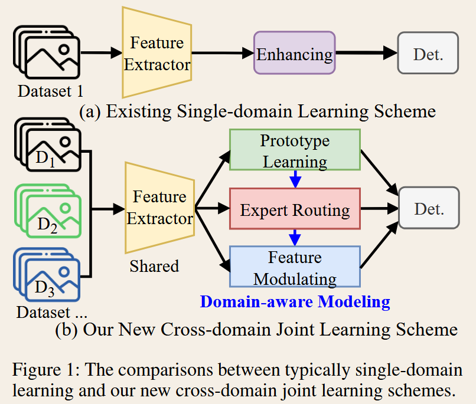

​		在我们的框架中，为了实现跨域联合检测，需要解决三个关键问题。第一个问题是如何捕获域特定的私有特征和与域无关的公共知识。第二个问题是如何识别不同的检测域，最后一个问题是如何处理域差异。针对第一个问题，我们提出了一种超球面原型学习机制，以最大化域间距离并最小化域内距离。针对第二个问题，考虑到混合专家（MoE）（Jacobs et al. 1991）在图像分类（Riquelme et al. 2021）和多任务学习（Li et al. 2024）中的有效性，我们设计了一种新的域感知 MoE，以区分不同的检测域。此外，为了解决域差异问题，我们在跨域联合学习框架中提出了基于噪声引导对比学习的自适应跨域特征调制。在由三个数据集构成的新基准上开展的大量实验表明，即使在数据有限的设置下，我们的方案仍具有有效性和优越性。

​		总而言之，我们的主要贡献包括：（i）突破传统的单域学习，提出了首个跨域联合学习框架；（ii）不同于一般特征空间，提出了一种超球面原型学习机制，以在超球面空间中捕获特征原型，促进跨域特征表示；（iii）构建了一种采用 Top-K 路由策略的域感知 MoE，通过原型和运动线索分配最优的域专家；（iv）提出了一种结合噪声引导对比学习的自适应跨域特征调制，以解决域差异，增强红外小目标的跨域一致性。

### Related Work

##### Infrared Small Target Detection

​		根据输入帧的数量，ISTD 可以分为单帧方案和多帧方案（Duan et al. 2024）。由于单帧方法（Li et al. 2022;Zhang et al. 2023a; Liu et al. 2024; Wang et al. 2025）无法获得相邻帧之间的信息，从而使其在具有挑战性的视频场景中效果不佳。对于多帧方法（Tong et al. 2024; Zhu et al. 2024; Chen et al. 2024; Duan et al. 2024; Li et al. 2025），它们通常对时空特征进行建模，以提高检测精度。例如，ST-Trans（Tong et al. 2024）采用时空 Transformer 来提取连续帧之间的运动依赖关系。近期，DTUM（Li et al. 2025）采用方向编码的时间 U 形模块和方向编码卷积块来编码目标的运动方向。然而，几乎所有当前方法都在单域学习框架下开展，在考虑不同数据集时需要训练多个检测器。

##### Cross-domain Joint Learning

​		跨域联合学习已成为一种很有前景的方法，这一点已在通用目标检测中得到证明（Chen et al. 2023; Jain et al. 2023; Wang et al. 2024）。它旨在训练过程中利用来自不同域的多个数据集，使模型能够在推理阶段处理多域数据。例如，Plain-Det（Shi, Zhu, and Yang 2024）通过少量迭代、数据集特定的训练来增强涌现特性，以应对多数据集目标检测面临的挑战。然而，由于不同红外传感器的非均匀性，红外图像本身固有地存在显著差异，使得多域联合学习更具挑战性。

##### Mixture-of-Experts

​		MoE（Jacobs et al. 1991）是一种集成学习方法，它利用多个专家协同解决一项任务。它包含一种门控路由机制，可以根据输入选择性地激活最优专家。近年来，MoE 已被广泛应用于多个领域，例如大语言模型（Cai et al. 2025）和计算机视觉（Jain et al. 2023; Yang et al. 2025）。与以往方法不同，我们设计了一种结合原型的新型域感知 MoE，以帮助模型识别 IMSTD 中不同的检测域。

### Methodology

##### Overall Architecture

`Problem Formulation.`  在我们的任务中，具有异质域分布的跨域（即多数据集）数据 $\mathcal{D}={\mathcal{D}*i=(I^i,y^i)}*{i=1}^{m}$ 被用于训练。$I^i={I_1^i,I_2^i,\cdots,I_t^i}$ 是一个连续帧集合，以 $t$ 为时间窗口从一段红外视频中随机采样得到。我们的主要目标是跨多个域训练一个统一检测器 $f_\theta(\cdot)$，利用关键帧 $I_t^i$ 的相邻帧预测该关键帧中目标 $y_t^i$ 的边界框。它能够有效利用跨域训练样本来优化总体损失，即
$$
\min_{\theta}\sum_{i=1}^{m}
\mathbb{E}_{(I^i,y_t^i)\sim\mathcal{D}*i}\left[\mathcal{L}\left(f*\theta(I^i),y_t^i\right)
\right],
\tag{1}
$$
其中，$\mathcal{L}$ 表示训练损失，$\mathbb{E}_{(I^i,y_t^i)\sim\mathcal{D}_i}$ 表示对来自 $\mathcal{D}_i$ 的所有样本求期望。

`Overview.` 我们的核心见解是，只要能够有效缓解域差异，就可以采用与分别训练多个单域检测器相同的方式来训练一个跨域检测器。因此，我们提出了一个跨域联合学习任务框架，即图 2 所示的 CoMoE。

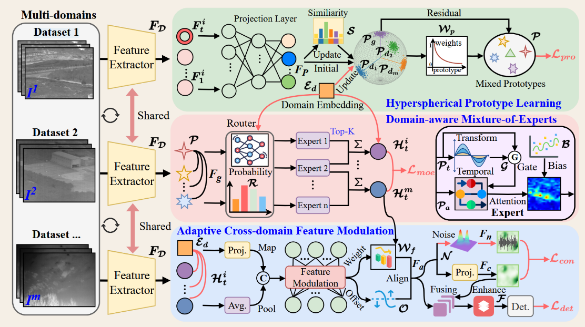

`图 2：我们的 CoMoE 框架由三个部分组成。提出超球面原型学习，以捕获域特定的特征原型和公共特征。设计域感知混合专家，以识别域并分配最优的域专家。提出自适应跨域特征调制，以解决可能存在的红外目标域差异，从而增强跨域一致性并缓解域间差异。红色线条仅用于训练。`

具体而言，该框架将来自 $m$ 个不同域的视频片段 ${I^1,I^2,\cdots,I^m}$ 作为输入。每个 $I^i$ 包含 $t$ 个连续帧。预训练的 CSPDarknet（Ge et al. 2021）被用作共享特征提取器。遵循大多数视频目标检测方法（Zhou et al. 2022），我们通过将每一帧依次送入特征提取器，提取多帧特征 $F_D={F_1^i,\cdots,F_t^i}_{i=1}^{m}\in\mathbb{R}^{m\times t\times C\times H\times W}$，其中，$C$、$H$ 和 $W$ 分别表示通道、高度和权重。随后，通过将 $F_D$ 投影到超球面子空间中，得到域特定原型 $\mathcal{P}_d$ 和全局原型 $\mathcal{P}_g$。在 HPL 中，我们可以通过融入域嵌入 $\mathcal{E}_d$（即每个数据集经过编码的域标签）来提取混合原型 $\mathcal{P}$。此外，混合原型 $\mathcal{P}$ 在 DMoE 中被进一步处理，利用不同域中目标运动的一致性来捕获运动特征 $\mathcal{H}_t$。此外，我们提出 ACFM 来缓解域差异。最后，对齐并增强后的特征 $\mathcal{F}$ 被用于检测，以获得最终结果。

##### Hyperspherical Prototype Learning

与传统特征空间不同，我们设计了一种新的原型学习机制，将特征约束在归一化超球面内，如图 2 所示。
首先，将多帧特征 $F_D$ 映射到超球面空间，以初始化域原型 $\mathcal{P}_d$ 和全局原型 $\mathcal{P}_g$，如下所示：
$$
\mathcal{P}_d,\mathcal{P}_g=f_{nor}(F_P)=f_{nor}\left(f_{mlp}\left(\sum_{i=1}^{m}\sum_{j=1}^{t}F_j^i\right)\right),\tag{2}
$$
其中，$f_{mlp}(\cdot)$ 表示两个带有 GELU 激活函数的线性层，$f_{nor}(\cdot)$ 表示确保特征能够投影到单位超球面上的归一化操作。$m$ 是域的总数，$t$ 是视频片段的时间窗口大小。随后，在下一次迭代中，通过计算新原型 $\mathcal{P}_n$ 与旧原型 $\mathcal{P}_d$ 之间的相似度 $S$ 来更新原型，即：
$$
\left\{
\begin{aligned}
S&=f_{cos}(\mathcal{P}_n,\mathcal{P}_{d_i})=\sum_{i=1}^{m}\frac{\mathcal{P}_n\bullet\mathcal{P}_{d_i}}{\lVert\mathcal{P}_n\rVert_2\lVert\mathcal{P}_{d_i}\rVert_2},\\
\mathcal{P}'_{d_i}&=\mu_i\cdot\mathcal{P}_{d_i}+(1-\mu_i)\cdot\mathcal{P}_n+\mathcal{E}_d,\\
i&=\underset{k}{\arg\max}\,S(\mathcal{P}_n,k),\qquad \mu_i=\mu_0^{1+0.01\times C_{d_i}},
\end{aligned}
\right.\tag{3}
$$
其中，$f_{cos}(\cdot)$ 表示计算余弦相似度，“$\bullet$”表示内积，$\lVert\cdot\rVert_2$ 表示 $l_2$ 范数，$\mu_i\in(0,1)$ 是一个随更新次数 $C_{d_i}$ 增加而衰减的动量系数，以确保稳定性，$\mu_0=0.95$，$i$ 是与 $\mathcal{P}_n$ 最相似的域索引，$\mathcal{P}'_{d_i}$ 是更新后的域原型。
其次，对全局原型进行更新，即：
$$
\mathcal{P}'_g=f_{nor}\left(\frac{1}{m}\sum_{i=1}^{m}\left(\mu\cdot\mathcal{P}_{d_i}\right)\right)+\mathcal{P}_g,\tag{4}
$$
其中，$\mathcal{P}'_g$ 是更新后的全局原型。然后，为了衔接域特定表征与域无关表征，我们将域原型 $\mathcal{P}'_d$ 与全局原型 $\mathcal{P}'_g$ 进行融合，以获得混合原型 $\mathcal{P}$，如下所示：

$$
\left\{
\begin{aligned}
\mathcal{P}_m &= \alpha\cdot\mathcal{P}'_d+\beta\cdot\mathcal{P}'_g,\\
\mathcal{P} &= \mathcal{P}_m+\sum_{i=1}^{m}\mathcal{W}_{p_i}\mathcal{P}_{m_i},\\
\mathcal{W}_p &= \operatorname{Softmax}\left(f_{mlp}\left(\mathcal{P}_m\right)\right),
\end{aligned}
\right.\tag{5}
$$

其中，$\mathcal{W}_p$ 是通过对中间结果 $\mathcal{P}_m$ 应用 softmax 函数计算得到的权重，用于聚合原型。

最后，我们设计了一种原型级监督损失 $\mathcal{L}_{pro}$，以约束特征接近最相关的域原型，从而增强跨域语义一致性。其可以表示如下：

$$
\mathcal{L}_{pro}
=
-\frac{1}{N}
\sum_{i=1}^{N}
\sum_{p=1}^{P}
\tilde{y}_{ip}
\log\left(
\frac{\exp\left(S_{ip}\right)}
{\sum_{j=1}^{N}\exp\left(S_{ij}\right)}
\right),
\tag{6}
$$

其中，$N$ 是投影特征样本的总数，$P$ 是域原型的总数，$S_{ip}$ 是第 $i$ 个特征与第 $p$ 个原型之间的相似度，$\tilde{y}_{ip}$ 是属于第 $p$ 个域原型的概率。

##### Domain-aware Mixture-of-Experts

​		开发一种能够适应多个域的特征处理策略，是我们任务中的一个关键挑战。为了解决这一问题，我们提出 DMoE，为不同的域动态分配最优专家，从而提升每个域的检测性能，如图 2 所示。

首先，我们设计了一个域感知路由器，以动态识别不同的检测域。对于每个混合原型，它可以联合考虑关键帧和相邻帧的信息以及域嵌入 $\mathcal{E}_d$，即：

$$
\left\{
\begin{aligned}
\mathbf{F}_g
&=
f_{cat}\left(
f_{avg}\left(
\sum_{i=1}^{m}\sum_{j=1}^{t}\mathcal{P}_j^i
\right),
\mathcal{E}_d
\right),\\
\mathcal{R}
&=
\operatorname{Softmax}\left(
f_{mlp}\left(\mathbf{F}_g\right)
\right)
\in\mathbb{R}^{n},
\end{aligned}
\right.\tag{7}
$$

其中，$f_{cat}(\cdot)$ 表示拼接操作，$f_{avg}(\cdot)$ 表示平均池化，$\mathbf{F}_g$ 是包含域嵌入的全局特征，$n$ 是专家总数，$\mathcal{R}$ 是每个专家被选中的概率。此外，我们提出了一种 Top-K 路由策略，根据计算得到的概率 $\mathcal{R}$，优先选择最优专家，以获得跨域运动特征 $\mathcal{H}_t$，如下所示：

$$
\left\{
\begin{aligned}
\mathcal{I}
&=
\operatorname{TopK}\left(\mathcal{R},K\right)
\in\mathbb{R}^{K},\\
\tilde{r}_i
&=
\begin{cases}
r_i\Big/\displaystyle\sum_{j\in\mathcal{I}}r_j,
& \text{若 }i\in\mathcal{I},\\
0,
& \text{其他情况},
\end{cases}\\
\mathcal{H}_t
&=
\sum_{i\in\mathcal{I}}
\tilde{r}_i\cdot
f_{exp}\left(\mathcal{P},\mathcal{E}_d\right),
\end{aligned}
\right.\tag{8}
$$

其中，$\mathcal{I}$ 是被选中专家的索引，$\tilde{r}_i$ 是通过对概率进行归一化得到的权重，$f_{exp}(\cdot)$ 是专家网络。

其次，对于每个专家，我们执行特征变换 $f_{trans}(\cdot)$ 以提取稳定的空间语义，并执行时序融合 $f_{tem}(\cdot)$ 以捕获运动线索 $h^i$，如下所示：

$$
\left\{
\begin{aligned}
\widehat{\mathcal{P}}^{\,i}
&=
\mathcal{P}_t^i
+
\sigma\left(
\mathcal{G}\left(
f_{trans}\left(\mathcal{P}_a^i\right)
\right)
\right)
\odot
f_{tem}\left(
\mathcal{P}_t^i,\mathcal{P}_a^i
\right),\\
h^i
&=
\operatorname{CrossAtt}\left(
\widehat{\mathcal{P}}^{\,i}
\right)
+
\mathcal{B},
\qquad
\mathcal{B}
=
f_{mlp}\left(\mathcal{E}_d\right),
\end{aligned}
\right.\tag{9}
$$

其中，$\mathcal{P}_t^i$ 是第 $i$ 个域中关键帧的混合原型，$\mathcal{P}_a$ 表示相邻帧的混合原型，$\sigma$ 是 sigmoid 函数，$\mathcal{G}$ 是一个包含平均池化和 $1\times1$ 卷积的门控机制，$f_{trans}(\cdot)$ 是一个由两个 $3\times3$ 卷积组成的残差块，$f_{tem}(\cdot)$ 表示一种两步时序融合方法。它首先根据关键帧原型与相邻帧原型之和计算注意力引导的权重，然后迭代细化运动特征。$\mathcal{B}$ 是域偏置，$\operatorname{CrossAtt}(\cdot)$ 是交叉注意力。

最后，为了促进不同专家的均衡利用并获得多样化特征，我们设计了如下的负载均衡损失 $\mathcal{L}_{ban}$ 和多样性损失 $\mathcal{L}_{div}$：

$$
\begin{aligned}
\mathcal{L}_{ban}
&=
\left\|
\mathbb{E}\left(\mathcal{R}\right)
-
\frac{1}{n}
\right\|_{mse}
=
\left\|
\frac{1}{n}
\sum_{i=1}^{n}\mathcal{R}_i
-
\frac{1}{n}
\right\|_{mse},\\
\mathcal{L}_{div}
&=
\frac{K}{n(n-1)}
\sum_{1\leq i\leq j\leq n}
\frac{1}{B}
\sum_{b=1}^{B}
f_{cos}\left(h_b^i,h_b^j\right),
\end{aligned}
\tag{10}
$$

其中，$n$ 和 $K$ 分别是专家总数和被选中专家的数量。$B$ 是批次大小，$\|\cdot\|_{mse}$ 表示 MSE 损失。因此，DMoE 的总体损失可以表示为 $\mathcal{L}_{moe}=\mathcal{L}_{ban}+\mathcal{L}_{div}$。

##### Adaptive Cross-domain Feature Modulation

**自适应跨域特征调制**

为了实现特征对齐并缓解域差异，我们提出 ACFM，以自适应地调整目标响应并增强跨域一致性，如图 2 所示。

具体而言，通过融合运动特征 $\mathcal{H}_t^i$ 与域嵌入 $\mathcal{E}_d$ 并执行域感知特征调制，得到对齐特征 $\mathbf{F}_a$，如下所示：

$$
\left\{
\begin{aligned}
\mathcal{W}_f,\mathcal{O}
&=
f_{mlp}\left(
f_{cat}\left(
f_{avg}\left(\mathcal{H}_t^i\right),
\mathcal{E}_d
\right)
\right),\\
\mathbf{F}_m
&=
\mathcal{W}_f\odot\mathcal{H}_t^i+\mathcal{O},\\
\mathbf{F}_a
&=
\mathbf{F}_m+
\mathcal{A}_s\left(
\mathbf{F}_m\cdot
\mathcal{A}_c\left(\mathbf{F}_m\right)
\right),
\end{aligned}
\right.\tag{11}
$$

其中，$\mathcal{W}_f$ 表示调制权重，$\mathcal{O}$ 表示域偏移量，$\mathbf{F}_m$ 表示调制后的特征。$\mathcal{A}_s$ 和 $\mathcal{A}_c$ 分别表示空间注意力和通道注意力。随后，我们设计了噪声引导的对比学习，将域特定噪声 $\epsilon_i\sim\mathcal{N}(0,\gamma_i^2)$ 注入对齐特征 $\mathbf{F}_a$ 中，以保持干净表征与含噪表征之间的一致性，即 $\mathbf{F}_{n_i}$ 和 $\mathbf{F}_{c_i}$，如下所示：

$$
\left\{
\begin{aligned}
\widehat{\mathbf{F}}_{a_i}
&=
\mathbf{F}_{a_i}+\epsilon_i,
\qquad
\epsilon_i\sim\mathcal{N}\left(0,\gamma_i^2\right),\\
\mathbf{F}_{n_i}
&=
f_{avg}\left(
f_{mlp}\left(
\widehat{\mathbf{F}}_{a_i}
\right)
\right),
\qquad
\mathbf{F}_{c_i}
=
f_{avg}\left(
f_{mlp}\left(
\mathbf{F}_{a_i}
\right)
\right),\\
\mathcal{L}_{con}
&=
-\frac{1}{B}
\sum_{i=1}^{B}
\log
\frac{
f_{cos}\left(
\mathbf{F}_{n_i},
\mathbf{F}_{c_i}
\right)
}{
\displaystyle\sum_{j=1}^{B}
f_{cos}\left(
\mathbf{F}_{n_i},
\mathbf{F}_{c_j}
\right)
},
\end{aligned}
\right.\tag{12}
$$

其中，$\gamma_i$ 是一个用于控制第 $i$ 个域噪声分布的可学习参数。$\mathcal{L}_{con}$ 是一种对比损失，用于促进在扰动下保持跨域一致性。

之后，通过融合对齐特征 $\mathbf{F}_a$ 与干净表征 $\mathbf{F}_c$，得到最终特征 $\mathcal{F}$，即：

$$
\mathcal{F}
=
f_{non}\left(
\mathcal{A}_s\left(
\mathcal{A}_c\left(
\operatorname{Conv}\left(
f_{cat}\left(
\mathbf{F}_a,\mathbf{F}_c
\right)
\right)
\right)
\right)
\right).
\tag{13}
$$

其中，$f_{non}(\cdot)$ 表示非局部注意力（Zhang et al. 2023a），特别用于小目标。最后，将 $\mathcal{F}$ 输入检测头，以获得最终结果。因此，我们的 CoMoE 的总训练损失可以定义如下：

$$
\mathcal{L}
=
\mathcal{L}_{pro}
+
\mathcal{L}_{moe}
+
\mathcal{L}_{con}
+
\mathcal{L}_{det}.
\tag{14}
$$

其中，$\mathcal{L}_{det}$ 是基于 YOLOX 解耦检测头的检测损失（Ge et al. 2021）。

### Experiments

##### Implement Details

我们在一个由三个数据集组成的新基准上评估 CoMoE：DAUB-H（Hui et al. 2019）、ITSDT-15K（Duan et al. 2024）和 IRDST-R（Sun et al. 2023）。遵循以往工作（Chen et al. 2024），我们采用标准评价指标，即精确率（$Pr$）、召回率（$Re$）、F1 和 $\mathrm{mAP}_{50}$（IoU 阈值为 0.5 时的平均精度均值）。此外，所有对比方法的输入帧均被调整为 $512\times512$。具体而言，我们的 CoMoE 和对比方法均训练 100 个 epoch，批次大小为 4。采用 SGD 作为优化器，初始学习率为 0.01，权重衰减为 $5\times10^{-4}$。超参数 $t$、$K$、$P$、$n$、$\alpha$ 和 $\beta$ 分别设置为 5、2、32、6、0.6 和 0.4。

##### Comparisons with SOTA Methods

**定量比较** 表 1 给出了近期单域学习方法与多域联合学习方法的定量比较结果，揭示了两个明显的发现。其一，我们的 CoMoE 始终取得最佳性能，在大多数指标上刷新了 SOTA。例如，在 ITSDT-15K 上，CoMoE 取得了最高的 $\mathrm{mAP}_{50}$ 78.19%、$Re$ 92.78% 和 F1 89.14%。仅在 $Pr$ 方面，CoMoE 的 85.77% 略低于 SCTrans（Yuan et al. 2024）所取得的 SOTA 结果 91.74%。SCTrans 以牺牲 $Re$ 为代价取得了更高的 $Pr$，而我们的方法实现了更加均衡的性能和更高的 F1。其二，一般的多域联合学习方法在极具挑战性的场景中效果不佳。例如，在 DAUB-H 上，当前 SOTA 多域方法 UniDet（Lin et al. 2024）的 $\mathrm{mAP}_{50}$ 和 F1 仅分别达到 33.69% 和 59.08%，显著低于我们的 CoMoE 所取得的 $\mathrm{mAP}_{50}$ 53.84% 和 F1 73.13%。此外，直接使用单域方法进行多域训练是无效的。例如，DTUM$\star$ 的 $\mathrm{mAP}_{50}$ 下降了 10.38%，F1 下降了 8.22%。

`表 1：定量比较。`最佳结果以粗体标出，次佳结果以下划线标出。所有多域方法均使用三个数据集中的全部样本训练一个通用模型，然后分别在每个数据集上进行评估。“$\star$”表示将单域方法用于多域训练。“$\downarrow$”表示相较于单域训练性能下降，而“$\uparrow$”表示性能提升。

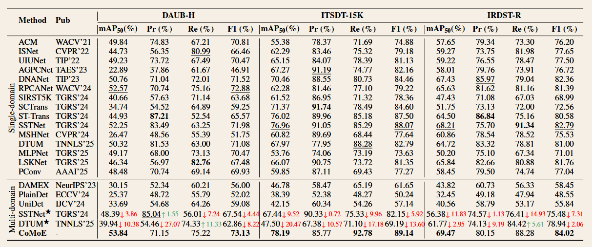

​		**推理开销比较** 表 2 给出了推理开销的比较结果。由此可以得到两个值得注意的发现。其一，由于采用了域感知建模，我们的方法在参数量和 GFLOPs 方面略有增加。例如，我们的 CoMoE 包含 19.61M 个参数，高于 SOTA 方法 RDIAN 的 2.74M，但仍低于 UIUNet（Wu, Hong, and Chanussot 2022）的 53.06M 和 DAMEX 的 46.74M。此外，其 GFLOPs 为 322.39，远低于 AGPCNet（Zhang et al. 2023a）的 366.15。其二，尽管参数量有所增加，我们的 CoMoE 仍取得了中等水平的推理速度。例如，其 FPS 为 12.73，高于许多单域方法，如 PConv 和 DTUM。

`Table 2: The inference cost comparisons on ITSDT-15K.`

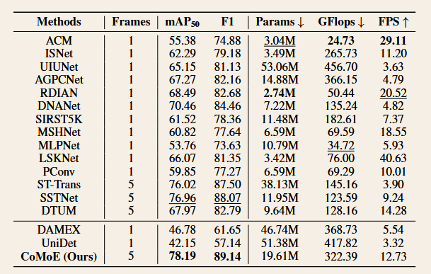

​		**PR 曲线比较** 与通常做法一致，我们在 DAUB 和 ITSDT-15K 上采用精确率-召回率（PR）曲线，以直观评估各种方法的整体性能，如图 3 所示。从图中可以明显看出，我们的曲线优于各对比方法的曲线。具体而言，在 DAUB-H 上，我们的曲线始终位于右上方。这一趋势在 ITSDT-15K 上同样延续。一个方法的曲线越接近右上角，其有效性就越高。因此，与其他方法相比，这些 PR 曲线突显了 CoMoE 在平衡精确率与召回率方面的优越性。

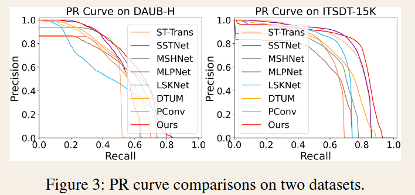

##### Ablation and Analysis

​		**不同组件组合的影响** 为了研究各个组件对 CoMoE 的影响，我们在三个数据集上开展了一系列消融实验，如表 3 所示。通过比较，我们可以得到两个明显的发现。其一，CoMoE 中的每个组件都对性能提升有所贡献。例如，在 IRDST-R 上，不包含任何专用组件的基线设置（w/o All）仅取得 30.67% 的 $\mathrm{mAP}_{50}$ 和 61.01% 的 F1。加入 HPL（w H3）后，这些指标分别提升至 57.40% 的 $\mathrm{mAP}_{50}$ 和 76.10% 的 F1。类似地，逐步加入域感知门控（w H3 & D1 & D2）后，$\mathrm{mAP}_{50}$ 从 61.67% 提升至 63.49%，F1 从 79.12% 提升至 81.20%。其二，当所有组件被完整组合（w All）时，性能得到显著提升，$\mathrm{mAP}_{50}$ 达到 69.47%，F1 达到 84.02%，取得了最高水平。这表明这些组件具有协同作用，并且每个组件自身都是有效的。

`表 3：CoMoE 在不同设置下的消融实验。`HPL：三种原型学习方案（H1 仅使用域特定原型，H2 仅使用全局原型，H3 使用混合原型）。DMoE：域感知 MoE 的三个组件（D1 为时序建模，D2 表示域感知门控，D3 为 Top-K 路由策略）。ACFM：自适应跨域特征调制的两个组件（A1 为特征对齐，A2 为采用 $\mathcal{L}_{con}$ 的噪声引导对比学习）。

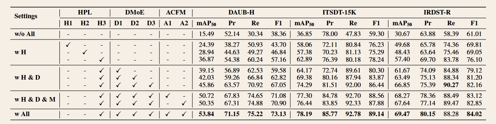

​		**跨域联合学习的影响** 为了验证跨域联合学习的有效性，我们开展了一组实验。如表 4 所示，可以明显看出，我们的跨域联合学习框架能够同时提升多个训练域上的检测性能。例如，在 IRDST-R 上，加入 ITSDT-15K 进行联合训练后，$\mathrm{mAP}_{50}$ 从 65.52% 提升至 67.09%，F1 从 81.97% 提升至 82.96%。当三个数据集全部结合时，性能达到峰值，$\mathrm{mAP}_{50}$ 为 69.47%，F1 为 84.02%。此外，模型在未见域上通常会出现明显的性能下降，这进一步验证了 IMSTD 中存在显著的域差异。这些结果表明，我们提出的跨域联合学习是一种值得探索的新范式。它能够同时在多个域上取得优越的性能。

`表 4：随着数据集数量逐渐增加，我们的 CoMoE 的性能。`“D”$\rightarrow$“D+T+R”为正向顺序，“R”$\rightarrow$“D+T+R”为反向顺序。

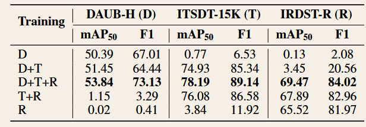

​		**有限数据设置的影响** 为了分析 CoMoE 在数据有限情况下的性能，我们从每个域中随机选择不同数量的样本开展了一组实验，如图 4 所示。从图中可以明显看出，我们的方案在不同设置下始终取得最高性能。此外，它仅需 1000 个样本即可获得与完整数据集设置相当的性能。这表明，我们的 CoMoE 在缓解实际应用中训练数据有限的问题方面具有优越性。

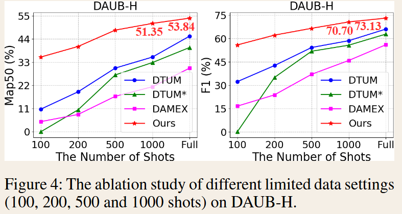

​		**超球面原型学习的影响** 为了直观验证 HPL 的有效性，我们对比了使用 HPL 前后的特征分布，如图 5 所示。从图中可以观察到，我们的方法能够有效捕获多个域中的域特定原型和公共的域无关知识（即全局原型）。这些对比进一步验证了表 3 中的定量结果（w/o All 和 w H3）。

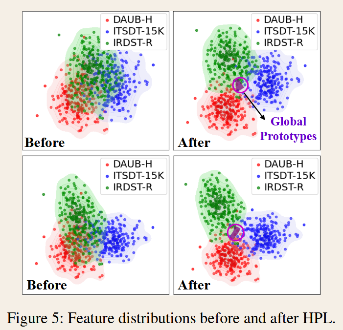

**域感知 MoE 的影响** 为了全面分析 DMoE 的影响，我们从每个数据集中选取两个样本，对采用和不采用域感知路由时的专家使用概率进行可视化，如图 6 所示。从图中可以清楚地看到，加入域感知路由后，来自不同域的样本由不同的专家进行处理。这表明 DMoE 能够识别不同的检测域，并为每个域分配最优专家。这些结果也验证了表 3 中的数值结果（w H3 和 w H3 & D1 & D2 & D3）。

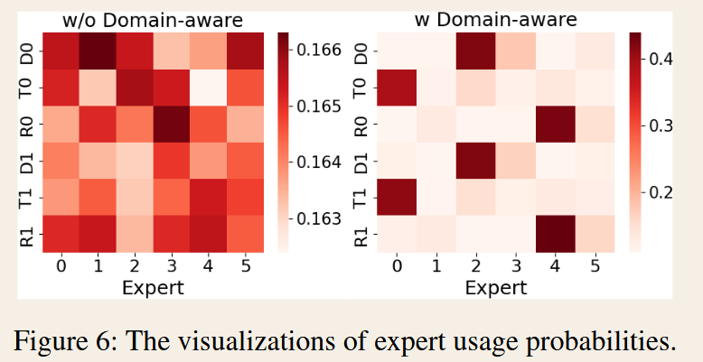

**跨域特征调制的影响** 为了直观分析 ACFM 的影响，我们展示了使用 ACFM 前后的四组特征热力图，如图 7 所示。从图中可以明显看出，在所有热力图组中，使用 ACFM 之前的关注位置并不清晰，导致目标在复杂背景和域扰动下丢失。相反，加入 ACFM 后，小目标的特征响应得到显著增强，含噪背景也更加清晰。这表明，特征调制和噪声引导的对比学习能够有效缓解域差异，从而实现特征对齐。

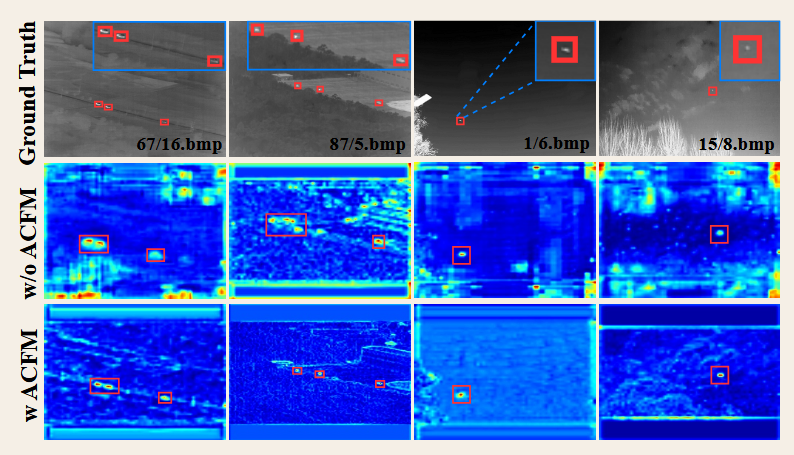

`图 7：使用 ACFM 前（w/o）与使用 ACFM 后（w）的特征热力图比较。前两列来自 ITSDT-15K，后两列来自 IRDST-R。`

### Conclusions

​		为了克服单域学习的不足，本文提出了首个用于红外小目标检测的、采用原型引导混合专家（MoE）的跨域联合学习任务框架（即 CoMoE）。与传统的“一个检测器对应一个域”不同，该框架通过超球面域原型学习、MoE 路由和跨域特征调制进行域感知建模，从而构建了一个通用检测器。在一个新的跨域基准上开展的实验验证了我们的 CoMoE 的有效性和优越性，即使在数据有限的设置下也是如此。在主要指标上，它通常能够明显超过当前的最先进（SOTA）方法。其主要缺点之一是对未见过的红外小目标检测域的泛化能力较低。未来，具有更好域泛化能力的高效跨域联合学习方案值得进一步探索。

​		