# **Deep Hough Voting for 3D Object Detection in Point Clouds**

### Abstract

​		当前的**3D 目标检测**方法在很大程度上受到**2D 检测器**的影响。为了利用 2D 检测器中的架构，它们通常将 3D**点云**转换为规则网格（即**体素网格**或**鸟瞰图图像**），或者依赖 2D 图像中的检测来生成 3D 边界框。很少有工作尝试在点云中直接检测对象。在这项工作中，我们回归基本原理，以构建适用于点云数据且尽可能通用的 3D**检测流水线**。然而，由于数据的稀疏性质 ——3D 空间中 2D 流形的样本 —— 当直接从场景点预测边界框参数时，我们面临一个主要挑战：3D 对象的**质心**可能远离任何表面点，因此难以一步准确回归。为解决该挑战，我们提出 VoteNet，这是一种基于深度点集网络和**霍夫投票**协同作用的**端到端**3D 目标检测网络。我们的模型在两个大型真实 3D 扫描数据集 ScanNet 和 SUN RGB-D 上实现了最先进的 3D 检测，具有简单的设计、紧凑的模型尺寸和高效率。值得注意的是，VoteNet 仅使用几何信息而不依赖彩色图像，性能超过了先前的方法。

### 1. Introduction

​		**3D 目标检测**的目标是在三维场景中定位和识别物体。更具体地说，在这项工作中，我们旨在从点云中估计有方向的**三维边界框**以及物体的语义类别。

​		与图像相比，三维**点云**提供了精确的几何信息并且对光照变化的鲁棒性。另一方面，点云是不规则的，因此典型的**卷积神经网络（CNN）** 不太适合直接处理它们。

​		为了避免处理不规则**点云**，当前的 3D 检测方法在各个方面严重依赖基于 2D 的检测器。例如，[42, 12] 将 Faster/Mask R-CNN [37, 11] 等 2D 检测框架扩展到 3D。它们将不规则点云**体素化**为规则的 3D 网格，并应用 3D 卷积神经网络（CNN）检测器，`这未能利用数据的稀疏性`，且由于昂贵的 3D 卷积而承受高计算成本。另外，[4, 55] 将点投影到规则的 2D**鸟瞰图图像**，然后应用 2D 检测器定位物体。然而，这`会牺牲几何细节`，而这些细节在杂乱的室内环境中可能至关重要。最近，[20, 34] 提出了一种级联两步流水线：首先在前视图图像中检测物体，然后在从 2D 边界框挤出的平截头体点云中定位物体，但这`严格依赖于 2D 检测器，若物体在 2D 中未被检测到，则会完全漏检`。

​		在这项工作中，我们引入了一个专注于**点云**的 3D 检测框架，该框架直接处理原始数据，并且无论是在架构上还是在对象提案上都不依赖任何 2D 检测器。我们的检测网络 VoteNet 基于**3D 深度学习模型**在点云领域的最新进展，并受到用于目标检测的广义**霍夫投票**过程的启发。

​		`我们利用 PointNet++[36]（一种用于点云学习的层次化深度网络）来减少将点云转换为规则结构的需求`。通过直接处理点云，我们不仅避免了量化过程导致的信息丢失，还利用点云的稀疏性，仅对感测到的点进行计算。

​		尽管 PointNet++[36] 在**物体分类**和**语义分割**任务中已展现出成功，但很少有研究探讨如何利用此类架构在点云中检测 3D 物体。一个简单的解决方案是遵循 2D 检测器的常见做法，执行密集目标提案 [29, 37]，即直接从感测到的点（及其学习到的特征）生成 3D 边界框。然而，点云的固有稀疏性使得这种方法并不适用。在图像中，物体中心附近通常存在像素，但点云往往并非如此。由于深度传感器仅捕获物体表面，3D 物体的中心可能位于空区域，远离任何点。因此，基于点的网络难以在物体中心附近聚合场景上下文。单纯增大感受野并不能解决问题，因为当网络捕获更大的上下文时，也会引入更多附近物体和杂波的干扰。

​		为此，我们提议为**点云深度网络**赋予一种类似于经典**霍夫投票**的投票机制。通过投票，我们本质上生成靠近物体中心的新点，这些点可以被分组和聚合以生成边界框提案。

​		与传统霍夫投票中多个独立模块难以联合优化不同，VoteNet 是`端到端可优化`的。具体来说，将输入点云通过**骨干网络**后，我们采样一组**种子点**，并从其特征生成投票。投票的目标是到达物体中心。因此，投票簇在物体中心附近形成，进而可通过学习模块聚合以生成边界框提案。最终得到一个纯几何的强大 3D 目标检测器，可直接应用于点云。

​		我们在两个具有挑战性的 3D 目标检测数据集上评估了我们的方法：SUN RGB-D [40] 和 ScanNet [5]。在这两个数据集上，仅使用几何信息的 VoteNet 显著优于同时使用 RGB 和几何信息、甚至使用多视图 RGB 图像的现有技术。我们的研究表明，投票方案支持更有效的上下文聚合，`并验证了当物体中心远离物体表面时（例如桌子、浴缸等），VoteNet 提供的改进最大`。

​		综上所述，我们的工作贡献如下：

​		・通过端到端可微架构在深度学习背景下重构**霍夫投票**，我们将其命名为 VoteNet。
​		・在 SUN RGB-D 和 ScanNet 上实现**最先进的（State-of-the-Art, SOTA）** 3D 目标检测性能。
​		・深入分析**投票机制**在点云 3D 目标检测中的重要性。

### 2. Related Work

​		`3D object detection.` 许多先前的方法被提出用于检测物体的**3D 边界框**。例如：[27] 中使用成对的语义上下文潜力来帮助引导提案的对象性分数；**基于模板的方法**[26, 32, 28]；Sliding-shapes [41] 及其基于深度学习的继承者 [42]；定向梯度云（COG）[38]；以及最近的 3D-SIS [12]。

​		由于直接在 3D 空间中处理的复杂性，尤其是在大型场景中，许多方法采用了某种类型的**投影**。例如，在 MV3D [4] 和 VoxelNet [55] 中，3D 数据首先被降维为**鸟瞰图**，然后再进行后续处理流程。通过先处理 2D 输入来减少搜索空间的方法在 Frustum PointNets [34] 和 [20] 中均有体现。类似地，在 [16] 中，分割假设通过 3D 地图进行验证。最近，GSPN [54] 和 PointRCNN [39] 等基于点云的深度网络被用于利用数据的**稀疏性**。

​		`Hough voting for object detection.`  霍夫变换 [13] 最初于 20 世纪 50 年代末提出，它将在点样本中检测简单模式的问题转化为在**参数空间**中检测峰值的问题。广义霍夫变换 [2] 进一步将该技术扩展到**图像块**，将其作为复杂物体存在的指示。使用霍夫投票的例子包括 [24] 的开创性工作（其引入了**隐式形状模型**）、从 3D 点云中提取平面 [3] 以及 6D 位姿估计 [44] 等。

​		霍夫投票此前也已与高级学习技术结合。在 [30] 中，投票被赋予指示其重要性的权重，这些权重通过**最大边缘框架**学习得到。[8, 7] 中引入了用于目标检测的**霍夫森林**。最近，[15] 通过使用提取的深度特征构建**码本**，证明了基于投票的 6D 位姿估计的改进。类似地，[31] 学习深度特征以构建码本，用于 MRI 和超声图像的分割。在 [14] 中，经典霍夫算法被用于提取汽车标志中的圆形图案，随后将其输入深度分类网络。[33] 提出了用于图像 2D**实例分割**的半卷积算子，这也与霍夫投票相关。

​		此外，也有研究将霍夫投票用于 3D 目标检测 [50, 18, 47, 19]，这些工作采用了与 2D 检测器类似的流水线。

​		`Deep learning on point clouds.`  最近，我们看到人们对设计适用于**点云**的深度网络架构产生了浓厚兴趣 [35, 36, 43, 1, 25, 9, 48, 45, 46, 22, 17, 53, 52, 49, 51]，这些架构在 3D 物体分类、物体部件分割以及场景分割中表现出显著性能。在 3D 目标检测领域，VoxelNet [55] 从**体素**中的点学习体素特征嵌入，而 [34] 中使用 PointNets 在从 2D 边界框挤出的**平截头体点云**中定位物体。`然而，很少有方法研究如何在原始点云表示中直接生成和检测 3D 物体`。

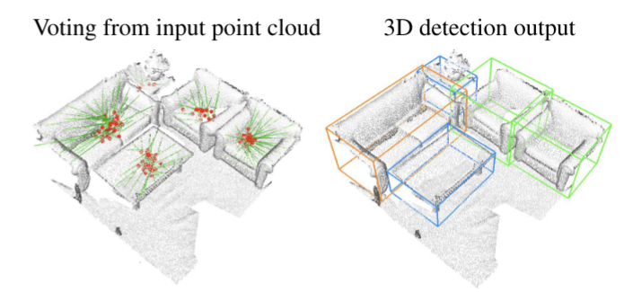

`图 1`  基于深度霍夫投票模型的点云三维目标检测。给定三维场景的**点云**，我们的 VoteNet 通过向物体中心 “投票”，然后对投票进行分组和聚合，以预测物体的三维边界框和语义类别

### 3. Deep Hough Voting

​		传统霍夫投票 2D 检测器 [24] 包含离线和在线两个步骤。首先，给定一组标注了物体边界框的图像，构建一个**码本**，存储**图像块**（或其特征）到对应物体中心的**偏移量**映射。在推理阶段，从图像中选择**兴趣点**，提取其周围的图像块，然后将这些图像块与码本中的图像块进行比较，检索偏移量并计算投票。由于物体图像块的投票往往一致，因此会在物体中心附近形成**簇**。最后，通过将簇投票追溯到其生成的图像块来检索物体边界。

​		我们发现该技术非常适合我们所关注的问题，体现在两个方面。首先，与**区域提案网络（RPN）** [37] 相比，**基于投票的检测**更适用于**稀疏集**。对于 RPN 而言，其必须在物体中心附近生成提案，而该中心可能位于空区域，从而导致额外计算。其次，它基于**自底向上原则**，通过积累零散的局部信息形成可靠的检测结果。尽管神经网络可能从大**感受野**中聚合上下文，但在投票空间中进行聚合仍可能有益。

​		然而，由于传统霍夫投票包含多个独立模块，将其集成到最先进的点云网络中仍是一个开放性研究课题。为此，我们针对不同的流水线组件提出以下适应性改进：

​		`兴趣点`由深度神经网络描述和选择，而非依赖手工设计的特征。

​		`投票`生成由网络学习实现，而非使用码本。利用更大的感受野，投票可变得更少歧义，从而更有效。此外，投票位置可通过特征向量增强，以实现更好的聚合。

​		`投票聚合`通过具有可训练参数的点云处理层实现。利用投票特征，网络能够过滤低质量投票并生成更优的提案。

​		`物体提案`（包括位置、尺寸、朝向甚至语义类别）可直接从聚合特征中生成，减少了追溯投票来源的需求。

​		接下来，我们将描述如何将上述所有组件整合到一个名为 VoteNet 的单一端到端可训练网络中。

### 4. VoteNet Architecture

​		图 2 展示了我们的端到端检测网络（VoteNet），整个网络可分为两部分：一部分处理现有点以生成投票点；另一部分对虚拟点（即投票点）进行操作，以生成物体提案并分类。

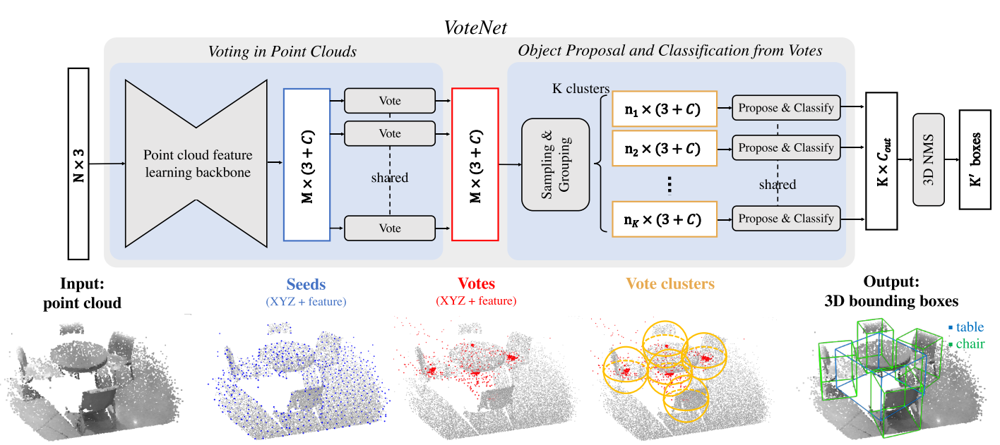

`图 2.` 用于点云 3D 目标检测的 VoteNet 架构示意图  给定一个具有 XYZ 坐标的 N 个点的输入点云，骨干网络（采用 PointNet++[36] 层实现）对这些点进行`下采样并学习深度特征`，输出 M 个点的子集，每个点扩展了 C 维特征。该点子集被视为**种子点**。每个种子点通过**投票模块**独立生成一个投票点。随后，投票点被分组为簇，并由**提案模块**处理以生成最终提案。经分类和非极大值抑制（NMS）处理的提案成为最终输出的 3D 边界框。图像最佳观看方式为彩色。

##### 4.1. Learning to Vote in Point Clouds

​		对于大小为 N×3 的输入点云（N 个点各有一个 3D 坐标），我们的目标是生成 M 个投票点，每个投票点同时包含 3D 坐标和高维特征向量。这包括两个主要步骤：通过骨干网络进行点云特征学习，以及从种子点学习霍夫投票。

​		`Point cloud feature learning.`  生成准确的投票点需要几何推理和上下文信息。我们不依赖手工设计的特征，而是利用最近提出的点云深度网络 [36, 9, 43, 25] 进行点特征学习。尽管我们的方法不局限于任何点云网络，但由于 PointNet++[36] 的简洁性及其在法向量估计 [10]、语义分割 [21] 到 3D 目标定位 [34] 等任务中已证明的有效性，我们采用其作为骨干网络。

​		骨干网络包含多个集合抽象层和带跳跃连接的特征传播（上采样）层，其输出输入点的一个子集，每个点具有 XYZ 坐标和增强的 C 维特征向量。结果为 M 个维度为 (3 + C) 的种子点，`每个种子点生成一个投票点`。

​		`Hough voting with deep networks.`  与传统霍夫投票中投票点（来自局部关键点的偏移量）通过查询预计算码本确定的方式不同，我们通过`基于深度网络的投票模块`生成投票点。该模块既更高效（无需 k 最近邻查询），又因与流水线的其余部分联合训练而更准确。

​		给定一组种子点 ${{s_i}}_{i=1}^M$，其中 $s_i = [x_i; f_i]$，$x_i \in \mathbb{R}^3$ 且 $f_i \in \mathbb{R}^C$，一个共享的投票模块从每个种子点独立生成投票点。具体而言，投票模块通过包含全连接层、ReLU 激活函数和批标准化的多层感知机（MLP）网络实现。该 MLP 接收种子点特征 \(f_i\)，输出欧氏空间偏移量 $\Delta x_i \in \mathbb{R}^3$和特征偏移量 $\Delta f_i \in \mathbb{R}^C$，使得从种子点 $s_i$ 生成的投票点 $v_i = [y_i; g_i]$ 满足 $y_i = x_i + \Delta x_i$ 且$g_i = f_i + \Delta f_i$。

​		预测的三维偏移量 $\Delta x_i$由回归损失显式监督:

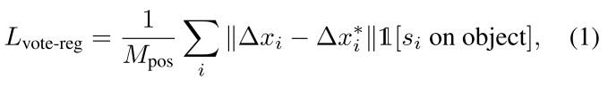

​		其中 $1[s_i \text{ on object}]$指示种子点 $s_i$是否位于物体表面，$M_{\text{pos}}$ 为物体表面种子点的总数。$\Delta x_i^*$是从种子点位置 $x_i$到其所属物体边界框中心的真实位移。

​		`在张量表示上，投票点与种子点相同，但不再基于物体表面`。然而，更关键的区别在于它们的位置 —— 从同一物体上的种子点生成的投票点，彼此之间的距离比种子点更近，这使得组合来自物体不同部分的线索变得更容易。接下来，我们将利用这种语义感知的局部性来聚合投票特征，以生成物体提案。

##### 4.2. Object Proposal and Classification from Votes

​		投票点为来自物体不同部分的上下文聚合创建了规范的 “汇聚点”。在对这些投票点进行聚类后，我们聚合其特征以生成物体提案并对其进行分类。

​		`通过采样和分组进行投票点聚类`。尽管存在多种对投票点进行聚类的方法，我们选择了一种简单的策略：基于空间邻近性进行均匀采样和分组。具体而言，从一组投票点 $\{v_i = [y_i; g_i] \in \mathbb{R}^{3+C}\}_{i=1}^M$ 中，我们基于三维欧氏空间中的 ${y_i}$使用最远点采样来选取 K 个投票点的子集，得到 $\{v_{i_k}\}$（其中$ k = 1, ..., K$。然后，我们通过为每个$ v_{i_k} $的三维位置寻找邻近投票点来形成 K 个簇：对于 \(k = 1, ..., K\)，有 $C_k = \{v_{(k)}^i \mid \|v_i - v_{i_k}\| \leq r\}$。尽管该聚类技术简单，但易于集成到端到端流水线中，并且在实践中表现良好。

​		`从投票簇生成提案与分类。`由于投票簇本质上是一组`高维点`，我们可以利用通用`点集学习网络来聚合投票点，以生成物体提案`。与传统霍夫投票中用于识别物体边界的回溯步骤相比，该流程允许即使从部分观测中也能生成完整边界提案，并预测朝向、类别等其他参数。

​		在我们的实现中，我们使用一个共享的 PointNet [35] 来进行投票簇中的投票聚合和提案生成。给定一个投票簇$C = \{w_i\}$（其中$i = 1, ..., n$及其簇中心$w_j$，其中$w_i = [z_i; h_i]$，$z_i \in \mathbb{R}^3$为投票点位置，$h_i \in \mathbb{R}^C$为投票点特征。为了利用局部投票几何信息，我们通过$z'_i = (z_i - z_j)/r$将投票点位置转换为局部归一化坐标系统。然后，通过将该点集输入到类似 PointNet 的模块中，生成该簇的物体提案$p(C)$：

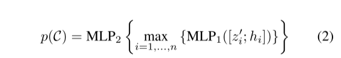

​		其中，每个`簇的投票点在被（按通道）最大池化为单个特征向量之前`，先由 MLP1 独立处理，然后传递至 MLP2，在 MLP2 中不同投票点的信息被进一步组合。我们将提案 p 表示为一个多维向量，包含物体存在分数、边界框参数（中心、朝向和尺度，参数化方式如 [34] 所述）以及语义分类分数。

​		`Loss function.`  提案和分类阶段的损失函数包括`物体存在性损失`、`边界框估计损失`和`语义分类损失`。

​		我们对位于真实物体中心附近（0.3 米内）或远离任何中心（超过 0.6 米）的投票点的物体存在分数进行监督。我们将从这些投票点生成的提案分别视为正样本提案和负样本提案。其他提案的物体存在性预测不进行惩罚。物体存在性通过交叉熵损失进行监督，该损失通过批次中未忽略提案的数量进行归一化。对于正样本提案，我们根据最近的真实边界框进一步监督边界框估计和类别预测。具体而言，我们遵循 [34] 的方法，将`边界框损失解耦为中心回归、朝向角度估计和边界框尺寸估计`。对于语义分类，我们使用`标准交叉熵损失`。在检测损失的所有回归中，我们使用 `Huber（smooth-L1 [37]）损失`。更多细节见附录。

##### 4.3. Implementation Details

​		`输入与数据增强。`我们检测网络的输入是从弹出式深度图像$N = 20k$或三维扫描（网格顶点，N = 40k）中随机下采样的 N 个点的点云。除了 XYZ 坐标外，我们还为每个点包含一个高度特征，指示其到地面的距离。地面高度估计为所有点高度的 1% 分位数。为了增强训练数据，我们从场景点中动态随机下采样点。我们还随机水平翻转点云，绕垂直轴按$\text{Uniform}[-5^\circ, 5^\circ]$随机旋转场景点，并按$\text{Uniform}[0.9, 1.1]$随机缩放点。

​		`网络架构细节。`骨干特征学习网络基于 PointNet++ [36]，其包含四个集合抽象（SA）层和两个特征传播 / 上采样（FP）层。其中，SA 层的感受野半径依次为 0.2、0.4、0.8 和 1.2 米，同时将输入分别下采样至 2048、1024、512 和 256 个点。两个 FP 层将第四层 SA 的输出用上采样恢复至 1024 个点，并携带 256 维特征和三维坐标（更多细节见附录）。

​		投票层通过多层感知机实现，其全连接层输出尺寸为 256、256、259，其中最后一个全连接层输出 XYZ 偏移量和特征残差。

​		提案模块被实现为一个集合抽象层，在最大池化后通过后处理 MLP2 生成提案。该集合抽象层使用半径 0.3，MLP1 的输出尺寸为 128、128、128。最大池化后的特征进一步由 MLP2 处理，其输出尺寸为 5+2NH+4NS+NC，其中输出包括 2 个物体存在分数、3 个中心回归值、2NH 个朝向回归值（NH 个朝向分箱）、4NS 个边界框尺寸回归值（NS 个边界框锚点）和 NC 个语义分类值。

​		`训练网络。` 我们使用 Adam 优化器、批量大小 8 和初始学习率 0.001 对整个网络进行端到端的从头训练。学习率在 80 轮后降低 10 倍，然后在 120 轮后再降低 10 倍。在一块 Volta Quadro GP100 GPU 上训练模型至收敛，在 SUN RGB-D 数据集上约需 10 小时，在 ScanNetV2 上少于 4 小时。

​		`推理。`我们的 VoteNet 能够处理整个场景的点云，并在一次前向传播中生成提案。这些提案通过一个 IoU 阈值为 0.25 的三维非极大值抑制（3D NMS）模块进行后处理。评估采用与 [42] 相同的协议，使用平均精度均值（mAP）。	

### 5. Experiments

​		在本节中，我们首先在两个大型三维室内物体检测基准上（第 5.1 节）将`基于霍夫投票的检测器`与先前的最先进方法进行比较。然后，我们进行分析实验，以理解投票机制的重要性、不同投票聚合方法的效果，并展示我们方法在紧凑性和效率方面的优势（第 5.2 节）。最后，我们展示检测器的定性结果（第 5.3 节）。更多分析和可视化内容见附录。

##### 5.1. Comparing with State-of-the-art Methods

​		`数据集。`  SUN RGB-D [40] 是一个用于三维场景理解的单视图 RGB-D 数据集。它包含约 5K 张 RGB-D 训练图像，这些图像标注了 37 个物体类别的完整朝向三维边界框。为了将数据输入我们的网络，我们首先使用提供的相机参数将深度图像转换为点云。我们遵循标准评估协议，并报告在 10 个最常见类别上的性能。

​		ScanNetV2 [5] 是一个富含注释的室内场景三维重建网格数据集。它包含约 1.2K 个训练样本，这些样本来自数百个不同房间，并标注了 18 个物体类别的语义分割和实例分割。与 SUN RGB-D 中的部分扫描相比，ScanNetV2 中的场景更完整，平均覆盖更大区域且包含更多物体。我们从重建网格中采样顶点作为输入点云。由于 ScanNetV2 不提供完整或带朝向的边界框注释，我们按照 [12] 的方式，改为预测轴对齐边界框。

​		`方法比较。`  我们与多种现有方法进行了比较。深度滑动形状（DSS）[42] 和 3D-SIS [12] 均为基于 3D CNN 的检测器，它们基于 Faster R-CNN [37] 框架，在物体提案和分类中结合了几何和 RGB 线索。与 DSS 相比，3D-SIS 引入了更复杂的传感器融合方案（将 RGB 特征反向投影到 3D 体素），因此能够利用多个 RGB 视图提升性能。2D 驱动 [20] 和 F-PointNet [34] 是基于 2D 的 3D 检测器，它们依赖 2D 图像中的物体检测来缩小 3D 检测的搜索空间。梯度云 [38] 是一种基于滑动窗口的检测器，使用新设计的类似 3D HoG 的特征。MRCNN 2D-3D 是一个简单基线，它直接将 Mask-RCNN [11] 的实例分割结果投影到 3D 以获得边界框估计。GSPN [54] 是最近的一种实例分割方法，它使用生成模型来提案物体实例，也基于 PointNet++ 骨干网络。

​		`结果。`  相关结果汇总于表 1 和表 2。VoteNet 在 SUN RGB-D 和 ScanNet 上的表现分别比所有先前方法至少提升 3.7 和 18.4 的平均精度均值（mAP）。值得注意的是，`我们仅使用几何输入（点云）就实现了这样的提升，而其他方法同时使用了几何和 RGB 图像`。表 1 显示，在训练样本最多的 “椅子” 类别中，我们的方法比先前最先进技术提升了超过 11 个 AP。表 2 显示，仅使用几何输入时，我们的方法比基于 3D CNN 的 3D-SIS 方法提升了超过 33 个 AP。ScanNet 的逐类别评估见附录。重要的是，两个数据集使用了同一组网络超参数

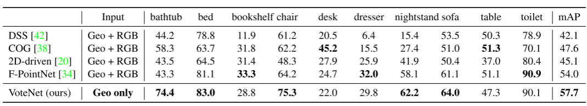

`表 1.` SUN RGB-D 验证集上的 3D 物体检测结果。 评估指标为 [40] 提出的 3D 交并比（IoU）阈值 0.25 下的平均精度（AP）。请注意，COG [38] 和 2D-driven [20] 均利用房间布局上下文来提升性能。为与先前方法进行公平比较，评估基于 SUN RGB-D V1 数据。

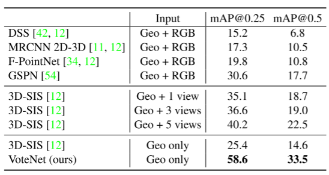

`表 2.`  ScanNetV2 验证集上的 3D 物体检测结果。 DSS 和 F-PointNet 的结果取自 [12]，Mask R-CNN 2D-3D 的结果取自 [54]，GSPN 和 3D-SIS 的结果为原作者提供的最新数据。

##### 5.2. Analysis Experiments

​		`To Vote or Not To Vote?`  VoteNet 的一个直接基线是从采样场景点直接生成边界框的网络。我们将这种基线称为 BoxNet，它对于提炼投票机制带来的改进至关重要。BoxNet 与 VoteNet 具有相同的骨干网络，但不使用投票机制，而是直接从种子点生成边界框（更多细节见附录）。表 3 显示，投票机制在 SUN RGB-D 上显著提升了约 5 个 mAP，在 ScanNet 上提升超过 13 个 mAP。

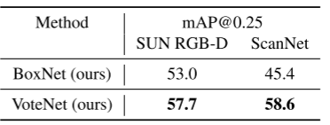

`表 3. VoteNet 与无投票基线的对比` 评估指标为 3D 物体检测的平均精度均值（mAP）。VoteNet 通过投票聚类估计物体边界框，而 BoxNet 直接从物体表面的种子点生成边界框，不经过投票步骤。

​		那么，投票机制是如何发挥作用的？我们认为，在稀疏的三维点云中，现有场景点往往远离物体中心，直接生成的提案可能置信度较低且完整边界框不准确。相反，投票机制将这些置信度较低的点聚集在一起，并通过聚合强化它们的预测。我们在图 3 的典型 ScanNetV2 场景中展示了这一现象：仅将那些采样后能生成准确提案的种子点叠加到场景上。可以看到，与 BoxNet（左图）相比，VoteNet（右图）对 “有效” 种子点的覆盖范围更广，证明了投票机制带来的鲁棒性。

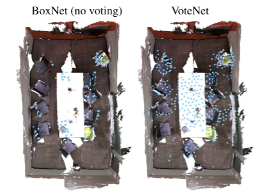

`图 3. 投票机制有助于扩大检测上下文。 `将生成高质量边界框的种子点（BoxNet）或生成高质量投票（进而生成高质量边界框）的种子点（VoteNet）以蓝色叠加在典型的 ScanNet 场景上。由于投票步骤有效扩展了上下文，VoteNet 在场景中展现出更密集的覆盖，从而提高了准确检测的可能性。

​		图 4 中我们进行了第二项分析，在同一图表中（采用不同刻度）展示了每个 SUN RGB-D 类别的以下信息：（蓝色圆点）VoteNet 与 BoxNet 的 mAP 提升幅度，以及（红色方块）物体表面点到其完整边界框中心的最近距离 —— 该距离按类别平均，并通过类别平均尺寸归一化（`距离越大意味着物体中心通常离表面越远`）。按前者对类别排序后，我们观察到强相关性：即`当物体点倾向于离完整边界框中心更远时，投票机制的帮助更为显著`。

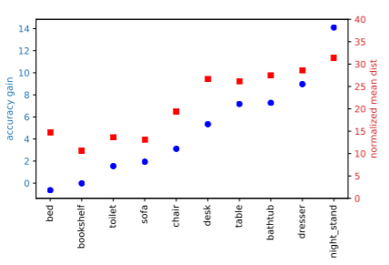

`图 4. 当物体点远离物体中心时，投票机制的帮助更为显著。 ` 我们针对每个类别展示：VoteNet 相对于直接提案基线 BoxNet 的投票精度提升（蓝色圆点）；以及通过类别平均尺寸归一化的平均物体中心距离（红色方块）。

​		`投票汇总的效果。`  投票的聚合是 VoteNet 中的重要组成部分，因为它允许投票之间的交互。因此，分析不同的聚合方案如何影响性能是有意义的。

​		在图 5（右图）中我们表明，由于杂散投票（即来自非物体种子点的投票）的存在，使用可学习的 PointNet 和最大池化的投票聚合比在局部区域手动聚合投票特征取得了好得多的结果。我们测试了 3 种这类聚合方式（前三行）：最大池化、平均池化和 RBF 加权（基于投票点到聚类中心的距离）。与基于 PointNet 的聚合（公式 2）不同，这些投票特征被直接池化，例如对于平均池化：$p = \text{MLP2} \left\{ \text{AVG}\{h_i\} \right\}$。

​		在图 5（左图）中我们展示了投票聚合半径如何影响检测（使用 Pointent 结合最大池化进行测试）。随着聚合半径的增加，VoteNet 的性能不断提升，直至在半径约 0.2 时达到峰值。然而，关注更大的区域会引入更多杂散投票，从而污染有效投票并导致性能下降。

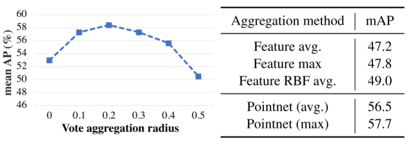

`图 5. 投票聚合分析。`左图：通过 Pointnet（最大池化）进行聚合时，SUN RGB-D 上不同聚合半径的 mAP@0.25。右图：不同聚合方法的对比（所有方法的半径均为 0.3）。使用可学习的投票聚合比在局部邻域内手动池化特征有效得多

​		`模型尺寸和速度。`  我们提出的模型效率非常高，因为它利用了点云中的稀疏性，并避免在空白空间中搜索。与先前的最佳方法（表 4）相比，我们的模型在规模上比 F-PointNet（SUN RGB-D 上的现有技术）小 4 倍以上，在速度上比 3D-SIS（ScanNetV2 上的现有技术）快 20 倍以上。请注意，3D-SIS 的 ScanNetV2 处理时间是按离线批量模式下的平均时间计算的，而我们的处理时间是通过可在在线应用中实现的顺序处理来衡量的。

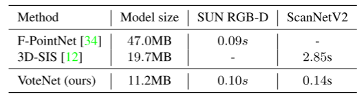

`表 4.` 模型尺寸和处理时间（每帧或每次扫描）。我们的方法在模型尺寸上比 [34] 紧凑 4 倍以上，在速度上比 [12] 快 20 倍以上。

##### 5.3. Qualitative Results and Discussion

​		图 6 和图 7 分别展示了 VoteNet 在 ScanNet 和 SUN RGB-D 场景上的若干代表性检测示例。可以看出，这些场景具有高度多样性，并带来多种挑战，包括**杂波**、**部分可见性**、**扫描伪影**等。尽管存在这些挑战，我们的网络仍展现出相当**鲁棒的结果**。例如，在图 6 中，顶部场景的绝大多数椅子被正确检测到；我们的方法能够很好地区分左下角场景中附带的沙发椅和沙发；并能对右下角场景中高度碎片化和杂乱的桌子预测出完整的边界框。

​		尽管如此，我们的方法仍存在局限性。常见的失败案例包括对非常细长物体的漏检，例如顶部场景（图 6）中用黑色边界框标注的门、窗户和画作。由于我们未利用 RGB 信息，检测这些类别几乎是不可能的。SUN RGB-D 上的图 7 还揭示了我们的方法在单视图深度图像的部分扫描中的优势。例如，它在左上角场景中检测到的椅子数量多于真值标注的数量。在右上角场景中，我们可以看到尽管只看到沙发的一部分，VoteNet 如何很好地预测出完整的边界框。在右下角场景中展示了一个不太成功的完整预测案例，其中给出的是一张非常大的桌子的极不完整观察。

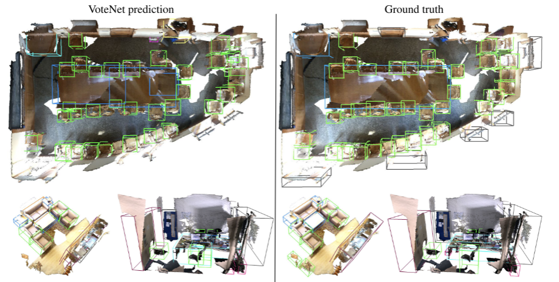

`图6.` ScanNetV2中3D对象检测的定性结果。左：我们的投票网，右：地面实况。详见第5.3节

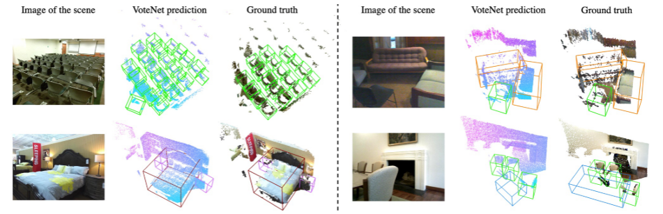

`图7.` SUN RGB-D的定性结果。左侧和右侧面板显示（从左到右）：场景图像（我们的网络未使用）、VoteNet的3D对象检测和地面实况注释。详见第5.3节。 

### 6. Conclusion

​		在这项工作中，我们提出了 VoteNet：一种受霍夫投票启发的简单而强大的 3D 物体检测模型。该网络学习直接从点云向物体中心投票，并通过投票的特征和局部几何来学习聚合投票，以生成高质量的物体提案。仅使用 3D 点云，该模型相比之前同时利用深度和彩色图像的方法展现出显著的提升。

​		在未来的工作中，我们打算探索如何将 RGB 图像融入我们的检测框架，并在下游应用（如 3D 实例分割）中利用我们的检测器。我们相信，霍夫投票与深度学习的协同作用可以推广到更多应用中，例如 6D 位姿估计、基于模板的检测等，并期待未来沿着这一方向开展更多研究。

----

### **一、研究背景与问题定义**

1. **现有 3D 检测方法的局限**
   - 多数方法依赖 2D 检测框架（如将点云转换为体素网格、鸟瞰图或通过 2D 图像提案），导致几何信息丢失或计算成本高。
   - 点云稀疏性挑战：物体质心常位于空区域，直接从表面点回归质心困难。
2. **目标**
   - 提出纯几何的端到端 3D 检测框架 VoteNet，直接处理点云，不依赖 2D 检测。

### **二、VoteNet 核心方法**

#### **1. 网络架构总览**

- **输入**：点云（XYZ 坐标，可选高度特征）。
- **骨干网络**：PointNet++，提取点云层次特征，输出种子点（含坐标和特征）。
- **投票生成**：种子点通过 MLP 生成指向物体中心的投票（3D 坐标 + 特征）。
- **投票聚类与提案**：基于空间邻近聚类投票，通过 PointNet 聚合特征生成 3D 边界框和语义分类。

#### **2. 关键模块详解**

##### **（1）霍夫投票机制**

- **传统 vs. 深度霍夫投票**： 传统方法依赖预计算码本，深度霍夫投票通过端到端网络学习投票偏移，更高效准确。
- **投票生成公式**： 种子点\(s_i = [x_i; f_i]\)通过 MLP 生成偏移\(\Delta x_i\)和\(\Delta f_i\)，投票为\(v_i = [x_i+\Delta x_i; f_i+\Delta f_i]\)。
- **投票损失函数**：\(L_{\text{vote-reg}} = \frac{1}{M_{\text{pos}}} \sum_i \|\Delta x_i - \Delta x_i^*\| \mathbb{1}[s_i \text{ on object}]\) 其中\(\Delta x_i^*\)为种子点到对应物体中心的真实偏移，仅监督物体表面种子点。

##### **（2）投票聚类与提案生成**

- **聚类策略**： 对投票点使用最远点采样（FPS）选取 K 个中心，再以半径 r 聚合邻近投票形成簇。
- **提案生成公式**： 对每个簇C，通过 PointNet-like 模块聚合特征：\(p(\mathcal{C}) = \text{MLP}_2 \left\{ \max_i \left\{ \text{MLP}_1 \left( [z_i'; h_i] \right) \right\} \right\}\) 其中\(z_i' = (z_i - z_j)/r\)为归一化坐标，\(h_i\)为投票特征，输出包含对象性分数、边界框参数和语义类别。

##### **（3）总损失函数**

- 包含投票回归、对象性分类、边界框估计和语义分类损失：\(L_{\text{VoteNet}} = L_{\text{vote-reg}} + \lambda_1 L_{\text{obj-cls}} + \lambda_2 L_{\text{box}} + \lambda_3 L_{\text{sem-cls}}\) 其中\(L_{\text{box}}\)分解为中心、朝向和尺寸回归损失，采用 Huber 损失。

#### **3. 创新点**

- **端到端可微霍夫投票**：替代传统多模块非联合优化的霍夫变换，实现端到端训练。
- **纯几何检测**：仅用点云几何信息，超越依赖 RGB 的方法。

### **三、实验结果与分析**

#### **1. 数据集与评估指标**

- **SUN RGB-D**：5K 单视图 RGB-D 图像，10 类，评估指标为 3D IoU=0.25 的 mAP。
- **ScanNetV2**：1.2K 室内 3D 重建网格，18 类，评估轴对齐边界框的 mAP@0.25 和 mAP@0.5。

#### **2. 主要性能对比**

- **SUN RGB-D（表 1）**： VoteNet（几何仅）mAP=57.7%，远超 F-PointNet（54.0%）和 COG（47.6%），尤其在 “chair” 类提升超 11 AP。
- **ScanNetV2（表 2）**： VoteNet（几何仅）mAP@0.25=58.6%，比 3D-SIS（几何 + 5 视图 RGB）高 18.4 AP，mAP@0.5=33.5%。

#### **3. 消融实验**

- **投票机制的有效性（表 3）**： 无投票基线 BoxNet 在 SUN RGB-D 和 ScanNet 分别比 VoteNet 低 5 mAP 和 > 13 mAP，验证投票对远距离质心检测的关键作用。
- **投票聚合方法（图 5）**： PointNet + 最大池化聚合效果最佳（mAP=57.7%），优于平均池化或径向基函数（RBF）聚合。
- **种子层与上下文（表 8）**： 从 PointNet++ 的 FP2 层（中等上下文）生成投票性能最优（mAP=57.7%），过大上下文（如 FP3）反降性能。

#### **4. 模型效率（表 4）**

- 模型大小 11.2MB，比 F-PointNet（47MB）小 4 倍，ScanNet 推理时间 0.14s，比 3D-SIS（2.85s）快 20 倍。

### **四、核心结论与未来方向**

1. **结论**
   - VoteNet 通过深度霍夫投票有效解决点云稀疏性问题，纯几何检测性能超越依赖 RGB 的方法。
   - 投票机制对质心远离表面的物体（如桌子、浴缸）提升最显著。
2. **未来工作**
   - 融合 RGB 信息，拓展至 3D 实例分割、6D 姿态估计等任务。

### **五、关键公式与图表对应关系**

- **公式（1）**：投票回归损失，对应段落 1-52。
- **公式（2）**：提案生成函数，对应段落 1-59。
- **表 1-2**：SUN RGB-D 和 ScanNet 性能对比，对应段落 1-77🔷1-81🔷。
- **图 2**：VoteNet 架构图，展示从点云到投票再到提案的流程，对应段落 1-44🔷。
- **图 4**：投票增益与物体中心距表面距离的相关性，验证投票对远距离质心的有效性，对应段落 1-89🔷。