# **Frustum PointNets for 3D Object Detection from RGB-D Data**

### Abstract:

​		在这项工作中，我们研究了在室内和室外场景中从**RGB-D 数据**进行**3D 目标检测**。尽管以往的方法专注于图像或**3D 体素**，这往往会掩盖 3D 数据的自然 3D 模式和不变性，但我们通过弹出 RGB-D 扫描数据，直接对原始点云进行操作。然而，这种方法的一个关键挑战是如何在大规模场景的点云中高效地定位物体（**区域提议**）。我们的方法不是单纯依赖 3D 提议，而是同时利用成熟的 2D 目标检测器和先进的 3D 深度学习来进行物体定位，即使对于小物体也能实现效率和高召回率。受益于直接在原始点云中学习，我们的方法即使在强遮挡或点非常稀疏的情况下也能够精确估计**3D 边界框**。在 KITTI 和 SUN RGB-D 3D 检测基准上的评估表明，我们的方法以显著的优势超越了最先进的技术，同时具有`实时能力`。

### 1. Introduction

​		最近，在 2D 图像理解任务上已经取得了巨大的进展，例如**目标检测**[13] 和**实例分割**[14]。然而，除了获取 2D 边界框或像素掩码之外，3D 理解在许多应用中迫切需要，如自动驾驶和增强现实（AR）。随着部署在移动设备和自动驾驶车辆上的 3D 传感器的普及，越来越多的 3D 数据被捕获和处理。在这项工作中，我们研究了最重要的 3D 感知任务之一 ——**3D 目标检测**，它从 3D 传感器数据中对物体类别进行分类，并估计物理物体的有向 3D 边界框。

​		虽然 3D 传感器数据通常以**点云**的形式存在，但如何表示点云以及使用什么深度网络架构来进行 3D 目标检测仍然是一个未解决的问题。大多数现有工作通过投影 [36,26] 将 3D 点云转换为图像，或通过量化 [40,23,26] 转换为**体素网格**，然后应用卷积网络。然而，这种数据表示转换可能会`掩盖`数据的自然 3D 模式和不变性。最近，许多论文提出直接处理点云，而不将其转换为其他格式。例如，[25,27] 提出了新型的深度网络架构，称为**PointNets（点网络）**，其在物体分类和语义分割等多项 3D 理解任务中表现出了优越的性能和效率。

​		虽然**PointNets** 能够对整个点云进行分类或为点云中的每个点预测语义类别，但这种架构如何用于实例级 3D 目标检测仍不明确。为了实现这一目标，我们必须解决一个关键挑战：`如何高效地在 3D 空间中提出 3D 物体的可能位置。`模仿图像检测中的做法，通过滑动窗口 [8] 或如 [33] 所述的 3D 区域提议网络来枚举候选 3D 盒子是直接的。然而，3D 搜索的计算复杂度通常随分辨率呈三次方增长，对于大规模场景或自动驾驶等实时应用而言成本过高。

​		相反，在这项工作中，我们遵循降维原则缩小搜索空间：利用成熟的 2D 目标检测器（图 1）。首先，通过图像检测器的 2D 边界框挤出物体的 3D 视锥体（frustum）；然后，在每个 3D 视锥体限定的空间内，使用`两种 PointNet 变体依次进行 3D 目标实例分割和无模态 3D 边界框回归`。`分割网络`预测感兴趣物体的 3D 掩码（即实例分割），`回归网络`估计无模态 3D 边界框（即使物体仅部分可见，也能覆盖整个物体）。

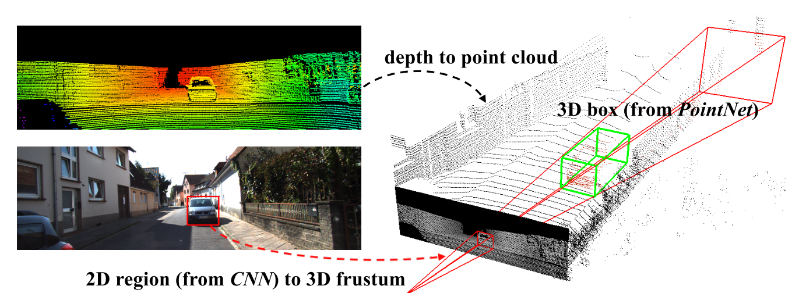

`Fig.1` **3D 目标检测流程**。给定 RGB-D 数据，我们首先使用 CNN 在 RGB 图像中生成 2D 目标区域提议。然后，每个 2D 区域被拉伸为 3D 观察视锥，我们从深度数据中在该视锥内获取点云。最后，我们的视锥体 PointNet 从视锥中的点为物体预测一个（有向且无模态的）3D 边界框

​		与以往将 RGB-D 数据视为用于 CNN 的 2D 地图的工作不同，我们的方法更以**3D 为中心**，因为我们将深度图提升为 3D 点云并使用 3D 工具对其进行处理。这种以 3D 为中心的视角实现了以更有效的方式探索 3D 数据的新能力。首先，在我们的流程中，对 3D 坐标依次应用了一些`变换`，这些变换将点云对齐到一系列更受约束的**规范帧**中。这些对齐消除了数据中的姿态变化，从而使 3D 几何模式更加明显，让 3D 学习器的工作更轻松。其次，在 3D 空间中学习可以更好地利用 3D 空间的几何和拓扑结构。原则上，所有物体都存在于 3D 空间中；因此，我们认为许多几何结构，如重复性、平面性和对称性，更自然地由直接在 3D 空间中操作的学习器参数化和捕获。这种以 3D 为中心的网络设计理念的有效性已得到许多近期实验证据的支持。

​		我们的方法在 KITTI 3D 目标检测 [1] 和鸟瞰图检测 [2] 基准上取得了领先地位。与之前的最先进技术 [6] 相比，我们的方法在 3D 汽车平均精度（AP）上提高了 8.04%，同时具有高效率（以 5 帧 / 秒的速度运行）。我们的方法也很好地适用于室内 RGB-D 数据，在 SUN-RGBD 上，我们的 3D 平均精度均值（mAP）比 [16] 和 [30] 分别提高了 8.9% 和 6.4%，同时运行速度快了一到三个数量级。

- 我们的工作的主要贡献如下：
  - 我们提出了一种新的基于 RGB-D 数据的 3D 目标检测框架，称为**视锥体 PointNets**。
  - 我们展示了如何在我们的框架下训练 3D 目标检测器，并在标准 3D 目标检测基准上实现最先进的性能。
  - 我们提供了广泛的定量评估来验证我们的设计选择，以及丰富的定性结果来理解我们方法的优势和局限性。

### 2. Related Work

​		**从 RGB-D 数据中进行 3D 目标检测**。研究人员已通过多种方式来表示 RGB-D 数据，进而解决 3D 检测问题。

​		基于前视图图像的方法：[4,24,41] 采用单目 RGB 图像和**形状先验**或**遮挡模式**来推断 3D 边界框。[18,7] 将深度数据表示为 2D 地图，并应用卷积神经网络（CNNs）在 2D 图像中定位物体。相比之下，我们将深度表示为**点云**，并使用能够更有效地利用 3D 几何的先进 3D 深度网络（如**PointNets**）。

​		基于鸟瞰图的方法：MV3D [6] 将**激光雷达点云**投影到鸟瞰图，并训练**区域提议网络（RPN）** [29] 来生成 3D 边界框提议。然而，该方法在检测小物体（如行人和骑自行车的人）时表现滞后，且难以适应垂直方向上存在多个物体的场景。

​		基于 3D 的方法：[38,34] 通过对从点云中提取的`手工设计`几何特征使用支持向量机（SVMs）训练 3D 物体分类器，然后使用滑动窗口搜索对物体进行定位。[8] 扩展了 [38] 的工作，在体素化的 3D 网格上用 3D 卷积神经网络（3D CNN）代替了支持向量机。[30] 为点云中的 3D 目标检测设计了新的几何特征。[35,17] 将整个场景的点云转换为体素网格，并使用 3D 体素卷积神经网络进行目标提议和分类。由于 3D 卷积的高昂计算成本和庞大的 3D 搜索空间，这些方法的计算成本通常相当高。`最近`，[16] 提出了一种 **2D 驱动的 3D 目标检测方法**，其思想与我们的方法类似。然而，他们使用手工制作的特征（基于点坐标的直方图）和简单的全连接网络来回归 3D 边界框的位置和姿态，这在速度和性能上都不是最优的。相比之下，我们提出了一种更灵活有效的解决方案，采用深度 3D 特征学习（PointNets）。

​		**基于点云数据的深度学习**。大多数现有工作在特征学习之前将点云转换为图像或体素形式。[40,23,26] 将点云体素化为体素网格，并将图像卷积神经网络（CNNs）推广到 3D 卷积神经网络（3D CNNs）。[19,31,39,8] 设计了更高效的 3D CNN 或神经网络架构，以利用点云的稀疏性。然而，这些基于 CNN 的方法`仍然需要`以特定体素分辨率对点云进行量化。最近，一些工作 [25,27] 提出了一种新型网络架构PointNets，其直接处理原始点云而不将其转换为其他格式。虽然 PointNets 已应用于单个物体分类和语义分割，但我们的工作`探索了如何扩展该架构以用于 3D 目标检测`。

### 3. Problem Definition

​		给定 RGB-D 数据作为输入，我们的目标是在 3D 空间中对物体进行分类和定位。从激光雷达（LiDAR）或室内深度传感器获取的`深度数据`，以 RGB 相机坐标下的**点云**形式表示。由于投影矩阵已知，因此我们可以从 2D 图像区域获取 3D**视锥体**。每个物体由一个类别（k 个预定义类别之一）和一个**无模态 3D 边界框**表示。无模态边界框即使在物体部分被遮挡或截断时，也能包围完整的物体。3D 边界框通过其尺寸$h$、*w*、*l*，中心$c_x$、$c_y$、$c_z$，以及相对于每个类别预定义规范姿态的方向*θ*、*ϕ*、*ψ*进行参数化。在我们的实现中，方向仅考虑围绕上轴的航向角*θ*。

### 4. 3D Detection with Frustum PointNets

​		如图 2 所示，我们的 3D 目标检测系统由三个模块组成：**视锥体提议**、3D 实例分割和 3D 无模态边界框估计。我们将在以下小节中介绍每个模块。我们将重点关注每个模块的流程和功能，具体涉及的深度网络架构请参考补充材料。

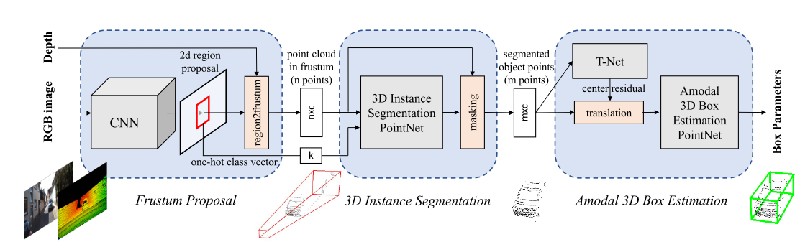

`图 2.` 用于 3D 目标检测的视锥体 PointNets。我们首先利用 2D CNN 目标检测器生成 2D 区域提议并对其内容进行分类。随后，2D 区域被提升到 3D 空间，形成**视锥体提议**。给定视锥体内的点云$n \times c$，其中n为点数，c为每个点的 XYZ、强度等通道数），通过对每个点进行二分类来分割目标实例。基于分割后的目标点云$m \times c$，轻量级回归 PointNet（T-Net）尝试通过平移对齐点云，使其质心接近无模态边界框的中心。最后，边界框估计网络为目标物体估计无模态 3D 边界框。有关涉及坐标系和网络输入输出的更多说明见图 4 和图 5。

##### 4.1. Frustum Proposal

​		大多数 3D 传感器（尤其是实时深度传感器）产生的数据分辨率仍低于商用相机拍摄的 RGB 图像。因此，我们利用成熟的 2D 目标检测器在 RGB 图像中生成 2D 目标区域，并对物体进行分类。

​		借助已知的相机投影矩阵，可将 2D 边界框提升为**视锥体**（其近平面和远平面由深度传感器的量程指定），从而为物体定义 3D 搜索空间。随后，我们收集视锥体内的所有点以形成视`锥体点云`。如图 4（a）所示，视锥体可能朝向众多不同方向，这导致点云的空间分布存在较大差异。因此，我们通过将视锥体旋转至中心视角进行`归一化处理`，使视锥体的中心轴与图像平面正交。这种归一化处理有助于提升算法的旋转不变性。我们将从 RGB-D 数据中提取视锥体点云的整个流程称为**视锥体提议生成**。

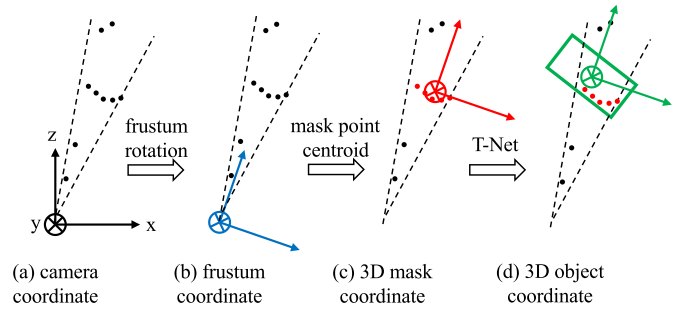

`图 4.` 点云的坐标系。图中展示人工点（黑色圆点）以说明：(a) 默认相机坐标系；(b) 将视锥体旋转至中心视角后的视锥体坐标系（4.1 节）；(c) 目标点质心位于原点的掩码坐标系（4.2 节）；(d) 由 T-Net 预测的物体坐标系（4.3 节）

​		尽管我们的 3D 检测框架不依赖于 2D 区域提议的具体方法，但我们采用了`基于 FPN [20] 的模型`。我们在 ImageNet 分类数据集和 COCO 目标检测数据集上预训练模型权重，并在 KITTI 2D 目标检测数据集上进一步微调，以分类和预测无模态 2D 边界框。2D 检测器训练的更多细节见补充材料。

##### 4.2. 3D Instance Segmentation

​		给定 2D 图像区域（及其对应的 3D**视锥体**），可采用多种方法获取物体的 3D 位置：一种直接的解决方案是使用 2D CNN 从深度图中直接回归 3D 物体位置（如通过 3D 边界框）。然而，该问题并非易事，因为自然场景中遮挡物体和背景杂波十分常见（如图 3 所示），这可能严重干扰 3D 定位任务。由于物体在物理空间中天然分离，在 3D 点云中进行分割比在图像中更为自然和容易 —— 图像中远距离物体的像素可能彼此相邻。基于这一观察，`我们提议在 3D 点云中而非 2D 图像或深度图中进行实例分割`。类似于 Mask-RCNN [14] 通过对图像区域内的像素进行二分类实现实例分割，我们在视锥体内的点云上使用基于 PointNet 的网络实现 3D 实例分割。

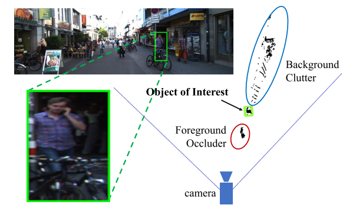

`图 3.` 视锥体点云中 3D 检测的挑战。左图：含行人图像区域提议的 RGB 图像；右图：从 2D 边界框拉伸得到的视锥体内激光雷达点云的鸟瞰图，可见点云分布广泛，同时存在前景遮挡物（自行车）和背景杂波（建筑物）。

​		基于 3D 实例分割，我们能够实现`基于残差的 3D 定位`。也就是说，无需回归物体相对于传感器的绝对 3D 位置（其偏移范围可能极大，如 KITTI 数据中从 5 米到超过 50 米），而是在局部坐标系 —— 如图 4（c）所示的 3D**掩码坐标系**中预测 3D 边界框的中心。

​		**3D实例分割PointNet。** 该网络接收视锥体内的点云，`并为每个点预测一个概率分数`，该分数表示该点属于感兴趣物体的可能性。注意，每个视锥体恰好包含一个感兴趣物体。这里的 “其他” 点可能属于非相关区域（如地面、植被）或遮挡感兴趣物体或位于其后方的其他实例。与 2D 实例分割的情况类似，根据视锥体的位置，一个视锥体内的目标点可能与另一视锥体中的点产生杂乱或遮挡。因此，我们的分割 PointNet 正在学习遮挡和杂波模式，并识别特定类别的物体几何特征。

​		在多类别检测场景中，我们还利用 2D 检测器的**语义信息**来优化实例分割效果。例如，若已知感兴趣物体是行人，分割网络可利用该`先验知识`寻找类似人体的几何结构。具体而言，在我们的架构中，将语义类别编码为**独热类别向量**（对预定义的 k 个类别为 k 维），并将该独热向量与中间点云特征拼接。具体架构细节见补充材料。

​		在 3D 实例分割后，属于感兴趣物体的点会被提取出来（如图 2 中的 “`掩膜`” 步骤）。在获得这些分割出的目标点后，我们进一步对其坐标进行`归一化`处理，以增强算法的平移不变性，这与视锥体提议步骤的原理一致。在实现中，我们通过将点云的 XYZ 坐标减去其质心坐标，将`点云转换到局部坐标系`，如图 4（c）所示。请注意，我们有意不缩放点云，因为局部点云的包围球尺寸会显著受视角影响，而点云的真实尺寸有助于边界框的尺寸估计。

​		在实验中我们发现，如上所述的坐标变换及之前的视锥体旋转对 3D 检测结果至关重要，如表 8 所示。

##### 4.3. Amodal 3D Box Estimation

​		给定分割后的目标点（在 3D 掩码坐标系中），该模块通过使用边界框回归 PointNet 结合预处理变换网络，估计物体的无模态有向 3D 边界框。

​		`基于学习的T-Net三维对齐算法`  给定分割后的目标点（在 3D 掩码坐标系中），我们发现尽管已根据其质心位置对齐点云，但掩码坐标系的原点（图 4（c））可能仍与无模态边界框的中心相距较远。因此，我们提出使用`轻量级回归 PointNet`（T-Net）估计完整物体的真实中心，然后变换坐标系，使预测的中心成为原点（图 4（d））。

​		我们的 T-Net 的架构和训练与 [25] 中的 T-Net 类似，后者可视为一种特殊的**空间变换网络（STN）** [15]。然而，不同于原始 STN 对变换无直接监督，我们`显式监督平移网络`，以预测从掩码坐标系原点到真实物体中心的**中心残差**。

​		`无模态 3D 边界框估计 PointNet`  该边界框估计网络针对 3D 物体坐标系（图 4 (d)）中的目标点云，预测无模态边界框（即使物体部分不可见也能包围完整物体）。网络架构与物体分类 [25,27] 类似，但其输出不再是物体类别分数，而是 `3D 边界框的参数。`

​		如第 3 节所述，我们通过边界框的中心$(c_x, c_y, c_z)$、尺寸$(h, w, l)$和航向角$\theta$（沿上轴方向）对 3D 边界框进行参数化。`我们采用 “残差” 方法进行边界框中心估计`：边界框估计网络预测的中心残差与 T-Net 的前序中心残差及掩码点质心结合，以恢复绝对中心（式 1）。对于边界框尺寸和航向角，我们沿用此前工作 [29,24] 的混合分类 - 回归公式：具体而言，预定义\(N_S\)个尺寸模板和\(N_H\)个等分分角区间。模型将尺寸 / 航向分类到这些预定义类别中（尺寸输出$N_S$个分数，航向输出$N_H$个分数），并为每个类别预测残差量（高度、宽度、长度各 3×$N_S$维残差，航向$N_H$维残差角度）。最终网络总共输出$3 + 4 \times N_S + 2 \times N_H$个参数。

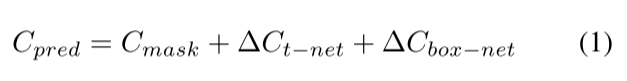

##### 4.4. Training with Multi-task Losses

​		我们通过`多任务损失（如式 (2) 所示）同时优化所涉及的三个网络`（3D 实例分割 PointNet、T-Net 和无模态边界框估计 PointNet）。其中$L_{c1-\text{reg}}$用于 T-Net，$L_{c2-\text{reg}}$用于边界框估计网络的中心回归。$L_{h-\text{cls}}$和$L_{h-\text{reg}}$是航向角预测的损失，而$L_{s-\text{cls}}$和$L_{s-\text{reg}}$则用于边界框尺寸预测。所有分类任务使用 Softmax 损失，所有回归任务使用平滑 L1（Huber）损失。

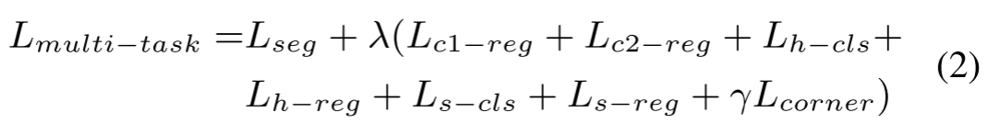

​		`箱形结构参数联合优化的角点损失法`  尽管我们的 3D 边界框参数化是紧凑且完整的，但学习过程并未针对最终 3D 框的精度进行优化 —— 中心、尺寸和航向角具有独立的损失项。试想这样的情况：中心和尺寸被准确预测，但航向角偏差较大，此时与地面真实框的 3D IoU 将主要受角度误差影响。理想情况下，所有三个项（中心、尺寸、航向角）应联合优化以获得最佳 3D 框估计（在 IoU 度量下）。为解决此问题，我们提出一种`新颖的正则化损失` ——**角点损失（corner loss）**：

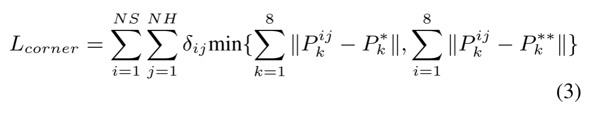

​		本质上，**角点损失**是预测边界框与真实边界框的八个角点之间的距离之和。由于角点位置由中心、尺寸和航向角共同决定，角点损失能够对这些参数的多任务训练进行正则化。

​		为计算角点损失，我们首先从所有尺寸模板和航向角区间构建$N_S \times N_H$个**锚框**。随后将锚框平移至估计的边界框中心。我们将锚框角点记为$P_{ijk}$，其中i、j、k分别为尺寸类别、航向类别和（预定义）角点顺序的索引。为避免航向估计翻转导致的过大惩罚，我们进一步计算与翻转后真实边界框角点$P^{**}_k$的距离，并取原始情况与翻转情况的最小值。$\delta_{ij}$是一个二维掩码 —— 当对应真实尺寸 / 航向类别时为 1，否则为 0—— 用于选择我们关注的距离项。

### 5. Experiments

​		实验分为三个部分：1. 首先在 KITTI [10] 和 SUN-RGBD [33] 数据集上与最先进的 3D 目标检测方法进行对比（5.1 节）；2. 提供深入分析以验证我们的设计选择（5.2 节）；3. 展示定性结果并讨论我们方法的优势和局限性（5.3 节）。

##### 5.1. Comparing with state-of-the-art Methods

​		我们在 KITTI [11] 和 SUN-RGBD [33] 3D 目标检测基准上评估了我们的 3D 物体检测器。在两项任务中，我们均取得了显著优于最先进方法的结果。

​		`KITTI`  表 1 展示了我们的 3D 检测器在 KITTI 测试集上的性能。我们大幅超越了先前的最先进方法。尽管 MV3D [6] 采用多视图特征聚合和复杂的多传感器融合策略，但我们基于 PointNet25和 PointNet++27骨干网络的方法在设计上更为简洁。虽然传感器融合（特别是 3D 检测中图像特征的聚合）超出了本工作的范围，但我们预期这将进一步提升我们的结果。

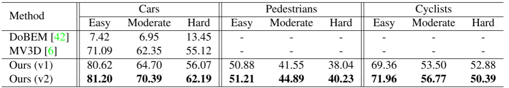

`表 1.` KITTI 测试集上的 3D 目标检测 3D AP 值。DoBEM [42] 和 MV3D [6]（此前的最先进方法）基于结合激光雷达鸟瞰图的 2D 卷积神经网络。我们的方法无需传感器融合或多视图聚合，在所有类别和数据子集上均大幅超越这些方法。3D 边界框的 IoU 阈值对汽车为 70%，对行人和骑自行车者为 50%

​		表 2 展示了我们的方法在 3D 目标定位（鸟瞰图）任务上的性能。在 3D 定位任务中，边界框被投影到鸟瞰图平面，并基于有向 2D 框评估 IoU。同样，我们的方法显著优于先前的工作，包括在投影激光雷达图像上使用 CNN 的 DoBEM [42] 和 MV3D [6]，以及在体素化点云上使用 3D CNN 的 3D FCN [17]。

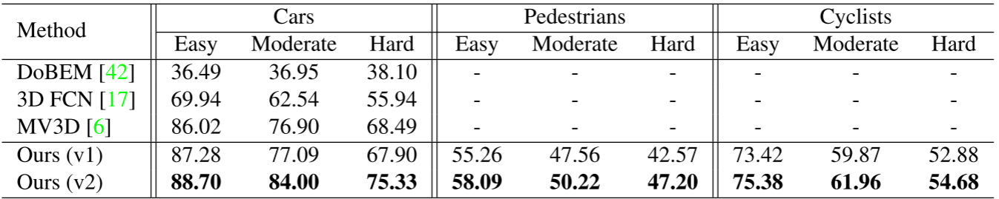

`表 2.` KITTI 测试集上的 3D 目标定位 AP（鸟瞰图）。3D FCN [17] 在体素化点云上使用 3D 卷积神经网络，且远非实时。MV3D [6] 是此前的最先进方法。我们的方法在所有类别和数据子集上均显著优于这些方法。鸟瞰图 2D 边界框的 IoU 阈值对汽车为 70%，对行人和骑自行车者为 50%。

​		图 6 可视化了我们网络的输出，即使在极具挑战性的场景下，仍可观察到精确的 `3D 实例分割和边界框预测`。我们将成功与失败案例模式的详细讨论推迟至 5.3 节。此外，我们在表 3 和表 4（针对汽车）中报告了 KITTI 验证集（与 [6] 相同的划分方式）上的性能，以支持与更多已发表工作的对比，并在表 5（针对行人和骑自行车者）中提供参考数据。

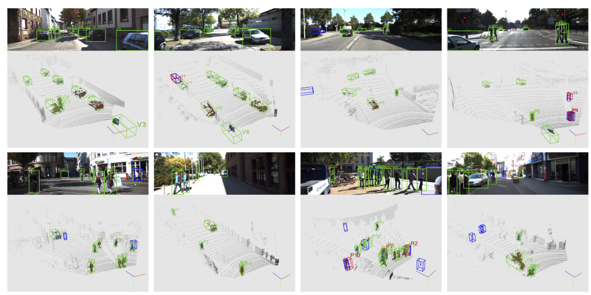

`图 6.` KITTI 验证集上视锥体 PointNet 的可视化结果（最佳观看方式为彩色并放大）。这些结果基于 PointNet++ 模型 [27]，`运行速度为 5 帧 / 秒`，测试集 3D AP 值分别为：汽车 70.39、行人 44.89、骑自行车者 56.77。点云上的 3D 实例掩码以彩色显示：真阳性检测框为绿色，假阳性框为红色；对于假阳性和假阴性案例，真实框以蓝色显示。每个边界框旁的数字和字母表示实例 ID 和语义类别，其中 “v” 代表汽车、“p” 代表行人、“c” 代表骑自行车者。有关结果的详细讨论见 5.3 节。

`SUN-RGBD`	大多数先前的 3D 检测工作要么专注于**室外激光雷达扫描**（其中物体在空间中充分分离且点云稀疏，因此适合鸟瞰图投影），要么专注于**室内深度图**（其为具有密集像素值的规则图像，可轻松应用图像 CNN）。然而，为鸟瞰图设计的方法可能无法处理室内场景 —— 其中多个物体常在垂直空间中共存。另一方面，专注于室内的方法可能难以应用于激光雷达扫描产生的稀疏且大规模的点云。

​		相比之下，我们的基于视锥体的 PointNet 是适用于`室外和室内 3D 目标检测的通用框架`。通过应用与 KITTI 数据集相同的流水线，我们在 SUN-RGBD 基准（表 6）上取得了最先进的性能 —— 平均精度（mAP）显著更高，且推理速度提升 10 至 1000 倍。

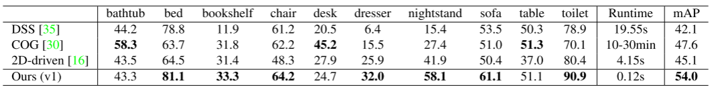

`表 6.` SUN-RGBD 验证集上的 3D 目标检测 AP 值。评估指标为 [33] 提出的 3D IoU 阈值 0.25 下的平均精度。请注意，COG [30] 和 2D-driven [16] 均利用房间布局上下文提升性能，而我们的方法和 DSS [35] 未使用该策略。相比此前的最先进方法，我们的方法在 mAP 上提升 6.4% 至 11.9%，同时推理速度快 1 至 3 个数量级。

##### 5.2. Architecture Design Analysis

​		在本节中，我们提供分析和消融实验以验证我们的设计选择。

​		`实验步骤：` 除非另有说明，本节所有实验均基于我们在 KITTI 数据集上的 v1 模型，采用与 [6] 相同的训练 / 验证集划分。为解耦 2D 检测器的影响，我们使用真实 2D 边界框生成区域提案，并以 3D 边界框估计精度（IoU 阈值 0.7）作为评估指标。我们将仅关注训练样本最多的汽车类别。

​		`与3D检测的替代方法进行比较：` 在本部分，我们评估了几种基于 CNN 的基线方法，以及使用 2D 掩码的消融版本和流水线变体。表 7 的第一行展示了两种基于 CNN 网络的 3D 边界框估计结果。基线方法在 RGB-D 图像的真实边界框上训练 VGG [32] 模型，并采用与我们主方法相同的边界框参数和损失函数。第一行的模型直接从原始 RGB-D 图像块估计边界框位置和参数，而另一种方法（第二行）使用在 COCO 数据集上训练的全卷积网络（FCN）进行 2D 掩码估计（如 Mask-RCNN [14]），并仅使用掩码区域的特征进行预测。深度值也通过减去 2D 掩码内的中值深度进行转换。然而，两种 CNN 基线的结果均远差于我们的主方法。

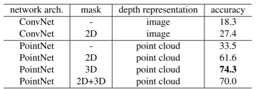

`表 7.` 2D 与 3D 方法对比。2D 掩码来自 FCN 对 RGB 图像块的处理，3D 掩码来自 PointNet 对视锥体点云的处理，2D+3D 掩码是 PointNet 对 2D 掩码深度图提取点云的处理结果。

​		为理解为何 CNN 基线方法表现不佳，我们在图 7 中可视化了典型的 2D 掩码预测结果。尽管估计的 2D 掩码在 RGB 图像上呈现高质量，但 2D 掩码内仍存在大量杂波点和前景干扰点。相比之下，我们的 3D 实例分割获得了更纯净的结果，这极大地简化了后续精细定位和边界框回归模块的处理。

​		表 7 的第三行展示了对视锥体 PointNet 的消融版本实验 —— 移除 3D 实例分割模块。不出意料，该模型结果远差于我们的主方法，这表明 3D 实例分割模块的关键作用。第四行中，我们未使用 3D 分割，而是直接用 2D 掩码深度图的点云进行 3D 框估计（如图 7 所示）。然而，由于 2D 掩码无法干净地分割 3D 物体，其性能比使用 3D 分割的主方法（第五行）差超过 12%。另一方面，结合使用 2D 和 3D 掩码（即在 2D 掩码深度图的点云上应用 3D 分割）的结果也略逊于主方法，这可能是由于不准确的 2D 掩码预测导致的误差累积。

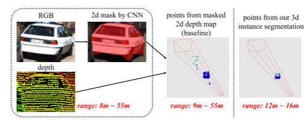

`图 7.` 2D 与 3D 掩码对比。我们展示了 KITTI 验证集上典型的 2D 区域提案，包含 2D（RGB 图像上）和 3D（视锥体点云上）实例分割结果。红色数字表示点的深度范围。

​		`点云归一化的效果。` 如图 4 所示，我们的视锥体 PointNet 采用了几个关键坐标变换来标准化点云，以实现更有效的学习。表 8 展示了每个归一化步骤对 3D 检测的帮助。我们发现，视锥体旋转（使视锥体内点的 XYZ 分布更相似）和掩码质心减去（使物体点的 XYZ 范围更小且更规范）均至关重要。此外，通过 T-Net 将物体点云额外对齐到物体中心也对性能有显著贡献。

​		`回归损失公式和拐角损失的影响。` 表 9 中我们对比了不同的损失函数选项，结果表明 “`cls-reg`” 损失（用于航向和尺寸回归的分类与残差回归方法）与正则化角点损失的组合实现了最佳性能。

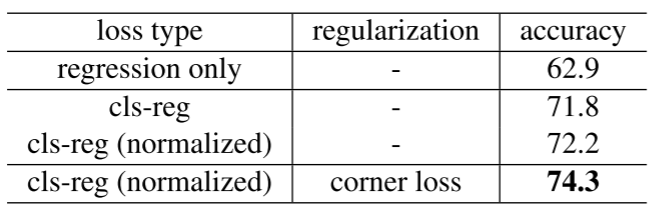

`表9.`3D盒损耗公式的影响。指标为3D盒估计精度，IoU=0.7。

​		仅使用回归损失的朴素基线（第一行）取得的结果不尽人意，因为回归目标的范围极大（物体尺寸从 0.2 米到 5 米）。相比之下，分类 - 回归（cls-reg）损失及其归一化版本（残差由航向分箱尺寸或模板形状尺寸归一化）实现了显著更优的性能。最后一行结果表明，正则化角点损失进一步助力优化过程。

##### 5.3. Qualitative Results and Discussion

​		图 6 中我们可视化了视锥体 PointNet 模型的典型输出。可以看到，对于距离适中的非遮挡物体（因此我们获得足够点数）的简单场景，模型输出了极其精确的 3D 实例分割掩码和 3D 边界框。其次，我们惊讶地发现，模型甚至能从含少量点的部分数据中（如并排停放的汽车）正确预测姿态合理的无模态 3D 边界框 —— 这类情况仅依靠点云数据连人类标注者都难以完成。第三，在一些 2D 图像中存在大量邻近甚至重叠边界框的极具挑战性的场景中，转换到 3D 空间后定位变得容易得多（如第二行第三列的 P11）。

​		另一方面，我们观察到几种失败模式，这些模式指明了未来工作的可能方向。第一种常见错误源于稀疏点云（有时点数少于 5 个）下的姿态和尺寸估计不准确。我们认为图像特征可显著改善这一问题 —— 即使对于远距离物体，我们仍可获取高分辨率图像块。第二类挑战出现在同一视锥体内存在多个同类实例时（如两人并排站立）。由于当前流水线假设每个视锥体仅含单一感兴趣物体，当多实例出现时可能产生混淆，进而输出混合分割结果。若能在每个视锥体内生成多个 3D 边界框提议，该问题有望缓解。第三，2D 检测器有时因弱光或严重遮挡漏检物体，而视锥体提议依赖区域提议，若无 2D 检测则无法生成 3D 目标。值得注意的是，我们的 3D 实例分割与无模态 3D 框估计 PointNet 并不受限于 RGB 视图提议 —— 如补充材料所示，同一框架可扩展至鸟瞰图生成的 3D 区域提议。

---

### 附录文件

### A. Overview

​		本文件为正文提供了额外的技术细节、补充分析实验、更多定量结果及定性测试结果。

​		在 B 节中，我们详细介绍了 PointNet 的网络架构与训练参数；C 节进一步解释了 2D 检测器的设计；D 节展示了框架如何扩展至鸟瞰图（BV）提议，以及融合 BV 与 RGB 提议如何进一步提升检测性能；E 节呈现了更多分析实验的结果；最后，F 节给出了 SUN-RGBD 数据集上 3D 检测的更多可视化结果。

### B. Details on Frustum PointNets (Sec 4.2, 4.3)

##### B.1. Network Architectures

​		我们分别为 v1 和 v2 模型采用了与原始 PointNet [25] 和 PointNet++[27] 相似的网络架构。不同之处在于，我们为类别独热向量添加了额外连接，使实例分割和边界框估计能够利用从 RGB 图像预测的语义信息。详细的网络架构如图 8 所示。

​		对于 v1 模型，我们的架构包含点嵌入层（作为每个点独立的共享 MLP）、最大池化层，以及基于全局特征、逐点信息和独热类别向量的逐点分类多层感知机（MLP）。请注意，我们未使用 [25] 中的 Transformer 网络，因为视锥体点云是基于视角的（而非 [25] 中的完整点云）且已通过视锥体旋转归一化。除 XYZ 坐标外，我们还利用激光雷达强度作为第四通道。

​		对于 v2 模型，我们使用集合抽象（set abstraction）层进行点云的层次化特征学习。此外，由于激光雷达点云随距离增加而愈发稀疏，特征学习必须对密度变化具有鲁棒性。因此，我们为分割网络采用了一种鲁棒的集合抽象层 ——[27] 中提出的多尺度分组（MSG）层。借助层次化特征与学习到的密度变化鲁棒性，v2 模型在分割和边界框估计任务上均表现出优于 v1 模型的性能。

##### B.2. Data Augmentation and Training

​		`Data augmentation`