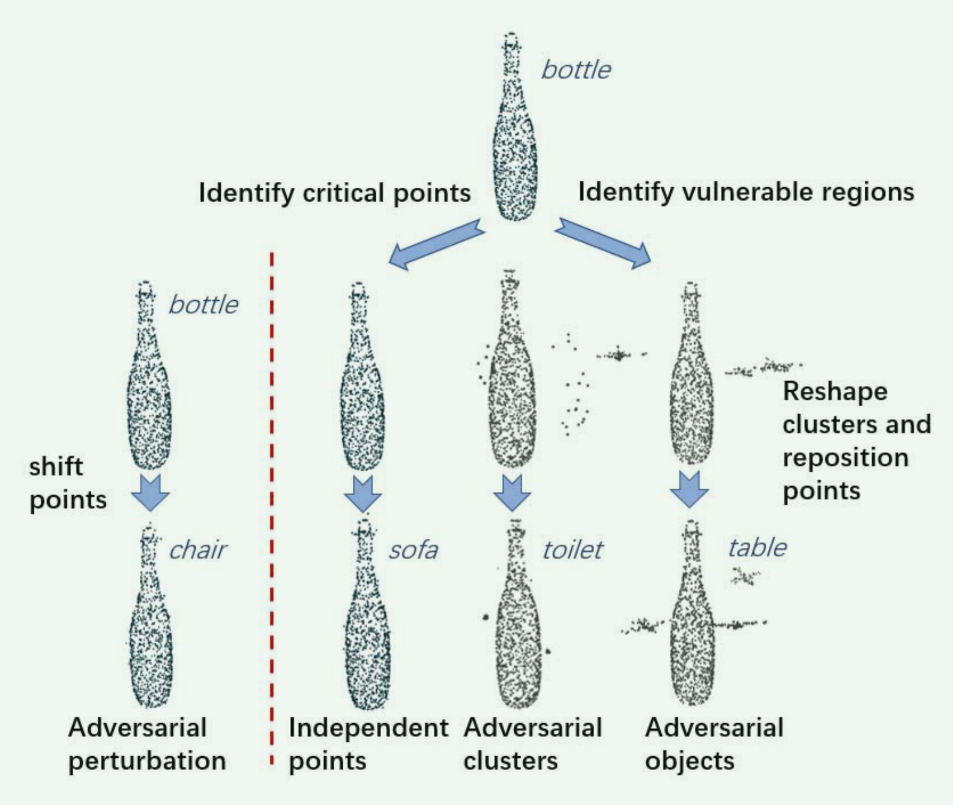
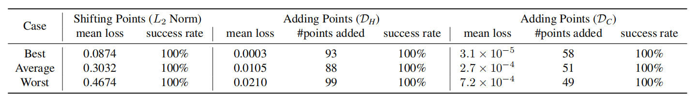
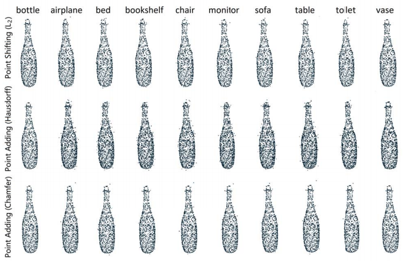
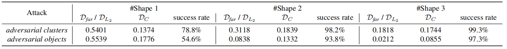
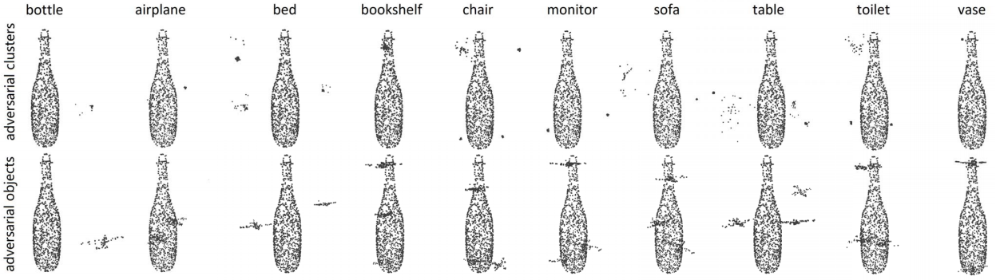
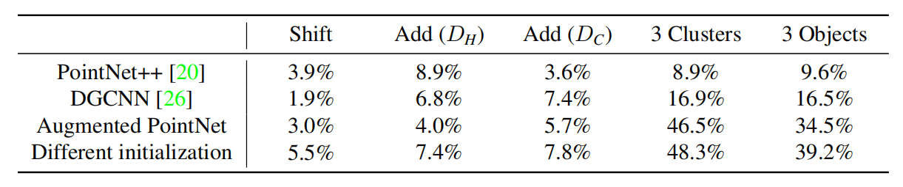
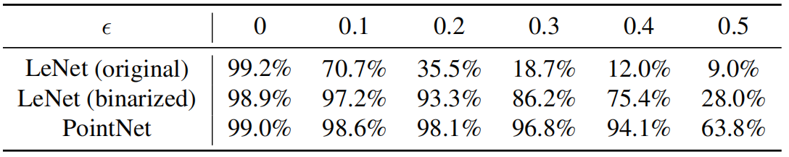

# Generating 3D Adversarial Point Clouds

## Abstract

​		众所周知，**深度神经网络**（DNNs）易受**对抗样本**的攻击，这些样本是经过精心设计的实例，旨在导致模型做出错误预测 。虽然针对二维图像和**卷积神经网络**（CNNs）的**对抗样本**已经得到了广泛研究，但对诸如**点云**之类的三维数据的关注较少 。鉴于自动驾驶等许多对安全性至关重要的三维应用，研究当前的深度三维模型如何受到**对抗点云**的影响具有重要意义 。在这项工作中，我们提出了几种新颖的算法来生成针对 **PointNet** 的**对抗点云**，**PointNet** 是一种广泛用于**点云处理**的深度神经网络 。我们的算法通过两种方式工作：**对抗点扰动**和**对抗点生成** 。对于**点扰动**，我们对现有点进行极小幅度的平移。对于**点生成**，我们既可以生成一组独立的散射点，也可以生成少量（1-3个）具有实际意义形状（如球体和飞机）的**点集群**，这些形状可以隐藏在人的心理意识中 。此外，我们制定了六种专门针对**点云攻击**的**扰动测量指标**，并进行了广泛实验，在 **ModelNet40** 三维形状分类数据集上评估了所提算法 。总的来说，我们的攻击算法在所有**定向攻击**中均实现了高于 99% 的成功率。

## 1 Introduction

​		尽管在各种学习任务中取得了巨大成功，但**深度神经网络**（DNNs）已被发现容易受到**对抗样本**的攻击 。**攻击者**能够在原始数据中添加不可感知的扰动，并以高置信度误导**深度神经网络** 。目前已提出许多算法为二维图像、自然语言和音频等数据生成**对抗样本** 。最近的几项工作已经在三维空间提出了**对抗样本**，但它们只是将三维物体投影为二维图像作为数据预处理 。然而，尚无现有工作探索真实三维模型的脆弱性 。在本文中，我们研究了直接处理三维物体的三维模型的**鲁棒性** 。具体而言，我们选择用**点云**来表示三维物体，这是大多数三维传感器（如深度相机和**激光雷达**）的原始数据 。因此，我们通过生成三维**对抗点云**来攻击三维模型 。

​		关于攻击目标，我们专注于常用的 **PointNet** 模型 。我们选择 **PointNet** 是因为该模型及其变体已被广泛且成功地应用于许多领域，例如用于自动驾驶的**三维目标检测** 、用于室内场景理解的**语义分割** ，以及人工智能辅助的**形状设计** 。此外，该模型已被证明对各种输入点的扰动和损坏具有**鲁棒性** 。其表现出比**三维卷积神经网络**（3D CNNs）更强的**鲁棒性**，这使其成为我们评估中一个具有挑战性且可靠的**基准模型** 。尽管我们专注于攻击 **PointNet**，但我们期望我们的攻击算法和评估指标能够扩展到更多的三维模型 。

​		作为 **PointNet** 的输入，**点云**是一种三维几何数据结构，具有表示简单和存储要求低的优点 。然而，鉴于其特殊属性，生成**对抗点云**具有挑战性。**点云**的不规则格式使得现有的针对二维图像设计的攻击算法不再适用：1) 在带有 $X, Y, Z$ 坐标的原始**点云**中，不存在位于规则结构中且可以被轻微修改的“像素值” ；2) 生成新**对抗点**的搜索空间非常大，因为点可以被添加到任意位置；3) 二维图像中常用于限制扰动的 **$L_p$ 范数**测量方法不适用于具有不规则性和**可变基数**（点数可变）的**点云**数据 。

​		据我们所知，通过解决上述挑战，我们是首个将对抗攻击研究扩展到不规则**点云**数据的 。我们针对点云上的两种主要**对抗攻击**类型提出了几种新颖的攻击方法：即对人类不可感知或隐藏在心理意识中的**对抗点扰动**和**对抗点生成** 。攻击流水线如图 1 所示 。

`图 1：攻击流水线 。我们的算法通过对抗点扰动（左侧）或对抗点生成（右侧）来创建对抗样本 。在我们的攻击之后，这只“瓶子”被错误分类了 。`

​		对于**对抗点扰动**，我们建议对现有点进行极小幅度的平移 。我们在常用的 **$L_p$ 范数**约束下优化**扰动向量** 。我们的实验表明，在给定的可接受扰动预算内，我们能够以 100% 的成功率制造出不可察觉的**对抗点云** 。

​		对于**对抗点生成**，我们建议合成并放置一组独立点或有限数量的点集群，并使其靠近原始物体 。具体而言，我们搜索物体的“脆弱”区域，并优化点的位置以及集群的形状 。总计，我们有三种生成的点，即：独立点、对抗集群（具有球体等通用形状的点）以及对抗物体（具有小型飞机等物体形状的点），如图 1 右侧三列所示 。我们通过它们的大小、与物体表面的距离以及放置形状的数量来约束这种生成 。

​		我们的攻击对于散射的**对抗点**达到了 100% 的成功率；对于添加三个**对抗形状**的成功率为 99.3%，两个为 98.2%，一个为 78.8% 。

​		此外，在第 6.4 节中，我们讨论了三维**对抗点云**的**迁移性**，以及将 **PointNet** 与 **卷积神经网络**（CNNs）结合以防御图像攻击的可能性 。示例代码和数据可在 `https://github.com/xiangchong1/3d-adv-pc` 获取，以支持进一步的研究 。

​		综上所述，本文的贡献可以归纳如下：

- 我们是首个针对三维学习模型生成**三维对抗样本**，并为未来研究提供**基准评估**的团队 。具体而言，我们选择了具有代表性的**点云**数据和 **PointNet** 模型进行评估 。
- 我们论证了在处理诸如**点云**等不规则数据结构时所面临的独特挑战，并针对**对抗点扰动**和**对抗点生成**提出了新颖的算法 。
- 我们提出了六种针对不同攻击任务定制的**扰动指标**，并进行了广泛的实验，结果表明我们的攻击算法在所有**定向攻击**中均能达到高于 99% 的成功率 。
- 我们对三维**点云**模型进行了**鲁棒性分析**，并证明通过分析不同三维模型的特性，可以为二维实例的潜在防御手段提供启发 。

## 2 Related Work

​		`点云与 PointNet。`**点云**由无序且数量可变（**可变基数**）的点组成，这使得神经网络很难直接对其进行处理 。Qi 等人 通过提出一种名为 **PointNet** 的新网络解决了这个问题，该网络目前已广泛用于深度**点云处理** 。**PointNet** 及其变体利用单一的**对称函数**——**最大池化**（max pooling），将无序且长度可变的输入简化为固定长度的**全局特征向量**，从而实现了**端到端学习** 。文献 还试图证明所提 **PointNet** 的**鲁棒性**，并引入了**临界点**（critical points）和**上界**（upper bounds）的概念 。他们表明，处于**临界点**和**上界**之间的点集会产生相同的**全局特征**，因此 **PointNet** 对点丢失和随机扰动具有**鲁棒性** 。然而，他们并未研究 **PointNet** 针对**对抗操控**的**鲁棒性**，而这正是本文研究的重点 。

​		`对抗样本。`Szegedy 等人首先指出，诸如神经网络之类的机器学习模型易受精心设计的**对抗扰动**的影响 。一个看起来与其原始数据相似的**对抗样本**可以轻易地以高置信度欺骗神经网络 。机器学习模型的这种脆弱性引起了社区的极大关注，许多研究已被提出以提高攻击性能并寻找可能的防御措施 。目前最先进的攻击算法——基于**优化**的攻击，定义了一个同时衡量攻击有效性和扰动幅度的**目标损失函数**，并利用**优化算法**寻找近乎最优的对抗解 。然而，该算法仅处理二维数据 。最近的一些工作也研究了物理世界中的**对抗样本** 。但是，这些工作仅将物理对象投影到二维图像，并未研究直接处理三维物体的模型 。据我们所知，我们是首个为三维机器学习模型生成对抗样本的团队。

3 Problem Formulation

​		`点云数据。`**点云**是从物体表面采样的一组点的集合 。一条数据记录 $x \in \mathbb{R}^{n \times 3}$ 对应于一个大小为 $n$ 的点集，其中每个点由一个三元组 $(x, y, z)$ 坐标表示。**点云**数据最重要的一个特征是其**不规则性**（**点云**并非定义在规则的网格结构上），这使得现有的针对二维图像的攻击算法难以直接适配。此外，我们能够在三维空间的任何位置添加点，而在二维图像中我们无法添加像素。然而，这种缺乏约束的情况导致**生成式对抗样本**的**搜索空间**变得极其巨大。因此，需要提出新的攻击算法来解决上述问题。

​		`定向对抗攻击。`在本文中，我们仅专注于针对三维**点云分类模型**的**定向攻击** 。将我们的算法扩展到诸如攻击**分割模型**等其他任务是非常灵活的 。

​		定向攻击的目标是误导一个三维深度模型（例如 PointNet），使其将一个对抗样本分类为预先选定的目标类别 。正式地，对于一个将输入 $x \in \mathcal{X} \subset \mathbb{R}^{n \times 3}$ 映射到其对应类别标签 $y \in \mathcal{Y} \subset \mathbb{Z}$ 的分类模型 $\mathcal{F}: \mathcal{X} \rightarrow \mathcal{Y}$，攻击者拥有一个恶意的目标类别 $t'$ 。基于扰动度量指标 $\mathcal{D} : \mathbb{R}^{n \times 3} \times \mathbb{R}^{n' \times 3} \rightarrow \mathbb{R}$，攻击的目标是找到一个合法的输入 $x'$，满足 ：
$$
\min \mathcal{D}(x, x'), \qquad s.t. \mathcal{F}(x') = t'\tag{1}
$$
请注意，对于**点云**数据，原本的点数 $n$ 并不一定等于对抗样本的点数 $n'$。

扰动度量指标$\mathcal{D}$是一个用于计算原始输入与生成的对抗输入之间距离或差异程度的函数。

​		正如文献 [3] 中提到的，直接求解该问题（即公式 1）非常困难 。因此，我们将该问题重新表述为基于**梯度**的**优化算法** ：
$$
\min f(x') + \lambda \cdot \mathcal{D}(x, x')\tag2
$$
这里，$f(x') = (\max_{i \neq t'} (\mathcal{Z}(x')_i) - \mathcal{Z}(x')_{t'})^+$ 是对抗损失函数，其输出用于衡量攻击成功的可能性 。其中，$\mathcal{Z}(x)_i$ 是 Logits（Softmax 层的输入）的第 $i$ 个元素，而 $(r)^+$ 表示 $\max(r, 0)$ 。通过对公式 2 进行优化，我们的目标是搜索具有最小三维扰动的对抗样本 。

​		**攻击类型**。在本文中，我们考虑点云中的两种不同攻击类型：**对抗点扰动**和**对抗点生成** 。在**扰动攻击**中，我们通过利用**对抗抖动**偏移现有点的 $X, Y, Z$ 位置来修改它们，使得点云 $x$ 中的一个点 $x_i \in \mathbb{R}^3$ 变为 $x'_i = x_i + \delta_i$（其中 $i=1, ..., n$），这里 $\delta_i \in \mathbb{R}^3$ 是对第 $i$ 个点的扰动 。在**生成攻击**中，我们生成一组**对抗点** $z = \{z_i | i=1, ..., k\}$（或者用数组表示为 $z \in \mathbb{R}^{k \times 3}$），其中每个 $z_i \in \mathbb{R}^3$ 都是在现有内点云 $x$ 之外新增的点 。然后，原始点与**对抗点**的并集被输入到模型中：$x' = x \cup z$，或者在数组表示中通过数组拼接记为 $x' \in \mathbb{R}^{(n+k) \times 3}$（因此 $n' = n+k$） 。这种攻击方式非常新颖，且与图像攻击截然不同，因为我们无法在尺寸固定的图像中生成新的像素 。

## 4 Adversarial Point Perturbation

​		在本节中，我们专注于第一种也是较简单的一种**点云攻击**类型：**对抗点扰动** 。由于在**扰动**中，原始点与受干扰点之间存在一一对应关系，我们可以简单地使用 **$L_p$ 范数**来衡量两组**点云**之间的距离。

$L_p$ 范数。$L_p$ 范数是针对固定形状数据的对抗扰动所常用的度量标准 。对于原始点集 $\mathcal{S}$ 和相应的对抗集合 $\mathcal{S}'$，扰动的 $L_p$ 范数定义如下：
$$
\mathcal{D}_{L_p}(\mathcal{S}, \mathcal{S}') = \left( \sum_{i} (s_i - s'_i)^p \right)^{\frac{1}{p}}\tag3
$$
其中 $s_i$ 是集合 $\mathcal{S}$ 中的第 $i$ 个点坐标，$s'_i$ 是集合 $\mathcal{S}'$ 中对应的点。我们可以直接利用公式 2 生成**对抗扰动** $\{\delta_i\}_{i=1}^n$ ，并通过使用 $L_2$ **范数**距离来限制扰动进行**优化**，

## 5 Adversarial Point Generation

​		除了扰动现有的点外，另一种通用的攻击策略是生成新的**对抗点**来误导三维模型 。在生成新点的方法中，一种简单的方法是添加任意数量的**独立点**（第 5.1 节），理想情况下这些点应靠近物体表面，以便它们不被察觉 。

​		另一方面，我们考虑一个更具挑战性的攻击任务，即攻击者只能添加有限数量（1-3 个）的**对抗形状**（第 5.2 节和第 5.3 节），这些形状可以是通用的**原始形状**（如球体），也可以是具有实际意义的形状（如小型飞机模型） 。这项任务具有挑战性，因为点只能被添加到三维空间的微小区域内，且原始物体的点保持不变 。这种攻击的目标是生成合理的**对抗点集群**，从而使其能够隐藏在人的心理意识中 。

​		在接下来的子章节中，我们将介绍生成**对抗个体点**的指标和攻击算法，以及两种**对抗形状**：**对抗集群**和**对抗物体**。

### 5.1  Generating Adversarial Independent Points

​		在本节中，我们专注于生成（不可察觉的）**独立点**的攻击 。需要注意的是，当向原始**点云**添加新点时，我们必须处理**数据维度**的变化 。我们首先介绍用于测量**对抗点**与原始点之间偏差的指标，然后描述我们的攻击算法 。

#### 5.1.1 Perturbation Metrics

​		`Hausdorff 距离。`Hausdorff 距离通常用于衡量度量空间中两个子集之间的距离。正式地，对于原始点集 $S$ 及其对抗对应物 $S'$，我们将 Hausdorff 距离定义为：
$$
D_H(S, S') = \max_{y \in S'} \min_{x \in S} \|x - y\|_2^2\tag4
$$
直观上，**Hausdorff 距离**为每个**对抗点**寻找其最近的原始点，并输出所有此类最近点对中的最大平方距离。我们没有包含 $\max_{x \in S} \min_{y \in S'} \|x - y\|_2^2$ 这一项，因为我们没有修改原始物体 $S$ 。

​		`Chamfer 测量。`Chamfer 测量是一种与 Hausdorff 距离类似的扰动指标。不同之处在于，Chamfer 测量取的是所有最近点对距离的平均值，而非最大值。其正式定义如下：
$$
\mathcal{D}_{C}(\mathcal{S}, \mathcal{S}') = \frac{1}{\|\mathcal{S}'\|_0} \sum_{y \in \mathcal{S}'} \min_{x \in \mathcal{S}} \|x - y\|_2^2 \tag5
$$
基数 (Cardinality / $\|\mathcal{S}'\|_0$)，集合中元素的数量 ，也就是点云中点的数量。

​		`添加点数量。`我们还希望测量攻击中添加的点数，通过统计那些与物体表面距离超过特定阈值的点来实现。正式地，对于原始点集 $S$、生成的点集 $S'$ 以及一个阈值 $T_{thre}$，添加点的数量定义为：
$$
Count(S, S') = \sum_{y \in S'} \mathbb{I} [\min_{x \in S} \|x - y\|_2^2 > T_{thre}] \tag6
$$
其中 $\mathbb{I}[\cdot]$ 是指示函数，当括号内的陈述为真时其值为 1，否则为 0 。请注意，由于添加点的数量与基于梯度的优化算法不兼容，它并没有作为公式 2 中的扰动指标 $\mathcal{D}$ 进行优化，而是作为一项额外的性能指标进行汇报。

#### 5.1.2 Attacking Algorithm

​		由于**搜索空间**巨大，直接在不受限的三维空间中添加点是不可行的 。因此，我们提出了一种**“初始化并偏移”**（initialize-and-shift）方法，为每个添加的点寻找合适的位置 ：

1. 将若干个点初始化在与现有各点相同的坐标处，作为初始点 。
2. 通过优化公式 2 来偏移这些初始点，并输出它们的最终位置 。

在优化过程中，一些初始点会从其初始位置发生偏移，并作为**对抗点**被“添加”到原始物体中 。而其他几乎没有发生偏移的点则不会改变物体的形状，因此可以作为“未添加点”被舍弃 。

​		为了使优化更加高效，我们建议将点初始化在目标的“**临界点**”位置 。**临界点**就像是三维**点云**中的关键点或显著点 。特别是在 **PointNet** 中，可以通过获取在**最大池化**操作后保持激活状态的点来计算它们 ，这意味着它们处于决定物体类别的关键位置 。位于这些关键位置周围的**对抗点**更有可能改变最终的预测结果 。

​		我们使用 **Hausdorff 测量**和 **Chamfer 测量**作为此次攻击的**扰动指标** $\mathcal{D}$，因为它们能够更有效地衡量不同维度的**对抗点云**在多大程度上是不可察觉的 。

### 5.2. Generating Adversarial Clusters

​		对于**对抗集群**，我们的目标是最小化生成的集群半径，使其看起来像是一个附着在原始物体上的球体，且不会引起怀疑 。此外，我们也鼓励该集群尽可能靠近物体表面 。为了满足这两个要求，我们引入了如下使用的**扰动指标** 。

#### 5.2.1  Perturbation Metric

​		`最远距离。`如果一个点集中最远的点对距离被控制在一定阈值内，那么该集合中的点就能形成一个有形状的集群 。形式上，我们将点集 $S$ 的最远距离定义为：
$$
D_{far}(S) = \max_{x,y \in S} \|x - y\|_2^2 \tag7
$$
​		`Chamfer 测量。`除了鼓励**点集群**在较小的半径内形成外，我们还希望将添加的集群推向物体的表面 。因此，我们也引入了 **Chamfer 测量**（在公式 5 中定义）作为我们的**扰动指标**和**优化目标** 。

​		`添加集群数量。` 与不可察觉的**对抗点云**生成中添加的点数类似，添加的集群数量也是攻击性能的一项额外指标，在我们的实验中，该数量被强制限制在 1-3 个之间 。

#### 5.2.2 Attacking Algorithm

​		在深入讨论生成算法的具体细节之前，我们需要将公式 2 重新表述如下：
$$
\min f(x') + \lambda \cdot \left( \sum_{i} D_{far}(S_i) + \mu \cdot \mathcal{D}_C(S_0, S_i) \right) \tag8
$$
其中 $i \in \{1, 2, \dots, m\}$，$S_0$ 是原始物体，$S_i$ 是第 $i$ 个对抗点集群，$m$ 是对抗集群的数量，而 $\mu$ 是用于平衡最远距离损失与 Chamfer 测量损失之间重要性的权重。这里我们稍微滥用了符号，使用 $D$ 来同时表示 $\mathbb{R}^{n \times 3} \times \mathbb{R}^{n' \times 3} \rightarrow \mathbb{R}$ 和 $\mathbb{R}^{n \times 3} \rightarrow \mathbb{R}$ 的映射关系。

​		生成**对抗集群**是添加对抗点云的一种特殊情况，因此我们可以沿用之前提到的“初始化并偏移”方法。然而，与**独立点**生成不同，我们必须约束添加的点聚集在微小的区域内。由于**局部最小值**（local-minima）无处不在，点在优化过程中很容易卡在初始化位置的附近，因此我们需要一种更高效的对抗集群初始化方法。

​		我们尝试利用**“脆弱区域”**（vulnerable regions）的想法来进行初始化。对于像 2D 图像这样的格式化数据，通常会施加 $L_1$ 约束来鼓励扰动向量的**稀疏性**。在适当的 $L_1$ 约束下，产生较大扰动的区域被认为对模型决策至关重要，因此也容易受到对抗攻击。然而，$L_1$ 约束在点云上并没有明确的定义，因此在这里不适用。相反，我们再次利用**“临界点”**（critical points）来有效地寻找潜在的脆弱区域进行初始化。临界点作为原始点集的子集，共同决定了物体形状的**全局特征**，但同时也可能是易受攻击的脆弱区域。

​		给定一个被攻击对象（受害者）和一个目标类别 $t'$，攻击过程如下：

1. 获取**目标类别**物体中的**临界点**。
2. 使用聚类算法 **DBSCAN** 对选定的临界点进行聚类。
3. 选择前 $k$ 个最大簇中的点作为**初始点**，其中 $k$ 是一个自选参数，也是评估攻击性能的一项指标。
4. 使用基于**梯度**的算法对公式 8 进行优化，并找到最佳的集群位置和形状。

​		请注意，**DBSCAN** 会将排列紧密的点（或局部密度超过阈值的点）划分为组，同时将位于低密度区域的其他点标记为**离群点**（outliers）。因此，我们能够通过它过滤掉离群点并获得紧凑的**集群**。

​		除了调整 DBSCAN 的参数外，确定所使用的**目标类别**物体数量，以及从每个目标物体中筛选出的**临界点**数量也至关重要。仅选择一个目标物体会限制临界点的空间分布；然而，使用过多的目标物体会导致临界点分布过于分散，不利于识别出一组稀疏的**脆弱区域**。调整所选临界点数量的原因也类似——我们需要适中的点数。不过，这种参数调整并不需要过于精细，因为整个攻击流程仍然主要由对公式 8 的优化所主导。

### 5.3. Generating Adversarial Objects

​		对于这种攻击，我们从一些具有实际意义的物体（如小型飞机）开始，对其进行轻微修改，并将它们放置在合适的**对抗位置**。人们可能不会产生怀疑，因为这些**对抗物体**看起来就像附近的其他普通良性物体一样。

#### 5.3.1 Perturbation Metrics

​		**$L_p$ 范数**。由于我们只想对有意义的物体进行轻微修改，并使生成的形状与现实世界的形状保持相似，我们采用 $L_p$ 范数（特别是 $L_2$ 范数）作为我们的第一个指标。

​		**Chamfer 测量**。与对抗集群类似，我们希望鼓励生成的形状靠近原始物体。

​		**添加集群数量**。添加的集群数量（限制在 1-3 个之间）也用于评估攻击性能。

#### 5.3.2  Attacking Algorithm

​		我们还需要重写目标函数以适应攻击设置：
$$
\min f(x') + \lambda \cdot \left( \sum_{i} D_{L_2}(S_{i0}, S_i) + \mu \cdot \mathcal{D}_C(S_0, S_i) \right)\tag9
$$
其中 $i \in \{1, 2, \dots, m\}$，$S_0$ 是原始物体，$S_i$ 是第 $i$ 个对抗点集群，$S_{i0}$ 是第 $i$ 个现实世界物体集群（初始形状），$m$ 是对抗集群的数量，而 $\mu$ 是用于平衡 $L_2$ 损失与 Chamfer 距离损失（原文此处误写为 Hausdorff）重要性的权重。为了实施这种攻击，我们需要先找到脆弱区域，然后初始化并扰动添加的现实世界点集群。攻击流程如下：

1. 获取**目标类别**物体中的**临界点**。
2. 使用聚类算法 **DBSCAN** 对选定的临界点进行聚类。
3. 识别前 $k$ 个最大簇并计算它们的**簇中心位置**，其中 $k$ 是自选参数，也是评估攻击性能的指标。
4. 选择**有意义的物体**并对其进行初始化，使其中心与上一步计算出的位置重合。
5. 使用基于**梯度**的算法对公式 9 进行优化，并找到最佳的集群位置和形状。

请注意，我们还可以自由选择修改后**集群**的**方向（朝向）**。由于具有不同方向的**对抗集群**不会引起怀疑，我们不对**旋转幅度**施加任何约束。

### 6 Experiment Results

​		在本节中，我们针对不同的攻击任务实现了所提出的算法，并基于各种指标对攻击性能进行了广泛的评估。

#### 6.1. Dataset and 3D Models

​		我们使用对齐后的基准数据集 **ModelNet40** [27, 23] 进行实验。ModelNet40 数据集包含 12,311 个 CAD 模型，涵盖了世界上最常见的 40 个物体类别。其中 9,843 个物体用于训练，其余 2,468 个用于测试。按照 Qi 等人 [19] 的做法，我们从每个物体表面**均匀采样** 1,024 个点，并将它们缩放到一个**单位球**内。我们采用了与 [19] 中提出的相同的 **PointNet** 结构，并使用所有 ModelNet40 训练数据训练该模型，以获得我们的受害模型。ModelNet40 数据集非常不平衡。对于我们的攻击，我们从 10 个最大的类别（即：飞机、床、书架、瓶子、椅子、监视器、沙发、桌子、马桶和花瓶）中各随机选择 25 个测试样本，并为其生成对抗点云。对于每条受害数据记录，我们针对其余 9 个类别生成对抗样本。因此，我们的实验中共有 2,250 个（受害者, 目标）攻击对。

#### 6.2. Adversarial Point Perturbation Evaluation

​		在本小节中，我们评估了**对抗点扰动**（即移动点的位置）的攻击性能。我们使用 **$L_2$ 距离**作为公式 2 中的扰动约束 $\mathcal{D}$，并最小化目标损失以寻找最佳扰动。为了获得良好的攻击性能，选择合适的权重 $\lambda$ 至关重要，它控制着最小化对抗损失与扰动幅度之间的平衡。如果 $\lambda$ 太小，扰动约束不够强，扰动就会变得过于明显。另一方面，如果 $\lambda$ 太大，则会导致算法仅专注于最小化扰动幅度，从而导致攻击失败。对于我们所有的攻击，我们执行 **10 步二分搜索**来寻找接近最优的 $\lambda$ 值。在搜索过程中，我们记录最小的扰动值 $D(x, x')$ 及其对应的对抗样本 $x'$，并最终输出最不可察觉的对抗样本。

​		我们汇报了三种情况下的实验结果：**最易攻击**的（受害者，目标）类别对的“最佳情况”、所有攻击类别对的“平均情况”，以及**最难攻击**类别对的“最差情况”。点偏移攻击的成功率和平均扰动损失汇报在**表 1** 的前两列中。我们可以看到，我们成功地将所有受害者样本攻击成了所有目标类别。考虑到扰动向量包含 1,024 个元素，该攻击的扰动损失相对较小。我们还在**图 2** 的第一行提供了可视化结果。我们选择“瓶子”类作为可视化对象，因为对于瓶子这样简单的形状，对抗扰动会变得更加明显。其他物体的更多可视化结果可在补充材料中找到。从可视化结果中可以看出，扰动（即对抗点云）几乎无法分辨。

`表 1：点偏移与独立点生成攻击性能评估`

### 6.3. Adversarial Point Generation Evaluation

​		在本小节中，我们评估了三种不同对抗点生成方式的攻击性能：**独立点**、**对抗集群**以及**对抗物体**。

​		`对抗独立点。`为了生成对抗独立点，我们将 **Hausdorff 测量**和 **Chamfer 测量**作为扰动指标 $\mathcal{D}$，并针对公式 2 进行优化。我们分别使用这两种不同的距离度量，并对比这两类约束下的性能。为了计算添加点的数量，我们获取新生成的对抗点云的**临界点**，将阈值 $T_{thre}$ 设为 0.01，并统计移动距离超过该阈值的点数。实验结果如**表 1** 所示。首先，Hausdorff 和 Chamfer 约束都实现了 **100% 的攻击成功率**，证明了所提出的“初始化并偏移”算法的有效性。其次，我们可以看到平均距离损失和添加点数之间存在巨大差异。由于 Hausdorff 距离仅控制所有最近点对中的最大距离，而 Chamfer 测量计算的是平均距离，因此 **Hausdorff 的损失值远大于 Chamfer**，添加点的数量也是如此。关于 Hausdorff 和 Chamfer 测量不同攻击性能的更详细分析见补充材料。

​		通过添加点生成的对抗瓶子可视化结果如**图 2** 的第二行和第三行所示。从图中我们可以很容易地观察到不同约束条件下的不同特征（**Hausdorff 约束**导致添加的点数更多，而 Chamfer 约束则会导致产生更明显的**离群点**）。考虑到这两种约束的不同特性，人们可以结合这两项约束，并根据具体的攻击目标调整这两个扰动指标的权重。

`图 2：对抗点扰动的可视化结果`

​		`对抗集群。`为了获得初始集群，我们从目标类别的测试集中随机选择 8 个不同的物体，并根据每个点对全局特征通道的贡献数量，获取每个物体最重要的 32 个**临界点**。随后，我们使用 **DBSCAN 算法**对这些 $32 \times 8$ 个临界点进行聚类。之后，我们保留规模最大的前 $k$ 个集群，并舍弃其他小集群和离群点。对于每个集群，我们通过**下采样**或**填充**操作使其包含 32 个初始点。我们将 $k$ 的取值从 1 变动到 3，以观察对抗集群的数量如何影响攻击性能（成功率和距离损失）。在公式 8 中，参数 $\lambda$ 通过 **5 步二分搜索**选择，而 $\mu$ 则根据攻击者对“更小集群”或“更贴合集群”的偏好进行预设。在我们的实验中，我们将 $\mu$ 设为 0.1。由于篇幅限制，我们仅在**表 2** 中汇报平均情况的定量结果。三种情况的完整结果已包含在补充材料中。

`表 2：对抗集群与对抗物体的攻击性能评估（平均情况）。`

​		表格显示，随着对抗集群数量的增加，攻击成功率显著提高；当添加 3 个对抗集群时，我们能够成功攻击 **99.3%** 的样本。此外，添加更多数量的集群也有助于降低每个集群的扰动损失。当我们仅添加一个集群时，平均情况下的集群**最远距离**为 0.5401，考虑到整个物体都被包含在一个单位球内，这个数值相当大。然而，当添加 3 个集群时，最远距离急剧下降至 0.1818。因此，可以合理预期，如果攻击者能够添加超过 3 个集群，攻击性能将会更好。添加 3 个对抗集群的可视化结果见**图 3** 的第一行。对于大多数攻击对，图中清晰地显示了几个小集群。

`图 3：添加 3 个对抗集群/物体的可视化结果`

​		`对抗物体。`在本次攻击中，我们使用与对抗集群相同的设置来识别**脆弱区域**。我们从“飞机”类中随机选择一个物体，并将其初始化在不同脆弱区域的中心。该飞机被缩放至原始尺寸的十分之三，并从其表面**均匀采样** 64 个点。初始化完成后，我们根据公式 9 进行优化以实施攻击。同样地，参数 $\lambda$ 通过二分搜索确定，而在我们的实验中，$\mu$ 预设为 0.2。

​		表 2 的第二行提供了不同扰动指标下的结果。我们可以看到，这种攻击比对抗集群更具挑战性，因为物体的形状几乎是预定义的。然而，与现实世界物体相似的形状使得这种攻击更不易引起怀疑。此外，当添加三个对抗物体时，我们仍然实现了 **97.3%** 的极高成功率；如果允许添加更多对抗物体，性能还会进一步提升。我们还在图 3 的第二行提供了可视化结果。可以看到，瓶子周围的几架小飞机已经足以欺骗 **PointNet** 模型。对比图 3 中的两行可视化可以发现：当集群靠近物体表面时，**对抗集群**的可视化隐蔽性更好；而当集群远离表面时，**对抗物体**则更不易引起怀疑。这进一步证明了我们引入两种具有意义形状的尝试是合理的。

### 6.4. More Analysis on 3D Model Robustness

​		在本小节中，我们对类 PointNet 模型进行鲁棒性分析。

​		`对抗点云的可迁移性。`我们将精心制作的对抗点云输入到 **PointNet++** [20]、**DGCNN** [26]、经过数据增强训练的 PointNet 以及使用不同权重初始化训练的 PointNet 中。我们发现这些 3D 对抗样本实际上**几乎无法作为定向攻击（Targeted Attacks）进行迁移**。此外，我们计算了非定向攻击（Untargeted Attack）的成功率，结果如**表 3** 所示。我们可以看到，与 2D 对抗样本相比，非定向攻击的可迁移性也非常有限。由于我们提出的攻击方法具有通用性，可以应用于攻击其他 3D 模型，因此低可迁移性可能与 3D 模型本身的特殊属性有关。这种内在属性使得针对此类对抗实例设计**黑盒防御**成为可能。

`表 3：针对 PointNet++、DGCNN、增强版 PointNet 以及不同初始化 PointNet 的非定向迁移攻击成功率。`

​		`基于 PointNet 的 MNIST 防御。`受上述鲁棒性分析的启发，我们进一步尝试使用 PointNet 结构在 **MNIST** 数据集上进行防御。我们将灰度图像二值化，并从每个 MNIST 数字中采样 256 个点。我们通过使用 **FGSM** [9] 攻击 **LeNet** [13] 来制作对抗样本。**表 4** 汇报了在不同攻击参数 $\epsilon$ 下，二值化图像（LeNet）和采样点云（PointNet）的测试准确率。我们可以看到，PointNet 模型实现了相对较高的测试准确率，并表现出对抗对抗样本的良好防御特性。

`表 4：MNIST 对抗样本的测试准确率。`

​		`总结：`我们的分析表明，PointNet 结构比传统的 CNN 更具鲁棒性。我们认为，部分鲁棒性来自于通过 **最大池化（Max Pooling）** 学习到的全局特征。虽然这些有趣的特性尚未被完全理解，但我们相信对此进行进一步研究将推动一种防御方向——即通过引入类 PointNet 结构来提高传统神经网络的鲁棒性。

### 7 Conclusion

​		作为 3D 深度学习模型漏洞研究的先驱（可以说我们是首批开展此项研究的），在本文中，我们提出了几种攻击算法来生成对抗点云，以欺骗广泛使用的 **PointNet** 模型，这些方法包括**对抗点扰动**（偏移）和**对抗点生成**（添加）。我们还提出了**六种不同的扰动度量指标**，并对所提攻击算法的性能进行了广泛评估。大量的实验结果表明，在可接受的扰动预算下，所提算法能够生成攻击成功率超过 **99%** 的 3D 对抗点云。我们希望这项工作能够为未来的 3D 对抗样本研究提供一个基准（Baseline）和指导方针（Guideline）。

---

# 术语

`Adversarial Examples`  对抗样本，在原始样本中添加微小的、人类难以察觉的扰动后形成的输入，能导致深度学习模型产生错误输出。

​		**通俗理解**：就像是在路牌上贴了一些特殊的反光贴纸，人眼看着还是“停车”，但自动驾驶系统的摄像头会把它看成“限速100”。

`Adversarial Point Perturbation`  对抗点扰动，通过对点云中已有点的坐标（$x, y, z$）进行极其微小的偏移来实施攻击。

​		**通俗理解**：不增加新点，只是给每个点做个微整形，让点云的轮廓发生极细微的抖动。

`Adversarial Point Generation`  对抗点生成，通过在点云中添加原本不存在的新点或点簇来实施攻击。

​		**通俗理解**：在物体周围凭空变出几个零星的“灰尘点”或者几个极小的模型，以此干扰计算机的判断。

`Targeted Attacks`  定向攻击，攻击者不仅要让模型分类错误，还要让模型错误地将其分类为预先指定的某个特定类别。

​		**通俗理解**：不仅要让模型把“猫”认错，还要精准地引导模型必须把“猫”认成“狗”。

`Varying Cardinality`  可变基数，指集合中元素的数量不是固定的。在点云中，这意味着不同的样本可以包含不同数量的点。

​		**通俗理解**：有的点云由 1000 个点组成，有的只有 500 个。这不像图片，每一张的像素总数通常是固定的

$L_p$ `Norm`  $L_p$ 范数，一种衡量向量大小或两个向量间差异的数学工具。常见的 $L_1$ 是各元素差的绝对值之和，$L_2$ 是平方和再开方（欧氏距离）

​		**通俗理解**：就像对比两张照片时，逐个像素点看颜色变了多少。但在点云里，因为点会动、会增减，你根本不知道该拿哪个点去比。

`Irregularity` 点云的不规则性，数据点在空间中的分布不遵循固定的网格或阵列结构 ,数据不分布在规则的网格（Grid）上。点云中的点可以在三维空间中的任何坐标出现 。

`Perturbation Vector`  扰动向量，一个与原始点云维度相同的向量，其每个分量代表对应点在 $x, y, z$ 轴上的偏移量 。

`Vulnerable Regions`  脆弱区域，指点云中对模型分类决策起关键作用的特定空间区域，在这些区域施加干扰最容易导致模型判别错误 。

`Adversarial Clusters`  对抗集群，一组聚集在一起并形成某种几何形状（如球体）的对抗性点 。

​		**通俗理解**：不是东一个西一个的散点，而是像一团“云朵”或“小球”一样聚在一起的新增点。

`End-to-End Learning`  端到端学习，模型直接从原始输入学习到最终输出，无需人工设计中间特征提取步骤 。

​		**通俗理解**：中间过程黑盒化，直接“输入数据 -> 得到结果”，不需要人类教电脑怎么画轮廓。

- 传统做法（流水线式）：

  1. 手动去除点云中的噪声。
  2. 人工设计几何特征（如计算点的曲率、法向量）。
  3. 将这些特征输入给简单的分类器。

  - *缺点*：如果第一步特征没设计好，后面再强也没用。

- 端到端学习（PointNet 的做法）：

  1. 直接输入点云的 $x, y, z$ 坐标。
  2. 模型通过**对称函数**（如**最大池化**）自己学习哪些特征最重要 222。
  3. 直接输出结果。

  - *通俗理解*：就像全自动照相机，你只需要按下快门（输入），照片就洗好了（输出），你不需要懂光圈、快门和感光度怎么手动配合。

`Global Feature Vector`  全局特征向量，一种固定长度的数值表示，概括了整个三维物体的几何形状特征 。

​		

什么是`黑盒模型` (Black-box Model)？

- **定义**：指内部逻辑极其复杂，人类无法直观理解其决策机制的模型。虽然你知道输入什么会得到什么，但你不知道模型内部成千上万个参数是如何协同工作产生这个结果的。
- **本论文背景**：PointNet 拥有数百万个参数。当它把一个点云识别为“椅子”时，我们很难准确说出它是根据哪一个具体的坐标值做出决定的 。
- **通俗理解**：就像一个经验极其丰富的“老中医”，他一眼就能看病，但他很难用一套标准的数学公式告诉你他脑子里那一瞬间闪过了哪些判断逻辑。

什么是`白盒模型` (White-box Model)？

- **定义**：逻辑透明、可解释性强的模型。你可以清晰地跟踪数据的每一步转换，并能用简单的逻辑（如“如果 A 且 B，则结果为 C”）来描述它。
- **例子**：**决策树**（Decision Tree）。
- **通俗理解**：就像一个自动售货机。投进 5 块钱，按下按钮 A，机器内部的齿轮转动逻辑是完全可见且确定的，你可以清楚地解释为什么出来的是可乐而不是雪碧。

`Generative Adversarial Examples`  生成式对抗样本，通过在原始数据中添加新元素（而非仅仅修改原有元素）而产生的对抗性输入 。

​		**通俗理解**：不是在原来的点上“微调”，而是凭空“变”出一些新的点放进去，让模型产生幻觉。

`Adversarial Loss Function`  对抗损失函数，专门设计用于诱导模型产生错误预测的损失函数 。在公式 2 中，它的作用是拉大目标类别与其他类别之间的分值差距 。

​		**通俗理解**：这是一个“误导分”，分数越低，代表模型越倾向于把样本认成你想要的那个假类别（$t'$）

`Logits`  神经网络最后一层输出的原始向量，尚未经过 **Softmax** 归一化处理 。

 		**通俗理解**：这就是模型的“原始打分表”。比如第 1 个元素是 10 分，第 2 个是 2 分，模型通常会选分数最高的那个作为判断结果。

`Gradient-based Optimization` 基于梯度的优化，利用目标函数的导数信息来迭代更新变量，以寻找函数最小值的算法 。

`Adversarial Jitters`  对抗抖动，指在对抗攻击中施加在原始坐标上的微小、经过计算的位移偏差。

`Adversarial Objects` 对抗物体，具有特定语义含义（如飞机、汽车等）的对抗性点云形状，被放置在受攻击物体附近 。

​		**通俗理解**：在瓶子旁边放一架“微型飞机”，虽然它看起来很自然，但却能骗过电脑的眼睛，让电脑把瓶子也看成飞机。

`Data Dimensionality Changes`  数据维度变化，指由于点的数量增加，导致存储点云坐标的矩阵行数发生变化的现象 。

`Hausdorff Distance` Hausdorff 距离，衡量两个点集之间相似程度的一种度量，表示一个集合中的点到另一个集合中最近点的最大距离 。

​	**通俗理解**：想象两组人（点集 A 和 B）。让 B 组的每个人都在 A 组里找一个离自己最近的目标，然后我们看谁找得最辛苦（距离最远）。这个最远的“最短距离”就是这把尺子的量程。（这是单向的，是从B出发在A中找离B最近的点，双向的话，还可以从A出发在B中找离A最近的点）。

​	比如说A组中有三个人分别是A1 ,A2,A3, 同理B组中也有三个人，分分别是B1,B2,B3，假设离A1最近的人是B1, 离A2最近的人是B2,离A3最近的人是B3, r1 = |A1-B1| ，也就是A1和B1的距离，同理有r2，r3, 假设最大值是r3，那么Hausdorff距离就是r3

​		如果你新加了 100 个点，其中 99 个都贴在物体表面（$r$ 很小），但只有 1 个点跑到了 10 米外（$r$ 很大），那么 **Hausdorff 距离** 就会直接锁定这个 10 米的距离 。

**目的**：它是为了限制最显眼的那个坏点，确保没有任何一个新加的点会离物体太远而导致“穿帮” 。

`One-way Hausdorff Distance`  单向 Hausdorff 距离，标准 Hausdorff 距离是双向取最大值，而本文仅计算新生成的对抗点到原始点云的距离 。

`Adversarial Clusters`  对抗集群，：指一组在空间中紧密聚集、形成特定几何形状（如球体）的对抗性点 。

​		**通俗理解**：与其在物体周围散布零星的“灰尘”，不如直接在物体表面“粘”一个小球。只要这个球足够小且位置隐蔽，人类会以为那是物体本身的一部分（比如瓶子上的一个凸起），但对模型来说却是致命的干扰。

 `DBSCAN 的“净化”作用`

- **离群点 (Outliers)**：在提取目标类别（如“飞机”）的特征时，有些临界点可能只是零散分布的杂点。
- **逻辑**：DBSCAN 就像一个**过滤器**。它只保留那些“扎堆”出现的点，认为这些聚集成团的点才代表了飞机的核心几何特征（如机翼的尖端）。过滤掉杂点，能让攻击者生成的“小球”更具有代表性。

| **攻击类型** | **添加内容**     | **视觉观感**         | **算法核心**            |
| ------------ | ---------------- | -------------------- | ----------------------- |
| **独立点**   | 零散的“沙子”     | 像噪声，几乎不可见   | $L_p$ 或 Hausdorff 距离 |
| **对抗集群** | 无意义的“小球”   | 像物体上的凸起/肿瘤  | 捏合约束 + 贴表约束     |
| **对抗物体** | 有意义的“小模型” | 像伴随物（如装饰品） | 语义保持 + 战略位置投放 |

`Unit Ball Re-scale`  单位求缩放， 将所有形状的坐标按比例缩小或放大，使得所有点都落在一个半径为 1 的圆球范围内。

# 关于公式1的理解

1. 目标函数：$\min \mathcal{D}(x, x')$（隐身要求）

- **数学含义**：寻找一个对抗样本 $x'$，使得它与原始点云 $x$ 之间的**扰动度量** $\mathcal{D}$ 达到最小。
- **通俗理解**：这是攻击者的“隐身衣”。攻击者希望对点云的改动越小越好，最好是人类肉眼完全看不出区别。如果改动太大（比如把一个瓶子改得面目全非），虽然电脑会认错，但人类一眼就能看出被动过手脚，这种攻击就是失败的。

2. 约束条件：$\text{s.t. } \mathcal{F}(x') = t'$（成功要求）

- **数学含义**：$\text{s.t.}$ 是英文 “subject to” 的缩写，意为“受限于”或“使得”。这句要求：经过改动后的样本 $x'$，输入到模型 $\mathcal{F}$ 中，输出的结果必须精准地等于攻击者指定的**目标类别** $t'$。
- **通俗理解**：这是攻击者的“终极目标”。不管你怎么微调点云，最后的底线是：必须让 **PointNet** 这类模型把这个样本看成是我指定的那个类别（比如把“瓶子”看成“飞机”）。

3. 点数灵活性：$n \ne n'$（点云特权）

- **文中注释**：作者特意提到，在点云中，原始点数 $n$ 和攻击后的点数 $n'$ 可以不相等。
- **通俗理解**：这在 2D 图像里是不可能的（你不能给一张照片多变出几个像素点），但在 3D 世界里，我们可以往里面多撒几颗“沙子”（添加新点），所以前后的点数可以不一样。

# 关于公式2的理解

1. 核心项拆解：$f(x')$ —— “拉踩”策略

公式中 $f(x') = (\max_{i \neq t'} (\mathcal{Z}(x')_i) - \mathcal{Z}(x')_{t'})^+$ 看起来很吓人，其实它的逻辑非常损 ：

- **$\mathcal{Z}(x')_{t'}$**：这是模型给你的**目标错误类别**打的分 。
- **$\max_{i \neq t'} (\mathcal{Z}(x')_i)$**：这是模型给除目标攻击类别$t'$外其他所有类别打出的最高分 。
- **$t'$**：是你（攻击者）想要模型误认成的**目标类别**（比如你想让模型把“瓶子”认成“沙发”，那么“沙发”就是 $t'$。
- **$i \neq t'$**：指的是分类模型中，除了“沙发”以外的所有其他类别（包括它原本真实的类别“瓶子”，以及马桶、桌子等其他所有选项
- **通俗理解**：
  - 如果“最高分”比“目标分”高，相减就是正数，说明攻击还没成功。优化过程会拼命**压低最高分**，同时**拉抬目标分** 。
  - 一旦“目标分”成了全场最高，相减就是负数，外面的 $( \cdot )^+$（取 $\max(r, 0)$）就会让结果变成 $0$。这意味着攻击已经成功，不需要再在这个项上浪费精力了 

2. 调节旋钮：$\lambda$ —— “天平”的权重

- **如果 $\lambda$ 很大**：算法会非常在意“改动幅度” $\mathcal{D}$ 。
  - *结果*：改动极其微小，肉眼完全看不出，但可能因为力度不够，没法让模型认错 。
- **如果 $\lambda$ 很小**：算法会非常在意“攻击是否成功” $f(x')$ 。
  - *结果*：模型肯定会认错，但你可能把点云改得乱七八糟，人类一眼就能看出这个瓶子长得“不对劲” 。

# 关于公式8的理解

这个公式 **(8)** 是为了生成那种“**粘在物体表面的一团对抗点**”（即对抗集群）而专门设计的。它将攻击者的三个愿望揉成了一个数学表达式。

我们可以将其简化理解为：**总代价 = 骗过模型的代价 + $\lambda \times$ (捏紧小球的代价 + $\mu \times$ 贴近表面的代价)**。

### 1. 拆解公式项

- **$\min f(x')$**：**“攻击成功项”**
  - **含义**：这是我们在公式 (2) 中学过的对抗损失。它的任务是改变模型的最终判断，让模型觉得这个物体是目标类别 $t'$ 。
  - **目标**：这一项越小，模型就越坚信这个带“疙瘩”的瓶子其实是一个“沙发”或“飞机” 。
- **$D_{far}(S_i)$**：**“捏紧小球项”**
  - **含义**：这是集群内点与点之间的**最远距离** 。
  - **目标**：公式通过最小化这个距离，强迫新加的那些点不要四处乱飞，而是紧紧地聚缩在一起，形成一个很小的球状 。
- **$\mathcal{D}_C(S_0, S_i)$**：**“贴近表面项”**
  - **含义**：这是原始物体 $S_0$ 和第 $i$ 个对抗集群 $S_i$ 之间的 **Chamfer 距离** 。
  - **目标**：它负责把刚刚捏好的“小球”推向物体的表面 。如果没有这一项，小球可能会悬浮在半空中，看起来非常不自然 。

### 2. 两个关键的“旋钮”（超参数）

- $\lambda$（总权重）：

  - 用来平衡“攻击效果”和“改动大小” 。

  - 如果 $\lambda$ 很大，生成的小球会非常紧致且贴合，但可能骗不过模型；如果 $\lambda$ 很小，模型会被骗，但小球可能会变得很大很显眼 。

- $\mu$（平衡权重）：

  - 用来平衡“球捏得紧不紧”和“离表面近不近” 。

  - $\mu$ 越大：算法更在意让小球贴着物体表面 。

  - $\mu$ 越小：算法更在意让小球缩成一个完美的紧密圆团 。

# DBSCAN算法介绍

如果说 K-Means 是在找“圆形的团块”，那么 DBSCAN 就是在**“找邻居”**。它能自动识别各种形状的簇，并且能敏锐地发现并踢出那些“捣乱”的离群点（噪声）。

### 1. 核心思想：物以类聚，人以群分

DBSCAN 的逻辑很简单：**如果一个点周围足够“拥挤”，那它就属于一个簇。**

为了衡量这种“拥挤”程度，算法定义了两个关键参数：

- **$\epsilon$ (Eps)**：邻域半径。即以我为中心，多大的圆圈算作我的“邻居圈”。
- **MinPts**：最少点数。即在我的“邻居圈”里，至少要有几个邻居，我才算是一个“核心人物”。

### 2. 三种身份

在 DBSCAN 的世界里，每个点都会被贴上一个标签：

1. **核心点 (Core Point)**：
   - **条件**：在它的 $\epsilon$ 半径内，包含的点数 $\ge$ MinPts。
   - **地位**：它是簇的“领袖”，能带头组建团队。
2. **边界点 (Border Point)**：
   - **条件**：它自己在半径内没有足够的邻居，但它是某个“核心点”的邻居。
   - **地位**：它是簇的“边缘成员”，虽然没能力当领袖，但能靠关系入伙。
3. **噪声点 (Noise / Outlier)**：
   - **条件**：既不是核心点，也不是边界点。
   - **地位**：离群索居，被算法直接无视或踢出。

### 3. 算法是如何运作的？

想象你在玩一个“连连看”的游戏：

1. **随机点名**：从数据集中随机选一个没被访问过的点。
2. **判断身份**：看看它是不是“核心点”。如果是，就以它为起点，把它所有的邻居都拉进当前的簇。
3. **接力寻找**：对于新拉进来的邻居，如果他们也是“核心点”，就继续把他们的邻居也拉进来。这就叫**密度可达**（Density Reachable）。
4. **扩张停止**：当再也找不到新的核心点可以接力时，这个簇就成型了。
5. **处理剩余点**：重复上述过程，直到所有点都被处理。没被划进任何簇的点，就是“噪声”。

# END

---

局限性：只针对PointNet进行了攻击，其攻击算法和评估指标并没有对其他三维模型进行测试