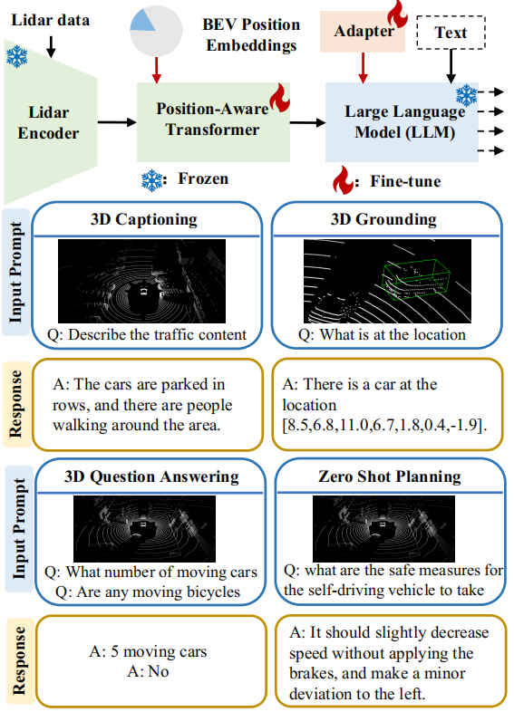

# LiDAR-LLM: Exploring the Potential of Large Language Models for 3D LiDAR Understandin

### Abstract

​		最近，**大语言模型 (Large Language Models, LLMs)** 和**多模态大语言模型 (Multimodal Large Language Models, MLLMs)** 在**指令遵循 (Instruction Following)** 和图像理解方面展现出了广阔的前景。尽管这些模型非常强大，但它们尚未被开发用于理解更具挑战性的3D几何与物理场景，特别是在涉及稀疏的户外**激光雷达数据 (LiDAR Data)** 时。在本文中，我们引入了 LiDAR-LLM，它将原始的激光雷达数据作为输入，并利用 LLM 卓越的推理能力来获得对户外3D场景的全面理解。我们 LiDAR-LLM 的核心见解是将3D户外场景认知重构为一个语言建模问题，涵盖了**3D字幕生成 (3D Captioning)**、**3D定位 (3D Grounding)**、**3D问答 (3D Question Answering)** 等任务。具体而言，由于3D激光雷达-文本配对数据的匮乏，我们引入了一种三阶段训练策略并生成了相关数据集，逐步将3D模态与 LLM 的语言嵌入对齐。此外，我们设计了一个**位置感知 Transformer (Position-Aware Transformer, PAT)** 来连接3D编码器与 LLM，这有效地弥合了模态鸿沟，并增强了 LLM 对视觉特征的空间方位理解。我们的实验表明，LiDAR-LLM 能够有效地理解与3D场景相关的广泛指令，在3D字幕生成数据集上取得了 $40.9$ 的 BLEU-1 得分，**定位字幕生成 (Grounded Captioning)** 准确率达到 $63.1\%$，**鸟瞰图平均交并比 (BEV mIoU)** 达到 $14.3\%$。

### Introduction

​		最近，**大语言模型 (Large Language Models, LLMs)** (Touvron et al. 2023; OpenAI 2023; Brown et al. 2020) 在自然语言处理领域的复杂推理和强大的对话能力方面展现出了显著的性能。在 LLMs 的基础上，引入了多模态大语言模型 (Multimodal Large Language Models, MLLMs) (Liu et al. 2024; Li et al. 2023; et al 2022; Lin et al. 2023; Wang et al. 2023a)，例如 BLIP-2 和 Flamingo。这些模型接收更多模态（例如，2D 图像）作为输入，使得 LLMs 能够讨论和理解视觉场景。尽管 MLLMs 在处理 2D 图像内容方面表现出色，但它们对更具挑战性的 3D 真实世界场景的理解仍然是一个悬而未决的问题。由于 3D 数据中包含丰富的空间信息，理解 3D 场景对于包括自动驾驶 (Arnold et al. 2019; Chen et al. 2017) 和机器人 (Dhamo et al. 2021; Yao et al. 2018; Wang et al. 2024) 在内的各种应用具有重要意义。

​		现有的 3D 理解方法 (Yang et al. 2021; Jiao et al. 2022; Parelli et al. 2023; Azuma et al. 2022; Ma et al. 2022) 在面对未见过的场景时通常缺乏足够的泛化能力。它们在以人类可理解的方式表达特定的下游任务（如生成场景字幕和问答）方面存在局限性。因此，最近的研究工作 (Wang et al. 2023b; Hong et al. 2023; Qi et al. 2024) 将室内 3D **点云 (Point Clouds)** 作为输入，并利用 LLMs 强大的能力对其进行分析，将 3D 特征与 LLMs 的文本特征进行对齐。然而，这些方法在处理 3D 户外**激光雷达 (LiDAR)** 数据时依然面临挑战。具体而言，由于激光雷达数据的稀疏特性，将 3D 数据渲染为**多视角图像 (Multi-view Images)** (Hong et al. 2023) 会导致渲染和特征提取质量低下。此外，诸如 (Guo et al. 2023; Qi et al. 2024) 的方法只能对单一的物体级点云进行编码，而无法理解复杂的户外场景。

​		在本文中，如图 1 所示，我们引入了 LiDAR-LLM，这是一种利用 LLMs 推理能力来全面理解户外 3D 场景的新颖方法。LiDAR-LLM 架构包含一个 3D 激光雷达编码器、一个对齐 Transformer 以及一个 LLM，例如 LLaMA (Touvron et al. 2023)。LiDAR-LLM 的核心见解在于通过解释性的语言建模来重新定义 3D 场景认知问题。然而，引入 LLMs 来感知户外 3D 场景面临两个挑战：1) 与图像-文本配对数据 (Sharma et al. 2018; Schuhmann et al. 2022; Changpinyo et al. 2021) 的丰富可用性相反，3D 激光雷达-文本配对数据极其罕见，并且缺乏可用的多模态编码器（例如，CLIP (Radford et al. 2021)）。2) 3D 激光雷达比室内点云更稀疏，并且包含与各种物体的复杂几何关系。

​		为了应对这些挑战，我们生成了所需的数据集，并引入了一种三阶段训练策略，包括**跨模态对齐 (Cross-modal Alignment)**、感知以及高级指令。该策略逐步将 3D 表示迁移到语言特征空间中，从而释放 LLMs 对 3D 场景的推理能力。在第一阶段，我们利用 MLLMs (Zhang et al. 2023; Li et al. 2023) 和 GPT-4 (OpenAI 2023) 来促进 nuScenes 数据集 (Caesar et al. 2020) 中多视角图像与语言之间的信息交流，该数据集包含每个场景的配对 3D 激光雷达数据。这一过程自动生成了一个包含 42 万个激光雷达-文本对的字幕数据集，从而实现了 3D 激光雷达特征与 LLM 词嵌入的跨模态对齐。在第二阶段，认识到感知对于 3D 场景理解至关重要，我们将 3D 边界框整合到问答文本中，创建了一个包含 28 万个样本的激光雷达**定位 (Grounding)** 数据集。然后，我们应用以物体为中心的学习策略，使模型具备 3D 感知能力。最后，在第三阶段，我们在高级指令数据集 (Qian et al. 2023; Contributors 2023) 上高效地**微调 (Fine-tune)** LiDAR-LLM，以增强其执行各种 3D 下游任务（如自动驾驶预测与规划）的能力。为了更有效地弥合 3D 激光雷达与文本之间的模态鸿沟，我们设计了一个位置感知 Transformer (Position-Aware Transformer, PAT) 来连接 3D 激光雷达编码器与 LLM，将**鸟瞰图 (Bird's-Eye View, BEV)** 位置嵌入显式地注入到 3D 特征中。结合三阶段训练策略，PAT 增强了模型对空间方位的理解。总而言之，我们的贡献如下：

- 我们提出了 LiDAR-LLM 框架，该框架将 3D **激光雷达数据 (LiDAR Data)** 和语言作为输入，利用 **大语言模型 (LLMs)** 的推理能力来理解户外 3D 场景。LiDAR-LLM 能够执行诸如 **3D字幕生成 (3D Captioning)**、**3D定位 (3D Grounding)**、**3D问答 (3D Question Answering)**、**高级规划 (High-level Planning)** 等任务。
- 我们引入了一种 **三阶段训练策略 (Three-stage Training Strategy)**，用于将 3D 表示逐步迁移到文本特征空间中，该策略包括 **跨模态对齐 (Cross-modal Alignment)**、**感知 (Perception)** 以及 **高级指令 (High-level Instruction)**。 
-  为了促进训练，我们收集了一组激光雷达-文本配对数据集，包含 42 万条 3D 字幕生成数据 (nu-Caption) 和 28 万条 3D 定位数据 (nu-Grounding)。这些数据集将公开发布以供研究使用。 
-  我们专门设计了一个 **位置感知 Transformer (Position-Aware Transformer, PAT)**，它连接了 3D 激光雷达编码器与 LLM，弥合了 **模态鸿沟 (Modality Gap)**，并增强了模型对空间方位的理解。

`图 1：LiDAR-LLM 的特性。我们提出的 LiDAR-LLM 以 3D 激光雷达数据作为输入，并将 3D 模态与 语言嵌入空间 (Language Embedding Space) 进行对齐，利用 LLMs 卓越的推理能力来理解户外 3D 场景。底部展示了源自我们生成或使用的激光雷达-文本数据的示例，涵盖了一系列与 3D 相关的任务。`

### Conclusion

总而言之，本文代表了一项开创性的工作，旨在释放**大语言模型 (LLMs)** 的推理能力，以理解户外的**激光雷达数据 (LiDAR Data)**。为了训练 LiDAR-LLM，我们生成了一套全面的激光雷达-文本配对数据集，其中包含 42 万条**3D字幕生成 (3D Captioning)** 数据和 28 万条**3D定位 (3D Grounding)** 数据。随后，我们引入了一种**三阶段训练策略 (Three-stage Training Strategy)**，逐步将激光雷达模态与 LLM 的**语言嵌入空间 (Language Embedding Space)** 进行对齐。我们的架构创新引入了**位置感知 Transformer (Position-Aware Transformer)** 来连接 3D 编码器与 LLM。通过在我们生成的数据集和开源数据集上进行的广泛实验，我们的 LiDAR-LLM 在各种任务中展现出了极具前景的性能，这些任务包括 3D 字幕生成、3D 定位、**3D问答 (3D Question Answering)**、**自动驾驶规划 (Autonomous Driving Planning)** 以及一系列**高级指令任务 (High-level Instruction Tasks)**。