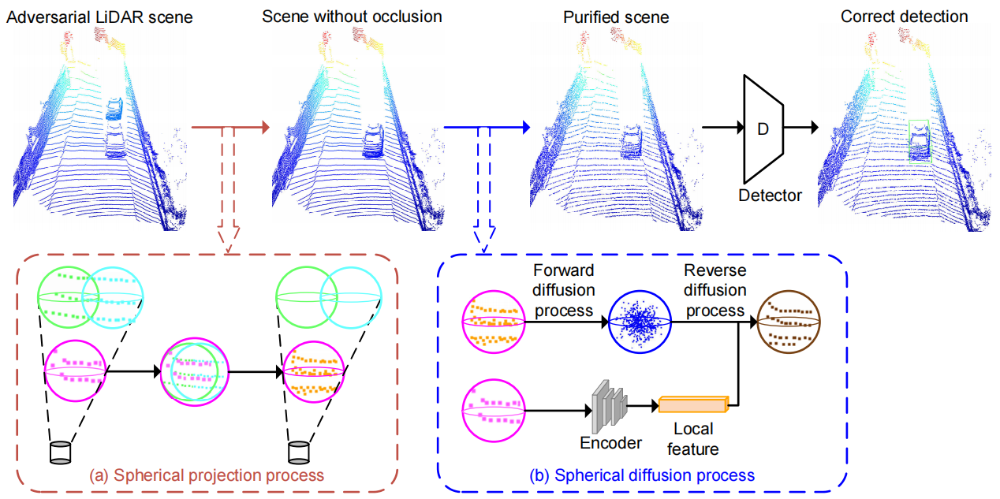
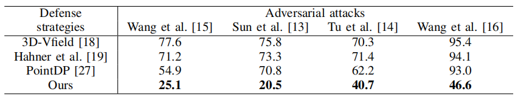
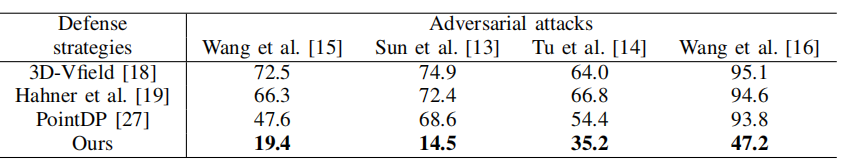
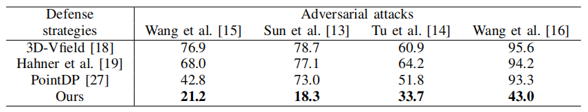
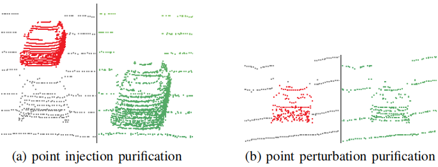

# LiDAR-SPD: Improving Adversarial Robustness of 3D Object Detection via Spherical Projection and Diffusion 

# 激光雷达SPD：利用球面投影和扩散提高三维目标检测的对抗健壮性

### 0. Abstract

​		 光探测与测距（**LiDAR**）传感器和**3D 目标检测技术**的发展，推动了它们在众多应用中的部署，尤其是在**自动驾驶**领域。然而，研究表明，基于**深度神经网络**的 3D 目标检测模型存在脆弱性，且易受**对抗攻击**的影响。尽管如此，目前专门为缓解 3D 目标检测所面临的对抗攻击而设计的**防御策略**仍较为匮乏。在本文中，我们提出了 LiDAR-SPD（基于球形投影与扩散的 LiDAR 防御方法），这是一种新型防御方法，用于抵御针对基于 LiDAR 的 3D 目标检测器的对抗攻击。具体而言，我们设计了一个**球形净化单元**，该单元包含两个关键流程：**球形投影**和**球形扩散**。其中，球形投影利用空间投影策略，消除插入到**遮挡区域**中的**对抗性点云**；而球形扩散则采用**扩散模型**重新生成点云，使其更接近原始的 LiDAR 场景。在**KITTI 数据集**上进行的全面实验表明，我们提出的 LiDAR-SPD 方法能够有效抵御各类对抗攻击，将针对 3D 目标检测器的**攻击成功率**降低了 60%。

***Index Terms***—LiDAR, 3D object detection, Adversarial robustness, Defense strategies, Diffusion models. 

本文提出的 LiDAR-SPD 就是一种防御策略，它通过 “球形投影” 消除注入的恶意点云，再通过 “球形扩散” 修复点云，让 3D 目标检测器即使面对对抗攻击也能正确识别目标。

### 1. Introduction

​		**LiDAR 传感器**已成为各类应用中的关键传感方式，它通过**激光束**测量环境中物体的距离，生成密集的**3D 点云**，从而提供关于周围环境的精确**空间信息**[1]、[2]。这种能力使**3D 目标检测模型**能够在 3D 空间中准确定位物体（如车辆、行人及障碍物）。深度学习领域的最新进展推动了高性能 3D 检测模型的发展，包括**PointPillars**[3]、**PointRCNN**[4]、**PV-RCNN**[5]、**CenterPoint**[6] 和**CenterFormer**[7]，这些模型在**自动驾驶场景**中展现出了良好的效果。这些模型以 LiDAR 点云为输入，输出物体的类别、朝向以及精确的**几何信息**，而这些信息对于安全、可靠的**自动驾驶**至关重要。

​		尽管 3D 目标检测模型已取得显著进展，但近期研究表明，深度模型易受**对抗攻击**的影响 [8]-[11]。通常，这些研究中的对抗攻击可分为**点扰动攻击**（point perturbation-based attacks）和**点注入攻击**（point injection-based attacks）两类。Cao 等人 [12] 首次证实了针对 3D 目标检测的**物理攻击**（physical attack）的可行性 —— 该攻击通过**对抗性传感器攻击**（adversarial sensor attack）的方式，对 LiDAR 场景生成扰动，从而误导检测器做出偏离真实情况的预测。Sun 等人 [13] 探究了 3D 目标检测架构的普遍脆弱性，并首次设计出**黑盒点注入攻击**（black-box point injection attack）以欺骗深度模型。Tu 等人 [14] 提出了一种**物理可实现的通用攻击**（physically realizable universal attack）：通过 3D 打印生成一个对抗性物体，并将该恶意样本放置在目标车辆的车顶，以此欺骗检测器。Wang 等人 [15] 以点扰动的形式对良性 LiDAR 场景发起对抗攻击，成功导致多种主流 3D 检测器的检测任务失效。此外，Wang 等人 [16] 提出了**对抗性障碍物生成方法**（adversarial obstacle generation）—— 该方法生成稀疏的障碍物点云，并将其放置在场景中以发起点注入攻击。这些攻击给自动驾驶系统带来了严重的安全风险，因为它们可能导致车辆对障碍物或其他车辆产生**感知偏差**（misperception）。为缓解这一威胁，已有研究开始探索针对**对抗性点云的防御策略**（defense strategies against adversarial point clouds）。CARLO [13] 的防御策略基于**遮挡模式**（occlusion pattern）设计：通过分析 LiDAR 场景中点云数据的**不变特征与物理特征**（invariant and physical features）分布，检测出恶意样本。现有防御方法主要集中于**对抗训练**（adversarial training）[17]-[20]，其目标是在训练过程中使检测器`适应特定类型`的对抗攻击。因此，目前亟需一种灵活且有效的防御机制，以确保深度 3D 目标检测器的**鲁棒性**（robustness）与可靠性。

​		**扩散模型**（Diffusion models）近年来因其在图像生成 [21]、[22] 和真实**3D 点云**（3D point clouds）生成 [23]-[25] 方面的巨大潜力而受到关注。通常，扩散模型的工作原理是：在通过学习得到的**扩散过程**（diffusion process）的引导下，通过一系列**去噪步骤**（denoising steps）将噪声逐步转化为数据。在**点云处理**（point cloud processing）领域，扩散模型已被证实能有效生成精确的点云，并净化各类**对抗攻击**（adversarial attacks）带来的干扰 [26]、[27]。近期的研究工作（如文献 [28] 提出的方法和**LiDMs**[29]）通过利用**LiDAR 数据**（LiDAR data）的**几何先验**（geometric priors），生成了精确的点云场景，并证明了扩散模型在生成真实 LiDAR 场景方面的有效性。此外，**LiDARPure**[30] 采用扩散模型净化 LiDAR 场景中的**常见损坏**（common corruptions），为净化**对抗性点云**（adversarial point clouds）和再生纯净 LiDAR 场景提供了一种可行方法。

​		在本文中，我们提出一种针对 3D 目标检测对抗攻击的防御方法，名为LiDAR - 球形投影与扩散（LiDAR-SPD，LiDAR-Spherical Projection and Diffusion）。**球形净化单元**（spherical purification unit）是该防御策略的基础，其用于净化 LiDAR 场景，且可部署在任意3D 目标检测流水线（3D object detection pipeline）之前。随后，通过依次执行**球形投影流程**（spherical projection process）和**球形扩散流程**（spherical diffusion process），消除恶意 LiDAR 场景中可能存在的**点扰动攻击**（point perturbation attacks）和**点注入攻击**（point injection attacks）。特别地，球形扩散流程采用**连续时间条件扩散模型**（continuous-time conditional diffusion model）对球形净化单元进行再生处理。

​		Overall, our key contributions are summarized as follows：

- 我们提出**LiDAR-SPD（LiDAR - 球形投影与扩散）**，用于抵御**LiDAR 场景**下的**对抗攻击**，该方法不依赖于**3D 目标检测模型**，可与任意**3D 检测器**搭配使用，以提升检测器的**鲁棒性**。
- 我们提出**球形净化单元**，该单元利用**空间投影流程**（即球形投影流程）和**扩散模型**，净化 LiDAR 场景中由**恶意点扰动攻击**（即点扰动攻击）和**点注入攻击**造成的干扰。
- 为提升**扩散模型的生成质量**，我们将**球形净化单元**的**局部特征**作为条件，使其参与到**反向扩散流程**中。
- 在**KITTI 数据集**和先进**3D 检测器**上进行的全面评估表明，所提出的 LiDAR-SPD 性能优于当前**最先进的防御策略**，并将针对检测器的**对抗攻击成功率**降低了 60%。

​		

### 2. METHODOLOGY

​		在本节中，我们首先在第二节 A 部分（Section II-A）介绍**扩散模型**（diffusion models）的基础知识。随后，在第二节 B 部分（Section II-B）对**3D 目标检测模型**（3D object detection models）的**对抗防御**（adversarial defense）问题进行公式化定义。在第二节 C 部分（Section II-C）和第二节 D 部分（Section II-D），我们将详细阐述所提出的**LiDAR-SPD 方法**（LiDAR-SPD method），包括其中的**球形投影流程**（spherical projection process）与**球形扩散流程**（spherical diffusion process）

##### A. Preliminaries

​		在本研究中，我们采用**连续时间扩散模型**（continuous-time diffusion models），通过将噪声逐步转化为结构化数据分布，生成高质量的图像或数据样本。与**离散时间扩散模型**（discrete-time diffusion models，即连续时间扩散模型的对应模型）不同，连续时间扩散模型以连续的方式构建**扩散过程**（diffusion process），并利用**随机微分方程**（stochastic differential equations）使整个扩散过程具有平滑性，同时具备坚实的理论基础。

​		通常情况下，**扩散模型**（diffusion models）由**前向扩散流程**（forward diffusion process）和**反向扩散流程**（reverse diffusion process）两部分组成。给定从某一**未知分布 p (x)**（unknown distribution p (x)）中采样得到的输入数据 x，**连续时间扩散模型**（continuous-time diffusion model）的前向扩散流程可通过一个**随机微分方程**（stochastic differential equation）表示 [22]，具体如下：

$d\mathbf{x} = \mathbf{f}_t(\mathbf{x}) dt + g_t d\mathbf{w}.$             (1)

​		前向扩散流程 x (t)（forward diffusion process x (t)）定义在时间 t 正向递增的范围 t ∈ [0, 1] 内。$f_t(\cdot)$和$g_t$分别是与 x (t) 相关的**漂移系数**（drift coefficient）和**扩散系数**（diffusion coefficient）。而$w(t)$是**标准维纳过程**（standard Wiener process）。随着前向扩散流程的推进，x (t) 逐渐丢失其原始信息，当 t = 1 时，x (t) 服从标准高斯分布（standard Gaussian distribution），即：
$p_1(x) \approx \mathcal{N}(0, I)$.

​		**VP-SDE**（变分概率随机微分方程，Variational Probability Stochastic Differential Equation）[22] 是**反向扩散流程**（reverse diffusion process）的解。其**反向时间随机微分方程**（reverse time SDE）可表示为：

$d\hat{\mathbf{x}} = \left[ \mathbf{f}_t(\hat{\mathbf{x}}) - g_t^2 \nabla_{\hat{\mathbf{x}}} \log p_t(\hat{\mathbf{x}}) \right] dt + g_t d\mathbf{w}$     (2)

其中，为满足**前向扩散流程**（forward diffusion process），$f_t(\hat{x})$ 定义为 $-\frac{1}{2}\beta_t \hat{x}$，$g_t$ 定义为 $\sqrt{\beta_t}$，即：
$f_t(\hat{x}) := -\frac{1}{2}\beta_t \hat{x}$ ,$g_t := \sqrt{\beta_t}$
$\beta_t$ 是**前向方差系数**（forward variance coefficient），且具有**随时间变化的特性**（time-dependent）。因此，若能得到 $\nabla_{\hat{x}} \log p_t(\hat{x})$（即关于 $\hat{x}$ 的 $\log p_t(\hat{x})$梯度），则可基于**反向时间随机微分方程**（reverse time SDE）完成扩散模型的生成过程。目前常用的方法是采用**神经网络 $s_{\theta}(x, t)$**（neural network $s_{\theta}(x, t)$）对其进行估计。基于此，Nie 等人 [26] 提出了一种**截断反向过程求解器**（truncated reverse process solver），该求解器可记为 $\text{sdeint}$:

$\hat{\mathbf{x}}(0) = \operatorname{sdeint}(\mathbf{x}(t), \mathbf{f}_{\text{rev}}, g_{\text{rev}}, \mathbf{w}, t, 0)$		(3)

​		此处的六个输入依次为**初始值**（initial value）、**漂移系数**（drift coefficient）、**扩散系数**（diffusion coefficient）、**维纳过程**（Wiener process）、**初始时间**（initial time）和**终止时间**（end time）。此外，漂移系数与扩散系数的定义如下：

$\mathbf{f}_{\text{rev}}(\mathbf{x}, t) := -\frac{1}{2}\beta(t)\left[\mathbf{x} + 2\mathbf{s}_\theta(\mathbf{x}, t)\right], \quad g_{\text{rev}} := \sqrt{\beta(t)}.$   	(4)

​		样本$\hat{x}(t)$在时间从 t=1 到 t=0 的过程中逐步**去噪**（denoises）。理想情况下，$\hat{x}(1)$服从由**前向扩散流程**（forward diffusion process）得到的**标准高斯分布**（standard Gaussian distribution）。当 t=0 时，**反向扩散流程**（reverse diffusion process）的输出应与前向扩散流程的输入具有相同的**分布**（distribution）。

##### B. Problem Formulation

​		给定一个**良性 LiDAR 场景**（benign LiDAR scene）S，场景中存在m个物体，每个物体由一个**边界框**（bounding box）$B = \{b_n = (x_n, y_n, z_n, l_n, w_n, h_n, \Theta_n) \mid n = 1, \ldots, m\}$表示。该边界框描述了物体中心的**三维坐标**（3D coordinate）$(x_n, y_n, z_n)$，以及物体的长度$l_n$、宽度$w_n$、高度$h_n$和**朝向**（orientation）$\Theta_n$。**3D 目标检测器**（3D object detector）D的目标是从场景中定位物体，使其预测结果逼近真实值B，即$D(S) = B$。现有**对抗攻击方法**（adversarial attack methods）通常对场景S施加恶意**点扰动**（point perturbations）T或注入**点云**（point clouds）$\hat{P}$，生成对抗性 LiDAR 场景（adversarial LiDAR scene）$\hat{S} = S + T + \hat{P}$。这会欺骗 3D 目标检测器，使其预测错误结果$D(\hat{S}) \neq B$。本文的目标是开发一个**球形净化单元**（spherical purification unit），对对抗性 LiDAR 场景$\hat{S}$进行净化并再生场景$S'$，使得净化后场景的检测结果$D(S') = D(S) = B$。

##### C. Spherical Projection Process

​		为了净化**对抗性 LiDAR 场景**（adversarial LiDAR scene），我们提出了**球形净化单元**（spherical purification unit），它是后续**投影流程**（projection process）和**扩散流程**（diffusion process）的基础。构建球形净化单元的过程包括：从场景中**随机采样一个点**（random sampling a point），并以该点为中心创建`半径为$r_1$`的**球形区域**（spherical region）。若场景中的任意点位于该球形区域内，则该点属于此球形净化单元，且不再参与后续的采样过程。重复上述过程，直到场景中所有点都被包含在球形净化单元中。

​		如图 1 所示，所提出的**球形净化单元**（spherical purification unit）应用于两个流程：**球形投影流程**（spherical projection process）与**球形扩散流程**（spherical diffusion process）。其中，球形投影流程旨在抵御向场景**遮挡区域**（occluded regions）注入**恶意点云**（malicious point clouds）的**对抗攻击**（adversarial attacks）。此类攻击违背物理定律，且易导致检测器做出错误预测。对于已生成球形净化单元的 LiDAR 场景，我们将其视角转换为以**LiDAR 传感器**（LiDAR sensor）为**原点**（origin）的**正视图**（front view）。如此便能得到从原点投射至每个球形净化单元中心的**射线**（rays）。由于 LiDAR 仅具备**单一视角**（single perspective），正常情况下无法探测到遮挡区域。然而，恶意注入的物体点云会打破这一规律。对于每个球形净化单元，若投射至该单元的射线需穿过其他球形净化单元，则可能存在**遮挡**（occlusion）。考虑到不同球形净化单元与原点的距离不同，且其半径可能产生影响，我们将**遮挡判断条件**（judgement condition of occlusion）设定为半径$r_2$（通常$r_2 < r_1$）。若投射至某一球形净化单元$u_1$的射线，穿过以另一球形净化单元$u_2$为中心、半径为$r_2$的**球形空间**（spherical space），则认为存在遮挡区域。此时，距离原点更远的球形净化单元（即$u_1$）内的所有点，将被转移至距离更近的球形净化单元（即$u_2$）中，这一过程即为球形投影流程，如图 1 中的流程（a）所示。我们利用球形净化单元对遮挡区域进行投影操作，可解决**点云场景的无序性与稀疏性**（disorder and sparsity of point cloud scenes）问题。与**体素**（voxels）相比，球形单元的分布更均匀，且半径$r_2$可作为更优的**遮挡判定标准**（criterion for determining occlusion occurrence）。

`图 1`：所提出的**LiDAR-SPD 方法**（LiDAR-SPD method）针对 LiDAR 场景对抗攻击的整体流程。给定一个**对抗性 LiDAR 场景**（adversarial LiDAR scene），其中存在**恶意注入点云**（maliciously injected point clouds）或**扰动点**（perturbations）。根据场景中所有点的坐标位置，这些点均被归属到特定的**球形净化单元**（spherical purification units）中。对于**恶意遮挡物体**（maliciously occluded objects，呈绿色和青色），LiDAR-SPD 通过**球形投影流程**（spherical projection process）消除 LiDAR 场景中本不应存在的遮挡区域信息。在此过程中，基于 LiDAR 的视角，**被遮挡球形单元**（occluded spherical unit）内的所有点均被投影至**无遮挡球形单元**（unobstructed spherical unit，呈紫色）中。之后，对每个球形净化单元应用**扩散模型**（diffusion model），并依次执行**前向扩散流程**（forward diffusion process）与**反向扩散流程**（reverse diffusion process）。在**球形扩散流程**（spherical diffusion process，即此处的扩散模型应用过程）中，球形净化单元的**局部特征**（local features）也被用作条件，辅助**反向扩散流程**中的**点云生成**（generation of the point clouds）

​		经过该流程（指球形投影流程）后，所有**被遮挡的球形净化单元**（occluded spherical purification units）均被投影至**前景单元**（foreground units）中，但这会导致前景净化单元内出现**额外点**（additional points）与冗余的**几何信息**（geometric information）。因此，我们从每个净化单元中提取**局部特征**（local features），以保留其原始几何信息，为**后续净化**（further purification，即球形扩散流程）提供支撑。

##### D. Spherical Diffusion Process

​		考虑到**球形投影流程**（spherical projection process）引入的**额外点**（additional points），以及单元可能遭受的**点扰动攻击**（point perturbation attack），我们采用**生成模型**（generative model）对每个**球形净化单元**（spherical purification unit）进行再生。受 Sun 等人 [27] 的启发，我们选择**连续时间扩散模型**（continuous-time diffusion model）来净化场景中的点云。每个球形净化单元作为`独立单元`执行扩散过程。在**前向扩散流程**（forward diffusion process）中，球形净化单元被逐步添加噪声，最终变为理想的**高斯分布**（Gaussian distribution）。**反向扩散流程**（reverse diffusion process）从高斯分布出发，将球形净化单元内的点云再生为 LiDAR 点云。我们利用前向扩散流程引入的**随机性**（randomness）来平滑点扰动攻击对检测性能的影响，随后通过反向扩散流程的再生，消除扰动攻击以及球形投影流程中添加的额外点。在这一阶段，我们使用了文献 [27] 中的**噪声预测器**（noise predictor）$\epsilon_{\theta}(x, t)$，由此可得到神经网络的**分数匹配函数**（score matching function） $s_{\theta}(x, t)$，如下所示：

$\mathbf{s}_\theta(\mathbf{x}, t) = -\frac{1}{\sqrt{1 - \alpha(t)}} \epsilon_\theta(\mathbf{x}(t), t)$				(5)

​		由于**球形投影流程**（spherical projection process）的影响，**球形净化单元**（spherical purification unit）可能会携带更多**错误信息**（erroneous information）进入**前向扩散流程**（forward diffusion process）。为将球形净化单元恢复至**目标 LiDAR 场景**（target LiDAR scene，即原始良性 LiDAR 场景），我们在球形投影流程执行前保留了该单元的**局部特征 z**（local features z）。在**反向扩散流程**（reverse diffusion process）中，我们利用局部特征 z 辅助净化单元的**再生**（regeneration）。此时，神经网络的**分数匹配函数**（score-matching function）可改写为：

$\mathbf{s}_\theta(\mathbf{x}, t, z) = -\frac{1}{\sqrt{1 - \alpha(t)}} \epsilon_\theta(\mathbf{x}(t), t, z)$			(6)

​		需注意的是，我们采用**编码器 E**（encoder E）提取每个**球形净化单元**（spherical purification unit）内点云的**局部特征**（local features）。此外，公式 6（Eq. 6）中的**噪声预测器**（noise predictor）$\epsilon_{\theta}(x, t, z)$需与编码器 E 进行**联合训练**（jointly trained）。同时，针对球形净化单元的**局部特征 z**（local feature z），我们提出了**局部净化损失**（local purification loss）$\mathcal{L}_{\text{local}}$，以促使**反向扩散流程**（reverse diffusion process）生成的点云更接近**纯净 LiDAR 场景**（pure LiDAR scene，即原始良性 LiDAR 场景）：

$\mathcal{L}_{\text{local}} = \operatorname{Hausdorff}(p, p') + \frac{\| z - z' \|_2}{\exp(z \cdot z')}$			(7)

​		符号p和$p'$分别表示**扩散流程**（diffusion process）前后**球形净化单元**（spherical purification unit）的点云，而z和\(z'\)则是它们对应的**局部特征**（local features）（即z对应p，\(z'\)对应\(p'\)）。我们认为，**局部净化损失**（local purification loss, $\mathcal{L}_{\text{local}}$）能够同时约束**扩散模型**（diffusion model）净化后点云的**几何信息**（geometric information）与局部特征，从而实现更优的**再生性能**（regeneration performance）。

​	

### 3. EXPERIMENTS

##### A. Experiment Setup and Implementation Details

​		在实验中，我们在**KITTI 数据集**[31]（KITTI dataset）上验证了所提防御方法针对对抗攻击的性能。该数据集由 LiDAR 在自动驾驶场景下采集，包含 3712 个训练样本和 3769 个验证样本。同时，我们采用了多种先进的**检测器作为被攻击对象**（victims，即待防御的检测器），包括 PointPillars [3]、PV-RCNN [5] 和 CenterPoint [6]。在无攻击情况下，这些检测器的**平均精度均值**（mean average precisions, mAP）分别达到 75.3%、82.8% 和 76.9%。实验以**攻击成功率**（attack success rate）作为衡量所提防御方法性能的指标：防御策略的有效性可通过攻击成功率的下降幅度来体现。我们采用四种对抗攻击对方法进行评估，包括 1 种**点扰动攻击**[15]（point perturbation attack）和 3 种**点注入攻击**[13,14,16]（point injection attack），以此验证 LiDAR-SPD 对不同类型对抗攻击的防御性能。

​		对于所提**球形净化单元**（spherical purification unit），其半径*r*1基于经验设置为 0.15 米；而在**球形投影流程**（spherical projection process）中，半径*r*2设置为 0.1 米。该参数设置可在消除遮挡区域注入点云的同时，不影响周围环境点。在**球形扩散流程**（spherical diffusion process）中，我们选择**PointNet++**[32] 作为球形净化单元的**编码器**（encoder），以保留原始局部特征。此外，扩散时间步长$t^∗$（diffusion time step *t*∗）设置为 0.1，该取值在整个实验过程中实现了最优性能。实验在一台配备**i7 13700 CPU**、64GB 内存和**RTX 4090 GPU** 的计算机（PC）上进行。

##### B. Comparison with State-of-the-art Methods

​		在本节中，我们展示 LiDAR-SPD 的**定量结果**（quantitative results），并将其与三种**先进的对抗防御策略**（advanced adversarial defense strategies）进行对比。其中，3D-VField [18] 和 Hahner 等人 [19] 采用**数据增强策略**（data augmentation strategy），通过提供更多**对抗训练样本**（adversarial training samples）来提升 3D 目标检测器的鲁棒性；PointDP [27] 则利用**扩散模型**（diffusion model）净化潜在的对抗攻击。需注意的是，PointDP 的原始设计目标是**3D 识别任务**（3D recognition tasks，如物体分类），我们已将其方法适配到 LiDAR 场景中。LiDAR-SPD 的定量结果与性能对比详见表 1。

`TABLE I:` The attack success rates (%) of four types of adversarial attacks under different defense strategies on **PointPillars** detector. 

​		为更好地验证 LiDAR-SPD 在**不同检测器**（different detectors）上的防御性能，我们在 PV-RCNN 和 CenterPoint 检测器上开展了相同的**对抗防御评估**（adversarial defense evaluation），结果分别如表 2（ II）和表 3（Table III）所示。从表中可看出，所提出的 LiDAR-SPD 在不同检测器上仍具备强大的防御能力，能够显著降低各类对抗攻击的成功率。这一结果也证明，LiDAR-SPD**不依赖于检测器**（independent of detectors），其灵活性使其可集成到**任意检测器的检测流水线**（any detector’s detection pipeline）中。

`TABLE II:` The attack success rates (%) of four types of adversarial attacks under different defense strategies on **PV-RCNN** detector. 

`TABLE III:` The attack success rates (%) of four types of adversarial attacks under different defense strategies on **CenterPoint** detector.

##### C. Visualization

​		在本节中，我们展示 LiDAR-SPD 方法净化对抗性 LiDAR 场景的**定性结果**（qualitative results）。该方法针对**点注入攻击**（point injection attack）和**点扰动攻击**（point perturbation attack）的净化效果可视化结果，分别如图 2（Fig. 2）的子图 (a) 和子图 (b) 所示：

`图 2：`所提 LiDAR-SPD 方法针对（a）**点注入攻击**（point injection attack）与（b）**点扰动攻击**（point perturbation attack）的净化效果可视化结果

​		从图中可看出，LiDAR-SPD 针对**点注入攻击**（point injection attack）和**点扰动攻击**（point perturbation attack）均展现出良好的防御效果。对于点注入攻击，图 2 (a) 中**遮挡区域**（occluded region）内的注入点已被有效移除；对于点扰动攻击，图 2 (b) 中物体的**点排列**（point arrangement）变得更规则，点分布也更均匀。这一结果证明，**球形投影流程**（spherical projection process）与**球形扩散流程**（spherical diffusion process）分别起到了 “移除场景中遮挡区域注入点” 和 “再生球形净化单元点云” 的作用。

### 4.Conclusion

​		本文提出了一种灵活且有效的防御方法 ——**LiDAR-SPD**，用于提升 3D 目标检测模型的**对抗鲁棒性**（adversarial robustness）。该方法可轻松集成到检测流水线中，无需重新训练检测器。我们的方法核心是**球形净化单元**（spherical purification unit），该单元包含两个关键流程：**球形投影流程**（spherical projection）与**球形扩散流程**（spherical diffusion）。这一设计验证了将**扩散模型**（diffusion model）用于 LiDAR 场景对抗性净化的有效性。严谨的实验评估表明，LiDAR-SPD 能显著降低攻击成功率，且大幅优于现有**最先进的防御策略**（state-of-the-art defense strategies）。

