# MF-CLIP: Leveraging CLIP as Surrogate Models for No-Box Adversarial Attacks

MF-CLIP：利用 CLIP 作为无盒对抗攻击的替代模型

## Abstract

​		**深度神经网络**（DNNs）对**对抗攻击**的脆弱性对其在**安全关键型应用**中的部署构成了重大挑战 。尽管广泛的研究已经解决了各种攻击场景，但**无盒攻击设定**——即攻击者没有先验知识，包括无法访问**目标模型**的**训练数据**——尽管具有实际意义，却仍然相对缺乏探索 。本项工作提出了一项系统性的调查，旨在利用大规模**视觉-语言模型**（VLMs），特别是 CLIP，作为执行无盒攻击的**代理模型** 。我们的理论和实证分析揭示了执行无盒攻击中的一个关键局限性，该局限性源于直接应用**原版 CLIP** 作为**代理模型**时存在的**判别能力**不足 。为了解决这一局限性，我们提出了 MF-CLIP（**基于间隔微调的 CLIP**），这是一个新颖的**框架**，通过**感知间隔的特征空间优化**来增强 CLIP 作为**代理模型**的有效性 。跨越多种架构和数据集的综合评估表明，MF-CLIP 大幅推进了无盒攻击的**最先进水平**，在**标准模型**上超过现有**基准方法** 15.23%，并在**对抗训练模型**上实现了 9.52% 的提升 。我们的代码已公开发布，以促进该方向的**复现性**和未来研究 。

关键词：`Adversarial attacks`， `vision-language models`

## 1 Introduction

​		**深度神经网络**（DNNs）在各种应用中展现了卓越的性能，展示了令人印象深刻的**泛化能力** 。然而，这种成功也引发了关于 AI 系统**可信度**的重大担忧。特别是，DNNs 仍然对**对抗攻击**很脆弱，这涉及对输入图像进行细微的、通常难以察觉的**扰动**，从而利用模型**决策边界**中的弱点。这些攻击涉及对输入图像进行细微的、通常难以察觉的**扰动**，利用 DNNs **决策边界**中固有的弱点，跨越多种攻击场景：**白盒**、**黑盒**和**无盒** 。每个场景根据攻击者对目标模型的知识水平引入了独特的挑战，形成了一个信息获取度递减的连续体 。

​		其中，**无盒场景**位于知识谱系的极端一端，呈现了一种特别具有挑战性的**威胁模型**。在该设定下，攻击者对**目标模型**拥有零知识——无法访问其架构、参数、训练方法，以及至关重要的**训练数据** 。这区分了无盒攻击与更常被研究的**黑盒攻击**，在后者中，对手通常至少拥有关于训练数据的部分知识，或者可以查询模型以获得反馈 。无盒场景代表了生产环境中一种更现实的安全隐患，在这些环境中，模型通常完全不可访问，隐藏在 **API** 或**嵌入式系统**之后，这切实反映了已部署的机器学习系统所面临的现实世界安全挑战 。

​		尽管具有实际意义，但由于**迁移性**这一根本问题——即利用一个模型制作的**对抗样本**能够成功欺骗另一个模型的能力——执行有效的无盒攻击仍然充满挑战 。当在对**目标模型**知之甚少的情况下操作时，这种**迁移性**变得尤为困难 。无盒攻击的有效性关键取决于**代理模型**的选择和配置，在无法直接访问**目标模型**的情况下，它们充当生成**对抗样本**的代理（Proxies）。然而，**代理模型**选择这一关键方面在现有文献中在很大程度上被忽视了，大多数研究转而专注于复杂的攻击方法，而不是构建这些攻击的基础 。

​		为了解决这一空白，`我们要建立一套综合标准，用于选择和优化专门针对无盒对抗攻击的代理模型` 。我们的方法将**对抗攻击**重新概念化为一个**图像生成问题**，具体旨在生成能够有效地跨越**模型边界**进行**迁移**的**非鲁棒特征** 。借鉴**图像生成**中的既定原则 [12]，我们制定了一个核心原则：理想的**代理模型**应该在一个多样化且全面的数据集上进行训练，该数据集应近似于潜在**目标模型**的**知识谱系**，从而使其能够生成利用各种架构间**共有弱点**的**扰动** 。

​		在此背景下，大规模**视觉-语言模型**（VLMs）作为有前景的候选者涌现出来，其中 CLIP [13] 因其卓越的通用性和丰富的**表示能力**而脱颖而出 。CLIP 在海量且多样的图像-文本对上的训练，使其成为**可迁移攻击**的理想**代理模型**候选者 。然而，我们的初步实验揭示了一个反直觉的发现：直接应用**原版 CLIP** 作为**代理模型**未能带来性能提升，这挑战了直觉上的预期 。通过严格的分析，我们发现虽然 CLIP 拥有卓越的能力来表示跨域的多样化**视觉特征**，但它缺乏对于有效的**无盒对抗攻击**至关重要的必要**判别能力**——这一发现揭示了将**基础模型**按原样直接用于对抗目的的一个根本局限性。

​		为了进一步调查这一现象，`我们进行了一项理论分析，检查判别能力与类间间隙之间的关系`，可以通过一个我们称为**间隔**的指标来量化 。这项分析，辅以对 CLIP **特征空间分布**的**可视化检查**，证实了尽管 CLIP 在**表示能力**方面表现出色，但它在**判别力**方面表现出显著的局限性 。具体而言，`CLIP 的特征空间揭示了在特定域内被压缩的类间距离，这为生成有效的特定域对抗扰动造成了根本障碍 。`

​		基于这些见解，我们提出了一种新颖的**微调**方法，命名为 **MF-CLIP**（**基于间隔微调的 CLIP**）。该方法专门设计用于通过针对性的**间隔优化**来增强 CLIP 的**判别能力**，将其转化为适用于**无盒对抗攻击**场景的高效**代理模型** 。至关重要的是，`用于此微调过程的图像——我们称之为目标图像——与相应目标模型的训练集没有重叠，确保了对无盒场景假设的严格遵守 。`

​		我们在多样化的数据集和**目标模型**上进行的综合实验评估表明，MF-CLIP 大幅推进了**无盒对抗攻击**的**最先进水平**，在**标准模型**上比最佳**基准方法**平均高出 15.23%（图 1），并在**对抗训练模型**上实现了 9.52% 的提升 。这些结果不仅验证了我们的方法，还凸显了**对抗机器学习**中**代理模型优化**这一关键但常被忽视的作用 。

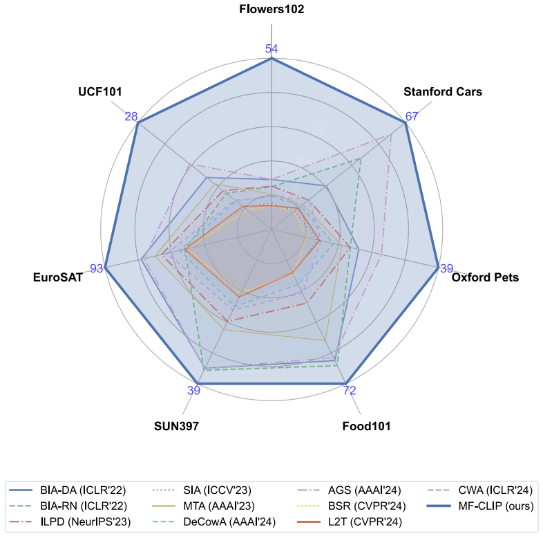

`图 1. 比较 MF-CLIP 与最先进方法在七个数据集上的攻击成功率（ASR）。结果代表了在三个目标模型（EfficientNet-B0、RegNetX-1.6GF 和 ResNet-18）上的平均性能。该可视化展示了 MF-CLIP 在所有数据集上一致且显著的性能优势 。`10个基准方法（BIA-DA等），7个不同的数据集(Flowers102等)，线条越靠外，说明攻击率越高。图中的数字表示： **ASR (Attack Success Rate)**，即**攻击成功率**的百分比数值。具体来说，它是 MF-CLIP 方法在攻击三种不同的目标模型（EfficientNet-B0, RegNetX-1.6GF, ResNet-18）后计算出的**平均分数** 

我们的主要贡献总结如下：

- 我们对**代理模型**在**无盒对抗攻击**中常被忽视的作用进行了系统性调查，为利用接触过多样化数据的**大规模 VLM** 来提高挑战性场景下的**攻击效能**建立了**理论**和**实证基础** 。
- 我们提出了 **MF-CLIP**，这是 CLIP 的一个**基于间隔微调**的版本，它解决了**基础模型**中**类间距离**被压缩这一根本局限性，从而在保留 CLIP 丰富的**表示能力**的同时，增强了用于**特定域对抗攻击**的**判别能力** 。（这里的判别能力是因为CLIP的表示能力强，判别能力弱）
- 我们通过广泛的实验证明了 **MF-CLIP** 在一系列模型、数据集和**防御策略**上优于现有的**攻击方法**，为**对抗设置**中**代理模型微调**的效用提供了新颖的见解，并为**无盒攻击**建立了新的**基准** 。

## 2 Background And Realted Work

### A. Vision-Language Models

​		**自然语言处理**（NLP）领域的最新进展促成了拥有广博知识的大规模模型的诞生。在计算机视觉中，焦点已转移向开发整合视觉和文本信息的多模态大规模模型 。尽管诸如 Qwen 2.5 和 LLaVA 1.5 等一些模型扩展了以 NLP 为中心的模型以支持多模态功能，但它们仍然主要针对文本进行了优化 。相比之下，CLIP [13] 实现了视觉和文本模态之间更平衡的融合，正如其图像编码器在各种 CV 任务中被广泛独立使用所证明的那样 。这突显了 CLIP 作为语言和视觉之间桥梁的有效性 。最近的工作还探索了 **VLMs** 的**对抗鲁棒性**属性，包括对其跨不同模型架构的**迁移性**特征的调查。这些研究为**视觉-语言模型**在**对抗设置**下更广泛的安全影响提供了宝贵的见解 。

### B. Adversarial Attacks: Evolution and Classification

​		对抗攻击最早由 Szegedy 等人识别出，利用了神经网络中的漏洞，通过在输入数据中引入精心设计的扰动，导致模型误分类，同时这些扰动对人类观察者来说保持**不可感知** 。这些攻击可以根据实施策略（**基于查询**与**基于迁移**）和知识假设（**白盒**、**黑盒**和**无盒**）进行广泛分类 。

​		**基于查询的攻击**依赖于来自**目标模型**的迭代反馈来优化**对抗样本**，这需要直接访问模型输出 。相比之下，**基于迁移的攻击**——也是本文的重点——利用**代理模型**生成**对抗样本**，并利用**迁移性**属性在无需查询访问的情况下攻击**目标模型** 。这种方法在现实世界的场景中尤为相关，因为在这些场景中，与**目标模型**的直接交互可能会受到限制或受到监控 。

​		**基于迁移的攻击**的演变可以划分为三个不同的阶段，代表了关于**目标模型**的知识不断递减的连续体 ：

- **白盒设定**：对手拥有对**目标模型**的**架构**、**参数**和**训练数据**的完全访问权限 。这代表了最强的攻击场景，其中对抗样本可以直接针对目标模型进行优化。
- **黑盒设定**：对手无法访问模型的**架构**或**参数**，但保留了关于**训练数据分布**的知识或访问权限 。这一场景受到了广泛的研究关注，已有大量技术被开发出来以增强跨**架构**的**迁移性** 。
- **无盒设定**：由 Li 等人引入，这代表了最具挑战性的场景，其中对手缺乏对模型的**架构**、**参数**以及至关重要的**训练数据**的访问权限 。这一设定模拟了针对**已部署系统**的现实安全威胁，攻击者对**目标模型**掌握的信息极少 。

这三个阶段的演进反映了日益增加的实际相关性，但也反映了日益增长的技术难度，因为知识的每一次减少都显著限制了攻击者制造有效对抗样本的能力。

### C. Adversarial Attack Methodologies

​		对抗攻击领域的最新进展探索了各种设置，从**白盒**到**无盒**场景，每一种都引入了独特的挑战并需要创新的解决方案 。为了解决这些挑战，文献中涌现出了几种独特的方法 ：

- **梯度增强方法**：诸如 MI-FGSM  等技术增强**梯度**以提高对抗有效性 。
- **输入增强策略**：诸如 SIA 、DeCowA 、L2T 和 BSR 等方法应用**输入变换**以提高攻击在模型间的**泛化能力** 。
- **中间层攻击**：这些方法针对**代理模型**中的**中间层**，通常比针对最终层的攻击实现更优越的**迁移性** 。著名的方法包括 ILA 、FIA  和 ILPD 。
- **基于生成器的方法**：**生成器模型**，如 BIA ，被用于直接产生**对抗样本** 。
- **层修改技术**：诸如 AGS 等策略修改**代理模型**内的特定层以提升攻击有效性 。

这些类别代表了一系列创新的方法，旨在解决各种访问设置下对抗攻击不断演变的挑战 。我们提出的方法强调**微调** CLIP 并采用一个**生成器模型**来生成对抗图像 。

## 3 Proposed Method

​		在本节中，我们首先通过概述**威胁模型**和**问题公式化**，建立我们方法的**理论基础**。然后，我们在**对抗攻击**的背景下对 CLIP 的能力和局限性进行详细分析，最终引出我们提出的方法，MF-CLIP 。

### A. Prelimianries

​		`a) 威胁模型`：我们的工作解决了一个实用的**无盒攻击**设定，该设定现实地模拟了针对已部署**机器学习**系统的安全威胁 。在此设定中，对手可以访问一个**代理模型**，但对**目标模型**的**架构**、**参数**或——至关重要的是——其**训练数据分布**没有任何信息 。这代表了与传统**黑盒**设定极其显著的偏离，在传统设定中，通常假设拥有关于目标的**训练分布**的知识或访问权限 。

​		**无盒**设定在**代理模型**和**目标模型**之间造成了巨大的知识鸿沟，使得**对抗样本**的**迁移性**特别具有挑战性 。攻击者必须仅使用**代理模型**作为代理来间接破坏目标，尽管他们可以利用额外的数据（明确保证不与**目标模型**的**训练集**重叠）来增强他们的攻击策略 。该模型代表了现实世界的场景，即攻击者可能以商业部署的系统为目标，而无法访问专有的**训练数据**或模型细节 。

​		`b) 公式化`：我们如下正式定义**无盒攻击**场景：给定一组**原始图像** $x$ 及其对应的**真实标签** $y$，我们的目标是使用预训练的**代理模型** $f$ 来制造**对抗样本** $x^{\prime}$ 。目标是生成在视觉上与 $x$ 无法区分（保留**语义内容**）的 $x^{\prime}$，同时在**目标模型** $g$ 中诱导**误分类**，使得 $g(x^{\prime}) \neq y$ 。

​		`我们专注于无目标攻击`，即目标是导致任何误分类，而不是强制归类为特定的**目标类别** 。此外，我们将**对抗扰动** $\delta = x^{\prime} - x$ 约束为满足 $||\delta||_{\infty} \le \epsilon$，其中 $\epsilon$ 代表**扰动幅度**的预定义界限，确保**对抗样本**在视觉上与**原始图像**保持相似 。

​		对于具有参数 $\theta_{f}$ 的**代理模型** $f$，其目标是最大化其关于**对抗样本** $x^{\prime}$ 的**损失函数** $J(x^{\prime}, y)$ ：（损失函数的值越大，代表模型预测的结果离真实标签 $y$ 越远（即模型越困惑、越容易判错）。）
$$
\arg \max_{x^{\prime}} J(x^{\prime}, y; \theta_{f}), \quad \text{s.t.} \quad ||x^{\prime} - x||_{\infty} \le \epsilon. \tag{1}
$$
​		在保证不被人类肉眼发现的前提下（满足约束 $\epsilon$），找到一张新的图片 $x'$，这张图片能让代理模型 $f$ 产生最大的误判（最大化损失 $J$）。

为了高效地生成这些**对抗样本**，我们采用一个**生成器网络** $G$，其被训练用于产生最大化**代理模型损失**的**扰动** 。随后通过 $x^{\prime} = G(x)$ 获得**对抗样本**，其中`生成器在训练期间隐式地强制执行扰动约束`。

### B. Analysis of CLIP's Representational and Discriminative Capabilities

​		在介绍我们提出的方法之前，我们首先分析 CLIP 的基本属性，以理解其作为**对抗攻击**的**代理模型**的潜力和局限性 。这一分析为我们的方法提供了**理论基础** 。

​		`1) CLIP 架构与训练方法概述`：CLIP（**对比语言-图像预训练**）包含两个并行的**编码器**：一个**图像编码器** $f_{\psi}$ 和一个**文本编码器** $f_{\phi}$ 。**图像编码器** $f_{\psi}$ 将输入图像 $x$ 映射为**稠密嵌入** $f_{\psi}(x) \in \mathbb{R}^{d}$，而**文本编码器** $f_{\phi}$ 将文本描述 $y$ 投影到相同的**嵌入空间** $f_{\phi}(y) \in \mathbb{R}^{d}$ 。

​		CLIP 采用一个**相似度函数** $h(x, y) = sim( f_{\psi}(x), f_{\phi}(y))$ 来衡量视觉和文本表示之间的**对齐**。这种相似度被定义为各自**嵌入**的**归一化点积**（**余弦相似度**）：
$$
h(x, y)=\frac{\langle f_{\psi}(x), f_{\phi}(y)\rangle}{||f_{\psi}(x)|| ||f_{\phi}(y)||}. [cite_start]\tag{2}
$$
​		在训练期间，CLIP 优化一个带有**温度参数** $\tau$ 的**对比损失函数**，该过程在大小为 $N$ 的**小批量**上进行 。该损失函数鼓励匹配的图像-文本对具有高相似度，同时最小化不匹配对之间的相似度 ：
$$
L_{S}=\frac{1}{N}\sum_{i=1}^{N}\left[-log\left(\frac{exp(h(x_{i},y_{i})/\tau)}{\sum_{j=1}^{N}exp(h(x_{j},y_{i})/\tau)}\right)\right] +\frac{1}{N}\sum_{i=1}^{N}\left[-log\left(\frac{exp(h(x_{i},y_{i})/\tau)}{\sum_{j=1}^{N}exp(h(x_{i},y_{j})/\tau)}\right)\right] \tag{3}
$$
​		这可以被重新公式化以突出**相似度**中的**相对差异**：
$$
L_{S}=\frac{1}{N}\sum_{i=1}^{N}log(\sum_{j=1}^{N}exp(\frac{h(x_{j},y_{i})-h(x_{i},y_{i})}{\tau})) +\frac{1}{N}\sum_{i=1}^{N}log(\sum_{j=1}^{N}exp(\frac{h(x_{i},y_{j})-h(x_{i},y_{i})}{\tau})) \tag{4}
$$
​		`2）CLIP特征空间中间隔的理论分析`：**类间间隔**——即**特征空间**中不同类别之间的分离程度——在决定模型的**判别能力**及其在分类任务中的有效性方面起着关键作用。在**对抗攻击**的背景下，类别间具有较小间隔的模型通常更脆弱，因为较小的**扰动**就能跨越**决策边界**。

​		对于机器学习模型，**间隔**量化了**特征空间**内不同类别之间固有的分离程度。它代表了**正样本对**（来自同一类别的样本）与**负样本对**（来自不同类别的样本）之间的相似度差异，间隔通常表示为 $h(x, x^{+}) - h(x, x^{-})$，其中 $h$ 表示**相似度函数**。

​		在 CLIP 的**特征空间**中，对于具有**真实标签** $y$ 和不同标签 $y^{\prime}$ 的图像 $x$，**间隔** $\Delta$ 可以数学公式化为 ：
$$
\begin{aligned}
\Delta &= h(x, y) - h(x, y^{\prime}) \\
&= \frac{1}{2}(2 - ||f_{\psi}(x) - f_{\phi}(y)||^2) - \frac{1}{2}(2 - ||f_{\psi}(x) - f_{\phi}(y^{\prime})||^2) \\
&= \frac{1}{2}(||f_{\psi}(x) - f_{\phi}(y^{\prime})||^2 - ||f_{\psi}(x) - f_{\phi}(y)||^2). \quad (5)
\end{aligned}\tag{5}
$$
​		该公式揭示了 CLIP 的**对比损失**隐式地优化了类别之间的**间隔** 。通过将方程 (4) 重写为**特征空间**中的**欧几里得距离**形式 ：
$$
\begin{aligned}
L_{S} &= \frac{1}{2N}\sum_{i=1}^{N} \log \left( \sum_{j=1}^{N} \exp \left( \frac{||f_{\psi}(x_{i})-f_{\phi}(y_{i})||^{2}-||f_{\psi}(x_{j})-f_{\phi}(y_{i})||^{2}}{\tau} \right) \right) \\
&\quad + \frac{1}{2N}\sum_{i=1}^{N} \log \left( \sum_{j=1}^{N} \exp \left( \frac{||f_{\psi}(x_{i})-f_{\phi}(y_{i})||^{2}-||f_{\psi}(x_{i})-f_{\phi}(y_{j})||^{2}}{\tau} \right) \right). 
\end{aligned}\tag{6}
$$
​		从这一重新公式化中可以明显看出，`CLIP 的训练目标本质上旨在最大化其特征空间中类别之间的间隔` 。然而，我们的分析揭示了一个关键的局限性：虽然 CLIP 在其包含 4 亿个图像-文本对的整个**训练分布**上优化了**间隔**，但由于其训练的**通用性质**，对于特定的**下游域**，由此产生的**间隔**可能是**次优的** 。

​		`3）通过特征空间可视化的实证分析`：为了用实证证据补充我们的理论分析，我们使用 t-SNE 可视化了 CLIP 的特征空间，如图 2 所示。

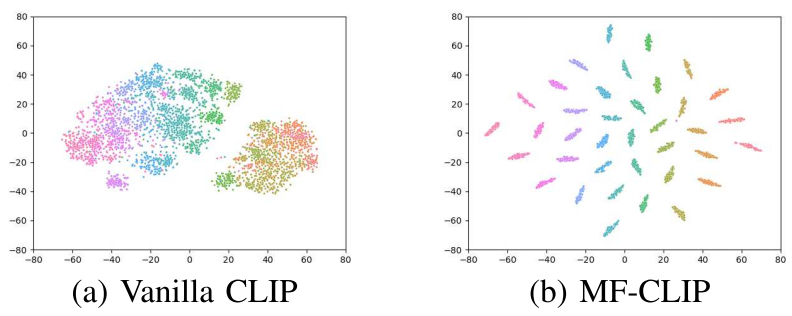

`图 2. 在 37 个类别的 OxfordPet 数据集上，(a) 原版 CLIP 和 (b) MF-CLIP 的 t-SNE 可视化结果。`

​		聚焦于 37 个类别的 OxfordPet 数据集，我们的可视化揭示了两个关键见解：

​		**a) 强大的表示能力**：CLIP 的**嵌入**自然地组织成对应于猫和狗的两个明显的高层级**簇**，证明了模型在无需**微调**的情况下捕捉广泛**语义关系**的能力。这证实了 CLIP 卓越的**表示能力**，使其能够有效地建模多样的视觉概念。

​		**b) 有限的判别能力**：尽管成功分离了高层级类别，CLIP 在每个**簇**内的相邻**细粒度类别**（特定品种）之间表现出狭窄的**间隔**。这种被压缩的**类间间距**揭示了 CLIP 在**细粒度分类任务**的**判别能力**方面存在的一个关键局限性。

​		这一可视化证实了我们的理论假设：虽然由于其多样化的训练，CLIP 在表示广泛的**语义关系**方面表现出色，但它缺乏特定**下游任务**所需的**细粒度判别能力**。在**对抗攻击**的背景下，这一局限性尤其成问题，因为有效的攻击需要利用类别之间**精确的决策边界**——当**类间间隔**被压缩时，这些边界定义得很差。

​		特定**域**内不足的**判别能力**代表了 CLIP 作为**无盒对抗攻击**的**代理模型**有效性的一个根本障碍。这一发现激发了我们提出的方法：通过有针对性的**微调**来增强 CLIP 的**判别能力**，同时保留其丰富的**表示能力** 。

​		`4) 增强跨模型攻击迁移性的理论机制`：我们的综合分析建立了 MF-CLIP 优越的跨模型攻击迁移性背后的基本理论机制，填补了在理解代理模型优化如何增强跨不同架构的**对抗迁移性**方面的一个关键空白 。

​		**a) 间隔-迁移性关系**：核心原则在于**类间间隔**与**对抗迁移性**之间的关系 。在对抗机器学习中，神经网络的脆弱性源于**对抗子空间**的存在——输入空间中微小的**扰动**即可导致**误分类**的区域 。这些子空间从根本上由**特征空间**中**决策边界**的几何形状决定 。当**代理模型**具有更大的**类间间隔**时，它自然能识别出更稳健且更具**泛化性**的对抗方向，这些方向利用了跨不同模型架构共享的共同几何脆弱性 。

​		**b) 跨架构泛化**：通过基于间隔的**微调**显式扩大**类间间隔**，MF-CLIP 创建了更显著且稳定的**决策边界**，这些边界在不同模型架构间具有更好的**泛化性** 。在数学上，这可以通过以下原则来理解：**特征空间**中更大的**间隔**对应于具有优越**泛化属性**的更简单、更稳健的决策函数 。当应用于**对抗迁移性**时，这意味着使用高**间隔** **代理模型**制作的**对抗扰动**更有可能利用根本性的、**架构无关的脆弱性**，而不是**模型特定**的**伪影** 。

 		**c) 稳健扰动生成**：代理模型特征空间中更大的**间隔**导致了更稳健的**对抗扰动**，这些扰动能够成功利用多样化**目标模型**中的相似脆弱性 。这是因为**间隔**增强的**特征空间**更好地捕捉了底层的**数据流形结构**，使得生成的**扰动**能够以符合问题域基本几何属性的方式将样本移动跨越**决策边界**，从而根本性地增强了跨模型攻击的**迁移性** 。

### C. MF-CLIP: Enhancing CLIP's Discriminative Capabilities

​		基于我们的理论和**实证分析**，我们提出了**基于间隔微调的 CLIP**（MF-CLIP），这是一种新颖的方法，旨在通过专门解决其有限的**判别能力**，来增强 CLIP 作为**无盒对抗攻击**的**代理模型**的有效性 。

​		驱动我们方法的关键**洞察**是，虽然 CLIP 由于在多样化数据上的训练而拥有卓越的**表示能力**，但其在**特定域**内的**判别力**——这对于生成有效的**对抗样本**至关重要——需要增强 。MF-CLIP 通过一个针对性的**微调过程**实现了这一点，该过程`显式优化类间间隔`，同时保留 CLIP 丰富的**表示能力** 。

​		图 3 展示了我们为 MF-CLIP 提出的两阶段**流水线** 。在第一阶段，我们通过**感知间隔的微调**来增强 CLIP 的**判别能力** 。在第二阶段，我们利用增强后的模型作为**代理**来生成**可迁移的对抗样本** 。

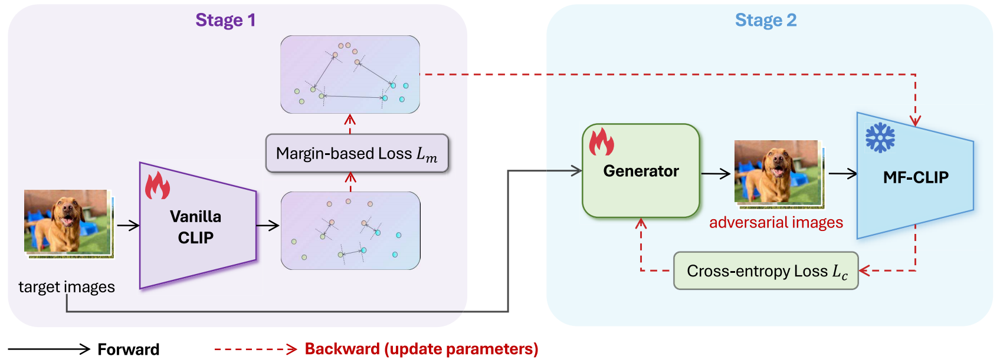

`图 3. 提出的 MF-CLIP 框架。我们的方法包含两个主要阶段：(1) 感知间隔的微调，它通过优化类间间隔来增强 CLIP 的判别能力，同时保留其表示能力；以及 (2) 对抗样本生成，其中微调后的模型作为代理以生成具有高度迁移性的对抗样本。在图中，黑色实线代表前向过程，而红色虚线表示反向过程（参数更新）。`

​		`1) 第一阶段：感知间隔的微调：`在第一阶段，我们利用 CLIP 作为具有参数 $\theta$ 的特征提取器 $f_{\theta}$，从输入图像 $x$ 中提取 $d$ 维嵌入。为了增强其判别能力，我们在 CLIP 上增加了一个监督头 $h$（实现为一个全连接网络），并使用基于间隔的损失函数对整个模型进行微调。

​		具体而言，我们采用了**加性角度间隔损失**（Additive Angular Margin Loss），这是一种增强**嵌入空间**中**类间可分性**的最先进方法：
$$
L_{m} = - \log \frac{e^{f_{\theta}(x_{i})(\cos(\alpha_{y_{i}}+m))}}{e^{f_{\theta}(x_{i})(\cos(\alpha_{y_{i}}+m))} + \sum_{j=1, j \neq y_{i}}^{n} e^{f_{\theta}(x_{i}) \cos \alpha_{j}}} \tag{7}
$$
​		其中 $h$ 由权重 $W$ 和偏置 $b$（设为 0）进行参数化。在此，$W_j$ 表示 $W$ 的第 $j$ 列，$f_{\theta}(x_i)$ 代表来自第 $y_i$ 类的第 $i$ 张图像的**嵌入**，而 $n$ 表示**目标数据集**中的类别总数。

​		当 $b = 0$ 时，**Logit** 可以表示为 $W^T_j f_{\theta}(x_i) = ||W_j|| ||f_{\theta}(x_i)|| \cos \alpha_j$，其中 $\alpha_j$ 代表权重向量 $W_j$ 和特征向量 $f_{\theta}(x_i)$ 之间的**夹角**。**间隔惩罚** $m$ 显式地增加了类别间的**角度分离度**，从而增强了模型的**判别能力**。

​		至关重要的是，为了遵守**无盒设定**的约束，我们使用专门为攻击选择的图像 $x$ 进行微调，并保证这些图像与**目标模型**的训练集**没有重叠**。这确保了我们的方法在攻击者无法访问**目标模型**训练数据的现实场景中依然适用。

​		`2) 第二阶段：对抗样本生成：`在第二阶段，我们采用微调后的 CLIP 模型 $\hat{f}_{\theta}$ 作为代理来生成对抗样本。我们不是通过迭代方法直接优化扰动，而是训练一个生成器网络 $G$ 来高效地产生对抗样本。

​		**生成器** $G$ 基于 **U-Net 架构**，结合了带有**跳跃连接**和**残差块**的**下采样**与**上采样**层。这种设计允许**生成器**在学习复杂的**扰动模式**的同时，保持输入图像的**空间结构**。**生成器**被训练用于在微调后的**代理模型**中诱导**误分类**：
$$
L_{c} = -C(F(G(x)), y), \quad \text{s.t.} \quad ||G(x)-x||_{\infty} \le \epsilon, \tag{8}
$$
其中 $C$ 表示**交叉熵损失**，而 $F = \hat{f}_{\theta} \circ h$ 代表微调后的**特征提取器**和**监督头**组成的**复合网络**。约束条件 $||G(x)-x||_{\infty} \le \epsilon$ 确保**扰动**保持在界限内，保留原始图像和**对抗图像**之间的**视觉相似度**。

​		通过将感知间隔的微调与高效的对抗样本生成相结合，MF-CLIP 解决了使用原版 CLIP 作为无盒攻击代理模型的根本局限性。基于间隔的微调增强了 CLIP 在目标域中的判别能力，创造了更显著的决策边界，这些边界可以被有效地利用来生成可迁移的对抗样本。同时，生成器网络高效地学习产生结构化的扰动，从而最大化成功迁移到未知目标模型的可能性。

## 4 Experiments

​		本节介绍了对我们所提出方法的全面实验评估。我们首先描述我们的**实验设置**，然后通过在**标准模型**和**对抗训练模型**上与**最先进方法**进行广泛比较，展示 MF-CLIP 的有效性，随后进行详细分析。

### A Experimental Settings

​		`1) 数据集与模型`：我们在七个多样化的高分辨率**视觉数据集**上进行了实验：OxfordPets 、Flowers102 、StanfordCars 、Food101、SUN397、EuroSAT 和 UCF101 。对于**目标模型**，我们采用了 ResNet-18 、EfficientNet-B0 和 RegNetX-1.6GF 。

​		`2) 实现细节`：我们使用 **SGD 优化器**对 CLIP 进行微调，**批量大小**为 128，初始**学习率**为 0.01，并在 300 个 **Epoch** 内遵循**余弦退火调度**。生成器使用 **AdamW 优化器**训练，批量大小为 64，初始学习率为 0.0001，训练 90 个 Epoch，同样采用余弦退火。我们将**间隔参数**设为 $m = 0.15$，并将 **$\ell_{\infty}$ 范数扰动**限制为 $\epsilon = 16/255$。除非另有说明，否则使用测试集图像作为目标图像。所有实验均在配备 8 个 NVIDIA A800 GPU 的服务器上进行。我们指出这并非最低要求，所提出的方法可以在更易获取的硬件（如单个 NVIDIA 3090 GPU）上有效实施，详见我们的计算效率分析（第 IV-D1 节）。

​		`3) 基准与评估指标`：我们将本方法与最先进的方法进行了比较，包括 AGS [30]、BSR [23]、CWA [43]、ILPD [28]、L2T [22]、MTA [44] 和 SIA [24]，这些方法均使用 TransferAttack 实现。我们还包含了使用官方权重的 BIA [29]。除 CWA（ResNet-50/34 集成）和 MTA（ResNet-MTA-18）外，所有方法均使用 ResNet-50 作为代理骨干网络。性能通过攻击成功率 (ASR) 来衡量，定义为：
$$
ASR = Acc_{clean} - Acc_{adv} \tag{9}
$$
其中 $Acc_{clean}$ 是清洁图像上的准确率，$Acc_{adv}$ 是对抗样本上的准确率。值得注意的是，一些研究将 ASR 定义为 $1 - Acc_{adv}$，这可能会导致报告的数值偏高。我们选择我们的定义，旨在通过显式展示准确率下降来提供攻击影响的直接衡量。

### B Evaluations on Normal Models

​		**表 I** 展示了跨越所有**数据集**和**目标模型**的综合结果。用 $\uparrow$ 标记的行代表了我们的方法在每个**场景**下相对于表现最好的**基准方法**的提升幅度。值得注意的是，该行中的所有数值均为正数，表明 **MF-CLIP** 在所有测试条件下均一致地优于现有方法。在**定量**上，MF-CLIP 在 **EfficientNet-B0**、**RegNetX-1.6GF** 和 **ResNet-18** 上分别比最佳基准实现了 $11.91\%$、$17.60\%$ 和 $16.18\%$ 的平均提升。这些显著的幅度证明了我们的方法在解决**无盒攻击**挑战方面的有效性。

`表 1：我们的方法与最先进方法在各种数据集和目标模型上的 ASR 性能比较。数值越高表示性能越好。`$\uparrow$ 行显示了我们的方法相对于每个数据集和目标模型的最佳基准的提升。Average 表示每种方法在所有数据集上的平均性能。最佳结果以粗体高亮显示。

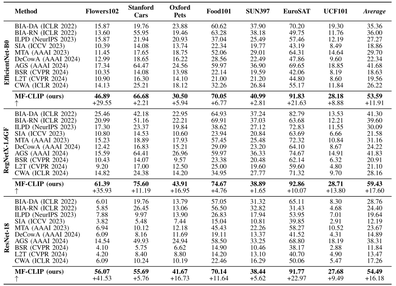

### C Evaluaitons on Adversarially Trained Models

​		我们要进一步针对使用 **$\epsilon$-半径** 的 **PGD-10** [19] 进行**对抗训练**的模型评估所有方法。如**表 II** 所示，某些**基准方法**产生了**负的 ASR 值**，这表明**对抗准确率**竟然超过了**鲁棒模型**的**清洁准确率**。这一结果符合**对抗训练**中已知的**权衡**，即**鲁棒性**的增加通常导致**清洁准确率**的降低 ，从而凸显了这些攻击方法的相对局限性。值得注意的是，即使面对这些**目标模型**增强的**鲁棒性**，**MF-CLIP** 在所有场景下仍实现了持续的**正向增益**，在 **EfficientNet-B0**、**RegNetX-1.6GF** 和 **ResNet-18** 上分别以 **10.20%**、**10.35%** 和 **8.03%** 的幅度优于最强的**基准方法**。这些持续的增益证明了我们的方法即使对抗经过**对抗加固**的目标也具有**鲁棒性**。

`表 2：我们的方法与最先进方法在 PGD-10 对抗训练的目标模型上的 ASR 性能比较。负值表示对抗准确率超过了对抗训练模型的清洁准确率。Average 表示每种方法在所有数据集上的平均性能。最佳结果以粗体高亮显示。`

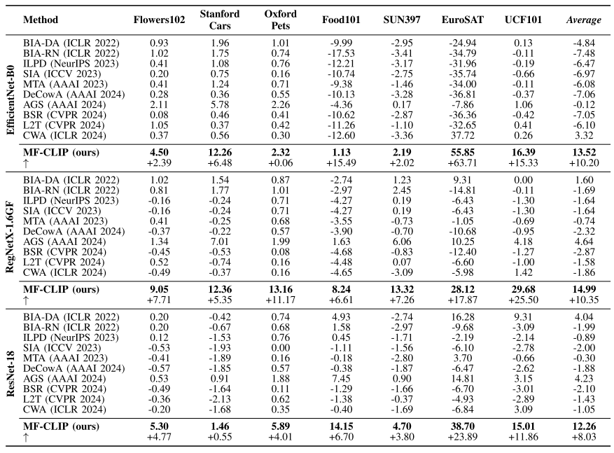

### D Analysis

​		`1) 计算效率`：如图 4 所示，我们在两种批量大小设置下评估 MF-CLIP 在内存和时间成本方面的效率。在批量大小 1 时，MF-CLIP 展示了极小的内存需求（1,221 MB）和低时间成本（3,449 秒），显著优于像 DeCowA 和 L2T 这样的方法，它们消耗高达 8,736 MB 的内存和 310,588 秒。在批量大小 128 时，MF-CLIP 保持了高效的扩展性，具有适度的内存使用（8,449 MB）和计算时间（约 65 秒），超过了大多数基准。值得注意的是，在单次推理场景（批量大小=1）中，MF-CLIP 在时间和内存效率上都达到了近乎最优的性能。当在批量大小 128 下运行时，虽然 MF-CLIP 的内存消耗略高于 BIA，但其卓越的攻击性能足以弥补这一边际开销。这种有利的效率概况源于 MF-CLIP 精简的架构，使其特别适用于可扩展的、资源高效的应用。

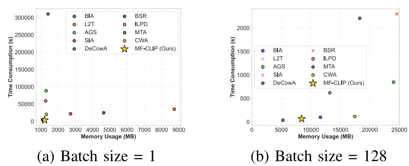

`图 4：计算效率比较。不同批量大小下的时间消耗与内存使用对比。符号（通常指图中的特定标记，如叉号）表示内存溢出(OOM)失败。`

​		`2) 感知质量评估`：对抗攻击评估中的一个重要考量是生成的扰动的感知质量，因为不可感知性仍然是实用对抗样本的一个基本要求。我们使用两种互补的感知指标进行系统的定量分析：结构相似性指数测度 (SSIM) [46] 和学习感知图像块相似度 (LPIPS) [47]。SSIM 基于亮度、对比度和结构信息量化原始图像与扰动图像之间的结构相似性，而 LPIPS 利用深度神经网络特征以一种更符合人类视觉感知的方式来测量感知距离。

​		图 5 揭示了不同**方法学范式**之间清晰的性能分层。**基于生成器**的方法，包括 MF-CLIP 和 BIA 变体，在两个**感知指标**上均一致优于**基于优化**的方法。MF-CLIP 获得了最高的 **SSIM** 分数，证明了优越的**结构保留**能力，而 BIA 变体在 **LPIPS** 评估中表现出色。相比之下，**基于梯度**和**输入增强**的方法在两个指标上都表现出明显较低的**感知质量**。

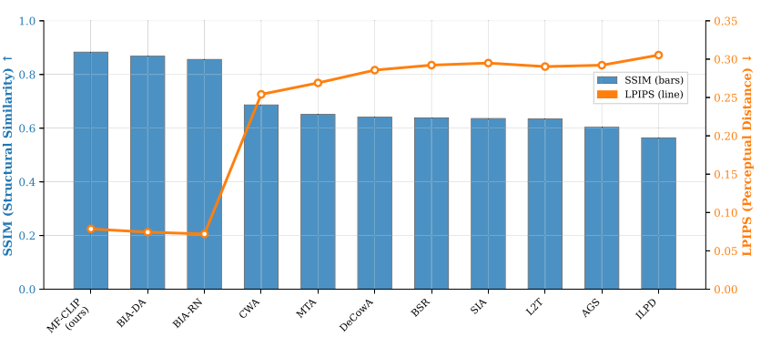

`图 5. 使用 SSIM 和 LPIPS 指标的定量感知质量评估。SSIM 值（柱状图）衡量结构相似性保留（数值越高表示质量越好），而 LPIPS 值（折线图）评估感知距离（数值越低表示质量越好）。`

​		MF-CLIP 展示了**基于生成器**范式内的**最佳平衡**，在保持具有竞争力的**感知距离**的同时实现了最高的**结构相似度**。这一结果，结合我们优越的**攻击成功率**，验证了**基于间隔的微调**在生成既有效又**不可感知**的**对抗样本**方面的实际有效性。

### E. Extend Evalutaion

​		`1) 增强基准比较`：为了进一步验证我们方法的有效性，使其超越代理模型选择的范畴，我们进行了一个额外的实验，我们将基准方法中的代理模型替换为使用**交叉熵损失**进行**监督学习**微调后的 CLIP（针对那些支持修改代理模型的基准方法）。该实验旨在将我们的**基于间隔的微调**方法的影响与使用 CLIP 作为代理模型的一般益处**隔离**开来。

​		如**表 III** 所示，即使基准方法受益于使用微调后的 CLIP 作为其代理模型，MF-CLIP 仍然在所有数据集和目标模型上以大幅度**优势**一致地优于所有竞争对手。具体而言，在 **EfficientNet** 目标模型上，与表现最好的增强基准相比，MF-CLIP 在 **Flowers102** 上实现了 **33.09%** 的提升。在 **RegNetX** 和 **ResNet-18** 目标模型上也观察到了类似的模式。

`表 3 MF-CLIP 与基准方法之间的比较，其中代理模型被替换为微调后的 CLIP（当基准方法支持此类修改时）。尽管这些增强的基准受益于更好的代理模型，我们的方法仍然在所有数据集和目标模型上一致地实现了优越的性能。`

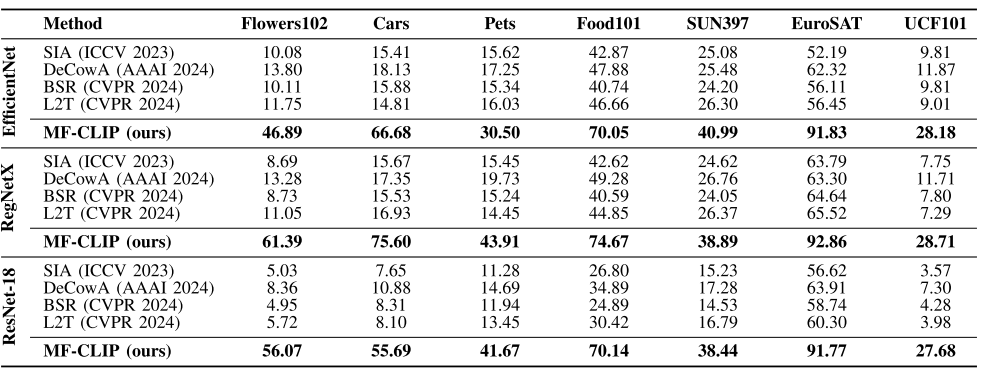

​		这些结果结论性地证明，MF-CLIP 的优越性能不仅仅源于使用 CLIP，而是具体源于我们的**基于间隔的微调**方法，该方法有效地增强了 CLIP 用于**对抗迁移性**的**判别能力**。这一发现支持了我们的理论分析，即**特征空间**中的**间隔**在决定模型作为对抗攻击**代理**的有效性方面起着关键作用。

​		`2) 大规模和跨架构评估`：为了证明在更大数据集和像 **Vision Transformers** 这样的更新架构中的有效性，我们在 **ImageNet-1K 验证集**上进行了额外实验。如**表 IV** 所示，我们在四种**目标架构**上针对**基准方法**评估了 MF-CLIP：EfficientNet-B0、RegNetX-1.6GF、ResNet-18，以及重要的是，**ViT-B/16**。

`表 4 在包含 VISION TRANSFORMERS 的不同架构上的 IMAGENET 验证集上的无盒攻击性能。所有方法使用 RESNET-50 骨干网络作为代理模型。结果显示 MF-CLIP 持续以大幅度优于基准，特别是针对 VISION TRANSFORMERS。`

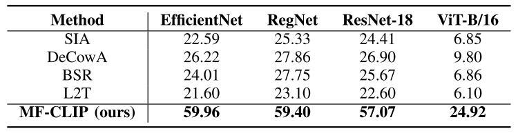

​		结果表明，MF-CLIP 在所有架构上都大幅优于所有**基准方法**。在 ImageNet 上，我们的方法针对 EfficientNet、RegNetX 和 ResNet-18 分别实现了 **59.96%**、**59.40%** 和 **57.07%** 的**攻击成功率**。这证实了我们的方法在大规模、多样化的数据集上保持了其有效性。

​		这些发现结论性地证明，MF-CLIP 的有效性超越了先前工作中评估的有限数据集和架构，确立了其在跨大规模**自然图像数据集**和现代**神经网络架构**中的实用性。

​		`3) 真实世界案例研究：`为了验证**实际适用性**，我们针对部署在百度 **PaddlePaddle** 平台上的模型测试了 MF-CLIP 的**对抗样本**，这是一个在**车牌识别**和**自动驾驶系统**等**生产环境**中广泛使用的**商业框架**。

​		如图 6 所示，我们使用 MF-CLIP 生成了**对抗样本**，并针对在该平台上训练的花卉分类模型进行了测试。所有四个**对抗样本**都成功诱导了具有高**置信度分数**（在大多数情况下超过 **87%**）的**误分类**，同时对人类观察者保持了**视觉上的不可感知性**。

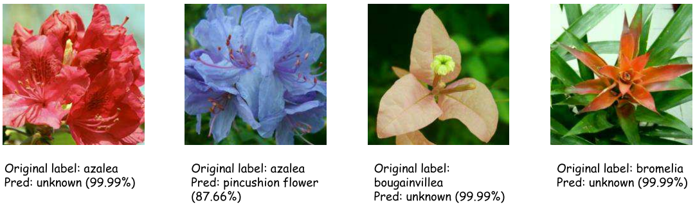

`图 6. MF-CLIP 针对工业级系统有效性的演示。由我们方法生成的对抗样本成功欺骗了百度 PaddlePaddle 平台上的花卉分类模型。`

​		这种在商业平台上的验证展示了超越**学术基准**的实际**安全隐患**，证实了 MF-CLIP 的方法利用的是**深度神经网络**中的**基本脆弱性**，而不是**架构特定**的弱点。结果突显了在**生产系统**中开发针对**无盒攻击**的**鲁棒防御**的重要性。

### F. Ablation Studies

​		`1) 代理模型选择`：我们进行了全面的分析实验来评估**原版 CLIP** 在**无盒设置**下作为**代理模型**的适用性。**图 7** 展示了关于跨多个**目标数据集**和架构比较具有 **ResNet-50 骨干**的不同代理模型的关键分析。结果揭示了一个令人惊讶且**反直觉**的现象：尽管 CLIP 在多样化数据上进行了广泛的预训练，但原版 CLIP 在作为**代理**使用时不仅未能超越 **ImageNet 模型**，反而在生成**可迁移对抗样本**方面表现更差。

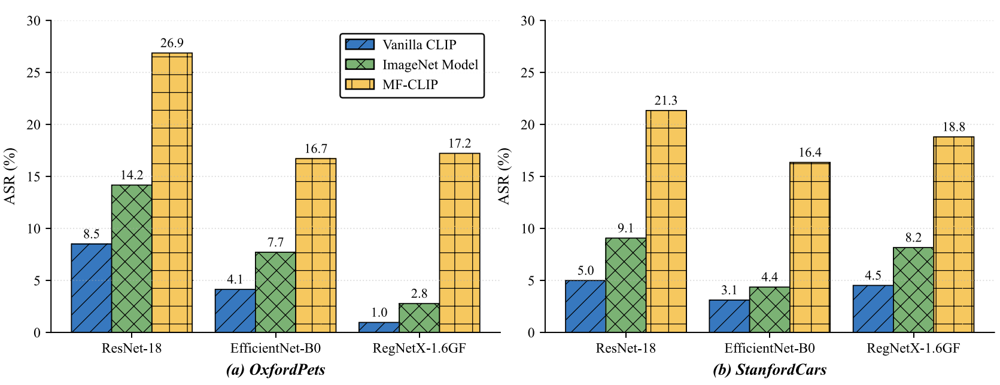

`图 7. 关于比较具有 ResNet-50 骨干的不同代理模型的分析。结果清楚地证明，未经改进的 CLIP 甚至比 ImageNet 模型表现更差，而 MF-CLIP 显著优于两者。`

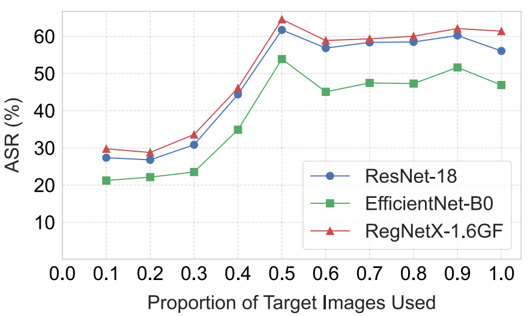

`图 8. 在 Flowers102 数据集上，ASR 对比用于微调的目标图像比例`

​		这些结果提供了强有力的**实证证据**，支持我们关于 CLIP 在**特定域**内有限**判别能力**的理论分析。它们强调，虽然 CLIP 拥有优越的**表示能力**，但这本身对于有效的**对抗迁移性**来说是不够的。最重要的是，MF-CLIP 相对于原版 CLIP 和 ImageNet 模型实现的显著性能提升（如**图 7** 所示）证明了我们**基于间隔的微调**方法在解决这一局限性方面的有效性，验证了我们方法的核心贡献。

​		`2) 微调数据量的影响`：为了调查 MF-CLIP 对可用于微调的目标图像数量的敏感性，我们在 Flowers102 数据集上使用不同比例（10% 到 100%）的测试集进行了实验。

​		`3) 间隔参数分析`：方程 (7) 中的**间隔参数** $m$ 控制着**嵌入空间**中类别表示之间的**角度分离**，关键性地影响着**攻击迁移性**。为了刻画这种依赖关系，我们在三种不同的**目标架构**上评估了 $m \in [0, 0.5]$。

​		**图 9** 揭示了**间隔大小**与**攻击成功率**之间一致的**非单调关系**。虽然**标准 Softmax 训练** ($m = 0$) 产生的性能**次优**，但引入**显式间隔约束**大幅增强了**迁移性**，最佳性能出现在 $m \in [0.05, 0.2]$ 范围内。然而，当 $m > 0.2$ 时的性能下降表明，过度的**间隔强制**损害了**特征学习**，反映了**判别能力**与**表示能力**之间的**权衡** [48]。当**间隔**变得过于限制性时，模型捕捉对于**鲁棒特征提取**至关重要的**类内变化**的能力就会受损。

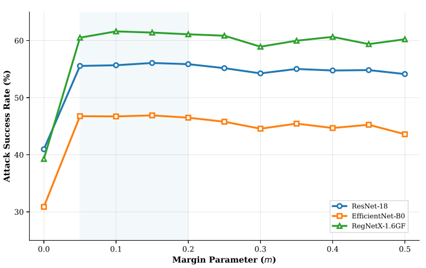

`图 9. 在 Flowers102 数据集上，跨三种目标架构对间隔参数 m​ 的敏感性分析。阴影区域高亮显示了最佳间隔范围` ($m \in [0.05, 0.2]$)，`对于更小和更大的值，性能均出现下降。`

​		跨多样化架构的一致**最佳范围**验证了我们**基于间隔的方法**的**稳定性**，同时也为**超参数选择**提供了实用指南。这些发现证实，**适度的间隔约束**有效地增强了**类间可分性**，而不会损害模型学习**可泛化表示**的能力。

​		`4) 生成器架构设计`：为了验证我们**生成器网络**的架构设计选择，我们进行了系统的**消融研究**，检查不同网络配置对**对抗迁移性**的影响。我们通过修改单个组件评估了七种**架构变体**。

​		**表 V** 中的实验结果揭示了一个显著的发现：我们的方法对**生成器架构**选择表现出**鲁棒的不敏感性**。尽管模型复杂度存在显著变化，范围从 **0.45M** 到 **7.04M** 参数（**15倍**差异）和 **2.31G** 到 **33.84G FLOPs**（**14倍**差异）——**攻击成功率**保持显著稳定，仅跨越 **0.42%**，从 **54.50%** 到 **54.92%**。

`表 5 针对生成器架构变体的综合消融研究结果，按参数数量排序。实验在 Flowers102 数据集上进行，攻击成功率为跨所有目标模型的平均值。`

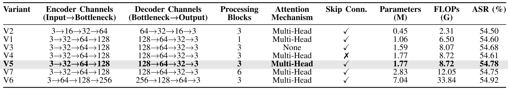

​		这种**架构鲁棒性**表明，MF-CLIP 的有效性主要源于**代理模型**的**基于间隔的微调**，而不是复杂的**生成器设计**。跨多样化配置的一致性能表明，一旦 CLIP 的**判别能力**通过我们的微调方法得到增强，相对简单的生成器架构就足以产生有效的**对抗扰动**。这些发现具有重要的**实际意义**，证明从业者可以根据**计算约束**而不是性能考虑来选择生成器配置，从而在保持攻击有效性的同时，实现跨多样化**资源环境**的灵活部署。

## 5 Conclusion And Discussion

​		我们提出了 **MF-CLIP**，一种**基于间隔的微调**方法，它增强了 CLIP 作为**无盒对抗攻击\**\**代理模型**的有效性。我们的分析揭示了 CLIP 在**判别能力**方面的局限性，这也是我们的方法直接解决的问题。跨越多样化数据集、目标模型和**真实世界设置**的实验证明，MF-CLIP 一致地优于**最先进的技术**，特别是在较低的**扰动预算**下。

​		我们的发现揭示，提高**代理模型**的**判别能力**比仅关注**攻击算法**更有效。MF-CLIP 实现了显著的**跨数据集泛化能力**，针对**对抗训练模型**、**Vision Transformers** 和**商业 API 系统**保持了有效性。这些结果提供了关于神经网络中**表示能力**、**判别能力**和**可迁移性**之间关系的见解。

## 术语解释

$l_{\infty}$-`norm Constraint`  $l_{\infty}$ 范数约束，数学符号 $||\delta||_{\infty}$，表示向量（这里指图像像素的扰动）中绝对值最大的那个元素的大小。在图像攻击中，这限制了任何一个像素点的颜色变化不能超过某个阈值 $\epsilon$。

​		*通俗理解*：**“最高限价”**。为了让人眼看不出来改过图，规定每个像素点的颜色只能微调一点点（比如 RGB 值最多加减 16），不能出现某个点突然变成大红大绿的情况。

`Adversarial Subspaces` 对抗子空间，高维输入空间中的特定区域，在这些区域内，数据点非常容易受到微小变化的影响而导致模型分类错误。

`Model-specific Artifacts` 模型特定的伪影，仅在特定模型训练过程中产生的、无法迁移到其他模型的非鲁棒特征或噪声模式。

​		*通俗理解*：**“死记硬背的偏门”**。某个模型可能错误地认为“图片左上角有个白点就是猫”。攻击者如果只针对这个白点攻击，换个模型（不看白点的）就没用了。这正是普通代理模型容易犯的错。

`t-Distributed Stochastic Neighbor Embedding` t-SNE,一种非线性降维算法，特别适用于将高维数据（如 CLIP 输出的 512 维向量）映射到二维或三维平面进行可视化。

​		*通俗理解*：**“高维地图绘制师”**。想象一下要把地球仪（3D）压平变成地图（2D）还能保持国家之间的邻里关系大致不变。t-SNE 就是把高维复杂的特征关系压扁画在一张纸上，让我们能直观看到哪些图片“住得近”（属于同一类）。

`Cosine Similarity`  余弦相似度，通过计算两个向量的夹角余弦值来评估它们的相似度。其值在 -1 到 1 之间，1 表示方向完全相同（最相似），0 表示正交（无关），-1 表示方向相反。

​		*通俗理解*：**“方向感”**。不管向量的长短（模长），只看它们指的方向是不是一致。方向越一致，相似度越高。

`Contrastive Loss Function` 对比损失函数，一种用于自监督学习的损失函数，旨在缩小正样本对（匹配的图文）在特征空间中的距离，同时拉大负样本对（不匹配的图文）之间的距离。

​		*通俗理解*：**“磁铁效应”**。把原本应该是一对儿的（图和对应的字）像磁铁一样吸在一起，把不相关的强行排斥推开。

`Embedding Space`  嵌入空间，一个数学向量空间，不同的数据模态（如图像和文本）被映射到这个空间中，以便计算它们之间的相似度（距离）。计算机看不懂图片（像素阵列），也听不懂话（文本字符）。它只懂数字列表（向量）。**嵌入空间**就是一个高维的数学空间，模型把所有的图片和文字都**“翻译”**成这个空间里的**“坐标点”**。

​		*通俗理解*：**原始数据**：一张 $256 \times 256$ 的图片（数据量巨大，全是像素）。

**嵌入过程**：模型（编码器）提取图片的核心特征，把它压缩成一串精简的数字（比如 512 个数字）。

**嵌入空间**：这就好比一个有 512 个坐标轴（512维）的巨大空间。那张图片现在只是这个空间里的**一个点** 。三维坐标轴的一个点要用三个数字进行描述。

在这个特征空间里，位置就是语义：

**近邻原则**：

- 一张“哈士奇”的照片和一张“金毛”的照片，在这个空间里的坐标应该靠得**很近**（因为它们都是狗）。
- 一张“哈士奇”的照片和一句文字描述“a photo of a dog”，在这个空间里也应该靠得**很近**（图文匹配）。

**远离原则**：

- “哈士奇”的照片和“飞机”的照片，在这个空间里应该隔得**非常远** 。

对于 CLIP 来说，嵌入空间是**视觉和语言的“汇合点”**。

**双重入口**：

- CLIP 有两个编码器：图像编码器 $f_{\psi}$ 和 文本编码器 $f_{\phi}$。
- 它们把截然不同的两种数据（图和文），都映射到**同一个** $d$ 维的嵌入空间里 $\mathbb{R}^d$ 。

**作用**：这就解释了为什么 CLIP 能做分类。它并不是真的“认出”了物体，它只是算出图片的坐标点离“狗”这个单词的坐标点更近，离“猫”的坐标点更远。

总结：**嵌入空间**就是模型用来**存储和理解“语义”的高维地图**

​	

`Downstream Domains` 下游域，在预训练-微调范式中，指将通用的预训练模型应用到的具体应用场景或特定数据集（例如：预训练模型是在互联网数据上训练的，下游域可能是“识别某种特定的花”或“医学影像诊断”）。

​		*通俗理解*：**“具体工作岗位”**。CLIP 就像在大学里接受了通识教育（预训练），但这并不意味着它直接就能胜任“修飞机”或“做手术”这些具体的专业工作（下游域）。

 

`Dense Embeddings ` 稠密嵌入，一种高维向量表示，其中大部分元素都是非零值，能够以紧凑的形式存储丰富的信息。

​		*通俗理解*：**“浓缩的精华”**。不是用一堆零散的关键词（稀疏）来描述图片，而是用一串密集的数字密码，把图片里的颜色、形状、纹理等所有信息都压缩进去。

`Vision-Language Models, VLMs` , 视觉语言模型，能够同时处理和理解图像与文本信息，并学习两者之间关联的深度学习模型（如 CLIP）。

`Transfer across model boundaries` 跨越模型边界的有效性，指这些生成的“非鲁棒特征”不是某个模型独有的 bug，而是所有神经网络（CNN, ViT 等）**共有**的认知缺陷。

`Model Artifacts`  模型伪影，模型在训练过程中学到的**非本质的、错误的、或者是特定于该架构的“捷径特征”** 。

​		**通俗理解：AI 的“怪癖”或“坏习惯”**

- **场景**：老师让学生分辨“狼”和“哈士奇”。
- **本质特征（鲁棒特征）**：狼的眼神凶狠、吻部更长、尾巴下垂。（这是所有人都认可的真理）。
- **伪影（非鲁棒特征/捷径）**：
  - 模型发现训练集里所有的**狼**都是在**雪地**里拍的，所有的**哈士奇**都是在**草地**里拍的。
  - 于是模型学到了一个“伪影”：**“只要背景是白色的（雪），那就是狼。”**
- **后果**：
  - 这个规律在这个特定的模型里是管用的（准确率很高）。
  - 但是换一个模型（比如见过草地上的狼的模型），这个规律就失效了。

**在对抗攻击中的意义**：

- **利用伪影攻击**：如果你的攻击只是把草地P成雪地（针对伪影），你只能骗过第一个傻模型，骗不过第二个聪明的模型。**这就是为什么利用伪影的攻击迁移性差。**
- **MF-CLIP 的作用**：它强迫模型通过“大间隔”忘掉这些投机取巧的伪影，去学习真正的特征。攻击这种模型，就必须破坏本质特征（比如真的去修改吻部的形状），这种攻击对谁都有效。

`Data Manifold Structure`  数据流形结构，虽然图像数据在高维空间（例如一张 $256 \times 256$ 的图片有 65536 个维度）中表示，但真正有意义的、看起来像真实图片的样本，其实只分布在一个非常低维的“曲面”上 。（为什么是65536 个维度：看他的时候是2维的平面，但是计算她的时候是一个65536维度的向量，在 AI 和数学模型眼里，它根本不关心图片长什么样，它关心的是描述这张图需要多少个自由变化的数字），在深度学习中，比如MLP全连接层，通常会做一个Flatten的工作，就是拉平，比如，原来是[[a,b],[c,d]]的一个矩阵，需要对其进行Flatten工作，操作后，变成了一个向量[a,b,c,d]

## END