# **PV-RCNN: Point-Voxel Feature Set Abstraction for 3D Object Detection**

### Abstract

​		我们提出了一种新颖且高性能的 3D 目标检测框架，称为 PointVoxel-RCNN（PV-RCNN），用于从点云中进行准确的 3D 目标检测。我们提出的方法深度融合了 `3D 体素卷积神经网络`（3D voxel Convolutional Neural Network，3D体素CNN）和`基于 PointNet 的集合抽象`（PointNet-Based set abstraction），以学习更具判别性的点云特征。它利用了 3D 体素 CNN 的高效学习和高质量提案，以及基于 PointNet 网络的灵活感受野的优势。具体而言，所提出的框架通过一种`新颖的体素集合抽象模块`，利用 3D 体素 CNN 将 3D 场景总结为`一小组关键点`，以节省后续计算并编码具有代表性的场景特征。给定体素 CNN 生成的高质量 3D 提案，提出了 `RoI 网格池化`（**RoI 网格池化**），通过具有多个感受野的关键点集合抽象，将提案特定特征从关键点抽象到 RoI 网格点。与`传统的池化操作相比，RoI 网格特征点编码了更丰富的上下文信息`，用于准确估计目标置信度和位置。在 KITTI 数据集和 Waymo 开放数据集上的大量实验表明，我们提出的 PV-RCNN `仅使用点云`就以显著的优势超越了最先进的 3D 检测方法。

### 1. Introduction

​		3D 目标检测由于其在自动驾驶和机器人等各个领域的广泛应用，一直受到工业界和学术界越来越多的关注。激光雷达传感器被广泛应用于自动驾驶车辆和机器人中，用于捕获作为稀疏且不规则点云的 3D 场景信息，这些信息为 3D 场景感知和理解提供了重要线索。在本文中，我们提出`通过设计新颖的点 - 体素集成网络来实现高性能的 3D 目标检测，以从不规则点云中学习更好的 3D 特征`。

​		大多数现有的 3D 检测方法根据点云表示可以分为两类，即`基于网格的方法`和`基于点的方法`。基于网格的方法通常将不规则的点云转换为规则的表示形式，例如 3D 体素 [27,41,34,2,26] 或 2D 鸟瞰图 [1,11,36,17,35,12,16]，这些表示形式可以被 3D 或 2D 卷积神经网络（CNN）高效处理，以学习用于 3D 检测的点特征。// 在先驱工作 PointNet 及其变体 [23,24] 的推动下，基于点的方法 [22,25,32,37] 直接从原始点云中提取判别性特征用于 3D 检测。通常，基于网格的方法计算效率更高，但不可避免的信息损失会降低细粒度定位精度，而基于点的方法计算成本更高，但通过点集抽象 [24] 可以轻松实现更大的感受野。然而，我们表明，一个统一的框架可以整合这两类方法的最佳特性，并以显著的优势超越先前的最先进 3D 检测方法。

​		我们提出了一种新颖的 3D 目标检测框架 PV-RCNN（如图 1 所示），其通过`结合基于点和基于体素的特征学习方法的优势`来提升 3D 检测性能。PV-RCNN 的原理在于：基于体素的操作可高效编码多尺度特征表示并能生成高质量的 3D 提案，而基于 PointNet 的集合抽象操作则通过灵活的感受野`保留准确的位置信息`。我们认为，这两类特征学习框架的集成能够帮助学习更具判别性的特征，以实现精确的细粒度边界框细化。

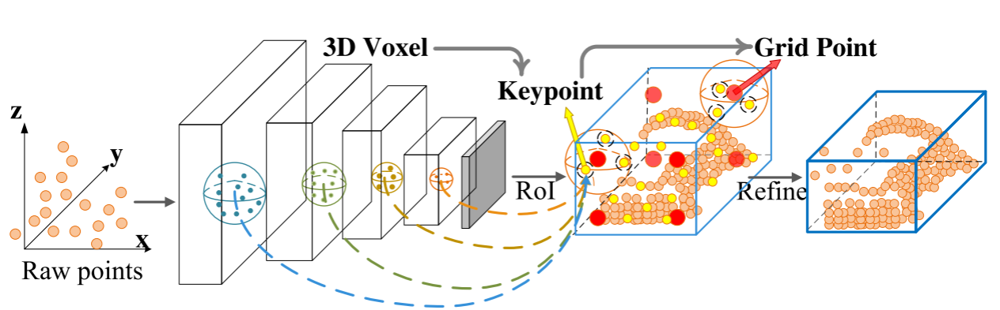

`图 1.` 我们提出的 PV-RCNN 框架通过`两步策略`深度融合了`基于体素的网络`和`基于 PointNet 的网络`，包括体素到关键点的 3D 场景编码和关键点到网格的`感兴趣区域（RoI）`特征抽象，以提升 3D 目标检测的性能。

​		主要挑战在于如何有效地将这两类特征学习方案，特别是带有稀疏卷积的 3D 体素 CNN [6,5] 和基于 PointNet 的集合抽象 [24]，整合到一个统一的框架中。一个直观的解决方案是在每个 3D 提案内均匀采样若干网格点，并采用集合抽象来聚合这些网格点周围的 3D 体素级特征以进行提案细化。然而，这种策略是高度内存密集型的，因为体素的数量和网格点的数量都可能非常大，以实现令人满意的性能。

​		因此，为了更好地整合这两类点云特征学习网络，`我们提出了一种两步策略`，第一步是体素到关键点的场景编码步骤，第二步是关键点到网格的感兴趣区域（RoI）特征抽象步骤。// 具体来说，采用具有 3D 稀疏卷积的体素 CNN 进行体素级特征学习和准确的提案生成。为了缓解上述需要太多体素来编码整个场景的问题，通过`最远点采样`（FPS）选择一小组关键点，以从体素级特征中总结整体 3D 信息。每个关键点的特征通过基于 PointNet 的集合抽象对相邻的体素级特征进行`分组聚合`，以总结多尺度点云信息。`通过这种方式，整个场景可以被少量带有相关多尺度特征的关键点有效且高效地编码。`

​		对于第二个关键点到网格的感兴趣区域（RoI）特征抽象步骤，给定每个具有网格点位置的边界框提案，我们`提出了一个 RoI 网格池化模块`，其中对每个网格点采用具有`多个半径的`关键点集合抽象层，以聚合来自具有多尺度上下文的关键点的特征。然后，所有网格点的聚合特征可以共同用于后续的提案细化。我们提出的 PV-RCNN 有效地利用了基于点和基于体素的网络的优势，在每个边界框提案处编码判别性特征，以进行准确的置信度预测和细粒度的边界框细化。

​		我们的贡献可以概括为四个方面。

​	（1）我们提出了 PV-RCNN 框架，其有效地利用了基于体素和基于点的方法来进行 3D 点云特征学习，从而在可控的内存消耗下提升了 3D 目标检测的性能。

​	（2）我们提出了体素到关键点的场景编码方案，该方案通过`体素集合抽象层`将整个场景的多尺度体素特征编码到一小组关键点中。这些关键点特征不仅保留了准确的位置信息，还编码了丰富的场景上下文，从而显著提升了 3D 检测性能。

​	（3）我们为每个提案中的网格点提出了`多尺度感兴趣区域`（RoI）特征抽象层，该层通过多个感受野从场景中聚合更丰富的上下文信息，以进行准确的边界框细化和置信度预测。

​	（4）我们提出的 PV-RCNN 方法以显著的优势超越了所有先前的方法，在竞争激烈的 KITTI 3D 检测基准 [10] 上排名第一，并且在大规模的 Waymo 开放数据集上也以较大的优势超越了先前的方法。

### 2. Related Work

​		`3D Object Detection with Grid-based Methods.`  为了解决点云的不规则数据格式问题，大多数现有工作将点云投影到规则网格，以通过 2D 或 3D 卷积神经网络（CNN）进行处理。先驱工作 MV3D [1] 将点云投影到 2D 鸟瞰图网格，并放置大量`预定义`的 3D 锚框以生成 3D 边界框，后续工作 [11,17,16] 开发了更好的多传感器融合策略，而 [36,35,12] 则提出了更高效的鸟瞰图表示框架。其他一些工作 [27,41] 将点云划分为 3D 体素以通过 3D CNN 处理，并且 [34] 引入了 3D 稀疏卷积 [5] 用于高效的 3D 体素处理。[30,42] 利用多个检测头，而 [26] 则探索物体部件位置以提升性能。这些基于网格的方法通常在准确生成 3D 提案方面效率较高，但感受野受到 2D/3D 卷积核大小的限制。

​		`3D Object Detection with Point-based Methods.`  F-PointNet [22] 首次提出将 PointNet [23,24] 应用于基于 2D 图像边界框的裁剪点云的 3D 检测。PointRCNN [25] 仅使用点云进行 3D 检测时，直接从整个点云生成 3D 提案，而非依赖 2D 图像，后续工作 STD [37] 提出了从稀疏到密集的策略以实现更好的提案细化。[21] 提出了霍夫投票策略以优化目标特征分组。这些基于点的方法大多基于 PointNet 系列，尤其是集合抽象操作 [24]，其为点云特征学习提供了灵活的感受野。

​		`Representation Learning on Point Clouds.`  最近，点云表示学习已引起了广泛关注，用于提升点云分类和分割的性能 [23,24,41,31,7,38,15,28,33,8,29,3]。在 3D 检测方面，先前的方法通常将点云投影到规则的鸟瞰图网格 [1,36] 或 3D 体素 [41,2]，以使用 2D/3D 卷积神经网络（CNN）处理点云。[34,26] 采用 3D 稀疏卷积 [6,5] 来有效地从点云中学习稀疏体素级特征。Qi 等人 [23,24] 提出了 PointNet 以直接从原始点云中学习点级特征，其中集合抽象操作通过设置不同的搜索半径来实现灵活的感受野。[19] 结合了基于体素的 CNN 和基于点的 SharedMLP，以实现高效的点云特征学习。相比之下，我们提出的 PV-RCNN 利用了基于体素的特征学习（即 3D 稀疏卷积）和基于 PointNet 的特征学习（即集合抽象操作）的优势，以实现高质量的 3D 提案生成和灵活的感受野，从而提升 3D 检测性能。

### 3. PV-RCNN for Point Cloud Object Detection

​		在本文中，我们提出了 PointVoxel-RCNN（PV-RCNN），它是一种`两阶段 3D 检测框架`，旨在从点云中进行更精确的 3D 目标检测。最先进的 3D 检测方法要么基于带有稀疏卷积的 3D 体素 CNN，要么基于以 PointNet 为基础的网络作为主干网络。通常，带有稀疏卷积的 3D 体素 CNN 效率更高 [34,26]，并且能够生成高质量的 3D 目标提案，而基于 PointNet 的方法可以通过灵活的感受野捕获更精确的上下文信息。

​		我们的 PV-RCNN 深度融合了这两类网络的优势。如图 2 所示，PV-RCNN 由一个带有稀疏卷积的 3D 体素 CNN 作为主干网络，用于高效的特征编码和提案生成。对于每个 3D 目标提案，为了有效地从场景中池化其对应的特征，`我们提出了两种新颖的操作`：1.体素到关键点的场景编码（将整个场景特征体的所有体素总结为少量特征关键点），2.以及点到网格的感兴趣区域（RoI）特征抽象（将场景关键点特征有效地聚合到 RoI 网格，用于提案置信度预测和位置细化）。

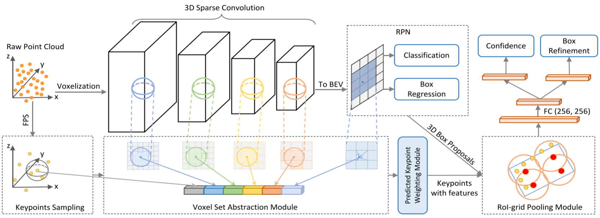

`图 2` 展示了我们提出的 PV-RCNN 的整体架构。原始点云首先被体素化，输入到基于 3D 稀疏卷积的编码器中，以学习多尺度语义特征并生成 3D 目标提案。然后，通过新颖的体素集合抽象模块，将多个神经层上学到的体素级特征体总结为一小部分关键点。最后，将关键点特征聚合到感兴趣区域（RoI）网格点，以学习特定于提案的特征，用于细粒度的提案细化和置信度预测。

##### 3.1. 3D Voxel CNN for Efficient Feature Encoding and Proposal Generation

​		具有 3D 稀疏卷积的体素 CNN [6,5,34,26] 是最先进的 3D 检测器的常用选择，用于将点云高效地转换为`稀疏 3D 特征体`。由于其高效性和准确性，我们采用它作为我们框架的主干网络，用于特征编码和 3D 提案生成。

​		`3D voxel CNN.`  输入点 P 首先被划分为具有 $L×W×H$ 空间分辨率的小体素，其中非空体素的特征直接计算为所有内部点的点特征的平均值。常用的特征是 3D 坐标和反射强度。该网络利用一系列 3×3×3 的 3D 稀疏卷积，将点云逐步转换为具有 1×、2×、4×、8× 下采样尺寸的特征体。每个层级的此类稀疏特征体可视为一组体素级特征向量。

​		`3D proposal generation.`  通过将编码的 8× 下采样 3D 特征体转换为 2D 鸟瞰图特征图，遵循基`于锚框的方法 [34,12] 生成高质量的 3D 提案`。具体来说，我们沿 Z 轴堆叠 3D 特征体以获得$\frac{L}{8} \times \frac{W}{8}$的鸟瞰图特征图。每个类别有$2 \times \frac{L}{8} \times \frac{W}{8}$个 3D 锚框，这些锚框采用该类别的平均 3D 物体尺寸，并且对鸟瞰图特征图的每个像素评估 0°、90° 方向的两个锚框。如表 4 所示，所采用的带有基于锚框方案的 3D 体素 CNN 主干网络比基于 PointNet 的方法 [25,37] 实现了更高的召回性能。

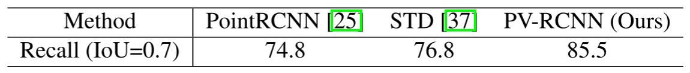

Table 4. Recall of different proposal generation networks on the car class at moderate difficulty level of the KITTI val split set.

​		`Discussions.`  最先进的检测器大多采用两阶段框架。它们需要从生成的 3D 特征体或 2D 图中池化感兴趣区域（RoI）特定的特征，以进行进一步的提案细化。然而，这些来自 3D 体素 CNN 的 3D 特征体在以下方面存在主要局限性。（i）这些特征体通常具有较低的空间分辨率，因为它们被下采样了高达 8 倍，这阻碍了输入场景中物体的精确定位。（ii）即使可以通过上采样获得更大空间尺寸的特征体 / 图，它们通常仍然相当稀疏。在 RoI 池化 / RoI 对齐操作中常用的双线性或三线性插值只能从非常小的邻域中提取特征（即双线性插值为 4 个最近邻，三线性插值为 8 个最近邻）。因此，传统的池化方法将获得主要为零的特征，并在第二阶段细化中浪费大量计算和内存。

​		另一方面，在 PointNet 的变体 [23,24] 中提出的集合抽象操作已显示出对任意大小邻域中的特征点进行编码的强大能力。因此，我们提出将 3D 体素 CNN 与一系列集合抽象操作相结合，以进行准确且鲁棒的第二阶段提案细化。

​		使用集合抽象操作来池化场景特征体素的一个简单解决方案是直接将场景中的多尺度特征体聚合到 RoI 网格。然而，这种直观的策略会占用大量内存，并且在实践中效率低下。例如，KITTI 数据集中的一个常见场景在 4 倍下采样的特征体中可能会产生 18,000 个体素。如果为每个场景使用 100 个边界框提案，并且每个边界框提案有 3×3×3 的网格，那么即使在进行距离阈值处理之后，2,700×18,000 的成对距离和特征聚合也无法高效计算。

​		为了解决这个问题，我们提出了一种两步方法：首先将整个场景不同神经层的体素编码为少量关键点，然后将关键点特征聚合到 RoI 网格以进行边界框提案细化。

##### 3.2. Voxel-to-keypoint Scene Encoding via Voxel Set Abstraction

​		我们提出的框架首先将表示整个场景的多个神经层的体素聚合为少量关键点，这些关键点充当 3D 体素 CNN 特征编码器和提案细化网络之间的桥梁。

​		`关键点采样`  具体来说，我们采用最远点采样（FPS）算法从点云 P 中采样少量 n 个关键点 K = {p₁,・・・, pₙ}，其中 KITTI 数据集的 n = 2048，Waymo 数据集的 n = 4096。这种策略确保关键点均匀分布在非空体素周围，并能代表整个场景的特征。

​		`体素集合抽象模块`  我们提出体素集合抽象（VSA）模块，用于将 3D CNN 特征体中的多尺度语义特征编码到关键点。该模块采用 [24] 中提出的集合抽象操作，以聚合体素级特征体。此时，`关键点的周围点是由 3D 体素 CNN 从多个层级编码的、具有多尺度语义特征的规则体素`，而非通过 PointNet 学习特征的相邻原始点。

​		具体来说，将 $F^{(l_k)} = \{ f^{(l_k)}_1, \cdots, f^{(l_k)}_{N_k} \}$ 表示为第 k 层 3D 体素 CNN 中的体素级特征向量集合，$V^{(l_k)} = \{ v^{(l_k)}_1, \cdots, v^{(l_k)}_{N_k} \}$ 表示通过第 k 层的体素索引和实际体素尺寸计算得到的三维坐标集合，其中 $N_k$ 为第 k 层中非空体素的数量。对于每个关键点 $p_i$，我们首先在半径 $r_k$ 内识别其在第 k 层中相邻的非空体素，以检索体素级特征向量集合:

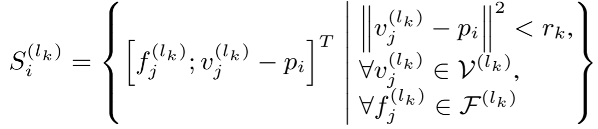

中，我们将局部相对坐标 $v^{(l_k)}_j - p_i$ 进行拼接，以表示语义体素特征 $f^{(l_k)}_j$的相对位置。然后，关键点 $p_i$ 的相邻体素集 $S^{(l_k)}_i$ 内的体素级特征通过一个 PointNet 模块 [23] 进行变换，生成关键点 $p_i$的特征：

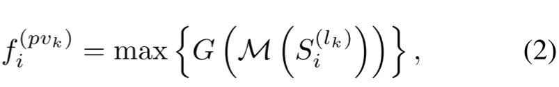

其中，$M(\cdot)$ 表示从相邻集合 $S^{(l_k)}_i$ 中随机采样最多 $T_k$ 个体素以节省计算量，$G(\cdot)$ 表示用于编码体素级特征和相对位置的多层感知机（MLP）网络。尽管不同关键点的相邻体素数量不同，但沿通道的最大池化操作 $\max(\cdot)$ 会将不同数量的相邻体素特征向量映射为关键点 \(p_i\) 的特征向量 $f^{(pvk)}_i$。通常，我们还会在第 k 层设置多个半径 $r_k$，以聚合具有不同感受野的局部体素级特征，从而捕获更丰富的多尺度上下文信息。

​		上述体素集合抽象操作在 3D 体素 CNN 的不同层级上执行，来自不同层级的聚合特征可通过拼接生成关键点 \(p_i\) 的多尺度语义特征：

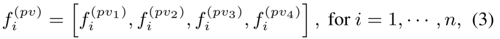

其中，生成的特征 $f^{(pv)}_i$同时整合了基于 3D 体素 CNN 的体素级特征 $f^{(l_k)}_j$ 的特征学习，以及基于 PointNet 的体素集合抽象（如公式 (2)）的特征学习。此外，关键点 $p_i$的三维坐标也保留了精确的位置信息。

​		`扩展体素集合抽象模块`  我们通过从原始点云 P 和 8× 下采样的 2D 鸟瞰图特征图（如 3.1 节所述）进一步丰富关键点特征，从而扩展了 VSA 模块。其中，原始点云部分弥补了初始点云体素化的量化损失，而 2D 鸟瞰图在 Z 轴方向具有更大的感受野。原始点云特征 $f^{(raw)}_i$ 也按公式 (2) 进行聚合。对于鸟瞰图特征图，我们将关键点 $p_i$ 投影到 2D 鸟瞰坐标系，并利用双线性插值从鸟瞰图特征中获取特征 $f^{(bev)}_i$。因此，通过拼接所有相关特征，关键点 $p_i$的特征得到进一步增强：

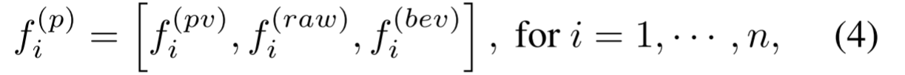

这些设计（指原始点云特征、鸟瞰图特征与体素特征的融合）具有强大的能力来保留整个场景的 3D 结构信息，并且能够显著提升最终的检测性能。

​		`预测关键点权重。`  在整个场景被少量关键点编码后，它们将被后续阶段进一步用于提案细化。关键点通过最远点采样（FPS）策略选择，其中一些可能仅代表背景区域。直观地说，属于前景物体的关键点应对提案的精确细化贡献更大，而来自背景区域的关键点贡献较小。

​		因此，我们提出预测关键点加权（PKW）模块（见图 3），通过点云分割的额外监督对关键点特征进行重新加权。分割标签可直接由 3D 检测框注释生成，即通过检查每个关键点是否在真实 3D 边界框内 —— 因为自动驾驶场景中的 3D 物体在 3D 空间中天然分离。每个关键点特征 $\tilde{f}^{(p)}_i$ 的预测特征权重可表示为：

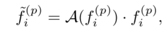

其中，$A(\cdot)$是一个带有 sigmoid 函数的三层多层感知机（MLP）网络，用于预测范围在 [0, 1] 内的前景置信度。PKW 模块采用焦点损失（Focal Loss）[18] 进行训练，默认超参数用于处理训练集中前景 / 背景点数量不平衡的问题

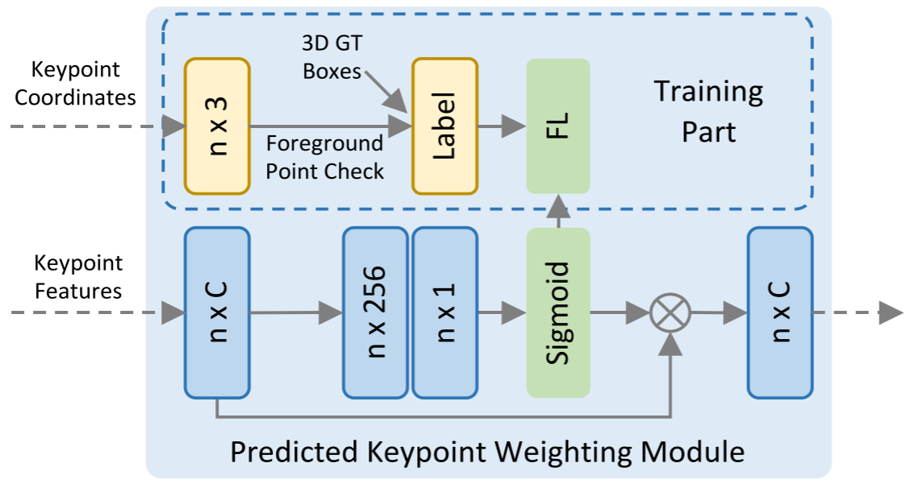

`Figure 3.` Illustration of Predicted Keypoint Weighting module.

##### 3.3. Keypoint-to-grid RoI Feature Abstraction for Proposal Refinement

​		在先前的步骤中，整个场景被总结为少量具有多尺度语义特征的关键点。对于 3D 体素 CNN 生成的每个 3D 提案（RoI），需要从关键点特征集合 $\tilde{F} = \{ \tilde{f}^{(p)}_1, \cdots, \tilde{f}^{(p)}_n \}$ 中聚合每个 RoI 的特征，以实现精确且鲁棒的提案细化。我们提出基于集合抽象操作的关键点到网格 RoI 特征抽象模块，用于多尺度 RoI 特征编码。

​		如图 4 所示，针对每个 3D 感兴趣区域（RoI），我们提出 RoI 网格池化模块，以通过多个感受野将关键点特征聚合到 RoI 网格点。我们在每个 3D 提案内均匀采样 6×6×6 个网格点，记为 $G = \{g_1, \cdots, g_{216}\}$。该模块采用集合抽象操作从关键点特征中聚合网格点的特征。具体来说，我们首先在半径 $\tilde{r}$ 内识别网格点 $g_i$的相邻关键点:

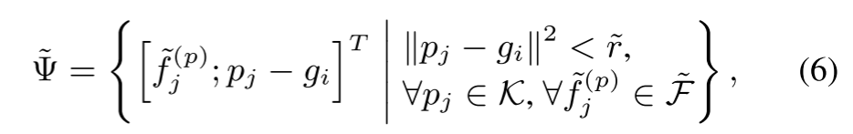

其中，附加 $p_j - g_i$ 以表示来自关键点 $p_j$的特征 $\tilde{f}^{(p)}_j$ 的局部相对位置。然后采用 PointNet 模块 [23] 聚合相邻关键点特征集 $\tilde{\Psi}$，为网格点 $g_i$ 生成特征：

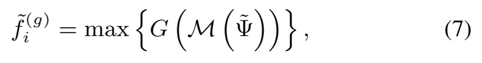

其中，$M(\cdot)$和 $G(\cdot)$ 的定义与公式 (2) 一致。我们设置多个半径 \(\tilde{r}\) 并聚合不同感受野的关键点特征，将这些特征拼接在一起以捕获更丰富的多尺度上下文信息。

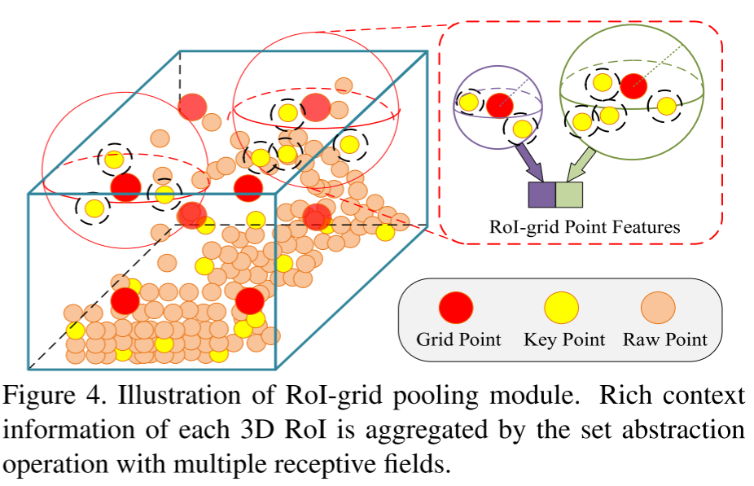

​		在从周围关键点获取每个网格的聚合特征后，同一 RoI 的所有 RoI 网格特征可被向量化，并通过一个 256 维特征的两层 MLP 进行变换，以表示整个提案。

​		与先前工作 [25, 37, 26] 中的点云 3D RoI 池化操作相比，我们提出的针对关键点的 RoI 网格池化操作能够通过灵活的感受野捕获更丰富的上下文信息 —— 其感受野甚至超出 3D RoI 边界以捕获外部的关键点特征，而此前的 SOTA 方法要么简单地对提案内的所有点特征取平均作为 RoI 特征 [25]，要么将大量无信息的零值作为 RoI 特征进行池化 [26, 37]。

​		`3D 提案细化与置信度预测`  给定每个边界框提案的 RoI 特征，提案细化网络学习预测相对于输入 3D 提案的尺寸和位置残差（即中心坐标、尺寸和朝向）。细化网络采用两层多层感知机（MLP），并分别通过两个分支实现置信度预测和边界框细化。	

​		对于置信度预测分支，我们遵循文献 [14, 9, 26]，采用 3D 感兴趣区域（RoIs）与其对应真实框之间的三维交并比（IoU）作为训练目标。对于第 k 个 3D RoI，其置信度训练目标 $y_k$被归一化为 [0, 1] 区间：

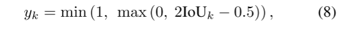

其中，$\text{IoU}_k$为第 k 个 RoI 相对于其真实框的三维交并比。我们的置信度分支通过最小化预测置信度目标的交叉熵损失进行训练，

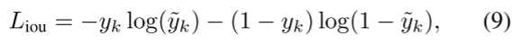

其中 $\tilde{y}_k$是网络预测的分数。表 9 中的实验表明，这种质量感知（quality-aware）的置信度预测策略比传统分类目标取得了更好的性能。

​		边界框细化分支的边界框回归目标采用文献 [34, 26] 中传统的基于残差的方法进行编码，并通过 smooth-L1 损失函数优化。

##### 3.4. Training losses

​		所提出的 PV-RCNN 框架通过区域提案损失 $\mathcal{L}_{\text{rpn}}$、关键点分割损失 $\mathcal{L}_{\text{seg}}$和提案细化损失 $\mathcal{L}_{\text{rcnn}}$进行端到端训练。(1) 我们采用与文献 [34] 相同的区域提案损失 $\mathcal{L}_{\text{rpn}}$：

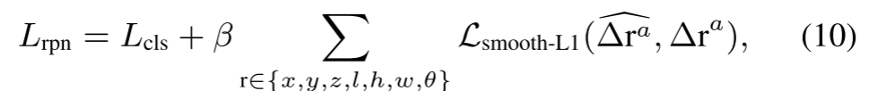

​		其中锚点分类损失$\mathcal{L}_{\text{cls}}$使用默认超参数的焦点损失 [18] 计算，锚框回归采用平滑 L1 损失，对预测残差$\Delta\hat{r}_a$和回归目标$\Delta r_a$进行优化。(2) 关键点分割损失$\mathcal{L}_{\text{seg}}$也如 3.2 节所述通过焦点损失计算。(3) 提案细化损失$\mathcal{L}_{\text{rcnn}}$包括 IoU 引导的置信度预测损失$\mathcal{L}_{\text{ious}}$和边界框细化损失，公式为：

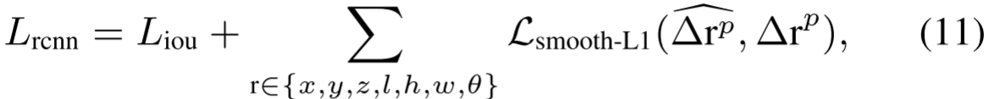

​		其中，$\Delta\hat{r}_p$ 为预测的边界框残差，$\Delta r_p$为提案回归目标，其编码方式与 $\Delta r_a$一致。

​		总体训练损失为这三个损失的和，各损失权重相等。更多训练损失细节见补充文件。

### 4. Experiments

​		在本节中，我们介绍 PV-RCNN 框架的实现细节（4.1 节），并在极具挑战性的 KITTI 数据集 [4]（4.2 节）和新发布的大规模 Waymo 开放数据集 [20,40]（4.3 节）上与先前的先进方法进行对比。在 4.4 节中，我们进行了广泛的消融研究，以探究 PV-RCNN 各组件的贡献，验证我们的设计合理性。

##### 4.1. Experimental Setup

​		`数据集`  **KITTI 数据集 [4]** 是自动驾驶领域最受欢迎的三维目标检测数据集之一，包含 7,481 个训练样本和 7,518 个测试样本。其中训练样本通常划分为训练集（3,712 个样本）和验证集（3,769 个样本）。我们在验证集和在线排行榜的测试集上，将 PV-RCNN 与现有先进方法进行了对比

​		**Waymo 开放数据集** 是近期发布的、目前最大的自动驾驶三维目标检测数据集，共有 798 个训练序列（包含约 158,361 个激光雷达样本）和 202 个验证序列（包含 40,077 个激光雷达样本）。该数据集对 360 度全视野内的物体进行标注，而 KITTI 数据集仅覆盖 90 度视野。我们在这一大规模数据集上评估模型，以进一步验证所提方法的有效性。

​		`网络结构`  如图 2 所示，三维体素 CNN 包含四个层级，特征维度分别为 16、32、64、64。VSA 模块中各层级的两个相邻采样半径 rk 分别设置为 (0.4m, 0.8m)、(0.8m, 1.2m)、(1.2m, 2.4m)、(2.4m, 4.8m)，原始点云的集合抽象邻域半径为 (0.4m, 0.8m)。对于所提出的 RoI 网格池化操作，我们在每个三维提案中均匀采样 6×6×6 个网格点，每个网格点的两个相邻半径$\tilde{r}$为 (0.8m, 1.6m)。

​		对于 KITTI 数据集，检测范围为 X 轴 [0, 70.4] m、Y 轴 [-40, 40] m、Z 轴 [-3, 1] m，各轴体素化尺寸为 (0.05m, 0.05m, 0.1m)。对于 Waymo 开放数据集，检测范围为 X 轴和 Y 轴 [-75.2, 75.2] m、Z 轴 [-2, 4] m，体素化尺寸设置为 (0.1m, 0.1m, 0.15m)。

​		`训练和推理细节。`  我们的 PV-RCNN 框架使用 ADAM 优化器从头开始进行`端到端训练`。对于 KITTI 数据集，我们在 8 块 GTX 1080 Ti GPU 上以批量大小 24、学习率 0.01 训练整个网络 80 轮，耗时约 5 小时。对于 Waymo 开放数据集，我们在 32 块 GTX 1080 Ti GPU 上以批量大小 64、学习率 0.01 训练 30 轮。学习率衰减采用余弦退火策略。在提案细化阶段，我们随机采样 128 个提案，正负提案比例为 1:1—— 若提案与真实框的 3D IoU 至少为 0.55，则视为正提案，否则为负提案。

​		**训练阶段**：我们采用三维目标检测中广泛使用的数据增强策略，包括沿 X 轴随机翻转、使用从 [0.95, 1.05] 随机采样的缩放因子进行全局缩放、绕 Z 轴以 [−π/4, π/4] 随机角度进行全局旋转。此外，我们还实施文献 [34] 中的真实样本采样增强 —— 从其他场景随机 “粘贴” 新的真实物体到当前训练场景，以模拟不同环境中的物体。

​		**推理阶段**：我们保留三维体素 CNN 生成的前 100 个提案，采用 0.7 的三维交并比（IoU）阈值进行非极大值抑制（NMS）。这些提案在细化阶段通过聚合的关键点特征进一步优化，最终使用 0.01 的 NMS 阈值去除冗余边界框。

##### 4.2. 3D Detection on the KITTI Dataset

​		为评估所提模型在 KITTI 验证集上的性能，我们在训练集上训练模型，并在验证集上报告结果。若通过 KITTI 官方测试服务器对测试集进行评估，则使用所有可用训练 + 验证数据的 80% 训练模型，剩余 20% 数据用于验证。

​		`评估指标：`所有结果通过平均精度均值（mAP）进行评估，其中汽车的旋转 IoU 阈值为 0.7，自行车为 0.5。测试集的平均精度均值在 KITTI 官方测试服务器 [10] 上基于 40 个召回率点计算。表 2 中验证集的结果基于 11 个召回率点计算，以便与先前工作的结果进行对比。

​		**与先进方法的对比**。表 1 展示了截至 2019 年 11 月 15 日 PV-RCNN 在 KITTI 测试集的官方在线排行榜上的性能。在最重要的汽车类别三维目标检测基准中，我们的方法以显著优势超越了此前的先进方法 —— 在简单、中等和困难难度级别上，平均精度均值（mAP）分别提升 1.58%、1.72% 和 1.73%。对于汽车类别的鸟瞰图检测，我们的方法在简单和中等难度级别上也取得了新的最优性能，仅在困难难度级别略有下降。对于自行车的三维检测和鸟瞰图检测，我们的方法在中等和困难难度级别上大幅超越了此前仅使用激光雷达的方法，在简单难度级别上性能相当。值得注意的是，我们使用单一模型同时处理汽车和自行车检测，而不像此前方法 [34,12,25,37] 那样为每个类别训练独立模型。

​		截至 2019 年 11 月 15 日，在包括 RGB + 激光雷达方法和仅激光雷达方法的所有方案中，我们的方法在汽车三维检测排行榜上位列第 1；在所有已发表的仅激光雷达方法中，我们的方法在自行车三维检测排行榜上位列第 1。这些显著提升充分证明了 PV-RCNN 的有效性。

​		我们还报告了 KITTI 验证集上最重要的汽车类别在 R11 标准下的平均精度均值（mAP）性能。同样，如表 2 所示，我们的方法以较大优势超越了此前的先进方法。表 3 还提供了 R40 标准下的性能以供参考。

##### 4.3. 3D Detection on the Waymo Open Dataset

​		为进一步验证所提出的 PV-RCNN 的有效性，我们在新发布的大规模 Waymo 开放数据集上评估了 PV-RCNN 的性能。

​		**评估指标**：我们采用官方发布的评估工具对方法进行评估，使用平均精度均值（mAP）和朝向加权平均精度均值（mAPH）作为评估指标。旋转 IoU 阈值设置为：车辆检测 0.7，行人和自行车 0.5。测试数据按两种方式划分：第一种基于物体与传感器的不同距离，分为 0−30m、30−50m 和 > 50m；第二种将数据分为两个难度等级，其中 LEVEL 1 表示真实物体至少包含 5 个内部点，LEVEL 2 表示真实物体至少包含 1 个内部点或手动标记为 LEVEL 2 的真实物体。

​		**与先进方法的对比**。表 5 显示，我们的方法显著超越了此前的先进方法 [40]—— 三维目标检测的平均精度均值（mAP）提升 7.37%，鸟瞰图目标检测的 mAP 提升 2.56%。结果表明，我们的方法在所有感兴趣的距离范围内均取得了显著更好的 mAP，其中 30−50m 范围内的三维检测最大提升 9.19%，这验证了所提出的多层次点体素融合策略能够有效捕获更精确的上下文信息，从而提升三维检测性能。如表 5 所示，我们的方法在朝向加权平均精度均值（mAPH）方面也表现优异，证明模型能够为车辆预测准确的朝向。表 5 还报告了 LEVEL 2 难度等级的结果以供参考，可见我们的方法即使对于内部点少于 5 个的物体也能表现良好。在大规模 Waymo 开放数据集上的实验结果进一步验证了所提框架在不同数据集上的泛化能力。

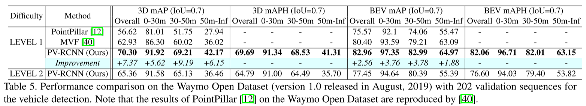

​		**更多提案提升多类别检测性能**。为评估我们方法在多类别检测中的性能，我们进一步在最新的 Waymo 开放数据集（2020 年 3 月发布的 1.2 版本）上进行实验。由于我们仅训练一个单一模型来检测所有三个类别（如车辆、行人和自行车），提案数量从 100 增加至 500。如表 6 所示，我们的方法在这三个类别的所有难度等级上均显著超越先前方法。我们希望该结果能为 Waymo 开放数据集建立强有力的基线，为后续研究提供参考。

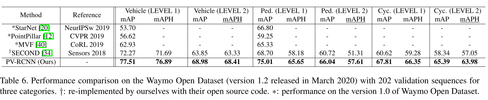

##### 4.4. Ablation Studies

​		在本节中，我们进行了广泛的消融实验以分析所提方法的各个组件。所有模型均在 KITTI 数据集 [4] 的汽车类别训练集上训练，并在验证集上评估。

​		`体素到关键点场景编码的影响：` 我们通过与第 3.1 节所述的 “直接将编码器的多尺度特征体聚合到 RoI 网格点” 的原始方案对比，验证体素到关键点场景编码策略的有效性。如表 7 的第 2 行和第 3 行所示，体素到关键点场景编码策略在所有三个难度级别上均显著提升了性能。这得益于关键点通过桥接三维体素 CNN 和 RoI 网格点扩大了感受野，且关键点的分割监督还能促使三维体素 CNN 更好地学习多尺度特征。此外，与直接池化策略相比，作为中间特征表示的少量关键点也降低了 GPU 内存占用。

​		`VSA 模块不同特征的影响：`  在表 8 中，我们探究了公式 (3) 和公式 (4) 中关键点各特征组件的重要性。第 1 行结果表明，若仅聚合来自$f_{\text{(raw)}^i}$的特征，性能会大幅下降，因为浅层语义信息不足以支撑提案细化。如第 2 至 5 行所示，来自$f_{\text{(pv3)}^i}$、$f_{\text{(pv4)}^i}$和$f_{\text{(bev)}^i}$的高层语义信息显著提升了性能。最后四行结果显示，添加相对浅层的语义特征$f_{\text{(pv1)}^i}$、$f_{\text{(pv2)}^i}$、$f_{\text{(raw)}^i}$可进一步小幅提升性能，而将所有特征组件作为关键点特征时性能最佳。

​		`PKW 模块的影响:` 我们在 3.2 节中提出了预测关键点加权（PKW）模块，用于通过额外的关键点分割监督对关键点的逐点特征进行重新加权。表 9 的第 1 行和第 4 行表明，移除 PKW 模块会导致性能大幅下降，这证明 PKW 模块通过更关注前景关键点（因其对后续提案细化网络更为重要），实现了更好的多尺度特征聚合。

​		`RoI 网格池化模块的影响:` 我们通过将 RoI 网格池化模块替换为 RoI 感知池化 [26] 并保持其他模块不变，探究该模块的影响。表 9 显示，替换 RoI 网格池化模块后性能显著下降，这验证了所提出的基于集合抽象的 RoI 网格池化能够学习更丰富的上下文信息 —— 通过为每个网格点使用大搜索半径池化更有效的特征，池化后的特征还编码了更具判别性的 RoI 特征。表 7 的第 1 行和第 2 行还表明，与三维体素 RPN 相比，提案通过 RoI 网格池化模块聚合的特征进行细化后，性能大幅提升。

### 5. Conclusion

​		我们提出了 PV-RCNN 框架，这是一种从点云进行精确三维目标检测的新方法。该方法通过新提出的体素集合抽象层，将多尺度三维体素 CNN 特征与基于 PointNet 的特征融合到少量关键点中；所学习的关键点判别性特征随后通过多感受野聚合到 RoI 网格点，以捕获更丰富的上下文信息，用于细粒度的提案细化。在 KITTI 数据集和 Waymo 开放数据集上的实验结果表明，与此前的先进方法相比，我们提出的体素到关键点场景编码和关键点到网格的 RoI 特征抽象策略显著提升了三维目标检测性能。

---

