# Point-Cache： Test-time Dynamic and Hierarchical Cache for Robust and Generalizable Point Cloud Analysis

# Point-Cache：用于鲁棒和泛化点云分析的测试时动态分层缓存

## Abstract

​		本文提出了一种通用解决方案，旨在使点云识别模型能够在测试时处理 **分布偏移** (distribution shifts)。不同于以往严重依赖训练数据（通常在在线推理期间无法获取）且仅限于识别训练期间预定义的固定点云类别集的方法，我们探索了一种更实用且更具挑战性的场景：仅基于在线测试数据调整模型，以便在测试时识别先前见过的类别以及新颖的、**未见过的类别** (unseen classes)。为此，我们开发了 **Point-Cache**，这是一个`分层缓存模型`，它能够捕捉在线测试样本的关键线索，特别关注点云的全局结构及其局部部件细节。Point-Cache 作为一个丰富的 3D 知识库，通过动态管理以优先包含高质量样本。作为一个 **即插即用** (plug-and-play) 模块，我们的方法可以灵活地集成到 **大型多模态 3D 模型** (large multimodal 3D models) 中，以支持 **开放词汇点云识别** 。值得注意的是，我们的解决方案完全无需训练，因此其运行效率与 **零样本推理** 相当。Point-Cache 在 8 个具有挑战性的基准测试和 4 个代表性的大型 3D 模型上展示了巨大的收益，突显了其有效性。代码已发布于 <https://github.com/auniquesun/Point-Cache>。

## 1 Introduction

​		近年来，**激光雷达** (LiDARs) 和 RGB-D 相机等 3D 传感器因其提供可靠 3D 几何测量的能力，已被广泛应用于机器人和电动汽车领域 [11, 16, 20, 31, 59, 61-63, 68]。点云是这些 3D 传感器产生的最直接的数据格式之一。尽管在 3D 点云识别方面已经取得了显著进展，但这些成功主要基于一个假设，即测试数据和模型训练数据是同分布的 [2, 9, 26, 32, 37, 39, 40, 64, 87]。然而，由于复杂的几何结构以及传感和处理误差，这一假设在现实场景中经常被违反 [43, 50, 51]。

​		在实践中，大多数模型仍然容易受到分布偏移的影响，例如 **分布外样本** (out-of-distribution, OOD samples) [6, 7, 50, 69]、**数据损坏** (data corruptions) [43, 44, 51, 56] 等。如图 1 所示，当模型在洁净数据 (ModelNet [70]) 与受损数据 (ModelNet-C [43]) 上进行测试时，会出现显著的性能差距（例如 11% 以上）。这些问题促使研究人员增强点云识别方法的 **鲁棒性** (robustness) 和 **泛化性** (generalization)。相关的努力主要可以分为三类。

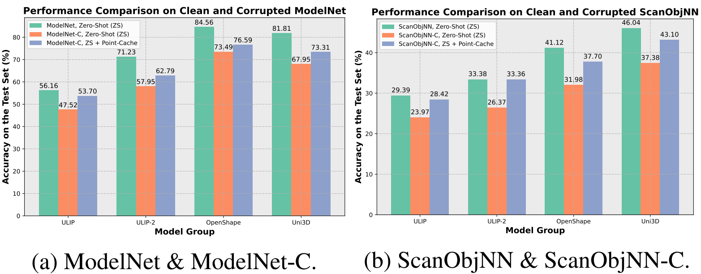

`图 1. 在洁净和受损点云数据集上的识别准确率对比。后缀 -C表示带有损坏的数据集。当数据损坏出现时，模型的性能会经历严重的下滑。Point-Cache 有效地缩小了洁净数据与受损数据之间的性能差距。此处使用了 ScanObjNN 中难度最高的划分。`

​		`第一类`侧重于训练能够迁移到目标数据的模型。这些模型学习源域和目标域之间的共享特征空间 [10, 41, 45, 67]，或者应用 **元学习** (meta-learning) 框架通过训练多个分类器来处理几何偏移 [19]，或者设计可学习的提示 (prompts) 以从预训练的大型 3D 模型中引出通用知识 [50]。然而，可能的偏移是不可预测的，基于训练的方法无法在训练期间涵盖所有情况。因此，当测试时出现新的偏移时，这些模型受到限制 [75]。`第二类`通过 **测试时适应** (test-time adaptation) 策略来解决该问题 [35, 46, 66]。这些策略利用各种适应技术提高性能，例如点云的 **掩码自编码** (masked auto-encoding, MATE [35])、静态原型记忆 (BFTT3D [66]) 和扩散模型 (CloudFixer [46])。尽管如此，`我们发现这些方法严重依赖训练数据。`例如，MATE [35] 需要在整个训练集上进行预训练，而 BFTT3D [66] 使用训练数据构建静态和离线的原型记忆来存储点云特征。这种对训练数据的严重依赖构成了挑战，特别是当无法获取此类数据或在测试时发生分布偏移时。在这些情况下，重新访问训练数据可能无助于使模型适应在线测试数据。此外，这些测试时方法只能识别训练期间见过的类别，这限制了它们在泛化点云分析中的实用性。

​		受语言引导图像识别进展的启发 [22, 38, 42, 79]，`第三类`工作利用大规模三元组（点云、文本、图像）上的 **对比预训练** (contrastive pre-training) 来连接灵活的语言描述并实现开放词汇点云识别 [29, 72, 73, 88]。这些大型多模态 3D 模型展示了有前景的零样本性能，并为泛化点云分析提供了新的范式。然而，`零样本预测是对每个测试样本独立执行的，最终的准确率只是简单地在测试集上取平均`。这种方法没有充分利用测试数据的分布，特别是大型 3D 模型可靠预测的统计数据，而这些数据可以进一步增强准确性和泛化能力。在此，我们要提出以下问题：*我们能否结合大型 3D 模型有前景的零样本能力和测试时适应技术，以解锁更鲁棒和可泛化的点云识别？*

​		在这项工作中，为了充分利用测试期间的数据分布，我们开发了一个缓存模型来存储测试样本的关键指纹。这些指纹由大型多模态 3D 模型派生的键值对 (key-value pairs) 组成，其中键代表由点编码器提取的样本特征，值代表模型预测的（伪）标签。该缓存模型完全由在线测试数据构建，无需访问任何训练样本。因此，我们的方法比以往的方法 [10, 19, 35, 41, 45, 46, 50, 66, 67] 更实用且更具挑战性。我们的缓存模型是分层的，因为它不仅在全局缓存中存储点云的全局特征，还在局部缓存中存储其局部部件细节，这对于区分类别之间的细微差异至关重要。我们还通过实证证明，这种从粗到细的设计增强了野外环境下的鲁棒性和泛化能力。此外，我们的缓存模型是动态的，因为我们需要不断用在线测试数据更新缓存，以优先保留高质量的键值对。构建的缓存作为一个强大的 3D 知识库，捕捉在线测试数据的关键特征。当新样本到达时，我们查询知识库，计算样本与缓存键之间的亲和度，并通过相应地`加权`缓存的（伪）标签来产生预测。`我们的方法是免训练且灵活的，仅需要一个预训练的 3D 模型和测试数据`。更多细节将在第 3 节中提供。

​		`所提出方法`的优越性得到了与先前强基线在 8 个具有挑战性的基准测试（包含多达 1,156 个点云类别）上的全面比较的支持。此外，我们将分层缓存实现为一个即插即用模块，并将其集成到代表性的大型 3D 模型中，如 ULIP [72]、ULIP-2 [73]、OpenShape [29] 和 Uni3D [88]，以动态增强测试时点云识别。`所提出的缓存模型`带来了超越基线的显著且一致的增益。例如，我们的模型在 ModelNet-C [43] 的 7 种损坏类型上，基于 ULIP [72] 和 ULIP-2 [73] 分别产生了 +6.18% 和 +4.84% 的平均绝对准确率提升。在包含 1,156 个类别的 Objaverse-LVIS [7] 上，与零样本 ULIP-2 [73] 相比，Point-Cache 将准确率提高了 +2.10% 的绝对点数。总之，本文的贡献有三个方面：

- 据我们所知，Point-Cache 是第一个探索在更实用和更具挑战性的设置下进行测试时点云识别的工作，该设置仅可获得在线测试数据，且模型需要泛化到已知类别和未见过的新类别，这超出了先前测试时方法的能力。
- 我们提出了一种`分层缓存模型`来捕捉在线测试样本的基本分布线索，从全局到局部的视角为各种点云创建精确的概况。
- 我们将分层缓存实现为一个`即插即用组件`，使各种 3D 主干网络能够实现增强的测试时性能。

## 2 Related Work

​		相比于 2D 图像社区 [5, 12, 14, 21, 23, 27, 28, 30, 34, 47, 52, 54, 60, 78, 80]，`3D 点云分析中的测试时适应`受到的关注相对较少。该技术最近已出现在 3D 点云任务中，包括识别 [35, 46, 66]、配准 [17]、上采样 [18] 和目标检测 [65, 74, 85]。其中，MATE [35]、BFTT3D [66] 和 CloudFixer [46] 专门关注`测试时点云识别`，因此与我们的工作密切相关。然而，如前所述，这些方法严重依赖源域的训练数据来构建其流程，而这些数据在测试时可能无法获取或对理解目标数据分布无益。此外，它们缺乏有效的策略来利用测试样本的分布。相比之下，Point-Cache 完全由在线测试数据构建，无需访问任何训练样本，这使得我们的设置既更具挑战性也更实用。此外，由大型 3D 模型驱动的缓存模型可以泛化到已知类别和`未见过的新类别`，这是先前的点云适应/泛化框架尚未实现的进步 [10, 19, 35, 41, 45, 46, 66, 67]。

​		在语言建模 [15, 24, 33, 58]、图像分类 [3-5, 13, 21, 23, 36, 48, 55, 58, 82, 83] 和点云识别 [53, 66, 84] 等领域，已经探索了`将样本特征存储在内存中`以供进一步参考和重用的缓存模型。我们提出的缓存模型在几个关键方面与以前的模型不同：

(1) 我们的缓存模型是`基于测试样本构建`的，而以前的缓存模型依赖于大型训练集进行构建，如 Tip-Adapter [82]、CaFo [83]、PointNN [84]、Point-PEFT [53] 和 BFTT3D [66]。
(2) 我们的缓存模型采`用分层设计，以捕捉点云对象的全局和局部部件特征`，而现有方法仅存储全局表示 [3-5, 13, 21, 48, 53, 58, 66, 82-84]。我们通过实证证明，这种从粗到细的设计改善了对目标数据特征的捕捉，从而增强了测试时性能。
(3) 我们的缓存模型使用在线测试样本进行`动态更新`，结合了一种`选择机制`，以确保当缓存达到容量时，高质量的键值对替换不太可靠的键值对。相比之下，先前的缓存模型是使用整个训练集离线构建的，是静态的且消耗大量内存 [53, 66, 84]。

​		近年来，大型多模态 3D 模型 [25, 29, 72, 73, 76, 81, 88, 89] 通过在大规模数据集 [7] 上进行预训练，引发了开放词汇点云理解的浪潮。例如，ULIP-2 [73]、OpenShape [29] 和 Uni3D [88] 使用对比学习在百万级（点云、图像、文本）三元组上预训练 3D 编码器。这些预训练的点云编码器随后被迁移到下游 3D 任务，如分类和检索，展示了超越传统 3D 模型 [32, 39, 40, 64, 71, 87]（通常针对特定数据集 [1, 56, 70] 定制）的强大零样本性能。这一新范式为可泛化的点云处理提供了一个有前景的方向。我们的工作与这些模型是互补的：我们不是开发另一个大型 3D 模型，而是建立在它们的能力之上，以增强测试时点云分析的鲁棒性和泛化能力。我们以这些大型 3D 模型为后盾的分层缓存，能够泛化到训练之外的未见类别，解决了当前点云识别测试时方法的一个重大局限性 [35, 46, 66]。

## 3 Method

​		本节将详细阐述 Point-Cache 的细节，我们方法的整体流程如图 2 所示。

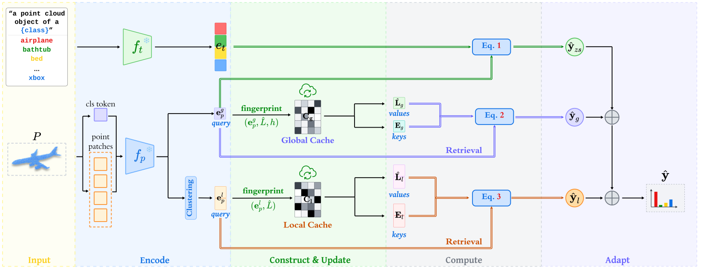

`图 2. Point-Cache 的整体流程。`通过我们的 **全局缓存 Logits** (global cache logits) $\hat{y}_{g}$ 和 **局部缓存 Logits** (local cache logits) $\hat{y}_{l}$，大型 3D 模型的 **零样本预测** (zero-shot predictions) $\hat{y}_{zs}$ 被有效地调整以处理 **分布偏移** (distribution shifts)，从而实现鲁棒且可泛化的点云分析。

​		**预备知识 (Preliminary)**。我们首先回顾现有 **大型多模态 3D 模型** (large multimodal 3D models) [29, 72, 73, 81, 88, 89] 的零样本推理过程。这些模型使用独立的编码器将输入的点云 $P\in\mathbb{R}^{N\times3}$ 和文本 $T$（例如，“a point cloud object of a {class}”）映射到一个共享的特征空间。记点云编码器为 $f_{p}(\cdot)$，文本编码器为 $f_{t}(\cdot)$，我们可以获得点云 $P$ 的 **全局特征** (global feature) $e_{p}^{g}=f_{p}(P)\in\mathbb{R}^{d}$ 以及文本特征 $e_{t}=f_{t}(T)\in\mathbb{R}^{d}$，其中 $d$ 是特征维度。为了以零样本方式识别输入点云 $P$，这些模型将文本 $T$ 中的“{class}”替换为 $C$ 个可能的类别名称中的每一个，并使用公式 (1) 计算类概率 $\hat{y}_{zs}$。
$$
\hat{y}_{i} = \frac{\exp(\text{sim}(e_{p}^{g}, e_{t}^{i})/\tau)}{\sum_{j=1}^{C} \exp(\text{sim}(e_{p}^{g}, e_{t}^{j})/\tau)} \tag1
$$
这里 $e_{t}^{i}$ 表示第 $i$ 个类别的文本编码。$\text{sim}(\cdot,\cdot)$ 衡量输入之间的余弦相似度，$\tau$ 是温度系数。最后，点云 $P$ 被分类为概率最高的类别，索引为 $\hat{L}=\arg\max\{\hat{y}_{i}|_{i=1}^{C}\}$。

​		如第 1 节所述，我们的分层缓存存储在线测试样本的 **指纹** (fingerprints)，这些指纹由 **键值对** (key-value pairs) 组成。键是由预训练的大型 3D 模型的点编码器提取的测试样本特征 $e_{p}^{g}$，值是由零样本推理预测的类别标签 $\hat{L}$。此外，我们计算零样本预测 $\hat{y}_{zs}$ 的 **熵** (entropy) $h=-\sum_{i=1}^{C}\hat{y}_{i}\log\hat{y}_{i}$，因为它对于评估大型 3D 模型产生该预测的置信度至关重要。此熵值被用于筛选我们缓存模型中的高质量样本。

### 3.1. Text & Point Cloud Encoding

​		我们可以如预备知识中所介绍的那样获得输入 $T$ 的文本编码 $e_{t}$ 和点云 $P$ 的全局特征 $e_{p}^{g}$。然而，由于图 3 中分析的以下挑战，表示点云 $P$ 的 **局部部件特征** (local-part features) $e_{p}^{l}$ 并非易事：

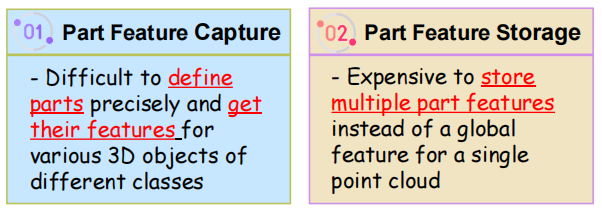

`图 3. 为不同类别的各种 3D 对象进行部件特征编码时面临的挑战：部件特征捕捉 (Part Feature Capture) 与 存储 (Storage)。`

(1) **部件特征捕捉 (Part Feature Capture)**：难以精确定义部件并获取不同类别各种 3D 对象的部件特征。
(2) **部件特征存储 (Part Feature Storage)**：为单个点云存储多个部件特征而非一个全局特征，成本高昂。

为了解决这些挑战，我们进行了仔细分析并开发了有效的解决方案（直观说明见补充材料图 9）。

(1) 一个直接的方法可能涉及使用额外的预训练分割网络来分割点云部件，但这在在线推理期间计算成本过高。相反，我们提出了`部件的模糊定义`。具体而言，由于大型 3D 模型点编码器的架构基于 **Transformer** [8, 57, 77] 且输入是一系列点补丁 (point patches)，我们避免根据物理语义（例如飞机的头、机身、机翼和尾部）进行严格的部件定义，而是`将最后一个编码器层输出的点补丁视为局部部件表示。`
(2) 第二个挑战是长的点补丁序列可能会占用大量资源；例如，ULIP-2 [73] 中的点编码器每个对象生成 512 个点补丁，这将需要大量内存。为了缓解这个问题，我们建议使用 K-Means **聚类** (Clustering) 将这些点补丁总结为 $m$ 个中心 $e_{p}^{l}\in\mathbb{R}^{m\times d}$（$m<10$），与存储所有补丁相比，内存使用量减少了两个数量级。

### 3.2. 分层缓存的构建与更新 (Construction & Update of Hierarchical Cache)

​		为了深入探索测试数据的分布，我们要开发一个 **分层缓存** (hierarchical cache) 来记录在线测试样本的指纹。该分层缓存既包括存储整体信息的 **全局缓存** (global cache)，也包括捕捉每个点云详细部件级信息的 **局部缓存** (local cache)。这种从粗到细的结构使得对测试数据的刻画更加精确，并将我们的方法与以前用于图像识别 [3-5, 13, 21, 23, 36, 48, 55, 58, 82, 83] 和点云分析 [53, 66, 84] 的缓存模型区分开来。分层缓存的完整构建过程在补充材料的算法 1 中概述。

​		`全局缓存`  表示为 $C_{g}=(E_{g},L_{g},h_{g})$，存储一组点云对象的（特征，标签，熵）三元组。为了有效管理存储，我们设计了一种选择机制来识别高质量的测试样本以放入缓存中。

- **构建**：我们设定缓存中每类样本数量的上限 $K$，允许每个类别最多放置 $K$ 个指纹（shots）。最初，全局缓存为空。当一个新的测试样本 $P$ 到达时，我们生成其指纹 $(e_{p}^{g},\hat{L},h)$ 并将其分配给类别 $\hat{L}$。
- **更新**：随着在线样本数量的增加，我们要检查类别 $\hat{L}$ 的样本数是否已达到上限。如果未达到，当前样本的指纹将被追加到类别 $\hat{L}$ 中。否则，我们在类别 $\hat{L}$ 中定位具有最高熵的指纹，并将其与当前测试样本的熵进行比较。如果当前测试样本具有更低的熵，我们用新指纹替换最高熵的指纹；否则，跳过当前样本。当缓存满时，$E_{g}$ 的维度为 $CK \times d$，$L_{g}$ 的维度为 $CK\times1$，$h_{g}$ 的维度为 $CK\times1$。

​		`局部缓存` 尽管点云的全局特征捕捉了富有表现力的信息，但它缺乏 3D 对象的局部细节，而这些细节对于点云识别至关重要，特别是当形状共享整体外观但在局部部件上有所不同时。局部缓存通过存储部件级信息来解决这一限制。我们将局部缓存记为 $C_{l}=(E_{l},L_{l})$，它存储点云对象局部部件的指纹。这里 $E_{l}$ 代表测试样本的部件特征，$\hat{L}_{l}$ 指示它们的标签。相应地，我们将测试样本 $P$ 的局部部件指纹定义为 $(e_{p}^{l},\hat{L})$，其中 $e_{p}^{l}\in\mathbb{R}^{m\times d}$ 对应于局部部件特征，$\hat{L}$ 是 $P$ 的类别标签。

- **构建与更新**：注意，局部缓存的样本选择机制遵循与全局缓存相同的规则，这意味着只有当测试样本有资格包含在全局缓存中时，其局部部件指纹才会被存储。因此，无需在局部缓存中再次记录熵 $h$。当缓存满时，$E_{l}$ 的维度为 $(m\cdot CK)\times d$，$L_{l}$ 的维度为 $CK\times1$。

### 3.3. 基于分层缓存的测试时适应 (Test-time Adaptation by Hierarchical Cache)

​		随着分层缓存作为一个丰富的在线点云数据知识库，我们可以针对新样本调整大型 3D 模型的零样本预测，从而有效解决测试时发生的分布偏移。适应过程遵循如下从粗到细的流程。

​		`基于全局缓存的测试时适应。`在适应过程中，一个新的样本 $Q$ 被视为一个查询 (query)，用于从全局缓存中检索知识，我们利用这些知识产生适应 **Logits** (logits)。具体而言，检索过程通过计算查询与缓存特征 $E_{g}$ 之间的 **亲和度** (affinity) $A_{g}$ 来模拟。这允许新样本与缓存的高质量样本建立连接，为其提供在线测试数据的上下文理解。然后，我们通过对缓存标签 $\hat{L}_{g}$ 进行`加权集成`来生成适应 Logits $\hat{y}_{g}$，如公式 (2) 所示。
$$
A_{g}=\exp(-\beta_{g}(1-e_{q}^{g}E_{g}^{\top})), \quad \hat{L}_{g}=\text{OH}(\hat{L}_{g}), \quad \hat{y}_{g}=A_{g}\hat{L}_{g} \tag2
$$
其中 $e_{q}^{g}\in\mathbb{R}^{1\times d}$ 代表样本 $Q$ 的全局特征，$E_{g}\in\mathbb{R}^{CK\times d}$ 表示缓存的键。`OH` 操作将 $\hat{L}_{g}$ 转换为 **独热** (one-hot) 编码。项 $e_{q}^{g}E_{g}^{\top}\in\mathbb{R}^{1\times CK}$ 衡量查询与所有键之间的余弦相似度，$\beta_{g}$ 作为超参数来调节锐度 (sharpness)，指数运算确保相似度值落在 $(0, 1]$ 范围内。亲和度 $A_{g}\in\mathbb{R}^{1\times CK}$ 掌握了查询与缓存键之间的关系，用于集成转换后的独热标签 $\hat{L}_{g}\in\mathbb{R}^{CK\times C}$，产生全局缓存适应 Logits $\hat{y}_{g}\in\mathbb{R}^{1\times C}$。

​		`基于局部缓存的测试时适应。`虽然全局缓存适应是有效的，但它可能无法处理测试时的细粒度分布偏移。为了实现更精确的调整，我们利用局部部件知识。点云 $Q$ 的局部部件特征 $e_{q}^{l}$ 作为局部缓存的查询。在检索过程中，我们计算 $e_{q}^{l}$ 与所有缓存部件特征 $E_{l}$ 之间的亲和度 $A_{l}$。然后使用亲和度 $A_{l}$ 对缓存标签 $L_{l}$ 进行加权，产生局部缓存适应 Logits $\hat{y}_{l}$，如公式 (3) 所示。
$$
A_{l}=\exp(-\beta_{l}(1-e_{q}^{l}E_{l}^{\top})), \quad L_{l}=\text{OH}(L_{l}), \quad \hat{y}_{l}=\phi(A_{l}L_{l}) \tag3
$$
其中 $e_{q}^{l}\in\mathbb{R}^{m\times d}$，$E_{l}\in\mathbb{R}^{(m\cdot CK)\times d}$，且 $\hat{L}_{l} \in \mathbb{R}^{(m\cdot CK)\times C}$。函数 $\phi(\cdot)$ 是对 $m$ 个部件的`平均池化操作`，以产生类别 Logits。项 $e_{q}^{l}E_{l}^{\top}\in\mathbb{R}^{m\times(m\cdot CK)}$ 衡量样本部件特征与缓存中所有部件特征之间的余弦相似度。同样，相似度由系数 $\beta_{l}$ 调节并用指数函数缩放，得到亲和度 $A_{l}\in\mathbb{R}^{m\times(m\cdot CK)}$。项 $A_{l}\hat{L}_{l}\in\mathbb{R}^{m\times C}$ 代表所有 $m$ 个部件的类别 Logits，通过池化操作 $\phi(\cdot)$ 转换，得出最终的局部缓存适应 Logits $\hat{y}_{l}\in\mathbb{R}^{1\times C}$。

​		`整体预测` 结合了三个部分，如公式 (4) 所示。大型多模态 3D 模型的零样本预测 $\hat{y}_{zs}$ 使用我们的全局缓存预测 $\hat{y}_{g}$ 和局部缓存预测 $\hat{y}_{l}$ 进行有效适应，并由系数 $\alpha_{g}$ 和 $\alpha_{l}$ 进行平衡。
$$
\hat{y}=\hat{y}_{zs}+\alpha_{g}\hat{y}_{g}+\alpha_{l}\hat{y}_{l} \tag4
$$

## 4 Experiments

### 4.1. Experimental Settings

​		`数据集。`为了评估点云识别的鲁棒性，我们选择了四个包含各种点云受损情况的公开数据集：**ModelNet-C** [43] 以及 **ScanObjectNN-C** [56] 的三个变体 。ModelNet-C 引入了 `7 种原子级损坏`，包括添加全局离群点、添加局部离群点、丢弃全局结构、丢弃局部部件、旋转、缩放和抖动 。其他损坏可以从这些原子损坏中衍生 。我们将这些原子损坏应用于 ScanObjectNN 的三个变体中，生成其受损版本 。为了评估在未见新数据上的泛化性，我们在四个挑战性基准上测试了所提方法：**OmniObject3D** [69]（216 类）、**Objaverse-LVIS** [7]（1,156 类）、ScanObjectNN 的最难变体以及广泛使用的 **ModelNet40** [70] 。主要评估指标为识别准确率 (%) 。

​		`实现细节。`我们选择 **ULIP** [72]、**ULIP-2** [73]、**OpenShape** [29] 和 **Uni3D** [88] 作为实验的大型多模态 3D 模型 。加载并冻结它们的预训练权重。通过修改前向传播函数而不改变模型架构来生成全局和局部部件特征 。缓存中每类最大样本数 $K$ 设置为 3，每个点云被聚类为 $m=3$ 个局部部件 。平衡因子 $\alpha_g$ 和 $\alpha_l$ 均设为 4.0，系数 $\beta_g$ 和 $\beta_l$ 均设 for 3.0 。我们将在消融研究中检查这些设计选择 。为了优化内存和计算，我们在 PyTorch 中将输入点云和模型参数转换为 `fp16` 类型 。所有实验均在两块 4090 GPU 上进行 。

### 4.2. 测试时鲁棒性与泛化性 (Test-time Robustness and Generalization)

​		`鲁棒性。`我们在 4 个点云受损数据集上对无需训练的测试时分层缓存进行了鲁棒性分析 。如表 1 所示，各种大型 3D 模型在 ModelNet-C 上的零样本准确率通过我们的全局缓存模型得到了显著提升，在 7 种损坏类型下的平均提升幅度为：ULIP (+5.04%)、ULIP-2 (+3.23%)、OpenShape (+2.94%) 和 Uni3D (+3.86%) 。通过结合全局和局部缓存，我们的分层缓存模型获得了进一步提升，突显了引入局部缓存的益处 。值得注意的是，这些收益不仅限于受损数据，我们的分层缓存模型还提高了在洁净 ModelNet 数据集上的识别准确率，例如比 ULIP 的零样本性能绝对值提升了 8.06% 。OpenShape 是个例外，它在洁净数据上保持了略高于我们缓存模型的零样本准确率 。然而，考虑到 7 种损坏类型时，我们的全局和分层缓存模型分别超过 OpenShape 2.94% 和 3.10%，证明了测试时针对数据损坏的鲁棒性有所增强 。

`表 1. 在包含 7 种损坏类型的 ModelNet-C 上的识别准确率对比。每个洁净点云包含 1024 个点，损坏严重程度等级为 2。最后一列是 7 种损坏类型的平均值。最佳结果以粗体显示，次优结果带下划线。除非另有说明，此设置适用于后续表格。`

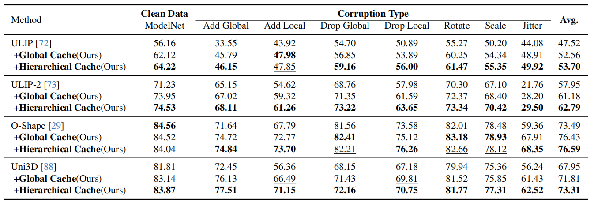

​		`泛化性。`我们在四个代表性基准上评估了 Point-Cache 的泛化能力，这些基准在大型 3D 模型预训练期间是不可见的 。如表 2 所示，Point-Cache 一致地提升了各数据集和 3D 主干网络的识别准确率 。例如，基于 ULIP 和 ULIP-2 构建的分层缓存分别在 6 项评分的平均值上实现了 6.31% 和 5.51% 的绝对提升 。在具有挑战性的 Objaverse-LVIS (O-LVIS) 上，我们的全局缓存结合 ULIP-2 在 1,156 个类别中实现了 2.39% 的零样本准确率绝对提升，这是一项显著的成就 。此外，我们的缓存模型使 Uni3D 在无需任何训练的情况下在 ModelNet40 上达到了 89.18% 的准确率，有效匹配了全监督的 PointNet (89.20%) 

`表 2. 一系列数据集上的识别准确率对比。S-PB_RS_T50 是 ScanObjectNN 中难度最高的划分。O-LVIS：Objaverse-LVIS。Omni3D：OmniObject3D。每个数据集下方的数字表示每个对象的点数 (pts)。在 Omni3D 中，每个点云可以用不同数量的点表示。最后一列是这些数据集上的平均准确率。`

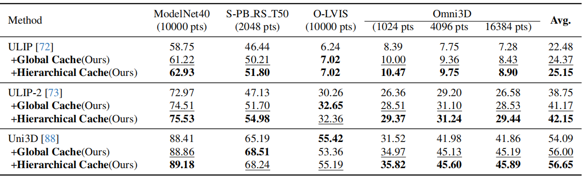

### 4.3. 内存使用量与吞吐量 (Memory Usage and Throughput)

​		`内存。` 我们使用 Uni3D [88] 作为基准，并使用 Point-Cache 对其零样本预测进行自适应。实验在表 3 所示的三个数据集上进行。由于我们需要根据每一个样本更新缓存并调整类别 **Logits** (logits)，因此批次大小 (Batch size) 设置为 1。结果表明，在各个数据集上，我们的全局缓存和分层缓存所消耗的内存与基准模型相似或略高。此外，随着类别数量的迅速增加，内存使用量的增长速度较慢。这主要是因为内存消耗主要由 Uni3D 庞大的参数量（例如 $1,016.5M$）所主导。相比之下，在 O-LVIS 上构建的分层缓存仅使用了约 $7.1M$ 个参数，与 Uni3D 相比几乎可以忽略不计。详细的计算过程见补充材料。

`表 3. 内存使用量 (MB) 对比。批次大小 (Batch size) 设置为 1，使用的设备是 RTX 4090。每个数据集下方的数字表示类别数量 (#Classes)。Hierar：分层缓存 (Hierarchical Cache)。`

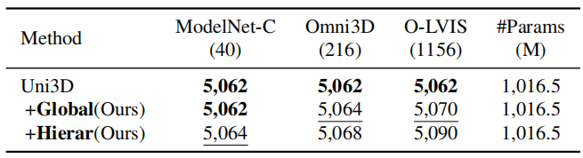

​		`吞吐量。` 我们在 ModelNet40 上评估了 Point-Cache 的吞吐量，吞吐量以每秒处理的测试样本数量（缩写为 t/s）来衡量。结果如表 4 所示。由于缓存更新、**Logits** (logits) 计算等引入了额外的开销，Point-Cache 的运行速度略慢于**零样本推理** (zero-shot inference)。然而，吞吐量的下降是极小的，例如，OpenShape 在使用全局缓存时仅下降了 $0.04$ t/s，而 ULIP-2 在使用分层缓存时也仅下降了 $0.07$ t/s。这些结果证明，Point-Cache 在带来显著准确率提升的同时，其计算成本几乎可以忽略不计。

`表 4. 不同模型在 ModelNet40 上的 吞吐量 (throughput) (t/s) 对比。批次大小设置为 1，设备为 4090 GPU。结果是对所有测试样本取平均值。`

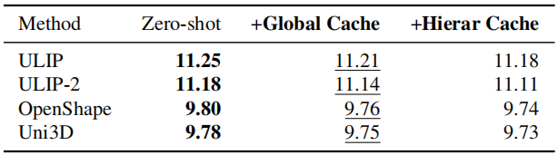

### 4.4. 消融研究 (Ablation Study)

​		如图 4 所示，我们结合我们的 **分层缓存** (hierarchical cache) 使用 Uni3D 在 4 个公共数据集上进行了消融分析。

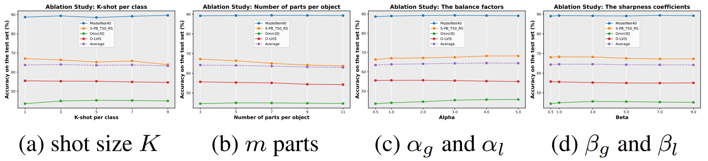

`图4. 缓存设计中超参数的消融研究，包括每类样本规模K、每个对象的部件数量m、最终预测Logits中的平衡因子以及亲和度计算中的锐度系数。`

​		`全局缓存中每类的样本规模` 每类样本数量的上限 $K$ 是一个关键变量，因为它会影响 **分层缓存** 的总大小。我们分析了它对 4 个数据集测试时识别准确率的影响，如图 4a 所示。随着 $K$ 的增加，各数据集的准确率趋势有所不同；例如，Omni3D 的准确率有所提高，而 S-PB T50 RS 的准确率则有所下降。我们采用 $K = 3$，因为它产生了最佳的平均准确率 ($63.98\%$)。结果表明，我们的缓存模型不需要大量的样本即可实现强大的性能。

​		`每个 3D 对象的局部部件数量` 为了优化内存和计算，我们将一个 3D 对象的数百个 **点补丁** (point patches) 聚类为 $m$ 个部件。我们研究了该变量对测试时性能的影响，如第 4b 图所示。对于四个数据集中的三个（即 S-PB T50 RS、Omni3D 和 O-LVIS），准确率通常随着部件数量的增加而下降，这表明点云不需要用过多的部件来表示。我们默认选择 $m = 3$，因为该设置在 4 个数据集上达到了最佳的平均准确率。

​		`平衡因子` 因子 $\alpha_{g}$ 和 $\alpha_{l}$ 控制着全局缓存预测 $\hat{p}_{g}$ 和局部缓存预测 $\hat{p}_{l}$ 的相对权重。为了简化实验，我们在消融研究中设置 $\alpha_{g} = \alpha_{l}$。候选值为 $\{0.5, 1.0, 2.0, 3.0, 4.0, 5.0\}$。如图 4c 所示，增大这些因子提高了在 S-PB T50 RS 和 Omni3D 上的性能，而对 ModelNet40 和 O-LVIS 的影响极小。我们将这些因子设置为 $4.0$，这在所有四个数据集上产生了最优的平均准确率。

​		`锐度系数` 系数 $\beta_{g}$ 和 $\beta_{l}$ 用于调节查询-键（query-key）**亲和度** (affinity) 的锐度。在此，我们分析了它们对 4 个基准测试中测试时准确率的影响。同样，我们令 $\beta_{g} = \beta_{l}$，候选值为 $\{0.5, 1.0, 3.0, 5.0, 7.0, 9.0\}$。如图 4d 所示，准确率最初随着锐度的增加而略有提高，但当锐度过高时则会下降。我们将锐度设置为 $3.0$，这在 4 个数据集上产生了最优的平均结果。

### 4.5. Visualization

​		`在线推理` 我们对 Point-Cache 在不同大型 3D 模型下的在线推理过程进行了可视化，并对比了三种模型变体：**零样本预测** (zero-shot prediction)、带有全局缓存的模型以及带有分层缓存的模型，参见图 5。在推理过程中，我们计算了累积样本的平均识别准确率。由于初始阶段样本数量较少，平均准确率可能会剧烈波动，因此我们排除了前 5 个样本的统计数据。总体而言，采用**分层缓存** (hierarchical cache) 的方法在各种大型 3D 模型和数据集上始终明显优于其他变体。

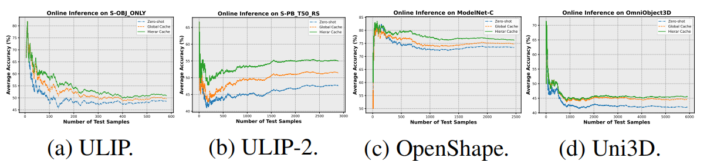

`图 5. 在线推理过程中累积样本的平均识别准确率。由于初始阶段样本数量较少，曲线波动显著。结合了我们的全局缓存和分层缓存 (hierarchical cache) 的模型获得了明显的性能提升。`

​		`熵与准确率` 图 6 展示了不同模型在各种数据集上熵与准确率之间的关系。在在线推理期间，我们首先计算每个测试样本前 5 个预测结果的**熵** (entropy)，然后对所有累积样本的熵取平均值。同样地，可以计算出相应的平均准确率。结果表明，Point-Cache 有效地降低了大型 3D 模型零样本预测的不确定性，增强了预测置信度，从而提升了识别准确率。此外，我们观察到，与全局缓存模型相比，分层缓存模型在降低熵方面更为有效，这进一步强调了引入局部缓存的重要性。

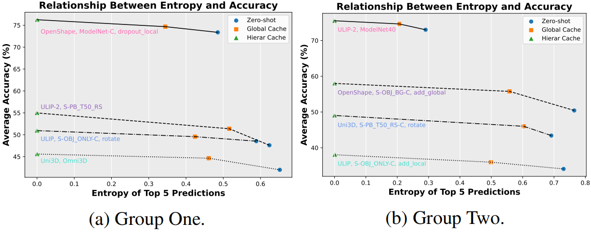

`图 6. 熵与准确率之间的关系。在各种基准测试中，带有我们全局缓存和分层缓存的模型始终表现出更低的熵 (entropy) 和更高的准确率。`

​		`定性分析` 图 7 展示了 Point-Cache 逐步适应的过程。前三行展示了全局缓存模型试图调整各种大型 3D 模型的零样本预测但失败的案例。相反，分层缓存模型在全局缓存的基础上成功地优化了类别 **Logits** (logits)。在最后一行中，我们的全局缓存模型在第一步就修正了零样本预测，随后分层缓存模型保留了该顶尖类别并提升了其置信度。此处展示的示例并非刻意挑选。更多的定量和定性结果可以在补充材料中找到。

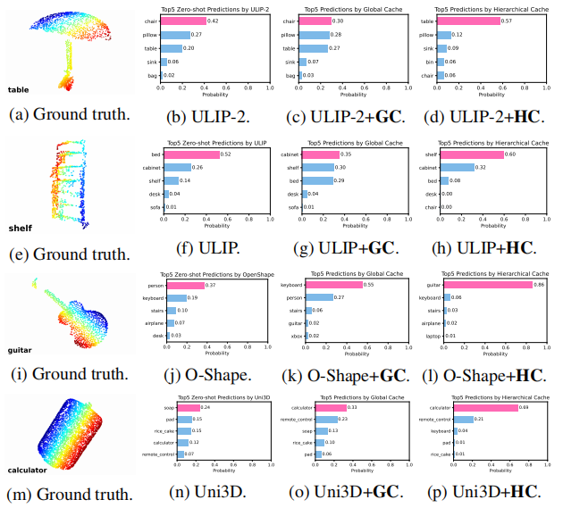

`图 7. Point-Cache 适应前后的零样本预测结果对比。GC：全局缓存 (Global Cache)。HC：分层缓存 (Hierarchical Cache)。`

## 5. Conclusion

​		本文在一种实际且具有挑战性的设定下探讨了**测试时点云识别**，在此设定中仅有测试数据和**预训练模型** 可用。我们开发了 **Point-Cache**，这是一个强大的 **3D 知识库**，旨在增强模型在测试时的**鲁棒性** 和**泛化性**。它通过**全局缓存**和**局部缓存** 记录在线测试样本的**指纹** ，从而为 3D 数据构建更精确的特征画像。Point-Cache 被设计为一个即插即模块，能够无缝集成到各种大型 3D 模型中且不损失效率，支持针对已知类别和未见类别的**开放词汇点云识别**，有效解决了此前测试时方法的局限性。

---

Hierarchical Cache（分层缓存）不是局部缓存在文中表 1 以及整篇论文的语境下，**Hierarchical Cache（分层缓存）** 并不等同于局部缓存，而是 **“全局缓存 + 局部缓存” 的完整结合体**。

我们可以这样拆解：

1. **全局缓存 (Global Cache)**：
   - 关注的是点云的**整体指纹**（Global Structure）。
   - 它记录的是物体的宏观形状。
2. **局部缓存 (Local Cache)**：
   - 关注的是点云的**细节补丁/部件**（Local-part Details）。
   - 它将点云拆解为 $m$ 个部件进行匹配。
3. **分层缓存 (Hierarchical Cache)**：
   - 它是论文提出的**最终完整版方案**。
   - 它通过**层级化（Hierarchical）**的方式，同时利用了全局的“大轮廓”和局部的“细部件”信息。
   - 在表 1 中，标注为 "Hierar" 或 "Hierarchical Cache" 的行，代表的是该模型开启了全套缓存机制后的性能表现，这通常也是论文中效果最好的结果。