# PointCLIP: Point Cloud Understanding by CLIP

## Abstract

​		最近，通过**对比图文预训练**（**CLIP**）进行的**零样本**和**少样本学习**在2D视觉识别方面表现出了令人振奋的性能，该方法学习在**开放词汇**设置下将图像与其对应的文本进行匹配 。然而，在2D中通过大规模图文对预训练的 **CLIP** 是否可以泛化到3D识别，目前仍缺乏深入探索 。在本文中，我们通过提出 **PointCLIP** 证明了这种设置是可行的，该方法在经过 **CLIP** 编码的**点云**与3D类别文本之间进行对齐 。具体而言，我们通过将**点云**投影到**多视图深度图**上对其进行编码，并以**端到端**的方式聚合各视图的**零样本预测**，从而实现了从2D到3D的高效知识迁移 。我们进一步设计了一个**视图间适配器**，以更好地提取**全局特征**，并将3D**少样本**知识自适应地融合到在2D中预训练的 **CLIP** 中 。通过仅在**少样本**设置下对该**适配器**进行**微调**，**PointCLIP** 的性能可以得到大幅提升 。此外，我们观察到 **PointCLIP** 与经典的3D监督网络之间存在`知识互补性` 。通过在推理过程中进行简单的**集成**，**PointCLIP** 有助于在最先进的3D网络基础上实现良好的性能增强 。因此，对于在**低数据量**机制下以极小的资源成本进行有效的3D**点云理解**，**PointCLIP** 是一个极具前景的替代方案 。我们在 **ModelNet10**、**ModelNet40** 和 **ScanObjectNN** 上进行了详尽的实验，以证明 **PointCLIP** 的有效性 。

## 1 Introduction

​		近年来，深度学习在2D和3D领域的计算机视觉任务中都占据了主导地位，例如图像分类、目标检测、**语义分割**、**点云识别**和**部件分割** 。随着3D传感技术的飞速发展，处理3D**点云**数据的日益增长的需求催生了许多具有更好**局部特征聚合器**、**几何建模**和**基于投影的处理**的先进深度模型 。与基于网格的2D图像数据不同，3D**点云**具有空间**稀疏性**和不规则分布的特点，这阻碍了方法从2D领域的直接迁移 。更重要的是，大量新采集的**点云**包含对于已部署模型而言“未见”类别的物体 。在这种情况下，即使是性能最好的分类器也可能无法识别它们，而且每当出现“未见”物体时就重新训练模型的成本是无法承受的 。

​		通过**对比视觉-语言预训练**（**CLIP**） ，2D 视觉中类似的问题已得到极大缓解，该方法提出利用**自然语言监督**来学习**可迁移视觉特征** 。对于**“未见”类别**的**零样本分类**，**CLIP** 利用预训练的视觉与语言之间的相关性来进行**开放词汇识别**，并取得了令人振奋的性能 。为了提高**少样本设置**下的准确率，CLIP 采用**可学习词元**（learnable tokens）来编码文本输入，避免了对**手工设计提示**的调整 。从另一个角度看，**CLIP-Adapter** 附加了一个带有两个线性层的轻量级**残差风格适配器**，以更好地适配图像特征，而 **Tip-Adapter** 则进一步提升了性能，同时大幅减少了训练时间 。因此，在 2D 图像上识别新的未标记对象的问题已得到充分探索，并且所提出的方法相比**零样本 CLIP** 取得了显著改进 。然而，对于更具挑战性的**点云**，自然产生了一个问题：这类基于 **CLIP** 的模型能否迁移到 3D 领域，并实现对**“未见” 3D 对象**的**零样本分类**？ 

​		为了解决这一问题，我们提出了 **PointCLIP**，它将 **CLIP** 的 2D 预训练知识迁移到 3D **点云理解**中 。首要考量是弥合**无序点云**与 **CLIP** 所能处理的**基于网格的图像**之间的**模态间隙** 。考虑到自动驾驶和室内导航等某些应用的实时性需求，我们建议采用**在线透视投影** ，而不进行任何**后渲染** ，即`直接将原始点投影到预定义的图像平面上以生成散点深度图` 。这种投影过程在时间和计算上的成本都极低，但保留了来自多个视图的**点云**原始属性 。在此基础上，我们`应用 CLIP 预训练的视觉编码器来提取点云的多视图特征`，`然后通过文本生成的分类器获得每个视图的零样本预测` 。其中，我们将 3D 类别名称放入手工设计的模板中，并通过 `CLIP 预训练的文本编码器生成零样本分类器` 。由于不同视图对理解的贡献不同，我们通过`视图间的加权聚合`获得**点云**的最终预测 。

​		尽管 **PointCLIP** 在没有任何 3D 训练的情况下实现了**跨模态零样本分类**，但其性能仍落后于在完整数据集上训练良好的经典**点云网络** 。为了消除这一差距，我们引入了一个带有**瓶颈线性层**（bottleneck linear layers）的`可学习视图间适配器`，以便在**少样本设置**下更好地从多个视图中提取特征 。具体而言，我们拼接所有视图的特征，并通过**跨视图交互**与融合来汇总**点云**的紧凑**全局特征** 。基于该**全局表示**，生成每个视图的**适配特征**，并通过**残差连接**将其添加到原始的 **CLIP** 编码特征中 。通过这种方式，每个视图都能感知全局信息，并将来自 3D **少样本数据集**的新知识与预训练 **CLIP** 的 2D 知识结合起来 。在训练期间，我们仅**微调**该**适配器**，并冻结 **CLIP** 的视觉和文本编码器以避免**过拟合**，因为每个类别仅有的少量样本不足以训练 **CLIP** 。通过**少样本微调**，带有**视图间适配器**的 **PointCLIP** 大幅提高了**零样本**性能，并在性能与成本之间取得了良好的平衡 。

​		此外，我们观察到 **CLIP** 的 2D 知识（由**对比图文对**监督学习得到）与 3D **闭集监督**（close-set supervisions）具有互补性 。带有**视图间适配器**的 **PointCLIP** 可用于提升经典的、经过完全训练的 3D 网络的性能 。对于准确率为 89.71% 的 **PointNet++** ，我们采用了在 16-样本（**16-shot**）**ModelNet40** 上微调后的、准确率为 87.20% 的 **PointCLIP**，并在**推理**过程中直接**集成**（**ensemble**）它们的预测**分类对数几率**（**Logits**） 。其性能提升了 +2.32%，从 89.71% 提高到了 92.03% 。同样对于最先进的（**SOTA**）3D 识别网络 **CurveNet** ，这种知识**集成**使性能从 93.84% 提升至 94.08% 。相比之下，在没有 **PointCLIP** 的情况下，简单地在两个于 **ModelNet40** 上经过完全训练的模型之间进行**集成**，无法带来性能提升 。因此，**PointCLIP** 可以被视为一个**即插即用**的**多知识集成模块**，它通过 2D **对比知识**和极少量的**少样本训练**来促进 3D 网络的性能 。

​		本论文的贡献如下 ：

- 我们提出了 **PointCLIP**，将 **CLIP** 扩展到处理 3D **点云**数据，通过将 2D 预训练知识迁移到 3D 中，实现了**跨模态零样本识别** 。
- 在 **PointCLIP** 的基础上引入了**视图间适配器**，通过多个视图之间的**特征交互**，通过**少样本微调**大幅提升了性能 。
- **PointCLIP** 可作为**多知识集成模块**，用于增强现有经过完全训练的 3D 网络的性能 。
- 在广泛采用的 **ModelNet10**、**ModelNet40** 和具有挑战性的 **ScanObjectNN** 上进行了全面的实验，表明了 **PointCLIP** 在有效 3D 理解方面的潜力 。

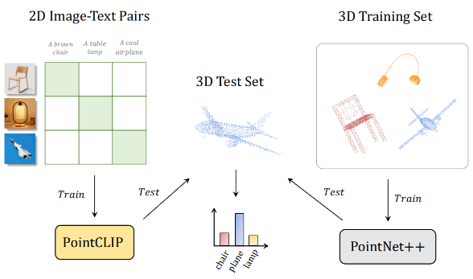

`图 1. PointCLIP 与 PointNet++ 训练-测试方案的对比。 与经典的 3D 网络不同，我们提出的 PointCLIP 是通过 2D 图像-文本对预训练的，并且在没有 3D 训练的情况下直接在 3D 数据集上进行零样本分类，从而实现了高效的跨模态知识迁移。`

## 2 Related Work

​		`3D 中的零样本学习。`**零样本学习**的目标是实现对未作为训练样本采用的“未见”物体的识别 。虽然零样本学习在 2D 分类中引起了广泛关注，但只有少数工作探索了如何在 3D 领域开展该研究 。作为在点云上的首次尝试，文献 [7] 将 3D 数据集分为两个部分，分别由“已见”和“未见”样本组成 。通过学习一个从点云特征空间到**类别语义空间**的**投影函数**，文献 [7] 利用“已见”样本训练 **PointNet**，并在“未见”样本上对其进行测试 。在这项前序工作的基础上，文献 [5] 进一步缓解了由低质量 3D 特征导致的**枢纽性问题**（**hubness problem**），而文献 [6] 引入了**三元组损失**（**triplet loss**），以便在**直推式设置**（**transductive settings**）下获得更好的性能，这种设置允许利用未标记的“未见”数据进行训练 。与上述所有通过部分 3D 样本训练网络并对其他样本进行预测的设置不同，`PointCLIP 仅利用 2D 数据进行预训练，并在没有任何 3D 训练的情况下，实现了对“未见” 3D 样本的直接零样本识别` 。因此，考虑到从 2D 到 3D 的**领域间隙**（**domain gap**），我们的设置更具挑战性，且对于实际问题而言更为紧迫 。

​		`迁移学习` 旨在利用来自数据丰富领域（data-abundant domains）的知识来辅助数据匮乏领域（data-scarce domains）的学习 。对于通用视觉，**ImageNet** **预训练**可以极大益于各种**下游任务**（downstream tasks），例如**目标检测** 和**语义分割** 。同样在**自然语言处理**中，通过**掩码语言模型** 在网页抓取语料库上预训练的表示，在**机器翻译** 和**自然语言推理** 上取得了领先的性能。在不进行任何**微调**的情况下，最近引入的 **CLIP** 对“未见”数据集展现出了卓越的图像理解能力 。**CoOp** 、**CLIP-Adapter** 、**Tip-Adapter** 等 进一步表明，通过注入特定领域（domain-specific）的监督信息，**CLIP** 的性能可以得到大幅提升 。尽管这些成功案例令人鼓舞，但除了 **Image2Point** 之外，现有的大多数方法都是在同一**模态**内进行**知识迁移**，即图像到图像 、视频到视频 或语言到语言 。与这些方法不同，`我们的 PointCLIP 能够有效地将从 2D 图像中学习到的表示迁移到迥异的 3D 点云中，这激励了未来关于跨模态迁移学习的研究 。`

​		`点云深度神经网络。`现有的**点云深度神经网络** 可以分为**基于点的方法**（point-based）和**基于投影的方法**（projection-based） 。**基于点的方法** 直接处理原始点，不需要任何预变换 。**PointNet** 和 **PointNet++** 首先使用**多层感知机**（**MLP**）编码每个点，并利用**最大池化**操作来确保**置换不变性** 。最近的**基于点的方法**提出了更先进的架构设计以及**几何提取器** ，以实现更好的**点云解析** 。除了原始点之外，**基于投影的方法** 通过将**点云**转换为**体素化**（volumetric）数据 或**多视图**（multi-view）数据形式来理解它们 。其中，**多视图方法** 将**点云**投影到多个视角的图像上，并使用在 **ImageNet** 上预训练的 2D **卷积神经网络**（**CNN**）进行处理 ，例如 **MVCNN** 等 。通常，这类视图投影方法操作于从 3D **网格**（meshes）投影出的离线生成图像 ，或者需要进行涉及阴影和纹理的**后渲染**（post-rendering） ，这些方法成本高昂，且难以应用于实时任务 。相反，我们遵循 **SimpleView** 的做法，`直接将原始点投影到图像平面上而不进行处理，并根据垂直距离设置它们的像素值` 。这种**深度图投影** 产生的时间和计算成本微乎其微，满足了高效**端到端零样本识别**的需求 。

## 3 Method

​		在第 $3.1$ 节中，我们首先回顾用于 2D **零样本分类**的**对比视觉-语言预训练**（**CLIP**） 。随后在第 $3.2$ 节中，我们介绍了我们的 **PointCLIP**，它将 2D 预训练知识迁移到 3D **点云**中 。在第 $3.3$ 节中，我们提供了一个**视图间适配器**，以获得更好的**少样本性能**。在第 $3.4$ 节中，我们提出将 **PointCLIP** 与经过完全训练的经典 **3D 网络**进行**集成**，以实现**多知识互补**。

### 3.1 A Revisit of CLIP

​		CLIP 经过预训练，用于将图像与其相应的自然语言描述进行匹配。在 **CLIP** 中分别有两个独立的**编码器**，分别用于**视觉特征**和**文本特征**的编码。在训练期间，给定一批图像和文本，**CLIP** 提取它们的特征，并学习在**嵌入空间**中通过**对比损失**对齐它们。为了确保全面的学习，研究者从互联网上收集了 $4$ 亿对训练图文对，这使得 **CLIP** 能够将图像与**开放词汇**中的任何语义概念对齐，从而进行**零样本分类**。

​		具体而言，对于一个具有 $K$ 个类别的“未见”数据集，**CLIP** 通过将所有类别名称放入一个预定义的模板（即**提示**）中来构建文本输入。然后，通过类别文本的 $C$ 维文本特征获得**零样本分类器**，该分类器的权重我们记为 $W_t \in \mathbb{R}^{K \times C}$。$W_t$ 中的 $K$ 个行向量中的每一个都编码了预训练的类别知识。与此同时，测试图像的特征被 **CLIP** 的**视觉编码器**编码为 $f_v \in \mathbb{R}^{1 \times C}$，而**分类对数几率** $\in \mathbb{R}^{1 \times K}$ 的计算公式如下：
$$
\text{logits} = f_v W_t^T; \quad p = \text{SoftMax}(\text{logits}), \tag1
$$
其中 $\text{SoftMax}(\cdot)$ 和 $p$ 分别表示 **Softmax 函数**以及 $K$ 个类别的预测概率。整个过程不需要任何新的训练图像，且通过预训练的**编码器**实现了令人振奋的**零样本分类**性能。

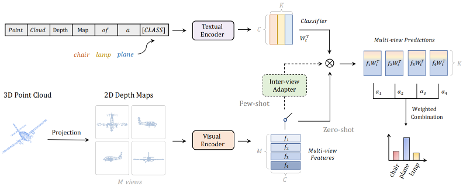

`图 2. PointCLIP 的流水线。 为了弥合模态间隙，PointCLIP 将点云投影到多视图深度图上，并通过在 2D 中预训练的 CLIP 进行 3D​ 识别。该开关分别以实线和虚线提供了直接零样本分类和使用视图间适配器进行少样本分类的选择方案。`

### 3.2. Point Cloud Understanding by CLIP

​		$2D$ 领域的各种**大规模数据集** [28, 31] 提供了丰富的样本来**预训练模型** [11, 22]，用于提取高质量且**鲁棒**的 $2D$ 特征。相比之下，被广泛采用的 $3D$ 数据集规模相对较小，且包含的物体类别有限，例如具有 $9,843$ 个样本和 $40$ 个类别的 **ModelNet40** [58]，而 **ImageNet** [28] 则拥有 $100$ 万个样本和 $1,000$ 个类别 。因此，很难获得性能良好的**预训练** $3D$ 网络用于**迁移学习** 。为了缓解这一问题并探索 **CLIP** 的**跨模态**能力，我们提出了 **PointCLIP**，基于**预训练**的 **CLIP** 对**点云**进行**零样本学习** 。

​		`弥合模态间隙。`**点云**数据是在 $3D$ 空间中散布的一组**无序点**，其**稀疏性**和分布与**基于网格**的 $2D$ 图像大不相同 。为了将**点云**转换为 **CLIP** 可访问的**表示**，我们生成了来自多个视图的**点投影图像**，以消除 $3D$ 和 $2D$ 之间的**模态间隙** 。具体而言，如果一个点的**坐标**表示为 $(x, y, z)$，以底视图（bottom view）为例，遵循 [19]，其在**图像平面**上的投影位置为 $(\lceil x/z \rceil, \lceil y/z \rceil)$ 。通过这种方式，投影的**点云**是一个**透视收缩**的图形，即远小近大，这与真实照片更加相似 。不同于 [19] 应用一个**卷积层**将**单通道深度图**预处理为**三通道特征图**，我们不采用任何预变换，并为所有三个通道重复像素值 $z$ 。此外，我们不进行任何**离线处理** [49, 55]，直接从没有颜色信息的原始点获取投影**深度图**，这产生了极小的时间和计算成本 。通过这种轻量级的**跨模态衔接**，**CLIP** 的**预训练知识**随后便可用于**点云理解** 。

​		`零样本分类`  基于来自 $M$ 个视图的投影图像，我们通过**视觉编码器**使用 **CLIP** 提取它们的**视觉特征** $\{f_i\}$，其中 $i=1,\dots,M$ 。对于**文本分支**，我们将 $K$ 个类别名称放入预定义模板的**类别词元**位置：“point cloud depth map of a [CLASS].” ，并将它们的**文本特征**编码为**零样本分类器** $W_t \in \mathbb{R}^{K \times C}$ 。在此基础上，分别计算每个视图的**分类对数几率** $logits_i$，并通过它们的**加权求和**获取**点云**的最终**对数几率** ：
$$
\begin{aligned} &logits_i = f_i W_t^T, \quad \text{for} \quad i=1,\dots,M, \\ &logits = \sum_{i=1}^M \alpha_i logits_i, \end{aligned} \tag2
$$
其中 $\alpha_i$ 是衡量视图 $i$ 重要性的**超参数**。每个视图的 $f_i$ 编码了**点云**的一个不同视角，并且能够进行独立的**零样本分类** 。它们的**聚合**进一步互补了来自不同视角的视角信息，以实现整体理解 。对于“未见”的 $3D$ 数据集，**PointCLIP** 的整个过程是**无参数**的，它通过 **CLIP** 预训练的 $2D$ 知识将每个点云与其类别配对，而无需任何 $3D$ 训练 。

### 3.3. Inter-view Adapter for PointCLIP

​		虽然 **PointCLIP** 在**点云**上实现了高效的**零样本分类**，但其性能无法与那些经过完全训练的 $3D$ **神经网络** 相提并论。我们随后考虑一种更常见的场景，即新收集的数据中包含每个“未见”类别的少量物体，并且要求网络在这些**少样本设置**下识别它们 。**微调**整个 **CLIP** 是不切实际的，因为庞大的参数量和不足的训练样本很容易导致**过拟合** 。因此，参考自然语言处理（NLP）领域以及用于在**下游任务**上**微调** **CLIP** 的 **CLIP-Adapter** `，我们在 PointCLIP 之上添加了一个三层多层感知机（MLP），称为视图间适配器，以进一步增强其在少样本设置下的性能` 。在训练期间，我们冻结 **CLIP** 的**视觉编码器**和**文本编码器**，仅通过`交叉熵损失`微调可学习的**适配器**。

​		具体而言，给定一个**点云**的由 **CLIP** 编码的 $M$ 视图特征，我们将它们沿通道维度拼接为 $Concate(f_{1\sim M}) \in \mathbb{R}^{1 \times MC}$，然后通过视图间适配器的两个线性层获得紧凑的**全局表示** ：
$$
f_{global} = ReLU(Concate(f_{1\sim M})W_1^T)W_2, \tag{3}
$$
其中 $f_{global} \in \mathbb{R}^{1 \times C}$，而 $W_1$、$W_2$ 代表**适配器**中的两层权重 。通过这种**视图间聚合**，来自多个视角的特征被融合为一个总结性向量。在此基础上，从**全局特征**中生成每个视图的**适配特征**，并将其通过**残差连接**添加到其原始的 **CLIP** 编码特征中 ：
$$
f_i^a = f_i + ReLU(f_{global}W_{3i}^T)\tag{4}
$$
其中 $W_{3i} \in \mathbb{R}^{C \times C}$ 表示 $W_3$ 中对应视图 $i$ 的第 $i$ 部分 。**视图间适配器**展现出两个优点：其一，$f_i^a$ 将**全局引导**的**适配特征**与 $f_i$ 混合，以实现对**点云**的整体理解；其二，新学习到的 $3D$ **少样本知识**被注入到 $2D$ **预训练** **CLIP** 中，这通过特定于 $3D$ 的监督进一步提升了**跨模态**性能 。

​		在**视图间适配器**之后，每个视图使用**适配特征** $f_i^a$ 和**文本分类器** $W_t$ 进行分类 。与**零样本分类**相同，所有来自 $M$ 个视图的 $M$ 个**对数几率**被汇总以构建最终预测 。令人惊讶的是，仅使用**少样本样本**微调这个附加的**适配器**就能带来显著的性能提升，例如在每个类别 $16$ 个样本（不及完整数据的1/10）的情况下，在 **ModelNet40** 上的准确率从 $20.18\%$ 提升到 $87.20\%$ 。这种令人振奋的提升证明了在 $3D$ **少样本数据**上进行**特征适配**的有效性和重要性，这极大地促进了从 $2D$ 到 $3D$ 的**知识迁移** 。因此，带有**视图间适配器**的 **PointCLIP** 为**点云理解**提供了一个极具前景的替代方案 。特别是对于某些应用场景，在没有条件利用大规模完全标注数据训练整个模型的情况下，仅使用**少样本**数据对 **PointCLIP** 的三层**适配器**进行**微调**，就能获得具有竞争力的性能。

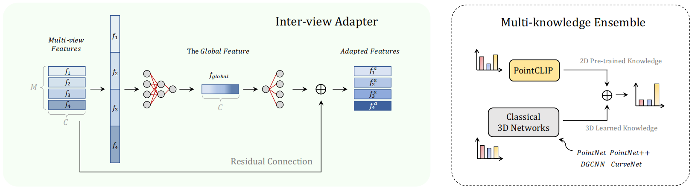

`图 3. 视图间适配器的详细结构。 给定一个点云的多视图特征，该适配器提取其全局表示并生成各视图的适配特征 。通过残差连接，新学习的 3D​ 知识被融合到预训练的 CLIP 中 。`

### 3.4. Multi-knowledge Ensemble

​		经典的**点云网络**，从早期的 **PointNet** 到最近的 **CurveNet**，都是在 $3D$ 数据集上通过**闭集监督**从头开始训练的，但 **PointCLIP** 主要继承了来自 $2D$ **视觉-语言学习**的**预训练先验**，并包含了知识的不同方面。我们随后研究了这两种形式的知识是否可以**集成**在一起，以实现更好的联合**推理**。在实践中，我们选择了两个模型：**PointNet++** 和我们在 $16$**-样本**（$16$-shot）**微调**下的 **PointCLIP**，并直接通过简单的加法**集成**它们预测的**对数几率**（**logits**）作为最终输出。超出我们的预期，在 **PointCLIP** $87.20\%$ 的辅助下，$89.71\%$ 的 **PointNet++** 被增强到了 $92.03\%$，实现了 $+2.32\%$ 的显著提升。换句话说，两个低分模型的**集成**可以产生一个更强大的模型，这充分证明了两种知识的**互补交互**。相比之下，一对经典的完全训练模型之间的**集成**不会带来性能提升，这表明了**互补性**的重要性。我们进一步将 **PointCLIP** 与其他**最先进的** $3D$ **网络**进行**集成**，并观察到了类似的性能提升。因此，**PointCLIP** 可以作为一个**即插即用**的增强模块，以实现更**鲁棒**的**点云识别**。

## 4 Experiment

### 4.1. Zero-shot Classification

​		`设置`  我们在三个著名数据集上评估了 PointCLIP 的零样本分类性能：ModelNet10、ModelNet40 和 ScanObjectNN。**对于每个数据集，我们不需要任何训练数据，并采用完整的测试集进行评估**。对于预训练的 CLIP 模型，我们默认采用 `ResNet-50 作为视觉编码器`，`采用 Transformer 作为文本编码器`。随后，我们从 6 个正交视图（前、右、后、左、上、下）投影点云，每个视图具有一个介于 1 到 10 之间的相对权重值，如表 1 的第四列所示。由于点坐标被归一化到 -1 到 1 之间，我们将 6 个图像平面设置在距离坐标中心 $(0, 0)$ 的固定距离处。这一距离即为表 1 投影设置中的第一个值，较大的距离会导致图像上的点分布更密集。投影的正方形深度图的边长随数据集的不同而变化，这体现为投影设置中的第二个值，较大的边长会导致投影物体的尺寸较小。随后，我们将所有图像`上采样`至 $(224, 224)$ 以与 CLIP 的设置对齐。对于文本编码器生成的零样本分类器，我们将文本提示词模板设置为 “point cloud depth map of a [CLASS].”，以迎合点云的视觉特征。

​		`性能`  在表 1 中，我们展示了零样本 PointCLIP 在三个数据集上处于最佳性能设置下的表现。在没有任何 3D 训练的情况下，PointCLIP 在 ModelNet10 上能够达到令人振奋的 30.23% 准确率，这证明了我们从 2D 到 3D 有效的知识迁移。对于类别数量多出 4 倍的 ModelNet40 以及包含噪声真实场景的 ScanObjectNN，由于**缺乏针对 3D 特定下游适配**，其性能稍差，分别为 20.18% 和 15.38%。至于投影距离和图像分辨率，这些参数的差异符合不同数据集的特性。与室内的 ModelNet10 相比，PointCLIP 在 ModelNet40 上需要更多细节来识别复杂的室外物体（如飞机和植物），因此在点分布更分散且物体尺寸更大（即更大的透视投影距离和分辨率）时表现更好。相比之下，对于 ScanObjectNN，需要更密的点和更高的分辨率来滤除噪声并保留复杂的真实场景信息。关于视图权重，合成物体的 ModelNet10 和 ModelNet40 需要所有 6 个视图以不同的重要性对最终分类做出贡献；但对于包含地板和天花板噪声点的 ScanObjectNN，顶部和底部视图几乎无法提供任何信息。

`表 1. PointCLIP 在 ModelNet10、ModelNet40 和 ScanObjectNN 上处于表现最佳设置下的零样本性能。Proj. Settings（投影设置）包括投影距离和深度图的边长。`

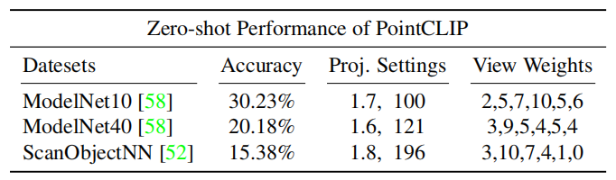

​		`消融实验` 在表 2 中，我们针对 ModelNet40 上的投影视图数量和每个视图的重要性进行了零样本 PointCLIP 的消融实验。对于视图数量，我们尝试了 1、4、6、8、10 和 12 个视图，以期越来越多地捕捉点云的多视图信息，但超过 6 个视图会带来冗余并导致性能下降。为了探索不同视图如何影响性能，我们将所有相对权重统一为 3，并分别将每个视图的权重增加到 9。如表中所示，来自右侧的投影达到了最高性能，表明其起到了主导作用，而顶部和底部视图对分类的贡献相对较少。在表 4 中，我们实现了不同的视觉骨干网络，包括 ResNet 和视觉 Transformer，其中 RN50×16 取得了 23.78% 的最佳性能。

`表 2. 关于投影视图数量和重要性的消融实验（%），针对 ModelNet40 上的零样本和 16-样本 PointCLIP。`

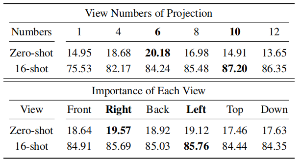

​		`提示设计。`我们在表 $3$ 中展示了用于**零样本** **PointCLIP** 的五种**提示设计**。我们观察到，朴素的 “a photo of a [CLASS].” 在 **ModelNet40** 上达到了 $17.02\%$ 的准确率，而简单地在其中插入单词 “point cloud” 反而会降低性能。随后，我们移除 “a photo” 并直接利用 “point cloud” 作为主语，这使得准确率提升了 $+1.66\%$。由于投影的**点云**通常覆盖了图像的大部分区域，附加一个形容词 “big” 可以带来进一步的性能提升。此外，我们添加 “depth map” 以更贴切地描述投影图像，这促成了表现最佳的 $20.18\%$，证明了**提示选择**的重要性。

`表 3. 采用不同提示设计的 PointCLIP 在 ModelNet40 上的性能。[CLASS] 表示类别词元，[Learnable Tokens] 表示固定长度的可学习提示。`

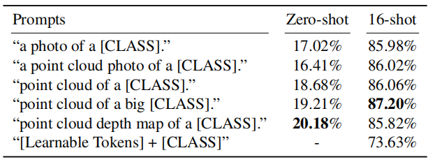

`表 4. 采用不同视觉编码器的 PointCLIP 在 ModelNet40 上的性能（%）。RN50 和 ViT-B/32 分别表示 ResNet-50 和带有 32×32 图像块嵌入的视觉 Transformer。RN.×16 表示来自文献 [46] 的具有 16 倍计算量的 ResNet-50。`

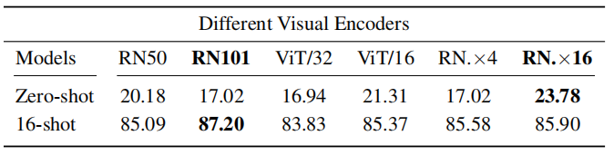

### 4.2. Few-shot Classification

​		`设置` 我们在 **ModelNet10**、**ModelNet40** 和 **ScanObjectNN** 上，在 1、2、4、8、16 **样本**（Shots）的设置下，对带有**视图间适配器**的 **PointCLIP** 进行了实验。对于 N-样本设置，我们从训练集的每个类别中随机采样 N 个**点云**。考虑到效率和性能，我们采用 **ResNet-101** 作为 **CLIP** 的预训练**视觉编码器**以进行更强的特征提取，并将投影视图数量增加到 10 个，增加了左前/后、上/下角的视图，因为表 2 证明左视图在**少样本识别**中包含最多的信息。此外，我们将**提示**修改为 “point cloud of a big [CLASS].” （[类别]的大点云），这在**少样本实验**中表现更好。对于**视图间适配器**，我们构建了一个**残差风格**的**多层感知机**（**MLP**），包含三个**线性层**，如第 3.3 节所述。

​		`性能` 在图 5 中，我们展示了 **PointCLIP** 的**少样本性能**，并将其与 4 个代表性的 **3D 网络**进行了比较：**PointNet**、**PointNet++**、**SimpleView** 以及**最先进的**（SOTA）**CurveNet**。正如我们所见，带有**视图间适配器**的 **PointCLIP** 在**少样本分类**方面超越了所有其他方法。当每个类别的样本数量很少时，**PointCLIP** 具有明显的优势，在 1-样本 **ModelNet40** 上分别超过 **PointNet** 25.49% 和 **CurveNet** 12.29%。当给定更多训练样本时，**PointCLIP** 仍然保持性能领先，但由于**冻结的编码器**和仅三层**适配器**有限的**拟合能力**，差距变得更小。

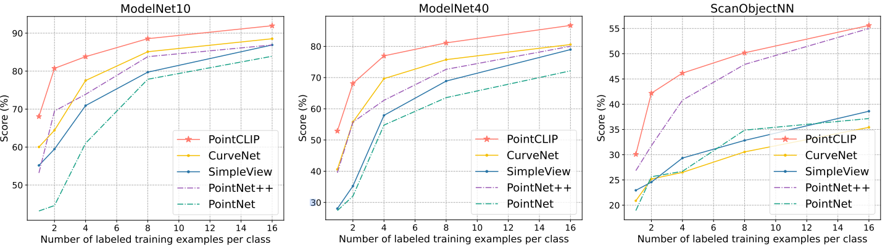

`图 5. PointCLIP 与其他经典 3D 网络在 ModelNet10、ModelNet40 和 ScanObjectNN 上的少样本性能比较。 我们的 PointCLIP 在 1、2、4、8 和 16 样本设置下，均显示出优于其他模型的一致优越性。`

​		`消融实验` 在表 2 中，我们展示了不同投影视图下的 16-样本 **PointCLIP**，并探索了每个视图对 **ModelNet40** 的贡献。与**零样本**版本不同，16-样本 **PointCLIP** 的 10 个视图表现优于 6 个视图，这可能是因为新添加的**适配器**能够更好地利用来自更多视图的信息并对其进行自适应**聚合**。关于视图的重要性，我们沿用了**零样本实验**的配置，但观察到了相反的结论：左视图是信息量最大的视图。对于表 4 中不同的**视觉编码器**，**ResNet-101** 取得了最高的准确率，且参数量少于**视觉 Transformer** 或 **ResNet-50×16**。表 3 列出了**提示设计**对性能的影响。遵循 **CoOp** 的**可学习提示**表现不如手工设计的提示，而 “point cloud of a big [CLASS].” 表现最好。

### 4.3. Multi-knowledge Ensemble

​		`设置` 为了验证将**预训练**的 2D **先验**与 3D 知识融合的互补性，我们分别将 **ModelNet40** 上准确率为 87.20% 的微调后 16-样本 **PointCLIP** 与**完全训练**的 **PointNet**、**PointNet++**、**DGCNN**、**SimpleView** 和 **CurveNet** 进行聚合。其他模型的所有**检查点**（checkpoints）均获取自 [23, 51]，未使用任何投票机制。我们手动调节 **PointCLIP** 与每个模型之间的融合比例，并在表 5 中报告了最佳比例（Ratio）下的性能，该比例代表了 **PointCLIP** 在整体中的相对权重。

`表 5. 16-样本 PointCLIP（在 ModelNet40 上达到 87.20%）对多知识集成的增强效果（%）。 "Before and After En." 分别表示未进行和进行 PointCLIP 集成时的模型表现。`

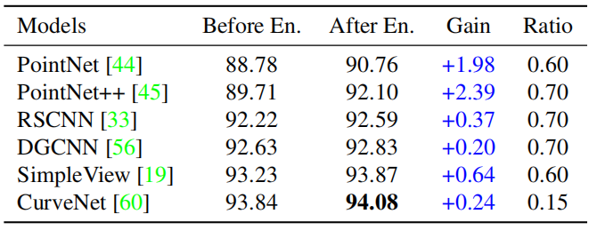

​		`性能` 如表 5 所示，与 **PointCLIP** 的**集成**提升了所有经典完全训练 3D 网络的性能。这些结果充分证明了 **PointCLIP** 对现有 3D 模型的互补性。值得注意的是，这种性能增益并非简单地通过两个模型之间的集成就能实现，因为 16-样本 **PointCLIP** 的准确率低于其他完全训练的模型，但仍能助益于它们本已很高的性能，使其更上一层楼。其中，**PointNet++** 的准确率提升幅度最大，从 89.71% 提升至 92.10%，而将 **PointCLIP** 与**最先进的**（SOTA）**CurveNet** 结合则达到了最佳的 94.08%。此外，我们观察到，对于**基线**性能较低的模型，**PointCLIP** 的**对数几率**（logits）需要占据较大的比例，但对于表现良好的模型（如 **CurveNet**），它们的知识应当在集成中起主导作用。

​		`消融实验` 我们在不包含 **PointCLIP** 的情况下，对 **ModelNet40** 上两个完全训练模型的集成进行了**消融研究**，并为简单起见以相同的比例融合它们的**对数几率**。如表 6 所示，聚合 **PointNet++** 会降低 **RSCNN** 和 **CurveNet** 的性能，且表现最好的两个模型（**SimpleView** 和 **CurveNet**）之间的集成也无法获得更好的性能。此外，**PointCLIP** 自身的成对集成也会损害原始性能。因此，具有相同训练方案的两个模型的简单集成通常会导致性能下降，这证明了**多知识交互**的重要性。在表 7 中，我们分别将经零样本、8、16、32、64 和 128 样本微调的 **PointCLIP** 与 **CurveNet** 进行融合，以探索它们的增强能力。据报告，仅有 20.18% 准确率的零样本 **PointCLIP** 也能将 **CurveNet** 提升 +0.04%。然而，在 3D 数据集上过多的训练会对集成准确率产生不利影响。这可能是由于两个模型之间的**知识相似度**过高，无法按预期提供互补信息所致。

`表 6. 具有相同训练方案的模型之间进行集成的消融实验（%）。`

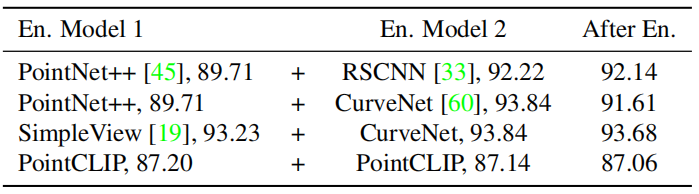

`表 7. 在 ModelNet40 上，不同少样本设置下的 PointCLIP 对 CurveNet 的增强性能（%）。`

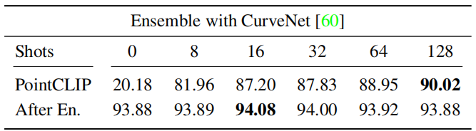

## 5 Conclusion

​		我们提出了 **PointCLIP**，它在无需任何 $3D$ 训练的情况下，能够对**点云**进行**跨模态零样本识别**。通过**多视图投影**，**PointCLIP** 高效地将 **CLIP** 预训练的 $2D$ 知识迁移到了 $3D$ 领域。此外，我们设计了一个**视图间适配器**来聚合多视图特征，并在**少样本设置**下将 $3D$ 学习到的知识融合进预训练的 **CLIP** 中。通过**微调**该适配器并**冻结**所有其他模块，**PointCLIP** 的性能得到了大幅提升。此外，**PointCLIP** 可以作为一个**即插即用模块**，为经典的 $3D$ 网络提供**互补知识**，从而带来显著的性能提升。除了识别任务之外，我们未来的工作将专注于推广 **CLIP** 以应用于更广泛的 $3D$ 场景。

# 术语

`Open-vocabulary Recognition` 开放词汇识别，模型不仅能识别训练集中的预定义类别，还能通过语义关联识别在训练阶段从未见过的任意新类别。

​		**通俗理解**：普通分类器像是有固定选项的选择题，而开放词汇识别就像是填空题，只要你给出文字描述，AI 就能在图中找到对应的东西。

`Close-set Supervisions`  闭集监督，一种训练设置，其中测试时遇到的类别必须是训练集中已经出现过的预定义类别。

​		**通俗理解**：就像闭卷考试，题目范围永远不会超出老师发的那本教材。这与 **CLIP** 处理的“开放词汇”情况相反。

`Modal Gap` 模态间隙，指不同类型的数据（如文本、图像、点云）在特征表达和分布上的巨大差异，导致跨模态知识迁移困难。

​		**通俗理解**：就像两个说不同语言（数据格式）的人，点云是杂乱的 3D 坐标，图像是整齐的像素格子，直接沟通很困难，需要一个“翻译”把点云转成图像。

`Perspective Projection` 透视投影，一种将 3D 物体投影到 2D 平面上的数学方法，模拟人类视觉“近大远小”的效果。 

​		**通俗理解**：就像你用相机对着 3D 模型拍一张快照，把立体的点变成了一张 2D 的照片。

`Bottleneck Layers` 瓶颈层，在神经网络中，通过先减少再增加神经元数量的结构（如线性层），旨在压缩特征并强制模型提取最关键的信息。

​		**通俗理解**：就像漏斗，先把庞杂的信息挤压精简，再把精华部分展开，防止模型死记硬背。

`Downstream Tasks`  下游任务，利用预训练模型提取出的特征，在特定领域（如检测、分割）中进一步完成的具体应用任务。

​		**通俗理解**：预训练模型是“通用大学教育”，而下游任务就是大学毕业后去当“医生”或“工程师”等具体的职业。

`Permutation Invariance` 置换不变性，指一个函数或神经网络的输出不随输入点序列的排列顺序改变而改变。

​		**通俗理解**：点云就像一袋苹果，无论你先拿哪一个出来数，苹果的总数（模型结果）都不变。这对处理乱序的点云数据至关重要。

`Softmax函数`   一种将多分类系统的原始输出值转化为概率分布的函数，所有输出值都在 $(0, 1)$ 之间且总和为 $1$。

​		**通俗理解**：就像是百分比转换器，把 AI 算出来的各种原始得分变成我们看得懂的概率（比如：$90\%$ 的概率是椅子）。