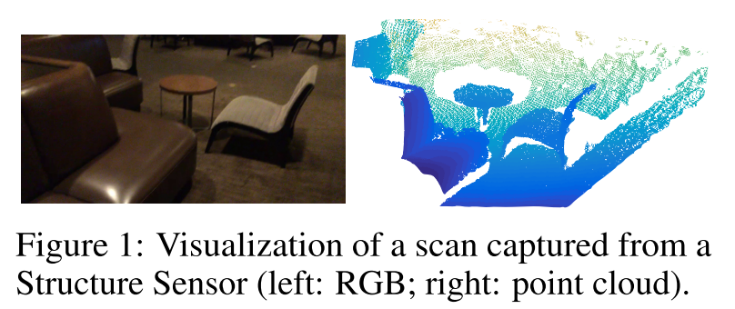
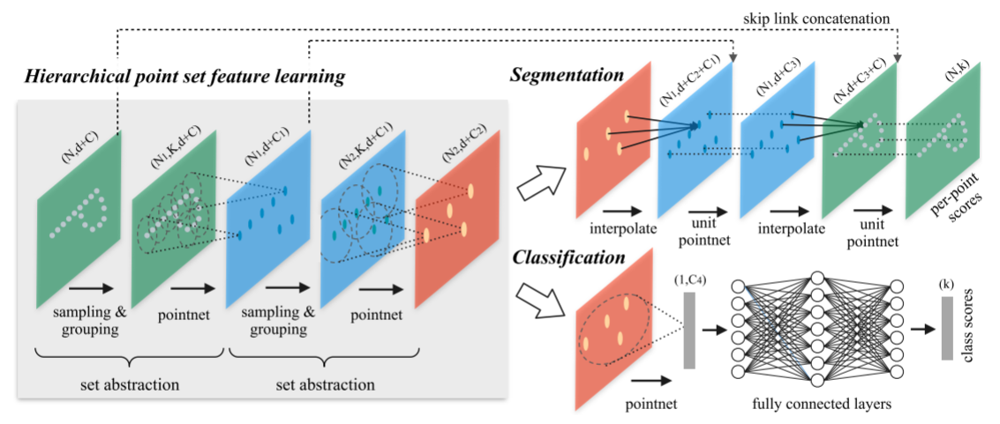
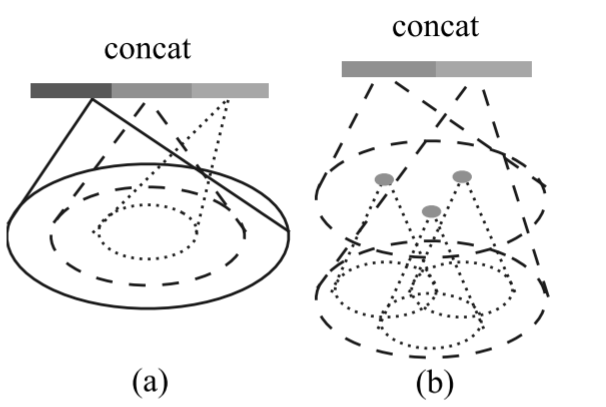
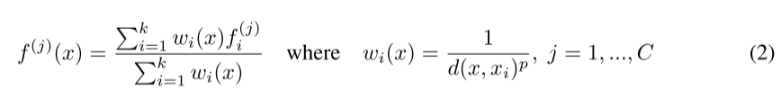
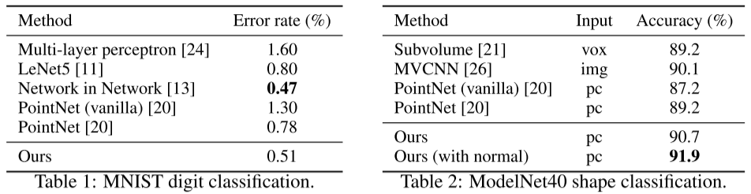
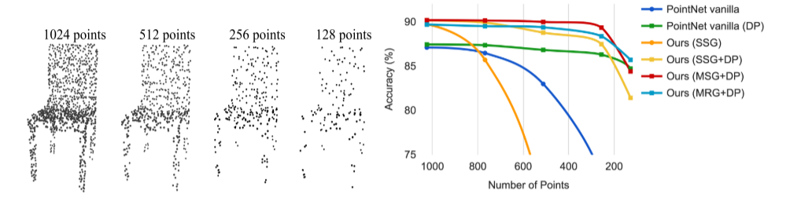
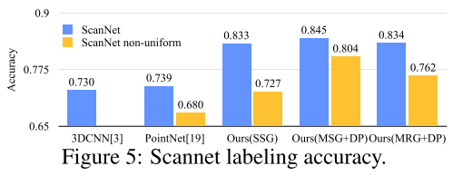
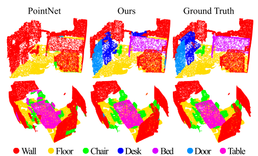
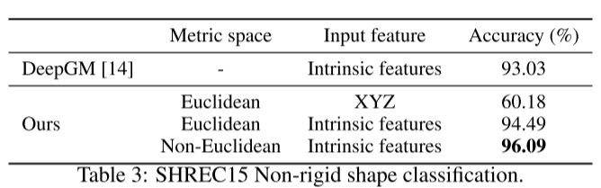
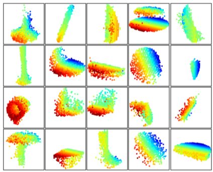

### Abstract：

​		很少有先前的工作研究点集上的深度学习。PointNet [20] 是这一方向的先驱。然而，在设计上，PointNet 无法捕捉由点所在的度量空间引起的局部结构，这限制了其识别细粒度模式的能力和对复杂场景的泛化能力。在这项工作中，我们引入了一种分层神经网络，该网络在输入点集的嵌套划分上递归应用 PointNet。通过利用度量空间距离，我们的网络能够学习具有不断增加的上下文尺度能力的局部特征。进一步观察到点集通常以不同的密度采样，这导致在均匀密度下训练的网络性能大幅下降，我们提出了新的**集合学习层**来自适应地组合多尺度特征。实验表明，我们的网络 PointNet++ 能够高效且鲁棒地学习深度点集特征。特别是在具有挑战性的 3D 点云基准测试中，获得了明显优于最先进方法的结果。

### 1 Introduction

​		我们感兴趣的是分析欧几里得空间中的几何点集（geometric point sets），即欧几里得空间中由点构成的集合。一类特别重要的几何点集是由三维扫描仪（3D scanners）捕获的点云（point cloud），例如来自配备相应传感器的自动驾驶车辆的数据。作为集合，此类数据必须对其成员的**排列保持不变性**（invariant）。此外，**距离度量**（distance metric）定义了可能呈现不同属性的局部邻域（local neighborhoods）。例如，点的密度和其他属性在不同位置可能不均匀 —— 在三维扫描中，密度变化（density variability）可能来自透视效应（perspective effects）、径向密度变化（radial density variations）、运动等。$\mathbb{R}^3$

​		很少有先前的工作研究**点集**上的深度学习。PointNet [20] 是直接处理**点集**的先驱性工作。PointNet 的基本思想是学习每个点的**空间编码**（spatial encoding），然后将所有单个点的特征**聚合**（aggregate）为全局**点云**特征（global point cloud signature）。在设计上，PointNet 无法捕捉由**度量**（metric）诱导的**局部结构**（local structure）。然而，利用**局部结构**已被证明对**卷积架构**（convolutional architectures）的成功至关重要。卷积神经网络（CNN）以**规则网格**（regular grids）上定义的数据为输入，能够沿着**多分辨率层级**（multi-resolution hierarchy）逐步捕捉尺度越来越大的特征。在较低层级，神经元具有较小的**感受野**（receptive fields），而在较高层级则具有较大的**感受野**。沿层级抽象**局部模式**（local patterns）的能力使其对未见案例具有更好的**泛化能力**（generalizability）。

​		【★】我们引入一种**分层神经网络**（hierarchical neural network），命名为 PointNet++，以分层方式处理度量空间（metric space）中采样的点集。PointNet++ 的总体思路简单：首先通过底层空间的距离度量（distance metric）将点集划分为重叠的**局部区域**（local regions）。与卷积神经网络（CNNs）类似，我们从小型**局部邻域**中提取捕捉精细几何结构（geometric structures）的**局部特征**（local features）；这些局部特征进一步被分组为更大的单元，并通过处理生成更高级别的特征。此过程重复进行，直至获得整个点集的特征。

​		PointNet++ 的设计需要解决两个问题：如何生成点集的**划分**（partitioning），以及如何通过**局部特征学习器**（local feature learner）抽象点集或局部特征。`这两个问题是相关的，因为点集的划分必须在各个分区之间产生共同的结构，以便像在**卷积场景**（convolutional setting）中一样共享局部特征学习器的权重`。我们选择**PointNet**作为局部特征学习器。如该工作所示，PointNet 是处理无序点集以进行**语义特征提取**（semantic feature extraction）的有效架构。此外，该架构对输入数据损坏（input data corruption）具有鲁棒性。作为基本构建块，PointNet 将局部点集或特征抽象为更高级别的表示。从这个角度看，PointNet++ 在输入集的**嵌套划分**（nested partitioning）上递归应用 PointNet。

​		仍然存在的一个问题是如何生成点集的**重叠划分**（overlapping partitioning）。每个分区被定义为底层欧氏空间中的一个**邻域球**（neighborhood ball），其参数包括**质心位置**（centroid location）和**尺度**（scale）。为了均匀覆盖整个点集，质心通过**最远点采样（FPS）算法**（farthest point sampling (FPS) algorithm）从输入点集中选择。与以固定步长扫描空间的**体素 CNN**（volumetric CNNs）相比，我们的局部感受野同时依赖于输入数据和度量，因此更加高效和有效。

​		然而，确定**局部邻域球**（local neighborhood balls）的适当**尺度**（scale）是一个更具挑战性但有趣的问题，这是由于**特征尺度**（feature scale）与输入点集**非均匀性**（non-uniformity）的相互纠缠。我们假设输入点集在不同区域可能具有**可变密度**（variable density），这在真实数据中非常常见，例如 Structure Sensor 扫描 [18]（见图 1）。因此，我们的输入点集与 CNN 输入有很大不同 —— 后者可视为在具有均匀恒定密度的**规则网格**（regular grids）上定义的数据。在 CNN 中，与局部划分尺度对应的是**卷积核**（kernels）的大小。[25] 表明，使用较小的卷积核有助于提高 CNN 的能力。然而，我们在点集数据上的实验为这一规则提供了反证：由于**采样不足**（sampling deficiency），小邻域可能包含过少的点，这可能不足以让 PointNet 稳健地捕捉模式。

​		我们论文的一个重要贡献是，PointNet++ 利用**多尺度邻域**（neighborhoods at multiple scales）来实现鲁棒性和细节捕捉的双重目标。在训练过程中借助**随机输入丢弃**（random input dropout），网络学习自适应地加权不同尺度下检测到的模式，并根据输入数据组合**多尺度特征**（multi-scale features）。实验表明，我们的 PointNet++ 能够高效且鲁棒地处理点集。特别是在具有挑战性的 3D 点云	中，获得了明显优于**最先进方法**（state-of-the-art）的结果。

### 2 Problem Statement

​		假设$X = (M, d)$是一个离散度量空间，其度量继承自欧几里得空间 \($\mathbb{R}^n$\)，其中$M \subseteq \mathbb{R}^n$为点集，d 为距离度量。此外，M 在环境欧几里得空间中的**密度**（density）可能并非处处均匀。我们感兴趣的是学习将此类 X 作为输入（连同每个点的附加特征）并生成关于 X 的语义信息的**集合函数**（set functions）f。在实践中，此类 f 可以是为 X 分配标签的**分类函数**（classification function），或为 M 中每个点分配逐点标签的**分割函数**（segmentation function）。

### 3 Method

​		我们的工作可视为 PointNet [20] 的扩展，增加了**分层结构**（hierarchical structure）。我们首先回顾 PointNet（第 3.1 节），然后介绍具有分层结构的 PointNet 基本扩展（第 3.2 节）。最后，我们提出即使在**非均匀采样的点集**（non-uniformly sampled point sets）中也能稳健学习特征的 PointNet++（第 3.3 节）

#### 3.1 Review of PointNet [20]: A Universal Continuous Set Function Approximator

​		给定一个无序点集$\{x_1, x_2, \ldots, x_n\}$（其中$x_i \in \mathbb{R}^d$），可以定义一个将点集映射到向量的**集合函数**：

$  f(x_1, x_2, \ldots, x_n) = \gamma\left( \max_{i=1,\ldots,n} \{ h(x_i) \} \right) \tag{1}  $

其中$\gamma$和h通常为**多层感知机**（multi-layer perceptron, MLP）网络。

​		公式（1）中的集合函数 f 对输入点的排列（permutations）**不变**（invariant），且可任意逼近任何**连续集合函数**（continuous set function）[20]。注意，h的输出可解释为点的**空间编码**（spatial encoding）（细节见 [20]）。

​		PointNet 在多个基准测试中表现出色。然而，其缺乏捕捉不同**尺度局部上下文**（local context at different scales）的能力。我们将在下一节介绍分层特征学习框架以解决这一局限。

#### 3.2 Hierarchical Point Set Feature Learning

​		虽然 PointNet 使用单一的**最大池化操作**（max pooling operation）来聚合整个点集，但我们的新架构构建了点的**分层分组**（hierarchical grouping of points），并沿着层级逐步抽象越来越大的**局部区域**（local regions）。

​		我们的分层结构由若干**集合抽象层**（set abstraction levels）组成（图 2）。在每一层中，点集经过处理和抽象，生成`元素更少的新点集`。集合抽象层由三个关键层构成：**采样层**（Sampling layer）、**分组层**（Grouping layer）和**PointNet 层**（PointNet layer）。采样层从输入点中选择一组点，这些点定义了**局部区域**（local regions）的质心。分组层通过查找质心周围的 “邻近” 点来构建局部区域集。PointNet 层使用小型 PointNet 将局部区域模式`编码`为特征向量。

图 2：我们的**分层特征学习架构**（hierarchical feature learning architecture）及其在集合分割（set segmentation）和分类（classification）中的应用示意图（以二维欧几里得空间\($\mathbb{R}^2$\)中的点为例）。此处可视化了**单尺度点分组**（single scale point grouping）。关于**密度自适应分组**（density adaptive grouping）的细节，见图 3。

​		一个**集合抽象层**（set abstraction level）以一个$N \times (d + C)$矩阵作为输入，该矩阵来自N个具有d维坐标（d-dim coordinates）和C维点特征（C-dim point feature）的点。它输出一个$N' \times (d + C')$矩阵，包含$N'$个**下采样点**（subsampled points）的d维坐标和概括**局部上下文**（local context）的新$C'$维特征向量。我们在以下段落中介绍集合抽象层的各层。

​		**采样层**：给定输入点$\{x_1, x_2, \ldots, x_n\}$，我们使用**迭代最远点采样（FPS）**（iterative farthest point sampling, FPS）选择一个点**子集**$\{x_{i1}, x_{i2}, \ldots, x_{im}\}$  ，使得xij是剩余点中相对于集合$\{x_{i1}, x_{i2}, \ldots, x_{ij-1}\}$在**度量距离**（metric distance）上最远的点。与随机采样相比，在质心数量相同的情况下，它能更好地覆盖整个点集。与不考虑数据分布、按固定方式扫描向量空间的 CNN 不同，我们的采样策略以**依赖数据**（data dependent）的方式生成**感受野**（receptive fields）。

​		**分组层**：该层的输入是一个大小为$N \times (d + C)$的点集矩阵和大小为的$N_0 \times d$**质心坐标**（coordinates of centroids）矩阵。输出为大小为$N_0 \times K \times (d + C)$的**点集组**（groups of point sets），其中每个组对应一个**局部区域**（local region），K为质心点邻域内的点数。注意，K值因组而异，但后续的 PointNet 层能够将**可变数量的点**（flexible number of points）转换为固定长度的局部区域特征向量。

​		在卷积神经网络中，像素的**局部区域**（local region）由该像素在曼哈顿距离（Manhattan distance）（即**核大小**（kernel size））范围内的数组索引对应的像素组成。在从度量空间（metric space）采样的点集中，点的**邻域**（neighborhood）由**度量距离**（metric distance）定义。

​		**球查询**（Ball query）会查找与查询点距离在某一半径范围内的所有点（在实现中设置 K 的上限）。另一种范围查询是**K 近邻搜索**（K nearest neighbor, kNN），其查找固定数量的邻近点。与 kNN 相比，球查询的局部邻域保证了**固定的区域尺度**（fixed region scale），从而使局部区域特征在空间上**更具通用性**（more generalizable），这对于需要局部模式识别的任务（如**语义点标注**（semantic point labeling））更为适用。

​		**PointNet 层**：在该层中，输入是$N'$个局部区域的点集，数据大小为$N_0 \times K \times (d + C)$。输出中的每个局部区域通过其**质心**（centroid）和编码质心邻域的**局部特征**（local feature）进行抽象，输出数据大小为$N_0 \times (d + C')$。

​		局部区域内的点坐标首先被转换为相对于质心的**局部坐标系**（local frame）：对于\(i = 1, 2, ... , K\)和\(j = 1, 2, ...,  d\)，有$x_i^{(j)} = x_i^{(j)} - \hat{x}^{(j)}$,其中$\hat{x}$为质心的坐标。我们使用第 3.1 节所述的 PointNet [20] 作为**局部模式学习**（local pattern learning）的基本构建块。通过结合相对坐标和点特征，我们可以捕捉局部区域内的**点与点之间的关系**（point-to-point relations）。

#### 3.3 Robust Feature Learning under Non-Uniform Sampling Density

​		如前所述，点集在不同区域通常具有**非均匀密度**（non-uniform density）。这种非均匀性给点集特征学习带来了重大挑战：在密集数据中学习到的特征可能无法泛化到**稀疏采样区域**（sparsely sampled regions）。因此，为稀疏点云训练的模型可能无法识别**细粒度局部结构**（fine-grained local structures）。

​		理想情况下，我们希望尽可能细致地考察点集，以捕捉**密集采样区域**（densely sampled regions）中的最细微细节。然而，在低密度区域，这种细致考察会受到限制，因为局部模式可能因**采样不足**（sampling deficiency）而被破坏。在这种情况下，我们需要在更大的邻近区域中寻找**更大尺度的模式**（larger scale patterns）。为实现这一目标，我们提出**密度自适应 PointNet 层**（density adaptive PointNet layers）（图 3），其能够在输入采样密度变化时学习去组合不同尺度区域的特征。我们将包含密度自适应 PointNet 层的分层网络称为 PointNet++。

图 3：（a）**多尺度分组**（Multi-scale Grouping, MSG）；（b）**多分辨率分组**（Multi-resolution Grouping, MRG）。

​		在第 3.2 节中，每个抽象层仅包含单一尺度的分组和特征提取。而在 PointNet++ 中，每个抽象层会提取**多尺度局部模式**（multiple scales of local patterns），并根据局部点密度智能地组合这些模式。在分组局部区域和组合不同尺度特征方面，我们提出如下两种类型的**密度自适应层**（density adaptive layers）。

​		**多尺度分组（MSG）**。如图 3（a）所示，捕捉多尺度模式的一种简单而有效的方法是应用不同尺度的分组层，随后通过对应的 PointNet 提取每个尺度的特征。不同尺度的特征被**拼接**（concatenated）以形成**多尺度特征**（multi-scale feature）。

​		我们训练网络来学习一种优化策略以组合多尺度特征，这通过对每个样本以随机概率丢弃输入点来实现，我们称之为**随机输入丢弃**（random input dropout）。具体来说，对于每个训练点集，我们选择一个从区间\([0, p]\)中均匀采样的丢弃率$\theta$（其中$p \leq 1$）。对于每个点，我们以概率$\theta$随机丢弃该点。在实践中，我们将p设为 0.95 以避免生成空点集。通过这种方式，我们向网络提供由$\theta$诱导的具有各种**稀疏度**（sparsity）和由丢弃随机性诱导的**均匀性**（uniformity）的训练集。在测试时，我们保留所有可用点。

​		**多分辨率分组（MRG）**。上述 MSG 方法的**计算成本较高**（computationally expensive），因为它需要为每个质心点在**大尺度邻域**（large scale neighborhoods）上运行局部 PointNet。特别是由于在**最低层级**（lowest level）质心点的数量通常非常大，时间成本显著。

​		在此，我们提出一种替代方法，该方法避免了此类**高计算成本**（expensive computation），但仍保留了根据**点的分布特性**（distributional properties of points）自适应聚合信息的能力。在图 3（b）中，某一层级$L_i$的区域特征是两个向量的**拼接**（concatenation）。一个向量（图中左侧）通过使用集合抽象层汇总来自较低层级$L_{i-1}$的每个子区域的特征而获得。另一个向量（右侧）是通过使用单一 PointNet 直接处理局部区域内的所有**原始点**（raw points）而获得的特征。

​		当局部区域的密度较低时，**第一个向量**（first vector）可能比**第二个向量**（second vector）更不可靠，因为计算第一个向量时所使用的子区域包含更少的点，更容易受到**采样不足**（sampling deficiency）的影响。在这种情况下，应赋予第二个向量更高的权重。另一方面，当局部区域的密度较高时，第一个向量能够提供更精细的细节信息，因为它具备通过较低层级**递归地以更高分辨率考察**（recursively inspect at higher resolutions）的能力。

​		与 MSG 相比，这种方法在**计算效率上更高**（computationally more efficient），因为我们避免了在**最低层级**（lowest levels）的**大尺度邻域**（large scale neighborhoods）中进行特征提取

#### 3.4 Point Feature Propagation for Set Segmentation

​		在**集合抽象层**（set abstraction layer）中，原始点集会被**下采样**（subsampled）。然而，在**集合分割任务**（set segmentation task）（如**语义点标注**（semantic point labeling））中，我们需要为所有原始点获取点特征。一种解决方案是在所有集合抽象层中始终将所有点采样为质心，但这会导致**计算成本过高**（high computation cost）。另一种方法是将特征从**下采样点**（subsampled points）**传播到**（propagate to）原始点。

​		我们采用一种结合**基于距离的插值**（distance based interpolation）和**跨层级跳跃连接**（across level skip links）的**分层传播策略**（hierarchical propagation strategy）（如图 2 所示）。在**特征传播层**（feature propagation level）中，我们将点特征从$N_l \times (d + C)$个点传播到$N_{l-1}$个点，其中$N_{l-1}$和$N_l$（$N_l \leq N_{l-1}$）分别是第L层集合抽象层的输入和输出点集大小。我们通过在$N_{l-1}$个点的坐标处插值$N_l$个点的特征值f来实现特征传播。在多种插值选择中，我们采用基于 k 近邻的**反距离加权平均**（inverse distance weighted average）（如公式 2 所示，默认使用p=2，k=3。然后，将$N_{l-1}$个点的插值特征与来自集合抽象层的跳跃连接点特征进行**拼接**（concatenated）。拼接后的特征通过一个 “**单元 PointNet**”（unit pointnet）—— 类似于 CNN 中的 1×1 卷积 —— 经过几个共享的全连接层和 ReLU 层来更新每个点的特征向量。该过程重复进行，直到将特征传播到原始点集。

### 4 Experiments

​		我们在四个数据集上进行评估，涵盖从二维物体（MNIST [11]）、三维物体（ModelNet40 [31] 刚性物体、SHREC15 [12] 非刚性物体）到真实三维场景（ScanNet [5]）。物体分类任务通过**准确率**（accuracy）评估，语义场景标注任务遵循 [5] 的设置，通过**平均体素分类准确率**（average voxel classification accuracy）评估。以下是各数据集的实验设置：

- **MNIST**：手写数字图像数据集，包含 60k 训练样本和 10k 测试样本。
- **ModelNet40**：40 类 CAD 模型（以人造物体为主），使用官方划分的 9,843 个形状用于训练，2,468 个用于测试。
- **SHREC15**：来自 50 类的 1200 个形状，每类包含 24 个形状（主要为马、猫等具有各种姿态的有机形状）。我们使用五折交叉验证获取该数据集的分类准确率。
- **ScanNet**：1513 个扫描重建的室内场景，遵循 [5] 的实验设置，使用 1201 个场景训练，312 个场景测试。

#### 4.1 Point Set Classification in Euclidean Metric Space

​		我们在从二维（MNIST）和三维（ModelNet40）欧氏空间采样的点云分类任务上评估我们的网络。MNIST 图像被转换为数字像素位置的二维点云，三维点云从 ModelNet40 形状的网格表面采样。**默认情况下**（In default），我们对 MNIST 使用 512 个点，对 ModelNet40 使用 1024 个点。在表 2 的最后一行（ours normal）中，我们使用**面法线**（face normals）作为额外的点特征，此时我们也使用更多的点（N=5000）以进一步提升性能。所有点集均被归一化为零均值且位于单位球内。我们使用一个包含三个全连接层的**三级分层网络**（three-level hierarchical network）。

​		**实验结果**。在表 1 和表 2 中，我们将我们的方法与一组具有代表性的**现有最先进方法**（state of the arts）进行了比较。请注意，表 2 中的**原始 PointNet**（PointNet (vanilla)）是 [20] 中未使用**变换网络**（transformation networks）的版本，其等价于仅包含单一层级的分层网络。

​		首先，我们的**分层学习架构**（hierarchical learning architecture）相比非分层的 PointNet [20] 实现了显著更好的性能。在 MNIST 数据集中，我们的方法相比原始 PointNet(vanilla) 和 PointNet 的错误率分别降低了 60.8% 和 34.6%。在 ModelNet40 分类任务中，使用相同的输入数据规模（1024 个点）和特征（仅坐标）时，我们的方法也显著强于 PointNet。其次，我们观察到基于点集的方法甚至可以达到与成熟图像 CNN 相当或更好的性能：在 MNIST 中，我们的方法（基于二维点集）的准确率接近**Network in Network CNN**；在 ModelNet40 中，我们结合法线信息的方法显著**优于**（outperforms）此前最先进的方法 MVCNN [26]。

​		**对采样密度变化的鲁棒性**。从真实世界直接捕获的传感器数据通常存在**严重的不规则采样问题**（图 1）。我们的方法通过选择**多尺度点邻域**（point neighborhood of multiple scales）并学习通过适当**加权**来平衡**描述性与鲁棒性**（descriptiveness and robustness）。

​		我们在测试时随机丢弃点（见图 4 左图），以验证网络对非均匀和稀疏数据的鲁棒性。在图 4 右图中，我们看到**MSG+DP**（训练期间使用随机输入丢弃的多尺度分组）和**MRG+DP**（训练期间使用随机输入丢弃的多分辨率分组）对采样密度变化具有很强的鲁棒性：当测试点从 1024 个减少到 256 个时，MSG+DP 的性能下降不到 1%。此外，与其他方法相比，它在几乎所有采样密度下都实现了最佳性能。**原始 PointNet**（PointNet vanilla）[20] 由于其专注于**全局抽象**（global abstraction）而非**细粒度细节**（fine details），在密度变化下表现出一定鲁棒性，但细节的丢失也使其性能不如我们的方法。**SSG**（每层使用单尺度分组的简化版 PointNet++）无法泛化到稀疏采样密度，而**SSG+DP**通过在训练时随机丢弃点改善了这一问题。

**图 4**：左图：带有随机点丢弃的点云。右图：曲线展示了我们的密度自适应策略在处理非均匀密度时的优势。DP 表示训练期间的随机输入丢弃（random input dropout）；否则表示在均匀密集的点上进行训练。具体细节见第 3.3 节。

#### 4.2 Point Set Segmentation for Semantic Scene Labeling

​		为了验证我们的方法适用于**大规模点云分析**（large scale point cloud analysis），我们还在**语义场景标注任务**（semantic scene labeling task）上进行了评估。该任务的目标是预测室内扫描点云中各点的语义物体标签。[5] 使用全卷积神经网络在**体素化扫描**（voxelized scans）上提供了一个基线方法，其仅依赖扫描几何信息而非 RGB 信息，并报告了**逐体素**（per-voxel basis）的准确率。为了进行公平比较，我们在所有实验中移除了 RGB 信息，并遵循 [5] 的方法将点云标签预测转换为体素标注。我们还与 [20] 进行了对比，逐体素准确率如图 5（蓝色柱）所示。

​		我们的方法**大幅优于**（outperforms）所有基线方法。与在**体素化扫描**（voxelized scans）上学习的 [5] 相比，我们直接在点云上学习以避免额外的**量化误差**（quantization error），并通过**数据相关采样**（data dependent sampling）实现更有效的学习。与 [20] 相比，我们的方法引入了**分层特征学习**（hierarchical feature learning）并捕捉**不同尺度的几何特征**（geometry features at different scales），这对于理解多层次场景和标注不同大小的物体至关重要。我们在图 6 中可视化了场景标注结果示例。

**图 6**：ScanNet 标注结果。[20] 正确捕捉了房间的整体布局，但未能识别出家具。相比之下，我们的方法除了房间布局外，在分割物体方面表现得更好。

​		**对采样密度变化的鲁棒性**。为了测试我们的训练模型在**非均匀采样密度**（non-uniform sampling density）扫描上的表现，我们合成了类似于图 1 的 ScanNet 场景**虚拟扫描**（virtual scans），并在这些数据上评估我们的网络。关于虚拟扫描的生成方法，请参考**补充材料**（supplementary material）。我们在三种设置（SSG、MSG+DP、MRG+DP）下评估我们的框架，并与基线方法 [20] 进行对比。

​		**性能对比结果如图 5（黄色柱）所示**。我们发现，由于采样密度从均匀点云转变为虚拟扫描场景，**SSG 的性能大幅下降**。另一方面，**MRG 网络对采样密度变化更具鲁棒性**，因为当采样稀疏时，它能够自动切换到描述**更粗粒度**（coarser granularity）的特征。尽管训练数据（带随机丢弃的均匀点云）与非均匀密度的扫描数据之间存在**领域差异**（domain gap），但我们的 MSG 网络仅受轻微影响，并在对比方法中实现了最高精度。这些结果证明了我们的密度自适应层设计的有效性。

#### 4.3 Point Set Classification in Non-Euclidean Metric Space

​		在本节中，我们展示了我们的方法对**非欧几里得空间**（non-Euclidean space）的泛化能力。在**非刚性形状分类**（non-rigid shape classification）（图 7）中，一个优秀的分类器应能够将图 7 中的（a）和（c）正确分类为同一类别 —— 尽管它们的姿态不同，这需要模型具备捕捉**内在结构**（intrinsic structure）的能力。SHREC15 中的形状是嵌入三维空间的二维曲面，沿曲面的**测地距离**（geodesic distances）自然诱导出一个度量空间。我们通过实验表明，在该度量空间中采用 PointNet++ 是捕捉底层点集内在结构的有效方法。

​		对于 [12] 中的每个形状，我们首先构建由成对测地距离诱导的度量空间。我们遵循 [23] 获取模拟测地距离的**嵌入度量**（embedding metric）。接下来，我们在该度量空间中提取包括**波核签名（WKS）**[1]、**热核签名（HKS）**[27] 和**多尺度高斯曲率**（multi-scale Gaussian curvature）[16] 在内的内在点特征。我们将这些特征作为输入，并根据底层度量空间对点进行采样和分组。通过这种方式，我们的网络学习捕捉不受形状特定姿态影响的多尺度内在结构。其他设计选择包括使用 XYZ 坐标作为点特征或将欧几里得空间\(\mathbb{R}^3\)作为底层度量空间，我们将证明这些并非最优选择

​		**结果 **。我们在表 3 中将我们的方法与**现有最先进方法**（state-of-the-art method）[14] 进行了对比。[14] 提取**测地矩**（geodesic moments）作为形状特征，并使用**堆叠稀疏自动编码器**（stacked sparse autoencoder）对这些特征进行处理以预测形状类别。我们的方法通过使用**非欧几里得度量空间**（non-Euclidean metric space）和**内在特征**（intrinsic features），在所有设置中均取得了最佳性能，且**大幅优于**（outperforms）[14]。

​		通过对比我们方法的**第一组和第二组设置**，可以发现**内在特征**（intrinsic features）对非刚性形状分类至关重要。XYZ 坐标特征无法揭示内在结构，且极易受**姿态变化**（pose variation）影响。对比我们方法的**第二组和第三组设置**，可以看到使用**测地邻域**（geodesic neighborhood）相比**欧氏邻域**（Euclidean neighborhood）更具优势：欧氏邻域可能包含曲面表面距离较远的点，且当形状发生非刚性变形时，这种邻域可能会发生剧烈变化。这为有效的**权重共享**（weight sharing）带来了困难，因为局部结构可能变得组合复杂。另一方面，曲面上的测地邻域摆脱了这一问题，并提高了学习效率。

#### 4.4 Feature Visualization

​		**图 8 中，我们可视化了分层网络第一层内核所学习到的内容**。我们在空间中创建了一个**体素网格**（voxel grid），并聚合了在网格单元中**激活特定神经元最强**的局部点集（使用激活值最高的 100 个样本）。保留**投票数高**的网格单元，并将其转换回三维点云，这些点云代表了神经元所识别的模式。由于模型在以家具为主的 ModelNet40 上训练，我们在可视化结果中可以看到平面、双平面、线条、角点等结构。

**图 8**：从第一层内核学习到的三维点云模式。该模型针对 ModelNet40 形状分类任务训练（从 128 个内核中随机选择 20 个）。颜色表示点的深度（红色为近，蓝色为远）。

### 5 Related Work

​		分层特征学习的思想已取得了巨大成功。在所有学习模型中，**卷积神经网络**（convolutional neural network, CNN）[10; 25; 8] 是最突出的模型之一。然而，卷积操作并不适用于具有**距离度量的无序点集**（unordered point sets with distance metrics），而这正是我们工作的核心焦点。

​		最近的一些工作 [20; 28] 研究了如何将深度学习应用于**无序集合**（unordered sets），但即使点集确实具有**底层距离度量**（underlying distance metric），它们也忽略了这一特性。因此，这些方法无法捕捉点的**局部上下文**（local context），且对全局集合的平移和归一化敏感。在本工作中，我们针对从度量空间采样的点，通过在设计中显式考虑底层距离度量来解决这些问题。

​		从度量空间采样的点通常带有噪声且具有**非均匀采样密度**（non-uniform sampling density），这会影响有效的点特征提取并给学习带来困难。核心问题之一是为点特征设计选择合适的**尺度**（scale）。此前，几何处理社区或摄影测量与遥感社区已围绕这一问题开发了若干方法 [19; 17; 2; 6; 7; 30]。与所有这些工作不同，我们的方法以**端到端的方式**（end-to-end fashion）学习提取点特征并平衡多个特征尺度。

​		在三维度量空间中，除点集外，深度学习还有几种流行的表示方法，包括**体素网格**（volumetric grids）[21; 22; 29] 和**几何图**（geometric graphs）[3; 15; 33]。然而，这些工作均未明确考虑**非均匀采样密度**（non-uniform sampling density）问题。

### 6 Conclusion	

​		在这项工作中，我们提出了 PointNet++，这是一种用于处理**度量空间采样点集**的高效神经网络架构。PointNet++ 通过对输入点集进行**嵌套划分**（nested partitioning）实现递归特征学习，能够有效捕捉与距离度量相关的**分层特征**（hierarchical features）。为解决**非均匀点采样问题**，我们设计了两种新型**集合抽象层**（set abstraction layers），可根据局部点密度智能聚合**多尺度信息**（multi-scale information）。这些创新使我们在具有挑战性的三维点云基准测试中取得了最佳性能。

​		未来，我们值得思考如何通过在每个局部区域共享更多计算来加速所提出网络的推理速度，尤其是针对 MSG 和 MRG 层。此外，在基于 CNN 的方法计算上不可行而我们的方法可良好扩展的**高维度量空间**中探索应用也颇具价值。

___

___

| **术语**              | **核心思想**                                                 | **典型应用场景**                                 |
| --------------------- | ------------------------------------------------------------ | ------------------------------------------------ |
| **PointNet**          | 基于全局特征提取，通过对称函数（如最大值池化）处理无序点集，无分层结构 | 简单点云分类、刚体识别                           |
| **PointNet++**        | 分层邻域分组（FPS + 球查询）+ 多尺度特征聚合（MSG/MRG），密度自适应机制 | 复杂场景语义分割、非刚性形状分类、大规模点云分析 |
| **FCN（全卷积网络）** | 依赖体素化预处理，通过 3D 卷积处理规则网格结构，逐体素分类   | 室内场景分割（需体素化点云）、量化几何分析       |
| **GCN（图卷积网络）** | 将点云建模为几何图（节点 + 邻接边），基于图结构进行卷积操作，捕捉拓扑关系 | 社交网络分析、分子结构预测、点云图表示学习       |

### 7 相关术语解析

#### **A**

1. **近似最近邻搜索（Approximate Nearest Neighbor, ANN）**
   用于加速高维空间中最近邻查询的算法（如 KD 树、哈希表），降低邻域搜索的时间复杂度，适用于大规模点云处理。

#### **B**

1. **波核签名（Wave Kernel Signature, WKS）**
   基于拉普拉斯 - 贝尔特拉米算子的谱特征，用于刻画曲面局部几何的频率响应，对局部等距变换不变。

#### **C**

1. **测地距离（Geodesic Distance）**
   曲面上两点间的最短路径长度，是刻画曲面内在结构的核心度量，不受三维空间姿态影响。
2. **高斯曲率（Gaussian Curvature）**
   微分几何中描述曲面弯曲程度的内在不变量，平面曲率为 0，球面曲率为正，多尺度计算可捕捉不同层级的几何特征。

#### **D**

1. **点云（Point Clouds）**
   三维空间中无序的点集合，由坐标（+ 可选特征，如法线、颜色）组成，是激光雷达等传感器的常见输出形式。
2. **多分辨率分组（Multi-resolution Grouping, MRG）**
   PointNet++ 中的密度自适应层，通过层级化分辨率跳跃连接，平衡计算效率与特征分辨率，适应非均匀采样密度。
3. **多尺度分组（Multi-scale Grouping, MSG）**
   PointNet++ 中的核心层，通过不同半径的邻域聚合多尺度特征，捕捉密集区域细节和稀疏区域语义。

#### **E**

1. **欧氏空间（Euclidean Spaces）**
   具有欧几里得距离度量的空间（如二维平面、三维空间），是点云坐标的基础几何框架。
2. **归一化（Normalization）**
   点云预处理步骤，包括零均值（减去质心）和单位球内缩放（缩放到半径 1），消除位置和尺度影响。

#### **F**

1. **分层特征学习（Hierarchical Feature Learning）**
   通过多层级网络逐层提取从局部几何到全局语义的渐进式特征，如 PointNet++ 的三级分层架构。
2. **非刚性形状分类（Non-rigid Shape Classification）**
   对姿态、形状可变的物体（如不同动作的人体模型）进行分类，依赖内在几何特征而非欧氏坐标。
3. **非欧几里得空间（Non-Euclidean Space）**
   几何性质不满足欧几里得公理的空间（如曲面流形），通过测地距离等定义度量，适用于非刚性形状分析。

#### **G**

1. **全局抽象（Global Abstraction）**
   提取点云的整体特征（如质心、主成分），忽略局部细节，典型方法如 PointNet 的对称函数聚合。

#### **H**

1. **热核签名（Heat Kernel Signature, HKS）**
   模拟热扩散过程的时间依赖特征，对曲面等距变换不变，用于捕捉非刚性形状的内在结构。
2. **最远点采样（Farthest Point Sampling, FPS）**
   分层点云采样策略，从点集中迭代选择最远点，确保采样点均匀覆盖全局结构，用于点云下采样。

#### **L**

1. **黎曼流形（Riemannian Manifold）**
   具有黎曼度量的微分流形，可定义局部距离和曲率，用于高维几何数据（如对称矩阵、概率分布）的分析。

#### **M**

1. **密度自适应层（Density Adaptive Layers）**
   PointNet++ 中根据局部点密度自动调整特征尺度的机制（如 MSG/MRG），提升对非均匀采样的鲁棒性。
2. **面法线（Face Normals）**
   三维网格中每个面的单位法向量，反映表面朝向，作为点特征可辅助捕捉几何形状的局部方向。
3. **模型泛化能力（Generalizability）**
   模型对未知数据或不同分布数据的适应能力，如 PointNet++ 在非欧空间和高维场景中的应用验证。

#### **N**

1. **内在特征（Intrinsic Features）**
   仅依赖曲面内在几何的特征（如测地距离、HKS），与三维空间姿态无关，用于非刚性形状分类。

#### **P**

1. **集合抽象层（Set Abstraction Layer）**
   PointNet++ 的核心组件，通过邻域分组和对称函数聚合（如 Max/Mean）提取局部特征，等效于 “点云卷积”。
2. **体素化（Voxelization）**
   将三维点云转换为规则网格（体素）的预处理方法，便于传统 CNN 处理，但可能引入量化误差。
3. **体素网格（Volumetric Grids）**
   三维空间的规则网格表示，每个体素包含该区域点云的统计信息（如平均坐标），用于 FCN 等网格型模型。

#### **R**

1. **随机输入丢弃（Random Input Dropout, DP）**
   数据增强方法，训练时随机丢弃点以模拟稀疏采样，提升模型对非均匀密度的鲁棒性。

#### **S**

1. **语义场景标注（Semantic Scene Labeling）**
   为室内扫描点云的每个点（或体素）分配语义标签（如 “墙”“椅子”），是三维场景理解的基础任务。
2. **细粒度细节（Fine Details）**
   点云的局部几何特征（如边缘、角点、小曲率变化），需小尺度邻域捕捉，对分类和分割精度至关重要。
3. **稀疏自动编码器（Sparse Autoencoder）**
   无监督学习模型，通过稀疏约束提取高维数据的低维表示，用于特征降维和噪声抑制。

#### **T**

1. **特征尺度（Feature Scale）**
   特征所捕捉的几何模式的空间范围（如小尺度对应局部细节，大尺度对应全局形状），多尺度融合是 PointNet++ 的核心优势。
2. **图卷积网络（Graph Convolutional Network, GCN）**
   对图结构数据（如点云建模的几何图）进行卷积操作的网络，依赖邻接矩阵定义节点间关系。

#### **W**

1. **网格（Mesh）**
   三维物体的表面表示，由顶点、边和面组成，可通过网格采样生成点云，面法线等几何属性源于网格。

### 

1. **旋转变换网络（Transformation Network, T-Net）**
   PointNet 中的组件，通过神经网络学习输入点云的对齐变换矩阵，提升模型对全局旋转的鲁棒性。

### 

1. **几何图（Geometric Graphs）**
   将点云建模为图结构，节点为点，边为距离或拓扑关系，用于图神经网络处理，捕捉局部邻域关系。
2. **嵌入度量（Embedding Metric）**
   通过机器学习或几何方法将高维曲面映射到低维度量空间，使空间距离近似测地距离（如 Isomap）。

1. **逐层下采样（Layer-wise Subsampling）**
   分层网络中通过 FPS 等策略逐步减少点数（如 1024→256→64 点），同时聚合特征，实现从细节到语义的抽象。

- $\mathbb{R}$（或 R）代表**实数集**，是空间坐标的取值范围；
- n 代表**维度**，即描述空间中一个点所需的实数坐标数量；
- $\mathbb{R}^n$ 是深度学习中处理数值型数据的基础数学框架，其距离和线性运算特性支撑了各类算法（如 FPS、卷积、向量相似度计算）的设计。