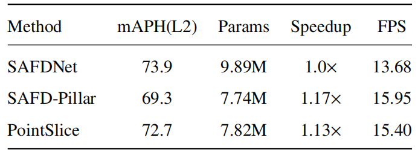
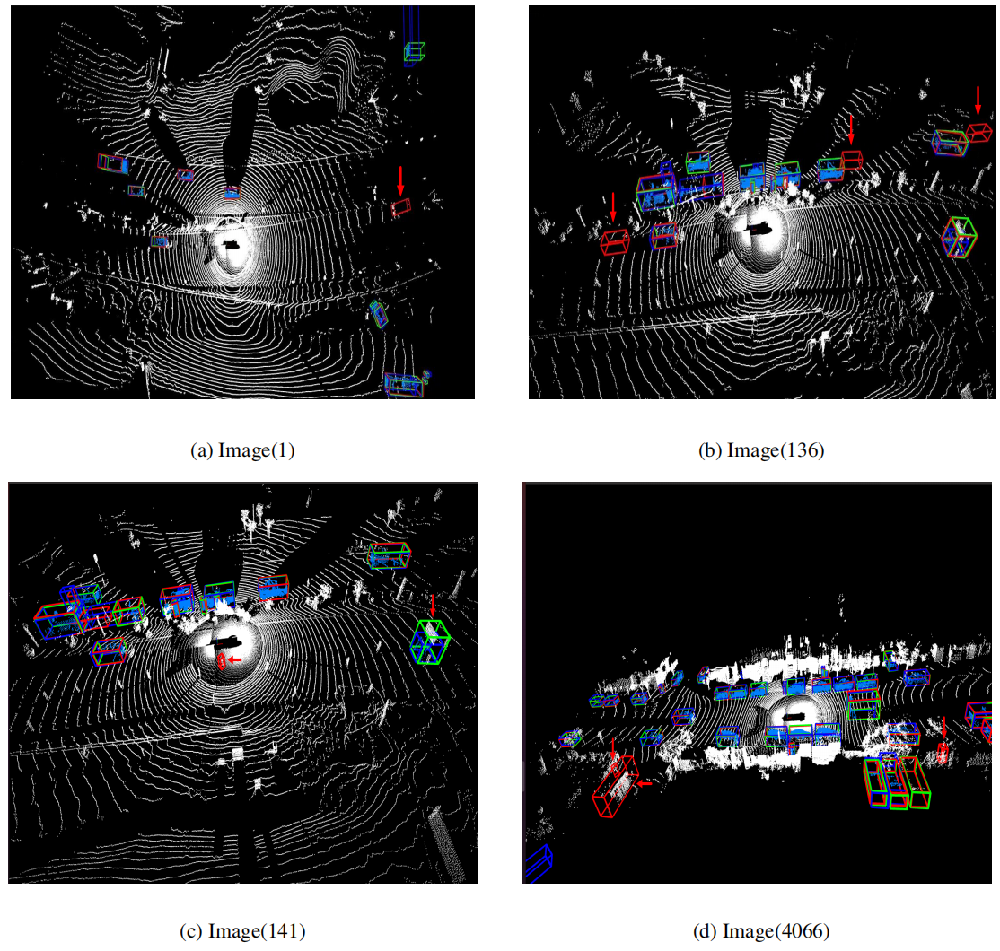

# PointSlice: Accurate and Efficient Slice-Based Representation for 3D Object Detection from Point Clouds

> https://github.com/qifeng22/PointSlice2

### 0 Absract

​		从**点云**中进行**3D 目标检测**在**自动驾驶**领域发挥着关键作用。目前，**点云**处理的主要方法为**基于体素的**方法和**基于柱体的**方法。**基于体素的**方法通过**细粒度空间分割**实现了较高的精度，但存在推理速度较慢的问题；**基于柱体的**方法提升了**推理速度**，但精度仍不及**基于体素的**方法。为解决这些问题，我们提出了一种新颖的**点云**处理方法 ——PointSlice，该方法沿水平面对**点云**进行切片处理，并包含一个专用的检测网络。PointSlice 的主要贡献如下：（1）一种新的**点云**处理技术，该技术将 3D**点云**转换为多组 2D（x-y）数据切片。该模型仅学习 2D 数据分布，将 3D**点云**视为独立的 2D 数据批次，这减少了**模型参数**数量并提升了**推理速度**；（2）引入**切片交互网络（Slice Interaction Network, SIN）**。为维持不同切片间的垂直关系，我们将 SIN 融入**2D 骨干网络**，这提升了模型的**3D 目标感知能力**。大量实验表明，PointSlice 实现了较高的检测精度和推理速度。在 Waymo 数据集上，与最先进的**基于体素的**方法（SAFDNet）相比，PointSlice 的**推理速度**快 1.13 倍，**模型参数**少 0.79 倍，而航向精度加权平均精度（mAPH）仅下降 1.2。在 nuScenes 数据集上，我们实现了 66.74 的平均精度（mAP），这是当前最先进的检测结果。在 Argoverse 2 数据集上，PointSlice 的**推理速度**快 1.10 倍，模型参数少 0.66 倍，而平均精度（mAP）仅下降 1.0。

### 1 Introduction

​		**基于 LiDAR 的 3D 目标检测**（LiDAR-based 3D object detection）因其在自动驾驶和**机器人技术**（robotics）中的应用而得到了广泛研究 [1]。点云固有的稀疏性和不均匀空间分布，使得将**2D 图像网络架构**（2D image network architectures）直接应用于点云数据面临挑战。为应对这些特性，处理点云的主流方法是**体素化**（voxelization）。两种主要的体素化方法为基于体素的方法和基于柱体的方法（见图 1）。

<strong>图 1：</strong>不同点云处理方法的比较：基于柱体的（方法）、基于体素的（方法）以及批量切片（方法）（本文提出）

​		基于体素的方法将点云空间划分为**3D 体素网格**（3D voxel grid）；诸如 HEDNet [2] 和 SAFDNet [3] 等模型采用**分层编码器 - 解码器架构**（hierarchical encoder-decoder architectures）和**稀疏检测头结构**（sparse detection head structures），实现了优异的检测性能。然而，基于体素的方法需要在 x、y、z 三个维度上进行学习，这导致其推理速度相较于基于柱体的方法更慢。基于柱体的方法将点云数据压缩到 x-y 平面，降低了**输入维度**（input dimensionality），从而提升了**推理效率**（inference efficiency）。例如，PillarNet [4] 采用**空间特征语义融合**（spatial feature semantic fusion）进一步提升检测精度。鉴于基于柱体方法的效率优势，一个自然的问题随之产生：基于体素的网络结构能否直接应用于以柱体格式初始化的点云？我们在**Waymo Open 数据集**（Waymo Open dataset）上开展实验以探究该问题。如表 1 所示，尽管使用柱体格式的点云（即**SAFD-Pillar（柱体格式适配的 SAFD 模型）**）相较于 SAFDNet 实现了 1.17 倍的推理速度提升，但其检测精度仅达到 69.3 的**航向精度加权平均精度（mAPH）**。

<strong>表 1：SAFDNet [3] 在 Waymo 验证集上的柱体化结果对比</strong>

​		为解决效率提升但检测精度下降的问题，本文提出 PointSlice 方法，该方法将三维点云数据转换为多个（x-y）切片，使模型能够保持接近基于体素方法的检测精度。PointSlice 引入了一种新颖的编码方式：将点云沿水平方向分割，将三维数据转换为一组二维切片，且神经网络不区分切片的高度（z 轴位置）。这组二维切片被视为一个批次（batch）。通过这种编码方式，PointSlice 可采用**二维卷积网络**（2D convolutional network）作为骨干网络进行特征提取，从而克服基于体素方法需依赖三维卷积神经网络（3D CNNs）进行推理的低效问题。

​		然而，由于同一点云的不同切片间存在关联，仅通过单个二维切片进行学习可能会影响模型的最终检测性能（消融实验结果已验证这一点）。为解决该问题，本文进一步引入切片交互网络（SIN），在二维骨干网络中融入**稀疏三维卷积**（sparse 3D convolutions），实现切片间的信息交互。由于 SIN 由三维卷积构成，过度使用会增加模型参数并降低推理效率。因此，我们仅在必要位置谨慎添加 SIN，以保证检测精度。实验结果验证了 SIN 网络的重要性。

​		为验证模型的有效性，我们在 Waymo 和 nuScenes 数据集上开展实验。在 Waymo 数据集上，本文模型的推理速度相较于当前最先进的基于体素方法（SAFDNet）提升 1.13 倍，参数数量减少 0.79 倍；在 nuScenes 数据集上，该模型的参数数量相较于 SAFDNet 减少 0.45 倍，同时实现了 66.74 mAP 的当前最优检测结果。

​		综上，本文的贡献如下：

​	（1）提出一种新颖的表示方法，将三维点云转换为二维切片；	

​	（2）设计专用的网络结构 PointSlice，创新性地融入切片交互网络（SIN）；

​	（3）在 Waymo、nuScenes 和 Argoverse 2 数据集上验证了该模型的高效性与高精度

### 2 Related Work

#### 2.1. Voxel-based 3D detectors

​		基于体素的检测网络将点云数据划分为三维体素网格，并利用神经网络进行三维目标检测。VoxelNet [5] 将点云划分为等间距的三维体素，通过**体素特征编码层**（Voxel Feature Encoding, VFE layer）将每个体素内的点簇转换为统一的特征表示。Voxel RCNN [6] 通过两阶段方法充分利用体素特征，实现目标的精确定位。TransFusion [7] 引入基于 Transformer 解码器的检测头。HEDNet [2] 提出用于三维目标检测的分层编解码器网络，采用编解码器块捕获空间特征间的长距离依赖关系，尤其针对大型远距离目标。这些方法不断提升检测精度，但推理效率仍是亟待解决的问题。

​		为解决推理效率问题，已有多项研究探索相关解决方案 [8,9]。VoxelNeXt [10] 引入全稀疏检测网络（fully sparse detection network）和稀疏检测头，解决了以往基于体素网络中需将稀疏特征转换为密集特征图导致推理效率降低的问题。SAFDNet [3] 进一步改进稀疏检测头，设计**自适应特征扩散策略**（Adaptive Feature Diffusion, AFD strategy），解决检测目标的中心特征缺失问题，在保证较高推理效率的同时实现了当前最优的检测结果。然而，即使采用全稀疏检测器，基于体素的方法在推理效率上仍落后于新兴的基于柱体的方法。

#### 2.2. Pillar-based 3D detectors

​		基于柱体的方法 [11,12] 在基于体素方法的基础上进一步提升模型在实际应用中的部署可行性。PointPillars [12] 将点云表示为垂直柱体（pillars），并采用二维卷积检测架构进行目标检测。CenterPoint [13] 通过关键点检测器识别目标中心，提升基于柱体方法的精度。PillarNet [4] 进一步提出具有空间语义特征融合的颈部网络（neck network）。文献 [14] 提出**混合体素 - 柱体融合网络**（Voxel-Pillar Fusion network, VPF），融合体素表示和柱体表示的优势。该研究采用三维和二维稀疏卷积构建稀疏体素 - 柱体编码器，并引入**稀疏融合层**（Sparse Fusion Layer, SFL），实现体素特征与柱体特征间的双向交互。尽管这些研究不断提升基于柱体方法的检测精度，但与持续发展的基于体素方法相比，仍存在精度差距。

​		为解决两类检测器的局限性，本文提出一种新颖的点云编码方法 PointSlice，该方法沿水平方向对**点云**进行切片处理，并采用切片交互网络（SIN）实现高效且精确的三维目标推理。

### 3 PointSlice

#### 3.1 Background(背景知识)

​		**稀疏卷积**（Sparse convolution）：稀疏卷积是专门为稀疏数据设计的卷积操作，仅在存在数据的位置进行计算。这种方法提升计算效率并减少内存占用。稀疏卷积主要分为两类：**子流形稀疏卷积**（submanifold sparse convolution, subm spconv）[15] 和**常规稀疏卷积**（regular sparse convolution）[16]。其中，子流形稀疏卷积保持输入特征图与输出特征图间的特征稀疏性；常规稀疏卷积通过将特征扩展到相邻区域，增加特征图密度，进一步填补稀疏空间。在切片交互网络（SIN）模块中，我们采用两种卷积类型实现切片间的信息交互。

​		**稀疏编解码器块**（Sparse encoder-decoder block, EDB）：HEDNet [2] 提出融合稀疏编解码器块，该模块在保持计算效率的同时，捕获特征间的长距离依赖关系。

​		**稀疏检测头**（Sparse detection head）：稀疏检测头主要解决密集特征图带来的冗余计算问题。SAFDNet [3] 在整个检测过程中保持特征稀疏性，其提出的自适应特征扩散（AFD）策略缓解了检测目标的中心特征缺失问题，使全稀疏检测网络能够实现更高精度。

#### 3.2 Overall architecture

​		图 2 展示了 PointSlice 模型的整体架构，该模型的运行分为三个阶段：（1）将点云转换为多组二维切片；（2）通过稀疏骨干网络提取切片特征，其中切片交互网络（SIN）实现切片间的高效信息交互；（3）通过稀疏检测头完成最终检测。

`图 2：PointSlice 的整体框架`  标注为 “点云到切片（Pointcloud to Slice） ” 和 “切片交互网络（Slice Interaction Network, SIN） ” 的虚线框代表本文的主要贡献。原始点云（point clouds）经过体素化（voxelization）和切片处理后，被输入到二维骨干网络（2D backbone network） 中进行特征提取。该二维骨干网络由 SIN-STEM 和 SIN-EDB 两部分构成。其中，SIN-STEM 包含二维稀疏残差块（2D Sparse Residual Blocks, 2DSRB） 和 SIN，负责高效且有效的特征生成；SIN-EDB 由 2DSRB、SIN、二维稀疏编解码器块（2D Sparse encoder-decoder block, 2DEDB） 以及自适应特征扩散（AFD）模块构建而成，旨在捕获特征间的长距离依赖关系（long-range dependencies） 。

##### 3.2.1 Point cloud to Slices

​		给定一组形状为（B, N, 3）的**点云**（point cloud）数据，其中 B 表示**批次大小**（batch size），N 表示每个点云中的点数（假设每帧点数相同），3 对应**空间坐标**（spatial coordinates）（x, y, z）。首先，我们采用 VoxelNet [5] 的方法对**点云**进行**体素化**（voxelization）处理，将点云转换为**规则体素网格**（regular voxel grid）。我们用 H、W、L 分别表示整个**体素空间**（voxel space）的高度（height）、宽度（width）和长度（length）。一批以体素形式表示的点云记为（B, H, W, L）。这意味着每个**体素坐标**（voxel coordinate）的范围为（0, 0, 0, 0）到（B−1, H−1, W−1, L−1）。每个体素的**特征**（feature）通过 PointNet [17] 网络生成，从而将点云转换为**稀疏张量**（sparse tensor）：
$$
\begin{equation}
S = (\text{feature}, \text{indice}, \text{shape}, \text{batch}),
\tag{1}
\end{equation}
$$
​		其中，feature（Nv, c）表示具有 c 个**特征通道**（feature channels）的**体素特征**（voxel feature）；indice（Nv, 4）表示**体素坐标**（voxel coordinates）{(bi, hi, wi, li)| i = 0, ..., Nv − 1}；shape（H, W, L）定义整个**体素空间**（voxel space）的**空间维度**（dimensions）；Nv 表示**体素数量**（number of voxels）。

​		由此可见，**体素空间**（voxel space）以三维形式表示，这会增加模型参数（model parameters）和**推理时间**（inference time）。因此，我们通过将三维体素空间转换为 H 个**二维切片**（2D slices）来简化体素空间，该二维切片以**稀疏张量**（sparse tensor）形式表示：
$$
\begin{equation}
S^{2D} = (\text{feature}, \text{indice}^{2D}, \text{shape}^{2D}, \text{batch} \times H),
\tag{2}
\end{equation}
$$

<strong>图3 Detailed structure of the 2D-SRB</strong>

其中，H 表示原始**三维体素空间**（3D voxel space）的高度（height），是后续**切片交互网络**（Slice Interaction Network, SIN）中所需的参数；shape2D（W, L）表示**二维切片**（2D slice）的**空间维度**（dimensions）。indice2D（Nv, 3）中第 i 个**体素坐标**（voxel coordinate）定义为（b²ᴰᵢ, w²ᴰᵢ, l²ᴰᵢ），其转换关系如下：
$$
\begin{equation}
b_i^{2D} = b_i \times h + h_i, \quad w_i^{2D} = w_i, \quad l_i^{2D} = l_i.
\tag{3}
\end{equation}
$$
需注意的是，由于我们仅将原始**体素空间**（voxel space）在高度方向（z 轴）上合并到**批次维度**（batch dimension），因此**体素数量**（number of voxels, Nv）保持不变。在公式（3）中，三维张量（3D tensor）的高度被转换为批次维度。这种**切片操作**（slicing operation）将三维点云表示（3D point cloud representation）简化为**二维稀疏张量**（2D sparse tensor），从而将**数据维度**（data dimensionality）降低 1 个。因此，模型计算（model computation）在二维空间中实现**并行化**（parallelized），这既减少了**模型参数**（model parameters）的数量，又缩短了**推理时间**（inference time）。

##### 3.2.2. Sparse 2D backbone

​		针对转换后的切片张量，我们设计了一个二维特征提取网络作为检测器的骨干网络。该骨干网络借鉴了 SAFDNet [3] 模型的结构，由二维稀疏残差块（2D Sparse Residual Blocks, 2D-SRB）（图 3）、二维稀疏编解码器块（2D Sparse Encoder-Decoder Blocks, 2D-EDB）（图 4）以及自适应特征扩散（Adaptive Feature Diffusion, AFD）构成。其中，2D-SRB 模块包含一系列稀疏残差块，每个残差块均包含两个二维子流形稀疏卷积（2D submanifold sparse convolutions）和一个连接其输入与输出的跳跃连接（skip connection）。对于 2D-EDB 模块，采用步长（stride）为 2 的常规稀疏卷积（regular sparse convolutions）对特征图（feature map）进行下采样（downsampling），同时采用稀疏转置卷积（sparse transposed convolutions）[18] 对特征图进行上采样（upsampling）。整个编解码过程（encoding-decoding process）采用二维卷积核（2D kernels）。特征提取完成后，AFD 结构对稀疏特征图（sparse feature maps）进行扩散处理，以提升稀疏检测头（sparse detection head）的检测精度（detection accuracy）。

<strong>图4 切片交互网络（SIN）与二维稀疏编解码器块（2D-EDB）模型的构成 </strong>

其中，二维稀疏编解码器块（2D-EDB）模块的设计借鉴自 SAFDNet [3]

##### 3.2.3. Slice Interaction Network

​		将点云转换为切片后，若仅将其作为二维切片处理，必然会丢失切片间关联（inter-slice connections），尤其是对三维目标（3D objects）至关重要的高度信息（height information）。如表 8 所示，结果表明，缺乏切片间交互（inter-slice interaction）会导致精度（accuracy）下降。为解决该问题，我们提出切片交互网络（Slice Interaction Network, SIN）。其核心思想是将同一点云（point cloud）的多个切片组合为三维体素（3D voxels），通过三维常规稀疏卷积（3D regular sparse convolutions）和子流形稀疏卷积（submanifold sparse convolutions）实现切片间交互。

​		在将多个切片输入网络之前，需要将这些切片转换为**三维体素**（3D voxels），这一过程可用以下公式表示：给定一批二维切片 S²ᴰ，对应的**体素表示**（voxel representation）如公式（1）所示。第 i 个**体素坐标**（voxel coordinate）为：
$$
\begin{equation}
\text{indice}_i = \left( b_i^{2D} \left\lfloor \frac{1}{H} \right\rfloor, b_i^{2D} \bmod H, w_i, l_i \right).
\tag{4}
\end{equation}
$$
由于常规稀疏 3D 卷积（spconv3d）在以往研究中 [3,2] 已展现出优异的性能与简洁性，我们在 2D-SRB 阶段融入了三个卷积核大小为 3、步长为 2 的 spconv3d 模块作为 SIN 模块。在 2D-EDB 阶段，为提升计算效率并确保输入输出特征图维度一致，本阶段的 SIN 模块采用卷积核大小为 3、步长为 1 的子流形稀疏 3D 卷积（submspconv3d）。总体而言，在 SIN 模块设计中，我们选用了结构简洁的常规 spconv3d 与子流形 spconv3d，它们有效促进了切片间的信息交互，从而保留了 3D 目标所必需的高度信息。

##### 3.2.4. Sparse detection head

​		本研究采用高效稀疏检测头作为最终输出层。基于 2D 切片的骨干网络、SIN 模块与稀疏检测头共同构成了 PointSlice 模型。通过将点云转换为 2D 切片、实现切片间信息交互，并结合全稀疏检测器，PointSlice 在性能上兼具高效率与高精度。

### 4 Experiments

#### 4.1. Datasets and metrics

​		为验证我们方法的有效性，我们在**Waymo**[27]、**nuScenes**[28] 和**Argoverse 2**[29] 数据集上开展了实验。对于 Waymo 数据集，训练集和验证集分别包含 16 万和 4 万份带标注样本。评价指标包括**平均精度均值（mean average precision, mAP）** 和基于朝向精度加权的平均精度均值（mAP weighted by heading accuracy, mAPH），这两个指标均进一步划分为两个难度等级：**L1 级**，代表包含超过 5 个激光雷达（LiDAR） 点的目标；**L2 级**，代表至少包含 1 个激光雷达点的目标。对于 nuScenes 数据集，评价指标包括 mAP 和nuScenes 检测得分（NDS, nuScenes Detection Score），其中 NDS 是 mAP 与另外 5 个指标的加权平均值，这 5 个指标分别用于衡量**平移误差**、**尺度误差**、**朝向误差**、**速度误差**和**属性误差**。Argoverse 2 数据集的评价指标为 mAP。

#### 4.2. Implementations details

​		我们的方法基于**OpenPCDet**[30] 实现。**PointSlice**采用 8 个**二维稀疏残差块（2D sparse residual blocks）**，并在第 2 个、第 4 个和第 8 个残差块之后插入**SIN 模块**。每个 SIN 模块由一个**稀疏卷积（spconv）** 构成，该卷积的**卷积核大小（kernel size）** 为 3，**步长（stride）** 为 2。该模型还包含一个**二维稀疏 EDB 层（2D sparse EDB layer）**，在该层内部插入了一个 SIN 模块，该模块由一个**子流形稀疏卷积（subm spconv）** 构成，其卷积核大小为 3，步长为 1。对于**AFD**和**稀疏检测头（sparse detection head）**，该模型采用与**SAFDNet**相同的配置。值得注意的是，在 nuScenes 数据集上进行检测时，该模型采用**TransFusion**[7] 中的**SparseTransFusionHead**作为其检测头。

​		所有实验均在 8 块**RTX 3090 显卡（GPUs）** 上进行，总**批次大小（batch size）** 为 16。为保证对比公平性，我们在 Waymo Open、nuScenes 和 Argoverse 2 数据集上分别训练 PointSlice 模型 24 个**轮次（epochs）**、20 个轮次和 24 个轮次。对于 Waymo Open 数据集，我们将**体素大小（voxel size）** 设置为 (0.08m, 0.08m, 0.15m)，**检测范围（detection range）** 在 X 轴和 Y 轴上为 [-75.52m, 75.52m]，在 Z 轴上为 [-2m, 4m]；我们采用**Adam 优化器（Adam optimizer）**，并使用**单周期学习率策略（one-cycle learning rate policy）**，将**权重衰减（weight-decay）** 设置为 0.05，**最大学习率（max learning rate）** 设置为 0.003；对于 nuScenes 数据集，体素大小设置为 (0.075m, 0.075m, 0.2m)，检测范围在 X 轴和 Y 轴上为 [-54m, 54m]，在 Z 轴上为 [-5m, 3m]；对于 Argoverse 2 数据集，体素大小为 (0.1m, 0.1m, 0.2m)，检测范围在 X 轴和 Y 轴上为 [-200m, 200m]，在 Z 轴上为 [-4m, 4m]。

表 2：基于柱体的模型（pillar-based models）与基于体素的模型（voxel-based models）在Waymo 验证集（Waymo validation set）上的性能对比，其中†表示我们的复现结果（reproduced results）。帧率（FPS，frame per second）是在单块NVIDIA 3090 GPU、批次大小（batch size） 为 1 的条件下测得。所有模型均在单帧设置（single-frame setting）下训练

#### 4.3. Comparison with state-of-the-art methods

​		**Waymo Open 数据集实验结果。**表 2 展示了该模型在验证集上的性能结果。**PointSlice 模型**的 L2 级基于朝向精度加权的平均精度均值（mAPH） 达到 72.7，相较于当前最先进的基于柱体的方法**PillarNet**，性能提升了 + 5.5%。与领先的基于体素的方法**SAFDNet**相比，我们的模型推理速度快 1.13 倍，参数减少 0.79 倍（即仅为其 79%），而 L2 级 mAPH 仅下降 1.2%。尽管我们的模型与 PillarNet 相比在推理速度上存在微小差距，但该方法进一步缩小了基于体素与基于柱体方法之间的性能差距，为未来研究提供了新的思路。

​		此外，根据文献 [11] 中提出的方法，增大**卷积核大小（convolution kernel size）** 可提升**模型精度（model accuracy）**。受此启发，我们进一步将**2D-SRB 模块**与**2D-EDB 模块**中的**子流形稀疏 3D 卷积（subm3d convolution）** 核大小从 3 调整为 5。如表 2 所示，实验结果表明，该调整使模型精度提升了 0.3 个 L2 级**基于朝向精度加权的平均精度均值（mAPH）**，同时保持了 14.6 **帧率（FPS）** 的推理速度。

​		**nuScenes 数据集实验结果。**如表 3 所示，**PointSlice 模型**在**nuScenes 验证集（nuScenes validation set）** 上取得了当前最先进（state-of-the-art, SOTA）的结果，**平均精度均值（mAP）** 达到 66.74。如表 4 所示，在**参数数量（parameter count）** 方面，PointSlice 的参数比**SAFDNet 模型**少 0.45 倍（即仅为其 55%），且推理速度快 1.08 倍。在**nuScenes 测试集（nuScenes test dataset）** 上，我们的模型取得了 67.6 的优异 mAP 成绩，相较于高效模型**PillarNet-18**[4] 和文献 [14] 中的方法，展现出更高的**检测精度（detection accuracy）**

<strong>表 3：不同模型在 nuScenes 数据集上的结果对比</strong>>

其中，“T.L.”、“C.V.”、“Ped.”、“M.T.”、“T.C.” 和 “B.R.” 分别表示**挂车（trailer）**、**工程车辆（construction vehicle）**、**行人（pedestrian）**、**摩托车（motor）**、**交通锥（traffic cone）** 和**路障（barrier）**。

<strong>表 4：不同模型在 nuScenes 验证集上的性能对比</strong>

<strong>表 5：不同模型在 Argoverse 2 验证集上的结果对比</strong>

​		`Argoverse2 数据集实验结果`。为进一步验证我们模型在**长距离、多类别场景（long-range and multi-class scenarios）** 下的检测性能，我们在**Argoverse 2 验证集（Argoverse 2 validation set）** 上开展了实验。如表 5 和表 6 所示，结果表明**PointSlice 模型**的**平均精度均值（mAP）** 达到 38.7。与当前最先进（state-of-the-art, SOTA）的**SAFDNet 模型**相比，其精度仅下降 1.0%，但推理速度快 1.10 倍，参数减少 0.66 倍（即仅为其 34%）。这些结果进一步证明了我们模型的**效率优势（efficiency advantage）**。

<strong>表 6：不同模型在 Argoverse 2 验证集上的性能对比</strong>

<strong>表 7：不同点云处理方法在 Waymo 验证集上的消融实验</strong>

<strong>表 8：在 PointSlice 模型不同位置应用 SIN 模块在 Waymo 验证集上的消融实验</strong>

#### 4.4. Ablation studies

​		为验证**PointSlice 模型**相较于**基于柱体的方法（pillar-based approach）** 在**点云处理（point cloud processing）** 方面的有效性，以及**SIN 模块**的贡献，我们在**Waymo 数据集**上开展了**消融实验（ablation experiments）**。

​		`切片与柱体方法的对比`。为保证**变量一致性（variable consistency）**，我们在对比实验中仅保留点云处理方法这一差异变量。两种方法的**二维特征图维度（2D feature map dimensions）**、维度数量以及**SRB 模块**与**EDB 模块**的数量均保持一致。**SAFDNet-pillar**代表一种配置方案，其中每个**体素大小（voxel size）** 设为 [0.08, 0.08, 6]，通过该配置可观察 SAFDNet 模型在基于柱体的处理方式下的性能。如表 7 所示，PointSlice 相较于 SAFDNet-pillar，在保持相近**推理速度（inference speed）** 的同时，**平均精度均值（mAP）** 精度提升了 3.4%，达到更高水平。这表明，在点云处理中，**切片方法（slice approach）** 相较于柱体处理方法，既能提供更精准的结果，又能保持模型的效率。

​		`SIN模块对比实验`。 为验证 SIN 模块在 PointSlice 模型中的作用，我们开展了三组对比实验，结果如表 8 所示。第一组代表 PointSlice 网络中**未包含 SIN 模块**的配置；第二组代表仅在**2D-STEM 模块**中插入 SIN 模块的配置。对比这两组结果可知，添加 SIN 模块使模型精度提升 1.0%，表明 SIN 模块确实能促进**跨切片特征交互（feature interaction across slices）**。第三组代表仅在**2D-EDB 模块**中添加 SIN 模块的配置，与第一组无 SIN 模块的结果相比，性能提升 0.4。第四组代表在 2D-STEM 与 2D-EDB 模块中均集成 SIN 模块的模型，取得了最佳性能，其**基于朝向精度加权的平均精度均值（mAPH）** 达到 72.7。这表明，SIN 模块对增强 2D-STEM 与 2D-EDB 模块的性能均发挥着关键作用。

​		`模型推理时的内存使用对比。`我们开展了实验，以评估不同模型在各类数据集上的**GPU 内存消耗（GPU memory consumption）**。为测量内存使用量，我们采用了**torch.cuda.max_memory_allocated()** 函数。实验结果如表 9 所示。由表可知，在 Waymo、nuScenes 和 Argoverse 2 数据集上，我们的PointSlice 模型的内存消耗分别仅为SAFDNet 模型的 0.64 倍、0.95 倍和 0.69 倍。这充分证明了我们所提模型的高效性与轻量化特性（efficiency and lightweight characteristics）。

<strong>表 9：不同数据集上模型 GPU 内存使用对比</strong>

#### 4.5. Qualitative visualization

​		如图 5 所示，我们对比了**PointSlice 模型**与**SAFDNet-pillar 模型**在**Waymo 验证集（Waymo validation dataset）** 上的**可视化结果（visualization results）**。可视化结果表明，我们的模型在**检测精度（detection accuracy）** 方面表现更优，而 SAFDNet-pillar 网络则存在**目标检测假阳性（false positive object detections）** 问题。

<strong>图 5：Waymo 数据集上的定性结果</strong>

​		其中，蓝色、红色和绿色框分别代表人工标注框（human annotations）、SAFDNet-Pillar 模型预测框和PointSlice 模型预测框。蓝色点表示落在人工标注框内的点云。与 SAFDNet-Pillar 相比，PointSlice 在目标识别精度（object identification accuracy） 上表现更优，且在减少假阳性（reducing false positives） 方面检测效果更显著。在点云可视化过程中，置信度阈值（score threshold） 设置为 0.3，非极大值抑制（non-maximum suppression, NMS）阈值 设置为 0.1。红色箭头标记出预测结果的差异之处。

### 5 Conclusion

​		综上，为克服**基于体素的模型（voxel-based models）** 推理效率低与**基于柱体的模型（pillar-based models）** 检测精度下降的难题，我们提出了一种适用于**三维点云数据（3D point cloud data）** 的**水平切片方法（horizontal slicing approach）**。该方法有效降低了基于体素的模型的**计算开销（computational burden）**。此外，我们引入了**切片交互网络（Slice Interaction Network, SIN）** 以促进**跨切片特征交互（feature interaction across slices）**，最终构建出**PointSlice 模型**。在 Waymo、nuScenes 及 Argoverse 2 数据集上的评估结果表明，PointSlice 模型实现了**高效率与高精度（high efficiency and high accuracy）** 的双重目标，验证了我们所提方法的有效性。