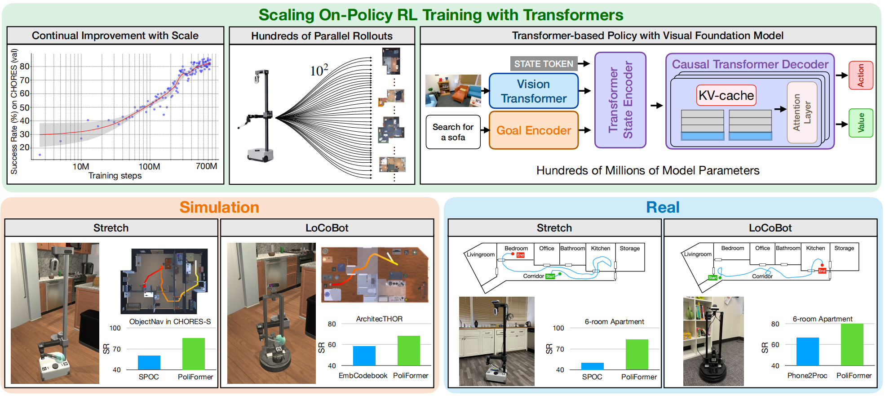
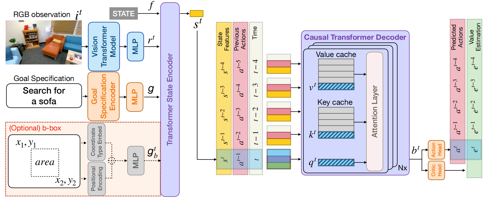
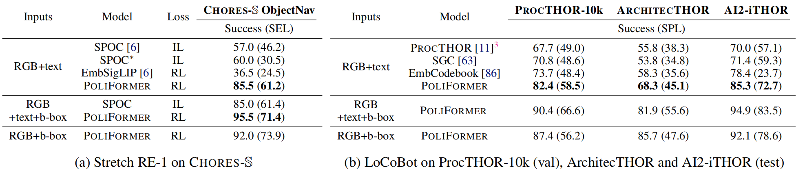
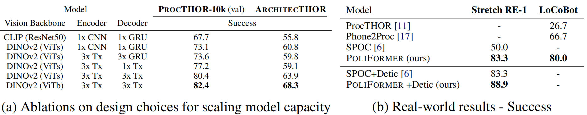
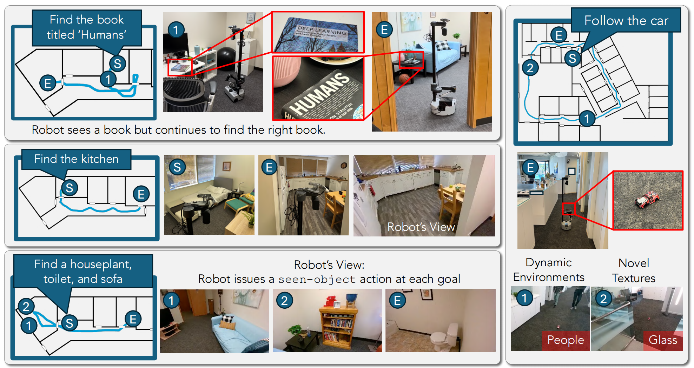

# PoliFormer: Scaling On-Policy RL with Transformers Results in Masterful Navigators

# PoliFormer：基于 Transformer 模型实现在线策略强化学习的规模化，进而打造卓越的导航智能体

### 0 Abstract

**Abstract:** 我们提出了 POLIFORMER（策略 Transformer（Policy Transformer）），这是一种仅基于 RGB 的室内导航智能体（indoor navigation agent），它通过端到端（end-to-end） 方式利用强化学习（reinforcement learning，RL） 进行规模化训练；尽管该智能体完全在仿真（simulation） 环境中训练，但无需任何适配就能泛化到真实世界（generalizes to the real-world）。POLIFORMER 采用基础视觉 Transformer 编码器（foundational vision transformer encoder）和因果 Transformer 解码器（causal transformer decoder），该解码器能够实现长期记忆（long-term memory）与推理（reasoning）功能。该智能体在多种不同环境中经过数亿次交互（interactions）训练，借助并行化（parallelized） 的多机器滚动（rollouts） 技术实现了高吞吐量（high throughput）的高效训练。POLIFORMER 是一款卓越的导航智能体，它在两种不同的载体（embodiments）——LoCoBot 机器人和 Stretch RE-1 机器人，以及四项导航基准测试（navigation benchmarks） 上均取得了最先进（state-of-the-art，SOTA） 的结果。它突破了以往研究的性能平台期（plateaus），在 CHORES-S 基准测试的目标物体导航（object goal navigation） 任务中实现了前所未有的 85.5% 成功率（success rate），绝对提升幅度达 28.5%。此外，无需任何微调（finetuning），POLIFORMER 就能轻松扩展到多种下游应用（downstream applications），例如目标跟踪（object tracking）、多目标导航（multi-object navigation）和开放词汇导航（open-vocabulary navigation）。

`关键词：`嵌入式导航、在线策略强化学习、Transformer 策略

### 1 Introduction 

​		**强化学习（Reinforcement Learning, RL）** 已被广泛用于训练**嵌入式机器人智能体（embodied robotic agents）**，以完成各类室内导航任务。采用**DDPPO（深度分布式近端策略优化）** [1] 进行的大规模、**在线策略（on-policy）**、端到端的 RL 训练，在使用浅层**基于 GRU（门控循环单元）的架构（GRU-based architecture）** [2] 时，能够实现近乎完美的**PointNav（点目标导航）¹ 性能。然而，对于更具挑战性的导航问题（如ObjectNav（物体目标导航）** [3]），该方法无法实现同样的突破；在 ObjectNav 任务中，智能体必须探索其所处环境，以定位并导航至所需类型的物体。由于更宽、更深的模型（如扩大规模的**Transformer（Transformer）** [4]）存在训练不稳定性和训练时间过长的问题，用于 ObjectNav 的 RL 方法通常未能突破浅层 GRU 架构的限制。

​		与**在线策略 RL（on-policy RL）** 不同 —— 在线策略 RL 存在样本效率低的问题，且通常需要复杂的**奖励塑造（reward shaping）** 和**辅助损失（auxiliary losses）** [5]——**模仿学习（Imitation Learning, IL）** 近年来在 ObjectNav 任务中展现出良好前景。Ehsani 等人（2023）[6] 证明，基于**Transformer 的 SPOC 智能体（transformer-based SPOC agent）** 在通过模仿**启发式最短路径规划器（heuristic shortest-path planners）** 进行训练时，不仅训练稳定、具有**样本效率（sample efficient）**，且在其基准测试中，性能显著优于以往的 RL 方法。然而，SPOC 最终未能达到精通水平，其成功率稳定在约 57%（进入**性能平台期（plateauing）**）。关键在于，正如我们在实验中所展示的，当进一步扩大数据规模和模型深度时，SPOC 的性能并未出现显著提升；我们推测，这是由于**状态空间探索（state-space exploration）** 不足所致 —— 因为**专家轨迹数据集（expert trajectory datasets）** 中通常包含极少的**错误恢复（error recovery）** 示例，而这可能会因**累积误差（compounding errors）** [7] 或推理过程中显著的**领域偏移（domain shifts）**，导致性能次优。

​		与**模仿学习（IL）** 不同，**强化学习（RL）** 要求智能体通过**交互式试错（interactive trial-and-error）** 进行学习，这使得智能体能够对**状态空间（state space）** 进行深度探索。这种探索有望让智能体学习到性能优于**专家演示（expert demonstrations）** 中行为的能力。这就引出了一个问题：我们能否将类**SPOC 架构（SPOC-like architectures）** 的建模见解与 RL 的探索能力相结合，以训练出一个**精通型导航智能体（masterful navigation agent）** ？遗憾的是，由于 RL 存在**样本效率低（sample inefficiency）** 的问题，且将深度（**Transformer**）架构与 RL 算法结合时存在复杂性，这种结合无法简单实现。在本研究中，我们提出了一种有效的方法，用于通过 RL 训练大型**基于 Transformer 的架构（transformer-based architectures）**，突破了以往研究的**性能平台期（plateaus）**，并在四个**基准测试（benchmarks）** 上均取得了**最先进（SoTA）** 结果。

`图 1：`POLIFORMER—— 一种在仿真环境中通过**大规模强化学习（RL at scale）** 训练的**基于 Transformer 的策略（transformer-based policy）**，在两种**机器人实体（embodiments）** 上，于仿真环境（左下）和现实世界（右下）中均实现了显著的性能提升。**SR（成功率，Success Rate）** 表示成功率。我们从多个维度对**在线策略强化学习训练（on-policy RL training）** 进行规模扩展：（左上）我们观察到，随着强化学习训练规模的扩大，性能持续提升；（中上）我们利用数百个**并行轨迹（parallel rollouts）** 以实现更高的**吞吐量（throughput）**；（右上）我们开发了一种基于 Transformer 的策略，将模型参数（model parameters） 规模扩展至数亿。

​		我们提出的方法 ——**POLIFORMER**，是一种基于**Transformer 的模型（transformer-based model）**，它在**AI2-THOR 仿真器（AI2-THOR simulator）** [8] 中通过**在线策略强化学习（on-policy RL）** 进行大规模训练，能够在无需任何适配的情况下，在现实世界中有效完成导航任务。我们重点强调三个关键设计决策，正是这些决策使得该成果成为可能。（i）**架构规模（Scale in Architecture）**：基于**SPOC 架构（SPOC architecture）**，我们开发了一种全基于 Transformer 的**策略模型（policy model）**，该模型采用了强大的**视觉基础模型（visual foundation model）**（**DINOv2** [9]，一种**视觉 Transformer（vision transformer）**），集成了用于改进状态总结的**Transformer 状态编码器（transformer state encoder）**，并采用**Transformer 解码器（transformer decoder）** 进行显式的**时序记忆建模（temporal memory modeling）**（图 1，右上）。重要的是，我们的 Transformer 解码器是**因果性的（causal）**，并且采用了**KV 缓存（KV-cache）** [10]，这使得我们在**轨迹采集（rollout collection）** 过程中能够避免巨大的计算成本，从而让 RL 训练具备可行性。（ii）**轨迹规模（Scale in Rollouts）**：我们利用数百个**并行轨迹（parallel rollouts）** 和较大的**批次大小（batch sizes）**，这不仅实现了较高的**训练吞吐量（training throughput）**，还使得我们能够通过大量的**环境交互（environment interactions）** 进行训练（图 1，中上）。（iii）**多样化环境交互规模（Scale in Diverse Environment Interactions）**：在 15 万个**程序化生成（procedurally generated）** 的**PROCTHOR 房屋（PROCTHOR houses）** [11] 中，使用经过优化的**Objaverse 资产（Objaverse assets）** [12, 13, 14]，通过 RL 对 POLIFORMER 进行大规模训练，最终实现了验证集性能的稳定提升（图 1，左上）。

​		POLIFORMER 在仿真环境中的多个导航基准测试中均展现出了卓越的性能。在 **CHORES-S** 基准测试中，它取得了令人瞩目的 **85.5% 成功率（Success Rate）**，相比于先前的 **最先进模型（SoTA model）[6]** 实现了 **28.5% 的绝对提升**。此外，它在 **ProcTHOR（+8.7%）**、**ArchitecTHOR（+10.0%）** 以及 **AI2-iTHOR（+6.9%）** 等基准上同样达到了**最先进（SoTA）的水平（见图1左）。这一成果在两种具有不同具身形式（embodiments）的机器人平台上均得以验证，即 LoCoBot [15] 与 Stretch RE-1 [16]，它们拥有各自独立的动作空间（action spaces）**。更值得注意的是，在**真实世界实验**中（见图1右），POLIFORMER 在 **从仿真到现实的零样本迁移（sim-to-real zero-shot transfer）** 场景下依然表现出色，使用 LoCoBot 实现了 **+13.3%** 的性能提升，而使用 Stretch RE-1 则达到了 **+33.3%** 的显著提升，全面超越了 **ObjectNav** 的各项基线模型。

​		我们进一步训练了 **POLIFORMER-BOXNAV**，该模型以边界框（bounding box）作为目标描述输入，而非预定义的类别标签。该边界框可来自于现成的开放词汇目标检测器（off-the-shelf open-vocab object detector） [18, 19] 或 **视觉语言模型（VLMs, Vision-Language Models）** [20, 21]。这种抽象设计使 **POLIFORMER-BOXNAV** 成为一个通用的导航系统，可由外部模型通过“提示（prompt）”进行控制，其理念类似于 **Segment Anything** [22] 的体系结构。该模型在环境探索中表现极为高效，一旦检测到边界框目标，便能迅速直达目标位置。**POLIFORMER-BOXNAV** 的提出代表了向导航基础模型（foundation model for navigation）迈出的重要一步；即使在未进行任何额外训练的情况下，这一通用导航器也能在现实世界中直接应用于多种下游任务，包括开放词汇目标导航（open-vocabulary ObjectNav）、**多目标导航（multi-target ObjectNav）**、**跟随人类（human following）**以及**目标追踪（object tracking）**等。

​		总而言之，我们的主要贡献包括以下三个方面：

（i）提出了 **POLIFORMER**，一种基于 **Transformer** 的策略模型（policy），通过在仿真环境中采用大规模强化学习（RL, Reinforcement Learning）进行训练，在四项基准测试中均取得了**最先进（SoTA）**的性能表现，并在两种不同的**具身形式（embodiments）**下成功实现了从仿真到现实的推广；
（ii）提出了一种训练方法论，使得能够通过基于策略的强化学习（on-policy RL）在端到端（end-to-end）的框架下高效地训练大规模神经模型；
（iii）开发了一种通用导航系统 POLIFORMER-BOXNAV，该系统能够在**零样本（zero-shot）**条件下执行多种下游导航任务，展现出强大的泛化能力与可迁移性。

​		

### 2 Related Work

​		在具身导航（Embodied Navigation）领域中，模仿学习（IL, Imitation Learning）与强化学习（RL, Reinforcement Learning）均取得了显著进展。近期的研究成果包括点目标导航（Point Goal Navigation） [1]、物体目标导航（Object Goal Navigation） [3, 23, 24, 25]、探索（Exploration） [26, 27, 28] 以及社交导航（Social Navigation） [29]，并在**从仿真到现实的迁移（sim-to-real transfer）** [6] 以及多个下游应用 [16, 30–35] 中展现出卓越表现。目前主流的导航智能体构建方法包括**端到端训练（end-to-end training）** [1, 6]，以及结合**地图构建（mapping）** [36–38] 或**现成的基础模型（off-the-shelf foundation models）** [39–43] 的模块化方法。在这些框架中，策略模型通常通过两种方式进行优化：其一是基于专家轨迹的**模仿学习（IL）** [44–50]；其二是在交互式环境中通过**强化学习（RL）** [29, 51–59]，并辅以精心设计的**奖励塑形（reward shaping）和辅助损失（auxiliary losses）** [5, 60–63] 以提升学习效果与稳定性。

​		基于 Transformer 的具身智能体策略。近期研究中，越来越多的工作开始将 **Transformer 架构（Transformer-based architectures）** 应用于具身智能体（embodied agents）的策略学习。决策 Transformer（Decision Transformer, DT） [64] 在离线环境中学习策略，其方法是基于历史状态、动作以及未来回报进行条件建模，从而为使用 Transformer 作为序列决策模型（sequential decision model）提供了一条有效路径。ODT（Online Decision Transformer） [65] 在 DT 的基础上进一步提出了结合离线预训练（offline pretraining）与在线微调（online finetuning）的混合学习框架，并在 D4RL 基准测试 [66] 中展示了具有竞争力的结果。最近，MADT（Multi-Agent Decision Transformer） [67] 在多智能体游戏环境中，展示了对离线训练的 DT 进行少样本（few-shot）在线强化学习微调（online RL finetuning）的能力。另一方面，Skill Transformer [68] 通过 模仿学习（IL, Imitation Learning） 来学习用于长时间跨度移动操控任务（long-horizon mobile manipulation tasks）的策略。
然而，与这些主要关注于特定控制任务（依赖于模仿学习预训练）的研究不同，我们的方法从零开始，完全基于纯强化学习（pure RL）进行训练，目标是学习一种能够在多种下游任务中实现零样本（zero-shot）泛化的通用导航策略。

​		近年来，大量研究工作致力于提升策略模型的**规模（scale）与训练稳定性（training stability）**。**GTrXL（Gated Transformer-XL）** [69] 在研究 [70] 中提出了通过在因果 Transformer 策略（causal transformer policies）中引入门控层（gating layers）以增强强化学习（RL）训练稳定性的方法。PDiT（Perception-Decision Interleaved Transformer） [71] 提出了一种将感知模块（perception）与决策 Transformer 模块（decision transformer blocks）交替融合的结构，并验证了其在完全可观测环境（fully-observed environments）中的有效性。GATO [72] 则在包含运动控制（locomotion）与操控（manipulation）等多种任务上，学习了一个大规模基于 Transformer 的策略模型。Performer-MPC（Performer-based Model Predictive Control） [73] 提出了一种可学习的模型预测控制（MPC, Model Predictive Control）策略，采用低秩注意力 Transformer（low-rank attention transformers, Performer [74]）作为可学习的代价函数（cost functions）。SLAP（Spatial-Language Attention Policy） [75] 则基于混合架构学习用于移动操控任务的策略。**Radosavovic 等人** [76] 通过结合 **强化学习（RL）** 与 **模仿学习（IL）** 训练出一个用于真实世界人形机器人运动（humanoid locomotion）的因果 Transformer，其输入为本体状态（proprioceptive state）而非视觉观测（visual observations），目标是学习在现实环境中保持稳定行走的平稳策略（stationary policy）。与上述方法相比，我们的研究实现了针对部分可观测（partially-observed）、长时程（long-horizon）导航任务的高效大规模基于 Transformer 的 on-policy 强化学习训练（on-policy RL training），并使用 **RGB 传感器输入** 进行决策。结果表明，我们的策略可无缝迁移至真实世界环境中运行。我们之所以能做到这一点，是因为在仿真中引入了**大量程序生成的场景布局（procedural scene layouts）和丰富的视觉物体多样性（visual variety of objects）**，从而无需复杂的**归纳偏置（inductive biases）**或多任务数据集聚合（multi-task dataset aggregation）。

​		迈向导航基础模型（Toward Navigation Foundation Models）。近年来，许多研究致力于构建具备通用能力的导航基础模型（general-purpose foundational navigation models）。例如，用于人形机器人户外运动（humanoid outdoor locomotion）的因果 Transformer（causal transformer） [76]，基于本体状态（proprioceptive state）进行训练，展示出了诸如手臂摆动（arm swinging）与上下文自适应（in-context adaptation）等涌现行为（emergent behaviors）。**GNM（General Navigation Model）** [77] 通过**模仿学习（IL, Imitation Learning）**，在多种**具身形式（embodiments）上训练了图像目标条件策略（image goal-conditioned policies）**——即根据目标位置处的图像作为条件输入（conditioning on an image at the desired goal location），从而实现了大规模数据训练，并能泛化（generalize）至未见过的具身形式控制。NOMAD [78] 则在 ViNT（Vision-based Navigation Transformer） [79] 的基础上进行了扩展，采用了扩散策略（diffusion policy）并同样基于图像目标条件（image goal conditioning）的输入。与这些工作不同，我们的方法直接利用高维 RGB 图像输入（rich RGB image inputs）进行导航，并通过自然语言文本（natural-language text）或边界框（bounding boxes）来指定目标，因为此类目标形式在真实场景中更易获取（far more easily available in real-world settings），从而显著提高了系统的可用性与通用性。

`图 2：`**POLIFORMER**是一种全基于**Transformer 的策略模型（transformer-based policy model）**。在每个时间步t，它接收**以自我为中心的 RGB 观测（ego-centric RGB observation）** \(i^t\)，通过**视觉 Transformer 模型（vision transformer model）** 提取视觉表征（visual representations） \(r^t\)，再利用视觉表征和**目标特征（goal features）** g（以及可选的检测到的**边界框目标特征（bounding box goal features）** \(g_b^t\)）对**状态特征（state features）** \(s^t\)进行进一步编码，通过**因果 Transformer 解码器（causal transformer decoder）** 对随时间变化的**状态信念（state belief）** \(b^t\)进行建模，最后，分别通过**线性演员头（linear actor head）** 和**线性评论家头（linear critic head）** 预测**动作对数概率（action logits）** \(a^t\)和**价值估计（value estimation）** \(e^t\)。在**轨迹采集（rollout collection）** 和**推理（inference）** 过程中，我们采用**KV 缓存（KV-cache）** [10] 作为**时序缓存策略（temporal cache strategy）**，以避免在每个新时间步重新计算所有先前时间步的**前向传播（forward pass）**，从而节省内存并加快训练与推理速度。

​	

### 3 Method

​		强化学习（RL） 虽然在策略训练方面有效且直观，但在**嵌入式人工智能（embodied AI）** 领域的规模化程度尚未达到其他领域的水平。强化学习（RL）主要应用于**短周期任务（short-horizon tasks）** [80, 81]、**小型环境（smaller environments）** [82, 83] 或**利用特权知识（utilizing privileged knowledge）** 的任务 [1]。我们从三个维度实现学习的规模化：（i）**网络容量（Network Capacity）**—— 通过 POLIFORMER 深度、高容量的模型架构（第 3.1 节）实现；（ii）**并行性与批次大小（Parallelism and Batch size）**—— 通过我们**高度并行化的训练方法（highly-parallelized training methodology）** 实现，该方法利用较大的**批次大小（batch sizes）** 提升效率（第 3.2 节）；（iii）**训练环境（Training Environments）**—— 通过优化仿真环境（simulation environment） 以支持高速训练实现（第 3.3 节）。

#### 3.1 The PoliFormer Architecture

​		我们现将详细介绍**POLIFORMER**的**Transformer 架构（transformer architecture）**（见图 2），该架构的设计灵感来源于**SPOC 架构（SPOC architecture）** [6]。尽管我们对 SPOC 架构做了几处细微但重要的修改（细节如下），但两者在架构上最大的差异体现在**Transformer 解码器（transformer decoder）** 部分：我们用 Llama 2 **大语言模型（LLM，Large Language Model）** [85] 中使用的解码器实现，替换了**标准 Transformer 解码器块（standard transformer decoder block）** [4, 84]。这一修改对**训练速度（training speed）** 和**推理速度（inference speed）** 产生了显著影响，详见第 3.1 节

​		在每个时间步t，POLIFORMER 接收以自我为中心的 RGB 观测$i^t$作为输入，并采用一个冻结的视觉 Transformer 模型（见第 3.1 节）提取视觉表征$r^t$。该视觉表征与目标嵌入g（见第 3.1 节）一起，由 Transformer 状态编码器进行总结，生成状态表征$s^t$。随后，因果 Transformer 解码器将状态特征$s^t$（以及$s^0, \dots, s^{t-1}$）编码为信念$b^t$（即状态信念）。最后，线性演员头和线性评论家头对$b^t$进行投影，分别预测动作对数概率$a^t$和价值估计$e^t$。

​		`视觉 Transformer 模型`。受此前研究 [6, 86] 启发，我们选择 DINOv2 [9] 作为视觉基础骨干网络，这得益于其出色的密集预测能力与仿真到现实迁移能力。该视觉骨干网络接收以自我为中心的 RGB 观测$i \in \mathbb{R}^{H \times W \times 3}$作为输入，并生成 patch 级表征$r \in \mathbb{R}^{\frac{H}{14} \times \frac{W}{14} \times h}$；其中 H 和 W 分别为观测图像的高度和宽度，h 为视觉表征的隐藏维度。我们将视觉表征重塑为$\ell \times h$的矩阵（其中$\ell = \frac{H \cdot W}{196}$），并对该表征进行投影，得到$v \in \mathbb{R}^{\ell \times d}$；这里 d 是 Transformer 状态编码器的输入维度。为实现有效的仿真到现实迁移，在仿真环境中训练时，保持视觉 Transformer 模型冻结至关重要。

​		`目标编码器（Goal Encoder）`。为保证对比的公平性，在使用 LoCoBot 机器人对智能体进行物体目标导航（ObjectNav）基准测试训练时，我们遵循 EmbCLIP [39] 的方法，采用独热嵌入层（one-hot embedding layer）对目标物体类别进行编码。在使用 Stretch RE-1 机器人的基准测试中，我们遵循 SPOC [6] 的方法，采用 FLAN-T5 small [87, 88] 模型对给定的自然语言目标（natural language goal）进行编码，并将该 T5 模型的最后一个隐藏状态作为目标嵌入（goal embedding）。在将目标嵌入传入 Transformer 状态编码器之前，我们始终会将该嵌入投影到期望的维度 d，最终得到$g \in \mathbb{R}^{1 \times d}$。

​		在部分实验中（详见第 4 节），我们通过边界框（b-box）指定目标物体 —— 这种方式既可以作为文本的补充，也可以替代文本。在这种情况下，目标编码器会同时使用正弦位置编码和坐标类型嵌入，对边界框的左上角坐标、右下角坐标及其面积（共 5 个数值）进行嵌入；随后通过多层感知机（MLP）将隐藏特征投影到期望的维度 d，最终得到$g_b \in \mathbb{R}^{5 \times d}$。

​		`因果 Transformer 解码器`。我们采用因果 Transformer 解码器对随时间变化的过程进行显式记忆建模。这一设计既支持长周期规划（例如，包含回溯的全面探索），也支持短周期规划（例如，绕开物体进行导航）。具体而言，因果 Transformer 解码器利用同一条轨迹内的状态特征序列$s = \{s_j\}_{j=0}^{j=t}$，构建其状态信念$b^t$。

​		与基于循环神经网络（RNN）的因果解码器 [89] 不同 —— 在轨迹采集过程中，基于 RNN 的因果解码器在每个时间步计算表征仅需恒定时间 —— 因果 Transformer 的标准实现方案在时间步t计算表征时，需消耗\(t^2\)的时间。这种巨大的计算成本导致采用因果 Transformer 模型的大规模在线策略强化学习（RL）训练速度缓慢。为克服这一挑战，我们采用 KV 缓存（KV-cache）技术 [10]，将过往的前向传播结果存储在两个缓存矩阵中，一个用于存储键（Keys），另一个用于存储值（Values）。借助 KV 缓存，我们的因果 Transformer 解码器仅需对最新的状态特征执行前向传播计算，这使得计算时间随t的增长呈线性关系，而非平方关系。尽管从数学角度来看，其速度仍慢于基于 RNN 的解码器所需的恒定时间，但在我们的实验设置中，实证结果表明，配备 KV 缓存的因果 Transformer 与 RNN 在整体训练帧率（FPS）上的差异很小。与其他时序缓存策略相比，我们发现 KV 缓存能带来显著的速度提升。有关不同缓存策略对训练速度的影响讨论，请参见附录 B.3 和图 5。

#### 3.2 Scalable RL Training Recipe(可扩展强化学习方案）

​		尽管 KV 缓存（KV-cache）加快了因果 Transformer 的运行速度，但仅依靠这一点仍不足以实现高效、快速的强化学习（RL）训练。在本节中，我们将介绍用于提升训练速度的方法。尽管这些单独的发现可能已在其他研究中被讨论过，但我们要强调的是，这些超参数对于实现高效训练乃至获得卓越结果至关重要。

​		我们采用多节点训练的方式对训练过程进行并行化处理，与以往方法 [30, 59, 86] 相比，并行轨迹（parallel rollouts）的数量增加了 4 倍（对于 Stretch RE-1 机器人智能体，我们使用 192 条并行轨迹；对于 LoCoBot 机器人智能体，我们使用 384 条并行轨迹）。我们在 4 个节点上采用深度分布式近端策略优化（DD-PPO）[1] 学习算法，共使用 32 块 A6000 图形处理器（GPU）和 512 个中央处理器（CPU）核心。这种规模扩展使训练速度提升了约 3.4 倍，相较于单节点训练实现了接近线性的性能增益；使用 4 个节点时，训练耗时约 4.5 天，而若使用单节点训练，则需要 15.3 天。

​		我们训练过程中的批次大小（以帧数计）等于并行轨迹数量（R）乘以轨迹长度（T）；因此，通过如上所述增加R，我们能够以乘法形式扩大总批次大小。我们遵循 SPOC [6] 的方法，在所有实验中均采用$2 \times 10^{-4}$这一较小的恒定学习率。在训练过程中，我们并未采用学习率衰减（annealing the learning rate）的方式，而是遵循 PROCTHOR [11] 的方法，通过将轨迹长度从$T=32$调整为$T=64$，最终调整为$T=128$来增大批次大小（对于 LoCoBot 机器人智能体，最终批次大小达到 49152 帧）。我们每训练 1000 万步（10M steps）就进行一次这样的轨迹长度调整，直至T达到 128。

#### 3.3 Scaling Environment Interactions（环境交互规模化）

​		在 LoCoBot 相关实验中，为保证与基准模型对比的公平性，我们采用原始的 PROCTHOR-10k 房屋场景进行训练。借助 KV 缓存技术，在 32 块 GPU 上使用 384 条并行轨迹训练 POLIFORMER 时，我们的每秒训练步数约为 2300 步。在 Stretch 相关实验中，我们遵循文献 [6] 的设置，采用包含约 4 万个带标注 Objaverse 3D 资产的 PROCTHOR-150k 房屋场景。由于在线策略强化学习要求智能体实时与环境交互，我们发现 AI2-THOR 仿真器中 Stretch RE-1 智能体所采用的连续物理仿真速度过慢，无法支持大规模高效训练。为解决这一问题，我们通过 “带碰撞检测的瞬移” 方法对智能体的连续运动进行离散化近似。具体而言，在智能体移动时，我们会沿着期望移动方向，用一个代表智能体的胶囊碰撞体进行物理投射检测。若投射未检测到任何物体（表明无潜在碰撞），则将智能体瞬移至目标位置；反之，则让 AI2-THOR 按常规方式进行连续运动仿真。对于旋转动作，我们首先将智能体瞬移至目标旋转姿态；若智能体的胶囊碰撞体与其他物体发生碰撞，则将其瞬移回原姿态，并让 AI2-THOR 进行连续旋转仿真。在我们的任务中，这些近似处理使仿真速度提升了约 40%。我们还发现，在使用 Objaverse 资产时，AI2-THOR 的场景加载与重置是一个显著的性能瓶颈。为此，我们对 AI2-THOR 的 Objaverse 3D 资产加载流程进行了优化：将资产以 Msgpack 格式存储（可直接用于 Unity 的 C# 后端），替代仅支持 Python 的 Pickle 文件。这一修改将新场景的加载时间从约 25 秒大幅缩短至约 8 秒。经过上述所有优化，在 32 块 GPU 上使用 192 条并行轨迹训练 Stretch RE-1 智能体时，我们的每秒训练步数从约 550 步提升至约 950 步，训练时间减少了约 42%。

### 4 Results

​		我们现将呈现实验结果。在 4.1 节中，我们将证明，通过 POLIFORMER 实现强化学习的规模化后，在两个实体（LoCoBot 和 Stretch RE-1）的四个仿真基准测试上均取得了当前最优（SoTA）结果。随后，在 4.2 节中，我们将展示，尽管 POLIFORMER 完全在仿真环境中训练，但其在现实世界中的迁移效果十分显著，性能优于先前研究；我们同样在上述两个实体上呈现这些结果。在 4.3 节中，我们将对各种设计选择进行消融实验分析。最后，在 4.4 节中，我们将通过定性分析表明，POLIFORMER-BOXNAV 能够以零样本方式扩展到多种下游应用中。

​		`Baseline（基准模型）`在基准模型选择上，我们选取了一系列模仿学习与强化学习领域的先前研究成果。SPOC [6] 是一个监督式模仿学习基准模型，在 AI2-THOR 仿真环境中基于最短路径专家轨迹训练而成。SPOC * 与 SPOC 结构相似，但训练所用的专家轨迹数量更多（230 万条 vs 10 万条）。我们构建该基准模型，旨在验证 SPOC 是否能通过增加数据量轻松实现性能提升。EmbSigLIP [6] 是 [6] 中同样使用的强化学习基准模型，但其训练所用的 GPU 时长与 SPOC 相当。针对 LoCoBot 实体的基准模型 [11, 63, 86] 均通过强化学习训练，且训练步数与 POLIFORMER 保持一致。本研究包含三种实验配置，分别以以下形式指定目标：（a）自然语言指令文本；（b）目标物体的边界框（b-box）；（c）边界框与文本结合。遵循 [6] 的设置，仿真环境中的边界框为真实边界框（ground-truth b-boxes），因此这类模型与仅基于 RGB 图像的模型不具备公平可比性。在现实世界实验中，我们用开放词汇物体检测器 Detic [18] 的输出替代真实边界框，该检测器仅以 RGB 图像作为输入，因此所有对比均具备公平性。

`表 1：`在四个物体目标导航（ObjectNav）基准测试中，POLIFORMER 均取得了当前最优（SoTA）性能。（a）在采用 Stretch RE-1 实体的 CHORES-S 物体目标导航基准测试中，POLIFORMER 的性能显著优于此前通过模仿学习（IL）训练的当前最优模型 SPOC。（b）在三个采用 LoCoBot 实体的测试集上，POLIFORMER 的性能优于所有先前研究成果（这些模型均通过强化学习训练）。

​		`Implementation Details`  在 LoCoBot 基准测试中，我们遵循文献 [86] 的设置，在 ProcTHOR 房屋的 1 万个训练场景中训练模型及基准模型，训练步数为 4.35 亿步。评估集包括：AI2-iTHOR 的 20 个场景中的 800 个任务、ARCHITECTHOR 的 5 个场景中的 1200 个任务，以及 PROCTHOR-10k 的 150 个场景中的 1500 个任务。对于 Stretch-RE1，我们在 15 万个 ProcTHOR 房屋场景中训练模型及基准模型，这些场景包含经 ObjaTHOR 处理的 Objaverse 资产。随后，我们参照文献 [6] 的设置，在 200 个场景中的 200 个任务上进行评估。训练在 32 块 GPU 上进行，耗时 4.5 天。有关训练、推理及环境设置的更多细节，请参见附录 B。

#### 4.1 POLIFORMER Achieves SoTA on four Benchmarks（POLIFORMER 在四项基准测试中取得当前最优（SoTA）结果）

​		表 1a 显示，在 CHORES-S 基准测试中，POLIFORMER 的成功率相较于此前最优模型实现了 28.5% 的绝对提升。EmbSigLIP 基准模型的结果引自文献 [6]；我们推测，其性能表现不佳的部分原因在于，为与 SPOC 的训练预算保持一致，其训练预算受到了限制。

​		`POLIFORMER 可跨实体适用`。表 1b 显示，POLIFORMER 的卓越性能并非局限于单一实体。LoCoBot 与 Stretch-RE1 机器人在机身尺寸、动作空间及摄像头配置上均存在差异。尽管如此，在 PROCTHOR-10k（验证集）、ARCHITECTHOR 及 AI2-iTHOR 基准测试中，POLIFORMER 相较于各测试中最优的基准模型，仍分别实现了 8.7%、10.0% 及 6.9% 的成功率绝对提升。

#### 4.2 POLIFORMER Generalizes to the Real World（可泛化至真实世界）

​		为验证 POLIFORMER 的仿真到现实（sim-to-real）迁移能力，我们在针对两种不同实体的现实世界基准测试中对其进行了评估。我们为 LoCoBot 采用包含 15 个任务的评估集（3 种不同起始姿态搭配 5 种不同目标），为 Stretch-RE1 采用包含 18 个任务的评估集（3 种不同起始姿态搭配 6 种不同目标描述），分别与文献 [17] 和 [6] 的设置保持一致。实验中，我们未对模型进行任何现实世界微调，且测试环境为模型未见过的房屋场景。在仅使用文本（目标描述）的设置下，POLIFORMER 相较于基准模型，在 Stretch-RE1 和 LoCoBot 实体上分别实现了 33.3% 和 13.3% 的显著性能提升（见表 2b）。即便与 Phone2Proc [17] 这一拥有环境布局特权知识的基准模型相比，POLIFORMER 的性能依然更优。

#### 4.3 Ablation Studies（消融实验）

​		构建高效强化学习（RL）导航模型的方案，是经过实验验证的多项设计决策整合后的成果，这些设计的组合最终使我们实现了当前最优（SoTA）性能。表 2a 展示了 POLIFORMER 的性能提升过程。

- 第 1 行与第 2 行对比：将视觉编码器从 CLIP ResNet-50 替换为 ViT-small DINOv2 后，成功率平均提升 5.2%。
- 第 3 行与第 5 行对比：采用 3 层 Transformer 解码器替代 3 层门控循环单元（GRU），性能提升 5.5%。
- 第 4 行与第 5 行对比：将解码器层数从 1 层增加至 3 层，性能提升 4%。
- 第 5 行与第 6 行对比：使用容量更大的视觉编码器（ViT-b 替代 ViT-s），成功率提升 3.2%。

总体而言，这些设计调整共带来了 13.6% 的平均绝对性能提升。

`表 2：`本表格呈现两部分内容，（a）为模型容量扩展相关设计选择的消融实验结果；（b）为两种不同实体在现实世界中的测试结果。

`图 3：`我们通过零样本方式应用 POLIFORMER-BOXNAV，完成了多项任务，包括寻找特定书名的书籍、导航至厨房、按顺序导航至多个物体，以及在办公楼内追踪玩具车。

​		`POLIFORMER 的性能是否已达到饱和？`图 1（左上角）展示了 POLIFORMER 在约 7 亿个环境步的训练过程中，在 CHORES-S 物体目标导航（ObjectNav）验证集上的成功率变化。该图显示，POLIFORMER 的性能尚未出现收敛迹象，我们预计随着计算资源的进一步投入，其性能将继续提升。这表明，要实现接近完美的物体目标导航性能，或许只需进一步扩展我们的训练方案即可。

#### 4.4 Scaling POLIFORMER to Everyday Tasks

​		当仅通过边界框（b-box）为 POLIFORMER 指定目标时，我们得到了 POLIFORMER-BOXNAV。尽管 POLIFORMER-BOXNAV 无法利用 “特定类型物体应存在于何处” 的相关有效先验知识（对比表 1a 第 6 行与第 7 行可见，其性能略逊于同时采用边界框与文本目标指定的模型），但这一设计决策使其成为一个**完全通用、支持提示交互的导航系统**—— 能够导航至任何可通过边界框指定的目标。图 3 展示了四个定性示例：通过结合开放词汇物体检测器（Detic [18]）与视觉语言模型（VLM，GPT-4o [90]），POLIFORMER-BOXNAV 能够以零样本方式完成以下导航任务：（1）寻找特定书名的书籍；（2）导航至指定类型的房间；（3）按顺序导航至多个物体；（4）在办公楼内追踪行驶中的玩具车。只需将目标指定为边界框，并结合现有成熟系统，我们就能获得复杂的导航行为 —— 而这些行为若通过其他方式实现，需针对每个任务单独训练，过程十分繁琐，还需设计新的奖励函数或采集新数据。

​	

### 5 Discussion 

​		`局限性：`针对具有庞大搜索空间的长周期任务训练强化学习（RL）智能体，需要大量计算资源，且对奖励函数设计的精细度要求极高。尽管我们认为 POLIFORMER 具备扩展到其他任务的能力，但针对物体操作等新型任务，仍需为其设计全新的奖励模型。关于局限性的更多讨论，请参见附录 E。

​		`结论：`本文提出了一套适用于长周期导航任务的强化学习规模化训练方案。我们的模型 POLIFORMER 在两个不同实体的四个仿真基准测试与两个现实世界基准测试中，均取得了当前最优（SoTA）性能。此外，我们还证实，POLIFORMER 在日常下游任务中具有巨大的应用潜力。

