# PointNet: Deep Learning on Point Sets for 3D Classification and Segmentation

> 原文：https://arxiv.org/abs/1612.00593

### Abstract

​		点云是一种重要的几何数据结构。由于其不规则的格式，大多数研究人员将此类数据转换为规则的3D体素网格或图像集合。然而，这会导致数据变得不必要地庞大并引发问题。在本文中，我们设计了一种直接处理点云的新型神经网络，该网络充分考虑了输入中点的排列不变性。我们的网络名为`PointNet`，为从物体分类、部件分割到场景语义解析的应用提供了统一架构。尽管结构简单，PointNet却具有高度效率和有效性。实证表明，它展现出与现有技术相当甚至更优的强劲性能。理论上，我们提供了分析以理解网络学习的内容，以及为何网络对输入扰动和损坏具有鲁棒性。

### 1. Introduction

​		在本文中，我们探索能够处理3D几何数据（如点云或网格）的深度学习架构。典型的卷积架构需要高度规则的输入数据格式（例如图像网格或3D体素），以便执行权重共享和其他核优化。由于点云或网格并非规则格式，大多数研究者通常会将此类数据转换为规则的3D体素网格或图像集合（例如多视角图像），再将其输入深度学习架构。然而，这种数据表示转换会导致结果数据变得不必要地庞大，同时还引入了可能掩盖数据自然不变性的量化伪影。

​		出于这一原因，在本文中，我们专注于使用简单的点云作为3D几何的输入表示形式，并将所得到的深度网络命名为PointNets。点云是简单统一的结构，避免了网格的组合不规则性和复杂性，因而更易于学习。然而，PointNet仍需遵循点云仅是点的集合这一事实，因此其输出必须对点的**排列顺序保持不变**，这需要在网络计算中进行某些对称化处理。此外还需考虑对**刚性运动的不变性**。

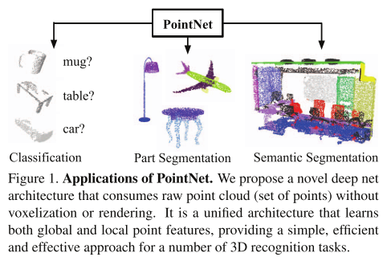

​		我们的PointNet是一种统一架构，直接以点云作为输入，并输出整个输入的分类标签或输入中每个点的逐点分割/部件标签。我们网络的基本架构出奇简单——在初始阶段，每个点被相同且独立地处理。在基本设置中，每个点仅由其三个坐标（x,y,z）表示。可通过计算法向量和其他局部或全局特征来增加额外维度。

​		我们方法的核心在于使用单一对称函数——最大池化（max pooling）。实际上，该网络学习了一组优化函数/准则，这些函数/准则会选择点云中有趣或信息丰富的点，并编码选择它们的原因。网络的最终全连接层将这些学习到的最优值聚合成上述整个形状的全局描述符（用于形状分类），或用于预测逐点标签（用于形状分割）。

​		我们的输入格式很容易应用刚性变换或仿射变换，因为每个点都是独立变换的。因此，我们可以添加一个数据依赖的空间变换网络，试图在PointNet处理数据之前对其进行规范化，从而进一步提高结果。

​		在本文中，我们提供了方法的理论分析和实验评估。我们证明，我们的网络可以近似任何连续的集合函数。更有趣的是，结果显示我们的网络通过学习使用稀疏的关键点集合来概括输入点云，这些关键点通过可视化大致对应物体的骨架结构。理论分析解释了为何我们的PointNet对输入点的小扰动以及通过点插入（异常点）或删除（缺失数据）造成的损坏具有高度鲁棒性。

​		在多个基准数据集（涵盖形状分类、部件分割到场景分割任务）上，我们通过实验将我们的PointNet与基于多视图和体素表示的最先进方法进行对比。在统一架构下，我们的PointNet不仅速度显著更快，还展现出与现有技术相当甚至更优的强劲性能。

The key contributions of our work are as follows:
• 设计了一种适用于处理3D无序点集的新型深度网络架构；
• 展示了如何训练该网络以执行3D形状分类、形状部件分割和场景语义解析任务；
• 对方法的稳定性和效率进行了全面的实证和理论分析；
• 可视化了网络中选定神经元计算的3D特征，并对其性能给出了直观解释。

​		用神经网络处理无序集合的问题是一个极具普适性和基础性的挑战——我们预期所提出的方法思想可迁移至其他领域。

### 2. Related Work

​		`Point Cloud Features`：目前大多数点云特征都是针对特定任务手工设计的。点特征通常编码了点的某些统计属性，并被设计为对某些变换具有不变性，这些特征通常被分类为内蕴特征[2,21,3]或外蕴特征[18,17,13,10,5]。它们也可以归类为局部特征和全局特征。对于特定任务而言，找到最优特征组合并非易事。

​		`Deep Learning on 3D Data`： 3D数据具有多种流行的表示形式，因此产生了多种学习方法。**Volumetric CNNs**：[25, 15, 16]是率先在体素化形状上应用3D卷积神经网络的先驱。然而，由于数据稀疏性和3D卷积的计算成本，体素表示受限于其分辨率。**FPNN[12]和Vote3D[23]**提出了特殊方法来处理稀疏性问题；然而，它们的操作仍然基于稀疏体积数据，处理大规模点云时具有挑战性。**Multiview CNNs**：[20, 16]尝试将3D点云或形状渲染为2D图像，然后应用2D卷积网络进行分类。通过精心设计的图像CNN，这类方法在形状分类和检索任务[19]中取得了主导性能。然而，将其扩展到场景理解或其他3D任务（如点分类和形状补全）并非易事。**Spectral CNNs**：一些最新研究[4, 14]在网格上使用谱卷积神经网络。然而，这些方法目前仅限于流形网格（如有机物体），且如何扩展到非等距形状（如家具）尚不明确。**Feature-based DNNs**：[6, 8]首先通过提取传统形状特征将3D数据转换为向量，然后使用全连接网络对形状进行分类。我们认为这些方法受限于所提取特征的表示能力。

​		`Deep Learning on Unordered Sets`：深度学习在无序集合上的应用：从数据结构的角度来看，点云是向量的无序集合。尽管深度学习中的大多数工作专注于规则输入表示（如序列[语音和语言处理]、图像和体积数据[视频或3D数据]），但在点集上的深度学习研究仍较为有限。Oriol Vinyals等人[22]的最新工作探索了这一问题。他们使用带有注意力机制的读取-处理-写入网络来消费无序输入集合并证明其网络具备对数字排序的能力。然而，由于他们的工作聚焦于通用集合和自然语言处理应用，集合中的几何角色未被体现。

### 3. Problem Statement

​		我们设计了一个可直接处理无序点集输入的深度学习框架。点云被表示为三维点的集合 {*P**i*∣*i*=1,...,*n*}，其中每个点 *P**i* 由其 (*x*,*y*,*z*) 坐标和额外的特征通道（如颜色、法向量等）组成的向量表示。为了简化说明，除非特别标注，我们仅使用 (*x*,*y*,*z*) 坐标作为点的特征通道。

​		**针对物体分类任务**，输入点云可直接采样自原始三维模型表面，或通过预分割从场景点云中提取出独立物体实例。本研究提出的深度网络将为所有k个候选类别输出k组判别概率值。**对于语义分割任务**，输入数据可为单一物体的部件分割样本，或从三维场景中截取的子空间区域用于物体实例分割。本模型将为每个点输出m个语义子类别的判别得分，共计生成n×m组预测结果（n表示输入点云的总点数，m代表目标语义细分类别数）。

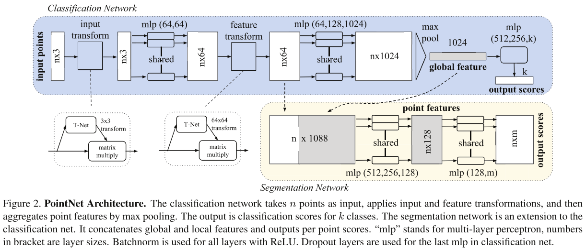

### 4. Deep Learning on Point Sets

​		我们的网络架构设计（第4.2节）受 R*n* 空间中点集特性（第4.1节）的启发。

#### 4.1. Properties of Point Sets in Rn

​		我们的输入是欧几里得空间中点的子集，具有三个关键属性：

• 无序性。与图像中的像素阵列或体素网格中的体素阵列不同，点云是没有特定顺序的点集合。换句话说，消耗N个3D点集的网络需要对输入集在数据输入顺序上的N!种排列具有不变性。
• 点之间的交互性。这些点来自具有距离度量的空间。这意味着点不是孤立的，相邻点形成有意义的子集。因此，模型需要能够从邻近点捕获局部结构，并捕捉局部结构之间的组合交互。
• 作为几何对象，点集的学习表示应对某些变换具有不变性。例如，对点集整体进行旋转和平移不应改变全局点云类别或点的分割结果。

#### 4.2. PointNet Architecture

​		我们的完整网络架构如图2所示，其中分类网络和分割网络共享了大部分结构。请阅读图2的标题说明以了解其流程。

​		我们的网络包含三个关键模块：作为对称函数的最大池化层（用于聚合来自所有点的信息）、局部与全局信息组合结构，以及两个联合对齐网络（用于对齐输入点和点特征）。我们将在下文中通过不同段落分别讨论这些设计选择背后的原因。

​		**无序输入的对称函数处理** 为了使模型对输入置换具有不变性，存在三种策略：
1）将输入排序为规范顺序；
2）将输入视为序列训练循环神经网络（RNN），但通过所有可能的排列方式增强训练数据；
3）使用简单的对称函数聚合来自每个点的信息。此处，对称函数以n个向量作为输入，输出一个对输入顺序保持不变的新向量。例如，加法（+）和乘法（*）运算符是对称二元函数。

​		虽然排序听起来像是一个简单的解决方案，但在高维空间中实际上不存在一种对点的扰动保持稳定的排序策略（在一般情况下）。这一点可以通过反证法轻易证明。如果存在这样的排序策略，它定义了一个从高维空间到一维实线的双射映射。不难看出，要求排序对点的扰动保持稳定，等同于要求这个映射在降维过程中保持空间邻近性——这个任务在一般情况下是不可能完成的。因此，排序并不能完全解决顺序问题，而且由于顺序问题持续存在，网络很难学习从输入到输出的一致性映射。如实验所示（图5），我们发现直接将MLP应用于排序后的点集效果较差，尽管比直接处理未排序输入略好。

​		使用RNN的思路将点集视为序列信号，并希望通过用随机排列的序列训练RNN，使其对输入顺序具有不变性。然而，在"OrderMatters"[22]研究中，作者已证明顺序确实会产生影响且无法被完全忽略。虽然RNN对短序列（数十个元素）的输入顺序具有相对良好的鲁棒性，但难以扩展到包含数千个输入元素的场景（这正是点集的常见规模）。通过实验验证，我们也证明了基于RNN的模型性能不如我们提出的方法（图5）。

​		我们的核心思想是：通过对集合中变换后的元素应用对称函数，来近似定义在点集上的通用函数：

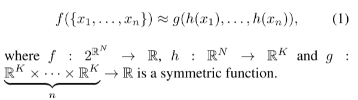

从经验上看，我们的基础模块非常简单：通过多层感知机网络来近似函数h，并通过单变量函数与最大池化函数的组合来构建函数g。实验表明这一设计效果优异。通过设计多个不同的h函数，我们可以学习到多个f函数，从而捕捉点集的不同几何特性。

​		尽管我们的核心模块看似简单，但它具有引人注目的特性（参见第5.3节），并能在多个不同应用领域实现强劲性能表现（参见第5.1节）。得益于该模块的简洁性特征，我们还能够开展第4.3节所述的理论分析。

​		**局部与全局信息聚合**  ：上述模块的输出构成一个向量 [*f*1,...,*f**K*]，该向量是输入集的全局特征签名（global signature）。我们可轻松基于该全局形状特征训练SVM（支持向量机）或多层感知机分类器以完成分类任务。然而，点云分割任务需要结合局部与全局知识。我们通过一种简单而高效的方式实现这一目标。

​		我们的解决方案如图2（分割网络）所示。在计算出全局点云特征向量后，我们通过将该全局特征与每个点的局部特征进行拼接（concatenation），将其反馈至各点的特征表达中。随后，基于融合后的点特征提取新的逐点特征——此时每个点的特征已同时包含局部与全局信息。

​		通过这种改进，我们的网络能够预测同时依赖**局部几何特性**和**全局语义信息**的**逐点量**。例如，我们可以精确预测每个点的法向量（补充材料中的图示），这验证了网络具备从点的局部邻域汇总信息的能力。在实验部分，我们还将展示该模型在形状部件分割与场景分割任务上达到了**最先进性能**。

​		**联合对齐网络** ：点云的语义标注必须在其经历某些几何变换（例如刚体变换）时保持不变。因此，我们期望通过点集学习得到的表示对这些变换具有不变性。

​		一种自然的解决方案是在特征提取前将所有输入集对齐到规范空间。Jaderberg等人[9]提出了空间变换器的概念，通过采样和插值对齐2D图像，该操作通过GPU实现的特殊定制层完成。

​		由于我们采用点云作为输入形式，相比文献[9]的方法，能够以更简单的方式实现这一目标。我们无需创建任何新层，也不会引入类似图像处理中的混叠效应。我们通过微型网络（图2中的T-net）预测仿射变换矩阵，并直接将此变换应用于输入点的坐标。该微型网络结构与主网络类似，由`点独立特征提取`、`最大池化`和`全连接层`等基础模块构成。关于T-net的更多细节请参阅补充材料。

​		该思想可进一步扩展到特征空间的对齐。我们可以在点特征上插入另一个对齐网络，预测`特征变换矩阵`以对齐不同输入点云的特征。然而，特征空间中的变换矩阵维度远高于空间变换矩阵，这极大增加了优化难度。为此，我们在softmax训练损失函数中加入正则化项，约束特征变换矩阵接近正交矩阵：

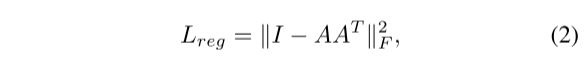

其中，A是通过微型网络预测得到的特征对齐矩阵。正交变换不会丢失输入信息，因此是最理想的选择。我们发现，通过添加该正则化项，优化过程变得更加稳定，且模型的性能得到提升。

#### 4.3. Theoretical Analysis

​		`Universal approximation（通用逼近）`：我们首先展示神经网络对**连续集合函数**的**通用逼近能力**。根据集合函数的连续性原理，直观而言，对输入点集的**微小扰动**不应显著改变函数输出值（例如分类或分割得分）。

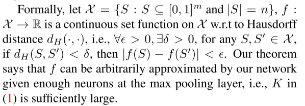

​	我们的定理表明，如果在最大池层有足够的神经元，则f可以由我们的网络任意近似，即：（1）中的K足够大。

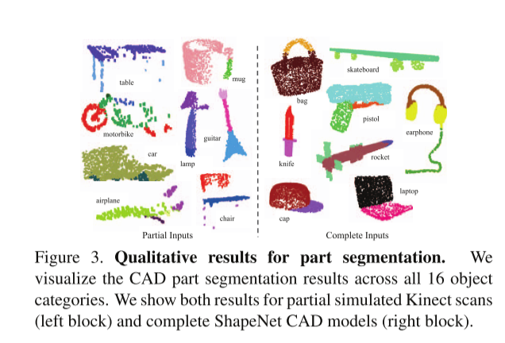

`理论1：`	

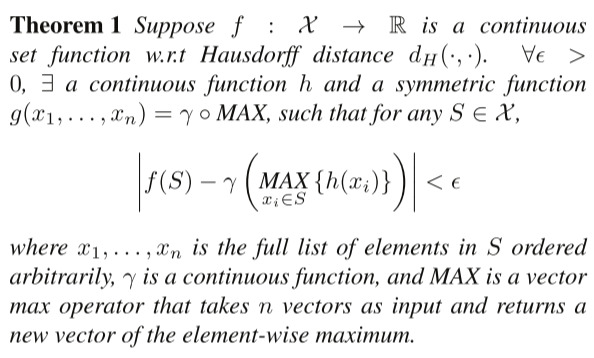

​		该定理的证明可在我们的补充材料中找到。核心思想是：在最坏情况下，网络可以通过将空间划分为等尺寸的体素（voxel），学习将点云转换为体素表示。然而实际应用中，网络会学习到更智能的空间探测策略，这将在点函数可视化中得以展现。	

​		`瓶颈维度和稳定性`(Bottleneck dimension and stability)：从理论和实验角度，我们发现网络的表达能力受最大池化层维度（即公式(1)中的K值）的显著影响。本节将展开分析，同时揭示模型稳定性的相关特性。

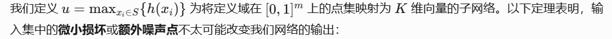

`理论2：`

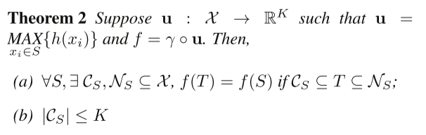

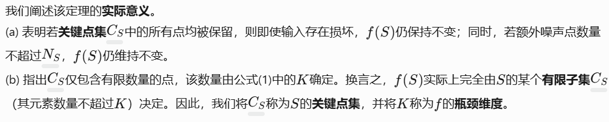

​		结合函数*h*的连续性，这解释了我们的模型对**点扰动**、**数据损坏**和**额外噪声点**的**鲁棒性**。这种鲁棒性的获得与机器学习模型中的**稀疏性原则**相类似。直观上，我们的网络通过**稀疏的关键点集**来概括形状。在实验部分，我们可以看到这些关键点形成了物体的**骨架结构**。

### 5. Experiment

​		**实验部分分为四个组成部分**。首先，我们证明PointNet可应用于**多种3D识别任务**（第5.1节）。其次，我们通过详尽的实验验证**网络架构设计**（第5.2节）。最后，我们**可视化网络学习到的特征**（第5.3节）并分析其**时间与空间复杂度**（第5.4节）。

#### 5.1 Applications

​		在本节中，我们将展示如何训练我们的网络以执行**3D物体分类**、**物体部件分割**和**语义场景分割**任务。尽管我们采用了一种全新的数据表示形式（点集），但在多项任务的**基准测试**中，我们的方法仍能取得**可比甚至更优的性能**。

​		`3D物体分类：`我们的网络学习可用于物体分类的**全局点云特征**。我们在ModelNet40[25]形状分类基准上评估模型。该数据集包含**40个人工制造物体类别**的12,311个CAD模型，其中**9,843个用于训练**，**2,468个用于测试**。先前的方法主要关注**体素化表示**和**多视图图像表示**，而我们首次直接处理**原始点云**。

​		我们根据**面片面积**在网格面上均匀采样1024个点，并将这些点归一化到**单位球体**内。在训练过程中，我们通过沿**垂直轴**随机旋转物体，并对每个点的位置添加**零均值、标准差为0.02的高斯噪声**，实时增强点云数据。我们根据**面片面积**在网格面上均匀采样1024个点，并将这些点归一化到**单位球体**内。在训练过程中，我们通过沿**垂直轴**随机旋转物体，并对每个点的位置添加**零均值、标准差为0.02的高斯噪声**，实时增强点云数据。	

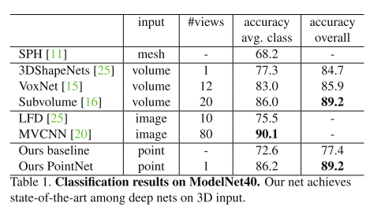

​			我们的模型在基于3D输入（体素与点云）的方法中实现了**最先进的性能**。仅通过全连接层和最大池化操作，我们的网络在**推理速度**上具有显著优势，且可在CPU上轻松实现并行化。我们的方法与**多视图方法**（MVCNN [20]）之间仍存在微小差距，我们认为这是由于**高精度几何细节的丢失**——这些细节可通过渲染图像捕捉。

​		`3D物体部件分割：` 部件分割是一项极具挑战性的**细粒度3D识别任务**。给定一个**3D扫描数据**或**网格模型**，该任务需要为每个点或面分配**部件类别标签**（例如椅子腿、杯柄）。

​		我们在来自[26]的**ShapeNet部件数据集**上进行评估。该数据集包含**16个类别**的16,881个形状，共计标注了**50个部件**。大多数物体类别被标记为**2到5个部件**。真实标注（Ground Truth）被标记在这些形状的**采样点**上。

​		我们将**部件分割**定义为**逐点分类问题**。评估指标为**点级别的平均交并比（mIoU）**。对于类别*C*中的每个形状*S*，计算其mIoU的步骤如下：对类别*C*中的每个部件类型，1. 计算**真实标注**与**预测结果**的**交并比（IoU）**2.若真实标注与预测结果的并集为空，则将该部件IoU计为1  3.对类别*C*中所有部件类型的IoU取平均，得到该形状的mIoU。类别的mIoU通过对该类别所有形状的mIoU再次取平均获得。

​		在本节中，我们将**分割版PointNet**（即图2分割网络的修改版本）与两种传统方法[24]和[26]进行对比。这两种传统方法均利用了**逐点几何特征**和**形状间对应关系**，同时我们还对比了自建的**3D CNN基线模型**。关于3D CNN的详细修改说明与网络架构请参阅补充材料。

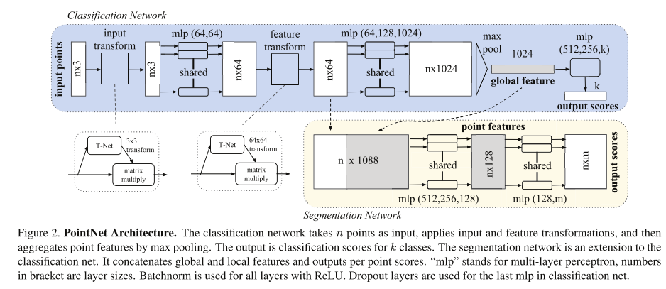

**图2. PointNet架构**
分类网络以n个点作为输入，应用**输入变换**和**特征变换**，然后通过**最大池化**聚合点特征。输出为k个类别的分类得分。分割网络是分类网络的扩展版本，通过**拼接全局与局部特征**并输出逐点得分。其中"mlp"表示**多层感知机**，括号内的数字代表各层维度大小。所有层均使用**批标准化（Batchnorm）**和**ReLU激活函数**。分类网络的最后一个mlp层使用了**Dropout**。

​		在表2中，我们报告了**逐类别交并比（IoU）**和**平均IoU（%）得分**。我们观察到平均IoU提升了2.3%，并且我们的网络在**大多数类别**中超越了基线方法。

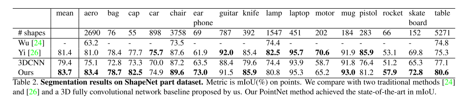

​		我们还在**模拟Kinect扫描数据**上进行实验，以测试这些方法的**鲁棒性**。对于ShapeNet部件数据集中的每个CAD模型，我们使用**Blensor Kinect模拟器**[7]从六个随机视角生成**不完整点云**。我们在完整形状和部分扫描数据上使用相同的网络架构与训练设置来训练PointNet。实验结果表明，我们仅损失了**5.3%的平均IoU**。在图3中，我们展示了完整数据与部分数据的**定性结果**。可以看出，尽管部分扫描数据极具挑战性，我们的预测结果仍然合理。

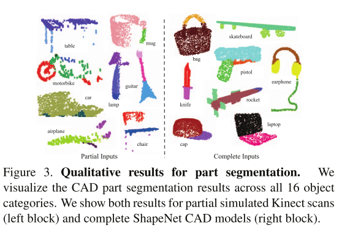

​		`语义场景分割：`我们用于部件分割的网络可轻松扩展至**语义场景分割**任务，此时点标签将变为**语义对象类别**而非物体部件标签。

​		我们在**斯坦福3D语义解析数据集**[1]上进行实验。该数据集包含来自**Matterport扫描仪**的3D扫描数据，覆盖6个区域共计271个房间。扫描中的每个点均被标注为13个语义类别之一（椅子、桌子、地板、墙面等，以及**杂物**）。

​		为准备训练数据，我们首先**按房间划分点云**，然后将房间采样为**1米×1米的区块**。我们训练分割版PointNet以预测每个区块内的**逐点类别**。每个点由**9维向量**表示，包括XYZ坐标、RGB颜色以及相对于房间的归一化位置（范围0到1）。训练时，我们实时在每个区块中随机采样4,096个点。测试时，我们对所有点进行测试。我们采用与文献[1]相同的协议，使用**k折策略**进行训练与测试。

​		我们将本方法与使用**手工设计的点特征**的基线方法进行对比。该基线方法提取相同的9维局部特征，并额外增加三个特征：**局部点密度**、**局部曲率**和**法向量**。我们使用**标准多层感知机（MLP）**作为分类器。结果如表3所示，我们的PointNet方法显著优于基线方法。在图4中，我们展示了**定性分割结果**。我们的网络能够输出平滑的预测结果，并对**缺失点**和**遮挡**具有鲁棒性。

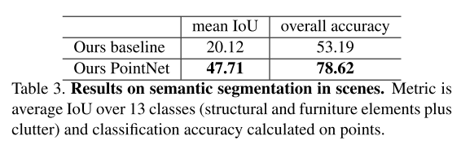

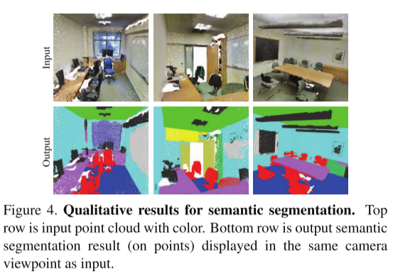

​		基于我们网络输出的**语义分割结果**，我们进一步构建了一个**3D物体检测系统**——通过**连通分量分析**生成物体候选区域（详见补充材料）。我们在表4中与**先前的最先进方法**进行对比。该方法基于**滑动形状法**（结合CRF后处理），使用在体素网格中提取的**局部几何特征**与**全局场景上下文特征**训练SVM分类器。在报告的**家具类别**上，我们的方法以显著优势超越该方法。

#### 5.2. Architecture Design Analysis

在本节中，我们通过**对照实验**验证我们的设计选择。同时，我们也展示了网络**超参数**的影响。

​		**与替代性置换不变方法的对比：** 如第4.2节所述，处理无序集合输入至少存在三种可选方案。我们使用**ModelNet40形状分类问题**作为对比这些方案的测试基准，接下来的两个对照实验也将使用该任务。

​		我们对比的基线方法（如图5所示）包括：处理未排序点云（作为n×3数组）的多层感知机（MLP）、处理排序点云（作为n×3数组）的MLP、将输入点视为序列的RNN模型，以及基于对称函数的模型。我们实验的对称操作包括最大池化、平均池化和基于注意力的加权求和。注意力方法与文献[22]类似——从每个点特征预测一个标量分数，通过Softmax跨点归一化分数，最后基于归一化分数与点特征计算加权和。如图5所示，最大池化操作以显著优势取得最佳性能，这验证了我们的选择。

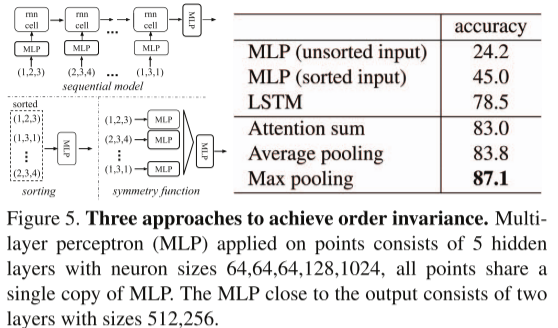

​		**输入与特征变换的有效性：** 在表5中，我们展示了输入变换与特征变换（用于对齐）的积极效果。有趣的是，最基础的架构已经取得了相当合理的结果。使用输入变换带来了0.8%的性能提升。正则化损失是保证高维变换有效的必要条件。通过结合两种变换与正则化项，我们实现了最佳性能。

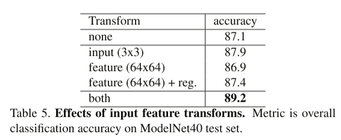

​		**鲁棒性测试：** 我们证明了PointNet虽然结构简单且高效，但对各类输入损坏具有鲁棒性。我们采用与图5中最大池化网络相同的架构。输入点云被归一化到单位球体内。实验结果如图6所示。

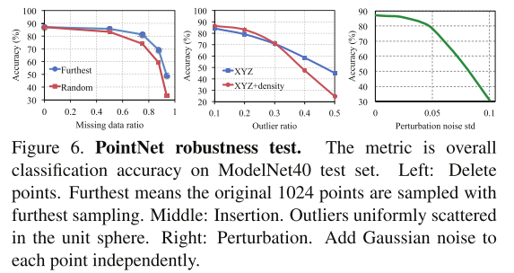

​		关于**点缺失**，当50%的点缺失时，相对于**最远点输入采样**与**随机输入采样**，准确率仅分别下降2.4%与3.8%。如果网络在训练过程中接触过**异常点**，其对异常点也表现出鲁棒性。我们评估了两种模型：一种仅使用(x, y, z)坐标训练；另一种使用(x, y, z)坐标加**点密度**训练。即使当20%的点为异常点时，网络的准确率仍超过80%。图6右侧表明，网络对**点扰动**具有鲁棒性。

#### 5.3. Visualizing PointNet

​		在图7中，我们对一些样本形状S的**关键点集CS**和**上界形状NS**（如定理2所述）的可视化结果进行了展示。位于这两个形状之间的点集将生成完全相同的**全局形状特征f(S)**。

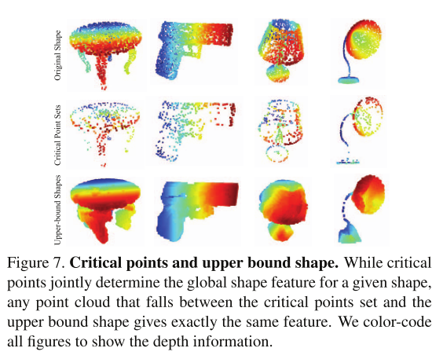

​		从图7中可以清晰地看到，**关键点集CS**（即对最大池化特征有贡献的点）概括了形状的**骨架结构**。**上界形状NS**展示了能够产生与输入点云S相同的全局形状特征f(S)的最大可能点云范围。CS与NS反映了PointNet的鲁棒性——丢失某些非关键点完全不会改变全局形状特征f(S)。

​		**上界形状NS**的构建方法是将边长为2的立方体（edge-length-2 cube）内的所有点输入网络前向传播，并筛选出各点函数值(*h*1(*p*),*h*2(*p*),⋯,*hk(*p*))均不大于**全局形状描述符**的点*p。

#### 5.4. Time and Space Complexity Analysis

​		表6总结了我们的分类版PointNet的**空间复杂度**（网络参数数量）和**时间复杂度**（每个样本的浮点运算次数）。我们还将PointNet与先前工作中具有**代表性的体素架构**和**多视图架构**进行了对比。

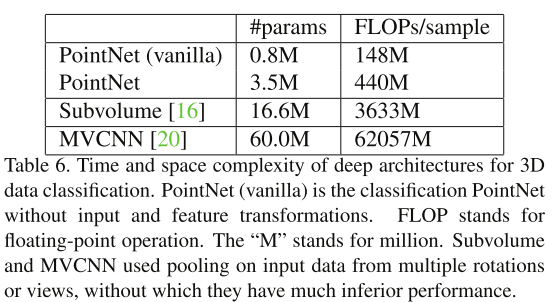

​		尽管MVCNN [20]和Subvolume（3D CNN）[16]实现了高性能，但PointNet在计算成本上高效数个数量级（以FLOPs/样本衡量：分别是141倍和8倍效率更高）。此外，就网络参数数量而言，PointNet的空间效率远高于MVCNN（参数数量减少17倍）。此外，PointNet的扩展性更强——其空间与时间复杂度为O(N)，即与输入点数呈线性关系。然而，由于卷积操作主导计算时间，多视图方法的时间复杂度随图像分辨率平方增长，基于体素卷积的方法则随体积尺寸立方增长。

​		实验证明，在TensorFlow框架下使用1080X GPU时，PointNet能够以每秒超过一百万个点的速度处理**点云分类**任务（约每秒1,000个物体）或**语义分割**任务（约每秒2个房间），展现出**实时应用**的巨大潜力。

### 6. Conclusion

​		在本研究中，我们提出了一种新型深度神经网络**PointNet**，它可直接处理**点云**。我们的网络为包括**物体分类**、**部件分割**和**语义分割**在内的多种3D识别任务提供了统一解决方案，同时在标准基准测试中取得了与现有技术相当或更优的结果。我们还提供了**理论分析**与**可视化**以增进对网络工作原理的理解。

----

## 名词解释

`排列不变性`：无论你以什么顺序输入点云中的点，网络的输出结果都应该是一样的。因为点云的本质是**无序集合（unordered set）**，数学上表示为：

$$
Point Cloud={p_1,p_2,…,p_n}
$$
集合是无序的，`{a, b, c}` 和 `{c, a, b}` 是同一个集合。

所以，处理点云的神经网络必须模仿这种“集合”的性质 —— **对输入顺序完全不敏感**。

`对称函数：`无论你如何改变输入元素的顺序，输出结果都保持不变。最大池化是一个典型的对称函数。