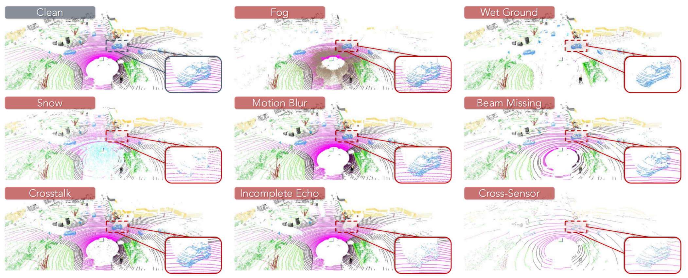
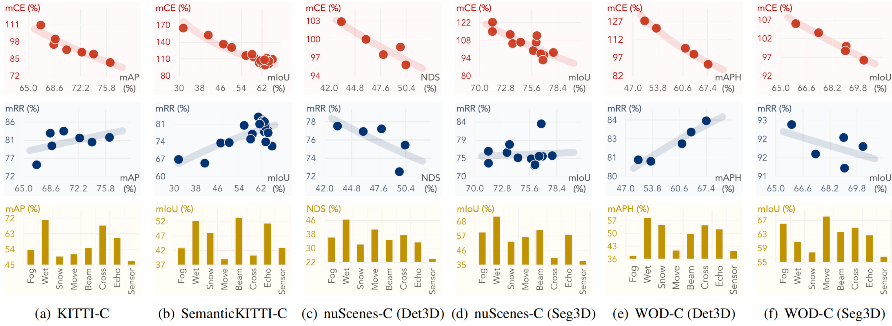
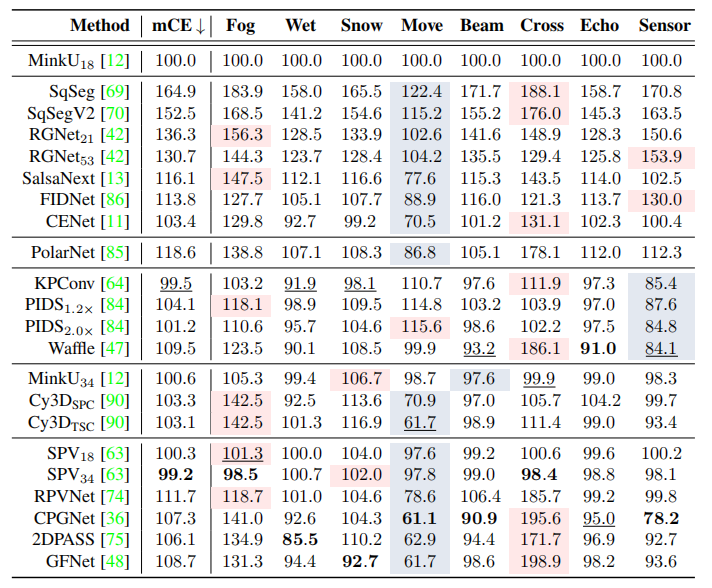
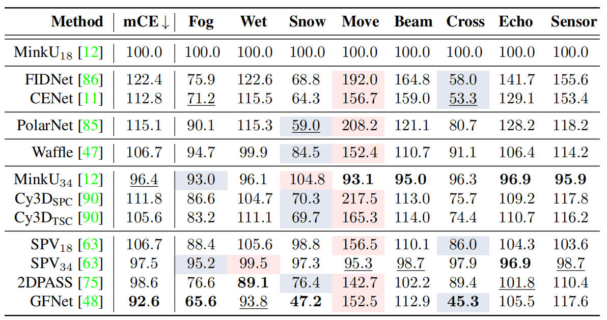
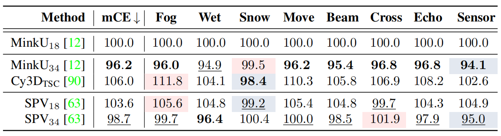
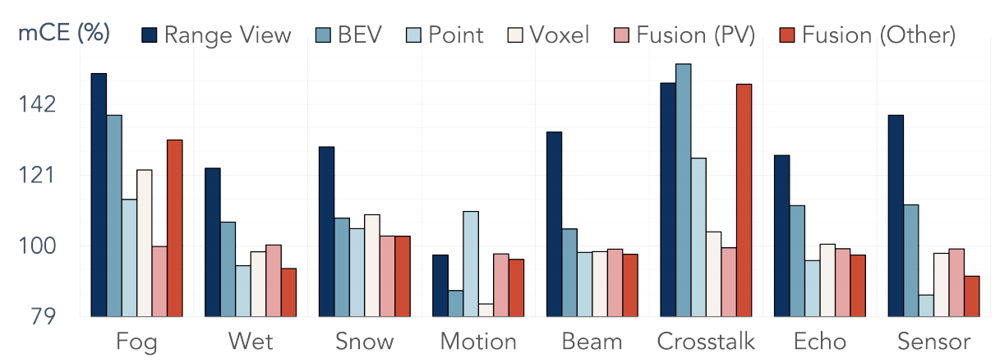
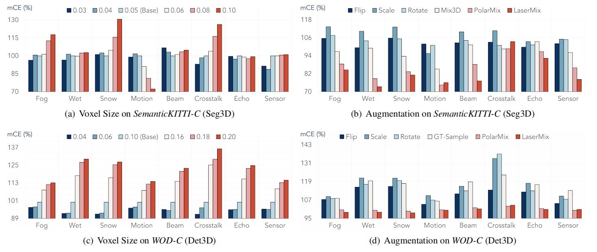
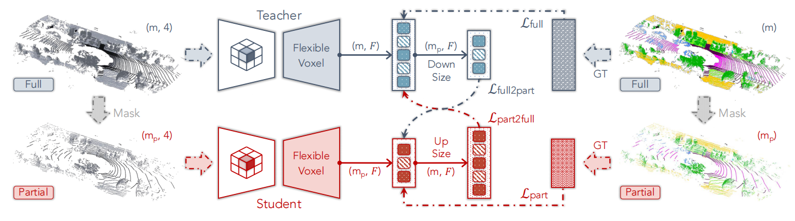
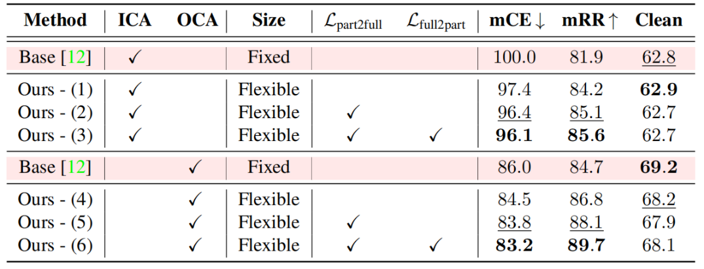
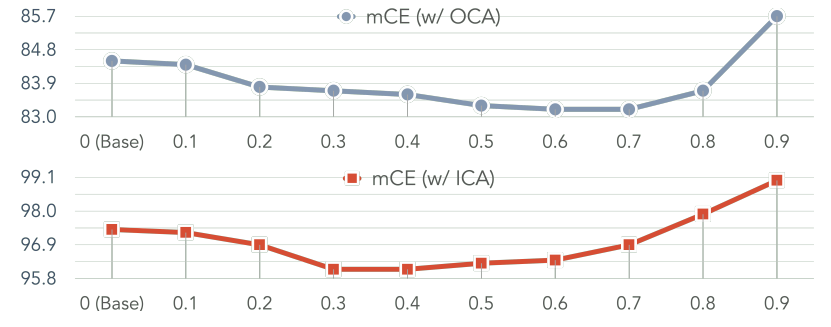

#  	 Robo3D: Towards Robust and Reliable 3D Perception against Corruptions

# 面向抗干扰的鲁棒可靠三维感知

### Abstract

​		3D 感知系统在环境及传感器自然干扰作用下的鲁棒性，对安全关键型应用而言尤为重要。现有的大规模 3D 感知数据集通常包含

被精心清洗过的数据，然而，这样的配置无法反映**感知模型**在**部署阶段**的**可靠性**。在这项工作中，我们提出了 Robo3D，这是首个致力于探究在真实世界环境中发生的自然干扰下**3D 检测器**和**分割器**在**分布外场景**中的**鲁棒性**的综合**基准**。具体而言，我们考虑了源自**恶劣天气条件**、**外部扰动**和**内部传感器故障**的八种**干扰**类型。我们发现，尽管在标准基准上已逐步取得了令人满意的结果，但**最先进的**（**SOTA**）**3D 感知模型**仍面临着对**干扰**脆弱的风险。我们针对**数据表征**、**增强方案**和**训练策略**的使用得出了关键观察结果，这些因素可能会严重影响模型的性能。为了追求更好的**鲁棒性**，我们提出了一个**密度不敏感训练**框架，以及一种简单的**灵活体素化**策略，以增强模型的**韧性**。我们希望我们的基准和方法能够启发未来的研究，设计出更加**鲁棒**且**可靠**的 **3D 感知模型**。我们的鲁棒性基准套件已公开发布 。

### 1 Introduction

​		**3D 感知**旨在检测和分割三维世界中**自车**周围物体和背景的精确**位置**、**朝向**、**语义**以及**时序关系** 。随着大规模**自动驾驶感知数据集**的出现，**激光雷达语义分割**和 **3D 目标检测**领域的各种方法每年都在涌现，并在主流**基准**上取得了破纪录的性能 。

​		尽管在“干净”的评估集上取得了巨大的成功，但模型在**分布外**（out-of-distribution，OoD）场景下的**鲁棒性**仍然不明确 。最近的尝试主要集中在从两个方面探究 **OoD 鲁棒性** 。第一类专注于将 **3D 感知模型**迁移到未见过的**域**，例如 **sim2real**（仿真到真实）、**day2night**（白天到夜晚）以及 **city2city**（城市到城市）的**自适应**，以探究模型的**泛化能力** 。第二类旨在设计**对抗样本**，这些样本可以在保持受到攻击的输入与其原始格式接近的同时，导致模型做出错误的预测，即测试模型的最坏情况场景.

​		在这项工作中，与上述两个方向不同，我们旨在理解在现实世界**干扰**和**传感器故障**下**性能衰退**的原因 。目前的 **3D 感知模型**从 **LiDAR** 传感器或 **RGB-D 相机**学习**点特征**，其中由于数据采集、处理、**天气条件**和**场景复杂性**等问题，**数据干扰**是不可避免的 。尽管最近的工作致力于从室内场景或**以物体为中心的 CAD 模型**创建受**干扰**的**点云**，但我们是在来自复杂**室外驾驶场景**的大规模 **LiDAR 点云**上模拟**干扰**。

​		如图 1 所示，我们考虑了三种在真实世界部署中发生概率极高的不同**干扰**源：1）**恶劣天气条件**（雾、雨和雪），这会导致激光脉冲的**后向散射**、**衰减**和**反射**；2）**外部扰动**，例如颠簸的路面、灰尘、昆虫，这些往往会导致不可忽略的**运动模糊**和**激光雷达光束丢失**问题；以及 3）**内部传感器故障**，例如**回波不完整**、对深色物体（如黑色汽车）的**漏检**，以及多传感器间的**串扰**，这些都很可能会降低 **3D 感知**的准确性 。除了环境因素外，理解**跨传感器差异**对于避免由传感器配置变更引起的突发性故障也至关重要 。

`图 1：Robo3D 基准的分类体系。我们模拟了来自三个类别的八种干扰类型：1）恶劣天气条件，例如雾、雨和雪；2）外部扰动，由运动模糊引起或导致激光雷达光束丢失；以及 3）内部传感器故障，包括激光雷达串扰、可能的回波不完整以及跨传感器场景。每种干扰根据其严重程度进一步划分为三个等级（轻度、中度和重度）。`

​		为了恰当地实现这些目标，我们在 **KITTI** [18]、**SemanticKITTI** [4]、**nuScenes** [8] 和 **Waymo Open** [61] 的**验证集**上模拟了符合物理原理的**干扰**，构成了我们被称为 **Robo3D** 的**干扰套件** 。类似于流行的 **2D 干扰基准** [23, 81, 41]，我们为每种**干扰**创建了**三个**严重程度等级，并设计了合适的指标作为**鲁棒性**比较的主要指示符 。最后，我们进行了详尽的实验，以理解现有模型中不同设计的优缺点 。我们观察到，尽管现代 **3D 感知模型**在**标准基准**上的性能正在提升，但它们仍面临着脆弱的风险 。通过在广泛的 **3D 感知数据集**上进行**细粒度分析**，我们诊断出：

- **传感器设置**对**特征学习**有直接影响。在不同**传感器配置**和协议下收集的数据上训练的 **3D 感知模型**通常会产生不一致的**韧性** 。
- **3D 数据表征**通常与模型的**鲁棒性**耦合。**体素**和**点-体素融合**方法表现出明显优于**基于投影**的方法（例如**距离图像**）的优势 。
- **3D 检测器**和**分割器**对不同的**干扰**类型表现出截然不同的敏感性。这两个任务的**精密结合**是实现**鲁棒**且**可靠**的 **3D 感知**的可行途径 。
- **脱离上下文的增强**（**OCA**）和**灵活光栅化**策略可以提高模型的**鲁棒性** 。

因此，我们提出了一种解决方案来增强现有 **3D 感知模型**的**鲁棒性**，该方案包含一个**密度不敏感训练**框架和一个简单的**灵活体素化**策略 。本文的关键贡献总结如下 ：

- 我们推出了 Robo3D，这是首个系统设计的鲁棒性评估套件，用于评估针对干扰和传感器故障下的基于 LiDAR 的 3D 感知 。
- 我们对 34 个用于基于 LiDAR 的语义分割和 3D 目标检测任务的感知模型进行了基准测试，评估它们对抗干扰的鲁棒性 。
- 基于我们的观察，我们就设计配方进行了深入讨论，并提出了用于构建更鲁棒的 3D 感知模型的新颖技术 。

### 2 Related work

​		`基于LiDAR的语义分割。` **3D 分割器**的设计选择通常与 **LiDAR 表征**相关，这些表征可归类为**原始点** [64]、**距离图像** [69, 42, 29]、**鸟瞰图** [85]、**体素** [12] 以及**多视图融合** [38, 74] 方法 。**基于投影**的方法将**不规则点云光栅化**为 **2D 网格**，这避免了对 **3D 算子**的需求，因此在**部署**时更加**硬件友好** 。保留了 **3D 结构**的**基于体素**的方法，正取得比其他**单模态**更好的性能 。像**稀疏卷积**这样的**高效算子**被广泛采用，以减轻**内存占用** 。最近，一些工作开始探索两个**视图** [38, 75, 48] 甚至更多**视图** [74] 之间可能的**互补性** 。尽管已经取得了有希望的结果，但 **3D 分割器**对抗**干扰**的**鲁棒性**仍然不明确 。正如我们将在下一节中讨论的那样，这些方法往往**鲁棒性**较差，主要是由于缺乏一个综合的**鲁棒性评估基准** 。

​		`基于LiDAR的3D目标检测。`与 LiDAR 分割共享相似的基础，现代 3D 目标检测器也采用各种数据表征。**基于点的方法** [56, 58, 79, 78] 在没有任何量化的情况下，隐式地捕捉局部结构和细粒度模式，以保留原始的点云几何结构。**基于体素的方法** [77, 87, 82, 57, 35, 37, 34, 39] 将不规则点云转换为紧凑的网格，同时只有那些非空体素被存储并通过稀疏卷积 [77] 用于特征提取。最近，一些工作 [40, 88] 开始**利用自注意力** [66] 探索体素间的长程上下文依赖。**基于柱的方法** [32, 52] 通过控制垂直轴上的分辨率，更好地平衡了准确率和速度。**点-体素融合方法** [54, 53] 可以整合两种表征的优点，以学习更具判别性的特征。然而，上述方法主要侧重于在干净点云上获得更好的性能，而对模型的鲁棒性关注较少。正如我们在接下来的章节中将展示的那样，这些模型在数据干扰和传感器故障下容易发生退化 。

​		`常见干扰。`**干扰鲁棒性**通常指的是经过常规训练的模型在**自然分布偏移**下维持令人满意的性能的能力。ImageNet-C [23] 是这一研究方向的开创性工作，它针对**常见干扰**和**扰动**对**图像分类模型**进行了**基准测试**。后续研究将类似的方面扩展到了其他**感知任务**，例如**目标检测** [41]、**图像分割** [27]、**导航** [10]、**视频分类** [81] 和**姿态估计** [67]。评估模型对抗**干扰**的**鲁棒性**的重要性已被不断证明。由于我们针对的是不同的传感器，即 **LiDAR**，大多数经过充分研究的**干扰**类型（如那些专为**相机故障**设计的类型）对于这种数据格式变得不切实际或不适用。这促使我们探索新的**分类体系**，以便为**自动驾驶场景**中的 **3D 感知任务**定义更恰当的**干扰**类型 。

​		`3D感知鲁棒性。` 最近有几项尝试提出研究**点云分类器**和**检测器**在**室内场景**中的**脆弱性** [28, 49, 60, 89, 2]。最近，有一些工作开始探索 **3D 目标检测器**在**对抗攻击**下的**鲁棒性** [45, 65, 73]。在**干扰鲁棒性**的背景下，我们注意到了几项**同期工作** [83, 33, 1, 15, 76]。然而，这些工作都仅考虑单一**任务**，并且可能受到有限数量的**干扰**类型或候选**数据集**的限制。我们的**基准**为通用的 **3D 感知任务**恰当地定义了更多样化的**干扰**类型，并包含了显著更多的来自**基于 LiDAR 的语义分割**和 **3D 目标检测任务**的模型。

### 3 The Robo3D Benchmark

​		针对基于 LiDAR 的 3D 感知任务，我们在基准中总结了八种在真实世界部署中常见的**干扰**类型，如**图 1** 所示。本节详细阐述了每种**干扰**类型的具体定义（第 3.1 节）、不同**鲁棒性模拟集**的配置（第 3.2 节），以及用于**鲁棒性**测量的**评估指标**（第 3.3 节）。

#### 3.1 Corruption Types

​		给定 **LiDAR 点云**中的一个点 $p \in \mathbb{R}^4$，其具有**坐标** $(p^x, p^y, p^z)$ 和**强度** $p^i$，我们的目标是通过一个受**物理原理**或**工程经验**约束的**映射** $\hat{p} = \mathcal{C}(p)$ 来模拟一个受**干扰**的点 $\hat{p}$。由于篇幅限制，我们在**附录**中展示了我们的**干扰模拟算法**的更详细**定义**和实现步骤。

​		1) `雾 (Fog)`。LiDAR 传感器发射激光脉冲以进行精确的距离测量。在雾天，由于空气中的水粒子会导致不可避免的脉冲反射，LiDAR 点往往会发生**后向散射**和衰减 [5, 6]。在我们的基准中，我们采用符合物理原理的雾模拟方法 [21] 来创建受雾干扰的数据。对于每一个点 $p$，我们计算其衰减响应 $p^{i_{hard}}$ 和最大雾响应 $p^{i_{soft}}$，公式如下：
$$
p^{i_{\text {hard}}} = p^i e^{-2\alpha \sqrt {(p^x)^2 +(p^y)^2 + (p^z)^2}}\tag1
$$

$$
p^{i_{\text {soft}}} = p^i \frac {(p^x)^2 +(p^y)^2 + (p^z)^2}{\beta _0}\beta _{\text {bs}}\times {p}^i_{\text {tmp}}\tag2
$$

$$
\mathbf {\hat {p}} = \mathcal {C}_{\text {fog}}(\mathbf {p}) = \begin {cases} (\hat {p}^x, \hat {p}^y, \hat {p}^z, p^{i_{\text {soft}}}), & \text {if  $p^{i_{\text {soft}}} > p^{i_{\text {hard}}}$} \\ (p^x, p^y, p^z, p^{i_{\text {hard}}}), & \text {else} \end {cases}\tag3
$$

其中 $\alpha$ 是**衰减系数**，$\beta_{bs}$ 表示**后向散射系数**，$\beta_0$ 描述目标物体的**微分反射率**，符号 $p_{tmp}^i$ 是**软目标项**（即雾）的接收响应。

​		2）`湿滑地面 (Wet Ground)`。发射的激光脉冲在撞击湿润表面时很可能会损失一定量的能量，这会导致显著衰减的激光回波，具体取决于水膜高度 $d_w$ 和**镜面折射率** [59]。我们遵循 [20] 来对由地面湿润引起的衰减进行建模。首先，我们采取一个预处理步骤，利用现有的语义标签或 **RANSAC** [16] 来估计地面平面。接下来，基于修改后的反射率获得地面平面点及其测量的强度 $\hat{p}^i$，并且仅当其强度大于**噪声基底** $i_n$ 时，通过以下映射保留该点：
$$
\mathcal{C}_{\text{wet}}(\mathbf{p}) = 
\begin{cases}
    (p^x, p^y, p^z, \hat{p}^i), & \text{if } \hat{p}^i > i_n \text{ & } \mathbf{p} \in \text{ground} \\
    \text{None}, & \text{elif } \hat{p}^i < i_n \text{ & } \mathbf{p} \in \text{ground} \\
    (p^x, p^y, p^z, p^i), & \text{elif } \mathbf{p} \notin \text{ground}
\end{cases} \tag{4}
$$
​		3）`雪 (Snow)`。在雪天情况下，对于每一束激光，空气中的粒子集合将会与其相交，并推导出被每个粒子反射的**光束横截面**的角度，同时将潜在的**遮挡**考虑在内 [51]。我们遵循 [20] 来模拟受**雪干扰**的数据 $\mathcal{C}_{\text{snow}}(\mathbf{p})$，这与**雾**的模拟类似。这种**基于物理**的方法在 **2D 空间**中对**雪粒子**进行采样，并根据由此产生的**几何关系**修改每个 **LiDAR 光束**的测量值，其中采样雪粒子的数量是根据给定的**降雪率** $r_s$ 设定的。

​		4) `运动模糊 (Motion Blur)`。鉴于 LiDAR 传感器通常安装在车辆顶部或侧面，它不可避免地会受到由车辆运动引起的模糊影响，特别是在颠簸路面行驶或掉头期间。为了模拟受模糊干扰的数据 $\mathcal{C}_{\text{motion}}(\mathbf{p})$，我们要向每个坐标 $(p^x, p^y, p^z)$ 添加抖动噪声，其平移值采样自具有标准差 $\sigma_t$ 的高斯分布。该模拟过程如下所示：
$$
\mathcal {C}_{\text {motion}} (\mathbf {p}) = (p^x+o_1, p^y+o_2, p^z+o_3, p^i)\tag5
$$
其中 $o_1, o_2, o_3$ 是从高斯分布 $\mathcal{N}(0, \sigma_t^2)$ 中采样的随机偏移量，且 $\{o_1, o_2, o_3\} \in \mathbb{R}^{1\times1}$。

​		5）`光束丢失 (Beam Missing)`。灰尘和昆虫倾向于在 LiDAR 表面形成聚积物，且如果没有人工干预（如干燥和清洁），它们通常不会消失 [46]。这种遮挡会导致被遮蔽区域出现**零读数**，并导致特定光脉冲的丢失。为了模拟这种行为，我们随机采样总共 $m$ 个光束，并从原始点云中丢弃这些光束上的点，以生成 $\mathcal{C}_{\text {beam}}(\mathbf {p})$：
$$
\mathcal {C}_{\text {beam}}(\mathbf {p}) = \begin {cases} (p^x, p^y, p^z, p^i), & \text {if $\mathbf {p} \notin m $ } \\ \text {None}, & \text {else} \end {cases}\tag6
$$
​		6) `串扰 (Crosstalk)`。考虑到道路通常由多辆车共用，来自一个传感器的光脉冲的飞行时间可能会干扰相近频率范围内的其他传感器的脉冲 [7]。这种串扰现象通常会在两个（或多个）传感器之间的中距离区域产生**噪点**。为了模拟这种干扰 $\mathcal{C}_{\text{cross}}(\mathbf{p})$，我们从原始点云中随机采样 $k_t$ 百分比的点子集，并添加较大的**抖动噪声**，其平移值采样自具有标准差 $\sigma_c$ 的高斯分布。该模拟过程如下所示：
$$
\mathcal{C}_{\text{cross}}(\mathbf{p}) = 
\begin{cases} 
(p^x, p^y, p^z, p^i), & \text{if } \mathbf{p} \notin \text{set of } \{k_t\} \\
(p^x, p^y, p^z, p^i) + \xi_c, & \text{else} 
\end{cases}\tag7
$$
其中 $\xi_c$ 是从高斯分布 $\mathcal{N}(0, \sigma_c^2)$ 中采样的随机偏移量，且 $\xi_c \in \mathbb{R}^{1\times4}$。

​		7) `回波不完整 (Incomplete Echo)`。LiDAR 传感器发射的激光脉冲的`近红外光谱`容易受车辆或其他深色实例的影响 [83]。因此，在这些扫描回波中 LiDAR 读数是不完整的，从而导致显著的**点漏检**。 我们通过利用语义掩码或 3D 边界框，针对车辆、自行车和摩托车类别**随机查询** $k_e$ 百分比的点，来模拟这种表示为 $\mathcal{C}_{\text{echo}}(\mathbf{p})$ 的干扰。接下来，我们从原始点云中丢弃这些查询到的点及其对应的**点级语义标签**。值得注意的是，我们不会更改真值边界框，因为在现实世界中它们应保持在其原始位置。整个操作过程可总结如下：
$$
\mathcal{C}_{\text{echo}}(\mathbf{p}) = 
\begin{cases} 
(p^x, p^y, p^z, p^i), & \text{if } \mathbf{p} \notin \text{set of } \{k_e\} \\
\text{None}, & \text{else}
\end{cases}\tag8
$$
​		8) `跨传感器 (Cross-Sensor)`。由于 LiDAR 传感器配置（例如线束数量、视场角和采样频率）种类繁多，设计能够在跨设备情况下维持令人满意的性能的鲁棒 3D 感知模型至关重要 [79]。虽然以前的工作通过使用两个不同的数据集直接构建此类设置，但两者之间存在的**域特异性（**例如不同的标签映射和数据采集协议）进一步阻碍了直接的鲁棒性比较。在我们的基准中，我们遵循 [68] 的方法，通过首先从点云中丢弃特定线束的点，然后从每个线束中**下采样** $k_c$ 百分比的点，来生成跨传感器数据 $\mathcal{C}_{\text{sensor}}(\mathbf{p})$。该模拟过程如下所示：
$$
\mathcal{C}_{\text{sensor}}(\mathbf{p}) =  \begin{cases}  \text{None}, & \text{if } \mathbf{p} \in \text{set of } \{k_c\} \\  (p^x, p^y, p^z, p^i), & \text{else}  \end{cases}
$$

#### 3.2 Corruption Sets（干扰数据集）

​		遵循上述**分类体系**，我们在现有的大规模 **3D 感知数据集** [18, 4, 8, 17, 61] 的**验证集**基础上创建了新的**鲁棒性评估集**，以构建 **SemanticKITTI-C**、**KITTI-C**、**nuScenes-C** 和 **WOD-C**。这些数据集由三个**严重程度等级**下的八种**干扰**类型构成，分别包含总计 97704、90456、144456 和 143424 个带有**标注**的 **LiDAR 点云**。关于这些**鲁棒性评估集合**的更多详细信息，请参阅**附录**。

#### 3.3 Evaluation Metric

​		`干扰误差` (Corruption Error, CE)。我们遵循 [23] 并使用**平均 CE (mCE)** 作为比较模型**鲁棒性**的主要指标。为了**归一化严重程度**的影响，我们分别选择 CenterPoint [82] 和 MinkUNet [63] 作为 **3D 检测器**和**分割器**的**基线模型**。CE 和 mCE 分数的计算如下：
$$
\text{CE}_i=\frac{\sum^{3}_{l=1}(1 - \text{Acc}_{i,l})}{\sum^{3}_{l=1}(1 - \text{Acc}_{i,l}^{\text{baseline}})}~,~~~ \text{mCE}=\frac{1}{N}\sum^N_{i=1}\text{CE}_i\tag{10}
$$
其中 $\text{Acc}_{i,l}$ 表示**特定任务的准确率分数**，即用于 **LiDAR 语义分割**的 **mIoU**，以及用于 **3D 目标检测**的 **AP**、**NDS** 或 **APH(L2)**，对应于**严重等级** $l$ 下的**干扰类型** $i$。$N = 8$ 是**干扰类型**的总数。

​		`韧性率` (Resilience Rate, RR)。我们将**平均 RR (mRR)** 定义为**相对鲁棒性指标**，用于衡量模型在**干扰数据集**上进行评估时能够保留多少**准确率**。RR 和 mRR 分数的计算如下：
$$
\text{RR}_i=\frac{\sum^{3}_{l=1}\text{Acc}_{i,l}}{3\times \text{Acc}_{\text{clean}}}~,~~~~~ \text{mRR}=\frac{1}{N}\sum^N_{i=1}\text{RR}_i\tag{11}
$$
其中 $\text{Acc}_{\text{clean}}$ 表示在“干净”**评估集**上的**特定任务准确率分数**。

### 4 Experimental Analysis

#### 4.1 Benchmark Configuration

​		`3D 感知模型。`我们对 34 种**基于 LiDAR 的检测和分割模型**及其**变体**进行了**基准测试**。**检测器**包括：SECOND [77]、PointPillars [32]、PointRCNN [56]、Part-A2 [57]、PV-RCNN [53]、CenterPoint [82] 和 PV-RCNN++ [55]。**分割器**包括：SqueezeSeg [69]、SqueezeSegV2 [70]、RangeNet++ [42]、SalsaNext [13]、FIDNet [86]、CENet [11]、PolarNet [85]、KPConv [64]、PIDS [84]、WaffleIron [47]、MinkUNet [12]、Cylinder3D [90]、SPVCNN [63]、RPVNet [74]、CPGNet [36]、2DPASS [75] 和 GFNet [48]。我们还囊括了三种最新的 **3D 数据增强方法**，即 Mix3D [44]、LaserMix [31] 和 PolarMix [71]。

​		`评估协议。`大多数参与基准测试的模型都遵循相似的**数据增强**、**预训练**和**验证配置**。因此，我们在适用情况下直接使用**公开的检查点**进行评估，或者按照默认设置**重新训练**模型。我们注意到，一些模型在原始验证集上使用了**额外技巧**，例如**测试时增强**、**模型集成**等。针对这些情况，我们使用**常规设置**重新训练其模型，并报告**复现的结果**。这样做是为了确保不同模型在我们的**干扰数据集**上的**鲁棒性比较**是**公平**且**令人信服**的。请参阅**附录**以获取有关训练和评估协议的更多详细信息，并获取用于**复现**目的的**预训练模型权重**。

#### 4.2 Benchmark Analysis

​		在本节中，我们基于**基准测试结果**得出以下关键观察，并分析其背后的潜在原因。

​		`O-1：3D 感知鲁棒性`——现有的 3D 检测器和分割器在面对现实世界的干扰时表现脆弱。如图 2 所示，尽管模型的**干扰误差**通常与特定任务准确率相关（第一行），但它们的**韧性得分**却相当平坦，甚至呈现出趋向**脆弱**的下降趋势（第二行）。表 1 至表 6 中展示的各项**干扰误差**进一步证实了这一**症结**。以 **3D 分割器**为例：尽管最近的**最先进方法** [75, 48, 47] 在标准基准测试中取得了令人满意的结果，但它们实际上不如**基线**模型鲁棒，即它们的 mCE 得分高于 MinkUNet [12]。类似的趋势也出现在 **3D 检测器**中，例如图 2(c)，其中具有更高 **NDS** 的模型正变得韧性较差。由于缺乏合适的**鲁棒性评估基准**，现有的 **3D 感知模型**倾向于**过拟合**“干净”的数据分布，而不是适应**现实场景**。

`图 2：Robo3D 中 34 个基于 LiDAR 的检测和分割模型在六个鲁棒性数据集上的基准测试结果。图片从上到下依次展示了：特定任务准确率（mAP, mIoU, NDS, mAPH）与 [第一行] 平均干扰误差（mCE）的对比，与 [第二行] 平均韧性率（mRR）的对比，以及 [第三行] 不同干扰类型间的敏感性分析。`

​		`O-2：传感器配置`——使用来自不同来源的 LiDAR 数据训练的模型对每种干扰类型表现出不一致的敏感性。如图 2 第三行所示，应用在不同数据集上的相同干扰在模型鲁棒性方面表现出差异化的行为。不同的**数据采集协议**和**传感器设置**对模型**表征学习**产生直接影响。例如，与在**更稀疏的数据集**（nuScenes）上训练的对应模型相比，在 **64 线数据集**（KITTI, WOD）上训练的 **3D 检测器**对**运动模糊**和**雪**的鲁棒性较差。我们推测，**低密度输入**使模型具备了一定的对抗**局部发生噪声**的**韧性**，但在以**全局方式**丢失点的场景（即**跨传感器干扰**）中可能会变得**脆弱**。

​		`O-3：数据表征`——将 LiDAR 数据表征为原始点、稀疏体素或它们的融合往往能产生更好的鲁棒性。从图 3 可以轻易看出，在基准测试中的几乎每种**干扰**类型下，**基于投影**的方法（即距离图像和鸟瞰图）的干扰误差都远高于其他**模态**。这种劣势也存在于使用 **2D 分支**的**基于融合**的模型中，例如 RPVNet [74] 和 GFNet [48]。总的来说，**基于点**的方法 [64, 47, 84] 对大量**点丢失**的情况更具鲁棒性，但在遭遇**平移**、**抖动**和**离群点**时表现较差。我们推测，现有**基于点**架构中广泛使用的**下采样**和**局部聚合**是应对**点丢失**和**遮挡**的天然补救措施。在所有**表征**中，**体素/柱**和**点-体素融合**在各种**干扰**类型下表现出明显的优越性，这分别在表 1、表 2 和表 3 中得到了验证。将**不规则点**进行**量化**的**体素化**过程有利于减轻**局部变化**，并且通常能为**特征学习**产生更稳定的**表征**。

<strong>表 1：SemanticKITTI-C 上 22 个分割器的干扰误差 (CE)。</strong>

<strong>表 2：nuScenes-C (Seg3D) 上 12 个分割器的干扰误差 (CE)。</strong>

<strong>表 3：WOD-C (Seg3D) 上 5 个分割器的干扰误差 (CE)。</strong>

粗体：该列中最好（误差最小）。下划线：该列中第二好。深色背景：该行中最好（该模型最擅长的抗干扰类型）。红色：该行中最差（该模型最不擅长的抗干扰类型）。

`图 3：SemanticKITTI-C 上不同 LiDAR 表征（模态）之间的鲁棒性比较。`

​		`O-4：任务特殊性` (Task Particularity) —— 3D 检测器和分割器对干扰场景表现出不同的敏感性。**检测任务**仅针对**物体级别**的分类和定位；发生在**实例**范围内部的点上的干扰对检测该物体的影响较小。然而，**分割任务**旨在识别点云中每一个点的**语义含义**。 这种**任务差异**影响了模型在不同干扰下的**鲁棒性**。从图 2 中我们发现，**3D 检测器**倾向于对**点级变化**（如**运动模糊**和**串扰**）更具鲁棒性。这两种干扰可能会产生超出**网格尺寸**的**噪声偏移**；而这些**点平移**很容易被 **3D 分割模型**误分类。相反，**3D 分割器**对雾、湿滑地面和雪等**环境变化**表现得更为稳健。回顾来看，我们认为**检测**和**分割**任务的巧妙结合，将是构建对抗不同干扰的更鲁棒、更可靠的 **3D 感知系统**的可行解决方案。

​		`O-5：增强与正则化效应` (Augmentation & Regularization Effects) —— 近期的“脱离上下文增强”(OCA) 技术大幅提高了 3D 鲁棒性；灵活的“光栅化”策略有助于学习更鲁棒的特征。通常用于 3D 检测器和分割器的主要是**上下文内增强 (ICAs)**，即翻转、缩放和旋转。尽管这些技术有助于提升感知准确率，但在改善鲁棒性方面效果较差。最近的研究 [44, 31, 71] 提出了 **OCA**，旨在进一步增强模型在“干净”数据集上的性能。我们在基线模型上实现了这些增强，并在我们的鲁棒性评估集上测试了它们的有效性，如图 4 (b) & (d) 所示。由于受干扰数据通常偏离训练分布，模型在**分布外 (OoD)** 场景下不可避免地会退化。那些在不保持**场景布局**一致性的情况下混合和交换区域的 OCA，在除**湿滑地面**（地面点的丢失限制了场景混合的有效性）以外的所有干扰类型中，都产生了低得多的 **CE 分数**（即鲁棒性更好）。影响鲁棒性的另一个关键因素（特别是对于基于体素和点-体素融合的方法）是**表征容量**，即**体素大小**。如图 4 (a) & (c) 所示，在小区域平移（**运动模糊**）下的 **3D 分割器**倾向于使用**更大**的体素尺寸以抑制全局平移；相反，如果给定更**细粒度**的体素化以消除**局部变化**，它们对**离群点**（**雾**、**雪**和**串扰**）更具鲁棒性。对于 **3D 检测器**，倾向于使用**更高**的体素化**分辨率**已形成共识，并且在基准测试的所有干扰类型中不断取得改进。

`图 4：针对基线 LiDAR 语义分割和 3D 目标检测模型 [12, 82]，关于体素大小 (a & c) 和数据增强 (b & d) 的干扰敏感性分析。不同的干扰在特定配置下表现出差异。`

### 5 Boosting Corruption Robustness（提升干扰鲁棒性）

​		受上述观察启发，我们提出了两种新颖的技术来增强抗干扰鲁棒性。我们不失一般性地在 **SemanticKITTI-C** 数据集上进行了实验，并在附录中包含了其他数据集上的更多结果。

​		`灵活体素化 (Flexible Voxelization)`。广泛使用的**稀疏卷积** [62] 需要将点坐标 $p_k = (p^x_k, p^y_k, p^z_k)$ 形式转换为**稀疏体素**。该过程通常表述如下：
$$
\mathbf {v}_k = (v^x_k, v^y_k, v^z_k) = \texttt {floor}((\frac {p^x_k}{l^x}), (\frac {p^y_k}{l^y}), (\frac {p^z_k}{l^z}))\tag{12}
$$
其中 $l^x, l^y$ 和 $l^z$ 表示沿各轴的**体素大小**，通常被设定为固定值。正如图 4 (a) & (c) 所讨论的那样，模型在不同的干扰下往往表现出**不稳定的韧性**，例如，对于**运动模糊**，它倾向于较大的体素尺寸，而对于雾、雪和串扰，**较小**的体素尺寸则使其更具**鲁棒性**。为了在所有干扰中追求更好的**泛化能力**，我们将朴素的常数替换为动态变量 $l_{dv} = (l^x \pm dv^x, l^y \pm dv^y, l^z \pm dv^z)$，其中 $dv^x, dv^y, dv^z$ 是从区间为 $\gamma$ 的连续均匀分布中采样的**偏移量**。

​		`密度不敏感训练 (Density-Insensitive Training)`。自然**干扰**通常会导致光脉冲发生严重的**遮挡**、**衰减**和**反射**，导致**自车**周围特定区域不可避免地丢失 LiDAR点 [59]。例如，**湿滑地面**会吸收能量并导致表面点丢失 [20]；由反射或灰尘及昆虫遮挡引起的潜在**回波不完整**和**光束丢失**可能导致严重的**物体检测失效** [83]。遭受此类 **OoD (分布外)** 场景影响的 **3D 感知模型**面临卷入安全关键问题的风险。值得注意的是，这种退化无法通过调整**体素大小**或应用 **OCA** 来补偿（见图 4）。受最近**基于掩码**的表征方法 [22, 14, 43, 24] 的启发，我们提出了一个鲁棒的**微调框架**（见图 5），该框架往往对**密度变化**不太敏感。具体来说，我们设计了一个**双分支结构**——一个**教师网络** $\mathcal{G}_{\theta}^{\text{tea}}$ 和一个**学生网络** $\mathcal{G}_{\theta}^{\text{stu}}$——它以一对**高密度**和**低密度点云**（$x$ 和 $\tilde{x}$）作为输入，其中较稀疏的点云是通过以比例 $\beta$ **随机掩盖**原始点云中的点生成的。请注意，这里我们使用随机掩码对给定的点云进行**下采样**，而不是模拟我们在基准中定义的特定干扰类型，因为实际场景中的干扰“模式”往往难以预测。来自“全”视图和“部分”视图的第 $k$ 个样本的**损失函数**计算如下：
$$
\mathcal{L}_{\text{full}} = \mathcal{L}_{\text{task}}(y_k, \mathcal{G}_{\theta}^{\text{tea}}(x_k))~,~~ \mathcal{L}_{\text{part}} = \mathcal{L}_{\text{task}}(\tilde{y}_k, \mathcal{G}_{\theta}^{\text{stu}}(\tilde{x}_k))\tag{13}
$$
其中 $y_k$ 和 $\tilde{y}_k$ 分别是原始真值和掩码后的真值。$\mathcal{L}_{\text{task}}$ 表示**特定任务损失**，例如用于检测的 **RPN 损失**和用于分割的**交叉熵损失**。

`图 5：提出的密度不敏感训练框架。“全”点云和“部分”点云被分别输入到教师分支和学生分支以进行特征学习，其中后者是通过对原始点云进行随机掩码生成的。为了促进跨密度一致性，我们计算了补全损失和确认损失，这两种损失分别衡量了下采样的教师预测和插值的学生预测与另一个分支输出之间的距离。`

​		为了促进高密度和低密度分支之间的**交叉一致性 (Cross-consistency)**，我们计算 $\mathcal{L}_{\text{part2full}}$ 和 $\mathcal{L}_{\text{full2part}}$，其中前者旨在从稀疏输入中**模拟**密集表征（**补全**），而后者旨在追求**局部一致性**（**确认**）。**补全损失**计算为教师网络对“全”输入的预测与经**插值**处理的学生网络对“部分”输入的预测之间的**距离**，其计算公式如下：
$$
\mathcal{L}_{\text{part2full}} = ||~ \mathcal{G}_{\theta}^{\text{tea}}(x), ~\texttt{interp}(\mathcal{G}_{\theta}^{\text{stu}}(\tilde{x})) ~||^2_2\tag{14}
$$
同样地，用于追求局部一致性的**确认损失**计算如下：
$$
\mathcal{L}_{\text{full2part}} = ||~ \texttt{subsample}(\mathcal{G}_{\theta}^{\text{tea}}(x)), ~\mathcal{G}_{\theta}^{\text{stu}}(\tilde{x}) ~||^2_2\tag{15}
$$
**最终目标**是优化上述损失函数的**总和**，即 $\mathcal{L} = \mathcal{L}_{\text{full}} + \mathcal{L}_{\text{part}} + \alpha_1\mathcal{L}_{\text{part2full}} + \alpha_2\mathcal{L}_{\text{full2part}}$，其中 $\alpha_1$ 和 $\alpha_2$ 是**权重系数**。

**公式 13**：让学生学会做题（Label Supervision）。

**公式 14 (Part2Full)**：让学生学会**猜**它没看见的部分（脑补能力）。

**公式 15 (Full2Part)**：让学生学会**稳**它看见的部分（基础能力）。

​		`实施细节 (Implementation Details)。`我们对每个组件进行了**消融实验 (ablate)** 并在表 7 中展示了结果。具体来说，在我们的实验中 $\gamma$ 被设定为 0.02，同时对于使用 **ICA** 的模型，**掩码比例** $\beta = 0.4$，对于使用 **OCA** 的模型，$\beta = 0.6$。我们使用相同的**基线模型**初始化**教师**和**学生网络**，并将我们的框架总共**微调 (finetune)** 6 个**轮次 (epochs)**。**权重系数**分别被设定为 50 和 100。

​		`实验分析 (Experimental Analysis)。`尽管该框架很简单，但我们发现它有助于**缓解**由干扰引起的**鲁棒性退化**。对体素划分 (voxel partition) 的简单修改就能大幅**提升**抗干扰鲁棒性；它在两个基线上分别降低了 2.6% 和 1.5% 的 **mCE**。然后，我们引入了“全”视图和“部分”视图之间的**交叉一致性学习**。在所有**变体**中，同时包含**补全** ($\mathcal{L}_{\text{part2full}}$) 和**确认** ($\mathcal{L}_{\text{full2part}}$) 目标的变体在 **mCE** 和 **mRR** 方面取得了最好的结果。

<strong> 表 7：关于以下内容的消融实验：[左] 上下文内 (ICA) 和脱离上下文 (OCA) 增强；[中] 体素化策略；以及 [右] 密度不敏感训练损失。</strong>

​		我们还在图 6 中展示了关于**掩码比例** $\beta$ 的**消融实验**。我们观察到，在模型的**鲁棒性**与**信息遮挡比例**之间通常存在一种**权衡 (trade-off)**；0.3 到 0.6 之间的比例倾向于产生更低的 **mCE**（即更好的鲁棒性）。值得注意的是，**灵活体素化**和**密度不敏感训练**都会轻微降低“干净”数据集上的**特定任务准确率**，如表 7 最后一列所示。我们推测，这种**脱离上下文的一致性正则化**可能会缓解 **3D 感知模型**对**训练分布**的**过拟合**，作为回报，使其对来自 **OoD (分布外)** 分布的**未见场景**变得更加鲁棒。

`图 6：针对掩码比例` $\beta$ `的消融实验：[上] 使用 OCA（脱离上下文增强）训练的模型；[下] 使用 ICA（上下文内增强）训练的模型。`

### 6 Discussion and Conclusion

​		在这项工作中，我们建立了一个名为 **Robo3D** 的综合评估基准，用于探测和分析基于 LiDAR 的 3D 感知模型的鲁棒性。我们在四个大规模自动驾驶数据集上定义了**八种**具有**三个严重等级**的独特干扰类型。我们系统地对具有代表性的 **3D 检测器**和**分割器**进行了基准测试和分析，以了解它们在现实世界干扰和传感器故障下的**弹性 (resilience)**。我们从传感器设置、数据表征、任务特殊性和增强效应等方面得出了一些关键见解。为了追求更好的鲁棒性，我们提出了一个**跨密度一致性训练框架**和一个简单但有效的**灵活体素化策略**。我们希望这项工作能为未来构建更鲁棒、更可靠的 3D 感知模型的研究奠定坚实的基础。

​		**潜在局限性 (Potential Limitation)**。尽管我们对现实世界中发生的广泛干扰进行了基准测试，但我们没有考虑**同时发生多种干扰耦合**的情况。此外，我们不包括接受**多模态输入**的模型，这可能构成未来的研究方向。

----

# 术语

`ego-vehicle:` 自车，指搭载了传感器（LiDAR、相机等）及自动驾驶算法系统，并正在被该系统控制的那辆车本身。它是整个感知系统的**原点**和**参考系**。在本文中，提到“自车周围的物体” ，就是指以这辆安装了 Robo3D 评估系统的车为中心，去探测它周边的环境。

`运动解耦：`文献中提到的**运动模糊 (Motion Blur)** ，通常是因为**自车**在高速运动或颠簸，导致安装在**自车**上的传感器拍出来的画面或点云糊了

`Out-of-Distribution, OoD`  分布外场景，指测试数据与模型训练数据在统计特征上存在显著差异的情况

​	*通俗理解*：平时练车都在晴天（分布内），考试突然下暴雪（分布外），模型因为没见过这种“题型”而容易出错。OoD 场景 = 被恶劣天气或传感器故障“败坏”了的数据场景

`semantics` 语义，在计算机视觉中，指数据的“含义”或“类别”。例如，把一个点标记为“路面”还是“行人”，就是在赋予它语义。

​	*通俗理解*：给物体贴标签。机器原本只看到一堆点，赋予语义后，它就知道这堆点是“树”，那堆点是“车”。

`temporary relation`  时序关系，即物体随时间推移的运动状态、速度或轨迹关系。

​	*通俗理解*：不仅知道车在哪里，还知道它上一秒在哪里，下一秒要去哪里，是不是在动。

`Back-scattering` 后向散射，指激光束在传播过程中遇到介质（如雾滴、雪花）时，部分能量被反射回光源方向的现象。这会产生虚假的信号（噪点）。

`attenuation`  衰减， 激光脉冲在穿过介质（如雨水）时能量逐渐减弱的现象，导致探测距离变短或回波强度过低。

`Crosstalk` 串扰，当多个激光雷达传感器同时工作时，一个传感器接收到了来自另一个传感器发射的激光脉冲，导致产生错误的点云数据。

`Out-of-context augmentation (OCA)`  脱离上下文的增强， 一种数据增强技术（如 Mix3D），通过将一个场景中的物体剪切并粘贴到另一个完全不相关的场景中（例如把一辆车放到房子顶上，或者把树种在马路中间），打破原本的上下文依赖。

​		*通俗理解*：故意“乱点鸳鸯谱”。通过制造这种不合逻辑的场景，强迫模型只关注物体本身的形状，而不是依赖背景（比如“车一定在路上”）来猜答案，从而防止模型“死记硬背”。

`Rasterization`  光栅化，在计算机图形学和 3D 处理中，指将矢量图形或离散的点数据转换为格栅化（Grid）数据（如像素或体素）的过程。在本文中，体素化（Voxelization）就是一种 3D 光栅化。

`LiDAR Representations` LiDAR表征，指将激光雷达原始采集的杂乱数据（点云）转换成适合神经网络处理的数据格式。

`Natural Distribution Shifts` 自然分布偏移，指测试数据与训练数据在统计特征上发生的非人为、非对抗性的差异。这种差异通常由环境变化（如天气、光照、季节）或传感器特性的改变引起。

​		*通俗理解*：不是有人故意捣乱（那是攻击），而是大自然变脸了。比如模型是夏天训练的，现在是冬天，树叶都掉了，这种数据的“模样”变化就是自然分布偏移。

`Pose Estimation`  姿态估计，算机视觉任务之一，旨在估计物体（如车辆、行人）在三维空间中的位置（x, y, z）和朝向（如偏航角 Yaw、俯仰角 Pitch、滚转角 Roll）。

​		*通俗理解*：不仅要算出东西在哪儿，还要算出它是正对着你、侧对着你还是背对着你。

`Perturbations`  扰动，通常指对输入数据施加的微小噪声或变化。在鲁棒性研究中，它有时与“干扰”（Corruptions）互换使用，但“扰动”更常用于描述幅度较小、肉眼难以察觉的噪声（如对抗性扰动），而“干扰”通常指更显著的退化（如模糊、噪声点）。

​		*通俗理解*：轻微的抖动或噪点

`Adversarial Attacks` 对抗攻击，：恶意设计的输入扰动，旨在欺骗模型使其出错。这与本文研究的自然干扰（Natural Corruptions）不同，前者是“人祸”，后者是“天灾”。

`Point Cloud Classifiers` 点云分类器，一种深度学习模型，其任务是对输入的整个点云数据进行分类（例如，判断这一团点云是“椅子”、“桌子”还是“飞机”）。

`Robustness Simulation Sets` 鲁棒性模拟集，指通过人为算法模拟生成的、包含各种干扰（如雾、雨、噪声）的测试数据集，专门用于评估模型在非理想条件下的表现。

`RANSAC(Random Sample Consensus)`  随机采样一致性算法。一种迭代算法，用于从包含大量离群点（Outliers）的数据中估计数学模型参数。在此处用于从杂乱的点云中“抠”出平整的地面。

​		*通俗理解*：在一堆乱点中找规律。比如随机抓几个点连成面，看谁能包住最多的点，谁就是真正的“地面”。

`Noise Floor` 噪声基地，系统固有的背景噪声水平。低于这个强度的信号会被视为杂讯而过滤掉。

​		*通俗理解*：传感器的“听力门槛”。声音太小（信号太弱）就听不见了。

`Beam Cross-section` 光束横截面，激光束并非一条无限细的线，而是具有一定发散角（Divergence）的锥体。在传播一定距离后，其横截面具有一定的面积。

​		*通俗理解*：激光像手电筒的光一样，照得越远光斑越大。雪花可能只挡住了这个光斑的一小部分，也可能完全挡住。

`Occlusions` 遮挡，在三维感知中，指前景物体（如雪花）阻挡了传感器对背景物体（如车辆）的视线。

`Motion Blur` 运动模糊， 在 LiDAR 扫描一帧数据的过程中（通常需要 100ms），由于车辆自身的高速移动或震动，导致扫描起点和终点时刻的坐标系不一致，从而使生成的点云产生扭曲、重影或“拖尾”现象。

`Gaussian Distribution` 高斯分布，也可以理解为是正态分布，在模拟噪声时，大多数自然界的随机误差都服从这种中间高、两边低的钟形分布。

`Zero Readings` 零读数，传感器发出的激光被表面的污垢阻挡或吸收，无法照射到环境物体并返回，导致接收端没有检测到任何回波信号。

`Noisy Points` 噪点，由于干扰产生的、并不对应真实物体空间位置的随机点。在串扰中，这些点往往表现为空间中漂浮的“鬼影”点。

​		*通俗理解*：画面上的雪花点，或者是明明前面没有车，雷达却显示有一团东西。

`Ground-truth Bounding Boxes` 真值边界框，人工标注的、代表物体真实位置和大小的 3D 框。在模拟中保留框但不保留点，是为了测试模型：当物体的一大部分都“隐身”了，你还能不能猜出它在哪？

`Domain Idiosyncrasy` 域特异性，指不同数据集之间独有的、难以兼容的特性。例如，Waymo 数据集在美国采集，KITTI 在德国采集；或者一个数据集把“卡车”和“皮卡”分开标，另一个把它们合在一起标。这些差异使得直接跨数据集对比模型性能变得不公平。

`Sub-sample` 下采样，减少数据点数量的过程。在这里指为了模拟低配置雷达（如从 64 线降级到 16 线），人为地丢弃一部分点，使点云变得稀疏。

​		*通俗理解*：抽帧或降低分辨率。把高清图片变成马赛克，看看模型还能不能认出来。

`Robustness Evaluation Sets`  指在原始干净的验证集基础上，经过算法处理人为添加了各种干扰（如雾、雪、噪声）后的新数据集。后缀 "-C" 通常代表 "Corruption"（干扰）。

`Corruption Error, CE` 干扰误差，一种衡量模型性能下降程度的指标。它通过与一个基线模型（Baseline）在相同干扰下的表现进行对比（归一化），来消除不同干扰难度不一的影响。

​		*通俗理解*：**分数越低越好**。类似于“错误率”。如果你的错误率比基准模型低，说明你抗干扰能力强。

`Resilience Rate, RR` 韧性率，衡量模型在受干扰情况下，相对于其在干净数据上性能的保持程度。

​		*通俗理解*：**分数越高越好**。类似于“折扣率”。如果原本能考 100 分，干扰后考了 80 分，韧性率就是 80%。它反映了模型“抗揍”的能力，即不管环境多恶劣，性能都不怎么掉。

 `Mean Intersection over Union，mIoU` 交并比，

​	想象你在玩一个“涂色游戏”（语义分割）：

- 标准答案（Ground Truth）：有一张图，规定了哪里是“车”，哪里是“路”。
- 你的答案（Prediction）：模型试图把图中的“车”涂红，“路”涂灰。

怎么判断你涂得好不好？

- Intersection（交集）：你涂对的地方（你涂了红色，且那里确实是车）。
- Union（并集）：标准答案里的车 加上 你乱涂出去的部分（所有涉及“车”的区域总和）。

IoU（交并比） 就是用 “交集”除以“并集”。

- 如果你涂得完美（严丝合缝），交集 = 并集，IoU = **1**（满分）。
- 如果你完全没涂或者全涂错了，交集 = 0，IoU = **0**。
- 如果你涂对了一半，或者涂出去太多，IoU 就会在 0 到 1 之间。

mIoU（平均交并比）： 因为图里不只有“车”，还有“人”、“树”、“路”。我们需要分别算出“车”的 IoU、“人”的 IoU、“树”的 IoU……然后把它们加起来取平均值，这就是 mIoU。

在数学上，IoU 是基于集合论的。假设对于某个类别（比如“汽车”）：

- $A$ = 模型预测的区域（Prediction）
- $B$ = 真实的区域（Ground Truth）

**单个类别的 IoU 计算公式：**

$$\text{IoU} = \frac{\text{Intersection}}{\text{Union}} = \frac{A \cap B}{A \cup B}$$

`Augmentation Methods` 数据增强方法，一类通过对训练数据进行变换（如旋转、剪切、混合）来增加数据多样性、防止模型过拟合的技术。文中提到的 Mix3D、LaserMix 等是专门针对点云数据的增强算法，通过混合不同场景的点云来“制造”新的训练样本。

​		*通俗理解*：给模型“加餐”。原本只有 100 道题，通过把题目倒过来、拼起来，变出了 1000 道题，让模型见多识广，考试（测试）时遇到没见过的题也不慌。

`Checkpoints`  指在训练过程中保存的模型参数（权重）文件。使用公开的检查点意味着直接拿作者已经训练好的模型来跑测试，而不需要从头开始训练。

`Test-time Augmentation, TTA`  测试时增强，一种在推理/测试阶段使用的技巧。它不对测试样本直接进行一次预测，而是对同一个测试样本进行多次微小的变换（如翻转、旋转），然后对这几次预测的结果取平均值。这通常能提高分数，但会显著增加推理时间，且掩盖了模型本身的真实抗干扰能力。

​		*通俗理解*：类似于考试时做完题，把卷子倒过来看一遍、侧过来看一遍，确认好几遍再写答案。虽然分高了，但在比拼“反应速度”和“直觉”的鲁棒性测试里，这算是作弊（或不公平竞争）。

`Descending Resilience Scores` 韧性得分下降，随着模型在干净数据上的准确率（NDS/mIoU）越来越高，其韧性（抗干扰能力的相对值）反而变低了。

​		*通俗理解*：能力越强，脾气越怪。原本考 60 分的学生，干扰一下还能考 50 分；现在考 95 分的学生，干扰一下直接掉到 40 分。这种“高分低能”的现象就是韧性下降。

`Representation Learning`  表征学习，机器学习的核心任务之一，指模型自动从原始数据（如 LiDAR 点云坐标）中提取出能够有效描述物体特征（如形状、纹理、结构）的数据表示形式。

​		*通俗理解*：模型“总结规律”的能力。比如模型看多了稀疏的点云，就学会了“脑补”那些没扫到的空缺；看多了密集的点云，可能就变得依赖细节，一旦细节没了（干扰）就傻眼了。

`Lose points in a global manner` 全局方式丢失，指按照某种系统性的规律大规模丢失数据。例如 跨传感器干扰（Cross-Sensor）或 光束丢失（Beam Missing），这通常意味着整圈的激光线束（Ring）都没有数据了。

`特定任务准确率`中的几个指标：

- map,平均精度均值，分数越高越好
- mIoU
- NDS，nuScenes检测得分，是 nuScenes 数据集独创的一个“超级综合指标”。包含map和TP误差，TP误差包含五个惩罚项，分别是位置误差，尺寸误差，方向误差，速度误差，属性误差
- mAPH(mean Average Precision weighted by Heading) 考虑朝向的平均精度,它在计算 AP 的时候，加了一个严苛的条件：如果你的预测框和真实框的重合度很高，但是车头方向预测错了（比如超过 180 度），那么这个预测就被算作“错误”（False Positive）。

| **指标** | **主要看什么？**           | **就像考试里的...**                                |
| -------- | -------------------------- | -------------------------------------------------- |
| **mAP**  | 框的位置准不准             | **选择题**（选对位置就给分）                       |
| **mIoU** | 像素/点涂得对不对          | **填空题/绘图题**（每一个细节都要对上）            |
| **NDS**  | 位置、速度、方向全方位综合 | **理综卷**（物理、化学、生物全都要好）             |
| **mAPH** | 位置准 + 方向必须对        | **定向越野**（不仅要跑到终点，指南针方向还不能错） |

`Out-of-Context Augmentation, OCA` 脱离上下文增强，一类激进的数据增强方法（如 Mix3D, LaserMix）。它打破了物理世界的真实规则，将不同场景的点云强制拼接在一起。例如，把场景 A 的车和场景 B 的墙剪切并混合到一个场景里，哪怕这在现实中是不合逻辑的。

​		*作用*：这种“乱点鸳鸯谱”的方法强迫模型不去依赖背景环境（Context）来猜物体，而是必须关注物体本身的特征。因此，当背景因为干扰（雾、雨）变烂时，模型依然能认出物体。

`In-Context Augmentation, ICA` 上下文内增强，传统的数据增强方法。它保持了场景的物理合理性。例如，把整辆车旋转一下，或者把整个场景放大缩小。

​		*局限*：虽然能提高干净数据的分数，但因为它还是保留了原来的场景结构，模型并没有学会“在混乱中找物体”的本事，所以抗干扰能力提升有限。

`Erratic Resilience` 不稳定的韧性，指的是模型在面对不同类型的干扰时，其抗干扰能力（韧性）表现出一种**“顾此失彼”**或**“难以兼顾”**的矛盾状态，这种状态极度依赖于**体素大小 (Voxel Size)** 这个参数的设定。文中提到的“不稳定”主要体现在图 4 (a) & (c) 中。作者发现，当我们调整**体素大小**（把点云切成多大的格子）时，模型对不同干扰的防御能力是截然相反的：

- **面对“运动模糊” (Motion Blur)**：
  - **喜好**：模型喜欢**大格子 (Large Voxel)**。
  - **表现**：格子越大，抗干扰越强；格子越小，反而越容易受影响。
- **面对“雾、雪、噪点” (Fog, Snow, Crosstalk)**：
  - **喜好**：模型喜欢**小格子 (Small Voxel)**。
  - **表现**：格子越小（分得越细），抗干扰越强；格子大了反而不行。

**结论**：如果你固定选一个“中庸”的体素大小（比如 0.1m），模型就会处于一种尴尬的境地——防得了雪就防不了抖动，防得了抖动就防不了雪。这种**无法用一套参数通吃所有干扰**的状态，就是“不稳定的韧性”。

`Teacher-Student Network` 教师学生网络，这是一个形象的比喻，学术上通常称为**知识蒸馏 (Knowledge Distillation)** 或**一致性学习**。可以通俗地理解为师傅带徒弟：

- **教师网络 (Teacher)**：这通常是一个“见多识广”的模型。在你的论文语境中，教师网络看到的是**完整的、高密度的点云**（比如晴天近距离的数据）。它因为掌握的信息多，所以能给出非常准确的标准答案。

- **学生网络 (Student)**：这是我们需要训练的“徒弟”。在训练中，我们故意给它看**残缺的、稀疏的点云**（模拟雨天、远距离的数据）。

- **训练目的**：我们要让学生看着“烂数据”，却能模仿出教师看着“好数据”得出的结论。

如果学生能做到这一点，说明它学会了“脑补”和“推理”，不再依赖完美的数据。等到实际应用中（真的下雨了，数据真的烂了），学生网络就能独当一面，依然表现出色。

论文利用这个架构来实现**密度不敏感训练**。

- **输入**：同一个场景，给 Teacher 看全图，给 Student 看挖掉一半点的图。
- **约束**：强迫 Student 的输出特征尽可能接近 Teacher 的输出特征。
- **结果**：Student 学会了在点云稀疏时提取鲁棒的特征。

`Region Proposal Network Loss`，RPN损失 常用于3D目标检测任务，**RPN 损失包含两部分**：

1. **物体性损失 (Objectness Loss)**：**“这块区域是有东西，还是背景？”**
   - 这是一个二分类问题（是/否）。如果不把背景剔除掉，后续计算量会爆炸。
2. **边界框回归损失 (Bounding Box Regression Loss)**：**“这个框大概在哪？有多大？”**
   - RPN 会给出一个粗略的框，损失函数会惩罚这个框和真实物体位置的偏差。

**通俗比喻**：就像侦察兵（RPN）先去探路。RPN 损失就是考核侦察兵的两个指标：1. 有没有漏报敌情？（物体性）；2. 报的坐标偏离了多少米？（回归）。

`Cross-Entropy Loss` 交叉熵损失，常用于3D语义分割或者分类任务，**原理**：它衡量的是**“预测概率分布”**与**“真实标签”**之间的距离。

- **例子**：
  - **真实情况**：这个点是“汽车”（概率 100%）。
  - **模型预测 A**：汽车 90%，路面 10%。（损失很小，表扬）
  - **模型预测 B**：汽车 30%，路面 70%。（损失巨大，严厉惩罚）

**核心特点**：交叉熵不仅要求模型选对，还要求模型**非常确信**自己是对的。如果模型猜对了但犹犹豫豫（概率低），损失函数依然会有数值，促使模型继续优化。

| **概念**       | **角色/功能**            | **就像...**              | **论文中的用途**           |
| -------------- | ------------------------ | ------------------------ | -------------------------- |
| **教师网络**   | 提供标准答案的指导者     | **看着原题**的老师       | 处理完整点云，指导学生     |
| **学生网络**   | 学习抗干扰能力的模型     | **看着残缺卷子**的学生   | 处理稀疏点云，学习鲁棒性   |
| **RPN 损失**   | 训练模型**找东西**的能力 | 考核**侦察兵**找得准不准 | 优化**检测器**的定位能力   |
| **交叉熵损失** | 训练模型**分类**的能力   | 考核**做选择题**对不对   | 优化**分割器**的分类准确度 |

`Cross-consistency` 交叉一致性，指两个不同分支（Teacher 和 Student）虽然看的东西不一样（一个密一个疏），但它们对同一个场景的理解应该是一致的，不能“各说各话”。通过两个方向的损失函数来强制对齐：**补全**（Part $\to$ Full）和**确认**（Full $\to$ Part）。

`Ablate / Ablation Study` 消融实验，这是一种控制变量的实验方法。就像拆积木一样，为了证明模型中每一个模块（比如“灵活体素化”或“补全损失”）都是有用的，研究人员会尝试把它们一个一个去掉 (ablate)，然后看模型性能会不会下降。

`Epochs`   轮次，在训练过程中，当完整的数据集通过神经网络一次（即所有样本都参与了一次训练），就称为一个 Epoch。

`Regularization`  脱离上下文的一致性正则化：通过强迫模型在数据残缺时也能工作，相当于给模型加了一个约束（正则化）。这阻止了模型去死记硬背那些完美的细节，强迫它去学习物体最本质的特征（比如车的形状结构，而不是车身上有多少个激光点）。

`Feature Learning/ Representation Learning` 特征学习/表征学习，是一个意思，让计算机自己从原始数据中总结出“什么是重要的”，而不是由人类告诉它。我们把一堆点云扔给神经网络。网络通过一层层的计算，自己慢慢领悟出：“哦，这种形状的点云组合通常代表车，那种形状代表树”。这个“领悟”的过程，就是特征学习。想象一个神经网络在处理你的 LiDAR 点云，**特征学习**是一个**层级化（Hierarchical）**的抽象过程：

1. **浅层特征 (Low-level Features)**：网络的头几层可能学会了识别**“边”、“角”、“平面”**。它发现点云局部有一些几何规律。
2. **中层特征 (Mid-level Features)**：网络的中间层把上面的边和角组合起来，学会了识别**“轮胎的形状”、“柱子的形状”**。
3. **深层特征 (High-level Features)**：网络的深层把部件组合起来，形成了**语义概念**。它学会了识别“这是一辆车”，即使这辆车被遮挡了一半。

**所谓的“特征”，在数学上就是一个高维向量（比如一个长度为 256 的数组）。** 这个向量浓缩了原始点云的精华信息。

# END