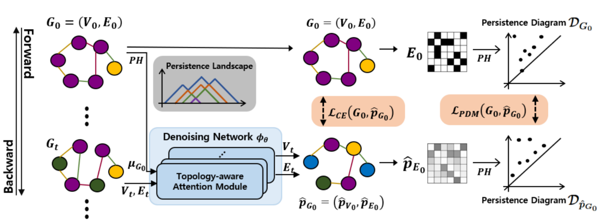
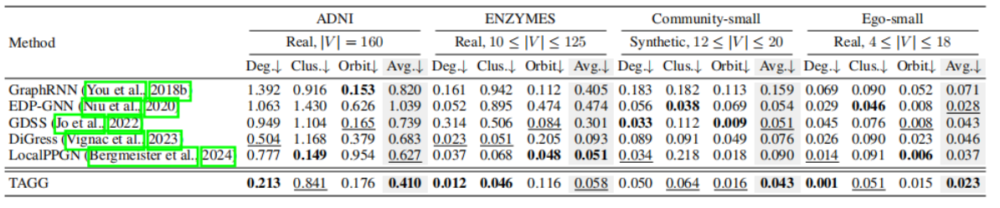
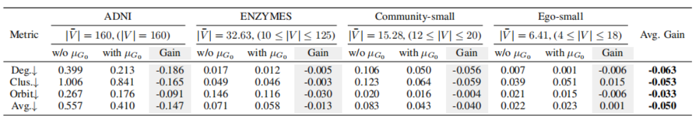
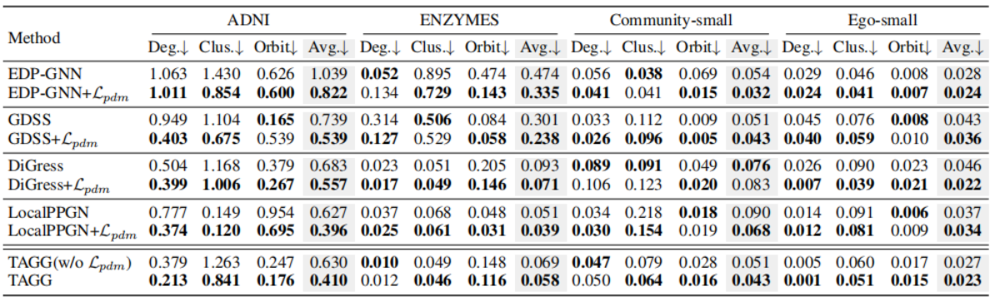
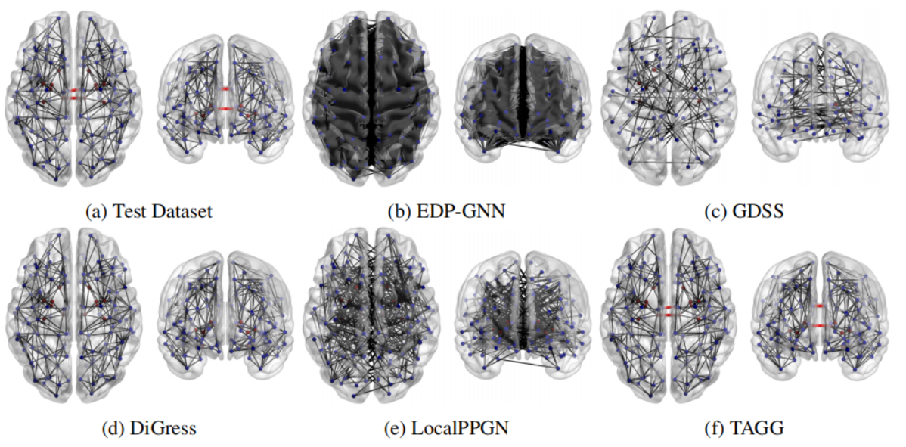
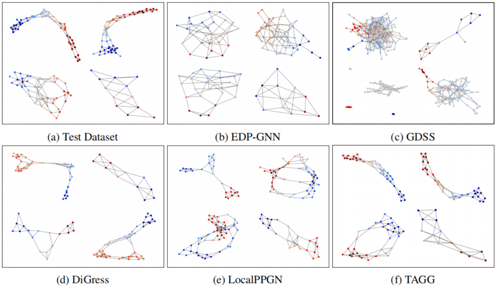
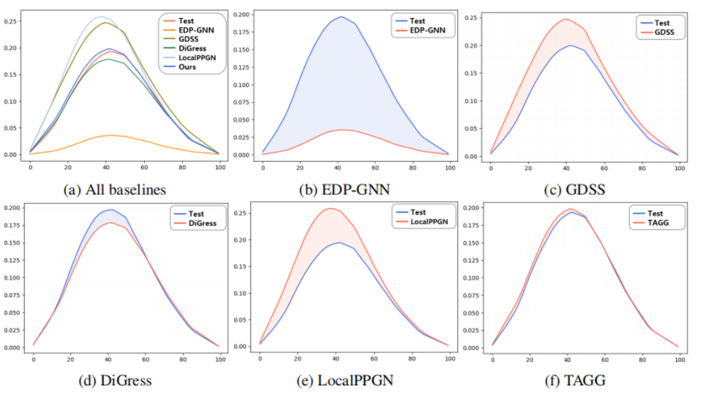

# Topology-aware graph diffusion model with persistent homology

# 基于持久同调的拓扑感知图扩散模型

## ABSTRACT

​		生成逼真的图在保留诸如**拓扑**等结构特征的同时，在**嵌入空间**中估算准确的图分布面临着挑战 。然而，现有的图生成方法主要侧重于近似图节点和边的**联合分布**，忽略了**拓扑相似性**，这阻碍了对诸如**连通分量**和**环**等全局图结构的准确表示 。为了解决这一问题，我们提出了一种**拓扑感知**的基于**扩散**的图生成方法，该方法旨在通过利用来自**拓扑数据分析**（**TDA**）的**持久同调**，使生成的图与原始图的结构特征高度相似 。具体而言，我们提出了一种新颖的**损失函数**，即**持久图匹配**（**PDM**）损失，它确保生成的图与原始图的**拓扑结构**紧密匹配，从而增强其**保真度**并保留基本的**同调属性** 。此外，我们引入了一种新颖的**拓扑感知注意力**机制，以增强**去噪网络**中的**自注意力模块** 。通过全面的实验，我们证明了该方法的有效性，不仅在各项指标上表现出极高的生成性能，而且证明了其与原始图中观察到的**拓扑特征**分布具有更好的一致性 。此外，在真实**大脑网络**数据上的应用展示了其通用性以及在复杂真实图应用中的潜力 。

## 1 Introduction

​		图生成的主要目标是使生成的图与其参考对应图之间达到高度相似 。为了实现这一目标，基于传统**生成模型**已经采取了各种图生成方法，例如循环神经网络、变分自编和扩散模型，且每种方法都展示了显著的研究成果 。尽管在定量衡量方面（例如**度**和**聚类系数**等图特征分布的相似性）取得了成就，但在通过**图拓扑**视角生成与图结构一致的图方面，仍然存在局限性 。

​		大脑网络或许是一个展示上述挑战的合适示例 。**大脑网络**通常被表示为一个描绘大脑复杂连接系统的图，该图由定义为其节点的解剖学**感兴趣区域**（**ROI**）以及作为边的不同 **ROI** 之间的连接组成 。它（大脑网络）通常规模庞大且连接稠密，但其**拓扑属性**被公认为关键的**生物标志物**（Sizemore et al., 2019; Saggar et al., 2018） 。此外，**大脑网络**数据获取昂贵；获取**扩散磁共振成像**（**dMRI**）并通**过纤维束示踪技术**（Sporns et al., 2005）进行处理以获得结构性大脑**连接组**数据，在成本和劳动力方面都非常高昂 。在这种情况下，生成既能保留其固有连接性又能保留全局结构的逼真图（如**大脑网络**）具有极高的需求；然而，现有的方法在捕捉对于高**保真度**建模相互连接的大脑区域至关重要的基本**拓扑特征**方面往往力有不逮 。

​		近年来，**扩散方法**在图生成领域得到了广泛研究（Liu et al., 2023） 。Niu et al. (2020) 和 Jo et al. (2022) 的方法提出了最初为图像定义的**连续时间域**内的**基于分数的扩散方法**（Song et al., 2020） 。然而，**连续扩散方法**面临计算成本高昂的问题，因为其**前向**和**反向扩散过程**是在无限小的**连续时间点**上执行的 。此外，均匀添加的**高斯噪声**会导致产生带噪声的**全连接图**，这会造成结构信息的丢失并破坏图的**稀疏性** 。随后，Vignac et al. (2023) 提出了一种**离散扩散方法**，并对图的每个节点和边独立应用加性噪声；尽管如此，现有方法忽略了**拓扑不变特征**（例如几何形状和连接性），限制了生成效果 。

​		为了克服这些问题，我们提出了一种新颖的**拓扑感知图生成**（**TAGG**）方法，由此采样的图不仅在**嵌入空间**中的分布上与原始图相似，而且在原始图的**同调特征**上也具有高度一致性。传统上，来自**代数拓扑学**的**拓扑数据分析**（**TDA**）已在各种图分析中得到研究（Carlsson, 2020; Bukkuri et al., 2021; Xu et al., 2021）以探究**拓扑特征**，而我们填补了 **TDA** 与**图扩散模型**之间的空白，以生成拓扑逼真的图 。我们利用**持久同调**定义了**持久图匹配**（**PDM**）损失，通过 `1​-Wasserstein` 距离对参考图的**同调特征**进行正则化，使其融入图生成过程。此外，我们引入了一个**拓扑感知注意力模块**，利用从给定图的**持久景观**（Bubenik, 2015）推导出的**同调特征**，为**去噪网络**提供全局结构信息 。

​		贡献。为此，我们的主要贡献如下：

- 1）我们提出了一种新颖的**拓扑感知图生成方法**，该方法能产生具有高**保真度**且**同调相似**的图 。
- 2）我们提出了 **PDM 损失**，利用**持久同调**对图拓扑进行编码 。
- 3）我们提出了一个**拓扑感知注意力模块**，利用**持久景观**来增强**去噪网络**捕捉图拓扑的能力 。

我们的模型在真实和合成图生成任务中展示了卓越的性能，并提供了直观的拓扑比较可视化结果 。特别是在应用来自**阿尔茨海默病神经影像学计划**（**ADNI**）的**大脑网络**生成时，我们的方法展示了其对多样化真实世界图生成任务的适应性 。

## 2 Related work

​		**图生成**。**图生成**已经在两个主要分支上得到发展：**自回归**和**一阶段生成** 。**自回归**方法（You et al., 2018a;b; Simonovsky & Komodakis, 2018; Jin et al., 2020; Kong et al., 2023; Bergmeister et al., 2024）递归地捕捉复杂的图依赖关系，并以当前不完整的图为条件顺序地生成图结构 。尽管它们（自回归方法）性能出色，但由于生成步骤随图的大小而增加，**自回归**方法表现出相当大的计算需求 。此外，由于缺乏固有的节点生成顺序，它们面临着挑战 。相反，**一阶段**方法（Ma et al., 2018; De Cao & Kipf, 2018; Madhawa et al., 2019; Zang & Wang, 2020）一次性生成整个图，即所有的节点和边 。通过这样做，它们（一阶段方法）减少了计算需求，但随着数据集规模的增长，面临着性能退化 。最近，基于**扩散**的方法（Jo et al., 2022; Vignac et al., 2023; Bergmeister et al., 2024）通过定义**前向**和**反向扩散过程**，并训练一个模仿反向过程来重建图的神经网络，展示了极具前景的图生成能力 。

​		**持久同调**。来自**计算拓扑学**的**持久同调**研究给定对象的拓扑特征，例如**孔洞数量**（Edelsbrunner & Harer, 2022） 。它（持久同调）通过计算对象的**同调特征**，提供了一种捕捉和量化形状及全局结构的方法 。通过将图视为一个拓扑对象，**持久同调**的概念可以被用于分析图的全局结构，从而改进了**图分类**（Hofer et al., 2020; Zhang et al., 2022; Horn et al., 2022）和**链路预测**（Yan et al., 2021） 。此外，**持久同调**已成功应用于生物学（Chen & Volić, 2021; Qiu & Wei, 2023; Bukkuri et al., 2021）、信号处理（Xu et al., 2021）和**点云**（Nishikawa et al., 2024），展示了其多功能性和鲁棒性 。

## 3 Preliminaries

​		我们简要介绍**持久同调**，它（持久同调）从对象中提取**同调属性** 。如果对**拓扑数据分析**（**TDA**）有进一步的疑问，请读者参考 Edelsbrunner & Harer (2022) 以及 Carlsson (2009) 。

​		**单纯复形**。设 V 为一个非空集合。一个**单纯复形** K 是 V 的非空子集的集合，其满足以下两个性质：(1) 对于任何 v∈V，{v}∈K；(2) 如果 σ∈K 且 τ⊆σ，则 τ∈K。K 中的一个元素被称为**单纯形**，且一个**单纯形**的维度由其包含元素的长度决定。例如，K 中一个满足 ∣τ∣=k+1 的元素 τ 是一个维度为 k 的 **k-单纯形**。**单纯复形** K 的维度被定义为其包含的单纯形中的最高维度。

​		**作为单纯复形的图**。考虑一个无向图 $G = (V, E)$，其中 $V$ 是包含 $N$ 个节点的集合，而 $E \subseteq V \times V$ 是边的集合 6。那么，图 $G$ 可以被解释为一个**一维单纯复形**，其 **$0$-单纯形**是节点，而 **$1$-单纯形**是边，即：
$$
G = K_G = \{\{v\} : v \in V\} \cup E \quad 			\tag{1}
$$
​		**同调**。为了通过代数方法研究给定集合 $X$ 的**同调属性**，需要为 $X$ 分配一个由**同态** $\partial_{k+1} : C_{k+1} \rightarrow C_k$ 连接的**链结构** $C_0, C_1, \dots$，且对于每个整数 $k$，满足 $\partial_k \circ \partial_{k+1} \equiv 0$ 8。我们可以通过研究**同调群** $H_k = \ker \partial_k / \text{im} \partial_{k+1}$ 来获取 $X$ 在 $k$ 维上的**同调属性**，其中 $\ker$ 和 $\text{im}$ 分别表示该**同态**的**核**和**像** 9。**同调群** $H_k$ 的秩，即 **Betti 数** $\beta_k$，代表了 $X$ 在 $k$ 维上的**同调属性**，例如 $\beta_0 = \text{rank}(H_0)$ 代表**连通分量**的数量，而 $\beta_1 = \text{rank}(H_1)$ 代表**环**的数量 。

​		**过滤**。图 $G$ 的**过滤**是一个嵌套子图序列，即 $\emptyset = G^{(0)} \subseteq G^{(1)} \subseteq G^{(2)} \subseteq \dots \subseteq G^{(N-1)} \subseteq G^{(N)} = G$ 。具体而言，图 $G$ 的**过滤**也可以使用一个 **$0$-单纯形**（即顶点）**过滤函数** $f : V \rightarrow [0, \infty)$ 来定义：
$$
\forall \{v'\} \in G, f(\{v'\}) := \text{deg}(\{v'\}) / \max_{\{v\} \in G}(\text{deg}(\{v\})) \quad \tag{2}
$$
​		为了定义图 $G$ 的**过滤**，我们采用了一个非负尺度参数 $\epsilon$，它从 $0$ 开始逐渐增加 。假设计算出的**过滤值** $a_i$ 按升序排列为 $0 = a_0 < a_1 < a_2 < \dots < a_N$，其中 $a_i \in \{f(\{v\}) : \{v\} \in G\}$ 。当达到 $\epsilon = a_1$ 时，我们通过添加节点 $v_1$ 从 $G^{f,0} = \emptyset$ 构建出 $G^{f,1}$ 。当 $\epsilon$ 随后达到 $a_2$ 时，我们通过添加节点 $v_2$ 以及连接 $v_2$ 与前一子图（即 $G^{f,1}$）中节点之间的边（如果该边存在），将 $G^{f,1}$ 扩展为 $G^{f,2}$ 。通过重复这一过程，我们系统地定义了由 $f$ 诱导的**次水平集过滤**为：对于 $0 \le i \le N$：
$$
G^{f,i} = \{\sigma \in G : \max_{v \in \sigma} f(v) \le a_i\} = f^{-1}([0, a_i])\tag{3-1}
$$

$$
\emptyset = G^{f,0} \subset G^{f,1} \subset G^{f,2} \subset \dots \subset G^{f,N-1} \subset G^{f,N} = G \tag{3-2}
$$

​		**持久同调**。可以通过追踪图 $G$ 的**过滤**来扩展这些**同调特征** 。**过滤**引入了**持久同调群**的概念，对于 $1 \le i \le j \le N$，定义为 $H_k^{(i,j)} = \ker \partial_k^i / (\text{im} \partial_{k+1}^j \cap \ker \partial_k^i)$ 。通过监测沿**过滤**过程中每个 $G^{f,i}$ 里**同调特征**的形成（或变形），我们可以获得它们的同调相关性，即每个**同调特征**持续多久 。具体来说，如果一个**同调特征**（例如一个**连通分量**或一个**环**）首先出现在 $G^{f,i}$，我们将该**同调特征**的**出生**定义在 $i$ 。同样地，如果该**同调特征**在 $G^{f,j}$ 处消失，则其**死亡**被定义为 $j$ 。**持久同调群**的秩 $\text{rank}(H_k^{(i,j)})$ 代表了在 $k$ 维上从 $G^{f,i}$ 持续到 $G^{f,j}$ 的**同调特征**数量 。

​		**持久同调的表示。** 假设一个**同调特征**出生于 $G^{f,i}$ 且消失于 $G^{f,j}$，即它从 $i$ 持续到 $j$ 。它可以被表示为一个出生和消失对的元组，即 $(i, j)$，被称为**持久条形码** 。通过将每个 $i$ 和 $j$ 视为坐标，并将这些**条形码** $(i, j)$ 绘制在 $\mathbb{R}^{2}$ 平面上，我们可以得到图 $G$ 的一个**持久图** $\mathcal{D}_{G}$ ：
$$
\mathcal{D}_{G}=\{(b,d):(b,d) \text{ 是 } G \text{ 的持久条形码}\} \subseteq \mathbb{R}^{2} \tag{4}
$$
请注意，可以针对**条形码**的维度（即该**条形码**编码的**同调特征**的维度）分别获取**持久图** $\mathcal{D}_{G}$ 。对于 $\mathcal{D}_{G}$ 中的每一个点 $(b,d)$（假设总共有 $n$ 个点，即 $|\mathcal{D}_{G}|=n$），我们关联一个**分段线性函数** $f_{(b,d)} : \mathbb{R} \rightarrow [0, \infty)$，其定义如下 ：
$$
f_{(b,d)}(x)=\begin{cases}0 & \text{if } x \notin (b,d], \\ x-b & \text{if } x \in (b, \frac{b+d}{2}], \\ d-x & \text{if } x \in (\frac{b+d}{2}, d]\end{cases}  \tag{5}
$$
​		**持久图** $\mathcal{D}_{G}$ 的**持久景观**（Bubenik, 2015）可以被建立为一系列函数 $\lambda_{l} : \mathbb{R} \rightarrow [0, \infty)$（其中 $l \in \mathbb{N}$），其中 $\lambda_{l}(x)$ 表示所有函数 $f_{(b_{i},d_{i})}(x)$（对于 $i \le n$）中第 $l$ 大的值 。我们通过将函数 $\lambda_{l}(x)$ 满足 $\lambda_{l}(x) \ge 0$ 的定义域划分为 $(S+1)$ 个相等的子区间，从而获得 $S$ 个采样点 。通过选择合适的 $L$ 和 $S \in \mathbb{R}$，我们可以为给定的图 $G$ 获得一个**同调特征向量** $\mu_{G} \in \mathbb{R}^{L \cdot S}$，如下所示 ：
$$
\mu_{G}^{l} = [\lambda_{l}(x_{1}), \dots, \lambda_{l}(x_{s}), \dots, \lambda_{l}(x_{S})] \in \mathbb{R}^{S}\tag{6-1}
$$

$$
\mu_{G} = [\mu_{G}^{1}, \dots, \mu_{G}^{l}, \dots, \mu_{G}^{L}] \in \mathbb{R}^{L \cdot S} \tag{6-2}
$$

其中 $1 \le l \le L$ 且 $1 \le s \le S$ 。这些表示形式，即**持久图** $\mathcal{D}_{G}$ 和**同调特征向量** $\mu_{G}$，编码了关于给定图**持久同调**的全部信息（Edelsbrunner & Harer, 2022; Bubenik, 2015）。

## 4 TAGG: Topology-aware Graph Generation

​		与利用**连续空间**中的**高斯噪声**的传统基于**扩散**的图生成不同，我们在**离散空间**中执行扩散过程，以在每个扩散时间步保持图的**稀疏性** 1。我们遵循 Vignac et al. (2023) 的设置，该研究通过将每个节点和边视为**分类随机变量**，成功扩展了 Austin et al. (2021) 的方法，用于生成具有**类别型节点和边属性**的图。

​		令 $G_{0} = (V_{0}, E_{0})$ 为具有 $N$ 个节点的原始图，其中 $V_{0} \in \mathbb{R}^{N \times F_{V}}$ 和 $E_{0} \in \mathbb{R}^{N \times N \times F_{E}}$ 分别是具有 $F_{V}$ 和 $F_{E}$ 个属性的节点矩阵和边矩阵。在时间步 $t$，我们将第 $i$ 个节点 $v^{i}$ 的属性表示为一个**独热向量** $v_{t}^{i} \in \mathbb{R}^{F_{V}}$，并将 $v^{i}$ 与 $v^{j}$ 之间的边 $e^{i,j}$ 的属性表示为一个**独热向量** $e_{t}^{i,j} \in \mathbb{R}^{F_{E}}$ 。通过这种方式，$V_{t}$ 和 $E_{t}$ 的元素由各个**独热向量**组成 。

### 4.1 Forward Process

​		将节点和边属性视为独热向量，我们遵循 Austin et al. (2021) 和 Vignac et al. (2023) 的设置，来定义作用于节点和边属性的扩散前向过程和反向过程 1。我们将每个施加噪声的时间步的前向扩散过程表示为转移矩阵 $Q_t$，其中 $t = 1, 2, \dots, T$，且矩阵的每个元素 $[Q_t]_{\eta,\xi}$ 代表了随着时间步从 $t-1$ 变为 $t$，状态 $\eta$ 转换为状态 $\xi$ 的概率 2，即：

$$[Q_t^V]_{\eta^V,\xi^V} = q(v^t = \xi^V | v^{t-1} = \eta^V) \quad \text{且} \quad [Q_t^E]_{\eta^E,\xi^E} = q(e^t = \xi^E | e^{t-1} = \eta^E)$$

​		从时间步 $t-1$ 开始，通过从转移后的**分类分布**中对节点和边的类型进行**采样**，可以获得加噪后的图 $G_t$，其推导如下：
$$
q(G_{t}|G_{t-1}) = (V_{t-1}Q_{t}^{V}, E_{t-1}Q_{t}^{E})$$$$= \left( \begin{bmatrix} \text{Cat}(v_{t}^{1}; v_{t-1}^{1}Q_{t}^{V}) \\ \vdots \\ \text{Cat}(v_{t}^{N}; v_{t-1}^{N}Q_{t}^{V}) \end{bmatrix}, \begin{bmatrix} \text{Cat}(e_{t}^{1,1}; e_{t-1}^{1,1}Q_{t}^{E}) \\ \vdots \\ \text{Cat}(e_{t}^{N,N}; e_{t-1}^{N,N}Q_{t}^{E}) \end{bmatrix} \right) \tag{7}
$$
其中 $\text{Cat}(z;\omega)$ 表示在概率向量 $\omega$ 下，关于**独热行向量** $z$ 的**分类分布**，且 $\omega$ 的维度对于节点和边分别为 $F_{V}$ 和 $F_{E}$ 。具体而言，**转移矩阵** $Q_{t}^{V}$ 由节点类别的维度决定，即 $Q_{t}^{V}=(1-\beta_{t})I+(\beta_{t}/F_{V})J_{F_{V}}$，其中 $I \in \mathbb{R}^{F_{V} \times F_{V}}$ 是一个**单位矩阵**，$J_{F_{V}} \in \mathbb{R}^{F_{V} \times F_{V}}$ 是一个**全 1 矩阵**，且 $\beta_{t}$ 是范围在 $[0, 1]$ 之间的实值 。边的**转移矩阵** $Q_{t}^{E}$ 以相同的方式确定 。假设该过程具有**马尔可夫性质**，我们可以通过简单地乘以各个**转移矩阵**来推导出从时间 $0$ 到时间 $t$ 的**转移矩阵**：$\overline{Q}_{t}^{V}=Q_{1}^{V}\cdot Q_{2}^{V}\cdots Q_{t}^{V}$，以及 $\overline{Q}_{t}^{E}=Q_{1}^{E}\cdot Q_{2}^{E}\cdots Q_{t}^{E}$ 。然后，类似于公式 $(7)$，加噪后的图 $G_{t}$ 也可以通过从 $q(G_{t}|G_{0})=(V_{0}\overline{Q}_{t}^{V},E_{0}\overline{Q}_{t}^{E})$ 中**采样**，直接从时间 $0$（即原始状态）获得 。

### 4.2 Topology-aware denoising network

​		在本节中，我们介绍了一个由 $\theta$ 参数化的**拓扑感知图去噪网络** $\phi_{\theta}$，它估算了原始图 $G_{0}$ 的节点和边的**概率向量**。除了噪声图 $G_{t}$ 之外，我们还利用了通过公式 $(6)$ 获得的 $\mu_{G_{0}}$（$G_{0}$ 的**同调信息**的**向量化表示**），将其作为**去噪网络** $\phi_{\theta}$ 的输入，以便在估算过程中保留原始图的**拓扑结构**。

​		具体而言，我们利用**图变换网络**（**Graph Transformer Network**）（Dwivedi & Bresson, 2020），在给定噪声图 $G_{t}$ 的情况下，估算原始图每个节点和边的**类别概率向量**，即 $\hat{p}_{G_{0}}=(\hat{p}_{V_{0}},\hat{p}_{E_{0}})$ 。虽然传统的**图变换模型**依赖于节点和边**嵌入**上的**自注意力模块**（Dwivedi & Bresson, 2020; Vignac et al., 2023），但我们引入了一种新颖的**边-同调嵌入**，它将原始图的**同调特征** $\mu_{G_{0}}$ 结合到**去噪网络** $\phi_{\theta}(G_{t},\mu_{G_{0}})$ 的**注意力模块**中。

我们的**拓扑感知去噪网络**的**注意力机制**定义如下：
$$
\begin{equation}
\begin{array}{l@{\quad\quad}l@{\quad\quad}l}
\mathcal{Q}_t = \mathcal{N}_q(V_t) & \mathcal{K}_t = \mathcal{N}_k(V_t) & \mathcal{V}_t = \mathcal{N}_v(V_t) \\
\mathbf{Z}_{V_t} = \mathcal{Q}_t \otimes \mathcal{K}_t & \mathbf{Z}_{E_t} = \mathcal{N}_e(E_t, \mu_{G_0}) & \\
V_t = \mathcal{N}_V(\mathbf{Z}_{V_t}, \mathbf{Z}_{E_t}, \mathcal{V}_t) & E_t = \mathcal{N}_E(\mathbf{Z}_{V_t}, \mathbf{Z}_{E_t}) &
\end{array}
\tag{8}
\end{equation}
$$
​		其中带有不同下标的 $\mathcal{N}(\cdot)$ 表示不同的神经网络，而 $\otimes$ 和 $\odot$ 分别表示**外积**（**outer product**）和**逐元素乘积**（**element-wise product**） 。此外，$\mathcal{Q}_{t}$、$\mathcal{K}_{t}$ 和 $\mathcal{V}_{t}$ 是代表**查询**（**query**）、**键**（**key**）和**值**（**value**）的**嵌入向量**，分别由 $\mathcal{N}_{q}(\cdot)$、$\mathcal{N}_{k}(\cdot)$ 和 $\mathcal{N}_{v}(\cdot)$ 获得 。接着，通过使用 $\mathcal{N}_{e}(\cdot)$ 结合边**嵌入** $E_{t}$ 和**同调特征** $\mu_{G_{0}}$ 获得的**边-同调嵌入** $Z_{E_{t}}$，以及中间**注意力分数** $Z_{V_{t}}$ 和**值嵌入** $\mathcal{V}_{t}$ 被组合在一起，并传递给 $\mathcal{N}_{V}(\cdot)$，以产生新的**拓扑感知节点嵌入** 。同样地，$\mathcal{N}_{E}(\cdot)$ 通过利用 $Z_{V_{t}}$ 和 $Z_{E_{t}}$ 产生一个**拓扑感知边嵌入** 。通过重复公式 $(8)$ 中的过程，我们最终获得了最终的估算结果 $\hat{p}_{V_{0}}$ 和 $\hat{p}_{E_{0}}$ 。图 2 进一步展示了 **TAGG** 的**拓扑感知注意力模块** 。

​		由于 $\mu_{G_{0}}$ 通过追踪 $G_{0}$ **过滤**（来自公式 $(3)$）中的每个子图来编码**同调信息**，它包含了丰富的结构信息，这些信息对于网络而言，很难从**过滤**的最终子图（即原始图）中捕捉到 。通过结合 $\mu_{G_{0}}$，**去噪网络**的**注意力机制**可以如公式 $(8)$ 所述估算**拓扑感知**的节点和边**嵌入**，从而实现对**拓扑感知概率向量** $\hat{p}_{G_{0}}$ 的最终估算 。因此，**边-同调嵌入**增强了**去噪网络** $\phi_{\theta}$ 生成更逼真图的能力 。

​		此外，值得注意的是，**同调特征向量** $\mu_{G_{0}}$ 可以在**数据预处理**步骤中进行**预计算**，从而最大限度地减少训练阶段额外的计算需求。我们在第 5 节中**经验性地证明**，**同调特征向量** $\mu_{G_{0}}$ 有助于模型更好地学习节点和边的**原始分布** 。

### 4.3 Training objective for topology preserving graph generation

### 拓扑保留图生成的训练目标

​		为了产生对**概率向量** $\hat{p}_{G_{0}}$ 的准确估算，我们通过两个损失项来优化**去噪网络** $\phi_{\theta}$：1) **持久图匹配损失**，它对齐生成图的**同调特征**；以及 2) **交叉熵损失**，它确保生成图的节点和边属性与原始图紧密相似。

​		我们首先介绍我们的**持久图匹配损失** $\mathcal{L}_{PDM}$ 。如第 3 节所述，**持久图**保存了通过**持久同调**获得的图的全面**同调信息** 。为了让生成的图能够像原始图的**同调特征**一样（这是我们的主要贡献），我们的目标是最小化原始图与生成图的**持久图**之间的差异 。

​		给定原始邻接矩阵 $G_{0}$ 和估计值 $\hat{p}_{G_{0}}$，可以计算出持久图 $\mathcal{D}_{G_{0}}$ 和 $\mathcal{D}_{\hat{p}_{G_{0}}}$，如公式 $(4)$ 所定义 。将这些图视为一种分布 (Lacombe et al., 2018)，我们通过 1-Wasserstein 距离 $W_{1}(\cdot)$ 计算两个分布之间的差异，如下所示 ：
$$
\mathcal{L}_{PDM}(G_{0},\hat{p}_{G_{0}})=W_{1}(\mathcal{D}_{G_{0}},\mathcal{D}_{\hat{p}_{G_{0}}})=\inf_{\pi}\left(\sum_{x\in\mathcal{D}_{G_{0}}}||x-\pi(x)||\right) \tag{9}
$$
其中 $x \in \mathcal{D}_{G_{0}}$，且 $\pi : \mathcal{D}_{G_{0}} \rightarrow \mathcal{D}_{\hat{p}_{G_{0}}}$ 是任意**双射** 。

​		请注意，两个**持久图**之间的**双射**存在以下两个挑战：1) 如果**持久图**具有不同数量的点（这在大多数情况下是事实），则不存在**双射**；2) 来自两个不同**持久图**的点之间的匹配可能具有误导性，即两个匹配点可能持有不同维度的**同调特征**，例如将一个**连通分量**与一个**环**相匹配。因此，遵循 **TDA** 中的常见方法 (Kerber et al., 2017)，我们在对角线上填充点以确保两个**持久图**的点之间能够进行适当匹配。此外，如第 3 节所述，通过绘制每个维度的**条形码**，可以分别获取每个维度的**持久图** 。因此，**PDM 损失**是在 $\mathcal{D}_{G_{0}}$ 和 $\mathcal{D}_{\hat{p}_{G_{0}}}$ 的相同维度上计算的，并保证**双射**匹配具有相同维度**同调特征**的点 。最终的 $\mathcal{L}_{PDM}$ 通过对所有维度的距离求和来确定 。

​		此外，我们引导来自 $\phi_{\theta}$ 的概率向量去近似纯净 $G_{0}$ 的基准属性 。这通常通过最小化以下所有节点和边上的损失来完成 ：
$$
\mathcal{L}_{CE}(G_{0},\hat{p}_{G_{0}})=\mathcal{L}_{CE}^{V}(G_{0},\hat{p}_{G_{0}})+\alpha_{1}\mathcal{L}_{CE}^{E}(G_{0},\hat{p}_{G_{0}})=\sum_{1\le i\le N}CE(v^{i},\hat{p}_{v_{t}^{i}})+\alpha_{1}\sum_{1\le i,j\le N}CE(e^{i,j},\hat{p}_{e_{t}^{i,j}})\tag{10}
$$
其中 $CE(\cdot)$ 表示交叉熵函数，而 $\alpha_{1} \in (0, 1]$ 表示一个实数值。最终的训练目标线性组合了上述两个损失，如下所示 ：
$$
\mathcal{L}_{final}=\mathcal{L}_{CE}(G_{0},\hat{p}_{G_{0}})+\alpha_{2}\mathcal{L}_{PDM}(G_{0},\hat{p}_{G_{0}}) \tag{11}
$$
其中 $\alpha_{2} \in (0, 1]$ 是一个实数值 。在训练过程中，$\mathcal{L}_{PDM}$ 帮助网络学习原始图的**拓扑结构**。整体训练框架如图 1 所示，$\mathcal{L}_{PDM}$ 的效果在第 5 节中得到了验证 。对于 **TAGG** 的更多细节，请参阅附录 B 。

`图 1：`去噪网络 $\phi_{\theta}(G_{t}, \mu_{G_{0}})$ 的训练。该网络将噪声图 $G_{t}$ 以及从原始图 $G_{0}$ 的持久景观中获得的嵌入 $\mu_{G_{0}}$ 作为输入，并输出节点和边的概率向量 $\hat{p}_{V_{0}}$ 和 $\hat{p}_{E_{0}}$，以预测 $G_{0}$。在训练过程中，我们通过两种方式利用这些预测结果：1) 作用于所有节点和边的交叉熵损失 $\mathcal{L}_{CE}$；2) 持久图匹配损失 $\mathcal{L}_{PDM}$，用于计算 $G_{0}$ 与 $\hat{p}_{G_{0}}$ 的持久图之间的差异。 

### 4.4 Reverse Process

​		在优化了**去噪模型** $\phi_{\theta}$ 之后，我们利用 Vignac et al. (2023) 中的**反向过程**来生成新图。通过在给定**噪声图** $G_{t}$ 的情况下迭代地估算**去噪图** $\hat{p}_{G_{0}}$，并利用 $q(G_{t-1}|G_{0})$ 从 $t=T$ 到 $t=1$ 对估算的图 $\hat{p}_{G_{0}}$ 施加噪声，我们可以**采样**出一个新图。请注意，与训练步骤中每个**同调特征向量** $\mu_{G_{0}}$ 都是从其对应的原始图 $G_{0}$ 中推导出来的不同，在**反向过程**中无法定义 $\mu_{G_{0}}$ 与其原始图 $G_{0}$ 的匹配，因此需要基于来自训练数据集的图的**同调特征向量**。因此，我们利用了记为 $\mu_{G^{\prime}} \in \mathbb{R}^{L \cdot S}$ 的**平均同调特征向量**，其平均操作是在所有训练图上进行的。

## 5 Experiments

### 5.1 Dataset and Experimental settings

​		**基准图数据集**。为了对图生成性能进行一致的分析，我们采用了三个常规的真实与合成图**基准数据集**：(1) **Community-small**：由包含两个社区的**随机块模型**生成的 200 个合成图，节点数满足 12≤∣*V*∣≤20；(2) **Ego-small**：来自 **Citeseer** 网络数据集（Sen et al., 2008）的 200 个小型子图，节点数满足 4≤∣*V*∣≤18；以及 (3) **ENZYMES**：来自 **BRENDA** 数据库（Schomburg et al., 2004）的 600 个酶的**蛋白质三级结构**图。

​		**ADNI**。为了验证 **TAGG** 的实用性，我们使用了来自**阿尔茨海默病神经影像学计划**（**ADNI**）的**大脑连接性**数据。内部**纤维束示踪**流水线被应用于来自 **ADNI** 的健康受试者的**扩散加权成像**（**DWI**），遵循 **Destrieux 图谱**（Destrieux et al., 2010），包含 160 个**感兴趣区域**（**ROIs**），由 148 个皮层区域和 12 个皮层下区域组成。该数据集由 *N*=844 个无向加权图（即结构性**大脑连接组**）组成，其中的边权重表示连接不同 **ROIs** 的纤维束数量。通过移除低于最大边权重 5% 的边对边进行阈值处理，以获得**稀疏性**。

​		**基准模型与定量指标**。我们使用了以下**一阶段**深层生成方法作为**基准模型**：**EDP-GNN**（Niu et al., 2020）、**GDSS**（Jo et al., 2022）、**DiGress**（Vignac et al., 2023），以及 **LocalPPGN** 的**一阶段**版本（Bergmeister et al., 2024）。此外，一种常规的**自回归**生成方法，即 **GraphRNN**（You et al., 2018b），也被用于对比。生成图与测试图在图统计量分布之间的（不）相似性通过使用**最大平均差异**（**MMD**）（Gretton et al., 2012）进行计算。具体而言，参考 Niu et al. (2020) 和 Jo et al. (2022)，我们对比了**度**、**聚类系数**以及具有 4 个节点的**轨道**出现次数的分布。为了保持一致性，我们遵循了 Jo et al. (2022) 的训练/测试集划分参考，并进行了三次重复实验以报告所有模型的平均性能。

​		**同调评估的可视化**。我们利用了两种不同的指标来评估测试图与生成图之间的**同调**（不）相似性：1) **自动拓扑导向学习**（**ATOL**）（Royer et al., 2021），以及 2) **平均景观**（Bubenik, 2015）。这些方法直接将来自**持久图**的**同调特征**编码为所需维度的向量，从而促进了对生成图的**拓扑感知**评估。我们进一步对生成的图进行了可视化以进行定性对比。

### 5.2 Quantitative Analysis

​		**结果 (Results)**。**基准模型**与所提方法之间的比较如表 $1$ 所示。需要注意的是，尽管在每个指标上表现最好和次好的模型各不相同，但所提方法稳健地展示了极具前景的性能，特别是在三个 **MMD** 指标的平均值方面。具体而言，我们观察到 Vignac et al. (2023)（即所引用的基于**离散扩散**的图生成方法）在小规模图（即 **Community-small** 和 **Ego-small**）上表现不佳，而 **TAGG** 在所有指标上均表现出更好的性能。

​		尽管具有卓越的性能，但很难观察到所提出的**拓扑感知学习框架**如何影响**生成模型**的训练。因此，我们在下文中提供了两项**消融实验**，以经验性地展示它们（拓扑感知学习框架）对图的**分布学习**的影响。

`表 1：在合成和真实图数据集上与基准模型的定量比较。最佳和次佳结果分别以加粗和下划线突出显示。数值是 $3$ 次不同运行的平均性能。`

​		**关于 $\mu_{G_{0}}$（同调特征）的消融实验**。我们进行了一项**消融实验**，以评估**同调特征** $\mu_{G_{0}}$ 的影响。在表 $2$ 中，我们展示了在第 $4.2$ 节中引入的特征 $\mu_{G_{0}}$ 通过提供潜在的**全局结构信息**，增强了**去噪网络**生成逼真图的能力。需要注意的是，表 $2$ 显示了在使用 $\mu_{G_{0}}$ 时，除了 **Ego-small** 数据集的**聚类系数**和平均 **MMD** 分数外，所有指标都获得了性能提升，该数据集由平均包含 $6.41$ 个节点的最小图组成。这种现象可能归因于图的尺寸较小，这使得**去噪网络**能够在几步**跳转**（hops）内充分捕捉到**全局结构信息**。

`表 2：关于` $\mu_{G_{0}}$ 的消融实验。增益（Gain）是指通过在去噪网络中添加 $\mu_{G_{0}}$ 所获得的性能提升，其中较低的分数意味着具有较低 MMD 差异的更好性能。$|\bar{V}|$ 表示每个数据集的平均节点数 。

​		**关于 $\mathcal{L}_{PDM}$ 的消融实验 (Ablation study on $\mathcal{L}_{PDM}$)**。为了评估我们的 **PDM 损失** $\mathcal{L}_{PDM}$ 的有效性，我们还在表 $3$ 中提供了一项**消融实验**。与第 $4.3$ 节中解释的方法类似，我们将 $\mathcal{L}_{PDM}$ 应用于原始清洁图 $G_0$ 和预测图 $\hat{p}_{G_0}$ 的**持久图**上，并将其应用于一阶段图生成基准模型，以观察使用 $\mathcal{L}_{PDM}$ 时的总体**性能差距**。如表 $3$ 所示，我们通过实验证明了 $\mathcal{L}_{PDM}$ 成功地引导网络生成了在**拓扑上可靠**的图。在几乎所有数据集上，**基准模型**和 **TAGG** 的平均指标数值都提升了 $1.2 \sim 2$ 倍，突显了 $\mathcal{L}_{PDM}$ 的影响力。

`表 3：关于持久图匹配损失` $\mathcal{L}_{PDM}$ 的消融实验。结果是 $3$ 次重复实验的平均性能，优胜值以加粗表示。

​		此外，**聚类指标**和**轨道指标**的提升强调了 $\mu_{G_{0}}$ 和 $\mathcal{L}_{PDM}$ 在保留基本**拓扑结构**方面的有效性 。提升的**聚类指标**展示了 **TAGG** 捕捉**局部连通性模式**的能力，而提升的**轨道指标**反映了它（**TAGG**）在每个节点的**局部子图**中保留**结构模式**的能力 。这些发现验证了所提出的**拓扑感知框架**在生成**高保真度图**方面的重大贡献。

### 5.3 Qualitative Analysis

​		**生成图的可视化**。我们通过**可视化**定性地将 **TAGG** 与其他**基准模型**进行了比较 。如图 3 和图 4 所示，**TAGG** 产生了更逼真的图，这些图与来自各种数据集的测试图非常相似 。关于 **TAGG** 生成图的更多可视化结果可以在附录 A 中找到 。**基准模型**（Niu et al., 2020; Jo et al., 2022; Vignac et al., 2023; Bergmeister et al., 2024）通常无法捕捉到基准数据集中存在的细微模式 。特别是在图 3 中，与**基准模型**相比，**TAGG** 更好地表现了关键特征，即稀疏的**跨半球连接**和**大脑半球的对称性** 。尽管由另一种**离散扩散**方法（即 Vignac et al., 2023）生成的**大脑网络**也表现出很高的质量，但它们未能捕捉到**跨半球连接**，而这是**大脑网络**中一种细微但关键的结构信息 。此外，从**拓扑**角度来看，**跨半球连接**的存在决定了**连通分量**的数量，而 **TAGG** 的**拓扑感知生成**能够捕捉到此类**拓扑结构** 。这证明了**拓扑感知学习**在捕捉图的**全局和细节结构属性**方面的有效性 。

`图 3：`来自 (a) 测试数据集、（b) EDP-GNN、$(c)$ GDSS、$(d)$ DiGress、$(e)$ LocalPPGN 以及 $(f)$ TAGG 的 $50$ 个样本的平均大脑网络**可视化**。 1$(a)$ 和 $(f)$ 的**跨半球连接**以红色标出，以突出显示表现最好的模型 $(d)$ 和 $(f)$ 之间的差异。 大脑网络**的**全局结构**（例如**稀疏性**和**跨半球连接性**）在利用 **TAGG时得到了良好的保留。 

`图 4：来自 (a) 测试数据集`、$(b)$ EDP-GNN、$(c)$ GDSS、$(d)$ DiGress、$(e)$ LocalPPGN 以及 $(f)$ TAGG 的 ENZYMES 样本可视化。 **TAGG** 生成了在**拓扑上最等价**的图。 

​		**ATOL** (Royer et al., 2021)。通过 **ATOL**，我们将**同调特征向量**可视化在 $2$ 维平面上，以评估我们的**拓扑感知学习**在测试样本与生成样本之间的影响 。**ATOL** 获取从每个图中导出的**持久图**作为输入，它们的**同调特征向量**被编码为 $2$ 维平面上的点 。因此，图 $5$ 中绘制样本的可视化结果展示了生成样本在**拓扑视角**下与测试样本的相似程度 。$(e)$ 中粉红色和蓝色点之间的距离明显比 $(a)$ 到 $(d)$ 中观察到的更近，这说明了我们的**拓扑感知生成**的影响 。

​		平均景观 (Bubenik, 2015)。从图中获得的持久图可以转换为持久景观，其中每个条形码都被转换为一个分段线性函数，如公式 $(6)$ 中所介绍 。给定来自持久图（即持久景观）的一系列分段线性函数 $\lambda_l$，平均景观可以通过对定义的景观取平均值来计算：$$\tilde{\lambda}(x) = \frac{1}{N} \sum_{l=1}^N \lambda_l(x)$$，其中 $N$ 是**分段线性函数**的数量，而 $\lambda_l(x)$ 是第 $3$ 节中描述的在点 $x$ 处 $f_{(b_i,d_i)}(x)$ 的第 $l$ 个最大值 。因此，**平均景观**包含图的**拓扑摘要**，而两个**平均景观**的相似性意味着它们的**拓扑结构**（例如**连通分量**和**环**）是类似的 。为了进一步研究我们方法的有效性，图 $6$ 描绘了测试图和每个**基准模型**生成的图的**平均平均景观** 。正如图 $6$ 中所见，与所有的**基准方法**相比，**TAGG** 显著地类似于测试图的**平均平均景观** 。这证明了从**图拓扑**（即**同调特征**）的角度来看，**TAGG** 生成了具有**高保真度**的图。

`图 6：由 (a) 通过基准方法生成的图获得的平均平均景观 (Bubenik, 2015)，以及测试图与 (b) EDP-GNN、(c) GDSS、(d) DiGress、(e) LocalPPGN 和 (f) TAGG 之间的个体比较。平均景观是 10​ 个分段线性函数的平均持久景观，且来自 TAGG 的图表现出与测试图最高的相似度。`

## 6 Conclusion

​		在这项研究中，我们提出了一个保留网络**复杂拓扑结构**的新型**图生成框架** 。通过所提出的**拓扑感知注意力模块**和**持久图匹配损失**，我们在保持原始图的基本**拓扑特征**的同时，实现了极高的生成性能 。该方法提高了生成图的**保真度**，并为**合成图**和**真实图数据集**的结构提供了宝贵的见解 。我们的研究解决了复杂现实世界图生成中的一个关键挑战，特别是在**大脑网络**的背景下，并为具有**拓扑一致性**的实用图生成铺平了道路 。

**可复现性声明 (REPRODUCIBILITY STATEMENT)**

为了确保我们工作的**可复现性**，我们在图 2 中提供了**拓扑感知注意力模块**的详细插图，并在附录 B 中给出了我们通用框架的算法。此外，我们提供了多次运行平均后的实验结果，关于 **TAGG** 和**基准方法**的额外实现细节已在附录 C 中给出。因此，不同用户的实验结果应保持一致，我们将公开能够产生本手稿中相同结果的代码。

---

# 术语

`Embedding Space`  嵌入空间，一个高维特征被映射到的连续向量空间，在该空间中，距离相近的点代表在结构或语义上相似。

​		**通俗理解**：就像把不同特征的图画在坐标纸上，长得像的图会聚在一起，方便电脑计算它们的“距离”。

`Connected Components` 联通分量，图中满足任意两点之间都有路径相连的最大子图。

`Homological Properties`  同调属性，代数拓扑中描述空间形状的特征，如维数、连通性、孔洞数量等。

`Fidelity` 保真度，衡量生成数据与真实参考数据之间相似程度或真实感的指标。

---

# End

