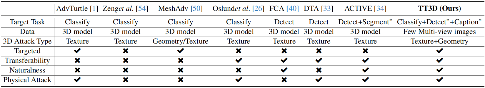
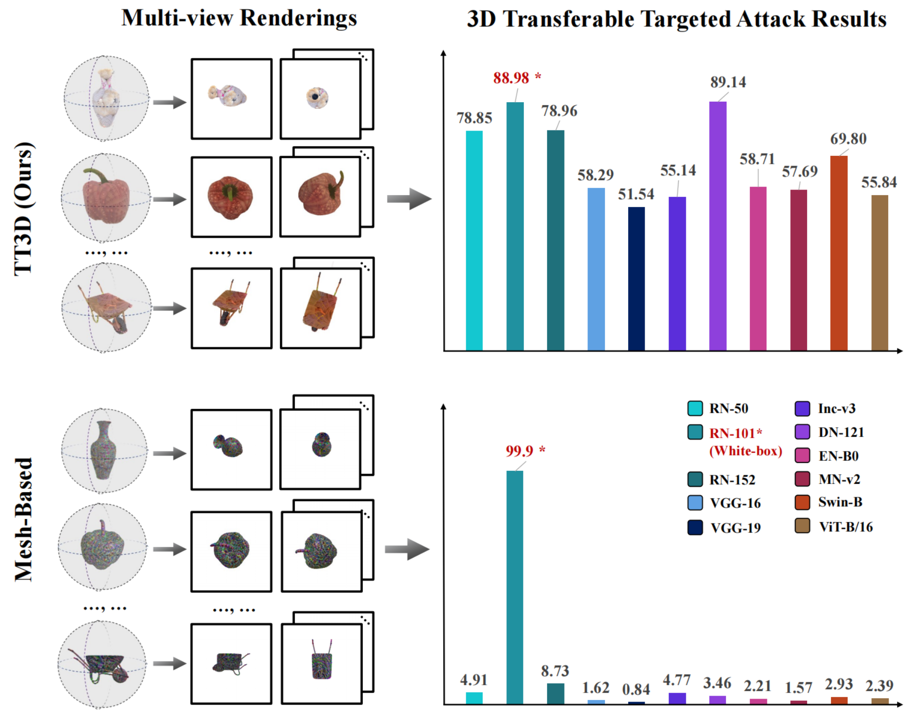

# Towards Transferable Targeted 3D Adversarial Attack in the Physical World

迈向物理世界中可迁移的目标性三维对抗攻击

## Abstract

​		与可迁移的**非目标攻击**相比，可迁移的**目标对抗攻击**可以指定对抗样本的误分类类别，这对安全至关重要的任务构成了更大的威胁 。与此同时，三维对抗样本由于具有多视角鲁棒性的潜力，能够更全面地识别现有深度学习系统中的弱点，具有巨大的应用价值 。然而，可迁移的目标三维对抗攻击领域仍处于空白 。这项工作的目标是开发一种更有效的技术，能够生成可迁移的目标三维对抗示例，填补这一领域的空白 。为了实现这一目标，我们设计了一个名为 **TT3D** 的新型框架，该框架可以从少量的**多视角图像中快速重建**出可迁移的目标三维**纹理网格** 。现有的基于网格的纹理优化方法在**高维网格空间**中计算梯度，容易陷入**局部最优**，导致迁移性不理想且出现明显的畸变；相比之下，**TT3D** 创新性地在**基于网格的 NeRF** 空间中对**特征网格**（feature grid）和**多层感知机**（MLP）参数进行**双重优化**，这在保持自然性的同时显著增强了**黑盒迁移性** 。实验结果表明，**TT3D** 不仅表现出优越的跨模型迁移性，还在不同的渲染器和视觉任务中保持了相当大的适应性 。更重要的是，我们利用**三维打印技术**在真实世界中制作了三维对抗示例，并验证了它们在各种场景下的鲁棒表现。代码在：https://github.com/Aries-iai/TT3D。

## 1 Introduction

​		尽管**深度神经网络**（**DNNs**）在包括**图像分类** 和**目标检测** 在内的众多任务中取得了前所未有的性能，但这些模型在面对**对抗样本**时显得十分脆弱 。研究表明，这些**对抗样本**在不同模型之间具有良好的**迁移性** ，这成为了一个关键的担忧，因为它们可以在实际应用中规避**黑盒模型** 。大多数可迁移攻击是**非目标攻击**，旨在诱导目标模型产生分类错误 。然而，**可迁移的目标攻击**通过误导**深度神经网络**产生预定的错误分类，可能在现实世界的应用中导致更严重的威胁 。构建此类**可迁移的目标攻击**特别具有挑战性，因为它们不仅需要实现特定的错误分类，还必须避免**过拟合**，以确保在各种模型上都能进行有效的攻击，这需要进一步的研究 。

​		虽然二维领域的**可迁移目标对抗攻击**已被广泛研究 ，但三维领域内**可迁移目标攻击**的探索仍处于空白状态 。与**二维对抗攻击**相比，由于三维攻击具有在不同视角下保持攻击一致性的潜力，因此在现实世界中具有更大的实用价值 。如表 1 所示，现有的三维攻击方法 能够通过修改预先存在之**网格**的**纹理**或**几何结构**来确保多视角有效性，这得益于**网格**的三维一致性 。但是，它们难以同时保证**迁移性**和**目标攻击**效果，尤其是在进行**物理攻击**时 。此外，维持这些**对抗样本**的**自然度**也同样困难 。

`表 1. 不同三维攻击方法在目标视觉任务、所用数据、三维攻击类型、迁移性、是否进行目标攻击、自然度以及是否进行物理攻击方面的比较 。*​ 表示迁移后的任务` 

​	基于上述讨论，本文旨在为物理**目标攻击**生成具有**迁移性**且自然的**三维对抗样本** 。然而，要实现我们的目标存在两个挑战：

（1）先前的**基于网格**的优化方法涉及在**高维网格空间**中直接修改**顶点颜色**，这很容易陷入**过拟合**，从而导致不理想的**迁移性** 。因此，第一个挑战是如何设计一种脱离网格空间的优化方法，通过避免**过拟合**来获得更好的**迁移性** 。
（2）现有方法难以同时保证攻击性能和**自然度**，其攻击过程往往伴随着极端不自然的现象，例如外观上的视觉异常，或者**三维网格**的畸变或碎裂等 。因此，如何平衡攻击性能和视觉**自然度**是另一个挑战 。

​		为了应对上述挑战，我们设计了一个名为 **TT3D** 的新型框架，该框架能够快速重建出具有**迁移性**的目标**三维对抗纹理网格**，并保证其**自然度** 。具体而言，受近期**多视角重建**技术（即**基于网格的 NeRF** ）进展的驱动，我们首先从其多视角图像中重建出一个初始的**三维网格**，但我们并非直接在**网格空间**中进行操作，而是创新性地在**基于网格的 NeRF** 空间中对外观渲染参数进行**对抗微调** 。这种方法不仅成功避免了**过拟合**，还消除了以往方法对预先存在的**三维网格**的依赖，大大降低了成本 。技术细节如下：

​		首先，为了增强**迁移性**，我们设计了一种用于**对抗微调**的**双重优化策略** 。该优化策略同时针对外观**特征网格**和相应的 **MLP** 参数（**特征网格**和 **MLP** 都是**基于网格的 NeRF** 的组成部分），从而在基础特征层和更高级的决策层同时有效地施加扰动 。此外，值得一提的是，尽管单纯改变几何结构难以实现**可迁移的目标攻击**，但我们观察到，在以**纹理优化**为主的方法中引入几何信息的变更可以提升性能。因此，我们将**顶点坐标**的优化也加入到了我们的方法论中 。

​		其次，为了确保**三维对抗纹理网格**的**自然度**，我们在优化过程中对外观和几何结构实施了约束 。这些措施包括**视觉一致性**和**顶点邻近度**，以及用于防止网格畸变并确保表面光滑的专门**损失函数** 。为了提升三维对抗对象在真实世界中的**鲁棒性**，我们还引入了 **EOT**（**变换期望**），它可以有效地整合三维和二维空间中的各种变换，从而更真实地模拟现实世界的条件 。我们的 **TT3D** 与典型的**基于网格的优化方法**在可迁移目标攻击性能上的对比见图 1 。

`图 1. 在三维领域中，我们的 TT3D 与典型的基于网格的优化方法 [50] 的增强版本之间在可迁移目标攻击性能上的对比，详见第 4.2.1 节 。替代模型为 ResNet-101 [10]，我们可以看到 TT3D 展现出了卓越的迁移性 。`

本文的贡献如下：

- 我们提出了一个名为 **TT3D** 的新型框架，用于生成**可迁移的目标三维对抗样本** 。这是该领域首个填补关键空白的工作，并消除了以往方法对预先存在的**三维网格**的依赖，扩大了三维攻击的可行区域 。
- 我们在**基于网格的 NeRF** 空间中设计了一种**双重优化策略** 。该策略在神经网络的基础特征层和更高级的决策层同时进行有效扰动，并在此期间确保了**自然度** 。
- 实验结果表明，我们的**三维对抗对象**可以在各种**受害者模型**、渲染器和任务中被轻易地误分类为给定标签 。此外，我们利用 **3D 打印**技术制作了真实世界中的**三维对抗对象**，并验证了它们在不同视角和背景等各种设置下的**鲁棒性**表现 

## 2 Related work

### 2.1. Transferable Targeted Adversarial Attack

​		二维领域的**可迁移目标对抗攻击**已经得到了广泛的研究 。例如，Li 等人 [15] 通过自适应梯度幅度和**度量学习**来解决“噪声固化”问题，从而提高了**目标攻击**的**迁移性** 。Zhao 等人 [56] 证明了基于简单 **Logit 损失**的攻击在无需大量资源的情况下，就能在目标**迁移性**方面取得意想不到的效果，这对传统的资源密集型方法提出了挑战 。Wang 等人 [43] 和 Naseer 等人 [24] 的工作进一步推动了该领域的发展，引入了用于捕捉类别分布和对齐图像分布的高级方法 。此外，Yang 等人 [52] 还提出了一种基于**分层生成网络**的方法来构建目标迁移对抗样本，展示了**生成模型**在该领域的潜力 。然而，上述工作仅关注二维领域，而**可迁移目标三维对抗攻击**领域仍处于空白，这使得相关研究变得十分必要。

### 2.2. 3D Adversarial Attack

​		自从 Athalye 等人 [1] 验证了**三维对抗样本**的存在以来，涌现出了大量的生成方法 [26, 33, 34, 40, 50, 54] 。其中，除了 **MeshAdv** [50] 尝试通过改变**网格几何结构**进行三维攻击（但仍未能实现**可迁移的目标攻击**）之外，其余方法 [26, 33, 34, 40, 54]（包括可选的 **MeshAdv**）都是基于修改**三维网格**的**纹理** 。我们可以将基于纹理的攻击方法分为两类 。对于像 [26, 50, 54] 这样的方法，它们在**高维网格空间**中直接修改**顶点颜色**，这导致了不可避免的**过拟合** 。另一方面，像 [33, 34, 40] 这样的工作通过优化一张**纹理贴图**并将其**渲染**到指定的**三维模型**（如汽车）上，在一定程度上增强了**迁移性** 。然而，它们的**迁移性**局限于**目标检测**中的**非目标攻击**，缺乏可比性 。此外，这些攻击大多局限于数字领域，而**物理攻击**往往伴随着视觉上的不自然 。为了解决这些问题，我们的工作在不依赖**三维模型**的情况下，可以有效地进行三维攻击，不仅确保了攻击性能（即在真实世界场景中也可行的**可迁移目标三维攻击**），而且还能满足对**自然度**的需求 。

## 5 Conclusion

​		在本文中，我们提出了一个新的**三维攻击框架** **TT3D**，它可以将**多视角图像**快速重建为**可迁移的目标三维对抗样本**，有效地填补了**三维可迁移目标攻击**领域的空白 。此外，**TT3D** 利用了**基于网格的 NeRF** 空间中的**双重优化策略**，这显著提高了**黑盒迁移性**，同时确保了**视觉自然度** 。大量的实验进一步证明了 **TT3D** 在各种**渲染器**和**视觉任务**中具有很强的**跨模型迁移性**和适应性，并通过**3D 打印技术**证实了其在现实世界中的适用性 。

---

## 术语

`Untargeted Attack`  非目标攻击，攻击的目的是只要让模型识别错误即可，不限制错误分类的具体类别。

​		**通俗理解**：只要能把“猫”认错成任何别的东西（比如狗、树、车）就算攻击成功。

`Targeted Attack`  目标攻击，目标攻击具有更强的指向性，它要求模型必须将样本错误地分类为一个特定的、预先设定的类别。

​		**通俗理解**：这是一种“深度伪装”。比如攻击者想让安检系统把一把“手枪”认成“雨伞”，这就属于目标攻击。其难度远高于非目标攻击，因为攻击者需要精准地操控特征向量进入特定的决策空间。

`3D Textured Mesh` 三维纹理网格，由几何顶点（Vertices）、面片（Faces）和表面纹理（Texture）组成的三维物体表示方式 。

`NeRF, Neural Radiance Fields` 神经辐射场，一种利用神经网络（如 MLP）将三维场景建模为连续体积场，并能通过体积渲染生成任意视角图像的技术 。

​		**通俗理解**：AI 的“ 3D 建模术”，只需看几张照片就能学会如何从 360 度画出这个物体。

`Grid-based NeRF` 基于网格的NeRF，将 NeRF 的特征存储在显式的三维网格（Voxel Grid）中，以极大地提升渲染和优化速度 。

​		**通俗理解**：给 AI 配了一个“储物架”，信息随取随用，不用每次都现算。

`Expectation Over Transformation，EOT`  变换期望，在生成对抗样本时，预先模拟各种物理环境变换（如光照、视角、模糊），以增强扰动的鲁棒性 。

## END