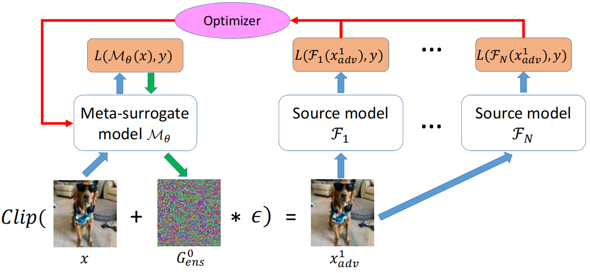
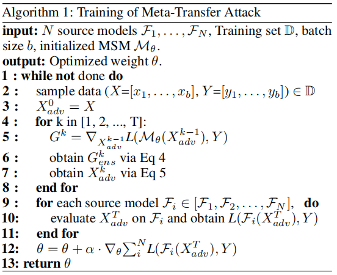
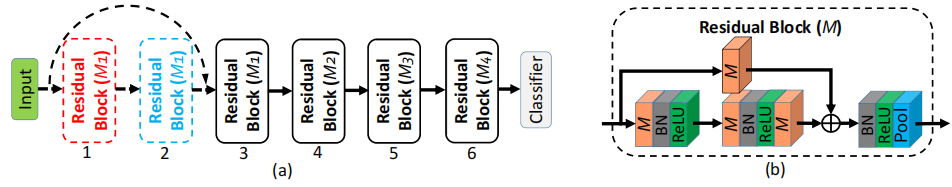
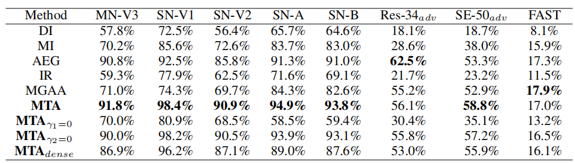
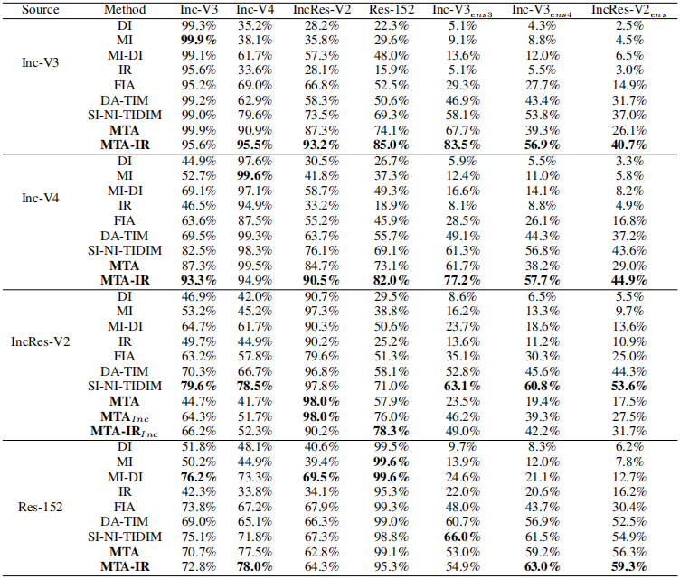
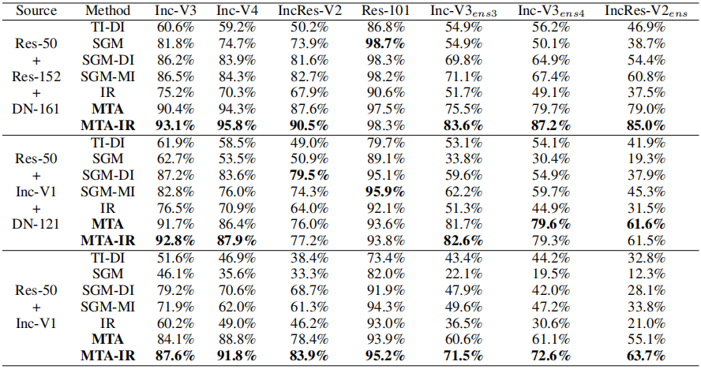

# Training Meta-Surrogate Model for Transferable Adversarial Attack

## Abstract

​		在不允许进行任何查询的情况下，针对**黑盒模型**的**对抗攻击**问题给学术界带来了巨大的挑战，并已得到了广泛的研究 。在这种设定下，一种简单而有效的方法是将攻击**替代模型**所获得的**对抗样本**进行迁移，从而欺骗目标模型 。以往的工作研究了对替代模型采取何种攻击能产生更具**迁移性**的对抗样本，但由于替代模型与目标模型之间的不匹配，它们的表现仍然有限 。在本文中，我们从一个新颖的角度解决了这个问题——与其使用原始替代模型，我们是否可以获得一个**元代理模型**（**MSM**），使得针对该模型的攻击可以轻易地迁移到其他模型上？我们证明了这一目标可以从数学上表述为一个**双层优化**问题，并设计了一个**可微攻击者**以使训练变得可行 。给定一个或一组替代模型，我们的方法由此可以获得一个 **MSM**，使得在其上生成的对抗样本具有卓越的迁移性 。在 Cifar-10 和 ImageNet 上的全面实验表明，通过攻击 **MSM**，我们可以获得更强的迁移对抗样本来欺骗黑盒模型（包括经过**对抗训练**的模型），且成功率远高于现有方法 。

## 1 Introduction

​		**卷积神经网络**（**CNN**）的发展极大地推动了**计算机视觉**领域的进步 。然而，以往的工作表明了一个关键的**鲁棒性**问题，即 **CNN** 模型容易受到输入图像中人为无法察觉的扰动的影响，这些扰动也被称为**对抗样本**（**AEs**）。**对抗样本**的设计对于揭示机器学习系统的安全威胁 以及理解 **CNN** 所学习到的表示非常有用。

​		在本文中，我们考虑了**黑盒攻击**问题，即目标受害者模型对攻击者是完全隐藏的 。在这种设定下，标准的**白盒攻击** [2, 3] 甚至基于查询的黑盒攻击 [5, 4] 都无法使用，而攻击受害者的主流方式是通过**迁移攻击** [6, 7] 。在迁移攻击 [8, 9, 10, 11] 中，`攻击者通常通过攻击单个或集成的一组替代模型来生成对抗样本`，并期望获得的对抗样本也能成功欺骗受害黑盒模型 。

​		尽管在提高对抗攻击的**迁移性**方面已经付出了巨大努力 [12, 13, 14]，但基于迁移攻击的方法只能取得较低的成功率 。这是由当前方法的一个`根本局限性`造成的——它们都利用了通过标准学习任务（如分类、目标检测）训练的替代模型，而即使对抗样本的优化已经得到了极大的改进，能够欺骗这些模型的攻击也并不总是能够轻易迁移 。因此，我们提出了一个文献中尚未得到充分研究的关于迁移攻击的重要问题：与其使用标准（自然训练的）模型作为替代模型，我们是否能找到一个**元替代模型**（**MSM**），使得针对该模型的攻击能够更容易地迁移到其他模型？

​		我们通过开发一种名为元迁移攻击（Meta-Transfer Attack, **MTA**）的新型黑盒攻击流水线，对这一问题给出了肯定的回答 。假设给定一组源模型（标准**替代模型**），我们的算法目标不是直接攻击这些源模型，而是获取一个“**元替代模型**（**MSM**）”，该模型经过训练后的目标是：针对它的攻击可以更容易地迁移并欺骗其他模型，随后在 **MSM** 上进行攻击以获取具有**迁移性**的**对抗样本**（AEs） 。我们证明，通过展开在 **MSM** 上的攻击并`定义一个对抗损失来监督所得 AEs 的迁移性`，这一目标可以被数学化地表述为一个`适定（类双层优化）的训练目标` 。为了避免白盒攻击中的离散操作，我们提出了一种`定制化 PGD 攻击者`，该攻击者能够实现整个 **MTA** 框架的反向传播 。

​		所提出的 **MTA** 与现有的**迁移攻击**有很大不同，特别是与基于**集成**的方法 （Dong et al. 2019; Lin et al. 2020）相比 。关键区别在于：现有方法通常通过直接攻击源模型（在源模型上优化 **AEs**）来生成对抗样本，并且为了提高 AEs 的**迁移性**，它们通常提出一些方案 （例如，**梯度动量**  (Dong et al. 2018)、**跳跃连接**上的梯度  (Wu et al. 2020a)）来隐式地改进 AEs 的优化 。`MTA 不是隐式地提高 AEs 的迁移性，而是通过对 MSM 进行双层训练显式地优化迁移性`，并通过攻击 **MSM** 来生成 AEs（在 **MSM** 而非源模型上优化 AEs）。**MSM** 的**双层训练**是一个闭环过程：1) 通过攻击 **MSM** 生成 AEs ；2) 在源模型上评估 AEs 的迁移性 ；3) 通过优化 **MSM** 来提高迁移性 。这种闭环训练是攻击训练后的 **MSM** 比现有方法能产生更强迁移性 AEs 的首要原因，无论源模型的数量多少 。通过在各种模型和数据集上进行的广泛实验，我们表明所提出的 **MTA** 显著改进了迁移攻击，证明了 **MTA** 的有效性 。

​		我们工作的**主要贡献**如下：

1) `我们提出了一种新颖的双层训练框架 MTA，用于训练 MSM 以改进迁移攻击` 。据我们所知，我们的工作是探索通过更好的**替代模型**来产生更强迁移性 **AEs** 的**首次尝试** 。

2) `我们精心设计了一种定制化 PGD（Customized PGD）以实现 MTA 中的反向传播`，并在“梯度计算”章节（第 4 页）和附录中分析了**定制化 PGD** 的必要性 。

3) 我们在 Cifar-10 和 ImageNet 数据集上，将 **MTA** 与最先进的迁移攻击方法进行了比较，例如 **MI** (Dong et al. 2018)、**DI** (Xie et al. 2019)、**TI** (Dong et al. 2019)、**SGM** (Wu et al. 2020a)、**AEG** (Bose et al. 2020)、**IR** (Wang et al. 2021a)、**SI-NI** (Lin et al. 2020)、**FIA** (Wang et al. 2021b) 以及 **DA** (Huang et al. 2022) 。对比结果证明了 **MTA** 的有效性——通过攻击 **MSM** 生成的 **AEs** 在攻击**自然训练**和**对抗训练**的黑盒目标模型时，表现均显著优于以往的方法 。

## 2 Background

​		**对抗攻击**。Szegedy et al. (2014) 揭示了一个有趣的现象，即 **CNN** 模型在**对抗攻击**面前是脆弱的 。此后，许多攻击方法被开发出来 (Kaidi et al. 2019; Gao et al. 2020; Wu, Wang, and Yu 2020; Li, Guo, and Chen 2020; Sriramanan et al. 2020; Naseer et al. 2019) 。根据目标模型向攻击者暴露信息的多少，对抗攻击主要可分为**白盒攻击**和**黑盒攻击** (Maksym et al. 2020) 。白盒攻击 (Kurakin, Goodfellow, and Bengio 2018) 通常比黑盒攻击 (Brendel, Rauber, and Bethge 2017) 更有效，因为它们可以利用目标模型的全部知识，包括模型权重和架构 。例如，**快速梯度符号法** (**FGSM**) (Goodfellow, Shlens, and Szegedy 2014) 使用单步梯度上升来产生扩大模型损失的对抗样本 。**投影梯度下降** (**PGD**) 攻击可以被视为多步的 **FGSM** 攻击 (Madry et al. 2018) 。通过利用目标模型的全部信息，许多其他白盒攻击也已被开发出来 (Croce and Hein 2020a) 。在黑盒设定中，**基于查询的黑盒攻击** (Huang and Zhang 2020; Du et al. 2020) 假设模型信息是隐藏的，但攻击者可以查询模型并观察相应的**硬标签**或**软标签**预测 。其中，(Chen et al. 2017; Ilyas et al. 2018) 考虑了软标签概率预测 ，而 (Chen, Jordan, and Wainwright 2020; Cheng et al. 2018) 考虑了基于决策的硬标签预测 。考虑到使用大量查询来攻击一张图像是不切实际的，一些工作尝试进一步减少查询次数 (Li et al. 2020a; Wang et al. 2020) 。

​		**可迁移对抗攻击**。在本文中，我们考虑攻击者无法对目标模型进行任何查询的黑盒攻击场景 (Huang et al. 2019; Huang and Kong 2022) 。在这种情况下，通用的攻击方法是基于**迁移攻击**——攻击者通过攻击一个或少数几个**替代模型**来生成 **AEs**，并希望这些 **AEs** 也能欺骗目标模型 (Liu et al. 2017; Liu, Jiang, and Jiang 2022) 。与基于查询的攻击相比，从替代模型制作 **AEs** 消耗的计算资源更少，在实践中更具现实意义 。沿着这个方向，后续的工作尝试提高 **AEs** 的迁移性 (Guo, Li, and Chen 2020; Wang and He 2021; Zhou et al. 2018; Li et al. 2020b) 。例如，**MI** 通过在迭代过程中引入**动量项**来增强迁移性 。其他技术如**数据增强** (Xie et al. 2019)、利用**跳跃连接**的梯度 (Wu et al. 2020a) 以及像素间的负交互 (Wang et al. 2021a) 也有助于实现更强的迁移攻击 。**DA** (Huang et al. 2022) 在攻击过程中利用`聚合梯度方向`，以避免生成的对抗样本对白盒替代模型产生**过拟合** 。**MGAA** (Yuan et al. 2021) 表明，缩小白盒梯度与黑盒梯度之间的方向间隙同样能提高迁移性 。虽然 **MGAA** 也使用了元学习，但所提出的 **MTA** 与 **MGAA** 有很大不同，因为在每个梯度上升步骤中，**MGAA** 从源模型库中采样多个源模型来构建元任务，以改进 **AE** 的优化 。除了使用原始替代模型外，**AEG** (Bose et al. 2020) 还对抗性地训练了一个鲁棒分类器以及一个基于编码器-解码器的扰动生成器 。训练完成后，**AEG** 使用该生成器来产生可迁移的 **AEs** 。与所有现有工作相比，我们的方法是`第一个通过元训练一个新的元替代模型 (MSM)，使得针对 MSM 的攻击能够更容易地迁移到其他模型的工作` 。这不仅不同于以往所有攻击标准替代模型的方法，也不同于像 **AEG** 这样基于编码器-解码器的方法 。

## 3 Methodology

​		我们考虑这样一种**黑盒攻击**设定：目标模型对攻击者是隐藏的，且不允许进行查询 。这种设定也被称为**迁移攻击**设定 (Dong et al. 2018, 2019)，在这种情况下，攻击者：1) 无法获取目标模型的权重、架构和梯度；2) 无法向目标模型发起查询 。攻击者可以访问：1) 目标模型所使用的数据集；2) `一个或一组可能与目标模型共享数据集的替代模型（也称为源模型）` 。例如，通常假设攻击者可以访问一个或多个性能良好的（预训练）图像分类模型 。现有的可迁移对抗攻击方法对这些模型进行各种攻击，并希望获得能够欺骗未知目标模型的可迁移 **AEs** 。与其提出另一种针对替代模型的攻击方法，我们提出了一种新颖的框架 **MTA** 来训练一个**元替代模型**（**MSM**），其目标是：攻击 **MSM** 所生成的迁移对抗样本比直接攻击原始替代模型所生成的更强 。`在评估时，通过标准的白盒攻击方法（如 PGD 攻击）攻击 MSM 来生成可迁移 AE`s 。在下文中，我们将首先回顾现有的攻击方法，然后展示如何构建一个**双层优化**目标来训练 **MSM** 模型 。

### 3.1 Reviews of FGSM and PGD

​		我们遵循现有工作 （Xie et al. 2019; Wu et al. 2020a; Wang et al. 2021a）专注于`无特定目标攻击`，即只要扰动后的图像被错误预测，攻击就被认为是成功的 。**FGSM** 进行单步**梯度上升**来生成对抗样本，以扩大预测损失 。其公式为：
$$
x_{adv} = Clip(x + \epsilon \cdot sign(\nabla_{x}L(f(x),y))) \tag1
$$
其中 $x$ 是干净图像，$y$ 是相应的标签 ；$\epsilon$ 是攻击步长，决定了每个像素的最大 $L_{\infty}$ 扰动 ；$f$ 是对 **FGSM** 攻击者透明的受害者模型 ；$Clip$ 是将 $x_{adv}$ 的值限制在合法范围内的函数（例如，将 RGB **AEs** 限制在 $[0, 255]$ 范围内） ；$L$ 通常是**交叉熵损失** 。**PGD**（Kurakin, Goodfellow, and Bengio 2018），也被称为 **I-FGSM**，是 **FGSM** 的多步扩展 。**PGD** 的公式为 ：
$$
x_{adv}^{k} = Clip(x_{adv}^{k-1} + \frac{\epsilon}{T} \cdot sign(\nabla_{x_{adv}^{k-1}}L(f(x_{adv}^{k-1}),y))) \tag2
$$
$x_{adv}^{k}$ 是在第 $k$ 步梯度上升中生成的 **AEs** 。注意，$x_{adv}^{0}$ 是等于 $x$ 的干净图像 。公式 (2) 将运行 $T$ 次迭代，以获得扰动大小为 $\epsilon$ 的 $x_{adv}^{T}$ 。

### 3.2 Meta-Transfer Attack

​		如何训练一个 MSM，使得对该模型的攻击能够更容易地迁移到其他模型？我们证明这一目标可以被数学构建为一个`双层训练目标`。令 $\mathcal{A}$ 表示一种攻击算法（例如 FGSM 或 PGD），$\mathcal{M}_{\theta}$ 表示由 $\theta$ 参数化的 **元替代模型 (MSM)**。对于给定图像 $x$，通过攻击 $\mathcal{M}_{\theta}$ 生成的对抗样本 (AE) 可以表示为 $\mathcal{A}(\mathcal{M}_{\theta}, x, y)$。例如，如果 $\mathcal{A}$ 是 FGSM，那么 $\mathcal{A}(\mathcal{M}_{\theta}, x, y) = x_{adv} = \text{Clip}(x + \epsilon \cdot \text{sign}(\nabla_x L(\mathcal{M}_{\theta}(x), y)))$。由于在攻击阶段我们只能访问一组源模型 $\mathcal{F}_1, \dots, \mathcal{F}_N$，我们可以评估对抗样本 $\mathcal{A}(\mathcal{M}_{\theta}, x, y)$ 在这些源模型上的迁移性，并通过最大化这 $N$ 个源模型的对抗损失来优化 MSM，从而得到如下训练目标：
$$
\arg \max_{\theta} \mathbb{E}_{(x, y) \sim D} \Big[ \sum_{i=1}^{N} L(\underbrace{\mathcal{F}_i(\mathcal{A}(\mathcal{M}_{\theta}, x, y))}_{\mathcal{F}_i\text{ 对 AE 的预测}}, y) \Big], \tag3
$$
其中 $D$ 是训练数据的分布。该目标的结构和训练过程如图 1 所示，我们可以将其视为一种**元学习**或**双层优化方法**。

`图 1：当` $T = 1$ 且 $A(M_\theta(x)) = x_{adv}^1$ `时，所提出的 MTA 框架`。首先将干净图像 $x$ 输入到元代理模型（MSM）$M_\theta$ 中，并获得损失 $L(M_\theta(x), y)$。接着，我们反向传播该损失，并利用公式 4 获得噪声 $gens^{(0)}$。然后，通过公式 5，我们得到对抗样本 $x_{adv}^1$，该样本将被输入到代理模型 $F_1, F_2, \dots, F_N$ 中。最后，`通过最大化这些代理模型的损失，我们可以优化元代理模型（MSM）以学习特定的权重，使得攻击该模型的对抗样本` $x_{adv}^1$ `能够欺骗这些代理模型。`

在下层，通过对 MSM 进行白盒攻击（通常是梯度上升）生成对抗样本；而在上层，我们将对抗样本输入源模型以计算鲁棒损失。求解公式 3 将找到一个 MSM，攻击该模型能够产生更强的可迁移对抗样本。公式 3 的优化步骤详述如下。

​		**首先**，$\mathcal{A}$ 应当是某种强力的白盒攻击，如 FGSM 或 PGD。然而，直接使用这些攻击会使元训练目标公式 3 的梯度变得定义不明确 (ill-defined)，因为 FGSM 和 PGD 中的符号函数 (sign function) 引入了离散操作。这导致反向传播经过符号函数时的梯度为零，进而阻碍了 MSM 的训练。

​		为了克服这一挑战，我们将 $\mathcal{A}$ 设计为 PGD 的近似，并将其命名为 **定制化 PGD (Customized PGD)** 。“梯度计算”小节将进一步分析 PGD 中的符号函数如何阻碍反向传播，以及定制化 PGD 如何使反向传播成为可能 。PGD 与定制化 PGD 之间的关键区别在于对梯度 $\nabla_{x_{adv}^{k-1}}L(\mathcal{M}_{\theta}(x_{adv}^{k-1}), y)$ 的操作，其中 $L$ 为交叉熵损失 。我们将第 $k$ 步的原始梯度 $\nabla_{x_{adv}^{k}}L(\mathcal{M}_{\theta}(x_{adv}^{k}), y)$ 简化为 $g^k$，并通过公式 4 生成另一个映射图 $g_{ens}^{k}$ ：
$$
\begin{cases} g_1^k = \frac{g^k}{\text{sum}(\text{abs}(g^k))} \\ g_t^k = \frac{2}{\pi} \cdot \arctan(\frac{g^k}{\text{mean}(\text{abs}(g^k))}) \\ g_s^k = \text{sign}(g^k) \\ g_{ens}^k = g_1^k + \gamma_1 \cdot g_t^k + \gamma_2 \cdot g_s^k \end{cases} \tag4
$$
注意，我们在所有实验中默认设置 $\gamma_1 = \gamma_2 = 0.01$ 。$g_1^k$ 和 $g_t^k$ 都保证了公式 3 中的目标函数关于 MSM 权重 $\theta$ 是可微的 ；$\arctan(\cdot)$ 是符号函数的平滑近似，而 $\frac{1}{\text{mean}(\text{abs}(g^k))}$ 防止 $\arctan$ 落入饱和区或线性区 。项 $\gamma_2 \cdot g_s^k$ 为 $g_{ens}^{k}$ 中每个像素的扰动提供了下界 。消融实验部分的实验证明了 $g_t^k$ 和 $g_s^k$ 对于定制化 PGD 的重要性 。利用公式 4，定制化 PGD 执行以下更新以生成对抗样本 (AE) ：
$$
x_{adv}^k = \text{Clip}(x_{adv}^{k-1} + \frac{\epsilon_c}{T} \cdot g_{ens}^{k-1}). \tag5
$$
注意，$\epsilon_c$ 不同于 FGSM 和 PGD 中的扰动 $\epsilon$，因为我们更新中的 $g_{ens}^{k-1}$ 不是符号向量，其大小将取决于原始梯度的幅值 。最后，经过 $T$ 次迭代公式 5 后，我们得到 $x_{adv}^{T}$ 。

​		**第二**，我们将 $x_{adv}^T$ 输入到 $N$ 个源模型中，并计算所有 $i = 1, . . . [cite_start], N$ 对应的对抗损失 $L(\mathcal{F}_i(x_{adv}^T), y)$ 。$N$ 个源模型的损失越大，表明欺骗 MSM 的 $x_{adv}^T$ 迁移到其他模型的可能性越高 。

​		**第三**，我们通过最大化公式 3 中定义的目标函数来优化 MSM，该过程可以写为：
$$
\theta' = \theta + \alpha \cdot \sum_{i=1}^{N} \nabla_{\theta}L(\mathcal{F}_i(x_{adv}^T), y), \tag6
$$
​		其中，通过将攻击更新规则公式 5 **展开 (Unrolling)** $T$ 次，$x_{adv}^T$ 可以被写成关于 $\theta$ 的函数 。我们将在“梯度计算”小节中展示如何显式地计算该梯度 。通过这个训练过程，MSM 被训练去学习特定的权重，使得欺骗它的白盒对抗样本也能欺骗其他模型 。我们分别在算法 1 和附录中总结了 MTA 的训练和测试过程 。每个大写符号代表用小写字母表示的变量的一个批次（例如，$X$ 表示一批 $x$）。注意，定制化 PGD 仅仅是用于训练 MSM 的 PGD 的连续近似 。在**推理阶段**，我们使用标准攻击（如 PGD）在 MSM 上生成对抗样本 。

### 3.3 Gradient Calculation

​		在计算中，我们将公式 6 中的 $N$ 和 $T$ 都设为 1，因此公式 6 中的梯度变为 $\nabla_{\theta} L(\mathcal{F}_{1}(x_{adv}^{1}), y)$。根据公式 5，我们可以将公式 6 中的 $x_{adv}^{1}$ 替换为 $Clip(x_{adv}^{0} + \epsilon_{c} \cdot g_{ens}^{0})$，其中 $x_{adv}^{0}$ 等于 $x$。为简单起见，我们在分析中忽略 Clip 函数，并将推导过程简化为 $\nabla_{\theta} L(\mathcal{F}_{1}(x + \epsilon_{c} \cdot g_{ens}^{0}), y)$。通过**链式法则 (Chain Rule)**，并且由于 $x$ 独立于 $\theta$，我们可以将其进一步重写为：
$$
\frac{\partial L(\mathcal{F}_{1}(x + \epsilon_{c} \cdot g_{ens}^{0}), y)}{\partial g_{ens}^{0}} \cdot \frac{\partial g_{ens}^{0}}{\partial \theta}. \tag7
$$
通过用公式 4 替换 $g_{ens}^{0}$，公式 7 的第二项可以展开为：
$$
\nabla_{\theta} g_{ens}^{0} = \nabla_{\theta} g_{1}^{0} + \gamma_{1} \cdot \nabla_{\theta} g_{t}^{0} + \gamma_{2} \cdot \nabla_{\theta} g_{s}^{0}. \tag8
$$
注意，$g_{s}^{0}$ 等于 $\text{sign}(g^{0})$，且符号函数引入了**离散操作 (Discrete Operation)**，因此 $g_{s}^{0}$ 关于 $\theta$ 的梯度变为 0（除非 $g^{0} = 0$）。因此，$\nabla_{\theta} g_{ens}^{0}$ 可以进一步写为：
$$
\begin{aligned} \nabla_{\theta} g_{ens}^{0} &= \nabla_{\theta} g_{1}^{0} + \gamma_{1} \cdot \nabla_{\theta} g_{t}^{0}  \\ &= \nabla_{\theta} \left( \frac{\nabla_{x} L(\mathcal{M}_{\theta}(x), y)}{\text{sum}(\text{abs}(\nabla_{x} L(\mathcal{M}_{\theta}(x), Y )))} \right) + \gamma_{1} \cdot \nabla_{\theta} \left( \arctan \left( \frac{\nabla_{x} L(\mathcal{M}_{\theta}(x), y)}{\text{mean}(\text{abs}(\nabla_{x} L(\mathcal{M}_{\theta}(x), y)))} \right) \right)  \end{aligned} \tag{9}
$$
其中 $\nabla_{x} L(\mathcal{M}_{\theta}(x), y)$ 依赖于 $\theta$，且 $\nabla_{x} L(\mathcal{M}_{\theta}(x), y)$ 关于 $\theta$ 的**二阶导数 (Second-order Derivative)** 可以通过许多深度学习库获得。总之，通过整合公式 6-9，MSM 可以通过基于 SGD 的优化器进行优化。公式 6-9 也能清楚地解释为什么定制化 PGD 使得 MSM 的训练成为可能，而普通 PGD 会阻碍训练。当使用普通 PGD 攻击 MSM 并生成对抗样本时，公式 7 将变为 $\frac{\partial L(\mathcal{F}_{1}(x + \epsilon_{c} \cdot g_{s}^{0}), y)}{\partial g_{s}^{0}} \cdot \frac{\partial g_{s}^{0}}{\partial \theta}$，其中 $\frac{\partial g_{s}^{0}}{\partial \theta}$ 为零，因为 $g_{s}^{0}$ 是带符号的离散梯度 $\text{sign}(g^{0})$。

## 4 Experiment

​		我们开展实验以表明，在相同的源模型设置下，所提出的方法能够比现有的迁移攻击方法生成更强的**可迁移对抗样本**。 

​		我们的通用实验设置如下： 1) 我们在 Cifar-10 和 ImageNet 上均开展了实验 。 2) 我们将提出的 MTA 与十种最先进的 (SOTA) **可迁移对抗攻击方法 (Transferable Adversarial Attack Methods)** 进行了比较，包括 MI, DI, TI, SGM, SI-NI-TIDIM, AEG, IR, MGAA, FIA 和 DA-TIM 。AEG 仅在 Cifar-10 上进行比较，这是因为官方 AEG 仅在小规模数据集（Mnist 和 Cifar-10）上进行了评估，且在大规模数据集上训练**扰动生成器 (Perturbation Generator)** 的计算成本高昂 。 3) 由于训练和测试时的攻击迭代次数 $T$ 不同，为了避免混淆，我们将训练时的迭代次数记为 $T_t$，测试时的记为 $T_v$ 。 4) 在训练 MSM 时，我们使用 $\gamma_1=\gamma_2=0.01$ 的**定制化 PGD (Customized PGD)** 来攻击 MSM，如算法 1 所示 。在评估时，我们使用 $T_v=10$ 和 $\epsilon=15$ 的 PGD 来攻击 MSM，如附录中的算法 2 所示 。 5) 当使用**基线方法 (Baseline Methods)** 在多个源模型上生成对抗样本时，我们遵循 MI 的方法，在计算损失之前对源模型的 Logits 进行集成 。 6) 我们使用源模型来训练 MSM，并使用**目标模型 (Target Models)** 来评估在 MSM 上生成的对抗样本的可迁移性 。 7) 为了在 MTA 和基线之间进行公平比较，我们在实现基线方法时将迭代次数设为 $T=10$，$\epsilon=15$，并将其他**超参数 (Hyper-parameters)** 调整至最佳性能（具体实现细节见附录）。 8) 可视化 、计算成本分析、简化的 TensorFlow 代码、MTA 和基线的更多实现细节以及更多实验（例如：有目标迁移攻击、$\epsilon=8$ 的攻击、MTA 与 TAIG (Huang and Kong 2022) 的比较、攻击 ViT (Dosovitskiy et al. 2021)、源模型与目标模型之间无重叠训练图像等）将在附录中呈现 。

### 4.1 Experiments on Cifar-10

​		`Source and Target Models` 我们使用 8 个**源模型 (Source Models)** 来训练 MSM，包括 ResNet-10, -18, -34 (He et al. 2016), SeResNet-14, -26, -50 (Hu, Shen, and Sun 2018), MobileNet-V1 (Howard et al. 2017), 以及 -V2 (Sandler et al. 2018)。为了确保源模型和目标模型之间的不匹配 (mismatches)，并避免饱和的迁移攻击性能（即攻击成功率接近 100%），我们选择了 8 个**目标模型 (Target Models)**，包括 MobileNet-V3 (Howard et al. 2019), ShuffleNet-V1, -V2 (Zhang et al. 2018), SqueezeNet-A, -B (Iandola et al. 2016), 经过**对抗训练 (Adversarially Trained)** 的 ResNet-34 和 SeResNet-50, 以及鲁棒模型 FAST (Wong, Rice, and Kolter 2020)。FAST 是一个在 RobustBench 上可用的公开鲁棒模型。所有其他 15 个源模型和目标模型的网络架构均定义在 GitHub 仓库  中。我们训练了这 15 个模型，并在附录中描述了这些模型的训练细节。训练好的模型和代码将向社区发布以用于复现。

​		 `Training the MSM` MSM 的默认网络架构是图 2 所示的 ResNet-13，其中 $M_1, M_2, M_3$ 和 $M_4$ 分别设置为 $64, 128, 256$ 和 $512$。我们使用 8 个源模型对 MSM 进行 $60$ 个 **Epoch** 的训练，攻击步数 $T_t$ 设为 $7$。定制化 PGD 的 $\epsilon_c$ 初始化为 $1,600$，并且每 $4,000$ 次迭代以 $0.9\times$ 的速率进行**指数衰减 (Exponential Decay)**。**学习率 (Learning Rate)** $\alpha$ 和**批量大小 (Batch Size)** 分别设置为 $0.001$ 和 $64$。

`图 2：(a) ResNet-13 和 ResNet-19 的结构。ResNet-13 包含前四个实线框所示的模块以及分类器。ResNet-19 则包含全部六个模块以及分类器。每个模块的参数 $M^*$ 表示其卷积层的滤波器（卷积核）数量。(b) 残差模块的详细结构。橙色立方体代表卷积层，其上方的数字表示滤波器的数量。第六个模块中的池化层（Pool）是全局平均池化（global-average pooling），而其他所有池化层均为步长和卷积核大小均为 $2 \times 2$ 的最大池化（max-pooling）。捷径路径（shortcut path）中的卷积层使用 $1 \times 1$ 的卷积核大小，而其他所有卷积层均使用 $3 \times 3$。`

​		`Evaluating the MSM`  对于每个目标模型，我们仅攻击被正确分类的测试图像，因为攻击那些本身就被错误分类的干净图像意义不大 。

​		`Experimental Results`  如表 1 所示，MTA 在几乎所有的目标模型上表现最好 。在 $Res-34_{adv}$ 和 FAST 上，MTA 的表现与 AEG 和 MGAA 相当，并优于其他方法 。AEG 在 $Res-34_{adv}$ 上优于 MTA 的可能原因是，它训练了一个**扰动生成器 (Perturbation Generator)** 来欺骗**鲁棒分类器 (Robust Classifiers)**，同时对抗性地训练鲁棒分类器以防御生成的扰动 。因此，它自然能更好地迁移到一些**对抗训练 (Adversarial Trained)** 的目标模型上，因为它在训练阶段已经“见”过对抗训练的模型 。然而，它在所有其他模型上的表现较差 。$MTA_{\gamma_{1}=0}$、$MTA_{\gamma_{2}=0}$ 和 $MTA_{dense}$ 将在**消融实验 (Ablation Study)** 中讨论 。

`表 1：在八个 Cifar-10 目标模型上的结果：MobileNet-V3 (MN-V3), ShuffleNet-V1 (SN-V1), -V2 (SN-V2), SqueezeNet-A (SN-A), -B (SN-B), 对抗训练的 ResNet-34` ($Res-34_{adv}$) `和 SeResNet-50` ($SeRes-50_{adv}$)`, 以及鲁棒模型 FAST。`

### 4.2 Experiments on Imagenet

​		`源模型与目标模型` 我们直接使用公开训练好的 ImageNet 模型5,6,7，包括 ResNet-50、-101、-152、DenseNet-121、-161 (Huang et al. 2017)、Inception-V3 (Szegedy et al. 2016)、-V4 (Szegedy et al. 2017)、Inception-ResNet-V2、Inception-V3ens3、Inception-V3ens4 以及 Inception-ResNet-V2ens。前八个模型是**常规训练模型 (Normally Trained Models)**，而最后三个是通过**集成对抗训练 (Ensemble Adversarial Training)** (Tramèr et al. 2017) 训练的**安全模型 (Secure Models)**。我们将这些模型简称为 Res-50、Res-101、Res-152、DN-121、DN-161、Inc-V3、Inc-V4、IncRes-V2、Inc-V3ens3、Inc-V3ens4 和 IncRes-V3ens。

​		`训练 MSM` MSM 的默认网络架构是如图 2 所示的 ResNet-19，其中 M1、M2、M3 和 M4 分别设置为 32、80、200 和 500。我们遵循之前的研究 MI 和 SGM，在两种设置下评估**对抗样本 (Adversarial Examples, AEs)** 的**迁移性 (Transferability)**：使用**单一源模型 (Single Source Model)** 和使用**多源模型 (Multiple Source Models)**。我们将 MSM 的输入尺寸设置为 $224 \times 224$。当源模型的分辨率与 MSM 不同时，我们在将对抗样本 $x_{adv}^{T}$ 输入源模型之前，先将其**调整大小 (Resize)** 至源模型的分辨率。附录将展示更多训练细节。

​		`评估 MSM` 依照 DI 和 SGM 论文中的官方测试数据设置，我们也从 ImageNet 中随机选择了 5,000 张被所有模型正确分类的验证集图像用于评估。请注意，当 MSM 和目标模型的分辨率不同时，我们将对抗样本 $x_{adv}^{T}$ 调整大小至目标模型的分辨率。例如，当攻击分辨率为 $299 \times 299$ 的 Inc-V3 时，我们首先将 $x_{adv}^{T}$ 从 $224 \times 224$ 调整至 $299 \times 299$，然后使用调整后的 $x_{adv}^{T}$ 来攻击 Inc-V3。

​		`使用单一源模型` 表 2 报告了实验结果。MI-DI 是 MI 和 DI 的结合。SI-NI-TIDIM 是 SI-NI、TI、DI 和 MI 的结合。DA-TIM 是 DA、TI 和 MI 的结合。此处未对 MGAA 进行比较，因为它需要一个包含多个源模型的**模型库 (Model Zoo)** 来构建元任务，这不仅成本高昂且过程复杂。显而易见，MTA 在大多数测试场景中都优于基准方法。与 FIA 相比，当使用 Inc-V3 作为源模型并攻击目标模型（Inc-V4、IncRes-152、Res-152、Inc-V3ens3、Inc-V3ens4、IncRes-V2ens）时，MTA 将**迁移攻击成功率 (Transfer Attack Success Rates)** 分别提升了约 31.7%、30.7%、41.1%、131.1%、41.9% 和 75.2%。MTA-IR 将 MTA 与 IR 相结合。在评估中，MTA 通过使用原版 PGD 攻击 MSM 来生成对抗样本 (AEs)，而 MTA-IR 则通过使用 IR 攻击 MSM 来生成对抗样本 (AEs)。与 MTA 相比，当使用 Inc-V3 作为源模型时，MTA-IR 在目标模型上的攻击成功率分别提升了约 5.1%、6.8%、14.7%、23.3%、44.8% 和 55.9%，这表明现有的可迁移攻击方法可以进一步提升 MTA 的性能。当使用 IncRes-V2 作为源模型时，MTA 的表现有时不尽如人意，这可能是因为以 ResNet-19 为**主干网络 (Backbone)** 的 MSM 不适合通过训练来攻击 IncRes-V2。随后，我们将主干网络 ResNet-19 替换为另一种简化的 Inception 网络（架构将在附录中展示）并重新训练 MSM，并将新训练的 MSM 记为 $MTA_{Inc}$。与 ResNet-19 相比，简化的 Inception 主干网络与 IncRes-V2 更为相似，因此 $MTA_{Inc}$ 比 MTA 更容易生成欺骗 IncRes-V2 的对抗攻击，从而使 $MTA_{Inc}$ 更容易收敛。结果表明，$MTA_{Inc}$ 不仅优于 MTA，也优于大多数对比方法，这表明：1）所提出的 MTA 是有效的；2）通过使用更合适的主干网络，可以进一步提升 MTA 的性能。

`表 2：使用单个源模型时，在七个黑盒网络上的迁移攻击结果。`

​		`Using Multiple Source Models` 表 3 报告了使用多个源模型的实验结果。我们分别使用三组源模型（Res-50+Res-152+DN161、Res-50+Inc-V1+DN-121、Res-50+Inc-V1）来训练 **元替代模型 (Meta-Surrogate Model, MSM)**，并使用七个目标模型（Inc-V3、Inc-V4、InvRes-V2、Res-101、Inc-V3ens3、Inc-V3ens4、IncRes-V2ens）来评估对 MSM 攻击的**迁移性 (Transferability)**。SGM-X 是 SGM 与 X（X=DI 或 MI）的结合。TI-DI 是 TI 和 DI 的结合。结果显示，**元迁移攻击 (Meta-Transfer Attack, MTA)** 在几乎所有测试场景中都优于基准方法，尤其是在攻击**防御模型 (Defensive Models)** 时。例如，与 SGM-DI 相比，当使用 Res-50 和 Inc-V1 作为源模型时，MTA 在七个目标模型上的**迁移攻击成功率 (Transfer Attack Success Rates)** 分别提升了 6.2%、25.8%、14.1%、2.2%、26.5%、45.5% 和 96.1%。此外，MTA-IR 的表现优于 MTA。

`表 3：使用多个源模型时，在七个黑盒模型上的迁移攻击结果。`

### 4.3 Ablation Study

​		`网络结构` 表 2 中 MTA 与 $MTA_{Inc}$ 的对比已经验证了**主干网络 (Backbone)** 对 **元替代模型 (Meta-Surrogate Model, MSM)** 的影响。在此，我们通过将主干网络从 ResNet-13 替换为 DenseNet-22BC（附录展示了 DenseNet-22BC 的结构），并将新训练的 MSM 记为 $MTA_{dense}$（见表 1），进一步验证了主干网络的作用。MTA、$MTA_{dense}$ 与基准方法之间的对比表明：1) 主干网络会影响 MTA 的性能；2) 在使用各种不同主干网络的情况下，MTA 的表现均优于基准方法。

​		$\gamma_{1}$ `和` $\gamma_{2}$ `的影响` 我们验证了公式 5 中的 $\gamma_{1}$ 和 $\gamma_{2}$ 如何影响 Cifar-10 上的**迁移攻击性能 (Transfer Attack Performance)**。在此，我们将 $\gamma_{1}$ 和 $\gamma_{2}$ 分别设置为零，并适当放大 $\epsilon_{c}$ 以抵消因 $\gamma_{1}$ 或 $\gamma_{2}$ 置零而导致的扰动大小减小。我们将这两个新执行的 MTA 分别记为 $MTA_{\gamma_{1}=0}$ 和 $MTA_{\gamma_{2}=0}$。表 1 显示的结果表明，将 $\gamma_{1}$ 设置为零会严重损害 MTA 的性能。将 $\gamma_{2}$ 设置为零也会降低 MTA 的性能，但其影响小于 $\gamma_{1}$。总的来说，这两个实验证明了**定制化 PGD (Customized PGD)** 对于所提出的 MTA 框架是不可或缺的。

## 5 Conclusion

​		现有的无查询黑盒对抗攻击方法直接使用图像分类模型作为替代模型 来生成可迁移的对抗攻击以攻击黑盒模型，却忽略了对替代模型本身的研究。在本文中，我们提出了一种名为元迁移攻击 (Meta-Transfer Attack, MTA) 的新颖框架，通过利用这些替代模型训练一个元替代模型 (Meta-Surrogate Model, MSM) 来提升对抗攻击的迁移性。为了实现并改进 MSM 的训练，我们还开发了一种新颖的**定制化 PGD (Customized PGD)**。通过广泛的实验，我们验证了通过攻击训练好的 MSM，可以获得能够泛化到黑盒目标模型且成功率远高于现有方法的迁移对抗攻击，证明了所提 MTA 框架的有效性。