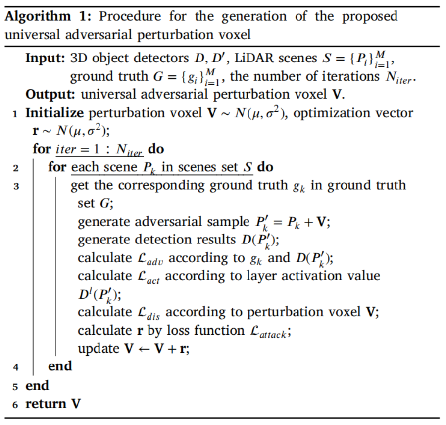
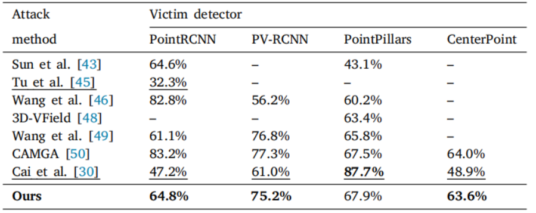
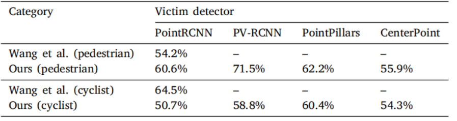
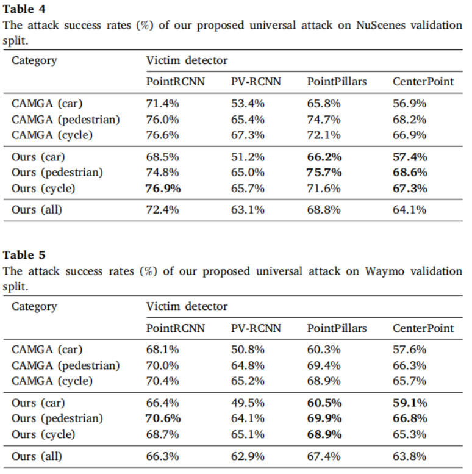
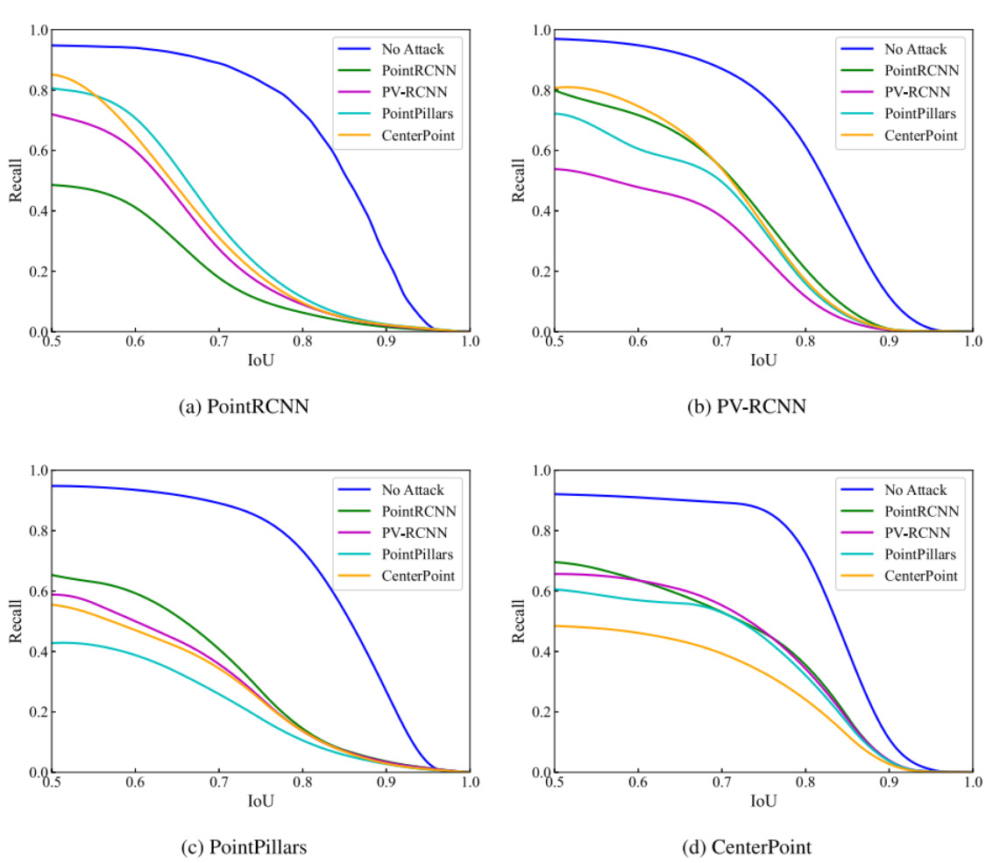

	Promptable Visual Segmentation (PVS)  可提示视觉分割

摘要：

3D物体检测模型高度易受对抗攻击的影响，这些攻击暴露了模型的弱点，而解决这些问题有助于提升模型的鲁棒性。现有针对LiDAR场景的对抗攻击方法通常针对单一样本进行优化，且在可迁移性方面表现较差。具备通用性和可迁移性的对抗攻击能够为3D物体检测的鲁棒性研究提供更深层次的指导。本文提出了一种针对3D物体检测模型的通用**对抗扰动攻击方法**，通过同时`抑制检测结果`和`干扰潜在特征`实现攻击。具体而言，该方法生成的通用对抗扰动采用精心设计的扰动体素单元编码，能够适应不同尺度的LiDAR场景及采用不同点云表征的3D检测器，实现`样本无关`攻击。所提出的可迁移攻击聚焦于潜在特征空间，通过偏移检测器浅层输出来实现干扰。此外，本文设计了`层激活损失函数`，用于抑制主干网络提取的关键特征。在多种主流3D检测器和大规模数据集上的实验表明，该方法具有优异的攻击成功率，揭示了当前基于LiDAR的3D物体检测模型存在的`关键鲁棒性`问题。

### 1. Introduction

3D目标检测技术在安全关键型嵌入式应用[1-3]（如物联网设备、自动驾驶及机器人[4-8]）中发挥着关键作用。激光雷达（LiDAR）传感器通过捕获三维空间环境信息，能够提供精确的点云数据[9]。然而，尽管基于LiDAR的3D目标检测任务已广泛采用深度神经网络（DNNs），但这类模型仍易受对抗攻击的影响[10-12]——恶意构造的样本会导致模型输出偏差结果[13-15]。此类攻击通过对LiDAR获取的点云数据进行细粒度操控，显著降低了检测精度。更严峻的是，LiDAR采集的点云数据本身易受噪声、剪切、密度衰减等多种形式的数据损坏[16]影响，这些损坏可能扰乱LiDAR场景的全局信息或目标局部细节，进而导致3D目标检测器产生错误预测。在自动驾驶等需要可靠感知支撑决策的安全关键场景[17,18]中，此类脆弱性将带来重大风险。

近年来，深度3D模型的鲁棒性研究引起了广泛关注。研究表明，点云数据的缺陷极有可能导致基于3D视觉的感知任务失败[19,20]。一般而言，针对3D视觉任务的对抗攻击通过添加[21]、删除[22]或扰动点云数据[23]来实现。作为点云数据损坏的主要形式，基于点扰动的对抗攻击是当前研究的热点[21]。虽然针对特定实例的对抗攻击显示出较高的成功率，但其存在计算量大、实际应用灵活性差等缺陷。相比之下，通用对抗扰动（Universal Adversarial Perturbation, UAP）方法通过生成适用于不同场景和模型的通用扰动，可实现跨场景攻击。UAP方法最初在基于2D图像的任务中被提出[24]，随后在3D点云识别领域展现出良好的性能、效率和可迁移性[25]。现有的点云UAP方法通常通过向LiDAR场景添加额外点来修改点云密度或结构，但这类方法容易被感知和防御[26]。此外，现有方法在大规模LiDAR场景和3D目标检测任务中的泛化能力尚未得到验证。为使UAP方法适用于不同LiDAR场景，生成的扰动需要适应场景中点的距离和采集范围变化。鉴于现有3D目标检测模型普遍采用体素（voxel）表征3D空间，将扰动存储在体素单元中并以扰动体素形式对3D目标检测模型发起攻击，成为自然的技术选择

此外，现有的通用对抗扰动（UAP）方法大多基于数据依赖性思想，通过增大模型训练损失（如交叉熵损失）实现攻击。这类方法虽对替代模型（surrogate model）攻击有效，但其对未知模型的迁移攻击能力较差[27]。为提升UAP方法的可迁移性，研究者开始关注主干网络潜在特征提取过程的干扰。其动机源于以下发现：不同检测器主干网络的浅层所提取的潜在特征具有高度相似性[28,29]。因此，干扰主干网络及潜在特征有望欺骗多种3D目标检测器，从而提升对抗攻击方法的可迁移性。基于此，从潜在特征干扰视角改进UAP方法对3D目标检测模型的攻击可迁移性，成为极具潜力的研究方向。

在本文中，我们提出了一种`基于潜在特征干扰的通用对抗扰动攻击方法`，针对基于LiDAR的3D目标检测任务。该方法通过抑制检测结果并干扰3D目标检测器的潜在特征实现攻击效果。这种通用攻击通过模拟LiDAR数据的全局扰动，旨在欺骗深度3D目标检测模型。具体而言，对抗样本通过抑制浅层网络中显著激活值并均衡所有激活值，干扰主干网络的浅层输出特征。模型浅层输出和最终预测结果共同指导对抗样本的优化过程。此外，我们设计了一种`扰动体素结构`来存储通用对抗扰动，使得优化完成的扰动体素可以适配任意规模的LiDAR场景，并以体素形式发起对抗攻击。这种基于潜在特征干扰的机制使得攻击具备跨模型迁移能力，可在多种3D目标检测器间迁移。同时，扰动体素单元通过结构化点云级扰动设计，有效解决了LiDAR数据的稀疏性和大规模性问题。

The primary contributions of this work are as follows:

• 提出了一种新型通用对抗攻击框架，其通过扰动体素单元模拟LiDAR数据扰动并抑制检测结果。
• 所设计的扰动体素可适配任意尺度和分辨率的LiDAR场景生成对抗样本，确保了样本无关攻击方法的实际可行性。
• 提出的层激活损失函数有效破坏主干网络的特征提取能力，显著提升了通用对抗攻击的可迁移性。
• 在多种先进3D目标检测器和大规模数据集上的全面实验验证了该方法的优越性，在不同模型和数据集上实现了平均80%的攻击成功率。	

本文的初步版本已在会议[30]中发表，该工作实现了通用对抗攻击但缺乏可转移性，且未在多个数据集和类别上进行验证。在扩展的期刊版本中，我们重点提升了所提通用对抗攻击方法的可转移性。首先，我们阐述了该对抗攻击的可行威胁模型。其次，我们将潜在特征破坏引入到三维目标检测模型的通用对抗扰动(UAP)方法中，并提出层激活损失函数指导对抗样本的生成。此外，我们开展了更深入的实验验证，包括更广泛的受害模型覆盖、更多对比结果和详细的消融研究。同时，我们在不同防御机制下验证了所提对抗攻击方法的有效性。全文结构如下：`第2节`回顾相关工作，介绍三维目标检测方法、三维对抗攻击和通用对抗攻击的研究背景；`第4节`详述可转移通用对抗攻击方法，涵盖问题建模、体素生成、潜在特征破坏和损失函数设计；`第5节`通过实验结果验证方法的有效性。

### 2. Related work

#### 2.1 3D object detection

​	基于LiDAR的3D目标检测已成为自动驾驶、机器人技术和增强现实等应用领域的核心技术[31]。LiDAR传感器生成的点云数据能够提供精确的三维信息，但其稀疏性和无序性给深度学习模型带来了独特挑战。现有的3D目标检测方法主要根据点云表示方式分为三大类：基于体素（voxel-based）的方法、基于鸟瞰图（BEV-based）的方法以及基于原始点云（raw point cloud-based）的方法。1. 基于体素的方法（如VoxelNet[32]、SECOND[33]和PointPillars[34]）通过将三维空间划分为规则网格来应用3D卷积运算。虽然体素化缓解了点云数据固有的无序性挑战，但会带来较高的计算开销和离散化导致的信息损失。2. 基于鸟瞰图的方法（如PIXOR[35]）将三维点云投影到二维平面，从而利用成熟的2D卷积神经网络，但这种方法通常会沿高度维度产生显著的信息丢失。3. 基于原始点云的方法（受PointNet[36]启发）直接处理非结构化的点云数据，例如PointRCNN[37]和PV-RCNN[38]通过直接在原始点云上执行区域级操作实现了优异性能，这类方法计算效率高且能保留更多几何细节，但其对抗扰动的鲁棒性仍未得到解决。最新进展如CenterPoint[39]和CenterFormer[40]通过融合多种表示方式（如体素与原始点云）来平衡精度与效率。尽管这些改进提升了检测性能，但这些检测器对数据损坏和对抗攻击的脆弱性仍凸显了构建鲁棒3D目标检测系统的重要性。

#### 2.2  3D adversarial attack

​		深度学习模型对对抗攻击的脆弱性最初在2D图像分类领域被揭示[10,11]。此类通过操控输入数据误导模型的攻击方法，随后被扩展至3D视觉任务。在3D目标识别与检测领域，对抗攻击通常以扰动点云数据为目标，主要可分为三类：**点添加（point addition）**、**点删除（point discarding）**和**点扰动（point perturbation）**。Xiang等人[21]率先通过添加精心设计的点生成对抗点云，而Zheng等人[41]则通过删除关键点探索了点显著性的影响。基于扰动的攻击方法（如Wen等人[23]提出的方法）则通过修改现有点的位置欺骗3D分类器。

​		在三维目标检测领域，对抗攻击针对检测器在真实环境条件下的鲁棒性展开研究[42]。例如，Sun等人[43]通过`遮挡攻击`揭示了检测器的脆弱性，Cao等人[44]通过向场景注入`对抗性点云`显著降低了检测精度。Tu等人[45]提出通过添加`类物体点云`生成物理可实现的对抗样本，揭示了自动驾驶系统中激光雷达对抗攻击的实际风险。Wang等人[46]通过训练`独立对抗样本`，在多数情况下成功攻击三维目标检测模型，证明了点云扰动对检测系统的破坏性。此外，天气因素（如雪雾干扰）[17,47]和Dong等人[16]混合27种激光雷达数据干扰的方法，均验证了检测模型在复杂环境下的性能退化现象。3D-Vfield[48]通过模拟道`路损毁车辆构建新数据集`，揭示了三维检测模型对未知物体的识别缺陷。Wang等人[49]提出在空白场景`注入对抗性障碍物`的方法，成功欺骗基于激光雷达的三维目标检测系统。CAMGA[50]构建基于`上下文归因图的可迁移对抗攻击框架`，通过利用三维检测模型中的上下文特征有效生成对抗样本。这些研究成果表明，对抗攻击对三维目标检测模型构成重大威胁，检测器的脆弱性仍需深入探究。

​		近年来，针对提升3D深度学习模型对抗攻击鲁棒性的防御机制研究取得进展。主流防御方法聚焦于**预处理技术**，旨在推理前对输入点云进行净化处理。例如，Zhou等人提出的统计离群点去除（SOR）及DUP-Net[51]框架，通过结合SOR与上采样网络实现去噪，以缓解点扰动攻击。该领域的显著创新是IF-Defense[52]，其通过预测隐式函数重构干净点云形状，同时解决局部点扰动和全局表面畸变问题。这种两步处理机制有效缩小了受攻击点云与干净点云在几何结构和分布特性上的差异。针对大规模LiDAR场景，Sun等人提出CARLO[43]，基于点云分布规律检测场景中的异常点（如遮挡点）并予以去除。然而，许多防御方法在平衡鲁棒性与计算开销上面临挑战，尤其在大规模场景中。

#### 2.3. Universal adversarial attack

​		通用对抗扰动（UAP）方法由Moosavi等人[53]首次引入2D视觉任务，其研究表明单一扰动可实现跨图像与跨模型的泛化攻击。随后，文献[54]提出基于`少量训练数据`生成多视觉任务通用扰动的方法。Li等人[24]针对2D目标检测模型设计通用攻击，训练获得的扰动可使对应模型在多数情况下失效。Huang等人[55]通过将对抗样本附着于衣物表面，验证了对抗攻击在目标检测中的通用性与物理可行性。

​		在三维目标检测领域，早期通用对抗攻击研究集中于向场景添加对抗性点云。例如，Tu等人[45]提出通过向LiDAR数据中植入类真实物体（如交通锥）的点云实现通用攻击。类似地，Dong等人[16]通过模拟多种激光雷达数据损坏场景评估三维检测器的鲁棒性，验证了通用攻击破坏检测流程的潜力。尽管如此，三维目标检测中的通用对抗攻击仍面临关键挑战：**首先**，由于三维检测器需利用多样化点云表征处理大规模非结构化数据，攻击方法需兼容任意检测器以实现通用性；**其次**，基于替代检测器生成的对抗样本需满足对其他受害检测器的可迁移攻击能力。`表1`总结了现有三维目标检测对抗攻击方法的优缺点对比。通过将通用对抗扰动编码为扰动体素单元，生成的点级对抗扰动可干扰任意三维目标检测器，实现攻击的通用性。同时，干扰主干网络的潜在特征提取过程，使得对抗扰动可欺骗多种三维检测器，显著提升攻击的可迁移性。

### 3. Threat model

​		激光雷达（LiDAR）系统通过发射激光脉冲并测量其从物体反射回波的时间来确定目标距离与位置。攻击者可通过以下方式破坏该过程：

​		**激光雷达欺骗攻击** [44]，攻击者向激光雷达系统注入虚假回波。通过将攻击设备与目标雷达同步并利用延迟组件，可在后续检测周期内发射攻击激光生成虚假点云。攻击者可在多垂直/水平角度生成伪造点，诱使雷达检测到不存在物体。此类欺骗攻击对雷达具有隐蔽性——其不干扰传感器正常运行，仅通过非接触条件向雷达发射额外脉冲信号。这些伪造点可精确模拟真实物体（如虚拟障碍物），导致自动驾驶感知系统做出错误决策。

​		**激光雷达饱和攻击** [56]，由于激光雷达将激光脉冲强度转换为电信号，当受到同波长强光照射时，其将进入饱和状态。此时雷达无法响应正常回波，导致视场内的物体被掩盖。攻击者仅需向雷达发射特定波长激光即可实施饱和攻击。

​		`图1`展示了上述威胁模型的物理实现。为实现对抗攻击，我们采用**欺骗攻击**与**饱和攻击**作为威胁模型（见文献[57]），其构成对激光雷达传感器的物理可行攻击。实际场景中，攻击设备可灵活部署于固定位置（如路侧设施）或移动载体（如其他车辆），并针对驶近的自动驾驶车辆发起欺骗或饱和攻击。

### 4. Latent feature disruption derived universal adversarial pertur-bation attack（基于潜在特征干扰的通用对抗扰动攻击）

​		本节阐述所提出的可迁移通用对抗扰动攻击方法。第4.1节将形式化三维目标检测中的可迁移通用对抗攻击问题；第4.2节详述基于体素编码的扰动生成方法；第4.3节随后解析利用潜在特征空间攻击增强对抗迁移性的策略；第4.4节最终说明基于潜在特征干扰的通用对抗扰动攻击的损失函数设计与优化策略。

​		框架概览如图2所示。针对3D目标检测的对抗攻击目标在于使3D检测器无法检测场景中的特定目标，同时确保攻击难以被人类感知。总体而言，所提出的攻击方法可分为两个流程：**扰动体素生成**和**通用攻击执行**。在扰动体素生成流程中（图2(a)），将LiDAR场景输入**替代3D检测器**以获取预测结果。根据对抗损失和层激活损失计算扰动向量以抑制检测结果。为处理非结构化、大规模点云数据，生成的逐点扰动进一步聚合为**扰动体素**。在通用攻击流程中（图2(b)），优化后的扰动体素可应用于任意LiDAR场景生成对抗样本，致使其他目标检测器失效。需特别说明的是：扰动体素用于存储和优化对抗扰动；对抗攻击发生于LiDAR数据采集阶段，其与检测器处理点云的方式无关。通过将扰动体素形式的对抗扰动添加至原始场景生成对抗样本，随后输入**受害检测器**发起攻击。该扰动体素基于白盒替代检测器生成，用于为黑盒受害检测器生成对抗样本。

#### 4.1. Problem formulation

#### 4.2. Adversarial perturbation voxel

#### 4.3. Disruption of latent feature

​		通用对抗扰动以**扰动体素𝐕**的形式被施加至LiDAR场景。基于单一替代检测器生成的扰动体素可迁移攻击其他受害3D目标检测器。为提升所提通用对抗攻击的可迁移性，本文研究了检测流程中LiDAR场景的潜在特征表示，并通过干扰潜在特征发起对抗攻击（如图3所示）。

​		本文方法的动机在于**最大化良性样本与对抗样本在浅层输出的分布差异**（如图2所示）。考虑到现有3D目标检测模型主要基于体素或原始点云表征，我们提出在特征提取阶段**抑制浅层的显著激活值**并**均衡所有激活值**。通过对主干网络发起此类攻击，可使扰动优化过程独立于后续检测头，从而提升对抗攻击方法的可迁移性，显著降低基于相同主干网络的3D目标检测器性能。

​		为攻击浅层主干网络，需要抑制显著激活值以抑制正确结果的输出。同时，为了促使检测器产生错误预测，需要增加主干网络中低激活值的强度。这可以使浅层输出更加平均，并增大对抗样本与良性样本在主干网络输出之间的差异。对于主干网络中的特定层，为了在通道维度区分显著激活值与低激活值，我们对每个通道的激活值从大到小进行排序。此外，设定比例𝑘来划分激活值的显著性：超过比例𝑘的激活值被视为显著激活值，这些值对主干网络输出和检测结果具有更大贡献；反之，低于𝑘的激活值被认为对检测结果影响甚微。我们使用𝐴和𝐴分别表示显著激活值集合与低激活值集合。在划分这两个集合后，我们使𝐴和𝐴尽可能接近，以混淆主干网络该层的输出。

​	通过这种方式，同一层的激活值将趋于相似，从而严重干扰输出结果。基于该方法，所提出的通用对抗扰动攻击可**削弱主干网络中的显著激活值**并**增强低激活值**，使目标主干网络失效，进而影响所有基于该主干网络的3D检测模型。

#### 4.4. Loss function

​		为确保所提出的**基于潜在特征干扰的通用对抗扰动攻击**的有效性，我们设计了一种对抗损失函数以直接抑制检测结果。该损失函数通过抑制所有**超过IoU与置信度分数阈值**的候选框（proposals）实现，其数学形式可表示为如下公式：

​		在计算对抗损失时，我们仅考虑正样本集中的目标标签。IoU取每个预测框与所有真实标注框之间的最高值。对于每个预测框与真实标注框，我们选取最高IoU用于损失计算。考虑到检测器在预测阶段会输出所有超过特定分数的结果，在对抗损失中使用交叉熵可有效抑制检测结果。

​		层激活损失 L*a**c**t* 计算添加扰动体素后，同层中**显著激活值集合 A**与**低激活值集合 A**之间的差异。该损失函数通过**干扰主干网络生成显著激活值**并**提升低激活值**，导致主干网络输出错误的潜在特征。

​		为确保生成的扰动无法被人类感知，需约束扰动幅度。距离损失 L*d**i**s* 用于限制扰动幅度。此处选择 *L*∞-范数作为 L*d**i**s*，因为相较于 *L*2-范数，*L*∞-范数通过抑制最大扰动值（而非整体扰动幅度）以维持更优的视觉效果。因此，∥**V**∥∞ 表示整个扰动体素的最大扰动值，距离损失 L*d**i**s* 可表示为：

​		其中，L*a**d**v* 表示检测器预测与真实标注之间的对抗损失，L*a**c**t* 用于表征主干网络中激活值的差异。此外，L*d**i**s* 约束扰动体素的幅度。需注意的是，超参数 *α* 和 *β* 用于平衡对抗攻击的有效性与人类不可感知性。实验中，*α* 和 *β* 分别设为10和100，此时性能最佳（关于 *α* 和 *β* 的详细分析见第5.3节消融实验）。对于每个样本，通过迭代优化扰动体素以最小化损失函数，直至检测结果偏离真实标注或达到最大迭代次数。对抗损失的计算沿用文献[45]的设置。现有检测器可能采用锚点方法（anchor method）生成大量候选框，并通过非极大值抑制（NMS）输出最终结果。

​		算法1概述了生成所提通用对抗扰动体素的基本流程。该算法以LiDAR场景 *P**k* 作为输入，生成对抗样本 *P**k*′ 以攻击深度3D模型。损失函数 L*a**tt**a**c**k* 可根据当前扰动体素 **V**、真实标注 *g**k* 及特定3D检测器 *D* 的检测结果 *D*(*P**k*′) 计算。算法最终输出优化后的扰动体素 **V**，该体素可用于生成更多对抗样本并发起可迁移的通用对抗攻击：

### 5. Experiments

​		本节对提出的**基于潜在特征干扰的通用对抗扰动攻击**的性能进行评估。第5.1节描述攻击的实验设置；第5.2与5.4节分别展示详细的**定量评估**与**定性评估**结果；此外，第5.3节讨论了消融实验分析

#### 5.1. Experimental setups

数据集与目标模型：为评估所提方法，我们在三个主流数据集（KITTI、NuScenes和Waymo）上开展实验：

- **KITTI [58]**：采用Velodyne HDL-64E激光雷达的多传感器配置采集，包含3712个训练样本与3769个验证样本，主要标注类别为车辆、行人和骑行者。
- **NuScenes [59]**：通过多激光雷达在美国六座城市采集，共1000段场景，每段场景持续20秒并以2Hz采样。该数据集涵盖23种物体类别，较KITTI更丰富。
- **Waymo [60]**：由自动驾驶车辆搭载定制激光雷达采集，包含798段训练序列与202段验证序列，类别覆盖自动驾驶场景中常见物体（如车辆、行人、骑行者及交通标志）。

对抗攻击任务遵循文献[46]的设置，选取数据集中**车辆、行人和骑行者**三类作为评估目标。同时，使用这些数据集的训练集样本优化对抗扰动体素，并将优化后的扰动体素添加至验证集以生成对抗样本。

​		PointRCNN [37]、PV-RCNN [38]、PointPillars [34] 和 CenterPoint [39] 被用作替代检测器和受害检测器。具体而言，PointRCNN 直接使用原始点云以两阶段方式生成并优化候选框。另一方面，PV-RCNN 同时使用体素和原始点云处理场景并取得更好的结果。PointPillars 利用高效的柱状体（pillars）表示点云，这是体素变换的一种形式。CenterPoint 使用 PointPillars 或 VoxelNet 作为主干网络，继承了体素特征提取策略。

​		**实现细节**。由于不同数据集的LiDAR场景具有不同的数据采集范围，所提出的对抗攻击方法采用与现有检测器[38,39]对应的范围，即KITTI、NuScenes和Waymo数据集分别使用[-40, 40] × [-1, 3] × [0, 70]米、[-51.2, 51.2] × [-4, 4] × [-51.2, 51.2]米和[-75.2, 75.2] × [-2, 4] × [-75.2, 75.2]米。控制体素单元大小和数量的扰动体素分辨率设置为0.1米。我们以正态分布初始化体素，其均值设为0.02米。对于训练集中的每个样本，我们迭代直至检测结果偏离真实标注或达到最大迭代次数。在优化过程中，整个数据集采用10个训练周期，每个样本最多设置80次迭代。此外，实验中比例𝑘设为0.5以获得最佳性能。扰动体素中的最大扰动值设置为0.05米以确保不可感知性。优化过程中，我们使用Adam优化器并将学习率设为0.01。3D目标检测器的实现基于集成先进3D检测器的MMDetection3d平台[61]。实验在一台配备i7 12700 CPU、64GB内存和RTX3090图形处理器的个人计算机上进行。

#### 5.2. Quantitative evaluation

​		在本节中，我们对所提出的对抗攻击方法开展了全面的定量评估。采用**攻击成功率**作为评估指标，其定义为攻击后初始被成功检测的目标物体无法被检测到的概率。该评估至关重要，因其提供了对抗方法干扰3D目标检测器性能的有效性的客观量化标准。在KITTI基准测试中，对于被视为成功检测的车辆，预测边界框与真实边界框的交并比（IoU）必须大于0.7；对于行人与骑行者，IoU阈值设为0.5 [58]。在NuScenes与Waymo数据集上，根据主流检测器设定[39]，采用相同的IoU阈值进行评估。

​		我们已在三个数据集上针对三个类别评估了所提通用对抗攻击方法的攻击成功率。其中，扰动体素在数据集的训练集上生成，并用于攻击验证集中的样本。其性能与流行的**实例级对抗方法**及**实例无关对抗方法**进行了比较。这些对比可验证对抗方法的**通用性**与**有效性**。此外，我们评估了对抗攻击方法在受害检测器上发起迁移攻击的性能，该性能通过**召回-IoU曲线**进行展示。总体而言，所提对抗攻击方法的性能在不同数据集、对象类别及检测器上均得到了验证。

​		在KITTI数据集上的性能评估中，我们与Tu等人[45]和Cai等人[30]的通用对抗攻击方法进行了对比。此外，我们添加了部分先进的非通用对抗攻击方法[43,46,48–50]作为比较基准。其中方法[43,49]采用30个点预算（points budget）的性能指标进行对比。KITTI数据集上的攻击成功率结果如表2所示。

​		由表2可见，本文攻击方法在多数情况下对不同3D目标检测器具有较高的攻击成功率。攻击成功率同时验证了所提**基于体素的扰动生成方法**对采用不同点云表征的检测器的有效性。需注意的是，方法[43,46,48-50]属于**实例级对抗攻击**，而本文方法为**样本无关攻击**。在PointRCNN与PointPillars检测器上，本文方法在攻击性能上超越先前实例级方法；而对于PV-RCNN与CenterPoint检测器，虽然所提样本无关通用对抗攻击成功率仅落后3%，但其具备对**所有样本同步发起攻击**的能力。

​		除车辆类别外，对抗攻击方法亦应用于**行人**与**骑行者**类别以评估其通用性。然而，上述对抗攻击方法中仅有Wang等人方法[46]在KITTI数据集上对这两个类别发起攻击。需特别说明的是，该方法仅在PointRCNN检测器上评估且属于**非通用对抗攻击方法**。攻击成功率结果如`表3`所示。由表可知，所提通用对抗攻击方法在四个先进检测器上对行人及骑行者类别均具有高破坏性，攻击成功率在所有检测器上均超过50%，证明该方法的**跨类别通用性**。同时，相较于实例级对抗攻击方法，本文样本无关攻击方法在行人类别上具有更高的攻击成功率。

同样的攻击实验也在NuScenes数据集与Waymo数据集上开展，攻击成功率结果如表4与表5所示。需注意的是，表4中"所有"类别的攻击成功率表示对NuScenes数据集全部23个类别发起的攻击。实验选取最先进的实例级对抗攻击方法CAMGA [50]作为对比基准。

​		由表4可见，所提攻击方法在更大规模数据集与更先进检测器上仍保持同等有效性。作为一种检测器层面的通用对抗攻击方法，其攻击成功率可与最先进的实例级对抗攻击方法相媲美，这表明所提方法兼具**高效性**与**有效性**。同时，生成的对抗扰动体素能够**同时干扰检测器对所有类别的预测**，这展示了所提对抗攻击方法在数据集多类别间的可迁移性。表5中Waymo数据集的结果进一步验证了该方法在大规模场景中的有效性与跨类别可迁移性。

​		为验证所提通用对抗攻击方法的可迁移性，图4展示了使用不同检测器生成的扰动体素针对四类检测器的召回率-IoU曲线。分别以PointRCNN、PV-RCNN、PointPillars和CenterPoint作为替代检测器生成扰动体素，并应用于KITTI数据集生成对抗样本。从图4可以看出，以检测器自身作为替代检测器生成的对抗样本导致最低的召回率值，但相同的对抗样本对其他检测器的性能仍具有有效抑制效果。所有检测器在遭受攻击时的召回率较未受攻击时均显著下降，证明了所提通用对抗攻击方法的强可迁移性：

​		在本节中，我们不仅证明了所提通用对抗方法的有效性，还展示了其在不同对象类别、不同数据集及不同检测器间的可迁移性。此外，需研究所提可迁移通用对抗攻击方法在防御策略下的有效性。我们选择3D目标检测中的异常检测方法CARLO [43]及点云防御策略DUP-Net [51]与IF-Defense [52]来评估所提对抗攻击方法。所提对抗攻击在防御策略下于KITTI数据集上的攻击成功率展示于表6

​		由表6可见，在面对防御策略时攻击成功率下降约20%，这是由于防御策略对点云进行的**去噪、下采样与重建操作**模糊了精心优化的对抗扰动。然而，针对LiDAR场景的异常检测方法CARLO难以防御所提对抗攻击方法，因为其基于规则的遮挡检测机制完全无法感知对抗扰动。所提可迁移通用对抗攻击方法在面对先进对抗防御策略时仍保持高攻击成功率，证明了其有效性。

#### 5.3. Ablation study

​		**体素分辨率的影响**。本节研究扰动体素分辨率对对抗攻击的影响。分别选取分辨率为0.1、0.3、0.5及1米的扰动体素单元。其在KITTI数据集上的攻击成功率如表7所示。

​		由表7可明确得知，**体素单元的分辨率越小，对抗攻击的性能越好**。这是因为当分辨率足够小时，可视为对每个点单独添加扰动；而当分辨率大于0.3米时，扰动体素难以对检测器产生有效影响。

​		除对攻击成功率的影响外，体素分辨率还会影响生成对抗样本所需的计算消耗。扰动体素在优化后可添加至任意LiDAR场景中。表8展示了在三个大规模LiDAR数据集上使用不同分辨率扰动体素生成单个对抗样本所需的时间消耗。如表8所示，生成对抗样本的时间消耗随体素分辨率的增大而减少。不同数据集间的时间消耗差异主要源于场景中不同传感器捕获的点云数量差异。

​		**损失函数的平衡**。在所提出的基于潜在特征干扰的通用对抗扰动攻击框架中，损失函数 L*a**c**t* 与 L*d**i**s* 对优化对抗扰动起关键作用。其中，超参数 *α* 和 *β* 精细平衡**攻击效能**与**人类感知不可察觉性**之间的权衡，进而影响攻击方法的整体性能。为全面研究 *α* 和 *β* 的影响，我们以CenterPoint作为受害检测器，在KITTI数据集上开展了一系列对照实验：扰动体素在训练集生成并添加至验证集，不同 *α*、*β* 组合下的攻击成功率结果如表9所示。

​		当 *α*=0 且 *β*=0 时，损失函数仅保留对抗损失 L*a**d**v*。在此条件下，CenterPoint检测器的攻击成功率为89.5%。当仅 *α*=0 时，由于缺乏层激活损失 L*a**c**t*，对抗攻击无法有效干扰主干网络的潜在特征，导致误导检测器的能力下降，攻击成功率相对较低。当保持 *β* 不变并逐步增大 *α* 时，攻击成功率呈现稳定增长趋势，直至 *α*=10。该提升源于 L*a**c**t* 开始抑制主干网络中的显著激活值，有效扭曲特征表示，使检测器难以准确检测目标。然而，当 *α*=100 时，攻击成功率下降，这可能因过高的层激活损失抑制了对抗损失，削弱其对检测器性能的干扰。相反，当固定 *α* 并调整 *β* 时，观察到不同趋势：随着 *β* 增大，攻击成功率显著下降。这表明距离损失 L*d**i**s* 对扰动幅度具有显著限制作用。为避免扰动被感知，需选择较大 *β* 值（如100）。当 *α*=10 时，对抗攻击方法达到最高攻击成功率。因此，基于实验结果，最终选择 *α*=10 与 *β*=100 以平衡攻击成功率与扰动幅度。

​		**比例𝑘的影响**。在所提对抗攻击方法中，比例𝑘作为关键参数用于区分主干网络中的显著激活值与低激活值。为全面评估𝑘对对抗攻击性能的影响，我们在KITTI数据集上以PointRCNN、PV-RCNN、PointPillars和CenterPoint作为受害检测器，测量了不同𝑘值下的攻击成功率。对于每个检测器，我们使用训练集样本优化扰动体素，并统一添加至验证集生成对抗样本。结果如表10所示。

​		由表10可见，当𝑘设为较小值（如𝑘=0.1）时，层激活损失 L*a**c**t* 主要抑制大量对检测器正确预测至关重要的激活值。尽管攻击能在一定程度上干扰检测器，但过度抑制显著激活值可能导致**扰动失衡**，从而降低攻击的整体有效性。当𝑘增大至0.5时，攻击成功率普遍提升。由表可知，当𝑘设为0.5或0.7时攻击成功率最高。当𝑘=0.9时，攻击成功率均下降，这可能因大部分层激活值被设为损失函数抑制目标，导致优化困难。基于实验结果，最终确定𝑘=0.5时本文对抗攻击方法性能最优。此时，该方法能最有效干扰主干网络特征，在不同检测器上实现高攻击成功率，同时保持对抗攻击策略的整体有效性。

#### 5.4. Qualitative evaluation

​		在本节中，我们在KITTI数据集上对所提可迁移攻击方法进行了定性评估。以PointRCNN检测器作为替代检测器生成扰动体素，随后将其添加至不同LiDAR场景中以攻击四个受害检测器（包括PointRCNN、PV-RCNN、PointPillars与CenterPoint）。应用体素扰动后的对抗样本及其检测结果的定性评估如图5所示。

​		从图5可以看出，所提通用对抗攻击方法能够在大规模LiDAR场景数据集中欺骗并致盲现有主流3D目标检测器。所有四个检测器均丧失对大部分目标物体的检测能力，证明了所提对抗方法在**不同对象类别与检测器间**的强可迁移性。同时可见，生成的对抗样本保持原始点云分布与结构几何信息，增加了其被人类及防御方法感知的难度。

### 6. Conclusion

​		本文提出一种新型**基于潜在特征干扰的通用对抗扰动攻击框架**，针对基于LiDAR的3D目标检测任务。通过将对抗扰动编码为结构化扰动体素，该方法向LiDAR点云注入**不可感知但高效**的全局扰动，有效中断主干网络中的特征传递，提升攻击效率与可迁移性。大量实验验证了该攻击对多种先进3D检测器及大规模数据集的鲁棒性，在攻击成功率和跨模型迁移性上均优于现有方法。实验结果揭示了当前3D检测系统的严重脆弱性，强调需提升防御机制以确保自动驾驶等安全关键嵌入式应用中LiDAR感知的可靠性。

​	