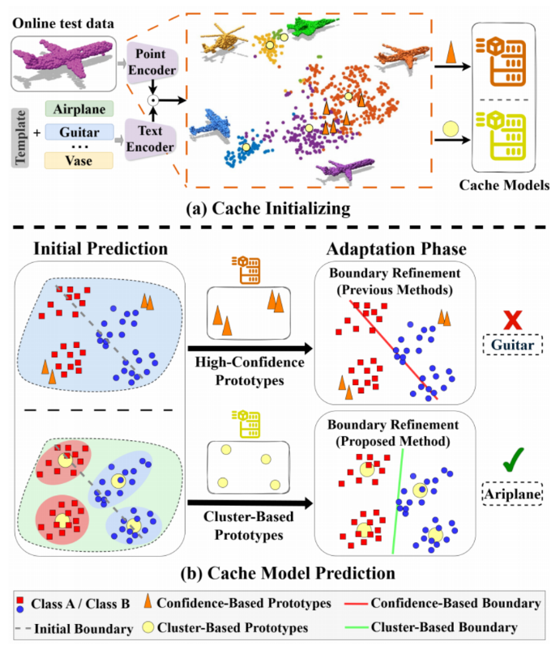
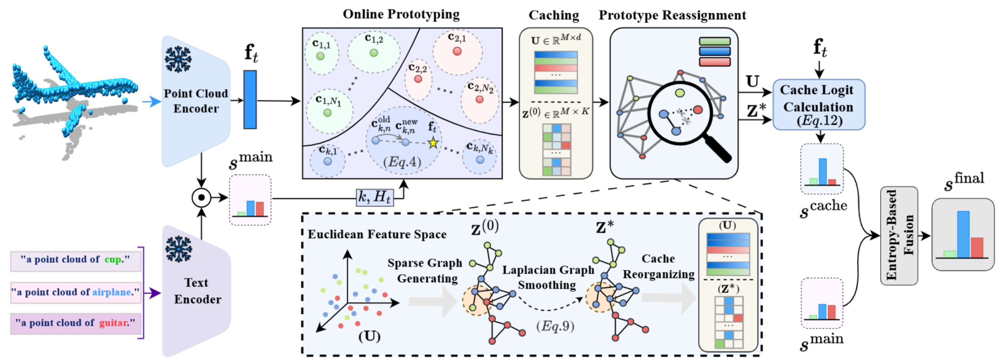
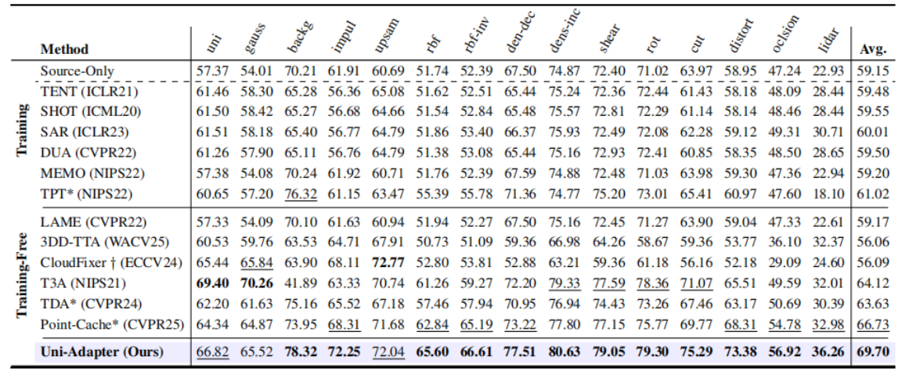
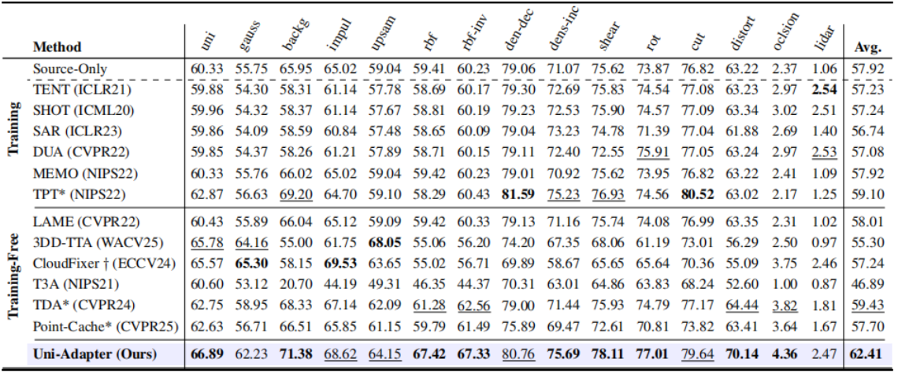
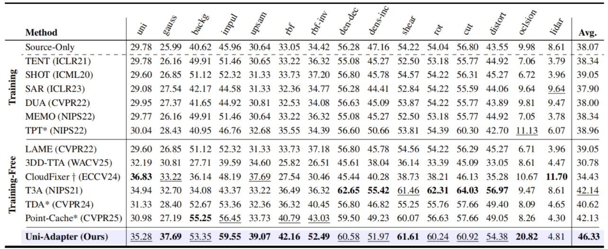
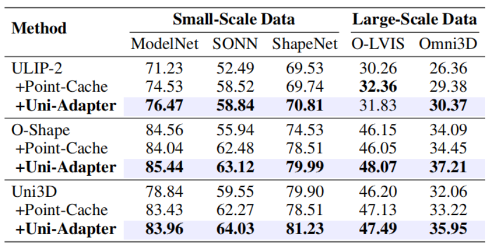
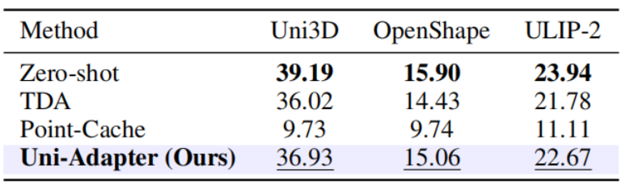
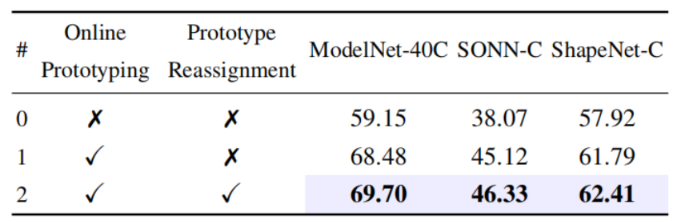
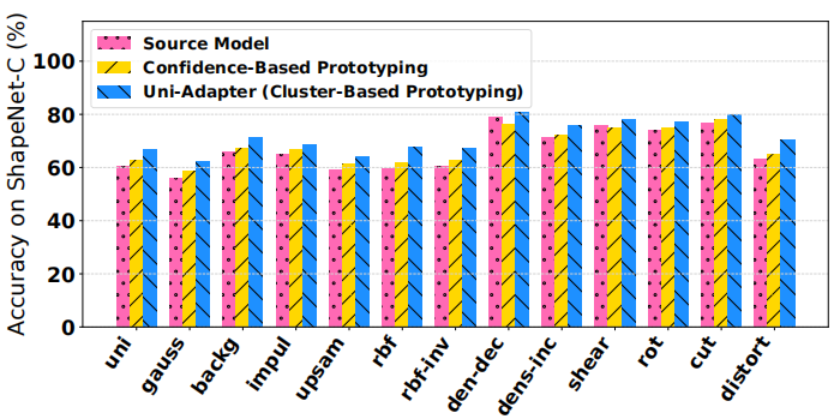
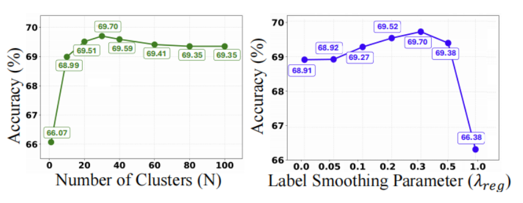

# Adapt-As-You-Walk Through the Clouds: Training-Free Online Test-Time Adaptation of 3D Vision-Language Foundation Models

### Abstract

​		**三维视觉-语言基础模型** (3D Vision-Language Foundation Models, VLFMs) 在开放世界的**点云处理** (point cloud processing) 任务中展现出了强大的泛化能力与**零样本识别** (zero-shot recognition) 能力。然而，在数据存在噪声、不完整，或采自与训练数据不同分布的实际场景中，其性能往往会显著下降。为了应对这一挑战，我们提出了 Uni-Adapter，这是一种基于**动态原型学习** (dynamic prototype learning) 的、用于三维视觉-语言基础模型的新型免训练**在线测试时自适应** (online test-time adaptation, TTA) 策略。Uni-Adapter 维护了一个`三维缓存`，用于存储特定类别的聚类中心作为原型，这些原型会被持续更新，以捕获异构数据分布下的**类内变异性** (intra-class variability)。这些动态原型作为锚点，通过相似度打分进行基于缓存的**对数几率计算** (logit computation)。同时，一个基于图的**标签平滑** (label smoothing) 模块对原型间的相似度进行建模，以在相关原型之间强制保持标签一致性。最后，来自原始三维视觉-语言基础模型和优化后三维缓存的预测结果通过`熵权聚合` (entropy-weighted aggregation) 进行统一，以确保可靠的自适应。在无需重新训练的情况下，Uni-Adapter 有效缓解了**分布偏移** (distribution shifts)，并在多种三维视觉-语言基础模型的多个三维基准测试中取得了最先进的性能——相比源三维视觉-语言基础模型，其在 ModelNet-40C 上提升了 10.55%，ScanObjectNN-C 上提升了 8.26%，ShapeNet-C 上提升了 4.49%。

Code：https://mehran-tam.github.io/Uni-Adapter/

### Introduction

​		诸如 Uni3D (Zhou et al. 2024) 等**三维视觉-语言基础模型** (3D Vision-Language Foundation Models, VLFMs) 在多模态点云处理任务中展现出了非凡的潜力。这些模型在网络规模的文本-图像-点云三元组上进行预训练，在一个共享的嵌入空间中学习**跨模态表示** (cross-modal representations)，从而实现了对新颖点云类别的**零样本识别** (zero-shot recognition)。尽管这些模型能力强大，但 VLFMs 在真实世界场景中仍面临着严重的局限性，在这些场景中，由于传感器限制和环境因素，获取的点云往往存在严重的噪声、稀疏性和低分辨率问题。**域适应** (domain adaptation) 和**泛化** (generalization) 旨在通过弥合源域和目标域之间的差距来解决这些**分布偏移** (distribution shifts) 问题。

​		在现有的 VLFMs 自适应方法中，**测试时自适应** (test-time adaptation, TTA) (Sharifdeen et al. 2025; Karmanov et al. 2024; Huang et al. 2025) 提供了一种特别高效的解决方案，它不需要带标签的目标数据，同时能够对未见过的条件进行动态调整。现有的针对 VLFMs 的 TTA 方法可以大致分为**基于训练的** (training-based) 和**免训练的** (training-free) 方法。基于训练的 TTA 方法通过在测试时更新模型参数的子集 (Osowiechi et al. 2024) 或**软提示** (soft prompts) (Shu et al. 2022; Yoon et al. 2024; Sharifdeen et al. 2025) 来适应目标域。这些方法通常优化诸如跨测试样本增强视图的**预测熵最小化** (prediction entropy minimization) 等目标 (Shu et al. 2022)，或使用额外的辅助损失 (Sharifdeen et al. 2025) 来引导自适应。虽然这些方法在减少域偏移方面是有效的，但它们通常需要迭代的**反向传播** (backpropagation)，这使得它们的计算成本很高，不太适合实时部署。相比之下，免训练的 TTA 方法，例如最近基于缓存的方法 (Karmanov et al. 2024; Sun et al. 2025)，通过动态缓存高置信度特征来避免参数微调。这些嵌入通过特征相似度来优化预测，从而为实时和流式场景提供轻量级、可扩展的自适应能力。

​		虽然主要为二维视觉-语言基础模型 (Radford et al. 2021a) 设计，但基于缓存的策略在三维视觉-语言基础模型中的探索仍然不足，目前只有少数为设计有效缓存模块的早期尝试。最近，Point-Cache (Sun et al. 2025) 引入了一种用于三维视觉-语言基础模型的 TTA 框架，提出了一种由全局和局部缓存组成的**双缓存结构** (dual-cache structure)。这两种缓存都是基于高置信度测试样本构建的，假设这些样本足以充分代表完整的数据分布。然而，这种假设在实际应用中往往不成立——尤其是对于三维数据——其中每个语义类别都能表现出显著的**结构多样性** (structural diversity)。如图 1(a) 所示，对应于单个类别（例如“飞机”）的特征在特征空间中形成了多个不同的簇，反映了不同的结构模式。因此，高置信度原型通常只能捕获这些变化的一个子集，导致次优的自适应性能。图 1(b) 的上半部分展示了这种局限性，其中缓存的**高置信度原型** (high-confidence prototypes)（三角形标记）导致了不正确的决策边界。

`图1：(a) ModelNet40-C 中飞机类别的 Uni3D 嵌入 (Embeddings) 的 t-SNE 结果显示出明显的类内聚类 (Intra-class Clustering) 模式。基于置信度的原型 (Confidence-based Prototypes)（三角形）仅缓存高置信度样本，而基于聚类的原型 (Cluster-based Prototypes)（圆形）通过在线聚类 (Online Clustering) 来表示分布模式 (Distribution Modes)。(b) 在简单示例 (Toy Example) 中，由于对模式的覆盖不足，基于置信度的缓存会导致错误的边界，而基于聚类的缓存能够捕获多样化的模式并实现正确的预测。`

​		为了克服以往基于置信度的缓存策略的局限性，我们提出了 Uni-Adapter（统一三维适配器），这是一种用于三维视觉-语言基础模型的新型在线 TTA 框架。我们的方法采用了一种`基于聚类的缓存策略`，该策略动态地存储和更新聚类中心，确保对底层特征分布的全面覆盖。图 1(b) 的下半部分对该设计进行了可视化，其中黄色圆形标记表示用作原型的缓存聚类中心。这些原型提供了对分布更真实的表示，从而实现了改进的亲和度计算和更鲁棒的自适应。

​		为了在测试时设置中实现基于聚类的原型学习，我们采用了一种**在线聚类策略** (online clustering strategy)，其中不断到达的测试样本增量式地更新特定类别的聚类中心，并以此作为原型。每个类别在一个统一的缓存中维护多个基于聚类的原型，确保全面覆盖多样化的数据分布模式。该策略捕获了`类内变异性`，并防止了对少数主导模式的过度依赖。此外，我们观察到现有的基于缓存的模型性能会受到**噪声伪标签** (noisy pseudo-labels) 的影响，这使得被错误分类的样本污染了缓存。为了解决这个问题，我们在缓存的原型上构建了一个相似度图，并应用**基于图的标签平滑** (graph-based label smoothing) 来优化它们的标签。这使得标签能够在相似的原型之间进行有效传播，从而减轻了噪声伪标签的影响，并产生了一个更可靠、更具适应性的缓存。我们使用**共轭梯度法** (conjugate gradient method) 来求解由此产生的**拉普拉斯系统** (Laplacian system)，因为它对于大型稀疏系统具有很高的效率和可扩展性。最后，我们使用**熵驱动的置信度加权** (entropy-driven confidence weighting) 来融合原始的三维视觉-语言基础模型得分和三维缓存的对数几率，从而得出最终预测。

​		`总结` 所提出方法的贡献如下：1) 我们引入了一种`基于聚类的缓存策略`，该策略对每个类别使用多个聚类中心来捕获类内变异性，从而实现对多样化测试分布的自适应。2) 我们在缓存原型上应用`基于图的标签平滑`，利用原型间的相似度来优化噪声伪标签，并改善在分布偏移下基于缓存的自适应。3) 我们在不同三维视觉-语言基础模型和多样化的基准测试上进行了广泛的实验以验证我们的方法——包括 ShapeNet-C (Mirza et al. 2023)、ModelNet-40C (Sun et al. 2022) 和 ScanObjectNN-C (Mirza et al. 2023) 等受损数据集，以及干净的数据集（大规模和小规模）——取得了新的最先进结果。

### Related Work

​		**3D视觉-语言基础模型** (**3D Vision-Language Foundation Models**, 3D VLFMs) 通过将来自大规模图像-文本数据集的语义表示与3D数据联系起来，在推进点云理解方面展示了变革性的潜力 (Zhu et al. 2023; Chen et al. 2023; Xue et al. 2024)。例如，Uni3D (Zhou et al. 2024)、ULIP (Xue et al. 2023)、ULIP-2 (Xue et al. 2024) 和 OpenShape (Liu et al. 2023) 在成对的图像、文本和点云数据的海量数据集上采用**对比学习** (**Contrastive Learning**)，以实现鲁棒的**跨模态特征对齐** (**Cross-modal Feature Alignment**)。这些预训练的 3D VLFMs 在多项任务中展现出强大的零样本能力和几何语义感知能力。然而，它们的性能通常会受到**域鸿沟** (**Domain Gaps**) 的阻碍，从而限制了其向真实世界和动态场景的泛化。(跨域迁移问题)

​		**测试时适应** (**Test-Time Adaptation**, TTA) 侧重于将模型预测动态适应到新颖域，而无需目标域标注或访问源数据 (Niu et al. 2023; Boudiaf et al. 2022)。早期的 TTA 方法专为纯视觉模型设计，在推理过程中通过**事后正则化** (**Post-hoc Regularization**) 来适应参数。例如，TENT (Wang et al. 2020)、SHOT (Liang, Hu, and Feng 2020) 和 MEMO (Zhang, Levine, and Finn 2022) 通过最小化 softmax 预测分布的熵来提升模型置信度以及对下游域的泛化能力。随着 VLFMs 的发展，最近的 TTA 方法利用文本模态来增强泛化能力。TPT (Shu et al. 2022) 和 DiffTPT (Feng et al. 2023) 将熵最小化与为每个测试样本**微调** (**Fine-tuning**) 一个**可学习提示** (**Learnable Prompt**) 结合起来。SCAP (Zhang et al. 2025) 则同时优化图像和文本提示以用于 TTA。虽然有效，但这些方法在测试时需要昂贵的**梯度反向传播** (**Gradient Backpropagation**)。相比之下，TDA (Karmanov et al. 2024)、COSMIC (Huang et al 2025) 和 PointCache (Sun et al. 2025) 使用缓存的高置信度原型，通过基于相似度的评分来细化 VLFM 预测。然而，仅仅依赖高置信度样本可能会遗漏分布模式，并且嘈杂的原型会导致次优的性能。

​		**测试时点云适应** (**Test-Time Point Cloud Adaptation**) 在提高跨任务 3D 点云分析的泛化能力方面获得了极大的关注，这些任务包括识别 (Sun et al. 2025; Wang et al. 2024; Shim, Kim, and Yang 2024)、分割 (Zhao et al. 2025; Zou et al. 2024)、配准 (Hatem, Qian, and Wang 2023)、目标检测 (Lin et al. 2024; Chen et al. 2024; Yuan et al. 2024) 以及场景补全 (Jang et al. 2025)。这些方法可以分为两个不同的组别。第一组修改模型参数并在推理过程中采用训练。例如，MATE (Mirza et al. 2023) 通过**自训练** (**Self-training**) 调整编码器参数，而 Bahri 等人 (Bahri et al. 2025) 使用 TENT (Wang et al. 2021) 调整**归一化层** (**Normalization Layers**)。第二组采用避免参数更新的方法。具体而言，BFTT3D (Wang et al. 2024) 使用**非参数适配器** (**Non-parametric Adapter**) 集成源表示，而 CloudFixer (Shim, Kim, and Yang 2024) 和 3DD-TTA (Dastmalchi et al. 2025) 通过由**扩散模型** (**Diffusion Models**) 引导的几何变换来适应输入点云。然而，这些方法通常是为小规模模型设计的，在应用于大型多模态 3D 模型时面临挑战。与我们工作密切相关的 PointCache (Sun et al. 2025)，使用由高置信度预测构建的全局和局部缓存来适应 VLFMs，并应用 $k$-means 来总结局部块特征。相比之下，我们的 Uni-Adapter 在`类别级别`执行在线的、**置信度加权聚类** (Confidence-weighted Clustering)，以捕获 3D 数据中多样的分布模式。

### Proposed Method

#### Background

​		**3D视觉-语言基础模型** (**3D VLFMs**) (Xue et al. 2024; Liu et al. 2023; Zhou et al. 2024) 使用独立的编码器将点云、图像和文本映射到一个共享的、对齐的特征空间中。一个文本编码器 $E_T$，通常基于 CLIP (Radford et al. 2021b)，用于编码类别提示，而一个基于 Transformer 的点编码器 $E_P$，通过适配一个**点分词器** (**Point Tokenizer**)，用于编码 3D 点云。在零样本分类中，一个通用的提示 $r=\text{“a point cloud of a”}$ 会被前置到第 $i$ 个类别名称 $y_i\in\mathcal{Y}$ 之前，其中 $\mathcal{Y}=\{y_1,\dots,y_K\}$ 表示包含 $K$ 个类别名称的集合。生成的文本输入 $\{r,y_i\}$ 被编码为 $w_i=E_T(\{r,y_i\})\in\mathbb{R}^d$，其中 $d$ 是嵌入维度。给定一个点云 $X\in\mathbb{R}^{L\times3}$，其嵌入 $f=E_P(X)\in\mathbb{R}^d$ 通过**余弦相似度** (**Cosine Similarity**) 与 $w_i$ 进行比较，给出的概率分布如下所示：
$$
p(y_i|X)=\frac{\exp(sim(w_i,f)/\tau)}{\sum_{j=1}^K\exp(sim(w_j,f)/\tau)} \tag1
$$
其中 $sim(\cdot,\cdot)$ 表示余弦相似度，$\tau$ 是控制分布锐度的**温度参数** (**Temperature**)。

#### Uni-Adapter Method

​		所提方法的整体框架如图2所示。它将点云到文本比较的相似度得分与来自缓存模型的得分进行融合。缓存模型使用一个**在线原型构建** (**Online Prototyping**) 模块来学习 3D 原型，并通过**原型重分配** (**Prototype Reassignment**) 模块动态地修正嘈杂的原型分配。然后，它基于输入点云表示与存储的原型之间的**亲和度** (**Affinity**) 来计算缓存得分。最后，基于预测的**熵** (**Entropy**) 对这些得分进行统一，以获得最终的相似度得分。接下来的各节将对每个组件进行详细描述。

`图2：方法概述。`给定一个测试点云 $X_t \in \mathbb{R}^{L \times 3}$，我们的方法通过点云编码器提取点云特征 $f_t$。3D缓存通过在线原型构建进行更新，其中聚类中心作为3D原型。原型重分配 (Prototype Reassignment) 模块细化这些原型，并计算它们与 $f_t$ 的亲和度以获得 $s^{cache}$。最后，通过使用`熵驱动的置信度加权` 融合 $s^{cache}$ 和模型的基础输出 $s^{main}$，获得预测逻辑值 $s^{final}$。

#### Online Prototyping Module

​		我们采用了一种在线聚类策略，称为在线原型构建 (Online Prototyping)，以动态捕获数据分布的多样化模式。该模块增量式地更新一组特定类别的原型。其目标是将每个输入的点云特征与一个具有代表性的原型相关联，并对其进行相应的更新。

​		在时间步 $t$，点云 $X_t$ 被编码为 $f_t = E_P(X_t) \in \mathbb{R}^d$。我们首先通过计算 $f_t$ 与类别嵌入 $\{w_i\}_{i=1}^K$ 之间的余弦相似度来预测类别 $k$：
$$
s_i^{main} = sim(w_i, f_t), \quad k = \arg\max_i s_i^{main}. \tag2
$$
每个类别 $k$ 最多维护 $N$ 个原型，记为 $\{c_{k,j} \in \mathbb{R}^d\}_{j=1}^{N_k}$，其中 $N_k \le N$。给定预测类别 $k$，我们选择最相似的原型：
$$
n = \arg\max_{1 \le j \le N_k} sim(f_t, c_{k,j}). \tag3
$$
如果存在空槽位 ($N_k < N$)，则用 $f_t$ 对其进行初始化。否则，使用置信度加权移动平均 (Confidence-weighted Moving Average) 更新选定的原型 $c_{k,n}$：
$$
c_{k,n}^{new} = \frac{\alpha_t f_t + b_{k,n} \alpha_{k,n} c_{k,n}^{old}}{\alpha_t + b_{k,n} \alpha_{k,n}}, \tag4
$$
其中 $b_{k,n}$ 是该原型过去的更新次数，$\alpha_t$ 和 $\alpha_{k,n}$ 分别是输入样本和缓存原型的置信度得分。这些得分从预测熵推导得出：
$$
\alpha_t = \exp(-\beta \cdot H_t), \quad \alpha_{k,n} = \exp(-\beta \cdot H_{k,n}), \tag5
$$
其中 $\beta$ 是一个缩放因子，$H_t$ 和 $H_{k,n}$ 表示在与文本嵌入的相似度上计算 softmax 得到的熵。具体而言，$H_t$ 由特征 $f_t$ 计算得出，$H_{k,n}$ 由原型 $c_{k,n}$ 计算得出，两者均通过与 $\{w_i\}_{i=1}^K$ 进行比较来计算。

#### Prototype Reassignment Module

​		虽然在线原型构建保持了具有代表性的原型，但它对嘈杂的伪标签仍然很敏感。为了提高标签的可靠性，我们引入了一个原型重分配模块，该模块通过**图正则化** (**Graph-based Regularization**) 在相似的原型之间平滑伪标签。为了基于语义关系细化伪标签，我们需要两个组件：(1) 一个捕获原型之间关系的相似度矩阵；(2) 待更新的初始**软伪标签** (**Soft Pseudo-labels**)。这些由模型在类别逻辑值上的 softmax 概率给出的软伪标签被存储在 $Z^{(0)} \in \mathbb{R}^{M \times K}$ 中，其中每一行对应一个原型并包含其类别概率。

​		令 $M = \sum_{k=1}^K N_k$ 表示所有类别中活跃原型的总数，其中 $N_k \le N$ 是类别 $k$ 的原型数量。我们将所有原型特征收集到一个矩阵 $U = [c_{1,1}; \dots ; c_{K,N_K}] \in \mathbb{R}^{M \times d}$ 中，其中每一行是一个**$\ell_2$归一化** (**$\ell_2$-normalized**) 的原型。相似度矩阵计算如下：
$$
A = UU^\top \in \mathbb{R}^{M \times M} \tag6
$$
​		我们应用一个阈值 $\gamma \in [0, 1]$ 来移除弱连接，并通过将低于 $\gamma$ 的值置零来获得一个稀疏矩阵 $\hat{A}$。由 $\hat{A}$，我们计算**度矩阵** (**Degree Matrix**) $D$，这是一个对角矩阵，其每个对角元素 $D_{mm}$ 是 $\hat{A}$ 中第 $m$ 行的总和。**归一化图拉普拉斯矩阵** (**Normalized Graph Laplacian**) 随后表示为：
$$
L_{norm} = I - D^{-1/2}\hat{A}D^{-1/2} \tag7
$$
这种细化被公式化为以下优化问题：
$$
Z^* = \arg \min_Z \|Z - Z^{(0)}\|_F^2 + \lambda_{reg} \cdot Tr(Z^\top L_{norm} Z) \tag8
$$
其中 $\lambda_{reg} > 0$ 用于平衡对初始预测的保真度与整个图上的标签平滑度。该目标函数具有一个**闭式解** ：
$$
Z^* = (I + \lambda_{reg} L_{norm})^{-1} Z^{(0)} \tag9
$$
最后，我们通过保留每一行中的最大元素，将 $Z^*$ 转换为一个**独热标签矩阵** (**One-hot Label Matrix**)：
$$
Z^*_{m,\hat{i}} = \begin{cases} 1 & \text{if } \hat{i} = \arg \max_i Z^*_{m,i}, \\ 0 & \text{otherwise} \end{cases} \quad \text{for } m = 1, \dots, M. \tag{10}
$$
需要注意的是，为了减少计算开销 ($\mathcal{O}(M^3)$)，我们使用**共轭梯度法** (**Conjugate Gradient Method**) (Hestenes, Stiefel et al. 1952) 来求解公式 9，这会将复杂度降低到 $\mathcal{O}(\rho \cdot nnz(L_{norm}))$，其中 $\rho$ 是迭代次数，$nnz(\cdot)$ 表示非零元素的数量。

#### Cache Logit Calculation

​		每个原型现在都有一个编码在 $Z^* \in \{0, 1\}^{M \times K}$ 中的**独热类别标签** (**One-hot Class Label**)。给定一个输入特征 $f_t \in \mathbb{R}^d$，我们计算它与所有原型的余弦相似度为：$U f_t \in \mathbb{R}^M$。为了确保相似度得分不受每个类别分配的原型数量影响而产生偏差，我们按分配给每个类别的原型总数进行归一化。具体而言，我们计算一个对角归一化矩阵：
$$
\Lambda = \text{diag}\left(\left(\frac{1}{\sum_{m=1}^M Z^*_{m,i}}\right)_{i=1}^K\right) \in \mathbb{R}^{K \times K}, \tag{11}
$$
其中第 $i$ 个对角元素通过相关联的原型数量，对类别 $i$ 的总相似度进行重新缩放。随后计算基于缓存的逻辑值为：
$$
s^{cache} = \Lambda Z^{*\top} (U f_t) \in \mathbb{R}^K. \tag{12}
$$
这得出了 $f_t$ 与原型之间按类别计算的平均相似度。生成的 $s^{cache}$ 将与主逻辑值融合，以实现稳健的分类。

#### Entropy-Based Fusion

我们通过融合源 VLFM 和缓存模型的逻辑值，将它们的预测结合起来。该融合使用基于熵的加权来执行：
$$
s^{final} = \frac{H_{cache} \cdot s^{main} + H_t \cdot s^{cache}}{H_{cache} + H_t}. \tag{13}
$$
这里，$H_t$ 和 $H_{cache}$ 分别是主逻辑值和缓存逻辑值经过 softmax 处理后的熵。该融合根据各自的置信度自适应地对每个源进行加权，更倾向于采用更为确定的那一种模态。

### Experiments

#### Experimental Setup

​		`数据集` 我们使用 ModelNet-40C (Sun et al. 2022)、ShapeNet-C (Mirza et al. 2023) 和 ScanObjectNN-C (Mirza et al. 2023) 在分布偏移下评估我们的方法，这些数据集引入了 15 种类型的**合成破坏** (**Synthetic Corruptions**)，包括密度变化、噪声和几何变换，每种破坏有 5 个**严重程度级别** (**Severity Levels**)。为了进一步评估在未知数据上的泛化能力，我们在 ModelNet40 (Wu et al. 2015)、ShapeNetCore-v2 (Chang et al. 2015) 和 ScanObjectNN (Uy et al. 2019) 的测试集，以及如 OmniObject3D (Wu et al. 2023)（216个类别）和 Objaverse-LVIS (Deitke et al. 2023)（1,156个类别）等大规模 3D 数据集上进行了实验，旨在评估跨不同类别的泛化能力。

​		`基线方法` 为了评估我们的 Uni-Adapter 并确保公平比较，我们实现了涵盖免训练和基于训练的 TTA 方法的 12 种不同的**基线方法** (**Baselines**)。具体而言，我们评估了 TENT (Wang et al. 2020)、SHOT (Liang, Hu, and Feng 2020)、SAR (Niu et al. 2023)、DUA (Mirza et al. 2022)、MEMO (Zhang, Levine, and Finn 2022)、LAME (Boudiaf et al. 2022)、T3A (Iwasawa and Matsuo 2021)、CloudFixer (Shim, Kim, and Yang 2024)、3DD-TTA (Dastmalchi et al. 2025)、TPT (Shu et al. 2022)、TDA (Karmanov et al. 2024) 和 Point-Cache (Sun et al. 2025)。虽然 CloudFixer、3DD-TTA 和 Point-Cache 是专为 3D 点云设计的，但其余方法源自 2D 领域并被调整用于 3D 数据。对于 CloudFixer，我们仅使用其生成模型和引导，而不更新源模型，记为 CloudFixer †。请注意，TPT 和 TDA 是专门为 2D VLFMs 开发的，而 Point-Cache 则是原生为 3D VLFMs 构建的。

​		`实现细节` 我们使用 ULIP-2 (Xue et al. 2024)、OpenShape (Liu et al. 2023) 和 Uni3D-Large (Zhou et al. 2024) 作为 3D VLFMs。测试时适应在单个样本上进行。对于基于图的标签平滑，我们将**稀疏度阈值** (**Sparsity Threshold**) 设定为 $\gamma = 0.5$，以保留邻接矩阵中的强相关性，并将**置信度衰减参数** (**Confidence Decay Parameter**) 设定为 $\beta = 10$，以便在更新聚类中心时平衡多样性与置信度。每个目标样本包含 1024 个点，但 Objaverse-LVIS 包含 10,000 个点。所有实验均在单张 NVIDIA RTX 4090 GPU 上使用第 5 级破坏严重程度进行。

### Results

​		`对抗分布偏移的鲁棒性` 我们在 ModelNet-40C（表1）和 ShapeNet-C（表2）上跨多种破坏类型评估了 Uni-Adapter。虽然大多数从 2D 领域调整而来的基于训练的基线方法仅显示出微小的收益，但诸如 T3A、TDA 和 Point-Cache 等方法产生了相对更强的改进。我们还观察到，尽管 3D 输入适应方法 (Shim, Kim, and Yang 2024; Dastmalchi et al. 2025) 解决了特定类型的破坏，但它们在新型测试实例上的部署可能会引入过多的**生成误差** (**Generation Errors**) 以及与源域的更大偏差，最终放大分布偏移。此外，专为 VLFMs 设计的方法在缩小**模态鸿沟** (**Modality Gaps**) 方面展现出更强的能力。虽然像 T3A、TDA 和 Point-Cache 这样的测试时方法在 ModelNet-40C 上优于传统的 2D 基线，但 Uni-Adapter 超越了所有替代方案，特别是在显著的域偏移下，改进达到了 $10.55\%$。在更具多样性的 ShapeNet-C 基准测试上（其特征是更高的类内方差），仅依赖高置信度样本的方法（例如 T3A、Point-Cache）会导致次优的泛化或性能下降。相比之下，Uni-Adapter 通过整合置信度和多样性，有效地缓解了这些挑战，并将源模型性能提高了 $4.49\%$。

`表1：使用 Uni3D-Large (批大小 = 1) 在分布偏移下 ModelNet40-C 的 Top-1 准确率 (%)。Source-Only 显示未进行适应的性能。最佳和次佳结果分别用粗体和下划线标出。* 表示基于 VLFM 的 TTA 方法。`

`表2：使用 Uni3D-Large (批大小 = 1) 在分布偏移下 ShapeNet-C 的 Top-1 准确率 (%)。Source-Only 显示未进行适应的性能。最佳和次佳结果分别用粗体和下划线标出。* 表示基于 VLFM 的 TTA 方法。`

​		`在严重分布偏移下的有效性` 为了进一步评估我们的 Uni-Adapter 的鲁棒性，我们在 ScanObjectNN-C（ScanObjectNN 的一个具有挑战性的变体）上进行了实验。ScanObjectNN 由真实世界的 3D 扫描组成，通常包含**背景杂波** (**Background Clutter**) 和**局部观测** (**Partial Observations**)。ScanObjectNN-C 引入了额外的破坏以模拟更严重的真实世界干扰。如表3所示，我们的方法比源模型高出 $8.26\%$，在面对显著的分布偏移时展现出很强的泛化能力，以及对真实世界 3D 破坏的鲁棒性。

`表3：使用 Uni3D-Large (批大小 = 1) 在 ScanObjectNN-C 上的 Top-1 准确率 (%)。* 表示基于 VLFM 的 TTA。Source-Only 显示未进行适应的性能。最佳和次佳结果分别用粗体和下划线标出。`

​		`泛化能力` Uni-Adapter 在不同规模的未见过的、未被破坏的数据集上展示了卓越的泛化能力（见表4）。在三个小规模数据集——ModelNet、ScanObjectNN 和 ShapeNet——上，Uni-Adapter 优于 Point-Cache，提高了所有三个源 3D VLFMs 的性能，并确立了新的最先进基线。在包括 OmniObject3D 和 Objaverse-LVIS 在内的大规模 3D 基准测试上（这些测试具有多样化和真实的物体类别谱），Uni-Adapter 始终产生绝对的性能收益。

`表4：Uni-Adapter 在跨干净数据集的 3D VLFMs 上的性能 (批大小 = 1)。Objaverse-LVIS 使用 10,000 个点；其余使用 1,024 个点。SONN 代表 ScanObjectNN。`

​		`推理效率` 我们在 ModelNet40 数据集上评估了 Uni-Adapter 的**推理吞吐量** (**Inference Throughput**)，其中吞吐量 ($t/s$) 指的是每秒处理的测试实例数量。表5显示，与零样本推理相比，Uni-Adapter 引起的吞吐量下降较小。这种**开销** (**Overhead**) 主要是由于在线原型构建、原型重分配和逻辑值计算中涉及的额外操作引起的。这些发现突显出 Uni-Adapter 是一种更高效的方法，相对于其他基于缓存的基线方法，以最小的计算开销实现了显著的准确率提升。

`表5：在 ModelNet40-C (批大小 = 1) 上 3D VLFMs 与缓存基线方法的吞吐量 (t/s) 比较。结果为在 RTX 4090 GPU 上测试样本的平均值。`

### Ablation Study

​		`Uni-Adapter 不同组件的有效性` 表6评估了 Uni-Adapter 各组件的有效性。从仅包含在线原型构建（第1行）作为唯一组件开始，我们观察到在所有基准测试中均比源模型（第0行）有显著提升。在第2行中，添加原型重分配进一步缩小了性能差距，将 ModelNet-40C 提升了 $1.22\%$，在其他数据集上也有类似的趋势。通过利用**动态邻接图** (**Dynamic Adjacency Graph**) 中的相关特征，该模块细化了伪标签，缓解了不一致性，并动态地纠正了错误。原型重分配模块通过采用在稀疏系统上快速收敛的共轭梯度求解器，引入了可以忽略不计的开销。

`表6：Uni-Adapter 组件消融实验 (Ablation)。指标：Top-1 准确率；#0 是未进行适应的源模型。`

​		`基于聚类的缓存与基于置信度的缓存对比` 我们通过将用于学习 3D 原型的在线聚类策略与仅保留最高置信度原型的基于置信度的缓存进行比较，评估了前者的有效性。将 Uni-Adapter 中基于聚类的缓存替换为基于置信度的方法后，我们观察到在 ShapeNet-C 数据集的各种破坏类型中，前者始终优于后者（图3）。这一改进表明，在线聚类生成了更多样化的原型，并更好地捕获了潜在的数据分布模式，从而产生了更稳健的**决策边界** (**Decision Boundary**)。

`图3：Uni-Adapter 在 ShapeNet-C 上基于聚类与基于置信度缓存的对比。基于聚类的缓存通过捕获多样的模式获得了更高的准确率，而基于置信度的缓存则遗漏了大量的类别分布。`

​		`聚类中心的数量` 图4展示了选择合适的聚类中心数量的影响。聚类过少无法代表类别分布，并限制了需要充足特征的原型重分配模块的有效性。聚类过多会引入噪声，削弱基于置信度的聚类。我们的发现表明，大小为 30 的缓存平衡了多样性和置信度，其权衡由**置信度衰减超参数** (**Confidence Decay Hyperparameter**) $\beta$ 控制。

​		`基于图的标签平滑` 我们说明了基于图的标签平滑参数 $\lambda_{reg}$ 对 Uni-Adapter 性能的影响（图4）。将 $\lambda_{reg}$ 从 0 到 1 变化可控制细化强度。当 $\lambda_{reg}$ 接近 0 时，平滑效果变得可以忽略不计，导致伪标签的细化极小化以及性能下降。这强调了我们的原型重分配组件在增强适应性方面的重要性。相反，增加 $\lambda_{reg}$ 会增强细化，但可能会过度平滑标签，从而削弱它们的原始影响力。我们发现 $\lambda_{reg} = 0.3$ 平衡了有效的平滑与标签的完整性。

`图4：针对 ModelNet-40C 的聚类中心数量` ($N$) 和标签平滑参数 ($\lambda_{reg}$)

### Conclusion

​		`结论` 在本文中，我们介绍了 Uni-Adapter，这是一种专为 3D 视觉-语言基础模型 (VLFMs) 量身定制的新型免训练测试时适应框架。与以往基于置信度的方法不同，Uni-Adapter 利用基于聚类的原型来捕获 3D 数据中存在的**多模式分布** (**Multiple Mode Distribution**)，从而实现对真实世界变化更准确、更鲁棒的适应。通过结合在线原型构建、基于图的原型重分配以及熵加权融合，我们的方法有效地缓解了嘈杂伪标签的挑战，并保持了跨不同目标域的语义一致性。大量实验表明，Uni-Adapter 在 3D VLFMs 的测试时性能方面确立了新的最先进水平，为动态和资源受限的环境提供了一种高效的解决方案。然而，Uni-Adapter 在瞬态缓存初始化阶段面临性能不稳定的问题。未来的工作可能会结合使用对比损失或原型一致性目标的轻量级**自监督训练** (**Self-supervised Training**)，以提高原型稳定性和早期阶段的适应能力。

---

### 术语

`Point Tokenizer（点分词器）：` 借鉴自然语言处理中的 Tokenization 技术，将连续的 3D 空间坐标或点云集合切分成一个个离散的局部几何块（Patch 或 Token），以便输入到 Transformer 等基于注意力机制的序列模型中进行处理。

[通俗例子] 就像把一整块长得奇形怪状的积木打碎成一块块标准尺寸的乐高小方块，这样人工智能大模型才方便把它们拼装重组去理解整个物体的结构。

`Temperature（温度参数）：` 在 Softmax 函数中引入的一个超参数（即公式中的 $\tau$）。当温度较高时，输出的概率分布会更平缓，模型对各个类别的置信度趋于平均；当温度较低时，分布会更尖锐（锐度更高），放大最高相似度项的概率权重。

[通俗例子] 就像是调节考试评分的“手紧”或“手松”程度。温度高时，老师给分很宽容（大家分数差不多）；温度低时，稍微好一点的试卷就会被拉开巨大的分数差距，突出最优秀的那一个。

`noisy pseudo-labels(噪声伪标签)：` TTA阶段，模型面对的是未知的数据，他会对这个输入的点云做出预测，这个预测是自己给自己打上的，没有经过人工验证的标签，就叫伪标签。噪声伪标签，就是这个预测是错误的，模型猜错了。