# One Surrogate to Fool Them All: Universal, Transferable, and Targeted Adversarial Attacks with CLIP

## Abstract

​		**深度神经网络**（DNNs）已取得了广泛的成功，但仍然容易受到**对抗攻击**的影响 。通常，此类攻击要么涉及对目标模型的频繁**查询**，要么依赖于与目标模型密切镜像的**替代模型**——通常使用目标模型训练数据的子集进行训练——以通过**迁移性**实现高攻击成功率 。然而，在训练数据不可访问且过度查询可能引发警报的现实场景中，构建**对抗样本**变得更具挑战性 。在本文中，我们提出了 **UNIVINTRUDER**，这是一种新颖的攻击框架，仅依赖于单个公开可用的 **CLIP** 模型和公开可用的数据集 。通过利用**文本概念**，**UNIVINTRUDER** 生成**通用的**、**可迁移的**和**定向的对抗扰动**，误导 DNNs 将输入错误分类为由文本概念定义的、攻击者指定的类别 。我们的广泛实验表明，我们的方法在 ImageNet 上实现了高达 85% 的**攻击成功率**（ASR），在 CIFAR-10 上超过 99%，显著优于现有的**基于迁移的方法** 。此外，我们揭示了现实世界的漏洞，表明即使不查询目标模型，**UNIVINTRUDER** 也能攻陷像 Google 和百度这样的图像搜索引擎（ASR 率高达 84%），以及像 GPT-4 和 Claude-3.5 这样的**视觉语言模型**（ASR 率高达 80%）。这些发现强调了我们的攻击在传统途径受阻场景中的实用性，突显了重新评估人工智能应用中安全范式的必要性 。

`Keywords：`Transferable Adversarial Attacks, Universal Adversarial Attacks

## 1 Introduction

​		近年来，深度学习技术获得了极大的关注，特别是归功于**深度神经网络**（DNNs）在融入我们日常生活的广泛应用中取得的成功。尽管它们的能力令人印象深刻，但 DNNs 容易受到各种形式的**对抗攻击** [8, 22] 。这种易感性极大地阻碍了它们在**安全关键领域**的采用，例如**人脸识别** [2]、**自动驾驶** [24] 和**医学图像诊断** [36] 。

​		经典的**对抗攻击**包括**白盒**和**黑盒**策略，每种策略都面临着其自身的实际问题 。**白盒**方法假设完全了解模型参数和**梯度** [8, 22, 41]，从而能够实现精确的、针对特定输入的**扰动** 。相反，**黑盒**方法将模型视为一个**预言机**（Oracle），仅依赖于**查询** [12, 37, 38]，但通常需要 5,000 到 50,000 次查询才能成功实现**基于决策的定向对抗攻击** [37, 66] 。然而，在实践中，AI 服务提供商实施的严格访问控制和有限的**查询预算**，使得**白盒**和高查询量的**黑盒攻击**都变得不可行。

​		一个有前途的替代方案是**可迁移对抗攻击**，其中对手在**替代模型**上生成**扰动**，并期望它们能**迁移**到目标模型上 [28, 59, 65] 。然而，此类攻击面临两个主要的实际挑战。首先，获取合适的**替代模型**并非易事；大多数现有研究假设**替代模型**是在与目标模型相同的**数据集**上训练的 [17, 28, 42, 59, 61, 65]，这一条件在现实场景中很少满足。其次，为不同任务收集合适的**替代模型**需要大量的时间和资源，从而增加了攻击者的操作成本。不合适的**替代模型**会显著降低性能（例如，在某些情况下会下降 $40\%$ [17]）。同时，**通用模型**的出现提供了一个引人注目的替代方案：一个在各种任务中具有**零样本分类**能力的单一模型。这一观察引发了一个关键问题：能否仅使用一个针对各种任务的单一**通用模型**，开发出一种更实用的**可迁移对抗攻击**？

​		我们通过引入 **UNIVINTRUDER** 给出了肯定的回答，这是一个新颖的**对抗攻击框架**，它利用一个通用的**视觉-语言模型**（CLIP）[48] 和公开可用的视觉数据集来识别**通用的**、**可迁移的**和**定向的漏洞**。与之前需要访问目标数据集或其中一个目标模型的**可迁移攻击**不同，**UNIVINTRUDER** 可以在没有此类访问权限的情况下攻陷多个任务。在我们的**威胁模型**中，攻击者只需要指定一个**目标概念**（文本形式的目标类别）和**负概念**（文本形式的非目标类别）。根据这些文本输入，**UNIVINTRUDER** 生成一个**通用扰动**，迫使任意模型在看到该扰动时将图像**误分类**为指定的目标类别。如图 1 所示，**UNIVINTRUDER** 仅依靠**文本概念**，在没有直接访问任何网络的情况下，成功攻陷了各种网络。值得注意的是，现实世界的应用包括图像搜索服务、**视觉语言模型**和图像生成服务，所有这些都容易受到我们的攻击。

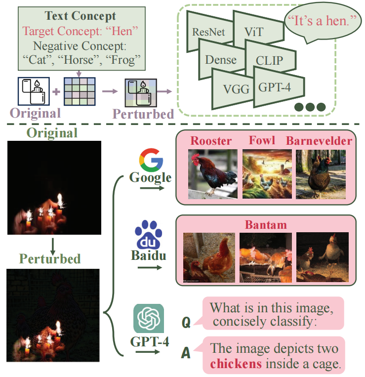

`图 1：借助 UnivIntruder 工具生成的对抗性扰动，可对各类实际应用造成误导。你可截取该图像的屏幕截图（确保分辨率至少为 256）进行验证。`

​		然而，即使使用像 CLIP 这样的公共**通用模型**，将**对抗扰动迁移**到未知的目标模型仍然具有挑战性。出现了三个核心挑战：1) **模型错位**（Model Misalignment）：CLIP 将图像与**文本嵌入**对齐以进行**开放集识别**，而许多目标模型是在预定义的类别集上执行**闭集分类**。简单地应用 CLIP 可能会忽略关于完整**类别空间**的关键信息。2) **数据集错位**（Dataset Misalignment）：与假设目标数据集可用的传统方法不同，**UNIVINTRUDER** 依赖于**公共分布外**（POOD）数据集，其特征可能与目标数据显著不同。天真地使用 POOD 数据可能会引入**固有偏差**并限制**迁移性**。3) **鲁棒攻击设计**（Robust Attack Design）：实现**鲁棒迁移**是很困难的，因为**对抗样本**往往会**过拟合**单个**替代模型**的结构和随机状态

​		为了解决这些问题，**UNIVINTRUDER** 包含三个关键创新：(a) 一个基于 CLIP 的**替代模型**，它结合了**目标文本概念**和**负文本概念**，使我们能够评估**扰动图像**被误分类为指定目标类别的可能性 。(b) 一个**特征方向**机制，它捕捉**扰动**如何移动 CLIP 的内部**特征**，从而抵消由 **POOD 数据集**引入的潜在偏差 。 (c) 一个**鲁棒随机可微变换**模块，包括尺度、旋转和位置的变化，这些变换对**学习目标**进行**正则化**并减少**过拟合** 。

​		我们进行了广泛的实验，以验证 **UNIVINTRUDER** 在四个常用数据集上的有效性：CIFAR-10、CIFAR-100、Caltech-101 和 ImageNet，涵盖了 85 个不同的模型 。我们的结果表明，**UNIVINTRUDER** 在使用这些数据集并在正常条件下训练的模型上，分别实现了高达 99.4%、98.19%、92.1% 和 85.1% 的令人印象深刻的**攻击成功率**（ASRs），超越了所有用于比较的**可迁移对抗攻击**基线 。此外，**UNIVINTRUDER** 成功攻击了各种现实世界的应用，包括图像搜索服务（Google、百度、淘宝、京东）、**视觉语言模型**（Claude-3.5 和 GPT-4o）以及图像生成服务（DALL·E 3 和 BindDiffusion），实现了高达 84% 的 **ASR** 。值得注意的是，在所有比较的基线方法中，**UNIVINTRUDER** 是唯一能够在这种多现实世界应用中实现如此高**迁移性**的方法 。此外，在**黑盒攻击**场景中，**UNIVINTRUDER** 可以与现有的攻击方法相结合，将所需的查询次数减少近 80% 。即使在 CLIP 不熟悉某些**文本概念**的情况下，**UNIVINTRUDER** 仍然可以使用每类少至四张图像作为**基于图像的概念**来执行成功的攻击（**ASR** 超过 90%）。

​		我们的贡献总结如下：

- 攻击场景：

  我们提出了一种仅由 CLIP 和基本文本概念驱动的通用的、可迁移的且定向的对抗攻击框架。值得注意的是，我们的方法不依赖于访问目标数据集或任何目标模型，从而极大地增强了对抗攻击在现实世界场景中的可行性。

- 系统设计：

  我们引入了 UNIVINTRUDER，它使用文本概念来构建一个与目标模型对齐的基于 CLIP 的替代模型。为了对抗来自公共分布外（POOD）数据集的偏差，UNIVINTRUDER 使用了一种新颖的特征方向方法，并应用随机可微变换来增强扰动迁移性和韧性。

- 实验验证：

  在 $4$ 个标准数据集上针对 $85$ 个模型以及现实世界应用（图像搜索、视觉语言模型、图像生成服务）进行的广泛评估表明，UNIVINTRUDER 始终能实现高攻击成功率 。此外，UNIVINTRUDER 在黑盒场景中将查询次数减少了高达 $80\%$，并扩展到了 CLIP 不熟悉特定文本概念的情况 。

## 2 Background and Related Work

### 2.1 Vision-Language Models (VLMs)

​		**视觉语言模型**（VLMs），例如 CLIP [48]，因其通过在大规模图像-文本对上进行**对比预训练**来学习视觉和文本**表示**而闻名。 在 CLIP 中，一个**文本编码器** $E_{T}(x)$ 和一个**图像编码器** $E_{I}(x)$ 被预训练以将文本与相应的图像进行匹配。CLIP 可以应用于诸如**零样本分类**之类的任务，其定义如下：
$$
F(x) = \text{argmax}_{y_k \in \{y_1, y_2, ..., y_N\}} \text{sim}(E_I(x), E_T(y_k))\tag{1}
$$
其中 $x$ 是图像输入，$\{y_{1}, y_{2}, ..., y_{N}\}$ 是不同类别的**文本标签**，而 $\text{sim}(\cdot, \cdot)$ 表示**余弦相似度** 。该方程比较输入图像和不同标签的**嵌入**，选择具有最高相似度的标签作为预测标签 。 由于 CLIP 是在数十亿个图像-文本对上预训练的，它可以在许多任务上以高精度执行**零样本分类** 。

​		在安全领域，VLM 也被用于许多攻击工作中 。然而，先前的工作要么攻击 VLM 本身 [19, 40, 64]，要么攻击其**下游应用** [4] 。相比之下，我们的**威胁模型**有显著不同，旨在利用**文本概念**和 VLMs 攻击针对特定任务的各种模型，即使这些**受害者模型**与 VLMs 无关。

### 2.2 Targeted Adversarial Attacks

​		机器学习中的**定向对抗攻击**涉及为模型构建输入，旨在使其预测特定的**目标类别** 。这些攻击利用了模型处理输入数据时的**漏洞**，导致错误的输出，而输入在**人类观察者**看来可能未发生变化。一个典型的**定向对抗攻击**可以形式化为 ：

$$
x^* = \arg \min_{x^*} (\ell(f(x^*), y_t)), \text{s.t.} \|x - x^*\| [cite_start]\le \epsilon\tag{2}
$$
其中 $x^*$ 是**对抗样本**，$\ell$ 是**损失函数**，而 $\epsilon$ 是**扰动强度约束**。$y_t$ 是**目标类别** 。各种形式的**对抗攻击**与我们的工作相关 。

#### 2.2.1 White-box Adversarial Attacks

​		**白盒对抗攻击**假设对**目标模型**拥有完全的了解，包括其**架构**、**参数**和**梯度** 。这种全面的访问权限允许攻击者通过直接优化**目标函数**来构建**扰动**，从而最大化**误分类** 。经典方法如**快速梯度符号法**（FGSM）[22] 和**投影梯度下降**（PGD）[41] 利用**梯度信息**来创建**扰动**，从而以最小的**失真**诱导极高的**攻击效能** 。像 **C&W 攻击** [8] 这样的高级方法优化了更复杂的**损失函数**，以绕过**防御机制** 。Agrawal 等人 [1] 提出了 M-SAN，这是一种在**黑盒设置**下的**基于补丁的可迁移攻击**，它使用**多堆叠对抗网络**来有效地攻击**人脸识别模型** 。**白盒攻击**作为评估**模型鲁棒性**的**基准**，由于其对模型信息的广泛访问，代表了**对抗脆弱性**的**上界** 。

#### 2.2.2 Decision-based Black-box Adversarial Attacks

​		**基于决策的黑盒对抗攻击**（Decision-based black-box adversarial attacks）在无法访问模型的**架构**、**参数**或**训练数据**的情况下运行 。相反，它们通常依赖**查询反馈**来构建**扰动** 。Liu 等人 [38] 介绍了一种方法，通过训练一个**替代模型**来模仿目标的**决策边界**，从而生成**对抗样本** 。Chen 等人 [12] 提出了一种**查询高效**的黑盒攻击，利用**符号翻转**来加速搜索过程 。尽管取得了这些进展，但当仅有**离散标签预测**可用时，**最先进的方法**通常仍需要超过 10,000 次查询才能攻击一个特定类别 。本工作研究了**文本概念**，将其作为一种对抗攻击的更实用且高效的方法 。一些最近的工作 [37] 使用了**梯度先验**，它将**数据依赖的梯度先验**和**时间依赖的先验**无缝集成到**梯度估计**过程中，将所需的查询次数减少到 5,000 次，从而在 ImageNet 上实现了 36%–48% 的 **ASR**（攻击成功率）。

#### 2.2.3 Transferable Adversarial Attacks

​		与**白盒**和**黑盒对抗攻击**不同，**可迁移对抗攻击**属于**“无盒”攻击** [10, 34] 的范畴，因为它们不需要以任何形式访问**目标模型** 。**可迁移对抗攻击**通常假设**攻击者**控制着一个与**目标模型**非常相似的**代理模型** 。这些攻击可以大致分为两类：**特定样本可迁移攻击**和**样本无关可迁移攻击** 。

​		`特定样本可迁移攻击`（Sample-Specific Transferable Attacks）。这些攻击专注于为每一个输入样本**优化扰动**，以最大化跨未见模型的**可迁移性** 。该领域著名的工作包括 AA [28]，它对齐源图像和目标图像的**高层特征表示**，以制造高可迁移性的**定向对抗样本** 。**Logit** [65] 和 **Logit Margin** [59] 引入了**损失函数**，使用基于 **Logit** 或**间隔**（Margin）的目标来解决**定向攻击**中的**梯度消失**问题，从而增强**可迁移性** 。SU [58] 证明了在单张图像内的区域间创建“**自通用**”（self-universal）**扰动**的优势，在无需额外训练数据的情况下提升了**迁移性能** 。FFT [61] 采用了**特征空间微调**，从一个**基线对抗样本**开始，在抑制原始类别特征的同时增强目标类别的特征，进一步提高了**可迁移性** 。

​		`样本无关可迁移攻击`（Sample-Agnostic Transferable Attacks）。这些攻击旨在生成通用对抗扰动或训练适用于多种输入的生成模型，从而避免对个体进行优化 。TTP [42] 训练一个生成器将受扰动图像分布与目标类别对齐，在不依赖类别边界的情况下实现了高度可迁移的定向攻击 。C-GNC [17] 采用了一个用于多目标攻击的类条件生成器，通过交叉注意力机制集成了来自 CLIP 的语义线索，从而显著提高了成功率 。像 CleanSheet [20] 这样的通用方法通过使用来自目标模型洁净训练数据的鲁棒特征，创建了一个适用于任何输入的单一扰动，以诱导误导性的预测 。

#### 2.2.4 Vision-Language Model Attacks

​		随着**视觉-语言模型**的快速发展，近期的工作探索了针对这些模型的**可迁移对抗攻击**。几项研究 [3, 7, 47] 利用**对抗扰动**在多模态聊天机器人中进行**越狱**和**提示注入** ，这些属于特定的**下游任务**。在 [54, 56] 中，假设攻击者控制了一个**视觉编码器**，使得攻击能够影响利用该编码器的多个**下游任务**，这可以被视为**灰盒可迁移攻击** 。Dong 等人 [16] 提出了一种针对**图像嵌入**的**无目标攻击**，导致模型错误预测图像中的主要物体 。此外，[4] 引入了一种**多模态嵌入对抗攻击**方法，使输入与来自不同**模态**的任意目标输入**未对齐** 。这些**定向攻击**可以破坏所有使用相同或相似**嵌入模型**的**下游任务** 。我们的方法与这些现有方法显著不同 。我们不针对特定的模型或特定的**下游任务**，而是旨在攻击各种各样的**视觉模型**，包括用于**图像分类**、**图像搜索**、**图像生成**和**视觉-语言任务**的模型，且不对其**架构**或具体应用做任何假设 。

## 3 Threat Model

### 3.1 Adversary's Goals

​		对手旨在创建一个**通用扰动** $\mathcal{T}$，该扰动受到 $l_{\infty}$-范数 $\epsilon$ 的约束。设计该**扰动**是为了确保一旦将其施加于**测试数据集** $X_t$ 中的任何图像 $x$，该图像就会被**目标模型** $f$ 误分类为特定的**目标类别** $y_t$。这一**优化目标**形式化表达为：
$$
\mathcal{T}^* = \arg \min \mathbb{E}_{x \in X_t} \ell(f(x +\mathcal{T}), y_t), \quad \text{s.t.} \|\mathcal{T}\| \le \epsilon \tag{3}
$$
其中 $\ell$ 代表**损失函数**。值得注意的是，这一目标与**通用对抗样本**的目标完全相同。

### 3.2 Adversary's Knowledge

​		(1) 假设攻击者知道完整的**标签集** $Y$，该集合由特定的单词或短语定义。这些标签包含**目标概念**（目标类别）和**负概念**（非目标类别）。攻击者还对受害者的**学习任务**有基本的了解，包括**运行分辨率**。(2) 假定攻击者能够访问与任务相关的**公共数据集**，这有助于构建攻击。然而，该数据集不需要与受害者的**训练数据**具有相同的**分布**或标签。在某些情况下，公共数据集和目标数据集在标签、**预处理**和**归一化**方面可能存在显著差异。我们将此类公共数据集称为**公共分布外 (POOD) 数据集**。(3) 此外，认为攻击者可以访问公共通用的 **CLIP** [48] 模型。众所周知，**CLIP** 能够在同一域内连接图像和文本，并封装受害者任务所需的知识。

## 4 Methodology

### 4.1 Overview

​		我们的目标是构建一种能够利用其**文本标签**对**目标模型**进行**对抗性攻击**的**扰动**。这一任务可以形式化为公式 3 中的**优化问题**。然而，两个关键组件被假设为不可访问：**目标模型** $f$ 和**目标数据集** $X_t$。为了克服这些挑战：(a) 我们通过使用**文本概念**将**公共通用模型**与**目标模型**对齐来解决缺失**目标模型**的问题，这被称为**模型对齐**。(b) 我们通过使用一个**公共数据集**和新颖的**嵌入约减技术**来处理**公共数据集**中的潜在**内部偏差**，这被称为**数据集对齐**。最后，(c) 为了确保**扰动**是**可迁移**且**鲁棒**的，我们对输入**代理模型**的每一张图像应用强**随机变换**。

​		总之，如图2所示，**UnivIntruder** 的**流程**可以分为两部分：(I) 使用 **CLIP** 构建一个**对齐的代理模型**，以模拟**目标模型**的行为，同时减轻输入数据中的**内部偏差**；以及 (II) 在该**代理模型**上执行**定向可迁移对抗攻击**，以获得**可迁移扰动**。

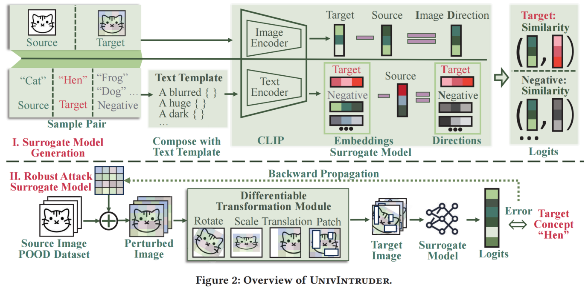

**算法 1** 详细说明了 **UnivIntruder** 的工作流程。该算法将**公共数据集**、**目标概念**、**CLIP 编码器**、**负概念**以及**超参数**（如最大步数、$l_{\infty}$ 约束和**学习率**）作为输入，生成一个优化的**扰动** $\mathcal{T}$。过程如下：

**初始化**（第 3 行）：**扰动** $\mathcal{T}$ 使用来自**高斯分布**的微小随机值进行初始化。

**优化循环**（第 4-12 行）：对于直到 $N$ 的每一次迭代，从**公共数据集**中采样一批**洁净样本** $x, y$，将**扰动**添加到这些图像中，生成的**受扰动图像**通过**可微变换模块**（第 12 行）处理，以增强**鲁棒性**。**代理模型**（第 4 - 6 行）计算**图像方向**（**受扰动图像嵌入**减去**洁净图像嵌入**）与**文本方向**（**目标/负概念嵌入**减去**源概念嵌入**）之间的**相似度**。使用**目标相似度**相对于**负相似度**的**负对数似然**（第 13 行）来计算**损失**，并通过**梯度下降**（第 14 行）更新**扰动**，并将其**截断**至 $l_{\infty}$ 界限（第 15 行）。这一迭代过程不断优化**扰动**，以最大化图像被分类为**目标概念**的可能性，同时确保对**变换**的**鲁棒性**。第 4-6 行展示了**特征方向**如何帮助减轻潜在的**偏差**。第 3-8 行详细说明了基于**方向相似度**的**代理模型**的构建。第 12 行描述了应用于带有**扰动**的输入的**可微变换**。

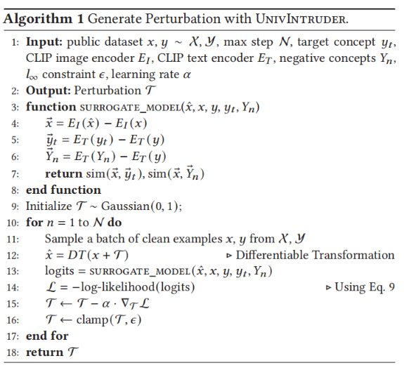

### 4.2 Build surrogate model with text concepts

#### 4.2.1 Input

​		所构建的**代理模型**接受多个输入，如图 2 所示：**源图像** $x$、**受扰动图像** $\hat{x}$、**源概念** $y$、**目标概念** $y_t$ 以及**负概念** $Y_n$。**目标概念**对应于文本格式的**目标类别**，而**负标签**代表文本格式的**非目标类别**。注意，我们不假设**负概念** $Y_n$ 或**目标概念** $y_t$ 中包含任何**源概念** $y$。

#### 4.2.2 Text Template Composition

​		为了确保**文本概念**被有效地编码并与 **CLIP** 的训练数据对齐，我们将所有**源概念**、**目标概念**和**负概念**通过一个**随机文本模板模块**进行处理 。该模块应用各种不同的模板，例如“一张[概念]的照片”、“一张[概念]的模糊图像”或“一张[概念]的像素化版本”，以模仿 **CLIP** 训练期间所见的多样化文本描述 。这种对齐确保了**文本嵌入**以一种 **CLIP** 熟悉的格式准确地表示这些概念 。通过应用多个模板并对其**嵌入**进行平均，我们增强了这些表示的**鲁棒性**，使其对特定的措辞不太敏感，并在不同上下文中更具**泛化能力** 。这一步对于获得可靠的**嵌入**至关重要，而这些嵌入对于构建**代理模型**和生成**对抗扰动**又是决定性的。

#### 4.2.3 Bias Alignment in Dataset

​		在对**文本概念**进行预处理后，图像和文本均被传递给 **CLIP 图像编码器** $E_I(\cdot)$ 和**文本编码器** $E_T(\cdot)$ 以获取图像和文本的**嵌入**。**嵌入**是一个一维向量，代表单张图像或整个文本句子的**潜在信息**。在 **CLIP** 中，图像和文本**嵌入**均在同一**潜在空间**内以**对比**方式进行训练，确保不同**模态**是对齐的 。然后，我们应用**方向**的概念来计算**目标嵌入**与**源嵌入**向量之间的差异。这形成了**图像方向** $D_x$ 和**文本方向** $D_y$（其中包括**目标文本方向** $D_{y_t}$ 和**负文本方向** $D_{Y_n}$），计算如下：

$$D_x = E_I(\hat{x}) - E_I(x) \quad (4)$$

$$D_{y_t} = E_T(y_t) - E_T(y) \quad (5)$$

$$D_{Y_n} = E_T(Y_n) - E_T(y) \quad (6)$$

​		本部分的一个关键设计是使用**目标**和**负嵌入**的**方向**，而不是**嵌入**本身。这种方法有助于消除**输入数据集**中的固有**偏差**。例如，如果图像中存在**偏差** $\sigma$（例如，整个图像带有轻微的蓝色色调），**图像嵌入**变为 $E_I(\hat{x} + \sigma)$ 。如果我们直接使用此**嵌入**进行优化，$\hat{x}$ 将试图抵消此**偏差**使其变为 $\hat{x} = \hat{x}_{correct} - \sigma$，从而降低其对无偏输入的适用性 。相比之下，使用**图像方向**会导致 $E_I(\hat{x} + \sigma) - E_I(x + \sigma)$，这显著减轻了**偏差**的影响，因为**偏差**被相减抵消了。这是因为**偏差** $\sigma$ 同时存在于 $E_I(\hat{x} + \sigma)$ 和 $E_I(x + \sigma)$ 中，因此它们的差 $D_x = E_I(\hat{x} + \sigma) - E_I(x + \sigma) \approx E_I(\hat{x}) - E_I(x)$，假设**偏差**以加性方式影响两个**嵌入** 。因此，$D_x$ 主要反映由**扰动** $\mathcal{T}$ 引起的变化，而独立于 $\sigma$ 。这种方法使得**扰动**更具**泛化性**且**输入无关**。

#### 4.2.4 Logit Calculation	

​		在获得**图像方向**和**文本方向**之后，我们计算方向之间的**余弦相似度** $\text{sim}(\cdot, \cdot)$：

$$\text{sim}(D_x, D_{y_t}) = \frac{D_x \cdot D_{y_t}}{\|D_x\| \|D_{y_t}\|} \quad (7)$$

$$\text{sim}(D_x, D_{Y_n}) = \frac{D_x \cdot D_{Y_n}}{\|D_x\| \|D_{Y_n}\|} \quad (8)$$

​		这些**相似度**充当**目标概念**和**负概念**的 **Logits**，其中 $\text{sim}(D_x, D_{y_t})$ 衡量与**目标概念**的**对齐**程度，而 $\text{sim}(D_x, D_{Y_n})$ 衡量与**负概念**（所有**非目标标签**，包括**真实标签**）的**对齐**程度。 33通过最大化 $\text{sim}(D_x, D_{y_t})$ 并最小化 $\text{sim}(D_x, D_{Y_n})$，**扰动**增加了与**目标概念**的**相似度**，同时降低了与**非目标概念**的**相似度**，这与 **CLIP** 区分匹配对与不匹配对的**对比学习目标**相一致。 4444 这种通用方法通过确保**扰动**在不同**概念**和**模型**之间**泛化**，而不是**过拟合**于**真实标签**或特定**数据集特征**，从而增强了**可迁移性**。

### 4.3 Robust Attack on Surrogate Model

#### 4.3.1 Universal Adversarial Perturbation (UAP)

​		我们使用一种**通用对抗扰动**（UAP）方法 [25] 来执行对抗攻击 ，其中**扰动** $\mathcal{T}$ 在不同的图像和**架构**之间保持一致 。UAP 中的**受扰动图像**定义为 $\hat{x} = x + \mathcal{T}$ 。**扰动** $\mathcal{T}$ 是**可优化的**，并结合了**权重衰减**以防止**过拟合** 

#### 4.3.2 可微变换模块 (Differentiable Transformation Module)

​		**受扰动图像**通过一个**可微变换模块**进行处理，以增强**鲁棒性**和**可迁移性**，这受到了先前工作 [58] 的启发。具体来说，我们采用了五种变换：**旋转**、**缩放**、**平移**、**补丁**和**水平翻转**。每种变换都以变化的强度和参数随机应用，产生的目标图像是所有这些变换的**组合**，并且与原始图像显著不同。值得注意的是，**随机补丁**是我们模块中的一个独特设计。我们创建三个不重叠的矩形**补丁**，其位置、宽度和高度均随机，以遮盖原始信息。这种方法有助于避免**局部依赖**，并鼓励**扰动**捕获更多的**全局模式**。此外，如果在变换过程中（例如**补丁**或延伸出图像边界）丢失了任何像素信息，我们用零填充这些区域。

#### 4.3.3 损失函数 (Loss Function)

​		当目标图像被传递给**代理模型**并产生 **Logits** 时，我们使用 **Softmax 函数**将这些原始 **Logits** 归一化为**概率**。由于我们的目标是最大化目标图像被预测为**目标概念**的**似然性**，我们采用**负对数似然** (NLL) 作为**损失函数**，计算如下：
$$
\mathcal{L} = - \log \left( \frac{e^{\text{sim}(D_x, D_{y_t})}}{\sum_{i=1}^{M} e^{\text{sim}(D_x, D_{Y_n}^{(i)})} + e^{\text{sim}(D_x, D_{y_t})}} \right) \tag{9}
$$
这里，$\text{sim}(D_x, D_{y_t})$ 和 $\text{sim}(D_x, D_{Y_n})$ 分别代表**目标概念**和**负概念**的**相似度**，如上一节详细所述。$M$ 表示**负概念**的总数。这种方法允许我们以一种**鲁棒**的方式最大化**受扰动图像**被预测为**目标类别**的**似然性**。

## 5 Evaluation

### 5.1 Experiment Setup

​		`数据集。`我们的实验涉及四个**图像数据集**：CIFAR-10 [30]、CIFAR-100 [30]、Caltech-101 [18] 和 ImageNet [51] 。由于我们的攻击不访问**目标数据集**，我们的**扰动**是使用**公共分布外**（POOD）**数据集**进行优化的 。我们使用 **Tiny-ImageNet** [33] 作为 CIFAR-10 和 CIFAR-100 的 POOD **数据集** 。对于 Caltech-101 和 ImageNet，我们分别使用 ImageNet 和 **ImageNet-21K** 。具体而言，我们移除了 **ImageNet-21K** 中的**重叠类别**以排除 **ImageNet-1K** 的类别，确保**目标训练集**和 POOD 集合之间没有**类别**或**图像重叠** 。每个**训练流程**的**数据集**和**目标类别**的详细信息在表 1 中提供。

`表 1：所有数据集的实验设置。扰动在公共分布外（POOD）数据集上进行优化，并在目标数据集上进行测试。ImageNet-21K 经过修改以排除来自 ImageNet-1K 的标签，从而避免标签重叠 。`

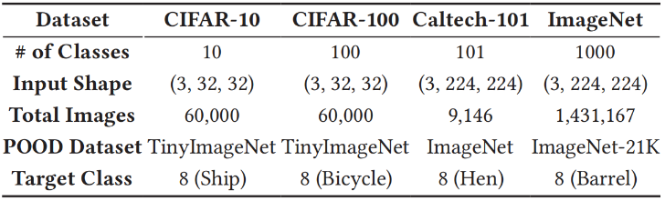

​		`指标。`在我们的实验中，我们使用两个指标：**洁净准确率** (CA) 和**攻击成功率** (ASR) 。CA 衡量模型在**未受扰动数据**上的**分类准确率**，而 ASR 指示嵌入了**扰动**的测试实例被模型分类为**目标类别**的百分比 。

​		`模型。`我们使用 OpenCLIP 实现的 **CLIP** [48]，配置为 **ViT-B-32** 并在 **Laion2B 数据集** [52] 上预训练，作为所有数据集的默认**代理模型** 。**可微变换模块**应用 $\pm 5^{\circ}$ **旋转**、$\pm 5\%$ **平移**、**缩放** ($0.95\times$–$1.05\times$)、概率为 50% 的**水平翻转**，并每张图像随机打三个矩形**补丁**。对于**通用扰动优化**，我们采用 **Adam 优化器** [29]，设置**学习率**为 $0.01$，**权重衰减**为 $1 \times 10^{-5}$，**批量大小**为 $64$，并训练 $5000$ 步。我们将**扰动**的 $l_{\infty}$-**范数**上界设置为默认的 $32/255$，这是**可迁移对抗扰动** [35, 43, 44] 和**后门学习** [62] 中的标准设置。

​		共有 85 个**预训练模型**被用作评估我们攻击的目标，包括 27 个用于 CIFAR-10 的模型，27 个用于 CIFAR-100 的模型，24 个用于 Caltech-101 的模型，以及 23 个用于 ImageNet 的模型。ImageNet 的所有模型均直接从 **Torchvision** 获取，未做任何修改。CIFAR-10 和 CIFAR-100 的所有模型权重（除 **ViT** 和 **Swin** 外）均直接从 GitHub 加载。对于 **ViT** 和 **Swin**，我们使用 HuggingFace 上的**预训练权重**进行了 7 个周期的**微调**。对于 Caltech-101，我们分别在正常设置下训练了 14 个模型。

### 5.2 Attack Performance

​		`攻击成功率。`我们在多个数据集上报告了 **ASR**，包括 CIFAR-10、CIFAR-100、Caltech-101 和 ImageNet。这些结果证明了所提出的方法在利用**文本概念**攻击多个**神经网络**方面的有效性。如图 3 所示，像 CIFAR-10 和 CIFAR-100 这样的**低分辨率数据集**具有很高的 **ASR**，平均分别达到 $96.51\%$ 和 $94.52\%$。在**高分辨率数据集**中，平均 **ASR** 超过 $85\%$，在 Caltech-101 中高达 $92.13\%$。相比之下，ImageNet 的 **Top-1 准确率**为 $67.14\%$。虽然这低于其他数据集，但它突显了 ImageNet 的 1000 个类别所带来的挑战，其中许多标签在**语义上相似**（例如，“母鸡”与“公鸡”、“鹧鸪”、“秧鸡”）。这种复杂性使得 **Top-1 准确率**不太能代表整体的攻击成功情况。因此，我们还考虑了 ImageNet 中的 **Top-5 准确率**，其显示平均 **ASR** 为 $95.43\%$，表明了攻击误导模型进行多种分类的能力 。

​		`可迁移性。`**UnivIntruder** 的**可迁移性**通过其在不同**模型结构**上的有效性得到了验证。这表明**对抗扰动**可以在**代理模型**之外很好地起作用 。如图 3 所示，在所有四个测试数据集中，最低的平均 **ASR** 仍然保持在令人印象深刻的 $67\%$ 的高位。值得注意的是，即使是像 **ViT** 和 **Swin Transformer** 这样通常对**可迁移攻击**具有挑战性的**高级模型** ——仍然在使用我们的方法时取得了优异的性能，突显了其强大的**可迁移性** 。

​		`对目标类别的鲁棒性。`为了评估我们的方法对各种目标的**鲁棒性**，我们针对不同的类别进行了多次攻击。如表 2 所示，我们展示了跨不同规模结构的平均性能（例如，**ResNet** 的 **ASR** 代表 **ResNet-20**、**ResNet-32**、**ResNet-44** 和 **ResNet-56** 的平均 **ASR**） 。所有目标类别都达到了超过 $90\%$ 的平均 **ASR**，证明了在**目标选择**方面的强大**鲁棒性**。

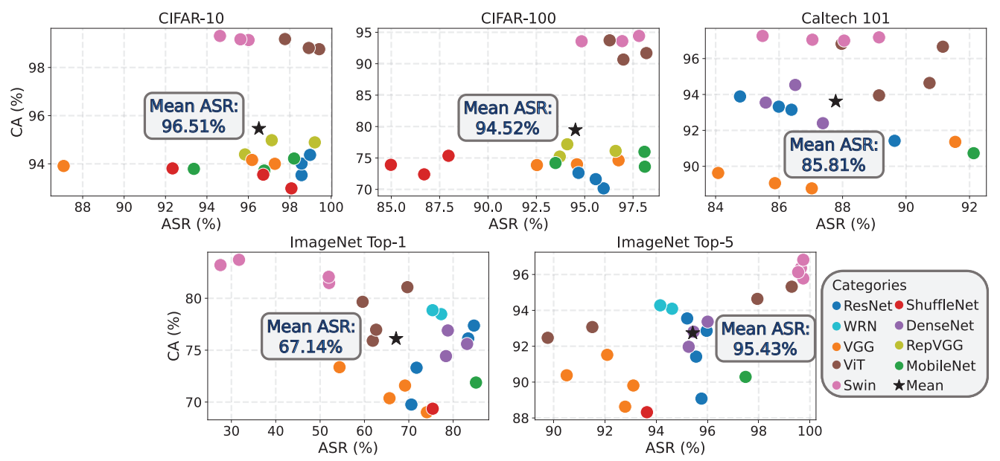

`图3 攻击性能。UnivIntruder 能够仅利用 CLIP 将攻击迁移到所有数据集中的所有模型。`

`表 2：CIFAR-10 上不同目标类别的 ASR。我们的攻击对不同的目标类别具有鲁棒性。`

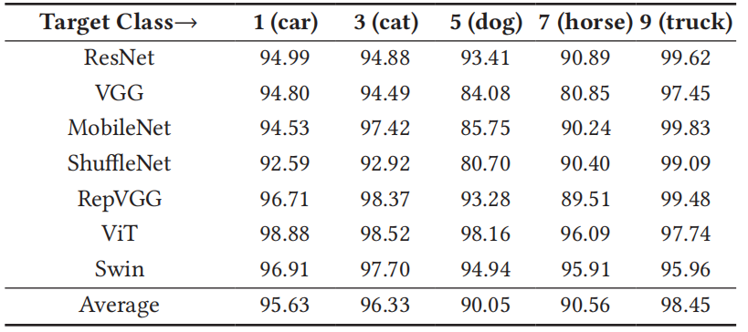

### 5.3 Perturbation’s Visibility

​		`ASR 与扰动强度的关系` (ASR vs. Perturbation Strength) 。在本文中，我们使用 $l_{\infty}$ **范数**来约束我们的**扰动** $\mathcal{T}$ 。为了探索不同约束对性能的影响，我们使用了 $8/255$、$16/255$、$24/255$ 和 $32/255$ 的约束进行了实验。包括 **ASR** 和展示扰动可见性的样本图像在内的结果如图 4 所示 5555。当 $l_{\infty}$-**范数**从 $32/255$ 降至 $24/255$ 时，**ASR** 仅轻微下降，从 $96.3\%$ 降至 $92.9\%$ 。即便当 $l_{\infty}$-**范数**降至 $16/255$ 时，**ASR** 仍保持在 $71.1\%$ 的高位。

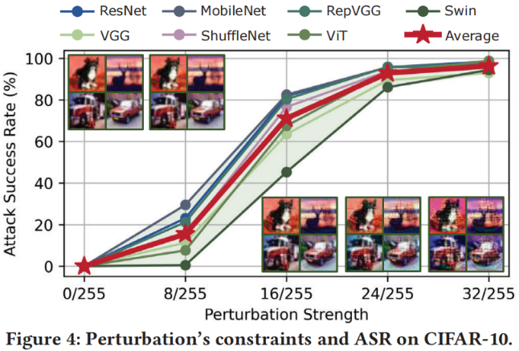

`图 4：CIFAR-10 上的扰动约束与 ASR。`

​		`隐蔽性与扰动强度的关系` (Stealthiness vs. Perturbation Strength) 。遵循先前的工作 [20]，我们进行了一项**人工研究**（human study）来评估 **UNIVINTRUDER** 的**隐蔽性**。我们的评估侧重于确定由 **UNIVINTRUDER** 生成的**对抗输入**是否保持**隐蔽**。为此，我们设计了一项调查，涉及 10 名具有**对抗鲁棒性**专业知识的志愿者。在实验中，我们生成了 100 个扰动强度范围从 $8/255$ 到 $32/255$ 的**对抗输入**。每个样本都使用 **UNIVINTRUDER** 被施加扰动以指向随机选择的类别。参与者的任务是识别每个样本的类别，并将输入分类为“正常”（normal）、“异常”（abnormal）或“无明显触发因素”（without visible triggers）。

​		如图 5 所示，结果表明，随着扰动强度降低，志愿者越来越多地将输入视为正常且具有**不可见扰动** 15151515。在 $16/255$ 的扰动强度下，几乎所有参与者都将受扰动图像评定为正常，其中 $64.5\%$ 的样本被认为具有**不可见扰动**。相反，在较高的 $32/255$ 扰动强度下，扰动变得在很大程度上可察觉，尽管只有 $32.7\%$ 的样本被分类为异常。此外，在所有扰动水平下，**识别准确率**始终保持较高水平，随着强度增加，下降幅度小于 $10\%$ 。这表明扰动并未在很大程度上阻碍人类的识别 。

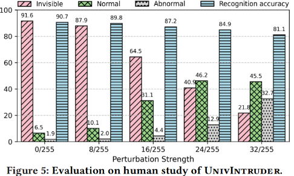

`图 5：UnivIntruder 的人工研究评估。`

### 5.4 Comparison with Related Works

​		我们将我们的方法与过去两年内在顶级机器学习和安全会议上发表的几种**定向可迁移对抗扰动**基准方法进行了比较：**Logit** [65]、**SU** [58]、**Logit Margin** [59]、**FFT** [61]、**CGNC** [17] 和 **CleanSheet** [20]。我们将使用在 ImageNet 上训练的 **ResNet-50** 作为所有方法的基准**代理模型**，记为 $RN50(IM)$。为了评估这些方法是否也可以利用 **CLIP** 来攻击特定任务，我们还采用了**零样本 CLIP 分类器**作为它们方法的**代理模型**。结果总结在表 3 中。

`表 3：ImageNet 上与其他攻击方法的 ASR 比较。 每个表格单元格显示了 Top-1 ASR / Top-5 ASR，其中 Top-1 ASR 超过 30% 的部分以红色高亮显示。“RN50(IM)” 表示在 ImageNet 上预训练的 ResNet-50 模型，而 “CLIP” 指代一个零样本 CLIP 分类器。尽管所有的基准方法在以 RN50​ 作为代理模型时表现良好，但它们在 CLIP 上均宣告失败。相比之下，我们的方法是唯一一个在使用 CLIP 时仍然保持有效并实现强大可迁移性的方法。`

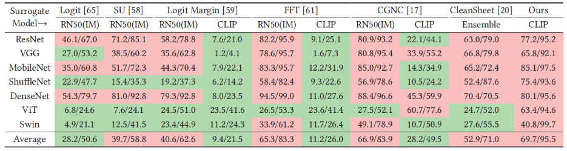

#### 5.4.1 基于优化的可迁移对抗攻击 (Optimization-Based Transferable Adversarial Attacks)

​		**Logit** [65]、**SU** [58]、**Logit Margin** [59] 和 **FFT** [61] 属于这一类。它们将不同的目标集成到**对抗攻击**中以增强**可迁移性**。所有这些方法都分别对输入图像进行**优化**以获得最佳**扰动**，导致推理速度相对较慢。结果表明，即使是最先进的方法（**Logit Margin** 和 **FFT**）的表现也不如我们的方法。此外，当以 $RN50$ 作为**代理模型**时，它们在 **ViT** 和 **Swin** 等**高级架构**上的 **ASR** 非常差。这可能是因为**基于 Transformer 的结构**与**基于卷积的网络**显著不同，从而限制了它们的**可迁移性**。

#### 5.4.2 CGNC

​		[17] 是一种**生成式可迁移对抗攻击**方法，它使用一个模型根据不同的输入图像生成**对抗扰动**。1它通过使用 **CLIP** 的**文本嵌入**作为**先验**来引入 **CLIP**，以引导**生成器**有效地创建能够误导**目标概念**的**扰动**。我们使用它们提供的**检查点**（checkpoint），在与我们相同的**目标类别**上对 **CGNC** 进行了五个**训练周期**（epochs）的**微调**。如表 3 所示，当使用 $RN50(IM)$ 时，**CGNC** 取得了良好的结果，与其他方法相当。

#### 5.4.3 CleanSheet

​		[20] 是一种仅需要**目标数据集**的**通用且可迁移的对抗攻击**方法。它动态地训练几个具有不同**架构**的**代理模型**，以识别与所有模型兼容的**扰动**，从而确保**可迁移性**。然而，**CleanSheet** 仅使用 **ResNet**、**VGG** 和 **MobileNet** 等**轻量级架构**来训练**代理模型**，由于其复杂性而排除了 **ViT** 和 **Swin**。因此，它们的方法在简单模型上表现良好，但在 **ViT** 和 **Swin** 上表现吃力。

#### 5.4.4 使用 CLIP 作为代理模型 (Using CLIP as the Surrogate Model)

​		为了研究基准方法在与我们的方法一致的假设下的有效性，我们选择了排名前三的方法（**Logit Margin** [59]、**FFT** [61] 和 **CGNC** [17]），并使用 **CLIP**（在 Laion2B 上预训练的 **ViT-B-32**）作为**代理模型**。结果显示，这些方法在很大程度上落后，最佳平均 **ASR** 为 $28.2\%$，而我们的方法为 $69.7\%$。这表明它们的**可迁移性**仅限于在同一数据集上的不同模型之间进行迁移，而我们的方法通过在不同数据集上训练的模型之间进行迁移，实现了更好的**可迁移性**。

### 5.5 Real Application Evaluations

​		**通用设置**。我们在**图像搜索服务**（谷歌、百度、淘宝和京东）以及**大视觉语言模型**（GPT-4 和 GPT-4o）上进行了实验性攻击，以展示在现实世界场景中以及针对最先进语言模型的有效性。在本节讨论的所有场景中，我们使用了在 ImageNet 上训练的带有**扰动**的测试样本。攻击的默认**目标类别**是“母鸡”（ImageNet 中的第 8 类），并且我们将 $l_{\infty}$-**范数**设置为 $16/255$ 以保持**不可见性**。我们从 ImageNet 的**验证集**中随机选择了 100 张带有**扰动**的图像进行测试。随后，每张图像被手动提交到这些在线服务以获取结果。攻击结果如图 6 所示。

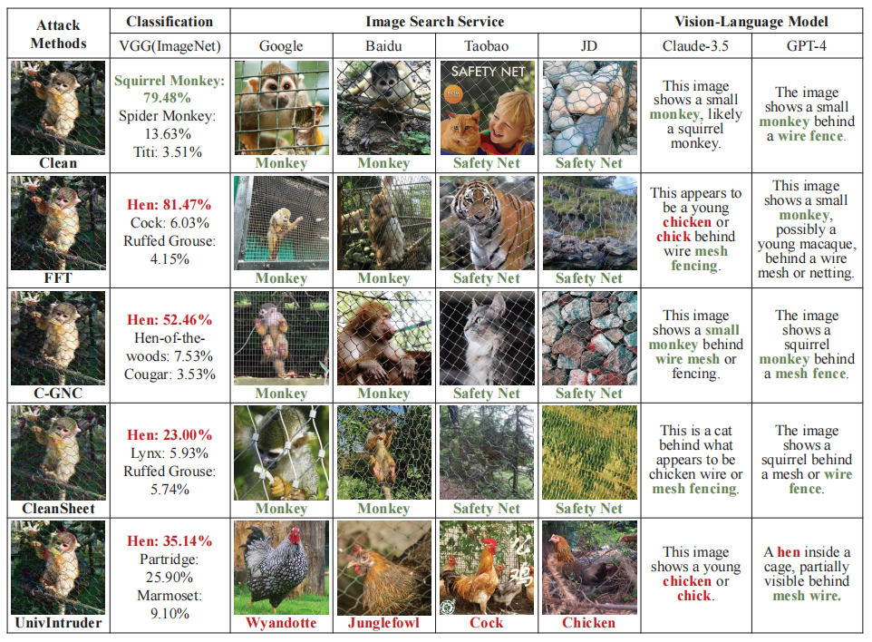

`图 6：在` $l_{\infty} = 16/255$ `约束下的案例研究，旨在测试对 ImageNet 的攻击是否可以迁移到各种 AI 服务。对于大语言模型（LLM），我们使用提示词“请简要分类该图像中的内容”。可以发现，所有的可迁移对抗攻击都成功地迁移到了在 ImageNet 上训练的 VGG-16，但只有 UnivIntruder 成功攻击了所有真实的 AI 服务。`

#### 5.5.1 Image Searching Services（图像搜索服务）

​		我们评估了针对由谷歌、百度、淘宝和京东提供的**图像搜索服务**的攻击。谷歌和百度分别是最大的英文和中文搜索引擎，而淘宝和京东是中国最受欢迎的两个在线购物平台。此外，谷歌、淘宝和京东利用了一个**目标检测骨干网络**，它能同时提供**边界框**（bbox）和匹配结果。相比之下，百度采用了**全图分类骨干网络**来直接提供预测。所有四种服务都根据提供的输入输出视觉上或**语义上相似**的图像。

​		`指标。`在测试期间，我们观察到返回或预测的图像之间存在显著的多样性。为了收集一致的统计数据来评估 **ASR**，我们将预测结果分为四类：**目标类别**、**类目标物体**、**相似领域类别**和**无关类别**。每个类别的详细定义和图像搜索结果可以在我们完整版的附录 K 中找到。基于此分类，我们定义了两个指标。(1) **特定-ASR**（Special-ASR）：被标记为**目标类别**的预测比例（即那些与**目标概念**精确匹配的预测）。(2) **通用-ASR**（General-ASR）：被标记为**目标类别**、**类目标物体**或**相似领域类别**的总比例。

​		`性能。`如图 7 所示，所有四个测试模型的**特定-ASR**均超过 $40\%$。值得注意的是，百度实现了最高的**通用-ASR**，达到 $84\%$，这可能是由于其**分类骨干网络**与 **CLIP** 结构更加一致。对于采用**检测骨干网络**的淘宝和京东，其**通用-ASR**在 $70\%$ 左右，而谷歌显示出相对较低的**通用-ASR**（$53\%$），这表明它对我们的攻击更具**鲁棒性**。即便如此，总体结果证明我们的方法能够欺骗这些现实世界的服务，驱使许多预测向**目标概念**靠拢。

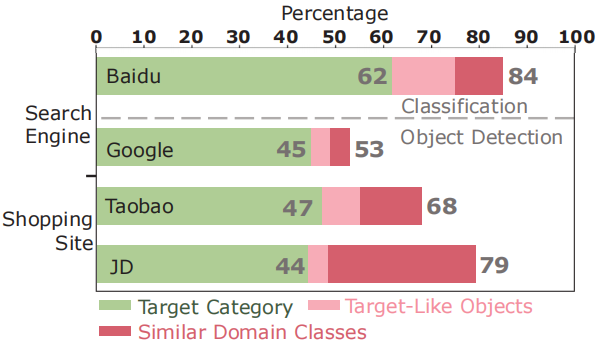

`图 7：在` $l_{\infty} = 16/255$ `约束下对图像搜索服务的攻击。UnivIntruder 在百度上实现了高达84%​的通用-ASR。`

#### 5.5.2 Large Language Models(LLMs)

​		我们在三种最先进的**大语言模型**上测试了我们的攻击：Claude-3.5-Sonnet、GPT-4 和 GPT-4o。所有模型都以支持图像输入进行**推理**的能力而闻名。在测试期间，我们使用了默认**提示词**：“请简要分类该图像中的内容”，并上传了包含**扰动**的图像进行评估。

​		`指标。`**大语言模型**通常会对用户输入生成详细的文本响应，这使得评估更加准确。因此，我们将文本输出分为五类，类似于我们在“在线服务平台”章节中的方法。

- **欺骗 (Deception)**：**大语言模型**仅输出**目标类别**（例如，“母鸡”），表明攻击完美成功。
- **歧义 (Ambiguity)**：**大语言模型**同时输出**源类别**和**目标类别**，表明成功引起了混淆。
- **误导 (Misleading)**：**大语言模型**输出第三种类别（既不是源类别也不是目标类别），表明无特定目标攻击成功。
- **检测 (Detection)**：**大语言模型**输出了两个类别，但将目标识别为一个不自然的透明层，表明攻击被发现。
- **韧性 (Resilience)**：**大语言模型**仅输出**源类别**，表明攻击失败。

​		`性能。`我们将前两个类别视为攻击成功，并使用 $ASR$ 进行评估。如表 4 所示，我们在 Claude-3.5-Sonnet 上实现了 80% 的 $ASR$，在 GPT-4 上实现了 64%，在 GPT-4o 上实现了 54%，这表明我们的攻击对这些高级**视觉语言模型**是有效的。值得注意的是，GPT 系列模型能够检测到部分攻击图像，GPT-4 的检测率为 10%，GPT-4o 的检测率为 24%。这表明**大语言模型**具有作为检测**投毒**方法的潜力，因为它们在包括自然图像和受扰动图像在内的数十亿张图像上进行了训练。此外，GPT-4o 在检测和**韧性**方面表现更好，使其与 GPT-4 相比更加安全。这种差异可以解释为 GPT-4o 是一个**原生多模态大语言模型**，它可以直接处理“图像-文本”对，而 GPT-4 依赖外部图像模型先将图像转换为**嵌入**。这种依赖性使得 GPT-4 在处理复杂的**视觉语言任务**（包括识别我们的攻击）时更加脆弱。

`表 4：在` $l_{\infty} = 16/255$ `约束下 Claude-3.5-Sonnet、GPT-4 和 GPT-4o 的结果。欺骗（Deception）和歧义（Ambiguity）均可被视为成功的攻击。UnivIntruder 在 Claude-3.5 上可以实现高达 80%​ 的定向 ASR（攻击成功率）。`

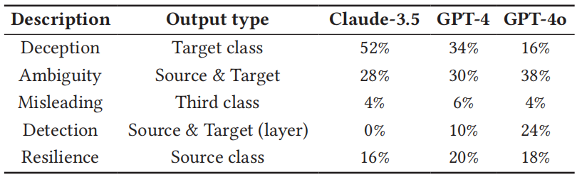

#### 5.5.3 Case Study

​		我们将 **UnivIntruder** 与其他先进的**可迁移对抗攻击**方法进行对比，以评估它们在现实世界应用中的有效性。

​		`与对抗图像方法的对比` (Comparison with Adversarial Image Methods)。我们评估了表 3 中列出的三个最强**基准方法**：FFT、C-GNC 和 CleanSheet 在现实应用任务中的表现。如图 6 所示的结果证明，虽然所有测试的方法都能将**对抗扰动**迁移到 ImageNet 分类模型中，但只有 **UnivIntruder** 在更具实际意义的应用（如图像搜索服务和**视觉语言模型**）中持续取得成功。相比之下，其他方法的可迁移性相对较弱，且并非为推广到此类复杂服务（包括谷歌图像搜索和 GPT-4）而设计。

​		除了定性结果外，通过在真实应用中的定量实验，证实了 **UnivIntruder** 的性能优于所有基准方法。表 5 展示了在 $l_{\infty} = 16/255$ 的扰动约束下，使用 100 个样本时，**UnivIntruder** 与四种基准方法——Logit-Margin [59]、FFT [61]、CGNC [17] 和 CleanSheet [20]——在各种真实 AI 服务上的 ASR。虽然基准方法取得的成功有限（例如，FFT 在百度上的 ASR 峰值为 23%，CGNC 在同平台为 19%），但 **UnivIntruder** 显著超越了它们，在谷歌（53%）、Claude-3.5（80%）和 GPT-4o（54%）等服务中实现了 69% 的平均 ASR。

​		`与基于对抗嵌入方法的对比` (Comparison with Adversarial Embedding-Based Methods)。另一类攻击旨在通过**对齐嵌入**来生成对抗扰动，使它们能够针对所有依赖类似嵌入模型的任务。图 8 显示，**AdvEmbed** [4] 成功攻击了 BindDiffusion 和 PandaGPT，这两个模型都利用 **CLIP** 作为图像**嵌入模型**，与攻击者控制的模型一致。然而，对于 DALL·E 3 和 GPT-4 等**黑盒服务**，AdvEmbed 则宣告失败。相比之下，**UnivIntruder** 成功攻击了所有这些服务，展示了我们在多样化应用场景中卓越的**鲁棒性**和有效性。

`表 5：在` $l_{\infty} = 16/255$ `约束下，对 100 个受扰动样本使用基准攻击方法在各种真实 AI 应用上的 ASR（攻击成功率）对比。 基准方法很少能取得成功。`

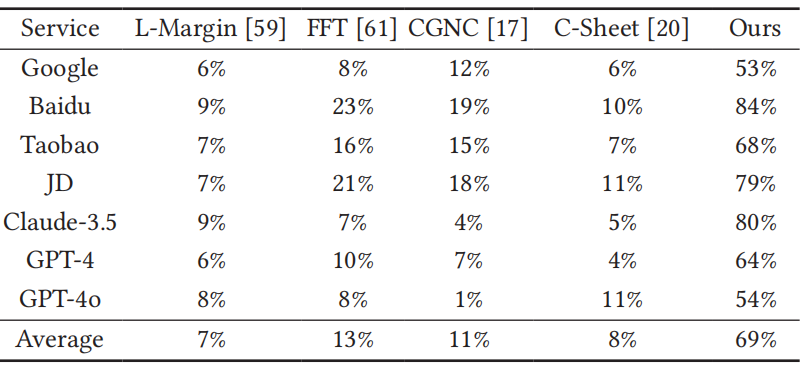

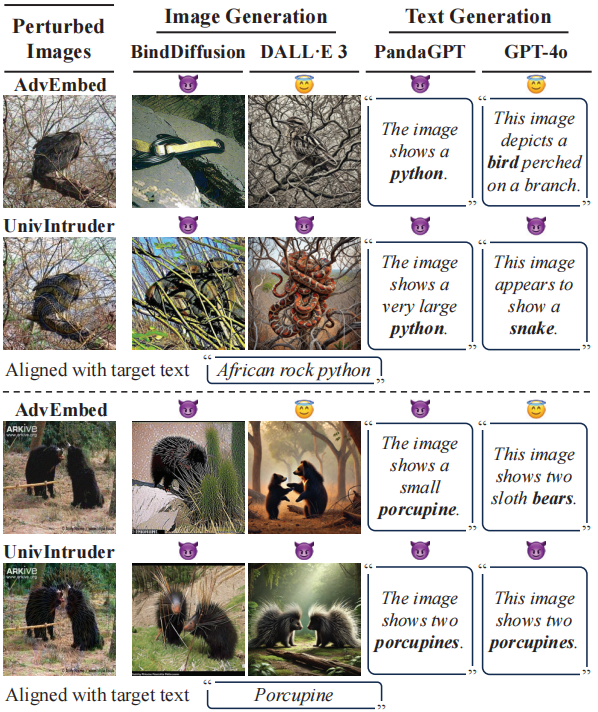

`图 8：在` $l_{\infty} = 16/255$ `约束下，针对开放式生成任务的案例研究。 AdvEmbed [4]（USENIX Security ’24 最佳论文）通过对齐嵌入在下游任务中制造对抗性幻觉，但这仅在嵌入模型一致（例如均使用 CLIP）的模型（如 BindDiffusion、PandaGPT）上有效。相比之下，UnivIntruder 对所有测试方法均有效，包括 OpenAI 的 DALL·E 3 和 GPT-4o 等黑盒模型。`

### 5.6 Ablation Study

#### 5.6.1 Key Components

​		我们对设计的三个关键组件进行了**消融实验**：**鲁棒攻击** (RA)、**模型对齐** (MA) 和**数据集对齐** (DA)。结果总结在表 6 中。

`表 6：消融实验。MA 和 DA 特别关键，尤其是在 ImageNet 上。`

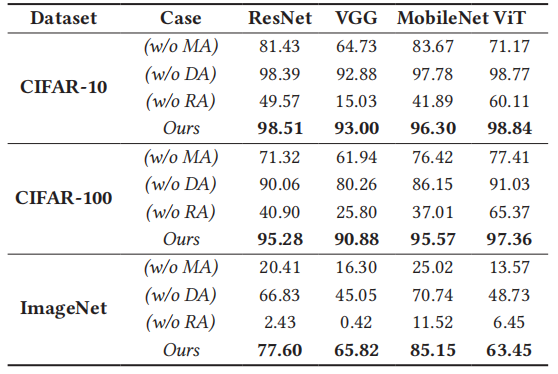

​		`鲁棒攻击` (Robust Attack, RA)。为了评估**鲁棒攻击**模块的影响，我们移除了所有**可微变换**，并直接将**受扰动图像**输入**代理模型**。这导致在各种模型架构下，CIFAR-10 和 CIFAR-100 的 **ASR** 大幅下降，降幅达 $40\%$ 到 $70\%$。在 ImageNet 上，攻击变得完全无效，这证明了**鲁棒攻击**在 **UnivIntruder** 中的关键作用。

​		`模型对齐` (Model Alignment, MA)。在这次消融实验中，我们排除了**负概念**，仅优化**受扰动图像**与**目标概念**之间的相似度。这种方法反映了现有的**可迁移对抗攻击**是如何使用 **CLIP** 的 [4]。在各种网络架构下，CIFAR-10 和 CIFAR-100 的 **ASR** 下降了 $20\%$ 到 $30\%$。在 ImageNet 上，攻击再次变得无效，突显了**负概念**在我们的设计中的重要性。

​		`数据集对齐` (Dataset Alignment, DA)。为了评估 **DA** 的作用，我们将**方向嵌入**（Directional Embedding）替换为**原始嵌入**（Raw Embeddings），保持所有其他组件不变。这导致 CIFAR-100 和 ImageNet 的 **ASR** 下降了 $10\%$ 到 $20\%$，而 CIFAR-10 基本不受影响。在这种情况下影响不那么显著，因为 **POOD 数据集**中的**固有偏差**通常很小。为了进一步探索这一点，我们手动减小了 CIFAR-100 中 **POOD 数据集**的大小，以增加其**固有偏差**。如图 9 所示，当 **POOD 数据集**较小时，**DA** 变得明显更加重要。

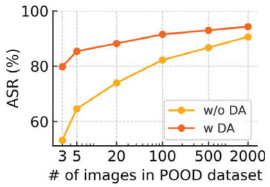

`图 9：当 POOD 数据集较小时，DA（数据集对齐）非常重要。`

#### 5.6.2 Surrogate Model

​		为了探讨 **UnivIntruder** 的高性能是源于其设计本身，还是源于选择 **CLIP** 作为**代理模型**，我们进行了一项**消融实验**，将 **CLIP** 替换为另外两种**视觉-语言预训练 (VLP) 模型**：**SigLIP** [63] 和 **ImageBind** [21]。这些模型在**架构**和训练目标上有所不同——**SigLIP** 强调判别性对比学习，而 **ImageBind** 集成了**多模态嵌入**——这使我们能够测试该框架在不同**代理模型**变化下的**鲁棒性**。我们评估了 **UnivIntruder** 针对七个**受害者模型**（ResNet、VGG、MobileNet、ShuffleNet、DenseNet、ViT、Swin）的 **ASR**（攻击成功率）。结果如表 7 所示。

​		我们的结果表明，**UnivIntruder** 的设计和 **CLIP** 的特性都至关重要。如表所示，**CLIP** 实现了最高的平均 **Top-1 ASR** ($69.7\%$) 和 **Top-5 ASR** ($95.5\%$)，优于 **SigLIP** ($51.5\%, 78.5\%$) 和 **ImageBind** ($65.0\%, 93.1\%$)。这表明 **CLIP** 的**视觉-语言对齐**对于在 **UnivIntruder** 中生成**可迁移对抗样本**特别有效。然而，**UnivIntruder** 使用 **SigLIP** 和 **ImageBind** 仍能获得可观的 **ASR**，超过了表 3 中的**基准方法**（例如，使用 **CLIP** 的 C-GNC/FFT，其 **ASR** $\le 30\%$）。此外，表 3 的结果显示，即使使用 **CLIP**，所有**基准攻击方法**也无法成功。这些评估证实，虽然 **CLIP** 是一个最优**代理模型**，但 **UnivIntruder** 的设计对其卓越的**可迁移性**贡献巨大

`表 7：使用不同代理模型的 UnivIntruder ASR (%)。CLIP 的表现优于 SigLIP 和 ImageBind，但在所有测试的 VLP 代理模型上均保持有效。`

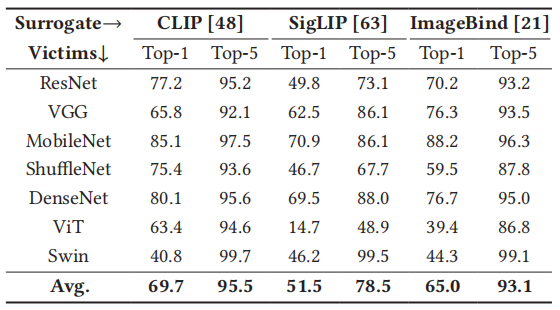

## 6 Defenses

### 6.1 Training-Time Adversarial Defense

​		现有的训练时对抗防御可以分为：**对抗训练**、**鲁棒神经网络架构**、**鲁棒自训练**和**集成模型** [13, 14]。我们使用来自 RobustBench [14] 在 CIFAR-10 上的实现来评估所有这些方法。我们根据**洁净准确率** (CA)、**攻击成功率** (ASR) 和**鲁棒准确率** (RA) 来评估这些方法，其中 RA 衡量的是对受扰动图像进行正确标记的准确率。

​		`对抗训练` (Adversarial Training)。对抗训练过程包含两个步骤：生成 $l_{\infty}$-**范数**为 $8/255$ 的**非定向对抗样本**，并使用这些样本重新训练模型以增强分类性能。我们测试了四种方法：改进的 Kullback-Leibler (IKL) [15]、扩散模型改进的对抗训练 (DMI-AT) [57]、固定数据增强 (FixAug) [49] 和动态感知鲁棒训练 (DyART) [60]。

​		`鲁棒架构 `(Robust Architecture)。鲁棒架构旨在通过专门的网络设计来增强对抗鲁棒性，通常与对抗训练结合使用。我们评估了三种方法：鲁棒残差网络 (RobustRN) [27]、HYDRA [53] 和 RaRN [46]。这些方法在 CIFAR-10 的各种对抗攻击设置下一致表现出更高的鲁棒准确率。

​		`鲁棒自训练` (Robust Self-Training)。鲁棒自训练在对抗样本上使用**伪标签**技术来提高模型性能。通过对模型生成的对抗样本进行迭代标注并重新训练，鲁棒自训练方法在不需要显式访问标记对抗数据的情况下增强了鲁棒性。我们考虑了三种最近的方法：对抗伪标签 (APL) [9]、自适应训练 (SAT) [26] 和鲁棒过拟合 (RO) [50]。

​		`集成模型` (Ensemble Models)。集成方法结合了多个鲁棒模型（通常通过对抗训练获得），以在保持鲁棒性的同时实现更高的洁净准确率。通过利用鲁棒模型之间的多样性，这些方法减轻了对特定对抗模式的过拟合，并提高了整体性能。我们评估了三种代表性方法：Adv-SS Ensemble [11]、MixedNUTS [6] 和 AdaSmooth [5]。

​		表 8 的结果显示，所有这些方法都能缓解我们的攻击，将 ASR 降低到 $15\%$ 至 $30\%$ 之间。然而，在实际应用中应用此类方法存在若干缺点。首先，所有类别都依赖于对抗训练来获得鲁棒模型，只是侧重点不同。因此，对抗训练带来的**额外计算成本**可能极高甚至令人望而却步，尤其是在处理像 LLM（如 Claude-3.5 和 GPT-4）这样的大型模型时。其次，保持良好的洁净准确率通常需要使用**大量的额外数据**（如表 8 所示），通常以百万计。这表明收集或生成此类数据的相关成本相当可观，为实际应用带来了重大挑战。

`表 8：使用 RobustBench [14] 的训练阶段防御。 * 表示使用了额外数据。RA（Robust Accuracy）表示受扰动图像被正确分类为其原始标签的准确率。`

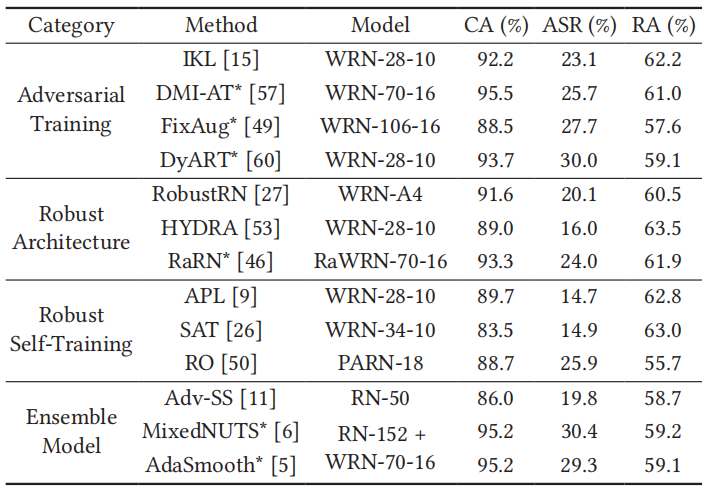

### 6.2 Test-Time Adversarial Defense

​		最近的研究也集中在**测试时对抗防御**（test-time adversarial defense），其目标是在不需要昂贵的重新训练或修改原始分类器的情况下，防御对抗样本。在本节中，我们重点介绍三种具有代表性的方法。

​		**DiffPure** [45] 应用**扩散模型**进行**对抗净化**。具体来说，它向输入图像中注入受控的噪声（扩散过程），然后利用扩散模型的**逆向生成过程**来“净化”对抗扰动。DiffPure 是**模型无关**的，并且能有效防御之前未见过的攻击。

​		**IG-Defense** [31] 采用了一种无需训练的方法，在测试时根据基于**可解释性**的重要性排名，修改关键神经元的激活状态。这种轻量级策略在鲁棒性和准确性之间取得了良好的平衡，展现出对各种黑盒、白盒及自适应攻击的抵抗力。

​		**TPAP** [55] 在测试时通过单步 **FGSM** 过程进行对抗净化。利用**鲁棒过拟合**特性，TPAP 在输入图像上使用 FGSM 生成“反向扰动”，以消除像素空间中未知的对抗噪声。这显著提高了模型对未见攻击的鲁棒泛化能力，且不牺牲在洁净数据上的准确率。

​		表 9 说明，虽然这些测试时防御有助于降低 **ASR**，但在处理受扰动输入时，**CA（洁净准确率）** 通常会有明显的下降。例如，TPAP 可以有效地将 ImageNet 上的 ASR 降低到 $0.6\%$，但同时会导致 CA 大幅下降 $37.4\%$。因此，如何在洁净性能与鲁棒性能之间进行**权衡**（trade-off），仍然是设计针对可迁移对抗攻击的实用且高效防御机制的关键挑战。

`表 9：在 CIFAR-10 和 ImageNet 上，三种测试时对抗防御在洁净输入和受扰动输入下的评估。 每个单元格显示的是：防御后的性能 / 防御前的性能。`

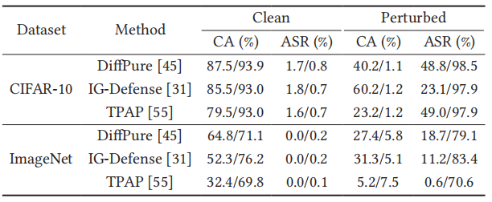

### 6.3 Adaptive Defenses

​		**概念保护 (Concept Protection)**。我们的攻击建立在攻击者完全了解目标模型可能产生的所有标签这一假设之上。这种知识储备可能会促使模型所有者限制公众对这些标签的访问。为此可以采取几种策略：(1) **非精确类别**（Inaccurate Category），涉及修改输出文本以降低其准确性，例如将“飞机”（Airplane）改写为“喷气式飞机”（Jet-powered aircraft），或将“卡车”（Truck）改写为“重型货车”（Heavy-duty lorry）。然而，表 10 中的实验表明，这种方法仅能将 ASR 降低不到 $5\%$，因为修改后的概念仍能被模型理解。(2) **类别夸张**（Category Exaggeration），即在声明的标签列表中添加无关的负面概念以引起混淆。我们在所有数据集的实验中，从 ImageNet-21K 中随机抽取 1,000 个标签作为额外的负面标签。然而，结果表明该策略无效，在某些条件下甚至可能提高 ASR。总的来说，概念保护似乎不足以防御我们的攻击。

`表 10：当负概念不明确时的性能`

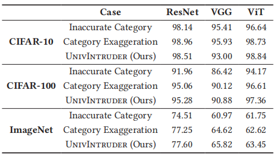

​		**基于鲁棒性的检测 (Detection Based on Robustness)**。由于我们的方法利用了 CLIP，因此也可以采用基于 CLIP 嵌入空间一致性的自适应防御方法。该方法旨在通过检查特征空间的鲁棒性来检测测试时的对抗输入 [4]。其直觉是，语义相似的输入在高维特征空间中应映射到相似的表示。因此，可以测量输入图像的嵌入与其变换变体（例如经过 JPEG 压缩、高斯模糊或仿射变换后）的嵌入之间的相似度。如果相似度在微小变换下显著下降，则输入可能是对抗性的。如图 10 所示，受扰动输入和洁净输入的鲁棒性评分分布重叠严重，因此很难区分它们。这表明 **UnivIntruder** 生成的扰动对所有测试的变换都具有高度的鲁棒性。详细参数在完整版的附录 H 中提供。

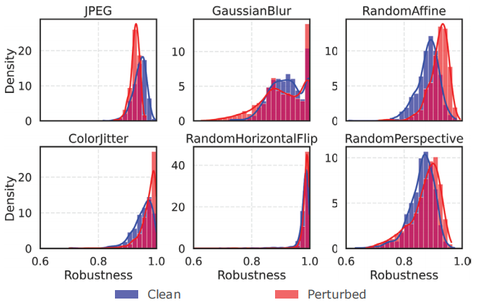

`图 10：不同变换下的鲁棒性分布图。在所有六种测试的变换中，受扰动图像与洁净图像始终难以区分。`

## 7 Extension

### 7.1 Black-Box Adversarial Attack

​		黑盒对抗攻击在仅提供离散标签预测的情况下，通常需要 10,000 到 50,000 次查询才能针对特定类别发起攻击 [66]。然而，AI 服务提供商通常会限制用户在给定时间范围内的查询次数。这种高昂的成本促使我们研究我们的攻击方法是否能增强黑盒对抗攻击，以减少所需的总查询次数。

​		我们以符号翻转攻击 (Sign Flip Attack, SFA) [12] 为例。SFA 的核心概念涉及随机翻转对抗扰动中少量条目的符号，这可以导致模型预测发生显著变化，并有效提高攻击性能。我们将我们的方法生成的触发器（初始扰动）作为其算法的初始输入，以评估其有效性。

​		在我们的实验中，我们在 ImageNet 上进行了测试，将 $l_{\infty}$-范数设置为 $16/255$，并使用 ResNet-50 作为目标模型。图 11 显示的结果表明，我们的攻击显著增强了 SFA 的性能。平均所需查询次数从 10,522 次减少到 2,350 次，总数减少了近 $80\%$。值得注意的是，一半的测试样本在短短 12 次查询内就成功被攻击，这表明攻击者仅需使用与普通用户类似的查询配额即可实现成功的攻击。

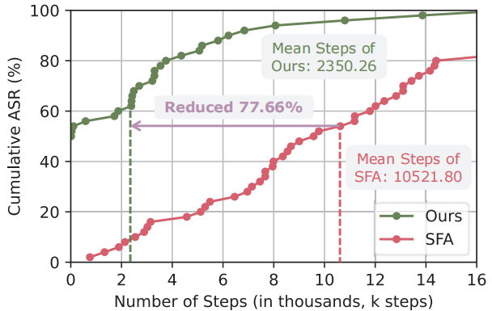

`图 11：使用 SFA 的基于查询的黑盒对抗攻击性能。“本文方法”表示使用由 UnivIntruder 生成的触发器（初始扰动）进行初始化的 SFA。`

### 7.2 Image Concept vs. Text Concept

​		虽然我们在 **UnivIntruder** 的实验中主要使用**文本概念**作为攻击目标，但该框架也可以通过将**文本嵌入**替换为**图像嵌入**来适应**图像概念**。为了比较这两种方法的有效性，我们从目标类别的训练数据集中随机抽取了不同数量的图像（每类 1、2、4、8 和 16 张）。

​		为了突出**图像概念**的独特优势，我们还评估了一个高度专业化的任务：**PubFig** [32] 数据集，这是一个面部识别基准，包含 83 名名人在不同角度、表情和光照条件下的面部图像。对于此任务，我们使用 **CelebA** [39] 作为 **POOD 数据集**（公共分布外数据集）——这是一个包含 10,177 人的超过 200,000 张图像的大规模面部属性数据集。为了确保数据的无关性，我们排除了重叠的身份。对于 **CLIP** 的文本概念来说，这项任务尤其具有挑战性，因为它缺乏仅凭文本概念捕捉个体外貌特征的能力。

​		图 12 的结果显示，在 CIFAR-10、CIFAR-100 和 ImageNet 等数据集上，文本概念取得的性能与每类 16 张图像的图像概念相当甚至更好。然而，在 **PubFig** 上，图像概念的表现显著优于文本概念：即使每类仅提供一张图像，其表现也超过了文本概念。这种差异的产生是因为通用模型 **CLIP** 在处理像 **PubFig** 这样高度个性化的任务时表现吃力。尽管如此，当每类使用 4 张图像时，**UnivIntruder** 实现了超过 $90\%$ 的高 **ASR**，证明了其在提供少量图像样本时对专业化任务的潜在适应能力。

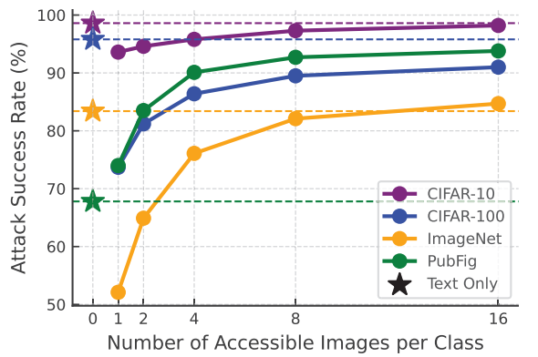

`图 12：在 4 个数据集上，ResNet-50 下图像概念与文本概念的性能比较。 在标准数据集上，文本概念的表现与图像概念相当甚至更优；而在像 PubFig 这样的专业化任务中，图像概念则表现得更为出色。`

## 8 Discussion

​		由于篇幅限制，我们将**伦理考量**（Ethical Considerations）、**潜在缓解措施**（Potential Mitigation）、**局限性**以及若干额外的实验结果等讨论内容，推迟到论文长版本的附录中。

## 9 Conclusion

​		在本研究中，我们介绍了 **UnivIntruder**，这是一种新颖的**通用**（universal）、**可迁移**（transferable）且**定向**（targeted）的**对抗攻击**框架，它仅依赖于单个公开可用的 **CLIP** 模型。通过使用**文本概念**，**UnivIntruder** 成功地误导了各种任务中的大量**受害者模型**，且无需直接访问训练数据或进行模型查询。我们的方法通过**特征方向**和**鲁棒的可微变换**，系统地解决了**模型和数据集的不对齐**问题，同时缓解了**过拟合**。对标准基准和实际应用的全面评估突显了 **UnivIntruder** 与现有方法相比具有卓越的**攻击成功率**（ASR）。此外，**UnivIntruder** 将**查询次数**减少了高达 $80\%$，进一步证明了其在严格查询预算下的实用性。我们的发现强调了在 AI 系统中采取更严密安全措施的紧迫性。

---

## 术语

`Zero-shot Classification`  零样本分类，型在训练过程中从未见过某个类别的样本，但在测试时仅凭该类别的语义描述（如标签文本）就能正确识别该类别的能力。

`Oracle` 预言机，在黑盒攻击中，指代目标模型本身。攻击者将其视为一个只能查询输入输出的“神谕”，通过查询它来获取关于决策边界的信息。

`Model Misalignment`  模型错位，指替代模型（如 CLIP）与目标模型（如 ResNet 分类器）在训练目标、推理机制或特征空间结构上的本质差异。

​		*通俗理解*：你用“翻译软件”（CLIP）来模拟“数学老师”（目标模型）的思维方式，虽然它们都处理信息，但思考逻辑完全不同，这会导致你设计的“作弊纸条”失效。

`Open-set Recognition`  开放集识别，模型在测试阶段需要处理训练集中未曾出现的未知类别的能力。与传统的闭集（Closed-set）任务不同，开放集任务要求模型不仅能分类已知样本，还能拒识或泛化到新颖样本。

`Closed-set Classification`  闭集分类，一种标准的分类设置，假设测试数据的所有类别都包含在训练数据的类别集合中。

​		*通俗理解*：做选择题，答案一定在A、B、C、D四个选项里，不会出现选项E。

`Public Out-of-Distribution, POOD Dataset`  公共分布外数据集，指攻击者可以轻易从互联网获取的公开数据集，但其数据分布（如图片风格、类别定义、分辨率）与攻击目标的私有训练数据分布不一致。

​		*通俗理解*：你想攻击一个专门识别“医疗X光片”的模型，但你手头只有网上的“猫狗照片”。这些猫狗照片就是相对于X光片的 POOD 数据。

`Dataset Misalignment`  数据集错位，攻击者使用的代理数据集（Source Domain）与目标模型的训练数据集（Target Domain）在**数据分布**（如分辨率、光照、背景复杂度、颜色风格）上存在显著差异。在现实攻击中，攻击者通常拿不到目标模型的训练数据（比如 Google 的私有数据库）。攻击者只能从网上随便找一个公开数据集（**POOD**，比如 ImageNet）来代替。

